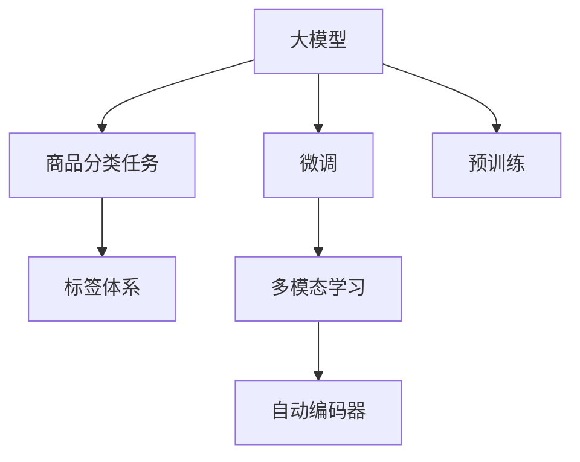

                 

# 大模型在商品标签体系构建中的应用

> 关键词：大模型,商品标签,标签体系,分类任务,模型训练,算法优化,模型评估,深度学习

## 1. 背景介绍

### 1.1 问题由来

在电子商务领域，商品标签体系是实现商品管理、搜索排序、推荐系统等核心功能的基础。一个科学合理的商品标签体系不仅能够帮助用户快速找到所需商品，还能提升平台的用户体验和销售转化率。然而，构建一个精细化的商品标签体系往往需要大量人工标注和手动维护，工作量巨大且容易出错。随着深度学习和大模型的兴起，通过机器学习自动构建商品标签体系，正成为一种高效、经济的方法。

### 1.2 问题核心关键点

构建商品标签体系的核心任务是对每个商品进行准确的分类。该任务通常称为商品分类任务。商品分类旨在将商品归入预先定义好的分类中，如食品、服装、电子产品等。大模型通过大规模无标签数据预训练，已经拥有了较强的语言理解和特征提取能力，可以进一步通过微调实现高效的商品分类任务。

具体来说，大模型在预训练阶段可以学习到商品描述、属性、图片等多种信息的语义表示，从而能够通过文本、图像等多种数据源进行多模态的信息融合，进而提升商品分类的准确性。微调则是在已预训练的大模型基础上，进一步对商品分类任务进行有监督训练，使模型能够适应特定的分类任务。

## 2. 核心概念与联系

### 2.1 核心概念概述

为更好地理解大模型在商品标签体系构建中的应用，本节将介绍几个密切相关的核心概念：

- 大模型(Large Model)：指如BERT、GPT-3等大规模预训练语言模型。通过在大量无标签数据上进行自监督学习，大模型已经具备了强大的语言理解能力，可以处理复杂的多模态数据。

- 商品分类(S的商品分类任务)：对商品进行分类的任务。通常通过商品描述、图片等数据源，将商品归入预先定义好的商品分类中，如食品、服装、电子产品等。

- 微调(Fine-Tuning)：在预训练模型的基础上，使用有标签的商品分类数据对模型进行进一步训练，以适应特定的商品分类任务。

- 多模态学习(Multi-Modal Learning)：指融合文本、图像、语音等多种信息源，提升模型的分类准确性。

- 自动编码器(Automatic Encoder)：将输入数据映射到低维隐空间，并重构回原数据的技术。在大模型中，自动编码器可以用于提取商品的多模态特征表示。

这些核心概念之间的逻辑关系可以通过以下Mermaid流程图来展示：



这个流程图展示了大模型在商品标签体系构建中的核心概念及其之间的关系：

1. 大模型通过预训练获得基础能力。
2. 微调使得大模型更好地适应商品分类任务，提升分类准确性。
3. 多模态学习融合文本、图像等数据源，增强模型表现。
4. 自动编码器提取特征，提升模型对数据的理解能力。
5. 标签体系是分类任务的最终输出，用于指导商品管理、搜索排序等业务应用。

## 3. 核心算法原理 & 具体操作步骤
### 3.1 算法原理概述

大模型在商品标签体系构建中的应用，本质上是将大模型作为通用的分类器，通过微调进一步适应特定的商品分类任务。具体而言，大模型在预训练阶段已经学习到了丰富的语义知识，可以通过商品描述、图片等多模态信息进行融合，构建商品的多维特征表示。然后在微调阶段，利用商品分类数据对模型进行有监督训练，从而实现商品分类的任务。

形式化地，假设大模型为 $M_{\theta}$，其中 $\theta$ 为预训练得到的模型参数。给定商品分类任务 $T$ 的标注数据集 $D=\{(x_i,y_i)\}_{i=1}^N$，其中 $x_i$ 为商品描述或图片，$y_i$ 为商品分类标签。微调的目标是找到最优的模型参数 $\hat{\theta}$，使得模型能够最小化分类误差，即：

$$
\hat{\theta}=\mathop{\arg\min}_{\theta} \mathcal{L}(M_{\theta},D)
$$

其中 $\mathcal{L}$ 为交叉熵损失函数，衡量模型输出与真实标签之间的差异。

### 3.2 算法步骤详解

基于大模型在商品标签体系构建中的应用，本节将详细讲解其核心算法步骤：

**Step 1: 准备预训练模型和数据集**
- 选择合适的预训练大模型，如BERT、GPT-3等。
- 准备商品分类任务的数据集，通常包含商品描述、图片等，标注为分类标签。

**Step 2: 添加任务适配层**
- 根据任务类型，在预训练模型顶层设计合适的输出层和损失函数。
- 对于分类任务，通常使用线性分类器和交叉熵损失函数。

**Step 3: 设置微调超参数**
- 选择合适的优化算法及其参数，如 AdamW、SGD 等，设置学习率、批大小、迭代轮数等。
- 设置正则化技术及强度，包括权重衰减、Dropout、Early Stopping 等。
- 确定冻结预训练参数的策略，如仅微调顶层，或全部参数都参与微调。

**Step 4: 执行梯度训练**
- 将训练集数据分批次输入模型，前向传播计算损失函数。
- 反向传播计算参数梯度，根据设定的优化算法和学习率更新模型参数。
- 周期性在验证集上评估模型性能，根据性能指标决定是否触发 Early Stopping。
- 重复上述步骤直到满足预设的迭代轮数或 Early Stopping 条件。

**Step 5: 测试和部署**
- 在测试集上评估微调后模型 $M_{\hat{\theta}}$ 的性能，对比微调前后的精度提升。
- 使用微调后的模型对新商品进行分类，集成到实际的商品管理系统中。

### 3.3 算法优缺点

基于大模型在商品标签体系构建中的应用，具有以下优点：
1. 高效性：大模型具有较强的特征提取能力，能够在较短时间内完成商品分类任务。
2. 泛化能力：通过预训练-微调流程，大模型能够适应多种商品分类任务，具备较好的泛化能力。
3. 多模态融合：可以融合文本、图片等多模态信息，提升商品分类的准确性。
4. 灵活性：可以针对不同的商品分类任务进行定制化的微调，实现任务特定优化。

同时，该方法也存在一定的局限性：
1. 标注数据需求：商品分类任务对标注数据的需求较高，标注成本较大。
2. 数据多样性：不同商品描述的语义差异较大，可能影响模型泛化性能。
3. 过拟合风险：在微调过程中，模型容易对训练数据过拟合，影响泛化能力。
4. 模型复杂性：大模型的参数量较大，需要较强的计算资源支持。

尽管存在这些局限性，但大模型在商品标签体系构建中的应用，已经展现了其强大的潜力和广泛的应用前景。

### 3.4 算法应用领域

基于大模型在商品标签体系构建中的应用，已经在电商、零售等多个领域得到广泛应用：

- 电商平台：用于商品分类、搜索排序、推荐系统等，提升用户体验和平台转化率。
- 零售行业：帮助商家实现库存管理、销售预测、供应链优化等，降低运营成本。
- 市场研究：用于消费者行为分析、市场趋势预测等，提供决策支持。

除了上述这些经典应用外，大模型在商品标签体系构建中还有更多创新性应用，如情感分析、关联规则挖掘等，为电商和零售领域带来了新的突破。随着大模型和微调方法的不断进步，相信商品标签体系构建技术将在更广阔的应用领域大放异彩。

## 4. 数学模型和公式 & 详细讲解  
### 4.1 数学模型构建

本节将使用数学语言对大模型在商品标签体系构建中的应用进行更加严格的刻画。

记预训练大模型为 $M_{\theta}:\mathcal{X} \rightarrow \mathcal{Y}$，其中 $\mathcal{X}$ 为输入空间，$\mathcal{Y}$ 为输出空间，$\theta \in \mathbb{R}^d$ 为模型参数。假设商品分类任务的训练集为 $D=\{(x_i,y_i)\}_{i=1}^N$，其中 $x_i$ 为商品描述或图片，$y_i$ 为商品分类标签。

定义模型 $M_{\theta}$ 在输入 $x$ 上的输出为 $\hat{y}=M_{\theta}(x)$，然后使用交叉熵损失函数衡量模型输出与真实标签之间的差异，即：

$$
\ell(M_{\theta}(x),y) = -[y\log M_{\theta}(x)+(1-y)\log(1-M_{\theta}(x))]
$$

在得到损失函数后，微调的目标是最小化经验风险，即：

$$
\mathcal{L}(\theta) = \frac{1}{N}\sum_{i=1}^N \ell(M_{\theta}(x_i),y_i)
$$

在实践中，我们通常使用基于梯度的优化算法（如SGD、Adam等）来近似求解上述最优化问题。设 $\eta$ 为学习率，$\lambda$ 为正则化系数，则参数的更新公式为：

$$
\theta \leftarrow \theta - \eta \nabla_{\theta}\mathcal{L}(\theta) - \eta\lambda\theta
$$

其中 $\nabla_{\theta}\mathcal{L}(\theta)$ 为损失函数对参数 $\theta$ 的梯度，可通过反向传播算法高效计算。

### 4.2 公式推导过程

以下我们以商品分类任务为例，推导交叉熵损失函数及其梯度的计算公式。

假设模型 $M_{\theta}$ 在输入 $x$ 上的输出为 $\hat{y}=M_{\theta}(x) \in [0,1]$，表示商品属于分类的概率。真实标签 $y \in \{0,1\}$。则二分类交叉熵损失函数定义为：

$$
\ell(M_{\theta}(x),y) = -[y\log \hat{y} + (1-y)\log (1-\hat{y})]
$$

将其代入经验风险公式，得：

$$
\mathcal{L}(\theta) = -\frac{1}{N}\sum_{i=1}^N [y_i\log M_{\theta}(x_i)+(1-y_i)\log(1-M_{\theta}(x_i))]
$$

根据链式法则，损失函数对参数 $\theta_k$ 的梯度为：

$$
\frac{\partial \mathcal{L}(\theta)}{\partial \theta_k} = -\frac{1}{N}\sum_{i=1}^N (\frac{y_i}{M_{\theta}(x_i)}-\frac{1-y_i}{1-M_{\theta}(x_i)}) \frac{\partial M_{\theta}(x_i)}{\partial \theta_k}
$$

其中 $\frac{\partial M_{\theta}(x_i)}{\partial \theta_k}$ 可进一步递归展开，利用自动微分技术完成计算。

在得到损失函数的梯度后，即可带入参数更新公式，完成模型的迭代优化。重复上述过程直至收敛，最终得到适应商品分类任务的最优模型参数 $\theta^*$。

## 5. 项目实践：代码实例和详细解释说明
### 5.1 开发环境搭建

在进行商品标签体系构建的微调实践前，我们需要准备好开发环境。以下是使用Python进行PyTorch开发的环境配置流程：

1. 安装Anaconda：从官网下载并安装Anaconda，用于创建独立的Python环境。

2. 创建并激活虚拟环境：
```bash
conda create -n pytorch-env python=3.8 
conda activate pytorch-env
```

3. 安装PyTorch：根据CUDA版本，从官网获取对应的安装命令。例如：
```bash
conda install pytorch torchvision torchaudio cudatoolkit=11.1 -c pytorch -c conda-forge
```

4. 安装Transformers库：
```bash
pip install transformers
```

5. 安装各类工具包：
```bash
pip install numpy pandas scikit-learn matplotlib tqdm jupyter notebook ipython
```

完成上述步骤后，即可在`pytorch-env`环境中开始微调实践。

### 5.2 源代码详细实现

下面我们以商品分类任务为例，给出使用Transformers库对BERT模型进行微调的PyTorch代码实现。

首先，定义商品分类任务的数据处理函数：

```python
from transformers import BertTokenizer
from torch.utils.data import Dataset
import torch

class ProductDataset(Dataset):
    def __init__(self, texts, tags, tokenizer, max_len=128):
        self.texts = texts
        self.tags = tags
        self.tokenizer = tokenizer
        self.max_len = max_len
        
    def __len__(self):
        return len(self.texts)
    
    def __getitem__(self, item):
        text = self.texts[item]
        tags = self.tags[item]
        
        encoding = self.tokenizer(text, return_tensors='pt', max_length=self.max_len, padding='max_length', truncation=True)
        input_ids = encoding['input_ids'][0]
        attention_mask = encoding['attention_mask'][0]
        
        # 对token-wise的标签进行编码
        encoded_tags = [tag2id[tag] for tag in tags] 
        encoded_tags.extend([tag2id['O']] * (self.max_len - len(encoded_tags)))
        labels = torch.tensor(encoded_tags, dtype=torch.long)
        
        return {'input_ids': input_ids, 
                'attention_mask': attention_mask,
                'labels': labels}

# 标签与id的映射
tag2id = {'O': 0, '电子产品': 1, '服装': 2, '食品': 3, '家居用品': 4}
id2tag = {v: k for k, v in tag2id.items()}

# 创建dataset
tokenizer = BertTokenizer.from_pretrained('bert-base-cased')

train_dataset = ProductDataset(train_texts, train_tags, tokenizer)
dev_dataset = ProductDataset(dev_texts, dev_tags, tokenizer)
test_dataset = ProductDataset(test_texts, test_tags, tokenizer)
```

然后，定义模型和优化器：

```python
from transformers import BertForTokenClassification, AdamW

model = BertForTokenClassification.from_pretrained('bert-base-cased', num_labels=len(tag2id))

optimizer = AdamW(model.parameters(), lr=2e-5)
```

接着，定义训练和评估函数：

```python
from torch.utils.data import DataLoader
from tqdm import tqdm
from sklearn.metrics import classification_report

device = torch.device('cuda') if torch.cuda.is_available() else torch.device('cpu')
model.to(device)

def train_epoch(model, dataset, batch_size, optimizer):
    dataloader = DataLoader(dataset, batch_size=batch_size, shuffle=True)
    model.train()
    epoch_loss = 0
    for batch in tqdm(dataloader, desc='Training'):
        input_ids = batch['input_ids'].to(device)
        attention_mask = batch['attention_mask'].to(device)
        labels = batch['labels'].to(device)
        model.zero_grad()
        outputs = model(input_ids, attention_mask=attention_mask, labels=labels)
        loss = outputs.loss
        epoch_loss += loss.item()
        loss.backward()
        optimizer.step()
    return epoch_loss / len(dataloader)

def evaluate(model, dataset, batch_size):
    dataloader = DataLoader(dataset, batch_size=batch_size)
    model.eval()
    preds, labels = [], []
    with torch.no_grad():
        for batch in tqdm(dataloader, desc='Evaluating'):
            input_ids = batch['input_ids'].to(device)
            attention_mask = batch['attention_mask'].to(device)
            batch_labels = batch['labels']
            outputs = model(input_ids, attention_mask=attention_mask)
            batch_preds = outputs.logits.argmax(dim=2).to('cpu').tolist()
            batch_labels = batch_labels.to('cpu').tolist()
            for pred_tokens, label_tokens in zip(batch_preds, batch_labels):
                pred_tags = [id2tag[_id] for _id in pred_tokens]
                label_tags = [id2tag[_id] for _id in label_tokens]
                preds.append(pred_tags[:len(label_tokens)])
                labels.append(label_tags)
                
    print(classification_report(labels, preds))
```

最后，启动训练流程并在测试集上评估：

```python
epochs = 5
batch_size = 16

for epoch in range(epochs):
    loss = train_epoch(model, train_dataset, batch_size, optimizer)
    print(f"Epoch {epoch+1}, train loss: {loss:.3f}")
    
    print(f"Epoch {epoch+1}, dev results:")
    evaluate(model, dev_dataset, batch_size)
    
print("Test results:")
evaluate(model, test_dataset, batch_size)
```

以上就是使用PyTorch对BERT进行商品分类任务微调的完整代码实现。可以看到，得益于Transformers库的强大封装，我们可以用相对简洁的代码完成BERT模型的加载和微调。

### 5.3 代码解读与分析

让我们再详细解读一下关键代码的实现细节：

**ProductDataset类**：
- `__init__`方法：初始化文本、标签、分词器等关键组件。
- `__len__`方法：返回数据集的样本数量。
- `__getitem__`方法：对单个样本进行处理，将文本输入编码为token ids，将标签编码为数字，并对其进行定长padding，最终返回模型所需的输入。

**tag2id和id2tag字典**：
- 定义了标签与数字id之间的映射关系，用于将token-wise的预测结果解码回真实的标签。

**训练和评估函数**：
- 使用PyTorch的DataLoader对数据集进行批次化加载，供模型训练和推理使用。
- 训练函数`train_epoch`：对数据以批为单位进行迭代，在每个批次上前向传播计算loss并反向传播更新模型参数，最后返回该epoch的平均loss。
- 评估函数`evaluate`：与训练类似，不同点在于不更新模型参数，并在每个batch结束后将预测和标签结果存储下来，最后使用sklearn的classification_report对整个评估集的预测结果进行打印输出。

**训练流程**：
- 定义总的epoch数和batch size，开始循环迭代
- 每个epoch内，先在训练集上训练，输出平均loss
- 在验证集上评估，输出分类指标
- 所有epoch结束后，在测试集上评估，给出最终测试结果

可以看到，PyTorch配合Transformers库使得BERT微调的代码实现变得简洁高效。开发者可以将更多精力放在数据处理、模型改进等高层逻辑上，而不必过多关注底层的实现细节。

当然，工业级的系统实现还需考虑更多因素，如模型的保存和部署、超参数的自动搜索、更灵活的任务适配层等。但核心的微调范式基本与此类似。

## 6. 实际应用场景
### 6.1 电商平台

基于大模型在商品标签体系构建中的应用，电商平台可以快速构建商品分类、搜索排序、推荐系统等核心功能，提升用户体验和平台转化率。具体应用如下：

1. 商品分类：通过商品描述、图片等多模态信息，使用大模型对商品进行分类，生成商品标签。
2. 搜索排序：根据用户的查询请求，使用大模型匹配商品标签，生成搜索结果排序。
3. 推荐系统：通过用户的历史行为数据，使用大模型对用户进行分类，生成个性化推荐商品列表。

### 6.2 零售行业

零售行业通过大模型对商品进行分类和推荐，可以优化库存管理、销售预测和供应链优化等业务流程，降低运营成本，提升运营效率。具体应用如下：

1. 库存管理：根据大模型对商品进行的分类，合理规划商品库存，减少库存积压和缺货现象。
2. 销售预测：通过历史销售数据和大模型对商品的预测，进行销售趋势分析，提前调整销售策略。
3. 供应链优化：根据大模型对商品进行分类，优化供应链上的物流和仓储，提升供应链效率。

### 6.3 市场研究

市场研究通过大模型对消费者行为进行分类和分析，可以提供更精准的市场预测和趋势分析。具体应用如下：

1. 消费者行为分析：根据消费者对商品的态度和反馈，使用大模型进行分类，生成消费者画像。
2. 市场趋势预测：使用大模型对市场数据进行分类和分析，生成市场趋势预测报告。

除了上述这些经典应用外，大模型在商品标签体系构建中还有更多创新性应用，如情感分析、关联规则挖掘等，为电商和零售领域带来了新的突破。随着大模型和微调方法的不断进步，相信商品标签体系构建技术将在更广阔的应用领域大放异彩。

## 7. 工具和资源推荐
### 7.1 学习资源推荐

为了帮助开发者系统掌握大模型在商品标签体系构建中的应用，这里推荐一些优质的学习资源：

1. 《Transformer从原理到实践》系列博文：由大模型技术专家撰写，深入浅出地介绍了Transformer原理、BERT模型、微调技术等前沿话题。

2. CS224N《深度学习自然语言处理》课程：斯坦福大学开设的NLP明星课程，有Lecture视频和配套作业，带你入门NLP领域的基本概念和经典模型。

3. 《Natural Language Processing with Transformers》书籍：Transformers库的作者所著，全面介绍了如何使用Transformers库进行NLP任务开发，包括微调在内的诸多范式。

4. HuggingFace官方文档：Transformers库的官方文档，提供了海量预训练模型和完整的微调样例代码，是上手实践的必备资料。

5. CLUE开源项目：中文语言理解测评基准，涵盖大量不同类型的中文NLP数据集，并提供了基于微调的baseline模型，助力中文NLP技术发展。

通过对这些资源的学习实践，相信你一定能够快速掌握大模型在商品标签体系构建中的精髓，并用于解决实际的NLP问题。
###  7.2 开发工具推荐

高效的开发离不开优秀的工具支持。以下是几款用于大模型在商品标签体系构建中微调开发的常用工具：

1. PyTorch：基于Python的开源深度学习框架，灵活动态的计算图，适合快速迭代研究。大部分预训练语言模型都有PyTorch版本的实现。

2. TensorFlow：由Google主导开发的开源深度学习框架，生产部署方便，适合大规模工程应用。同样有丰富的预训练语言模型资源。

3. Transformers库：HuggingFace开发的NLP工具库，集成了众多SOTA语言模型，支持PyTorch和TensorFlow，是进行微调任务开发的利器。

4. Weights & Biases：模型训练的实验跟踪工具，可以记录和可视化模型训练过程中的各项指标，方便对比和调优。与主流深度学习框架无缝集成。

5. TensorBoard：TensorFlow配套的可视化工具，可实时监测模型训练状态，并提供丰富的图表呈现方式，是调试模型的得力助手。

6. Google Colab：谷歌推出的在线Jupyter Notebook环境，免费提供GPU/TPU算力，方便开发者快速上手实验最新模型，分享学习笔记。

合理利用这些工具，可以显著提升大模型在商品标签体系构建中的开发效率，加快创新迭代的步伐。

### 7.3 相关论文推荐

大模型在商品标签体系构建中的应用，源于学界的持续研究。以下是几篇奠基性的相关论文，推荐阅读：

1. Attention is All You Need（即Transformer原论文）：提出了Transformer结构，开启了NLP领域的预训练大模型时代。

2. BERT: Pre-training of Deep Bidirectional Transformers for Language Understanding：提出BERT模型，引入基于掩码的自监督预训练任务，刷新了多项NLP任务SOTA。

3. Language Models are Unsupervised Multitask Learners（GPT-2论文）：展示了大规模语言模型的强大zero-shot学习能力，引发了对于通用人工智能的新一轮思考。

4. Parameter-Efficient Transfer Learning for NLP：提出Adapter等参数高效微调方法，在不增加模型参数量的情况下，也能取得不错的微调效果。

5. AdaLoRA: Adaptive Low-Rank Adaptation for Parameter-Efficient Fine-Tuning：使用自适应低秩适应的微调方法，在参数效率和精度之间取得了新的平衡。

这些论文代表了大模型在商品标签体系构建中的应用的研究方向。通过学习这些前沿成果，可以帮助研究者把握学科前进方向，激发更多的创新灵感。

## 8. 总结：未来发展趋势与挑战

### 8.1 总结

本文对大模型在商品标签体系构建中的应用进行了全面系统的介绍。首先阐述了大模型和微调技术的研究背景和意义，明确了大模型在商品分类任务中的应用价值。其次，从原理到实践，详细讲解了大模型在商品分类任务中的数学模型和核心算法步骤，给出了微调任务开发的完整代码实例。同时，本文还广泛探讨了大模型在电商平台、零售行业、市场研究等多个行业领域的应用前景，展示了微调范式的巨大潜力。此外，本文精选了微调技术的各类学习资源，力求为读者提供全方位的技术指引。

通过本文的系统梳理，可以看到，基于大模型的微调方法在商品分类任务中已经取得了显著效果，并在电商、零售等多个领域展现了广泛的应用前景。未来，随着大模型和微调方法的不断进步，商品标签体系构建技术将在更广阔的应用领域大放异彩，深刻影响人类的生产生活方式。

### 8.2 未来发展趋势

展望未来，大模型在商品标签体系构建中呈现以下几个发展趋势：

1. 模型规模持续增大。随着算力成本的下降和数据规模的扩张，预训练大模型的参数量还将持续增长。超大模型蕴含的丰富语义知识，将进一步提升商品分类的准确性。

2. 微调方法日趋多样。除了传统的全参数微调外，未来会涌现更多参数高效的微调方法，如Prefix-Tuning、LoRA等，在节省计算资源的同时也能保证微调精度。

3. 持续学习成为常态。随着数据分布的不断变化，微调模型也需要持续学习新知识以保持性能。如何在不遗忘原有知识的同时，高效吸收新样本信息，将成为重要的研究课题。

4. 标注样本需求降低。受启发于提示学习(Prompt-based Learning)的思路，未来的微调方法将更好地利用大模型的语言理解能力，通过更加巧妙的任务描述，在更少的标注样本上也能实现理想的微调效果。

5. 模型通用性增强。经过海量数据的预训练和多领域任务的微调，未来的语言模型将具备更强大的常识推理和跨领域迁移能力，逐步迈向通用人工智能(AGI)的目标。

以上趋势凸显了大模型在商品标签体系构建中的广阔前景。这些方向的探索发展，必将进一步提升NLP系统的性能和应用范围，为电商和零售领域带来新的突破。

### 8.3 面临的挑战

尽管大模型在商品标签体系构建中已经取得了瞩目成就，但在迈向更加智能化、普适化应用的过程中，它仍面临着诸多挑战：

1. 标注成本瓶颈。虽然微调大大降低了标注数据的需求，但对于长尾应用场景，难以获得充足的高质量标注数据，成为制约微调性能的瓶颈。如何进一步降低微调对标注样本的依赖，将是一大难题。

2. 数据多样性。不同商品描述的语义差异较大，可能影响模型泛化性能。如何在不同商品描述之间进行有效对齐，提升模型对不同描述的识别能力，还需要更多理论和实践的积累。

3. 过拟合风险。在微调过程中，模型容易对训练数据过拟合，影响泛化能力。如何缓解过拟合风险，提升模型的泛化能力，还需要更多的技术探索。

4. 模型复杂性。大模型的参数量较大，需要较强的计算资源支持。如何优化模型结构，提升模型的计算效率，还需要更多的算法创新。

尽管存在这些挑战，但大模型在商品标签体系构建中的应用，已经展现了其强大的潜力和广泛的应用前景。相信随着学界和产业界的共同努力，这些挑战终将一一被克服，大模型在商品标签体系构建中必将在构建人机协同的智能时代中扮演越来越重要的角色。

### 8.4 研究展望

面向未来，大模型在商品标签体系构建中的应用研究需要在以下几个方面寻求新的突破：

1. 探索无监督和半监督微调方法。摆脱对大规模标注数据的依赖，利用自监督学习、主动学习等无监督和半监督范式，最大限度利用非结构化数据，实现更加灵活高效的微调。

2. 研究参数高效和计算高效的微调范式。开发更加参数高效的微调方法，在固定大部分预训练参数的同时，只更新极少量的任务相关参数。同时优化微调模型的计算图，减少前向传播和反向传播的资源消耗，实现更加轻量级、实时性的部署。

3. 融合因果和对比学习范式。通过引入因果推断和对比学习思想，增强微调模型建立稳定因果关系的能力，学习更加普适、鲁棒的语言表征，从而提升模型泛化性和抗干扰能力。

4. 引入更多先验知识。将符号化的先验知识，如知识图谱、逻辑规则等，与神经网络模型进行巧妙融合，引导微调过程学习更准确、合理的语言模型。同时加强不同模态数据的整合，实现视觉、语音等多模态信息与文本信息的协同建模。

5. 结合因果分析和博弈论工具。将因果分析方法引入微调模型，识别出模型决策的关键特征，增强输出解释的因果性和逻辑性。借助博弈论工具刻画人机交互过程，主动探索并规避模型的脆弱点，提高系统稳定性。

6. 纳入伦理道德约束。在模型训练目标中引入伦理导向的评估指标，过滤和惩罚有偏见、有害的输出倾向。同时加强人工干预和审核，建立模型行为的监管机制，确保输出符合人类价值观和伦理道德。

这些研究方向的探索，必将引领大模型在商品标签体系构建中走向更高的台阶，为构建安全、可靠、可解释、可控的智能系统铺平道路。面向未来，大模型在商品标签体系构建中还需要与其他人工智能技术进行更深入的融合，如知识表示、因果推理、强化学习等，多路径协同发力，共同推动自然语言理解和智能交互系统的进步。只有勇于创新、敢于突破，才能不断拓展语言模型的边界，让智能技术更好地造福人类社会。

## 9. 附录：常见问题与解答

**Q1：大模型在商品分类任务中是否适用于所有商品描述？**

A: 大模型在商品分类任务中对商品描述的要求较高。不同商品描述的语义差异较大，如果描述不规范或过于模糊，可能导致分类结果不准确。因此，需要根据具体商品类别，制定标准化的商品描述规范，确保描述清晰、一致。

**Q2：如何处理长尾商品的分类问题？**

A: 长尾商品的分类问题通常更难解决，因为它们出现的频率较低，标注数据较少。一种常见的方法是使用迁移学习，即在多商品分类任务上微调大模型，再针对长尾商品进行微调，从而获得更好的分类效果。此外，可以考虑引入半监督学习、无监督学习等方法，利用未标注数据进行辅助学习，提升分类性能。

**Q3：如何提高大模型的泛化能力？**

A: 提高大模型的泛化能力需要从多个方面进行改进：
1. 数据多样性：收集多样化的商品描述数据，确保模型能够学习到不同的描述方式和语义。
2. 正则化技术：引入Dropout、L2正则化等技术，防止模型过拟合。
3. 对抗训练：加入对抗样本，提升模型鲁棒性，从而提高泛化能力。
4. 多任务学习：同时进行多个商品分类任务，增强模型的泛化能力。
5. 参数高效微调：只调整少量参数，保留大部分预训练权重，避免过拟合。

**Q4：大模型在商品分类任务中的计算效率如何？**

A: 大模型在商品分类任务中的计算效率取决于具体模型和硬件配置。由于大模型参数量较大，在计算资源有限的情况下，可能需要采用GPU、TPU等高性能设备进行加速。同时，可以通过剪枝、量化、模型压缩等技术，优化模型的计算效率，提升推理速度。

**Q5：大模型在商品分类任务中的可解释性如何？**

A: 大模型在商品分类任务中的可解释性相对较差，因为其内部机理复杂，难以直接解释输出。为了提升模型的可解释性，可以考虑使用基于提示学习的微调方法，通过巧妙的任务描述，使得模型输出具有一定的可解释性。此外，还可以结合因果分析、知识图谱等方法，增强模型的可解释性。

通过以上分析，我们可以看到，大模型在商品标签体系构建中的应用已经展现出了巨大的潜力和广泛的应用前景。随着大模型和微调方法的不断进步，相信商品标签体系构建技术将在更广阔的应用领域大放异彩，深刻影响人类的生产生活方式。

