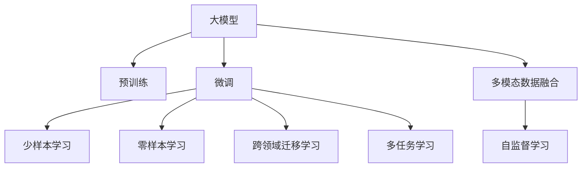

                 

## 1. 背景介绍

### 1.1 问题由来
随着互联网的迅猛发展，用户对个性化推荐的需求日益增长。推荐系统已成为各大互联网平台不可或缺的一部分，通过分析用户的历史行为数据，为用户推荐感兴趣的物品，如商品、音乐、视频等，极大地提升了用户体验和平台价值。然而，传统的推荐算法往往依赖于用户的历史点击记录，难以充分利用文本、图片、视频等丰富多变的用户行为数据。近年来，随着大模型技术的发展，预训练模型已成为推荐系统的重要工具，显著提升了推荐系统的精度和多样性。

### 1.2 问题核心关键点
当前，大模型在推荐系统中的应用主要集中在文本推荐领域，通过预训练模型学习丰富的语言知识，对用户文本描述进行编码，生成推荐结果。其核心在于：

1. **多模态数据融合**：除了传统的用户行为数据，通过文本推荐可以整合用户评论、标签、描述等文本信息，提升推荐结果的准确性和多样性。
2. **泛化性强**：大模型可以在大规模无标签文本数据上进行预训练，具备较强的泛化能力，对长尾用户和物品具有更好的适应性。
3. **多任务学习**：大模型可以在训练过程中同时学习多个任务，如文本分类、实体识别等，进一步提升推荐系统的综合能力。

### 1.3 问题研究意义
大模型在推荐系统中的应用，为推荐系统带来了新的技术突破，显著提升了推荐系统的精度和用户满意度。其主要研究意义包括：

1. **增强推荐系统泛化能力**：利用大模型学习多模态数据，能够处理更加多样化的用户行为，提升推荐系统的普适性。
2. **降低推荐成本**：相比传统推荐系统需要大量人工标注数据，大模型的预训练过程可以通过大规模无标签数据自动完成，节省了大量的标注成本。
3. **促进推荐技术创新**：大模型的引入为推荐系统提供了新的优化思路和算法设计，加速了推荐技术的创新发展。
4. **推动个性化推荐升级**：通过大模型在预训练阶段学习到的丰富知识，推荐系统能够更好地理解用户兴趣和物品属性，实现更精准的个性化推荐。

## 2. 核心概念与联系

### 2.1 核心概念概述

为更好地理解大模型在推荐系统中的应用，本节将介绍几个密切相关的核心概念：

- **大模型(Large Model)**：以Transformer为代表的预训练大模型，能够通过大规模无标签数据进行自监督学习，学习到丰富的语言知识。常用的预训练模型包括BERT、GPT等。

- **推荐系统(Recommendation System)**：通过分析用户的历史行为数据，为用户推荐感兴趣的物品的系统。推荐系统可以分为基于协同过滤、内容推荐、混合推荐等多种方式。

- **多模态数据融合(Multimodal Data Fusion)**：将不同类型的用户行为数据，如文本、图片、视频等，整合到一个统一的框架中进行处理，提升推荐结果的全面性和准确性。

- **自监督学习(Self-Supervised Learning)**：通过利用大规模无标签数据进行预训练，学习模型的隐含表示，增强模型对各类数据结构的理解。

- **少样本学习(Few-shot Learning)**：在只有少量标注样本的情况下，模型能够快速适应新任务的学习方法。在大模型微调过程中，可以通过少样本学习来提升模型的泛化能力。

- **零样本学习(Zero-shot Learning)**：模型在没有见过任何特定任务的情况下，仅凭任务描述就能够执行新任务的能力。在大模型中，可以通过预训练的知识来支持零样本学习。

- **跨领域迁移学习(Cross-domain Transfer Learning)**：将一个领域学习到的知识，迁移到另一个不同但相关的领域。在大模型微调中，可以通过迁移学习来提高模型在不同场景下的适应性。

- **多任务学习(Multi-task Learning)**：在训练过程中，模型同时学习多个任务，提升模型在不同任务上的性能。在大模型微调中，可以通过多任务学习来增强模型的综合能力。

这些核心概念之间的逻辑关系可以通过以下Mermaid流程图来展示：



这个流程图展示了大模型在推荐系统中的应用过程：

1. 大模型通过预训练获得基础能力。
2. 微调是对预训练模型进行任务特定的优化，可以提升模型在特定任务上的性能。
3. 少样本学习和零样本学习可以在微调中使用，提升模型在不同场景下的泛化能力。
4. 跨领域迁移学习和多任务学习可以增强模型的综合能力，使其在不同任务上表现更佳。
5. 多模态数据融合将不同类型的数据整合，提升推荐系统的全面性和准确性。
6. 自监督学习利用无标签数据进行预训练，学习模型的隐含表示。

这些概念共同构成了大模型在推荐系统中的学习框架，使其能够处理各种复杂多样的用户行为数据，提升推荐系统的性能。

## 3. 核心算法原理 & 具体操作步骤
### 3.1 算法原理概述

大模型在推荐系统中的应用，主要通过微调算法实现。其核心思想是：将预训练大模型视为一个强大的特征提取器，通过微调算法在推荐任务上进行优化，使得模型输出能够匹配任务标签，从而获得针对特定任务优化的推荐模型。

形式化地，假设预训练模型为 $M_{\theta}$，其中 $\theta$ 为预训练得到的模型参数。给定推荐任务 $T$ 的标注数据集 $D=\{(x_i, y_i)\}_{i=1}^N$，微调的目标是找到新的模型参数 $\hat{\theta}$，使得：

$$
\hat{\theta}=\mathop{\arg\min}_{\theta} \mathcal{L}(M_{\theta},D)
$$

其中 $\mathcal{L}$ 为针对任务 $T$ 设计的损失函数，用于衡量模型预测输出与真实标签之间的差异。常见的损失函数包括交叉熵损失、均方误差损失等。

通过梯度下降等优化算法，微调过程不断更新模型参数 $\theta$，最小化损失函数 $\mathcal{L}$，使得模型输出逼近真实标签。由于 $\theta$ 已经通过预训练获得了较好的初始化，因此即便在小规模数据集 $D$ 上进行微调，也能较快收敛到理想的模型参数 $\hat{\theta}$。

### 3.2 算法步骤详解

基于大模型在推荐系统中的应用，本节将详细介绍推荐任务微调的一般步骤：

**Step 1: 准备预训练模型和数据集**
- 选择合适的预训练语言模型 $M_{\theta}$ 作为初始化参数，如 BERT、GPT 等。
- 准备推荐任务 $T$ 的标注数据集 $D$，划分为训练集、验证集和测试集。一般要求标注数据与预训练数据的分布不要差异过大。

**Step 2: 添加推荐适配层**
- 根据推荐任务类型，在预训练模型顶层设计合适的输出层和损失函数。
- 对于点击率预测任务，通常在顶层添加线性分类器和二元交叉熵损失函数。
- 对于物品排名任务，通常使用语言模型的解码器输出概率分布，并以负对数似然为损失函数。

**Step 3: 设置微调超参数**
- 选择合适的优化算法及其参数，如 AdamW、SGD 等，设置学习率、批大小、迭代轮数等。
- 设置正则化技术及强度，包括权重衰减、Dropout、Early Stopping等。
- 确定冻结预训练参数的策略，如仅微调顶层，或全部参数都参与微调。

**Step 4: 执行梯度训练**
- 将训练集数据分批次输入模型，前向传播计算损失函数。
- 反向传播计算参数梯度，根据设定的优化算法和学习率更新模型参数。
- 周期性在验证集上评估模型性能，根据性能指标决定是否触发 Early Stopping。
- 重复上述步骤直到满足预设的迭代轮数或 Early Stopping 条件。

**Step 5: 测试和部署**
- 在测试集上评估微调后模型 $M_{\hat{\theta}}$ 的性能，对比微调前后的精度提升。
- 使用微调后的模型对新样本进行推理预测，集成到实际的应用系统中。
- 持续收集新的数据，定期重新微调模型，以适应数据分布的变化。

以上是基于大模型在推荐系统中的应用的一般流程。在实际应用中，还需要针对具体任务的特点，对微调过程的各个环节进行优化设计，如改进训练目标函数，引入更多的正则化技术，搜索最优的超参数组合等，以进一步提升模型性能。

### 3.3 算法优缺点

大模型在推荐系统中的应用，具有以下优点：
1. **特征提取能力强**：大模型通过预训练学习到丰富的语言知识，能够高效地提取推荐任务中的关键特征。
2. **泛化能力强**：大模型具备较强的泛化能力，对长尾用户和物品具有更好的适应性。
3. **模型可解释性强**：大模型的隐含表示能够提供丰富的特征信息，有助于理解推荐结果的生成机制。
4. **适用性广**：大模型可以在多种推荐场景中使用，如商品推荐、新闻推荐、音乐推荐等。
5. **迭代优化方便**：微调算法简单高效，可以通过少量的标注数据快速训练模型，提升推荐精度。

同时，该方法也存在一定的局限性：
1. **计算成本高**：大模型的预训练和微调过程需要大量的计算资源，增加了系统部署成本。
2. **训练时间较长**：大模型参数量大，训练时间较长，可能影响推荐系统的实时性。
3. **依赖标注数据**：微调过程需要大量的标注数据，获取高质量标注数据可能成为瓶颈。
4. **模型复杂度高**：大模型参数多，结构复杂，不易调试和维护。

尽管存在这些局限性，但就目前而言，大模型在推荐系统中的应用仍是大数据时代的最佳选择。未来相关研究的重点在于如何进一步降低计算成本，缩短训练时间，优化模型结构，以适应更广泛的应用场景。

### 3.4 算法应用领域

大模型在推荐系统中的应用领域非常广泛，包括但不限于：

- **商品推荐**：基于用户的历史点击记录、评分数据和商品描述，推荐用户可能感兴趣的商品。
- **音乐推荐**：根据用户的历史听歌记录和评论，推荐符合用户口味的歌曲和音乐人。
- **新闻推荐**：根据用户的历史阅读记录和评论，推荐用户可能感兴趣的新闻和文章。
- **视频推荐**：根据用户的历史观看记录和评论，推荐符合用户兴趣的视频和频道。
- **个性化广告**：基于用户的浏览记录和行为数据，推荐相关性高的广告。
- **电影推荐**：根据用户的历史观看记录和评论，推荐用户可能感兴趣的电影和剧集。

除了这些经典的推荐场景外，大模型还将在更多新兴领域得到应用，如虚拟现实推荐、智能家居推荐等，为推荐系统带来新的突破。

## 4. 数学模型和公式 & 详细讲解  
### 4.1 数学模型构建

本节将使用数学语言对基于大模型在推荐系统中的应用进行更加严格的刻画。

记预训练语言模型为 $M_{\theta}$，其中 $\theta$ 为预训练得到的模型参数。假设推荐任务 $T$ 的训练集为 $D=\{(x_i, y_i)\}_{i=1}^N$，其中 $x_i$ 为推荐样本，$y_i$ 为推荐标签，表示样本是否被用户点击或购买。

定义模型 $M_{\theta}$ 在数据样本 $(x,y)$ 上的损失函数为 $\ell(M_{\theta}(x),y)$，则在数据集 $D$ 上的经验风险为：

$$
\mathcal{L}(\theta) = \frac{1}{N}\sum_{i=1}^N \ell(M_{\theta}(x_i),y_i)
$$

微调的优化目标是最小化经验风险，即找到最优参数：

$$
\theta^* = \mathop{\arg\min}_{\theta} \mathcal{L}(\theta)
$$

在实践中，我们通常使用基于梯度的优化算法（如SGD、Adam等）来近似求解上述最优化问题。设 $\eta$ 为学习率，$\lambda$ 为正则化系数，则参数的更新公式为：

$$
\theta \leftarrow \theta - \eta \nabla_{\theta}\mathcal{L}(\theta) - \eta\lambda\theta
$$

其中 $\nabla_{\theta}\mathcal{L}(\theta)$ 为损失函数对参数 $\theta$ 的梯度，可通过反向传播算法高效计算。

### 4.2 公式推导过程

以下我们以点击率预测任务为例，推导交叉熵损失函数及其梯度的计算公式。

假设模型 $M_{\theta}$ 在输入 $x$ 上的输出为 $\hat{y}=M_{\theta}(x) \in [0,1]$，表示样本被用户点击的概率。真实标签 $y \in \{0,1\}$。则二分类交叉熵损失函数定义为：

$$
\ell(M_{\theta}(x),y) = -[y\log \hat{y} + (1-y)\log (1-\hat{y})]
$$

将其代入经验风险公式，得：

$$
\mathcal{L}(\theta) = -\frac{1}{N}\sum_{i=1}^N [y_i\log M_{\theta}(x_i)+(1-y_i)\log(1-M_{\theta}(x_i))]
$$

根据链式法则，损失函数对参数 $\theta_k$ 的梯度为：

$$
\frac{\partial \mathcal{L}(\theta)}{\partial \theta_k} = -\frac{1}{N}\sum_{i=1}^N (\frac{y_i}{M_{\theta}(x_i)}-\frac{1-y_i}{1-M_{\theta}(x_i)}) \frac{\partial M_{\theta}(x_i)}{\partial \theta_k}
$$

其中 $\frac{\partial M_{\theta}(x_i)}{\partial \theta_k}$ 可进一步递归展开，利用自动微分技术完成计算。

在得到损失函数的梯度后，即可带入参数更新公式，完成模型的迭代优化。重复上述过程直至收敛，最终得到适应推荐任务的最优模型参数 $\theta^*$。

## 5. 项目实践：代码实例和详细解释说明
### 5.1 开发环境搭建

在进行推荐任务微调实践前，我们需要准备好开发环境。以下是使用Python进行PyTorch开发的环境配置流程：

1. 安装Anaconda：从官网下载并安装Anaconda，用于创建独立的Python环境。

2. 创建并激活虚拟环境：
```bash
conda create -n pytorch-env python=3.8 
conda activate pytorch-env
```

3. 安装PyTorch：根据CUDA版本，从官网获取对应的安装命令。例如：
```bash
conda install pytorch torchvision torchaudio cudatoolkit=11.1 -c pytorch -c conda-forge
```

4. 安装Transformers库：
```bash
pip install transformers
```

5. 安装各类工具包：
```bash
pip install numpy pandas scikit-learn matplotlib tqdm jupyter notebook ipython
```

完成上述步骤后，即可在`pytorch-env`环境中开始推荐任务微调实践。

### 5.2 源代码详细实现

下面我以点击率预测任务为例，给出使用Transformers库对BERT模型进行推荐任务微调的PyTorch代码实现。

首先，定义推荐任务的数据处理函数：

```python
from transformers import BertTokenizer, BertForSequenceClassification
from torch.utils.data import Dataset
import torch

class RecommendationDataset(Dataset):
    def __init__(self, texts, clicks, tokenizer, max_len=128):
        self.texts = texts
        self.clicks = clicks
        self.tokenizer = tokenizer
        self.max_len = max_len
        
    def __len__(self):
        return len(self.texts)
    
    def __getitem__(self, item):
        text = self.texts[item]
        click = self.clicks[item]
        
        encoding = self.tokenizer(text, return_tensors='pt', max_length=self.max_len, padding='max_length', truncation=True)
        input_ids = encoding['input_ids'][0]
        attention_mask = encoding['attention_mask'][0]
        
        # 对clicks进行编码
        encoded_clicks = click.to(torch.float32)
        
        return {'input_ids': input_ids, 
                'attention_mask': attention_mask,
                'labels': encoded_clicks}

# 定义clicks的编码
encoded_clicks = {0: 0, 1: 1}

# 创建dataset
tokenizer = BertTokenizer.from_pretrained('bert-base-cased')

train_dataset = RecommendationDataset(train_texts, train_clicks, tokenizer)
dev_dataset = RecommendationDataset(dev_texts, dev_clicks, tokenizer)
test_dataset = RecommendationDataset(test_texts, test_clicks, tokenizer)
```

然后，定义模型和优化器：

```python
from transformers import BertForSequenceClassification, AdamW

model = BertForSequenceClassification.from_pretrained('bert-base-cased', num_labels=2)

optimizer = AdamW(model.parameters(), lr=2e-5)
```

接着，定义训练和评估函数：

```python
from torch.utils.data import DataLoader
from tqdm import tqdm
from sklearn.metrics import roc_auc_score

device = torch.device('cuda') if torch.cuda.is_available() else torch.device('cpu')
model.to(device)

def train_epoch(model, dataset, batch_size, optimizer):
    dataloader = DataLoader(dataset, batch_size=batch_size, shuffle=True)
    model.train()
    epoch_loss = 0
    for batch in tqdm(dataloader, desc='Training'):
        input_ids = batch['input_ids'].to(device)
        attention_mask = batch['attention_mask'].to(device)
        labels = batch['labels'].to(device)
        model.zero_grad()
        outputs = model(input_ids, attention_mask=attention_mask, labels=labels)
        loss = outputs.loss
        epoch_loss += loss.item()
        loss.backward()
        optimizer.step()
    return epoch_loss / len(dataloader)

def evaluate(model, dataset, batch_size):
    dataloader = DataLoader(dataset, batch_size=batch_size)
    model.eval()
    preds, labels = [], []
    with torch.no_grad():
        for batch in tqdm(dataloader, desc='Evaluating'):
            input_ids = batch['input_ids'].to(device)
            attention_mask = batch['attention_mask'].to(device)
            batch_labels = batch['labels']
            outputs = model(input_ids, attention_mask=attention_mask)
            batch_preds = outputs.logits.argmax(dim=1).to('cpu').tolist()
            batch_labels = batch_labels.to('cpu').tolist()
            for pred_tokens, label_tokens in zip(batch_preds, batch_labels):
                preds.append(pred_tokens)
                labels.append(label_tokens)
                
    print("AUC: ", roc_auc_score(labels, preds))
```

最后，启动训练流程并在测试集上评估：

```python
epochs = 5
batch_size = 16

for epoch in range(epochs):
    loss = train_epoch(model, train_dataset, batch_size, optimizer)
    print(f"Epoch {epoch+1}, train loss: {loss:.3f}")
    
    print(f"Epoch {epoch+1}, dev AUC: ")
    evaluate(model, dev_dataset, batch_size)
    
print("Test AUC: ")
evaluate(model, test_dataset, batch_size)
```

以上就是使用PyTorch对BERT进行推荐任务微调的完整代码实现。可以看到，得益于Transformers库的强大封装，我们可以用相对简洁的代码完成BERT模型的加载和微调。

### 5.3 代码解读与分析

让我们再详细解读一下关键代码的实现细节：

**RecommendationDataset类**：
- `__init__`方法：初始化文本、点击记录、分词器等关键组件。
- `__len__`方法：返回数据集的样本数量。
- `__getitem__`方法：对单个样本进行处理，将文本输入编码为token ids，将点击记录转换为数值标签，并对其进行定长padding，最终返回模型所需的输入。

**encoded_clicks字典**：
- 定义了点击记录与数值标签之间的映射关系，用于将点击记录编码为模型可以理解的数值。

**训练和评估函数**：
- 使用PyTorch的DataLoader对数据集进行批次化加载，供模型训练和推理使用。
- 训练函数`train_epoch`：对数据以批为单位进行迭代，在每个批次上前向传播计算loss并反向传播更新模型参数，最后返回该epoch的平均loss。
- 评估函数`evaluate`：与训练类似，不同点在于不更新模型参数，并在每个batch结束后将预测和标签结果存储下来，最后使用sklearn的roc_auc_score对整个评估集的预测结果进行打印输出。

**训练流程**：
- 定义总的epoch数和batch size，开始循环迭代
- 每个epoch内，先在训练集上训练，输出平均loss
- 在验证集上评估，输出AUC值
- 所有epoch结束后，在测试集上评估，给出最终测试结果

可以看到，PyTorch配合Transformers库使得BERT微调的代码实现变得简洁高效。开发者可以将更多精力放在数据处理、模型改进等高层逻辑上，而不必过多关注底层的实现细节。

当然，工业级的系统实现还需考虑更多因素，如模型的保存和部署、超参数的自动搜索、更灵活的任务适配层等。但核心的微调范式基本与此类似。

## 6. 实际应用场景
### 6.1 电商推荐系统

基于大模型在推荐系统中的应用，电商推荐系统可以更加精准地为用户推荐商品。传统电商推荐系统往往依赖于用户的历史点击记录，难以捕捉用户的真实兴趣和需求。而使用微调后的推荐模型，能够从用户评论、评分、属性等多个维度综合分析用户偏好，提供更加个性化和多样化的商品推荐。

在技术实现上，可以收集用户的历史购物记录、评论、评分等数据，提取商品标题、描述、属性等文本信息。将文本信息作为模型输入，用户的后续行为（如是否点击、购买等）作为监督信号，在此基础上对预训练语言模型进行微调。微调后的模型能够从文本中提取关键特征，预测用户是否会对某商品感兴趣，从而生成推荐列表。

### 6.2 内容推荐平台

内容推荐平台（如视频、音乐、新闻等）也受益于大模型在推荐系统中的应用。用户在不同平台上的行为数据往往呈现跨平台的特性，大模型可以通过多任务学习，同时学习不同平台的推荐任务，提供更加全面和准确的推荐结果。

以视频推荐为例，可以将用户在YouTube上的观看历史、评分、评论等数据作为训练集，在训练过程中同时学习视频推荐和频道推荐两个任务。微调后的模型可以综合考虑用户行为和视频属性，生成更加符合用户兴趣的视频推荐结果。

### 6.3 游戏推荐系统

游戏推荐系统通过收集用户的游戏行为数据，为用户推荐适合的游戏。传统的游戏推荐系统往往依赖于用户的游戏时长、成就等级等行为数据，难以捕捉用户的实际兴趣。而使用微调后的推荐模型，能够从游戏评论、评分、玩家社区等多个维度综合分析用户偏好，提供更加精准的游戏推荐。

在游戏推荐中，可以将用户的游戏行为数据、评论、评分等文本信息作为模型输入，用户的后续行为（如是否下载、购买等）作为监督信号，在此基础上对预训练语言模型进行微调。微调后的模型能够从文本中提取关键特征，预测用户是否会对某游戏感兴趣，从而生成推荐列表。

### 6.4 未来应用展望

随着大模型和推荐系统技术的不断发展，基于大模型的推荐应用将更加广泛。未来，推荐系统将在更多领域得到应用，为各行各业带来新的变革：

- **智能家居推荐**：通过收集用户的家居行为数据，推荐智能家居设备，提升用户的生活质量。
- **健康推荐**：基于用户的健康数据，推荐合适的医疗产品、健康方案，辅助用户管理健康。
- **旅游推荐**：通过收集用户的旅游行为数据，推荐适合的旅游目的地、景点、酒店，提升用户的旅游体验。
- **教育推荐**：根据学生的学习数据，推荐适合的学习资源、课程，提高学习效果。
- **交通推荐**：基于用户的出行数据，推荐最佳的出行方案、路线，优化交通流量。

除了这些应用场景外，大模型在推荐系统中的应用还在不断拓展，为各行业带来更多的创新和机遇。相信随着技术的不断进步，大模型推荐系统将成为各领域智能化升级的重要引擎。

## 7. 工具和资源推荐
### 7.1 学习资源推荐

为了帮助开发者系统掌握大模型在推荐系统中的应用理论基础和实践技巧，这里推荐一些优质的学习资源：

1. 《深度学习推荐系统》书籍：详细介绍了深度学习在推荐系统中的应用，包括基于大模型的推荐方法。

2. CS229《机器学习》课程：斯坦福大学开设的经典课程，涵盖机器学习的基础知识和推荐系统的设计原理。

3. 《Recommender Systems in Action》书籍：由推荐系统领域专家撰写，介绍推荐系统的实际应用和算法设计。

4. Kaggle推荐系统竞赛：参加Kaggle上的推荐系统竞赛，实践推荐算法设计，提升推荐系统的综合能力。

5. HuggingFace官方文档：Transformer库的官方文档，提供了海量预训练模型和推荐任务微调的样例代码。

通过对这些资源的学习实践，相信你一定能够快速掌握大模型在推荐系统中的应用精髓，并用于解决实际的推荐问题。
###  7.2 开发工具推荐

高效的开发离不开优秀的工具支持。以下是几款用于大模型推荐系统开发的常用工具：

1. PyTorch：基于Python的开源深度学习框架，灵活的计算图结构，适合快速迭代研究。大部分预训练语言模型都有PyTorch版本的实现。

2. TensorFlow：由Google主导开发的开源深度学习框架，生产部署方便，适合大规模工程应用。同样有丰富的预训练语言模型资源。

3. Transformers库：HuggingFace开发的NLP工具库，集成了众多SOTA语言模型，支持PyTorch和TensorFlow，是进行推荐任务微调开发的利器。

4. Weights & Biases：模型训练的实验跟踪工具，可以记录和可视化模型训练过程中的各项指标，方便对比和调优。与主流深度学习框架无缝集成。

5. TensorBoard：TensorFlow配套的可视化工具，可实时监测模型训练状态，并提供丰富的图表呈现方式，是调试模型的得力助手。

6. Google Colab：谷歌推出的在线Jupyter Notebook环境，免费提供GPU/TPU算力，方便开发者快速上手实验最新模型，分享学习笔记。

合理利用这些工具，可以显著提升大模型推荐系统微调的开发效率，加快创新迭代的步伐。

### 7.3 相关论文推荐

大模型在推荐系统中的应用源于学界的持续研究。以下是几篇奠基性的相关论文，推荐阅读：

1. Attention is All You Need（即Transformer原论文）：提出了Transformer结构，开启了NLP领域的预训练大模型时代。

2. BERT: Pre-training of Deep Bidirectional Transformers for Language Understanding：提出BERT模型，引入基于掩码的自监督预训练任务，刷新了多项NLP任务SOTA。

3. Revisiting Pre-training and Fine-tuning for Recommendation Systems：综述了基于大模型的推荐系统研究，介绍了多种预训练和微调方法。

4. Knowledge-Aware Pre-training for Recommender Systems：提出基于知识图谱的预训练方法，增强了推荐模型的知识表示能力。

5. Memory-augmented Neural Networks for Multi-task Transfer Learning in Recommendation Systems：提出基于记忆增强的神经网络方法，提高推荐模型的多任务学习效果。

6. Learning Personalized Representations for Recommender Systems：提出基于用户和物品的联合表示学习方法，提升推荐模型的个性化能力。

这些论文代表了大模型在推荐系统中的应用发展脉络。通过学习这些前沿成果，可以帮助研究者把握学科前进方向，激发更多的创新灵感。

## 8. 总结：未来发展趋势与挑战

### 8.1 总结

本文对基于大模型在推荐系统中的应用进行全面系统的介绍。首先阐述了大模型和推荐系统的研究背景和意义，明确了微调在拓展预训练模型应用、提升推荐系统精度方面的独特价值。其次，从原理到实践，详细讲解了推荐任务微调的数学原理和关键步骤，给出了推荐任务微调的完整代码实例。同时，本文还广泛探讨了推荐系统在电商、内容、游戏等多个行业领域的应用前景，展示了大模型在推荐系统中的广泛应用。

通过本文的系统梳理，可以看到，基于大模型的推荐系统带来了推荐技术的重大突破，显著提升了推荐系统的精度和用户满意度。未来，随着大模型和推荐系统技术的不断发展，基于大模型的推荐系统将在更多领域得到应用，为各行各业带来新的变革和机遇。

### 8.2 未来发展趋势

展望未来，大模型在推荐系统中的应用将呈现以下几个发展趋势：

1. **模型规模持续增大**：随着算力成本的下降和数据规模的扩张，预训练语言模型的参数量还将持续增长。超大模型带来的丰富语言知识，有望支撑更加复杂多变的推荐场景。

2. **微调方法日趋多样**：除了传统的全参数微调，未来会涌现更多参数高效的微调方法，如多任务学习、自监督学习等，在保证推荐效果的同时，进一步降低计算资源消耗。

3. **知识增强推荐**：大模型可以通过融合多源知识，如知识图谱、百科全书等，增强推荐模型的知识表示能力，提升推荐系统的综合能力。

4. **少样本学习和零样本学习**：在只有少量标注样本的情况下，通过大模型的语言理解能力，提升推荐模型的泛化能力。

5. **跨领域迁移学习**：利用大模型的泛化能力，在不同领域的推荐任务上进行迁移学习，提高推荐系统的适应性。

6. **多模态推荐**：将文本、图片、视频等多模态数据融合到推荐系统中，提升推荐系统的全面性和准确性。

以上趋势凸显了大模型在推荐系统中的应用前景。这些方向的探索发展，必将进一步提升推荐系统的性能和用户满意度，为各行业带来更多的创新和机遇。

### 8.3 面临的挑战

尽管大模型在推荐系统中的应用已经取得了显著进展，但在迈向更加智能化、普适化应用的过程中，仍面临诸多挑战：

1. **标注成本瓶颈**：虽然大模型的预训练过程可以通过大规模无标签数据自动完成，但对于某些特定领域的推荐任务，仍需收集大量的标注数据，获取高质量标注数据可能成为瓶颈。

2. **计算成本高**：大模型的预训练和微调过程需要大量的计算资源，增加了系统部署成本。

3. **训练时间较长**：大模型参数量大，训练时间较长，可能影响推荐系统的实时性。

4. **模型复杂度高**：大模型参数多，结构复杂，不易调试和维护。

尽管存在这些挑战，但随着大模型技术的不断发展，相关研究者也在不断探索解决方案。未来，大模型推荐系统需要在计算效率、模型可解释性、多模态融合等方面进行更多的优化和改进，以实现更广泛的应用。

### 8.4 研究展望

面对大模型推荐系统面临的挑战，未来的研究需要在以下几个方面寻求新的突破：

1. **优化微调算法**：开发更加参数高效和计算高效的微调算法，在保持推荐效果的同时，降低计算成本。

2. **引入先验知识**：将符号化的先验知识，如知识图谱、逻辑规则等，与神经网络模型进行巧妙融合，提升推荐模型的综合能力。

3. **改进知识表示**：研究更加高效的知识表示方法，提升推荐模型对知识的学习和利用能力。

4. **融合多模态数据**：将文本、图片、视频等多模态数据整合到推荐系统中，提升推荐系统的全面性和准确性。

5. **提升模型可解释性**：通过可解释性研究，提升推荐模型的决策透明度，便于用户理解和调试。

这些研究方向的探索，必将引领大模型推荐系统迈向更高的台阶，为推荐系统带来更多的创新和发展。未来，大模型推荐系统将在更多领域得到应用，为各行各业带来新的变革和机遇。

## 9. 附录：常见问题与解答

**Q1：大模型推荐系统是否适用于所有推荐场景？**

A: 大模型推荐系统在大多数推荐场景上都能取得不错的效果，特别是对于数据量较小的场景。但对于一些特定领域的推荐任务，如医学、法律等，仅仅依靠通用语料预训练的模型可能难以很好地适应。此时需要在特定领域语料上进一步预训练，再进行微调，才能获得理想效果。

**Q2：微调过程中如何选择合适的学习率？**

A: 微调的学习率一般要比预训练时小1-2个数量级，如果使用过大的学习率，容易破坏预训练权重，导致过拟合。一般建议从1e-5开始调参，逐步减小学习率，直至收敛。也可以使用warmup策略，在开始阶段使用较小的学习率，再逐渐过渡到预设值。需要注意的是，不同的优化器(如AdamW、Adafactor等)以及不同的学习率调度策略，可能需要设置不同的学习率阈值。

**Q3：大模型推荐系统面临哪些计算资源瓶颈？**

A: 大模型的预训练和微调过程需要大量的计算资源，GPU/TPU等高性能设备是必不可少的，但即便如此，超大批次的训练和推理也可能遇到显存不足的问题。因此需要采用一些资源优化技术，如梯度积累、混合精度训练、模型并行等，来突破硬件瓶颈。同时，模型的存储和读取也可能占用大量时间和空间，需要采用模型压缩、稀疏化存储等方法进行优化。

**Q4：大模型推荐系统如何在跨领域迁移学习中进行优化？**

A: 跨领域迁移学习是大模型推荐系统的一个重要研究方向。为了提高模型的适应性，可以采用以下策略：
1. 引入多源知识融合：将不同领域的知识图谱、百科全书等数据源与模型进行融合，提升推荐模型的泛化能力。
2. 设计领域无关特征：通过领域无关特征学习，使得模型在不同领域之间具备良好的迁移能力。
3. 应用领域自适应微调：根据不同领域的特点，对模型进行针对性的微调，增强其在特定领域的表现。

这些策略需要在实际应用中根据具体情况进行选择和优化。

**Q5：如何在大模型推荐系统中引入先验知识？**

A: 将符号化的先验知识引入推荐系统，可以通过以下方法：
1. 知识图谱融合：将知识图谱中的实体关系与模型进行融合，提升推荐模型的知识表示能力。
2. 逻辑规则约束：将逻辑规则与模型进行约束，引导模型在推荐过程中考虑规则因素。
3. 领域专家知识：引入领域专家的知识，如医生、律师等，通过专家注释数据对模型进行微调，提升推荐模型的准确性。

通过引入先验知识，可以增强推荐模型的解释性和鲁棒性，提升推荐系统的综合能力。

总之，大模型在推荐系统中的应用是大数据时代的最佳选择，其带来的推荐技术的重大突破，显著提升了推荐系统的精度和用户满意度。未来，随着大模型和推荐系统技术的不断发展，基于大模型的推荐系统将在更多领域得到应用，为各行各业带来新的变革和机遇。只有勇于创新、敢于突破，才能不断拓展大模型推荐系统的边界，让智能技术更好地造福人类社会。

