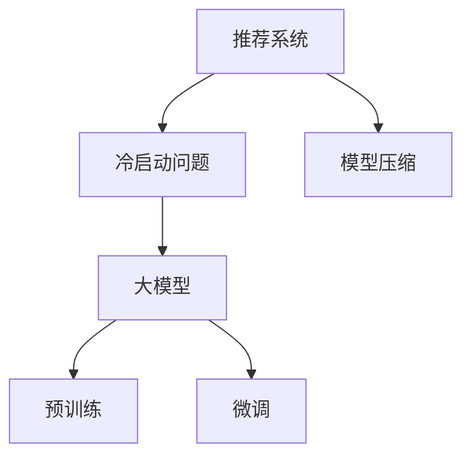

                 

# 大模型在推荐冷启动场景中的优势

> 关键词：推荐系统, 冷启动问题, 大模型, 预训练, 微调, 模型压缩

## 1. 背景介绍

### 1.1 问题由来
在智能推荐系统中，冷启动问题是影响系统性能的重要因素之一。冷启动指的是对于新用户或新商品，由于缺乏历史行为数据，无法准确判断其兴趣偏好和购买倾向。当前，推荐系统通常依赖于用户历史行为数据，利用协同过滤、基于内容的推荐等方法，对用户进行个性化推荐。但当面临新用户或新商品时，系统无法有效利用历史数据，导致推荐效果大打折扣。

### 1.2 问题核心关键点
大模型在推荐冷启动场景中的优势主要体现在以下几个方面：
1. 强大的泛化能力。大模型经过大规模无监督预训练，学习到丰富的语言和知识表示，能够处理广泛的输入数据，从语言描述中提取隐含的偏好信息。
2. 鲁棒性强。大模型参数量庞大，具有更强的泛化能力和鲁棒性，能够处理更复杂、多样化的数据分布。
3. 可解释性高。大模型通常采用基于自注意力机制的Transformer架构，其内部工作机制可解释性较强，便于分析用户的兴趣变化和推荐逻辑。
4. 计算高效。大模型通常采用深度学习框架和分布式计算架构，计算速度较快的GPU或TPU等高性能设备能够支撑大规模模型的训练和推理。

面对冷启动问题，如何充分利用大模型在语言表示、知识图谱、自然语言处理等方面的优势，设计更加有效的推荐算法，是大模型在推荐系统中的应用需要解决的关键问题。本文将详细介绍大模型在推荐冷启动场景中的优势，并探讨其实际应用和挑战。

## 2. 核心概念与联系

### 2.1 核心概念概述

为更好地理解大模型在推荐冷启动场景中的应用，本节将介绍几个密切相关的核心概念：

- 推荐系统(Recommendation System)：通过数据分析和机器学习算法，对用户行为进行建模，预测用户兴趣，提供个性化推荐的技术系统。
- 冷启动问题(Cold Start Problem)：新用户或新商品由于缺乏历史行为数据，导致无法准确预测其兴趣和需求，推荐效果下降的问题。
- 大模型(Large Model)：以Transformer为代表的深度学习模型，经过大规模无监督预训练，学习到通用的语言和知识表示，具有强大的泛化能力。
- 预训练(Pre-training)：在大规模无标签文本数据上进行自监督学习任务训练模型，学习通用的语言表示。
- 微调(Fine-tuning)：在预训练模型的基础上，使用下游任务的少量标注数据，通过有监督学习优化模型在该任务上的性能。
- 模型压缩(Model Compression)：通过参数剪枝、量化、知识蒸馏等技术，降低模型复杂度，提升计算效率。

这些概念之间的逻辑关系可以通过以下Mermaid流程图来展示：



这个流程图展示了大模型在推荐冷启动场景中的应用框架：

1. 推荐系统通过数据建模和算法推荐，对用户进行个性化推荐。
2. 冷启动问题指出了推荐系统在新用户或新商品上的性能瓶颈。
3. 大模型通过大规模预训练，学习到通用的语言和知识表示，具备强大的泛化能力。
4. 微调通过有监督学习，优化模型在特定任务上的性能，如商品分类、用户兴趣预测等。
5. 模型压缩通过参数剪枝、量化等技术，降低模型复杂度，提升推理效率。

这些核心概念共同构成了大模型在推荐系统中的应用范式，使其能够在推荐冷启动场景中发挥重要的作用。

## 3. 核心算法原理 & 具体操作步骤
### 3.1 算法原理概述

基于大模型的推荐系统，通常采用以下两种方式解决冷启动问题：

1. 预训练+微调：在大规模无监督语料上对大模型进行预训练，获得通用的语言和知识表示。然后，使用下游推荐任务的少量标注数据，对模型进行微调，使其适应特定的推荐场景。
2. 预训练+提示学习：在大模型上进行预训练后，利用提示模板引导模型进行特定推荐任务的推理和生成，无需微调即可实现推荐。

这两种方式的区别在于是否进行微调。微调通过优化模型参数，提高模型对特定推荐任务的适应能力，通常需要更多计算资源和标注数据。而提示学习通过精心设计提示模板，利用模型泛化能力，可以在更少的计算和数据下实现推荐，适用于冷启动场景。

### 3.2 算法步骤详解

以预训练+微调为例，详细说明基于大模型的推荐系统操作步骤：

**Step 1: 准备预训练模型和数据集**
- 选择合适的预训练语言模型 $M_{\theta}$ 作为初始化参数，如BERT、GPT等。
- 准备推荐任务的标注数据集 $D=\{(x_i,y_i)\}_{i=1}^N, x_i \in \mathcal{X}, y_i \in \mathcal{Y}$，其中 $\mathcal{X}$ 为输入空间，$\mathcal{Y}$ 为输出空间。

**Step 2: 添加任务适配层**
- 根据推荐任务类型，在预训练模型顶层设计合适的输出层和损失函数。
- 对于分类任务，通常在顶层添加线性分类器和交叉熵损失函数。
- 对于生成任务，通常使用语言模型的解码器输出概率分布，并以负对数似然为损失函数。

**Step 3: 设置微调超参数**
- 选择合适的优化算法及其参数，如 AdamW、SGD 等，设置学习率、批大小、迭代轮数等。
- 设置正则化技术及强度，包括权重衰减、Dropout、Early Stopping等。
- 确定冻结预训练参数的策略，如仅微调顶层，或全部参数都参与微调。

**Step 4: 执行梯度训练**
- 将训练集数据分批次输入模型，前向传播计算损失函数。
- 反向传播计算参数梯度，根据设定的优化算法和学习率更新模型参数。
- 周期性在验证集上评估模型性能，根据性能指标决定是否触发 Early Stopping。
- 重复上述步骤直到满足预设的迭代轮数或 Early Stopping 条件。

**Step 5: 测试和部署**
- 在测试集上评估微调后模型 $M_{\hat{\theta}}$ 的性能，对比微调前后的精度提升。
- 使用微调后的模型对新样本进行推理预测，集成到实际的应用系统中。
- 持续收集新的数据，定期重新微调模型，以适应数据分布的变化。

### 3.3 算法优缺点

基于大模型的推荐系统具有以下优点：
1. 强大的泛化能力。预训练大模型学习到丰富的语言和知识表示，能够处理广泛的输入数据，从语言描述中提取隐含的偏好信息。
2. 鲁棒性强。大模型参数量庞大，具有更强的泛化能力和鲁棒性，能够处理更复杂、多样化的数据分布。
3. 可解释性高。大模型通常采用基于自注意力机制的Transformer架构，其内部工作机制可解释性较强，便于分析用户的兴趣变化和推荐逻辑。
4. 计算高效。大模型通常采用深度学习框架和分布式计算架构，计算速度较快的GPU或TPU等高性能设备能够支撑大规模模型的训练和推理。

同时，该方法也存在一定的局限性：
1. 依赖标注数据。微调的效果很大程度上取决于标注数据的质量和数量，获取高质量标注数据的成本较高。
2. 迁移能力有限。当目标任务与预训练数据的分布差异较大时，微调的性能提升有限。
3. 过拟合风险。预训练模型的泛化能力较强，但可能存在一定的过拟合风险，特别是在标注数据不足的情况下。
4. 计算资源需求高。大模型的计算复杂度较高，对硬件和计算资源有较高的要求。

尽管存在这些局限性，但就目前而言，基于大模型的推荐系统仍然是最主流的方法之一。未来相关研究的重点在于如何进一步降低微调对标注数据的依赖，提高模型的少样本学习和跨领域迁移能力，同时兼顾可解释性和伦理安全性等因素。

### 3.4 算法应用领域

基于大模型的推荐系统在实际应用中，已经在推荐、广告、内容分发等多个领域取得了显著的成果，如：

- 电商推荐：通过对用户浏览、点击、购买行为进行建模，推荐个性化的商品和优惠活动。
- 社交网络推荐：根据用户的行为和兴趣，推荐相关的朋友、文章和视频。
- 内容分发：分析用户的阅读偏好，推荐个性化的新闻、文章、视频等内容。
- 广告推荐：根据用户的在线行为，推荐广告位和广告内容，提升广告投放效果。
- 电影推荐：根据用户的评分和评论，推荐电影和电视节目，提升观影体验。

除了这些经典应用外，大模型在推荐系统中的应用还在不断创新和扩展，如跨模态推荐、基于自然语言处理的个性化推荐等，为推荐系统带来了全新的突破。

## 4. 数学模型和公式 & 详细讲解 & 举例说明
### 4.1 数学模型构建

在推荐系统中，大模型的微调目标通常是通过优化损失函数，使模型能够准确预测用户的兴趣标签。设推荐任务的数据集为 $D=\{(x_i,y_i)\}_{i=1}^N, x_i \in \mathcal{X}, y_i \in \mathcal{Y}$，其中 $\mathcal{X}$ 为输入空间，$\mathcal{Y}$ 为输出空间。大模型 $M_{\theta}$ 在输入 $x$ 上的输出为 $\hat{y}=M_{\theta}(x)$，表示模型预测的兴趣标签。则推荐任务的损失函数为：

$$
\ell(M_{\theta}(x),y) = -[y\log \hat{y} + (1-y)\log (1-\hat{y})]
$$

上述损失函数为二分类交叉熵损失，用于衡量模型预测和真实标签之间的差异。

### 4.2 公式推导过程

以下我们以电商推荐为例，推导基于大模型的推荐系统的微调损失函数及其梯度计算公式。

假设电商推荐任务中，每个用户的浏览行为描述 $x$ 为一个序列 $x = [w_1, w_2, ..., w_n]$，其中 $w_i$ 为单词。模型 $M_{\theta}$ 在输入 $x$ 上的输出 $\hat{y} = [\hat{y}_1, \hat{y}_2, ..., \hat{y}_n]$，表示每个单词的兴趣概率。则推荐任务的交叉熵损失函数为：

$$
\mathcal{L}(\theta) = -\frac{1}{N}\sum_{i=1}^N \sum_{j=1}^n y_j\log \hat{y}_j + (1-y_j)\log (1-\hat{y}_j)
$$

其中 $y_j \in \{0,1\}$ 表示单词 $w_j$ 是否在用户的历史行为描述中出现过。

根据链式法则，损失函数对模型参数 $\theta_k$ 的梯度为：

$$
\frac{\partial \mathcal{L}(\theta)}{\partial \theta_k} = -\frac{1}{N}\sum_{i=1}^N \frac{1}{n}\sum_{j=1}^n \frac{y_j}{\hat{y}_j}-\frac{1-y_j}{1-\hat{y}_j} \frac{\partial \hat{y}_j}{\partial \theta_k}
$$

其中 $\frac{\partial \hat{y}_j}{\partial \theta_k}$ 可以通过反向传播算法计算得到。

### 4.3 案例分析与讲解

以电商推荐为例，假设某电商网站收集了部分用户的浏览历史，每个历史行为描述 $x$ 由若干单词 $w_1, w_2, ..., w_n$ 组成。对于每个用户，模型需要对每个单词 $w_j$ 是否出现进行预测，并计算相应的交叉熵损失。

假设模型在某个用户的历史行为描述上的预测概率为 $\hat{y} = [0.6, 0.2, 0.3, 0.1]$，用户浏览历史中包含单词 $w_2$，因此真实的兴趣概率 $y = [0, 0, 1, 0]$。根据上述交叉熵损失函数，计算模型的损失为：

$$
\mathcal{L}(\theta) = -\frac{1}{N}\sum_{i=1}^N [-\log \hat{y}_2]
$$

其中 $N$ 为用户数。

计算模型参数 $\theta_k$ 的梯度，可以将 $\frac{\partial \mathcal{L}(\theta)}{\partial \theta_k}$ 带入梯度更新公式：

$$
\theta \leftarrow \theta - \eta \nabla_{\theta}\mathcal{L}(\theta) - \eta\lambda\theta
$$

其中 $\eta$ 为学习率，$\lambda$ 为正则化系数，通过梯度下降等优化算法迭代更新模型参数，直到损失函数收敛。

## 5. 项目实践：代码实例和详细解释说明
### 5.1 开发环境搭建

在进行大模型微调实践前，我们需要准备好开发环境。以下是使用Python进行PyTorch开发的环境配置流程：

1. 安装Anaconda：从官网下载并安装Anaconda，用于创建独立的Python环境。

2. 创建并激活虚拟环境：
```bash
conda create -n pytorch-env python=3.8 
conda activate pytorch-env
```

3. 安装PyTorch：根据CUDA版本，从官网获取对应的安装命令。例如：
```bash
conda install pytorch torchvision torchaudio cudatoolkit=11.1 -c pytorch -c conda-forge
```

4. 安装Transformers库：
```bash
pip install transformers
```

5. 安装各类工具包：
```bash
pip install numpy pandas scikit-learn matplotlib tqdm jupyter notebook ipython
```

完成上述步骤后，即可在`pytorch-env`环境中开始微调实践。

### 5.2 源代码详细实现

下面我们以电商推荐任务为例，给出使用Transformers库对BERT模型进行微调的PyTorch代码实现。

首先，定义电商推荐任务的数据处理函数：

```python
from transformers import BertTokenizer
from torch.utils.data import Dataset
import torch

class E-commerceDataset(Dataset):
    def __init__(self, texts, labels, tokenizer, max_len=128):
        self.texts = texts
        self.labels = labels
        self.tokenizer = tokenizer
        self.max_len = max_len
        
    def __len__(self):
        return len(self.texts)
    
    def __getitem__(self, item):
        text = self.texts[item]
        label = self.labels[item]
        
        encoding = self.tokenizer(text, return_tensors='pt', max_length=self.max_len, padding='max_length', truncation=True)
        input_ids = encoding['input_ids'][0]
        attention_mask = encoding['attention_mask'][0]
        
        # 对token-wise的标签进行编码
        encoded_labels = [int(x) for x in label] 
        encoded_labels.extend([0] * (self.max_len - len(encoded_labels)))
        labels = torch.tensor(encoded_labels, dtype=torch.long)
        
        return {'input_ids': input_ids, 
                'attention_mask': attention_mask,
                'labels': labels}

# 标签与id的映射
label2id = {0: 0, 1: 1}
id2label = {v: k for k, v in label2id.items()}

# 创建dataset
tokenizer = BertTokenizer.from_pretrained('bert-base-cased')

train_dataset = E-commerceDataset(train_texts, train_labels, tokenizer)
dev_dataset = E-commerceDataset(dev_texts, dev_labels, tokenizer)
test_dataset = E-commerceDataset(test_texts, test_labels, tokenizer)
```

然后，定义模型和优化器：

```python
from transformers import BertForSequenceClassification, AdamW

model = BertForSequenceClassification.from_pretrained('bert-base-cased', num_labels=2)

optimizer = AdamW(model.parameters(), lr=2e-5)
```

接着，定义训练和评估函数：

```python
from torch.utils.data import DataLoader
from tqdm import tqdm
from sklearn.metrics import classification_report

device = torch.device('cuda') if torch.cuda.is_available() else torch.device('cpu')
model.to(device)

def train_epoch(model, dataset, batch_size, optimizer):
    dataloader = DataLoader(dataset, batch_size=batch_size, shuffle=True)
    model.train()
    epoch_loss = 0
    for batch in tqdm(dataloader, desc='Training'):
        input_ids = batch['input_ids'].to(device)
        attention_mask = batch['attention_mask'].to(device)
        labels = batch['labels'].to(device)
        model.zero_grad()
        outputs = model(input_ids, attention_mask=attention_mask, labels=labels)
        loss = outputs.loss
        epoch_loss += loss.item()
        loss.backward()
        optimizer.step()
    return epoch_loss / len(dataloader)

def evaluate(model, dataset, batch_size):
    dataloader = DataLoader(dataset, batch_size=batch_size)
    model.eval()
    preds, labels = [], []
    with torch.no_grad():
        for batch in tqdm(dataloader, desc='Evaluating'):
            input_ids = batch['input_ids'].to(device)
            attention_mask = batch['attention_mask'].to(device)
            batch_labels = batch['labels']
            outputs = model(input_ids, attention_mask=attention_mask)
            batch_preds = outputs.logits.argmax(dim=2).to('cpu').tolist()
            batch_labels = batch_labels.to('cpu').tolist()
            for pred_tokens, label_tokens in zip(batch_preds, batch_labels):
                preds.append(pred_tokens[:len(label_tokens)])
                labels.append(label_tokens)
                
    print(classification_report(labels, preds))
```

最后，启动训练流程并在测试集上评估：

```python
epochs = 5
batch_size = 16

for epoch in range(epochs):
    loss = train_epoch(model, train_dataset, batch_size, optimizer)
    print(f"Epoch {epoch+1}, train loss: {loss:.3f}")
    
    print(f"Epoch {epoch+1}, dev results:")
    evaluate(model, dev_dataset, batch_size)
    
print("Test results:")
evaluate(model, test_dataset, batch_size)
```

以上就是使用PyTorch对BERT进行电商推荐任务微调的完整代码实现。可以看到，得益于Transformers库的强大封装，我们可以用相对简洁的代码完成BERT模型的加载和微调。

### 5.3 代码解读与分析

让我们再详细解读一下关键代码的实现细节：

**E-commerceDataset类**：
- `__init__`方法：初始化文本、标签、分词器等关键组件。
- `__len__`方法：返回数据集的样本数量。
- `__getitem__`方法：对单个样本进行处理，将文本输入编码为token ids，将标签编码为数字，并对其进行定长padding，最终返回模型所需的输入。

**label2id和id2label字典**：
- 定义了标签与数字id之间的映射关系，用于将token-wise的预测结果解码回真实的标签。

**训练和评估函数**：
- 使用PyTorch的DataLoader对数据集进行批次化加载，供模型训练和推理使用。
- 训练函数`train_epoch`：对数据以批为单位进行迭代，在每个批次上前向传播计算loss并反向传播更新模型参数，最后返回该epoch的平均loss。
- 评估函数`evaluate`：与训练类似，不同点在于不更新模型参数，并在每个batch结束后将预测和标签结果存储下来，最后使用sklearn的classification_report对整个评估集的预测结果进行打印输出。

**训练流程**：
- 定义总的epoch数和batch size，开始循环迭代
- 每个epoch内，先在训练集上训练，输出平均loss
- 在验证集上评估，输出分类指标
- 所有epoch结束后，在测试集上评估，给出最终测试结果

可以看到，PyTorch配合Transformers库使得BERT微调的代码实现变得简洁高效。开发者可以将更多精力放在数据处理、模型改进等高层逻辑上，而不必过多关注底层的实现细节。

当然，工业级的系统实现还需考虑更多因素，如模型的保存和部署、超参数的自动搜索、更灵活的任务适配层等。但核心的微调范式基本与此类似。

## 6. 实际应用场景
### 6.1 电商推荐

基于大模型的推荐系统在电商推荐领域具有显著优势。电商推荐系统需要根据用户浏览、点击、购买行为，推荐个性化的商品和优惠活动，以提升销售额和用户体验。

具体而言，大模型可以通过以下方式解决电商推荐中的冷启动问题：

1. 数据增强：收集用户浏览、评论、收藏等行为数据，使用数据增强技术扩充训练集，提高模型泛化能力。
2. 预训练+微调：在大规模无监督语料上对大模型进行预训练，获得通用的语言和知识表示。然后，使用电商推荐任务的少量标注数据，对模型进行微调，使其适应电商推荐场景。
3. 提示学习：利用提示模板引导模型进行推荐推理，无需微调即可实现推荐。
4. 多任务学习：同时训练多个推荐任务（如商品分类、价格预测、推荐排序等），提高模型对多种推荐任务的适应能力。
5. 迁移学习：将预训练模型在电商推荐领域进行迁移学习，利用已有知识提升推荐效果。

以上方法可以有效缓解电商推荐中的冷启动问题，提升推荐模型的准确性和鲁棒性。

### 6.2 社交网络推荐

社交网络推荐系统需要根据用户的行为和兴趣，推荐相关的朋友、文章和视频等内容，提升用户粘性和平台活跃度。

在社交网络推荐中，大模型同样具有显著优势。具体而言，大模型可以通过以下方式解决推荐系统中的冷启动问题：

1. 数据增强：收集用户互动、点赞、评论等行为数据，使用数据增强技术扩充训练集，提高模型泛化能力。
2. 预训练+微调：在大规模无监督语料上对大模型进行预训练，获得通用的语言和知识表示。然后，使用社交网络推荐任务的少量标注数据，对模型进行微调，使其适应社交网络推荐场景。
3. 提示学习：利用提示模板引导模型进行推荐推理，无需微调即可实现推荐。
4. 多任务学习：同时训练多个推荐任务（如用户兴趣预测、内容分类、推荐排序等），提高模型对多种推荐任务的适应能力。
5. 迁移学习：将预训练模型在社交网络推荐领域进行迁移学习，利用已有知识提升推荐效果。

以上方法可以有效缓解社交网络推荐中的冷启动问题，提升推荐模型的准确性和鲁棒性。

### 6.3 内容分发

内容分发系统需要根据用户的阅读偏好，推荐个性化的新闻、文章、视频等内容，提高用户阅读体验和平台流量。

在内容分发中，大模型同样具有显著优势。具体而言，大模型可以通过以下方式解决推荐系统中的冷启动问题：

1. 数据增强：收集用户阅读、分享、评论等行为数据，使用数据增强技术扩充训练集，提高模型泛化能力。
2. 预训练+微调：在大规模无监督语料上对大模型进行预训练，获得通用的语言和知识表示。然后，使用内容分发任务的少量标注数据，对模型进行微调，使其适应内容分发场景。
3. 提示学习：利用提示模板引导模型进行推荐推理，无需微调即可实现推荐。
4. 多任务学习：同时训练多个推荐任务（如文章分类、推荐排序、热门文章推荐等），提高模型对多种推荐任务的适应能力。
5. 迁移学习：将预训练模型在内容分发领域进行迁移学习，利用已有知识提升推荐效果。

以上方法可以有效缓解内容分发中的冷启动问题，提升推荐模型的准确性和鲁棒性。

### 6.4 未来应用展望

随着大模型的不断发展，其在推荐系统中的应用将不断拓展和深化。未来，大模型推荐系统有望在以下方向取得更多突破：

1. 跨模态推荐：将大模型应用于多模态数据融合，如视觉、音频、文本等数据的协同推荐。
2. 实时推荐：通过构建实时推荐系统，实现动态更新，提升推荐效果。
3. 用户行为预测：利用大模型预测用户未来的行为和需求，提供更个性化的推荐。
4. 用户情感分析：通过分析用户对推荐内容的情感反应，优化推荐策略。
5. 推荐算法优化：利用强化学习、因果推理等前沿技术，优化推荐算法，提升推荐效果。

以上应用方向将推动大模型在推荐系统中的进一步发展，为各垂直行业带来更智能化、个性化、实时的推荐服务。相信随着技术的不断进步，大模型在推荐系统中的应用将更加广泛和深入，引领推荐技术的全面升级。

## 7. 工具和资源推荐
### 7.1 学习资源推荐

为了帮助开发者系统掌握大模型在推荐系统中的应用，这里推荐一些优质的学习资源：

1. 《Recommender Systems: Advanced Practices and Challenges》书籍：该书详细介绍了推荐系统的理论基础和实际应用，包括冷启动问题、大模型应用等。
2. Coursera《Recommender Systems》课程：由斯坦福大学开设的推荐系统课程，涵盖推荐系统基础和最新进展，适合初学者和专业人士。
3. Kaggle推荐系统竞赛：通过参与Kaggle上的推荐系统竞赛，实践推荐算法，学习推荐系统的前沿技术。
4. TensorFlow官方文档：TensorFlow提供的推荐系统组件，包括TensorFlow Recommenders，方便开发者快速搭建推荐系统。
5. PyTorch官方文档：PyTorch提供的推荐系统组件，包括TorchRec等，适合开发者在深度学习框架下进行推荐系统开发。

通过对这些资源的学习实践，相信你一定能够掌握大模型在推荐系统中的应用精髓，并用于解决实际的推荐问题。

### 7.2 开发工具推荐

高效的开发离不开优秀的工具支持。以下是几款用于大模型推荐系统开发的常用工具：

1. PyTorch：基于Python的开源深度学习框架，灵活动态的计算图，适合快速迭代研究。大部分预训练语言模型都有PyTorch版本的实现。
2. TensorFlow：由Google主导开发的开源深度学习框架，生产部署方便，适合大规模工程应用。同样有丰富的预训练语言模型资源。
3. Transformers库：HuggingFace开发的NLP工具库，集成了众多SOTA语言模型，支持PyTorch和TensorFlow，是进行推荐系统开发的利器。
4. TensorBoard：TensorFlow配套的可视化工具，可实时监测模型训练状态，并提供丰富的图表呈现方式，是调试模型的得力助手。
5. Weights & Biases：模型训练的实验跟踪工具，可以记录和可视化模型训练过程中的各项指标，方便对比和调优。与主流深度学习框架无缝集成。

合理利用这些工具，可以显著提升大模型推荐系统的开发效率，加快创新迭代的步伐。

### 7.3 相关论文推荐

大模型在推荐系统中的应用源于学界的持续研究。以下是几篇奠基性的相关论文，推荐阅读：

1. Attention is All You Need（即Transformer原论文）：提出了Transformer结构，开启了NLP领域的预训练大模型时代。
2. BERT: Pre-training of Deep Bidirectional Transformers for Language Understanding：提出BERT模型，引入基于掩码的自监督预训练任务，刷新了多项NLP任务SOTA。
3. Generative Pre-trained Transformer（GPT）系列论文：展示了大规模语言模型的强大zero-shot学习能力，引发了对于通用人工智能的新一轮思考。
4. Multi-task Learning for Recommendation Systems：提出多任务学习范式，利用多个推荐任务的知识，提升推荐效果。
5. Learning Deep Structured Models for Recommender Systems：利用结构化表示模型，提升推荐系统的效果和泛化能力。

这些论文代表了大模型在推荐系统中的应用方向。通过学习这些前沿成果，可以帮助研究者把握学科前进方向，激发更多的创新灵感。

## 8. 总结：未来发展趋势与挑战
### 8.1 总结

本文对基于大模型的推荐系统在冷启动场景中的优势进行了全面系统的介绍。首先阐述了推荐系统中的冷启动问题，以及大模型在处理该问题上的强大能力。接着，从原理到实践，详细讲解了大模型的微调过程，给出了微调任务开发的完整代码实例。同时，本文还探讨了大模型在电商推荐、社交网络推荐、内容分发等多个领域的应用前景，展示了其巨大的潜力。

通过本文的系统梳理，可以看到，大模型在推荐系统中的应用正在成为主流技术，极大地拓展了推荐系统的应用边界，提升了推荐效果。未来，伴随大模型的进一步发展，推荐系统的智能化水平将不断提高，为各垂直行业带来更高效、更精准、更个性化的推荐服务。

### 8.2 未来发展趋势

展望未来，大模型在推荐系统中的应用将呈现以下几个发展趋势：

1. 模型规模持续增大。随着算力成本的下降和数据规模的扩张，预训练语言模型的参数量还将持续增长。超大规模语言模型蕴含的丰富语言知识，有望支撑更加复杂多变的推荐场景。
2. 微调方法日趋多样。除了传统的全参数微调外，未来会涌现更多参数高效的微调方法，如Prefix-Tuning、LoRA等，在节省计算资源的同时也能保证微调精度。
3. 持续学习成为常态。随着数据分布的不断变化，微调模型也需要持续学习新知识以保持性能。如何在不遗忘原有知识的同时，高效吸收新样本信息，将成为重要的研究课题。
4. 标注样本需求降低。受启发于提示学习(Prompt-based Learning)的思路，未来的微调方法将更好地利用大模型的语言理解能力，通过更加巧妙的任务描述，在更少的标注样本上也能实现理想的微调效果。
5. 计算资源需求降低。通过参数剪枝、量化、知识蒸馏等技术，大模型的计算复杂度将大幅降低，更容易实现高效部署。

以上趋势凸显了大模型在推荐系统中的应用前景。这些方向的探索发展，必将进一步提升推荐系统的性能和应用范围，为各垂直行业带来更智能化、个性化、实时的推荐服务。

### 8.3 面临的挑战

尽管大模型在推荐系统中的应用取得了显著成果，但在迈向更加智能化、普适化应用的过程中，它仍面临着诸多挑战：

1. 标注成本瓶颈。尽管微调相比从头训练所需的数据和计算资源更少，但对于某些领域，如医学、法律等，获取高质量标注数据的成本依然较高。如何进一步降低微调对标注样本的依赖，将是一大难题。
2. 模型鲁棒性不足。当前微调模型面对域外数据时，泛化性能往往大打折扣。对于测试样本的微小扰动，微调模型的预测也容易发生波动。如何提高微调模型的鲁棒性，避免灾难性遗忘，还需要更多理论和实践的积累。
3. 推理效率有待提高。尽管大模型的精度较高，但在实际部署时往往面临推理速度慢、内存占用大等效率问题。如何在保证性能的同时，简化模型结构，提升推理速度，优化资源占用，将是重要的优化方向。
4. 可解释性亟需加强。当前微调模型更像是"黑盒"系统，难以解释其内部工作机制和决策逻辑。对于医疗、金融等高风险应用，算法的可解释性和可审计性尤为重要。如何赋予微调模型更强的可解释性，将是亟待攻克的难题。
5. 安全性有待保障。预训练语言模型难免会学习到有偏见、有害的信息，通过微调传递到下游任务，产生误导性、歧视性的输出，给实际应用带来安全隐患。如何从数据和算法层面消除模型偏见，避免恶意用途，确保输出的安全性，也将是重要的研究课题。

这些挑战凸显了大模型在推荐系统中的应用复杂性。为了更好地应对这些挑战，未来需要在算法、数据、工程等多个方面进行协同创新，提升推荐系统的智能化和可靠性。

### 8.4 研究展望

面对大模型推荐系统所面临的挑战，未来的研究需要在以下几个方面寻求新的突破：

1. 探索无监督和半监督微调方法。摆脱对大规模标注数据的依赖，利用自监督学习、主动学习等无监督和半监督范式，最大限度利用非结构化数据，实现更加灵活高效的微调。
2. 研究参数高效和计算高效的微调范式。开发更加参数高效的微调方法，在固定大部分预训练参数的同时，只更新极少量的任务相关参数。同时优化微调模型的计算图，减少前向传播和反向传播的资源消耗，实现更加轻量级、实时性的部署。
3. 融合因果和对比学习范式。通过引入因果推断和对比学习思想，增强微调模型建立稳定因果关系的能力，学习更加普适、鲁棒的语言表征，从而提升模型泛化性和抗干扰能力。
4. 引入更多先验知识。将符号化的先验知识，如知识图谱、逻辑规则等，与神经网络模型进行巧妙融合，引导微调过程学习更准确、合理的语言模型。同时加强不同模态数据的整合，实现视觉、语音等多模态信息与文本信息的协同建模。
5. 结合因果分析和博弈论工具。将因果分析方法引入微调模型，识别出模型决策的关键特征，增强输出解释的因果性和逻辑性。借助博弈论工具刻画人机交互过程，主动探索并规避模型的脆弱点，提高系统稳定性。
6. 纳入伦理道德约束。在模型训练目标中引入伦理导向的评估指标，过滤和惩罚有偏见、有害的输出倾向。同时加强人工干预和审核，建立模型行为的监管机制，确保输出符合人类价值观和伦理道德。

这些研究方向的探索，必将引领大模型推荐系统迈向更高的台阶，为构建安全、可靠、可解释、可控的智能系统铺平道路。面向未来，大模型推荐系统还需要与其他人工智能技术进行更深入的融合，如知识表示、因果推理、强化学习等，多路径协同发力，共同推动推荐技术的全面升级。只有勇于创新、敢于突破，才能不断拓展推荐系统的边界，让智能技术更好地服务于各行各业。

## 9. 附录：常见问题与解答
----------------------------------------------------------------

**Q1：大模型在推荐冷启动场景中的优势有哪些？**

A: 大模型在推荐冷启动场景中的优势主要体现在以下几个方面：
1. 强大的泛化能力。大模型经过大规模无监督预训练，学习到丰富的语言和知识表示，能够处理广泛的输入数据，从语言描述中提取隐含的偏好信息。
2. 鲁棒性强。大模型参数量庞大，具有更强的泛化能力和鲁棒性，能够处理更复杂、多样化的数据分布。
3. 可解释性高。大模型通常采用基于自注意力机制的Transformer架构，其内部工作机制可解释性较强，便于分析用户的兴趣变化和推荐逻辑。
4. 计算高效。大模型通常采用深度学习框架和分布式计算架构，计算速度较快的GPU或TPU等高性能设备能够支撑大规模模型的训练和推理。

**Q2：大模型在推荐冷启动场景中如何进行数据增强？**

A: 数据增强是缓解冷启动问题的重要手段，可以通过以下方式实现：
1. 历史行为重放：将用户历史行为重新组合，生成新的行为序列，作为微调数据。
2. 数据混杂：将多个用户的相似行为序列混合，生成新的混合样本。
3. 回译技术：利用回译技术将用户的历史行为序列转换为不同的语言或格式，生成新的样本。
4. 模拟数据：利用领域知识生成模拟数据，增加数据多样性。
5. 数据合成：利用生成对抗网络(GAN)等生成模型生成新的推荐数据。

通过数据增强，可以有效扩充训练集，提高模型泛化能力，缓解冷启动问题。

**Q3：大模型在推荐冷启动场景中如何进行提示学习？**

A: 提示学习是一种不更新模型参数的推荐方法，通过精心设计提示模板，利用模型泛化能力，无需微调即可实现推荐。

具体而言，提示学习分为以下步骤：
1. 设计提示模板：根据推荐任务，设计相应的提示模板。例如，电商推荐可以设计“用户搜索过：{用户搜索历史}，是否购买过：{用户购买历史}？推荐商品：{商品列表}”的模板。
2. 生成推荐结果：将提示模板输入大模型，生成推荐结果。例如，将提示模板“用户搜索过：{用户搜索历史}，是否购买过：{用户购买历史}？推荐商品：{商品列表}”输入大模型，生成推荐商品的列表。
3. 输出推荐结果：根据大模型的输出结果，生成推荐商品列表。例如，将大模型的输出结果“商品A，商品B，商品C”作为推荐商品的列表。

提示学习可以有效缓解冷启动问题，减少微调带来的计算和标注成本，提升推荐模型的灵活性和普适性。

**Q4：大模型在推荐冷启动场景中如何进行模型压缩？**

A: 模型压缩是提升推荐系统效率的重要手段，可以通过以下方式实现：
1. 参数剪枝：通过剪枝技术，去除冗余的参数，减少模型大小。例如，利用Knowledge Distillation等技术，通过预训练模型指导微调模型的参数优化。
2. 量化技术：将模型的参数和激活值量化为更小的位数，降低存储空间和计算开销。例如，利用TensorRT等工具进行量化加速。
3. 知识蒸馏：通过知识蒸馏技术，将大模型的知识传递给小模型，提升小模型的性能。例如，利用基于softmax的蒸馏方法，将大模型的输出作为小模型的标签，进行模型微调。
4. 模型压缩工具：利用如TensorFlow Lite、ONNX等模型压缩工具，对大模型进行压缩优化，降低推理时的时间和空间开销。

通过模型压缩，可以有效降低推荐系统的计算和存储开销，提升推荐效率，实现更高效、轻量级的推荐服务。

**Q5：大模型在推荐冷启动场景中如何进行多任务学习？**

A: 多任务学习是一种有效的推荐方法，可以通过以下方式实现：
1. 任务对齐：将多个推荐任务的目标函数对齐，共享参数。例如，同时训练商品分类、价格预测、推荐排序等多个任务，共享大模型的底层参数。
2. 任务分解：将大任务分解为多个子任务，分别进行训练，提升模型的泛化能力。例如，将推荐任务分解为用户兴趣预测、商品推荐、用户行为预测等多个子任务，分别进行训练。
3. 模型融合：将多个推荐模型的预测结果进行融合，提升整体性能。例如，利用softmax等方法，将多个推荐模型的预测结果进行加权融合，生成最终的推荐结果。
4. 任务迁移：将预训练模型在特定任务上的知识迁移应用到其他任务中，提升模型的适应能力。例如，将预训练模型在电商推荐领域的学习知识迁移到社交网络推荐领域。

通过多任务学习，可以有效提升推荐模型的泛化能力和鲁棒性，提高推荐系统的准确性和效率。

**Q6：大模型在推荐冷启动场景中如何进行迁移学习？**

A: 迁移学习是一种有效的推荐方法，可以通过以下方式实现：
1. 迁移学习框架：利用迁移学习框架，将预训练模型在特定任务上的知识迁移到其他任务中。例如，利用PyTorch提供的迁移学习组件，将预训练模型在电商推荐领域的知识迁移到社交网络推荐领域。
2. 迁移学习任务：选择适当的迁移学习任务，利用预训练模型在特定任务上的知识。例如，利用预训练模型在电商推荐领域的知识，提升社交网络推荐领域的效果。
3. 迁移学习策略：选择合适的迁移学习策略，如微调、蒸馏、迁移等，提升迁移学习的效果。例如，利用微调技术，对预训练模型在特定任务上的知识进行微调，提升迁移学习的效果。
4. 迁移学习数据：选择合适的迁移学习数据，利用数据的多样性和复杂性，提升迁移学习的效果。例如，利用社交网络推荐领域的多样化和复杂性数据，提升迁移学习的效果。

通过迁移学习，可以有效利用预训练模型的知识，提升推荐模型的性能和泛化能力，缓解冷启动问题。

---

作者：禅与计算机程序设计艺术 / Zen and the Art of Computer Programming

