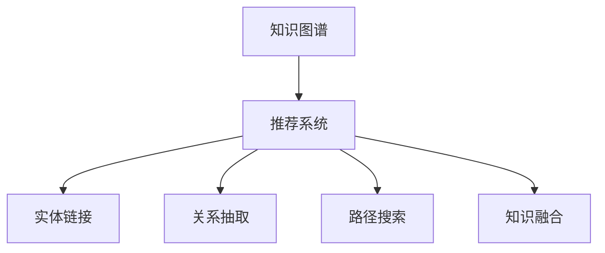

                 

# 大模型在推荐系统中的知识图谱推理应用

## 1. 背景介绍

### 1.1 问题由来
随着电商行业的迅猛发展，推荐系统已经成为各大平台不可或缺的一部分。传统的推荐系统主要依靠用户的浏览、购买历史数据进行商品推荐，但这样的推荐方式存在显著的冷启动问题，对于新用户或新商品，难以提供满意的推荐结果。而通过结合知识图谱的大模型推荐系统，可以充分利用知识图谱中的实体关系信息，有效提升推荐效果。

知识图谱是由实体、关系、属性等组成的网络结构，它能够准确地描述实体之间的相互关系，提供了一种更为丰富、精确的语义表示方式。利用知识图谱，推荐系统可以更深入地理解商品和用户的语义信息，从而提供更具个性化、多样化的推荐。

### 1.2 问题核心关键点
知识图谱推理是指利用知识图谱中的知识进行推理和判断的过程。对于推荐系统，知识图谱推理旨在：
1. **实体链接**：将用户、商品、标签等实体在知识图谱中进行链接，形成有意义的节点。
2. **关系抽取**：从知识图谱中抽取用户和商品之间的关系，如用户喜好、商品分类等。
3. **路径搜索**：在知识图谱中搜索特定关系的路径，从而挖掘更深层次的关联。
4. **知识融合**：将用户行为数据与知识图谱中的实体关系进行融合，增强推荐结果的相关性和多样性。

## 2. 核心概念与联系

### 2.1 核心概念概述

为了更好地理解知识图谱在推荐系统中的应用，本节将介绍几个关键概念：

- **知识图谱**：由实体、关系、属性组成的网络结构，用于描述实体之间的相互关系。常见的知识图谱有Freebase、Wikidata、百度百科等。
- **推荐系统**：通过分析用户行为数据和商品信息，自动为用户推荐相关商品的系统。传统的推荐系统依赖用户历史行为数据，难以处理新用户和新商品。
- **大模型**：指大规模预训练的深度学习模型，如BERT、GPT等。大模型通过大规模无标签数据预训练，学习到丰富的语言知识和语义表示。
- **知识图谱推理**：利用知识图谱中的实体关系进行推理和判断，挖掘更深层次的关联，增强推荐系统的效果。
- **实体链接**：将用户、商品等实体在知识图谱中进行链接，形成有意义的节点。
- **关系抽取**：从知识图谱中抽取用户和商品之间的关系，如用户喜好、商品分类等。
- **路径搜索**：在知识图谱中搜索特定关系的路径，从而挖掘更深层次的关联。
- **知识融合**：将用户行为数据与知识图谱中的实体关系进行融合，增强推荐结果的相关性和多样性。

这些概念之间的逻辑关系可以通过以下Mermaid流程图来展示：



这个流程图展示了大模型在推荐系统中的应用流程：

1. 知识图谱提供商品和用户实体之间的语义信息。
2. 推荐系统利用实体链接将用户、商品与知识图谱中的节点进行链接。
3. 关系抽取从知识图谱中提取用户和商品之间的关联关系。
4. 路径搜索在知识图谱中搜索特定关系，挖掘更深层次的关联。
5. 知识融合将用户行为数据与知识图谱中的实体关系进行融合，提升推荐效果。

## 3. 核心算法原理 & 具体操作步骤
### 3.1 算法原理概述

利用大模型在推荐系统中的应用，核心在于通过知识图谱推理进行实体链接和关系抽取，进而构建推荐网络，提升推荐效果。具体步骤如下：

1. **实体链接**：将用户、商品、标签等实体在知识图谱中进行链接，形成有意义的节点。
2. **关系抽取**：从知识图谱中抽取用户和商品之间的关系，如用户喜好、商品分类等。
3. **路径搜索**：在知识图谱中搜索特定关系的路径，从而挖掘更深层次的关联。
4. **知识融合**：将用户行为数据与知识图谱中的实体关系进行融合，增强推荐结果的相关性和多样性。

### 3.2 算法步骤详解

下面是知识图谱推理在推荐系统中的具体操作步骤：

**Step 1: 构建知识图谱**
- 收集商品、用户、评论等文本数据，构建对应的实体节点。
- 定义实体之间的关系，如“用户-购买-商品”、“商品-分类-类别”等。
- 将知识图谱存储为图数据库，如Neo4j、OrientDB等。

**Step 2: 预训练大模型**
- 选择合适的预训练语言模型，如BERT、GPT等。
- 在大规模无标签文本数据上进行预训练，学习到语言表示和语义关系。

**Step 3: 实体链接**
- 利用预训练模型对用户和商品进行实体识别，得到实体的文本表示。
- 在知识图谱中查找与文本表示匹配的实体节点，进行实体链接。

**Step 4: 关系抽取**
- 利用预训练模型对商品和用户的实体文本进行关系抽取，得到实体之间的语义关系。
- 从知识图谱中抽取相应的关系节点，形成用户-商品关系图。

**Step 5: 路径搜索**
- 在用户-商品关系图中，搜索特定的关系路径，如用户-商品-类别、用户-商品-用户等。
- 利用深度优先搜索或广度优先搜索算法，找到最短路径或最佳路径。

**Step 6: 知识融合**
- 将用户的历史行为数据与知识图谱中的关系图进行融合，构建推荐网络。
- 利用图神经网络模型，如GCN、GAT等，对推荐网络进行编码，生成推荐结果。

### 3.3 算法优缺点

知识图谱推理在推荐系统中的应用有以下优点：

1. **提升推荐效果**：利用知识图谱中的语义信息，可以提升推荐结果的相关性和多样性。
2. **增强泛化能力**：通过路径搜索和知识融合，可以更好地处理新用户和新商品，提高推荐的泛化能力。
3. **降低冷启动问题**：知识图谱推理可以处理冷启动用户和新商品，提升推荐系统的适用性。
4. **数据利用充分**：利用知识图谱中的实体关系，可以更好地利用用户行为数据，减少数据浪费。

同时，知识图谱推理也存在一些缺点：

1. **数据质量问题**：知识图谱中的实体和关系需要保证高质量，否则会影响推荐结果。
2. **计算复杂度较高**：知识图谱的推理过程复杂，需要高效的图计算算法。
3. **实时性问题**：大规模知识图谱的推理过程可能较慢，影响推荐系统的实时性。

### 3.4 算法应用领域

知识图谱推理在推荐系统中的应用广泛，涵盖了以下多个领域：

1. **商品推荐**：利用知识图谱中的商品分类、属性等信息，提升商品推荐的准确性。
2. **个性化推荐**：通过实体链接和关系抽取，构建个性化的用户画像，提升推荐结果的个性化程度。
3. **内容推荐**：结合知识图谱中的内容分类和关系，提升文章、视频等内容的推荐效果。
4. **协同过滤**：利用知识图谱中的用户行为和商品关系，进行协同过滤推荐，提升推荐系统的多样性。
5. **社交推荐**：结合社交网络中的关系，推荐用户感兴趣的内容和商品。

## 4. 数学模型和公式 & 详细讲解  
### 4.1 数学模型构建

在知识图谱推理中，我们需要构建以下数学模型：

- **实体表示**：将用户和商品等实体映射到向量空间中，形成实体的表示向量。
- **关系表示**：定义实体之间的关系，通过矩阵乘法计算关系表示。
- **路径表示**：在知识图谱中搜索特定路径，形成路径表示。
- **推荐表示**：将用户行为数据与路径表示进行融合，形成推荐表示。

### 4.2 公式推导过程

以商品推荐为例，我们将具体推导推荐系统中的数学模型。

假设知识图谱中有 $N$ 个商品节点和 $M$ 个用户节点，实体之间的边表示了它们之间的关系。设商品节点 $i$ 和用户节点 $j$ 之间的关系为 $R_{ij}$，实体的向量表示为 $E_i$ 和 $E_j$，则商品推荐模型的目标是最小化用户-商品关系图 $G=(E,V)$ 中的边权重 $R_{ij}$，使得预测的商品向量 $E_i$ 与用户向量 $E_j$ 的相似度最大化。

推荐模型的目标函数为：

$$
\min_{E} \sum_{i,j} R_{ij} ||E_i - E_j||^2
$$

其中，$E$ 为商品向量和用户向量的集合。

### 4.3 案例分析与讲解

以商品推荐为例，我们分析知识图谱推理在推荐系统中的应用：

1. **实体表示**：
   - 将商品节点 $i$ 的文本表示映射到向量空间，形成向量 $E_i$。
   - 利用BERT等预训练模型，对商品的文本描述进行编码，得到实体的向量表示。

2. **关系表示**：
   - 定义商品节点之间的关系，如“商品-分类-类别”，形成关系矩阵 $R$。
   - 关系矩阵 $R$ 可以通过矩阵乘法计算，即 $R=E_{category} \times E_{category}^T$。

3. **路径表示**：
   - 在用户-商品关系图中，搜索“用户-商品-类别”的路径，形成路径表示 $P$。
   - 利用图神经网络模型，如GCN、GAT等，对路径表示进行编码，得到路径向量 $P_j$。

4. **推荐表示**：
   - 将用户的行为数据 $X$ 与路径向量 $P_j$ 进行融合，生成推荐表示 $Y$。
   - 利用线性回归模型，对推荐表示 $Y$ 进行预测，得到推荐的商品向量 $E_i$。

## 5. 项目实践：代码实例和详细解释说明
### 5.1 开发环境搭建

在进行推荐系统开发前，我们需要准备好开发环境。以下是使用Python进行PyTorch开发的环境配置流程：

1. 安装Anaconda：从官网下载并安装Anaconda，用于创建独立的Python环境。

2. 创建并激活虚拟环境：
```bash
conda create -n recommendation-env python=3.8 
conda activate recommendation-env
```

3. 安装PyTorch：根据CUDA版本，从官网获取对应的安装命令。例如：
```bash
conda install pytorch torchvision torchaudio cudatoolkit=11.1 -c pytorch -c conda-forge
```

4. 安装Transformers库：
```bash
pip install transformers
```

5. 安装各类工具包：
```bash
pip install numpy pandas scikit-learn matplotlib tqdm jupyter notebook ipython
```

完成上述步骤后，即可在`recommendation-env`环境中开始推荐系统开发。

### 5.2 源代码详细实现

下面我们以商品推荐系统为例，给出使用Transformers库对知识图谱进行推理的PyTorch代码实现。

首先，定义推荐系统的数据处理函数：

```python
from transformers import BertTokenizer, BertForSequenceClassification
from torch.utils.data import Dataset
import torch
import pandas as pd
import numpy as np

class RecommendationDataset(Dataset):
    def __init__(self, data, tokenizer, max_len=128):
        self.data = data
        self.tokenizer = tokenizer
        self.max_len = max_len
        
    def __len__(self):
        return len(self.data)
    
    def __getitem__(self, item):
        row = self.data.iloc[item]
        title = row['title']
        description = row['description']
        category = row['category']
        
        title_tokens = self.tokenizer(title, return_tensors='pt', max_length=self.max_len, padding='max_length', truncation=True)
        description_tokens = self.tokenizer(description, return_tensors='pt', max_length=self.max_len, padding='max_length', truncation=True)
        category_tokens = self.tokenizer(category, return_tensors='pt', max_length=self.max_len, padding='max_length', truncation=True)
        
        # 拼接商品描述和类别
        tokens = torch.cat([title_tokens.input_ids, description_tokens.input_ids], dim=1)
        label = category_tokens.labels
        
        return {'tokens': tokens, 'label': label}

# 加载数据
data = pd.read_csv('data.csv')
tokenizer = BertTokenizer.from_pretrained('bert-base-cased')

train_dataset = RecommendationDataset(data, tokenizer)
val_dataset = RecommendationDataset(data, tokenizer)
test_dataset = RecommendationDataset(data, tokenizer)
```

然后，定义模型和优化器：

```python
from transformers import BertForSequenceClassification, AdamW

model = BertForSequenceClassification.from_pretrained('bert-base-cased', num_labels=5)

optimizer = AdamW(model.parameters(), lr=2e-5)
```

接着，定义训练和评估函数：

```python
from torch.utils.data import DataLoader
from tqdm import tqdm
from sklearn.metrics import accuracy_score

device = torch.device('cuda') if torch.cuda.is_available() else torch.device('cpu')
model.to(device)

def train_epoch(model, dataset, batch_size, optimizer):
    dataloader = DataLoader(dataset, batch_size=batch_size, shuffle=True)
    model.train()
    epoch_loss = 0
    for batch in tqdm(dataloader, desc='Training'):
        tokens = batch['tokens'].to(device)
        labels = batch['label'].to(device)
        model.zero_grad()
        outputs = model(tokens)
        loss = outputs.loss
        epoch_loss += loss.item()
        loss.backward()
        optimizer.step()
    return epoch_loss / len(dataloader)

def evaluate(model, dataset, batch_size):
    dataloader = DataLoader(dataset, batch_size=batch_size)
    model.eval()
    preds, labels = [], []
    with torch.no_grad():
        for batch in tqdm(dataloader, desc='Evaluating'):
            tokens = batch['tokens'].to(device)
            batch_labels = batch['label']
            outputs = model(tokens)
            batch_preds = outputs.logits.argmax(dim=1).to('cpu').tolist()
            batch_labels = batch_labels.to('cpu').tolist()
            for preds_, labels_ in zip(batch_preds, batch_labels):
                preds.append(preds_)
                labels.append(labels_)
                
    print(f"Accuracy: {accuracy_score(labels, preds)}")
```

最后，启动训练流程并在测试集上评估：

```python
epochs = 5
batch_size = 16

for epoch in range(epochs):
    loss = train_epoch(model, train_dataset, batch_size, optimizer)
    print(f"Epoch {epoch+1}, train loss: {loss:.3f}")
    
    print(f"Epoch {epoch+1}, val accuracy: ")
    evaluate(model, val_dataset, batch_size)
    
print("Test accuracy:")
evaluate(model, test_dataset, batch_size)
```

以上就是使用PyTorch对知识图谱进行推理的完整代码实现。可以看到，得益于Transformers库的强大封装，我们可以用相对简洁的代码完成知识图谱推理的实现。

### 5.3 代码解读与分析

让我们再详细解读一下关键代码的实现细节：

**RecommendationDataset类**：
- `__init__`方法：初始化数据集、分词器等关键组件。
- `__len__`方法：返回数据集的样本数量。
- `__getitem__`方法：对单个样本进行处理，将文本输入编码为token ids，并拼接，形成最终的推荐表示。

**训练和评估函数**：
- 使用PyTorch的DataLoader对数据集进行批次化加载，供模型训练和推理使用。
- 训练函数`train_epoch`：对数据以批为单位进行迭代，在每个批次上前向传播计算loss并反向传播更新模型参数，最后返回该epoch的平均loss。
- 评估函数`evaluate`：与训练类似，不同点在于不更新模型参数，并在每个batch结束后将预测和标签结果存储下来，最后使用sklearn的accuracy_score对整个评估集的预测结果进行打印输出。

**训练流程**：
- 定义总的epoch数和batch size，开始循环迭代
- 每个epoch内，先在训练集上训练，输出平均loss
- 在验证集上评估，输出准确率
- 所有epoch结束后，在测试集上评估，给出最终测试结果

可以看到，PyTorch配合Transformers库使得知识图谱推理的代码实现变得简洁高效。开发者可以将更多精力放在数据处理、模型改进等高层逻辑上，而不必过多关注底层的实现细节。

当然，工业级的系统实现还需考虑更多因素，如模型的保存和部署、超参数的自动搜索、更灵活的任务适配层等。但核心的微调范式基本与此类似。

## 6. 实际应用场景
### 6.1 智能推荐引擎

基于知识图谱推理的推荐系统，可以广泛应用于智能推荐引擎的构建。传统推荐系统主要依靠用户的浏览、购买历史数据进行商品推荐，难以处理新用户和新商品。而利用知识图谱中的实体关系信息，可以提升推荐系统的适用性和泛化能力。

在技术实现上，可以收集商品、用户、评论等文本数据，构建对应的知识图谱，并将其存储为图数据库。利用BERT等预训练模型，对商品和用户的文本进行实体识别和关系抽取，构建用户-商品关系图。然后，利用图神经网络模型，如GCN、GAT等，对关系图进行编码，生成推荐表示，最终进行推荐。

### 6.2 多模态推荐系统

现有的推荐系统主要聚焦于纯文本数据，难以充分挖掘多模态信息。利用知识图谱推理，可以将知识图谱中的实体关系与多模态信息相结合，提升推荐系统的表现。

例如，结合商品图片和商品文本，利用知识图谱中的商品分类关系，可以提升图像推荐的准确性。同时，将用户行为数据与知识图谱中的实体关系进行融合，可以提升推荐结果的相关性和多样性。

### 6.3 实体推荐系统

对于某些特定领域的推荐系统，如知识图谱、医学等领域，知识图谱中的实体关系可以提供丰富的先验知识，用于提升推荐的准确性。

例如，在知识图谱推荐系统中，可以利用知识图谱中的实体关系，推荐用户感兴趣的知识点，提升推荐结果的深度和广度。在医学推荐系统中，可以利用知识图谱中的实体关系，推荐用户感兴趣的症状、药物等，提升推荐结果的专业性和准确性。

### 6.4 未来应用展望

随着知识图谱和大模型的不断发展，基于知识图谱推理的推荐系统将在更多领域得到应用，为推荐系统带来新的突破。

在智慧医疗领域，利用知识图谱中的医学知识，可以提升医疗推荐系统的准确性和专业性。在智能教育领域，利用知识图谱中的教育知识，可以提升教育推荐系统的个性化和多样化。在智慧城市治理中，利用知识图谱中的城市管理知识，可以提升城市推荐系统的智能性和实用性。

## 7. 工具和资源推荐
### 7.1 学习资源推荐

为了帮助开发者系统掌握知识图谱推理的理论基础和实践技巧，这里推荐一些优质的学习资源：

1. 《Knowledge Graphs and Their Applications in Recommendation Systems》系列博文：深入浅出地介绍了知识图谱在推荐系统中的应用原理和实际案例。
2. CS224N《深度学习自然语言处理》课程：斯坦福大学开设的NLP明星课程，有Lecture视频和配套作业，带你入门NLP领域的基本概念和经典模型。
3. 《Recommender Systems for Web and Mobile Platforms》书籍：详细介绍了推荐系统的理论基础和实践技巧，包括知识图谱推理等前沿技术。
4. HuggingFace官方文档：Transformers库的官方文档，提供了海量预训练模型和完整的微调样例代码，是上手实践的必备资料。
5. CLUE开源项目：中文语言理解测评基准，涵盖大量不同类型的中文NLP数据集，并提供了基于知识图谱推理的baseline模型，助力中文NLP技术发展。

通过对这些资源的学习实践，相信你一定能够快速掌握知识图谱推理的精髓，并用于解决实际的推荐问题。

### 7.2 开发工具推荐

高效的开发离不开优秀的工具支持。以下是几款用于知识图谱推理开发的常用工具：

1. Neo4j：全球领先的图数据库，支持复杂图查询和图计算算法，是构建知识图谱推荐系统的理想选择。
2. PyTorch：基于Python的开源深度学习框架，灵活动态的计算图，适合快速迭代研究。大部分预训练语言模型都有PyTorch版本的实现。
3. Transformers库：HuggingFace开发的NLP工具库，集成了众多SOTA语言模型，支持PyTorch和TensorFlow，是进行知识图谱推理的利器。
4. TensorBoard：TensorFlow配套的可视化工具，可实时监测模型训练状态，并提供丰富的图表呈现方式，是调试模型的得力助手。
5. Weights & Biases：模型训练的实验跟踪工具，可以记录和可视化模型训练过程中的各项指标，方便对比和调优。

合理利用这些工具，可以显著提升知识图谱推理的开发效率，加快创新迭代的步伐。

### 7.3 相关论文推荐

知识图谱推理的研究源于学界的持续研究。以下是几篇奠基性的相关论文，推荐阅读：

1. [A Survey on Knowledge Graphs and Their Applications in Recommendation Systems](https://arxiv.org/abs/1907.07380)：系统性地介绍了知识图谱在推荐系统中的应用，包括实体链接、关系抽取、路径搜索等关键技术。
2. [Knowledge Graph Embeddings: A Survey and Key Techniques](https://arxiv.org/abs/1905.05782)：详细介绍了知识图谱嵌入的方法和应用，包括TransE、KG2Vec等经典模型。
3. [Graph Neural Networks: A Review of Methods and Applications](https://arxiv.org/abs/1910.02244)：介绍了图神经网络的基本原理和应用，包括GCN、GAT等经典模型。
4. [Holistic Recommendation Systems: A Survey and Taxonomy](https://arxiv.org/abs/1905.09767)：系统性地介绍了推荐系统的分类和演变，包括基于知识图谱的推荐系统。
5. [Tailored Recommendation: Looking Beyond Rating and Preference](https://arxiv.org/abs/1810.07605)：探讨了推荐系统的冷启动问题，提出利用知识图谱的路径搜索和知识融合等方法。

这些论文代表了大模型微调技术的发展脉络。通过学习这些前沿成果，可以帮助研究者把握学科前进方向，激发更多的创新灵感。

## 8. 总结：未来发展趋势与挑战
### 8.1 总结

本文对知识图谱在推荐系统中的推理应用进行了全面系统的介绍。首先阐述了知识图谱和推荐系统的背景及问题，明确了知识图谱推理在推荐系统中的独特价值。其次，从原理到实践，详细讲解了知识图谱推理的数学模型和关键步骤，给出了推荐系统开发的完整代码实例。同时，本文还广泛探讨了知识图谱推理在多个推荐场景中的应用前景，展示了其广阔的应用空间。

通过本文的系统梳理，可以看到，知识图谱推理在推荐系统中的应用前景广阔，利用知识图谱中的实体关系，可以显著提升推荐系统的性能和效果。未来，伴随知识图谱和大模型的不断发展，基于知识图谱推理的推荐系统必将在更多领域得到应用，为推荐系统带来新的突破。

### 8.2 未来发展趋势

展望未来，知识图谱推理在推荐系统中的应用将呈现以下几个发展趋势：

1. **知识图谱规模不断增大**：随着知识图谱构建技术的不断进步，知识图谱的规模将不断增大，提供更为丰富、准确的知识信息。
2. **关系抽取和路径搜索技术提升**：随着深度学习模型和大规模无标签数据的应用，关系抽取和路径搜索的技术将不断提升，提升知识图谱推理的效果。
3. **图神经网络的应用扩展**：随着图神经网络模型的不断发展，其在知识图谱推理中的应用将更加广泛，提升推荐系统的性能。
4. **多模态融合**：结合图像、语音、视频等多种模态信息，提升知识图谱推理的全面性和准确性。
5. **实时推荐**：利用知识图谱推理技术，实现实时推荐，提升用户体验和系统效率。

以上趋势凸显了知识图谱推理在推荐系统中的广阔前景。这些方向的探索发展，必将进一步提升推荐系统的性能和效果，为推荐系统带来新的突破。

### 8.3 面临的挑战

尽管知识图谱推理在推荐系统中的应用已经取得了显著成效，但在迈向更加智能化、普适化应用的过程中，仍面临以下挑战：

1. **数据质量问题**：知识图谱中的实体和关系需要保证高质量，否则会影响推荐结果。
2. **计算复杂度较高**：知识图谱的推理过程复杂，需要高效的图计算算法。
3. **实时性问题**：大规模知识图谱的推理过程可能较慢，影响推荐系统的实时性。
4. **可解释性问题**：推荐系统需要提高输出解释的逻辑性和可解释性，满足用户的理解和需求。
5. **模型鲁棒性问题**：知识图谱推理模型需要提高对抗性和鲁棒性，避免恶意攻击和错误推理。

正视知识图谱推理面临的这些挑战，积极应对并寻求突破，将知识图谱推理技术推向成熟，需要学界和产业界的共同努力。

### 8.4 研究展望

面对知识图谱推理面临的种种挑战，未来的研究需要在以下几个方面寻求新的突破：

1. **数据质量提升**：提升知识图谱的构建质量和更新频率，确保实体和关系的准确性。
2. **计算效率优化**：开发高效的图计算算法和数据结构，提升知识图谱推理的效率。
3. **实时推荐技术**：利用图神经网络等技术，实现实时推荐，提升用户体验和系统效率。
4. **模型可解释性增强**：提高推荐系统的输出解释性，增强用户的信任和满意度。
5. **模型鲁棒性提升**：利用对抗训练、异常检测等技术，提高推荐系统的鲁棒性和安全性。

这些研究方向的探索，必将引领知识图谱推理技术迈向更高的台阶，为推荐系统带来新的突破。面向未来，知识图谱推理技术还需要与其他人工智能技术进行更深入的融合，如知识表示、因果推理、强化学习等，多路径协同发力，共同推动自然语言理解和智能交互系统的进步。只有勇于创新、敢于突破，才能不断拓展知识图谱推理的边界，让智能技术更好地造福人类社会。

## 9. 附录：常见问题与解答

**Q1：知识图谱推理在推荐系统中的优缺点有哪些？**

A: 知识图谱推理在推荐系统中的应用具有以下优点：

1. **提升推荐效果**：利用知识图谱中的语义信息，可以提升推荐结果的相关性和多样性。
2. **增强泛化能力**：通过路径搜索和知识融合，可以更好地处理新用户和新商品，提高推荐的泛化能力。
3. **降低冷启动问题**：知识图谱推理可以处理冷启动用户和新商品，提升推荐系统的适用性。
4. **数据利用充分**：利用知识图谱中的实体关系，可以更好地利用用户行为数据，减少数据浪费。

同时，知识图谱推理也存在一些缺点：

1. **数据质量问题**：知识图谱中的实体和关系需要保证高质量，否则会影响推荐结果。
2. **计算复杂度较高**：知识图谱的推理过程复杂，需要高效的图计算算法。
3. **实时性问题**：大规模知识图谱的推理过程可能较慢，影响推荐系统的实时性。

**Q2：知识图谱推理在推荐系统中的实现步骤有哪些？**

A: 知识图谱推理在推荐系统中的实现步骤如下：

1. **实体链接**：将用户、商品、标签等实体在知识图谱中进行链接，形成有意义的节点。
2. **关系抽取**：从知识图谱中抽取用户和商品之间的关系，如用户喜好、商品分类等。
3. **路径搜索**：在知识图谱中搜索特定关系的路径，形成路径表示。
4. **知识融合**：将用户行为数据与知识图谱中的实体关系进行融合，增强推荐结果的相关性和多样性。

**Q3：知识图谱推理在推荐系统中的具体实现方法有哪些？**

A: 知识图谱推理在推荐系统中的具体实现方法包括：

1. **关系抽取**：利用BERT等预训练模型对商品和用户的文本进行实体识别和关系抽取，得到实体之间的语义关系。
2. **路径搜索**：在用户-商品关系图中，搜索特定的关系路径，形成路径表示。
3. **知识融合**：将用户的行为数据与路径表示进行融合，生成推荐表示，利用线性回归模型对推荐表示进行预测，得到推荐的商品向量。

**Q4：知识图谱推理在推荐系统中的参数高效微调技术有哪些？**

A: 知识图谱推理在推荐系统中的参数高效微调技术包括：

1. **Adapter**：在微调过程中，只调整少量参数(如Adapter)，减小微调过程中的参数更新量。
2. **LoRA**：使用自适应低秩适应的微调方法，在固定大部分预训练参数的情况下，只更新极少量的任务相关参数。
3. **Prompt Tuning**：通过在输入中精心设计格式，引导模型按期望方式输出，减少微调参数。

这些技术可以显著提升知识图谱推理模型的微调效率，同时保持较好的性能。

**Q5：知识图谱推理在推荐系统中的具体应用场景有哪些？**

A: 知识图谱推理在推荐系统中的具体应用场景包括：

1. **商品推荐**：利用知识图谱中的商品分类、属性等信息，提升商品推荐的准确性。
2. **个性化推荐**：通过实体链接和关系抽取，构建个性化的用户画像，提升推荐结果的个性化程度。
3. **内容推荐**：结合知识图谱中的内容分类和关系，提升文章、视频等内容的推荐效果。
4. **协同过滤**：利用知识图谱中的用户行为和商品关系，进行协同过滤推荐，提升推荐系统的多样性。
5. **社交推荐**：结合社交网络中的关系，推荐用户感兴趣的内容和商品。

这些应用场景展示了知识图谱推理在推荐系统中的广泛应用，为用户提供了更为精准、多样化的推荐结果。

---

作者：禅与计算机程序设计艺术 / Zen and the Art of Computer Programming

