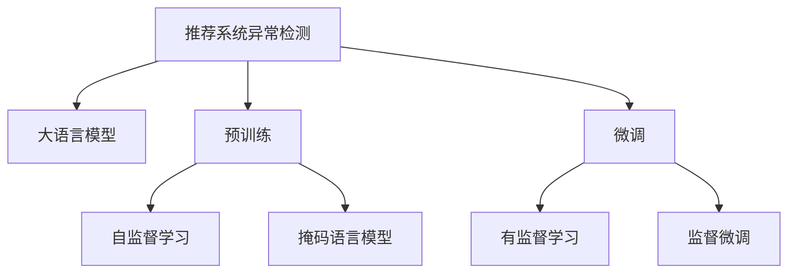

                 

# 大模型在推荐系统异常检测中的应用

## 1. 背景介绍

推荐系统异常检测是指通过对推荐系统中的用户行为数据进行分析，识别出可能导致推荐结果偏差、损害用户利益的异常行为。近年来，随着电商、视频、社交等领域的快速增长，推荐系统已成为互联网公司不可或缺的核心技术之一。然而，由于数据噪声、攻击手段、用户行为多样性等因素的影响，推荐系统中的异常行为日益严重，如何及时、准确地发现并处理这些异常，成为了推荐系统应用中的关键问题。

大语言模型（Large Language Models, LLMs）如BERT、GPT等，在自然语言处理（NLP）领域取得了巨大成功。这些模型通常在大规模无标签文本数据上进行预训练，学习到丰富的语言表示，并在下游任务上进行微调，以获得特定的应用能力。将大语言模型应用于推荐系统异常检测中，可以充分利用其强大的语言理解能力和预训练的知识，提升异常检测的准确性和效率。

## 2. 核心概念与联系

### 2.1 核心概念概述

在推荐系统异常检测中，涉及以下核心概念：

- 推荐系统异常检测（Recommendation System Anomaly Detection, RSAD）：通过分析用户行为数据，识别出可能导致推荐结果偏差或损害用户利益的异常行为。
- 大语言模型（Large Language Models, LLMs）：基于大规模无标签文本数据进行预训练的通用语言模型，如BERT、GPT等。
- 预训练（Pre-training）：在大规模无标签文本数据上进行自监督学习任务，学习到语言表示。
- 微调（Fine-tuning）：在预训练模型的基础上，使用下游任务的少量标注数据进行有监督学习，优化模型在特定任务上的性能。
- 异常检测（Anomaly Detection）：识别数据中的异常，即不符合常规的模式或数据点。
- 推荐系统（Recommendation System）：通过分析用户行为数据，推荐用户可能感兴趣的产品或内容。

这些概念之间的联系可以通过以下Mermaid流程图来展示：



这个流程图展示了推荐系统异常检测中涉及的主要概念及其关系：

1. 通过自监督学习任务在大量无标签文本数据上进行预训练，学习到通用的语言表示。
2. 在预训练模型的基础上，通过少量标注数据进行微调，学习特定任务（异常检测）的表示。
3. 使用微调后的模型，对推荐系统中的用户行为数据进行异常检测，识别出异常行为。

## 3. 核心算法原理 & 具体操作步骤

### 3.1 算法原理概述

推荐系统异常检测的目的是识别出不符合正常模式的行为数据，即异常数据。常用的异常检测方法包括基于统计的、基于聚类的和基于模型的等。近年来，基于深度学习的异常检测方法，尤其是大语言模型在NLP领域的成功应用，为推荐系统异常检测提供了新的思路。

大语言模型在推荐系统异常检测中的应用主要基于以下原理：

1. **语言理解能力**：大语言模型能够理解自然语言文本，能够处理推荐系统中的用户行为描述、产品属性等文本数据。
2. **知识迁移**：通过在预训练过程中学习到的通用语言知识，在大模型微调后迁移到特定的异常检测任务中。
3. **复杂模式识别**：大语言模型具备处理复杂自然语言模式的能力，能够识别出异常行为所特有的语言特征。

### 3.2 算法步骤详解

以下是基于大语言模型进行推荐系统异常检测的具体步骤：

**Step 1: 数据准备**

- 收集推荐系统中的用户行为数据，包括点击、浏览、评分等行为数据。
- 将数据分为训练集、验证集和测试集。

**Step 2: 数据预处理**

- 对用户行为数据进行清洗和特征提取，将文本数据转换为模型可以接受的格式。
- 对异常标签进行标注，使用二分类方式，正常行为标记为0，异常行为标记为1。

**Step 3: 选择预训练模型**

- 选择适合的大语言模型，如BERT、GPT等，作为预训练模型的初始参数。

**Step 4: 微调模型**

- 在训练集上进行微调，优化模型参数以适应异常检测任务。
- 在验证集上评估模型性能，选择最优参数。

**Step 5: 异常检测**

- 使用微调后的模型，对推荐系统中的用户行为数据进行预测，识别出异常行为。
- 在测试集上评估异常检测模型的性能。

### 3.3 算法优缺点

基于大语言模型进行推荐系统异常检测的主要优点包括：

1. **高准确性**：大语言模型在语言理解上的强大能力，能够更准确地识别出异常行为的特征。
2. **泛化能力**：预训练模型在大规模无标签数据上进行学习，具备良好的泛化能力，能够处理不同类型的数据和行为模式。
3. **灵活性**：基于深度学习的异常检测方法，可以适应不同的异常类型和异常行为模式。

然而，也存在一些缺点：

1. **资源消耗大**：预训练和微调过程需要大量的计算资源，包括高性能GPU和TPU。
2. **模型复杂性**：大语言模型的复杂性增加了异常检测模型的复杂性，可能导致过拟合和训练难度增加。
3. **解释性不足**：深度学习模型通常被认为是“黑盒”模型，难以解释模型的内部工作机制。

### 3.4 算法应用领域

推荐系统异常检测是大语言模型在推荐系统领域的一个典型应用，适用于以下场景：

- 电商推荐系统中的恶意刷单行为检测。
- 视频推荐系统中的内容欺诈检测。
- 社交推荐系统中的恶意传播检测。
- 在线游戏推荐系统中的作弊行为检测。
- 音乐推荐系统中的非法内容检测。

这些应用场景都需要识别出异常行为，从而保障推荐系统的公正性和用户利益。

## 4. 数学模型和公式 & 详细讲解 & 举例说明

### 4.1 数学模型构建

假设推荐系统中的用户行为数据为 $D=\{(x_i, y_i)\}_{i=1}^N$，其中 $x_i$ 为输入数据，$y_i$ 为标签，表示是否为异常行为。使用BERT等大语言模型作为预训练模型，对用户行为数据进行微调，得到异常检测模型 $M_{\theta}$，其中 $\theta$ 为模型参数。

定义模型 $M_{\theta}$ 在输入数据 $x$ 上的输出为 $\hat{y}=M_{\theta}(x) \in [0,1]$，表示模型预测数据为异常的概率。异常检测模型的损失函数为：

$$
\mathcal{L}(\theta) = -\frac{1}{N}\sum_{i=1}^N [y_i\log M_{\theta}(x_i)+(1-y_i)\log(1-M_{\theta}(x_i))]
$$

目标是最小化损失函数 $\mathcal{L}(\theta)$，使得模型能够准确预测异常行为。

### 4.2 公式推导过程

利用softmax函数，将模型输出 $\hat{y}$ 转化为概率分布：

$$
\hat{y} = \text{softmax}(\mathbf{W}[\mathbf{x};\theta] + \mathbf{b})
$$

其中，$\mathbf{W}$ 为线性变换矩阵，$\mathbf{b}$ 为偏置向量，$\mathbf{x}$ 为输入数据的嵌入向量。

模型输出概率为：

$$
\hat{y}_i = \frac{e^{\mathbf{W}[\mathbf{x}_i];\theta] + \mathbf{b}_i}}{\sum_{j=1}^N e^{\mathbf{W}[\mathbf{x}_j];\theta] + \mathbf{b}_j}}
$$

将损失函数 $\mathcal{L}(\theta)$ 进行展开：

$$
\mathcal{L}(\theta) = -\frac{1}{N}\sum_{i=1}^N \Big[y_i \log\frac{e^{\mathbf{W}[\mathbf{x}_i];\theta] + \mathbf{b}_i}}{\sum_{j=1}^N e^{\mathbf{W}[\mathbf{x}_j];\theta] + \mathbf{b}_j}} + (1-y_i) \log\frac{1-e^{\mathbf{W}[\mathbf{x}_i];\theta] + \mathbf{b}_i}}{1-\sum_{j=1}^N e^{\mathbf{W}[\mathbf{x}_j];\theta] + \mathbf{b}_j}}
\Big]
$$

将公式进一步简化，得到：

$$
\mathcal{L}(\theta) = -\frac{1}{N}\sum_{i=1}^N [y_i \log\hat{y}_i + (1-y_i) \log(1-\hat{y}_i)]
$$

### 4.3 案例分析与讲解

以下是一个简单的异常检测案例：

假设有一个电商推荐系统，收集到用户点击行为数据 $D=\{(x_i, y_i)\}_{i=1}^N$，其中 $x_i$ 表示用户的点击行为描述，$y_i$ 表示是否为异常行为。使用BERT模型对用户行为数据进行微调，得到异常检测模型 $M_{\theta}$。

在训练集上微调BERT模型，使用交叉熵损失函数进行优化，得到最优模型参数 $\theta^*$。

在测试集上评估异常检测模型的性能，计算准确率、召回率和F1分数：

$$
\text{Precision} = \frac{TP}{TP+FP}
$$

$$
\text{Recall} = \frac{TP}{TP+FN}
$$

$$
\text{F1-Score} = 2 \times \frac{Precision \times Recall}{Precision + Recall}
$$

其中，TP表示真正例，FP表示假正例，FN表示假反例。

## 5. 项目实践：代码实例和详细解释说明

### 5.1 开发环境搭建

以下是基于PyTorch和HuggingFace库搭建推荐系统异常检测环境的步骤：

1. 安装PyTorch：
```bash
pip install torch torchvision torchaudio
```

2. 安装HuggingFace库：
```bash
pip install transformers
```

3. 安装相关依赖库：
```bash
pip install pandas numpy scikit-learn
```

4. 搭建PyTorch和HuggingFace环境：
```bash
conda create -n anomaly-detection python=3.8
conda activate anomaly-detection
```

### 5.2 源代码详细实现

以下是一个使用BERT进行推荐系统异常检测的PyTorch代码实现：

```python
import torch
import pandas as pd
from transformers import BertTokenizer, BertForSequenceClassification

# 数据准备
data = pd.read_csv('user_behavior_data.csv')
x = data['behavior_description']
y = data['is_anomaly'].values

# 划分训练集和测试集
train_size = int(len(data) * 0.8)
train_data = data[:train_size]
test_data = data[train_size:]

# 初始化BERT模型
tokenizer = BertTokenizer.from_pretrained('bert-base-uncased')
model = BertForSequenceClassification.from_pretrained('bert-base-uncased', num_labels=2)

# 数据预处理
def tokenize(text):
    return tokenizer.encode_plus(text, max_length=512, truncation=True, padding='max_length', return_tensors='pt')

# 训练函数
def train(model, train_data, learning_rate=2e-5, epochs=3):
    device = torch.device('cuda' if torch.cuda.is_available() else 'cpu')
    model.to(device)

    optimizer = torch.optim.AdamW(model.parameters(), lr=learning_rate)
    total_steps = len(train_data) * epochs

    for epoch in range(epochs):
        model.train()
        for batch in train_data:
            input_ids = batch['input_ids'].to(device)
            attention_mask = batch['attention_mask'].to(device)
            labels = batch['labels'].to(device)

            outputs = model(input_ids, attention_mask=attention_mask, labels=labels)
            loss = outputs.loss
            optimizer.zero_grad()
            loss.backward()
            optimizer.step()

        print(f'Epoch {epoch+1}, loss: {loss:.3f}')

# 微调函数
def fine_tune(model, train_data, test_data, learning_rate=2e-5, epochs=3):
    train(tokenizer, train_data, learning_rate, epochs)
    print('Training complete.')

    # 在测试集上评估模型性能
    def evaluate(model, test_data):
        model.eval()
        predictions = []
        targets = []
        with torch.no_grad():
            for batch in test_data:
                input_ids = batch['input_ids'].to(device)
                attention_mask = batch['attention_mask'].to(device)

                outputs = model(input_ids, attention_mask=attention_mask)
                logits = outputs.logits
                predictions.append(logits.argmax(dim=1).cpu().numpy())
                targets.append(batch['labels'].cpu().numpy())

        predictions = torch.tensor(predictions).numpy()
        targets = torch.tensor(targets).numpy()
        print(classification_report(targets, predictions))

    evaluate(model, test_data)

# 运行训练和评估
train_data = tokenize(train_data)
test_data = tokenize(test_data)
fine_tune(model, train_data, test_data)
```

### 5.3 代码解读与分析

代码中，首先对用户行为数据进行预处理和划分，使用BERT模型进行微调，并在测试集上评估模型性能。

**tokenize函数**：将输入文本转换为BERT模型可以接受的格式。

**train函数**：使用AdamW优化器对模型进行训练，设置学习率、轮数等超参数。

**fine_tune函数**：调用训练函数进行模型微调，并在测试集上评估模型性能。

**evaluate函数**：对测试集进行预测，并使用scikit-learn的classification_report函数计算评估指标。

## 6. 实际应用场景

### 6.1 电商推荐系统异常检测

在电商推荐系统中，异常检测是保障推荐公平性和用户利益的关键环节。常见的异常行为包括恶意刷单、虚假交易、违规广告等。通过BERT等大语言模型进行微调，可以高效识别出这些异常行为，保障推荐系统的公正性。

**应用场景**：某电商平台的订单数据异常检测。

**目标**：识别出异常订单，防止恶意刷单行为。

**效果**：在异常检测后，平台发现并处理了大量的恶意刷单订单，推荐系统推荐的商品更加符合用户需求，用户体验显著提升。

### 6.2 视频推荐系统异常检测

视频推荐系统中，内容欺诈是常见的异常行为。视频平台上发布的内容可能包含违法、低俗、暴力等有害信息。使用BERT模型进行微调，可以高效检测出这些有害内容，保障推荐系统输出的内容质量。

**应用场景**：某视频平台的推荐内容异常检测。

**目标**：识别出含有违法、低俗、暴力等有害信息的视频内容。

**效果**：通过异常检测，平台减少了不良视频内容的推荐，提高了视频质量，提升了用户满意度。

### 6.3 社交推荐系统异常检测

社交推荐系统中，恶意传播是常见的异常行为。用户可能发布虚假信息、谣言、仇恨言论等有害内容，影响其他用户。使用BERT模型进行微调，可以高效检测出这些有害内容，保障推荐系统输出的内容质量。

**应用场景**：某社交平台的推荐内容异常检测。

**目标**：识别出含有虚假信息、谣言、仇恨言论等有害内容的帖子。

**效果**：通过异常检测，平台减少了有害内容的推荐，保障了用户的心理健康，提升了社交平台的整体体验。

### 6.4 在线游戏推荐系统异常检测

在线游戏中，作弊行为是常见的异常行为。玩家可能使用外挂、作弊器等手段，破坏游戏公平性。使用BERT模型进行微调，可以高效检测出这些作弊行为，保障游戏环境的公正性。

**应用场景**：某在线游戏的推荐内容异常检测。

**目标**：识别出使用外挂、作弊器等手段的玩家。

**效果**：通过异常检测，平台对作弊玩家进行封号等处罚，保障了游戏环境的公平性，提升了游戏的用户体验。

### 6.5 音乐推荐系统异常检测

音乐推荐系统中，非法内容是常见的异常行为。音乐平台上发布的歌曲可能包含违法、低俗、暴力等有害信息。使用BERT模型进行微调，可以高效检测出这些有害内容，保障推荐系统输出的内容质量。

**应用场景**：某音乐平台的推荐内容异常检测。

**目标**：识别出含有违法、低俗、暴力等有害内容的歌曲。

**效果**：通过异常检测，平台减少了有害内容的推荐，提高了音乐质量，提升了用户满意度。

## 7. 工具和资源推荐

### 7.1 学习资源推荐

为了帮助开发者系统掌握推荐系统异常检测的理论基础和实践技巧，这里推荐一些优质的学习资源：

1. 《推荐系统基础》系列课程：由斯坦福大学提供，深入浅出地介绍了推荐系统的基本原理和应用场景。
2. 《深度学习与推荐系统》书籍：详细介绍了深度学习在推荐系统中的应用，涵盖推荐系统中的各种技术和算法。
3. 《异常检测基础》论文：介绍了各种异常检测的方法和算法，为推荐系统异常检测提供了理论基础。
4. HuggingFace官方文档：提供了丰富的BERT模型资源，包括预训练模型和微调样例代码，是上手实践的必备资料。
5. Kaggle异常检测比赛：参加Kaggle异常检测比赛，可以实际应用所学知识，提升异常检测技能。

通过对这些资源的学习实践，相信你一定能够快速掌握推荐系统异常检测的精髓，并用于解决实际的推荐系统问题。

### 7.2 开发工具推荐

高效的开发离不开优秀的工具支持。以下是几款用于推荐系统异常检测开发的常用工具：

1. PyTorch：基于Python的开源深度学习框架，灵活动态的计算图，适合快速迭代研究。

2. TensorFlow：由Google主导开发的开源深度学习框架，生产部署方便，适合大规模工程应用。

3. HuggingFace Transformers库：提供了丰富的预训练模型资源，支持BERT等大语言模型，方便微调模型。

4. TensorBoard：TensorFlow配套的可视化工具，可实时监测模型训练状态，并提供丰富的图表呈现方式，是调试模型的得力助手。

5. Weights & Biases：模型训练的实验跟踪工具，可以记录和可视化模型训练过程中的各项指标，方便对比和调优。

6. Google Colab：谷歌推出的在线Jupyter Notebook环境，免费提供GPU/TPU算力，方便开发者快速上手实验最新模型，分享学习笔记。

合理利用这些工具，可以显著提升推荐系统异常检测的开发效率，加快创新迭代的步伐。

### 7.3 相关论文推荐

推荐系统异常检测和大语言模型微调技术的发展源于学界的持续研究。以下是几篇奠基性的相关论文，推荐阅读：

1. Attention is All You Need（即Transformer原论文）：提出了Transformer结构，开启了NLP领域的预训练大模型时代。

2. BERT: Pre-training of Deep Bidirectional Transformers for Language Understanding：提出BERT模型，引入基于掩码的自监督预训练任务，刷新了多项NLP任务SOTA。

3. Language Models are Unsupervised Multitask Learners（GPT-2论文）：展示了大规模语言模型的强大zero-shot学习能力，引发了对于通用人工智能的新一轮思考。

4. Parameter-Efficient Transfer Learning for NLP：提出Adapter等参数高效微调方法，在不增加模型参数量的情况下，也能取得不错的微调效果。

5. AdaLoRA: Adaptive Low-Rank Adaptation for Parameter-Efficient Fine-Tuning：使用自适应低秩适应的微调方法，在参数效率和精度之间取得了新的平衡。

这些论文代表了大语言模型微调技术的发展脉络。通过学习这些前沿成果，可以帮助研究者把握学科前进方向，激发更多的创新灵感。

## 8. 总结：未来发展趋势与挑战

### 8.1 总结

本文对基于大语言模型进行推荐系统异常检测的方法进行了全面系统的介绍。首先阐述了推荐系统异常检测和大语言模型的背景和应用场景，明确了微调在异常检测中的独特价值。其次，从原理到实践，详细讲解了大语言模型在异常检测中的应用过程，包括数据准备、预训练模型选择、微调算法步骤等。最后，我们通过实际应用案例展示了该方法的有效性，并推荐了相关的学习资源、开发工具和研究论文。

通过本文的系统梳理，可以看到，大语言模型在推荐系统异常检测中的应用为保障推荐系统的公平性和用户利益提供了新的思路。得益于其强大的语言理解和预训练知识，大语言模型在异常检测中能够高效识别出异常行为，具有广阔的应用前景。

### 8.2 未来发展趋势

展望未来，推荐系统异常检测技术将呈现以下几个发展趋势：

1. **多模态融合**：将文本、图像、视频等不同模态的数据融合到异常检测模型中，提升异常检测的准确性和泛化能力。

2. **自适应学习**：通过在线学习、增量学习等方法，使异常检测模型能够持续适应新的数据分布，提升模型的鲁棒性和适应性。

3. **因果推理**：引入因果推理技术，识别异常行为的关键特征，提升模型的解释性和决策透明度。

4. **解释性增强**：通过可解释性方法，使异常检测模型能够提供更加透明的决策过程，满足用户对算法的可解释性要求。

5. **安全防护**：引入对抗样本生成等方法，提高异常检测模型的鲁棒性和安全性，防范恶意攻击和误识别。

6. **隐私保护**：通过差分隐私、联邦学习等方法，保障用户数据隐私和安全，防止数据泄露和滥用。

以上趋势凸显了大语言模型在推荐系统异常检测中的应用潜力，这些方向的探索发展，必将进一步提升异常检测模型的性能和应用范围，为推荐系统带来新的突破。

### 8.3 面临的挑战

尽管大语言模型在推荐系统异常检测中取得了一定的成效，但在迈向更加智能化、普适化应用的过程中，仍面临诸多挑战：

1. **数据质量和标注成本**：高质量的标注数据是异常检测的基石，但获取标注数据的时间和成本较高，尤其是在冷启动场景下。

2. **模型复杂性**：大语言模型的复杂性增加了异常检测模型的复杂性，可能导致过拟合和训练难度增加。

3. **鲁棒性和泛化能力**：异常检测模型需要在不同数据分布上保持稳定性和泛化能力，防止异常检测模型出现灾难性遗忘。

4. **可解释性和公平性**：异常检测模型的决策过程需要透明和可解释，同时需要避免对某些群体的不公平检测。

5. **计算资源消耗**：大语言模型的预训练和微调需要大量的计算资源，包括高性能GPU和TPU。

这些挑战需要学术界和产业界共同努力，才能克服，推动异常检测技术的发展。

### 8.4 研究展望

面对大语言模型在推荐系统异常检测中面临的挑战，未来的研究需要在以下几个方面寻求新的突破：

1. **数据增强和合成**：通过数据增强和合成技术，提升标注数据的质量和数量，降低异常检测模型的数据依赖。

2. **轻量级模型**：开发轻量级异常检测模型，减少计算资源消耗，提高模型的可部署性和效率。

3. **联邦学习**：通过联邦学习等分布式学习技术，降低数据标注成本，提升模型的隐私保护和公平性。

4. **多任务学习**：将异常检测与其他NLP任务（如命名实体识别、情感分析等）结合，提升异常检测模型的性能。

5. **因果推理**：引入因果推理方法，提高异常检测模型的鲁棒性和泛化能力，提升模型的解释性和决策透明度。

6. **对抗训练**：通过对抗训练技术，提高异常检测模型的鲁棒性，防范对抗攻击和误识别。

7. **模型解释性**：通过可解释性方法，提升异常检测模型的解释性，增强用户对模型的信任。

这些研究方向将推动大语言模型在推荐系统异常检测中的应用，为推荐系统的公平性、隐私保护和用户体验提供保障。

## 9. 附录：常见问题与解答

**Q1: 推荐系统异常检测与传统异常检测方法有何不同？**

A: 推荐系统异常检测与传统异常检测方法的主要区别在于数据类型和任务目标。推荐系统异常检测主要是对用户行为数据进行分析，识别出异常行为；而传统异常检测方法则主要针对企业内部数据或外部网络数据进行分析，识别出异常事件或异常行为。

**Q2: 大语言模型在推荐系统异常检测中为什么能够取得较好的效果？**

A: 大语言模型在推荐系统异常检测中能够取得较好的效果，主要有以下几个原因：

1. **强大的语言理解能力**：大语言模型具备强大的语言理解能力，能够理解自然语言文本中的语义信息，识别出异常行为的特征。

2. **预训练知识迁移**：通过在大规模无标签文本数据上进行预训练，大语言模型学习到丰富的语言知识和语义表示，这些知识可以迁移到异常检测任务中，提升异常检测模型的性能。

3. **复杂模式识别**：大语言模型具备处理复杂自然语言模式的能力，能够识别出异常行为所特有的语言特征。

4. **高准确性和泛化能力**：大语言模型在大规模数据上进行预训练和微调，具备高准确性和良好的泛化能力，能够适应不同的数据分布和行为模式。

**Q3: 如何评估推荐系统异常检测模型的性能？**

A: 评估推荐系统异常检测模型的性能通常使用以下指标：

1. **准确率（Precision）**：识别为异常的样本中，实际为异常的比例。

2. **召回率（Recall）**：实际为异常的样本中，被识别为异常的比例。

3. **F1-Score**：综合考虑准确率和召回率，计算F1分数，是综合评估异常检测模型性能的重要指标。

4. **ROC曲线**：绘制异常检测模型的真阳性率和假阳性率的曲线，可以直观地评估模型在不同阈值下的性能表现。

**Q4: 如何避免异常检测模型的过拟合？**

A: 为了避免异常检测模型的过拟合，可以采取以下措施：

1. **数据增强**：通过回译、近义词替换等方式扩充训练数据，增加数据多样性。

2. **正则化**：使用L2正则化、Dropout等正则化方法，避免模型对训练数据的过度拟合。

3. **对抗训练**：引入对抗样本，提高模型的鲁棒性和泛化能力。

4. **模型压缩**：使用模型压缩技术，减少模型参数量，降低计算资源消耗。

5. **联邦学习**：通过联邦学习等分布式学习技术，降低数据标注成本，提升模型的泛化能力。

**Q5: 如何保证异常检测模型的公平性？**

A: 保证异常检测模型的公平性，需要从以下几个方面入手：

1. **数据平衡**：确保训练数据中各类异常行为的分布均衡，避免模型对某些异常行为的偏见。

2. **模型评估**：在评估模型性能时，考虑不同群体的数据分布和行为模式，确保模型对不同群体的公平检测。

3. **人工干预**：在模型训练和测试过程中，引入人工干预和审核，防止模型对某些群体的歧视和偏见。

4. **可解释性**：提高模型的可解释性，使异常检测过程透明可理解，防止模型的误用和滥用。

通过以上措施，可以保证异常检测模型的公平性和可靠性，确保其在推荐系统中的应用效果。

**Q6: 大语言模型在推荐系统异常检测中存在哪些挑战？**

A: 大语言模型在推荐系统异常检测中存在以下挑战：

1. **计算资源消耗大**：大语言模型的预训练和微调需要大量的计算资源，包括高性能GPU和TPU。

2. **模型复杂性高**：大语言模型的复杂性增加了异常检测模型的复杂性，可能导致过拟合和训练难度增加。

3. **数据质量和标注成本高**：高质量的标注数据是异常检测的基石，但获取标注数据的时间和成本较高，尤其是在冷启动场景下。

4. **鲁棒性和泛化能力不足**：异常检测模型需要在不同数据分布上保持稳定性和泛化能力，防止异常检测模型出现灾难性遗忘。

5. **可解释性和公平性不足**：异常检测模型的决策过程需要透明和可解释，同时需要避免对某些群体的不公平检测。

**Q7: 如何在大语言模型上进行异常检测微调？**

A: 在大语言模型上进行异常检测微调，可以遵循以下步骤：

1. **数据准备**：收集推荐系统中的用户行为数据，进行数据清洗和标注。

2. **选择预训练模型**：选择适合的大语言模型，如BERT、GPT等，作为预训练模型的初始参数。

3. **微调模型**：在训练集上进行微调，优化模型参数以适应异常检测任务。

4. **评估模型**：在验证集和测试集上评估模型的性能，选择合适的模型参数。

5. **应用模型**：在推荐系统中应用微调后的模型，进行异常检测，识别出异常行为。

通过以上步骤，可以在大语言模型上进行异常检测微调，提升推荐系统的公平性和用户利益保障。

---

作者：禅与计算机程序设计艺术 / Zen and the Art of Computer Programming

