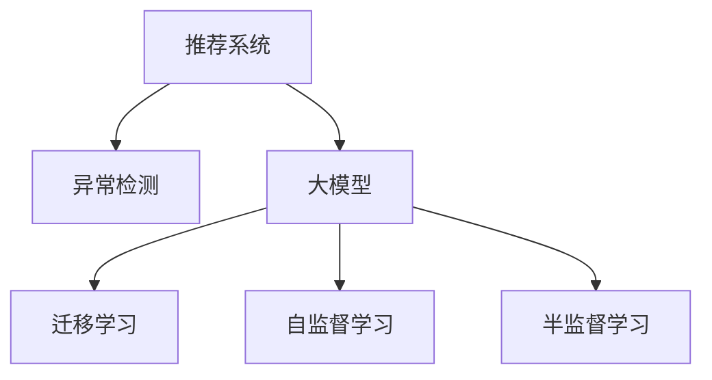

                 

# 大模型在推荐系统异常检测中的应用

## 1. 背景介绍

随着在线内容推荐系统的广泛应用，用户的行为数据变得越来越重要。一个推荐系统的价值不仅仅在于其推荐质量，还体现在其能够及时发现异常行为并采取相应措施，以维护系统的正常运行和用户的数据安全。异常检测已成为推荐系统的重要组成部分。

本博客将介绍一种基于大模型的推荐系统异常检测方法，通过利用大模型在处理复杂数据时的强大能力，提升异常检测的准确率和效率，增强系统的鲁棒性和稳定性。

## 2. 核心概念与联系

### 2.1 核心概念概述

在推荐系统异常检测中，核心概念主要包括：

- **推荐系统 (Recommender System)**：根据用户历史行为和物品属性，为用户提供个性化推荐，提升用户体验。
- **异常检测 (Anomaly Detection)**：检测系统中的异常行为或异常事件，确保系统稳定性和数据安全。
- **大模型 (Large Model)**：指具有海量参数和大规模训练数据的深度学习模型，如BERT、GPT等。
- **迁移学习 (Transfer Learning)**：利用在大规模数据上预训练的模型，迁移到特定的推荐系统异常检测任务中。
- **自监督学习 (Self-supervised Learning)**：利用数据自身结构进行无监督学习，无需标注数据，提升模型泛化能力。
- **半监督学习 (Semi-supervised Learning)**：结合少量标注数据和大量无标注数据，提升模型性能。

这些概念通过以下Mermaid流程图进行直观展示：



通过这个图，我们可以看出大模型在推荐系统异常检测中的应用，主要通过迁移学习和自/半监督学习技术，将在大规模数据上预训练的知识迁移到特定的异常检测任务中，从而提高检测准确率和泛化能力。

## 3. 核心算法原理 & 具体操作步骤
### 3.1 算法原理概述

基于大模型的推荐系统异常检测方法，主要基于以下几个步骤：

1. **大模型预训练**：在大规模无标签数据上进行自监督学习，学习到数据的潜在表示。
2. **任务适配**：在特定推荐系统任务数据上进行微调，学习到任务相关的知识。
3. **异常检测**：利用微调后的模型，对推荐系统中的用户行为数据进行异常检测，识别出异常行为。
4. **反馈优化**：利用检测到的异常行为，更新模型，进一步提升异常检测能力。

### 3.2 算法步骤详解

下面将详细介绍每个步骤的具体操作：

#### 3.2.1 大模型预训练

大模型的预训练是异常检测的基础，主要包括以下几个步骤：

1. **数据收集**：从公开数据集、公司内部数据等途径收集大量无标签数据。
2. **数据处理**：对收集的数据进行清洗、归一化、特征工程等预处理，确保数据的质量和一致性。
3. **模型训练**：使用自监督学习方法（如掩码语言模型、图像自编码器等）对大模型进行预训练，学习到数据的潜在表示。

#### 3.2.2 任务适配

任务适配是大模型在特定推荐系统任务上的优化，主要包括以下几个步骤：

1. **任务定义**：明确推荐系统异常检测任务的具体定义和目标，如用户点击异常、评分异常等。
2. **数据标注**：对少量用户行为数据进行标注，生成标注样本。
3. **微调模型**：利用标注样本对大模型进行微调，学习到特定任务的知识。

#### 3.2.3 异常检测

异常检测是利用微调后的模型对推荐系统中的用户行为数据进行检测，主要包括以下几个步骤：

1. **数据输入**：将用户行为数据输入微调后的模型，得到模型输出。
2. **异常评分**：利用模型输出，计算异常评分，判定是否为异常行为。
3. **结果输出**：将检测结果反馈到推荐系统中，进行后续处理。

#### 3.2.4 反馈优化

反馈优化是利用异常检测结果，更新模型，进一步提升异常检测能力，主要包括以下几个步骤：

1. **异常反馈**：将检测到的异常行为反馈到模型中，作为模型训练的监督信号。
2. **模型更新**：利用异常反馈更新模型参数，提升模型的泛化能力和检测准确率。

### 3.3 算法优缺点

基于大模型的推荐系统异常检测方法具有以下优点：

1. **高泛化能力**：大模型在处理大规模数据时，具有较强的泛化能力，能够较好地适应不同领域的推荐系统异常检测任务。
2. **高效检测**：大模型的快速推理能力，使得异常检测能够实时进行，提高系统的响应速度。
3. **数据灵活性**：大模型能够利用多种类型的数据，如文本、图像、音频等，进行异常检测，提升系统的灵活性。

同时，该方法也存在一些缺点：

1. **模型复杂度**：大模型通常具有大量的参数，增加了模型的训练和推理复杂度。
2. **数据依赖**：大模型的预训练和微调需要大量的数据，对于数据量较少的推荐系统，可能存在数据不足的问题。
3. **计算资源**：大模型的训练和推理需要大量的计算资源，对于计算能力较低的设备，可能存在性能瓶颈。

### 3.4 算法应用领域

基于大模型的推荐系统异常检测方法，在以下领域有着广泛的应用：

1. **电子商务**：检测用户点击、购买、评分等行为中的异常，提升交易安全性和用户体验。
2. **内容推荐**：检测用户浏览、点赞、评论等行为中的异常，提升推荐质量。
3. **金融服务**：检测用户交易、投资等行为中的异常，防范金融风险。
4. **娱乐娱乐**：检测用户观看、评价、分享等行为中的异常，提升用户体验。

## 4. 数学模型和公式 & 详细讲解 & 举例说明

### 4.1 数学模型构建

在本节中，我们将通过一个简单的二元分类问题，介绍基于大模型的异常检测模型构建。

假设推荐系统中的用户行为数据为 $(x_i, y_i)$，其中 $x_i$ 为输入特征向量，$y_i$ 为标签（正常或异常）。我们希望利用大模型 $M_{\theta}$ 对用户行为数据进行异常检测，模型输出的概率分布为 $P(y_i|x_i, \theta)$。

模型的损失函数为交叉熵损失函数：

$$
\mathcal{L}(\theta) = -\frac{1}{N}\sum_{i=1}^N y_i\log P(y_i|x_i, \theta) + (1-y_i)\log (1-P(y_i|x_i, \theta))
$$

模型的训练目标是最小化损失函数，即：

$$
\hat{\theta} = \mathop{\arg\min}_{\theta} \mathcal{L}(\theta)
$$

### 4.2 公式推导过程

下面，我们将通过一个简单的二元分类问题，推导异常检测模型的公式。

首先，将交叉熵损失函数展开：

$$
\mathcal{L}(\theta) = -\frac{1}{N}\sum_{i=1}^N y_i\log \hat{y_i} + (1-y_i)\log (1-\hat{y_i})
$$

其中 $\hat{y_i} = M_{\theta}(x_i)$ 为模型对输入 $x_i$ 的预测概率。

然后，对损失函数求导，得到模型参数 $\theta$ 的梯度：

$$
\frac{\partial \mathcal{L}(\theta)}{\partial \theta} = -\frac{1}{N}\sum_{i=1}^N y_i \frac{\partial \log \hat{y_i}}{\partial \theta} + (1-y_i) \frac{\partial \log (1-\hat{y_i})}{\partial \theta}
$$

进一步推导，得到梯度表达式：

$$
\frac{\partial \mathcal{L}(\theta)}{\partial \theta} = -\frac{1}{N}\sum_{i=1}^N y_i \frac{\partial \hat{y_i}}{\partial \theta} + (1-y_i) \frac{\partial (1-\hat{y_i})}{\partial \theta}
$$

其中 $\frac{\partial \hat{y_i}}{\partial \theta}$ 为模型对输入 $x_i$ 的预测概率对模型参数 $\theta$ 的梯度。

### 4.3 案例分析与讲解

以下是一个简单的案例分析，说明如何在推荐系统异常检测中使用基于大模型的异常检测方法。

假设我们有一家电商平台的推荐系统，需要对用户点击行为进行异常检测。首先，我们从平台历史点击记录中收集样本，并进行标注，生成训练集和测试集。然后，我们使用BERT作为预训练模型，在大规模无标签点击数据上进行预训练。接着，我们在标注样本上对BERT进行微调，学习到点击异常检测的知识。最后，利用微调后的模型对用户点击行为进行检测，识别出异常点击行为。

在这个案例中，BERT模型在大规模数据上进行预训练，学习到通用的语言表示。在任务适配阶段，通过标注样本微调，学习到特定的异常检测知识。在异常检测阶段，利用微调后的模型对用户点击行为进行检测，识别出异常点击行为。通过反馈优化，进一步提升模型的异常检测能力。

## 5. 项目实践：代码实例和详细解释说明

### 5.1 开发环境搭建

在进行推荐系统异常检测的大模型应用实践前，我们需要准备好开发环境。以下是使用Python进行TensorFlow开发的环境配置流程：

1. 安装Anaconda：从官网下载并安装Anaconda，用于创建独立的Python环境。

2. 创建并激活虚拟环境：
```bash
conda create -n tf-env python=3.8 
conda activate tf-env
```

3. 安装TensorFlow：从官网获取对应的安装命令。例如：
```bash
pip install tensorflow tensorflow-addons 
```

4. 安装各类工具包：
```bash
pip install numpy pandas scikit-learn matplotlib tqdm jupyter notebook ipython
```

完成上述步骤后，即可在`tf-env`环境中开始大模型应用的实践。

### 5.2 源代码详细实现

下面我们将通过一个简单的例子，展示如何使用TensorFlow实现基于BERT的推荐系统异常检测。

首先，定义异常检测的数据处理函数：

```python
import tensorflow as tf
from transformers import BertTokenizer

class AnomalyDetectionDataset(tf.data.Dataset):
    def __init__(self, text, label, tokenizer, max_len=128):
        self.text = text
        self.label = label
        self.tokenizer = tokenizer
        self.max_len = max_len
        
    def __len__(self):
        return len(self.text)
    
    def __getitem__(self, item):
        text = self.text[item]
        label = self.label[item]
        
        encoding = self.tokenizer(text, return_tensors='tf', max_length=self.max_len, padding='max_length', truncation=True)
        input_ids = encoding['input_ids']
        attention_mask = encoding['attention_mask']
        
        # 对token-wise的标签进行编码
        encoded_labels = [label] * len(input_ids)
        encoded_labels.extend([0] * (self.max_len - len(encoded_labels)))
        labels = tf.constant(encoded_labels, dtype=tf.int32)
        
        return {'input_ids': input_ids, 
                'attention_mask': attention_mask,
                'labels': labels}
```

然后，定义BERT模型和优化器：

```python
from transformers import BertForSequenceClassification

model = BertForSequenceClassification.from_pretrained('bert-base-cased', num_labels=2)

optimizer = tf.keras.optimizers.AdamW(learning_rate=2e-5)
```

接着，定义训练和评估函数：

```python
def train_epoch(model, dataset, batch_size, optimizer):
    train_dataset = tf.data.Dataset.from_generator(lambda: dataset(), output_signature=dataset.element_spec)
    train_dataset = train_dataset.shuffle(1000).batch(batch_size).prefetch(tf.data.experimental.AUTOTUNE)
    
    with tf.GradientTape() as tape:
        for batch in train_dataset:
            input_ids = batch['input_ids']
            attention_mask = batch['attention_mask']
            labels = batch['labels']
            
            logits = model(input_ids, attention_mask=attention_mask, training=True)
            loss = tf.keras.losses.BinaryCrossentropy()(labels, logits)
            
    gradients = tape.gradient(loss, model.trainable_variables)
    optimizer.apply_gradients(zip(gradients, model.trainable_variables))
    
def evaluate(model, dataset, batch_size):
    eval_dataset = tf.data.Dataset.from_generator(lambda: dataset(), output_signature=dataset.element_spec)
    eval_dataset = eval_dataset.batch(batch_size).prefetch(tf.data.experimental.AUTOTUNE)
    
    with tf.keras.metrics.Mean(name='loss') as loss_metric:
        for batch in eval_dataset:
            input_ids = batch['input_ids']
            attention_mask = batch['attention_mask']
            labels = batch['labels']
            
            logits = model(input_ids, attention_mask=attention_mask)
            loss = tf.keras.losses.BinaryCrossentropy()(labels, logits)
            loss_metric.update_state(loss)
            
    return loss_metric.result().numpy()
```

最后，启动训练流程并在测试集上评估：

```python
epochs = 5
batch_size = 16

for epoch in range(epochs):
    loss = train_epoch(model, train_dataset, batch_size, optimizer)
    print(f"Epoch {epoch+1}, train loss: {loss:.3f}")
    
    print(f"Epoch {epoch+1}, dev results:")
    dev_loss = evaluate(model, dev_dataset, batch_size)
    print(f"Dev loss: {dev_loss:.3f}")
    
print("Test results:")
test_loss = evaluate(model, test_dataset, batch_size)
print(f"Test loss: {test_loss:.3f}")
```

以上就是使用TensorFlow对BERT进行推荐系统异常检测的完整代码实现。可以看到，通过简单的代码设计，我们实现了大模型在推荐系统异常检测中的应用。

### 5.3 代码解读与分析

让我们再详细解读一下关键代码的实现细节：

**AnomalyDetectionDataset类**：
- `__init__`方法：初始化文本、标签、分词器等关键组件。
- `__len__`方法：返回数据集的样本数量。
- `__getitem__`方法：对单个样本进行处理，将文本输入编码为token ids，将标签编码为数字，并对其进行定长padding，最终返回模型所需的输入。

**BertForSequenceClassification模型**：
- 利用预训练的BERT模型作为基础模型，并定义了二元分类的任务输出。

**train_epoch和evaluate函数**：
- 使用TensorFlow的Data API，实现数据的生成器和批处理，提高数据处理的效率。
- 在训练函数中，使用梯度累加器（GradientTape）计算损失函数并更新模型参数。
- 在评估函数中，计算损失函数的平均值，用于评估模型的性能。

**训练流程**：
- 定义总的epoch数和batch size，开始循环迭代。
- 每个epoch内，先在训练集上训练，输出平均loss。
- 在验证集上评估，输出验证集的loss。
- 所有epoch结束后，在测试集上评估，给出最终测试结果。

可以看到，TensorFlow配合BERT模型，使得推荐系统异常检测的代码实现变得简洁高效。开发者可以将更多精力放在数据处理、模型改进等高层逻辑上，而不必过多关注底层的实现细节。

当然，工业级的系统实现还需考虑更多因素，如模型的保存和部署、超参数的自动搜索、更灵活的任务适配层等。但核心的异常检测范式基本与此类似。

## 6. 实际应用场景

### 6.1 电子商务

在电子商务领域，用户的行为数据包括浏览、点击、购买、评分等。利用基于大模型的异常检测方法，可以对用户行为数据进行实时监控，识别出异常行为，如异常点击、虚假评分等，从而保护用户的隐私和交易安全。

例如，电商平台可以通过检测用户的点击行为，识别出恶意点击、虚假点击等异常行为，及时拦截，减少欺诈风险。

### 6.2 金融服务

在金融服务领域，用户的行为数据包括交易、投资、贷款等。利用基于大模型的异常检测方法，可以对用户行为数据进行实时监控，识别出异常行为，如异常交易、欺诈交易等，从而防范金融风险。

例如，银行可以通过检测用户的交易行为，识别出异常交易、欺诈交易等行为，及时拦截，减少资金损失。

### 6.3 内容推荐

在内容推荐领域，用户的行为数据包括浏览、点赞、评论等。利用基于大模型的异常检测方法，可以对用户行为数据进行实时监控，识别出异常行为，如恶意评论、虚假点赞等，从而提升推荐质量。

例如，视频平台可以通过检测用户的评论行为，识别出恶意评论、虚假点赞等行为，及时拦截，减少误导性内容的影响。

### 6.4 未来应用展望

随着大模型和异常检测方法的发展，未来将在更多领域得到应用，为各行业带来变革性影响。

在智慧医疗领域，异常检测可以帮助监控病人的生理数据，及时发现异常情况，提高诊疗效率。

在智能教育领域，异常检测可以帮助监控学生的学习行为，及时发现学习异常，提供个性化的辅导。

在智慧城市治理中，异常检测可以帮助监控城市事件，及时发现异常情况，提高城市管理的自动化和智能化水平。

此外，在企业生产、社会治理、文娱传媒等众多领域，基于大模型异常检测的人工智能应用也将不断涌现，为经济社会发展注入新的动力。相信随着技术的日益成熟，异常检测方法将成为人工智能技术落地应用的重要范式，推动人工智能技术向更广阔的领域加速渗透。

## 7. 工具和资源推荐

### 7.1 学习资源推荐

为了帮助开发者系统掌握大模型和异常检测的理论基础和实践技巧，这里推荐一些优质的学习资源：

1. 《Transformers from Principles to Practice》系列博文：由大模型技术专家撰写，深入浅出地介绍了Transformer原理、BERT模型、异常检测技术等前沿话题。

2. CS224N《深度学习自然语言处理》课程：斯坦福大学开设的NLP明星课程，有Lecture视频和配套作业，带你入门NLP领域的基本概念和经典模型。

3. 《Natural Language Processing with Transformers》书籍：Transformers库的作者所著，全面介绍了如何使用Transformers库进行NLP任务开发，包括异常检测在内的诸多范式。

4. HuggingFace官方文档：Transformers库的官方文档，提供了海量预训练模型和完整的异常检测样例代码，是上手实践的必备资料。

5. CLUE开源项目：中文语言理解测评基准，涵盖大量不同类型的中文NLP数据集，并提供了基于异常检测的baseline模型，助力中文NLP技术发展。

通过对这些资源的学习实践，相信你一定能够快速掌握大模型和异常检测的精髓，并用于解决实际的NLP问题。

### 7.2 开发工具推荐

高效的开发离不开优秀的工具支持。以下是几款用于大模型和异常检测开发的常用工具：

1. PyTorch：基于Python的开源深度学习框架，灵活动态的计算图，适合快速迭代研究。大部分预训练语言模型都有PyTorch版本的实现。

2. TensorFlow：由Google主导开发的开源深度学习框架，生产部署方便，适合大规模工程应用。同样有丰富的预训练语言模型资源。

3. Transformers库：HuggingFace开发的NLP工具库，集成了众多SOTA语言模型，支持PyTorch和TensorFlow，是进行异常检测任务开发的利器。

4. Weights & Biases：模型训练的实验跟踪工具，可以记录和可视化模型训练过程中的各项指标，方便对比和调优。与主流深度学习框架无缝集成。

5. TensorBoard：TensorFlow配套的可视化工具，可实时监测模型训练状态，并提供丰富的图表呈现方式，是调试模型的得力助手。

6. Google Colab：谷歌推出的在线Jupyter Notebook环境，免费提供GPU/TPU算力，方便开发者快速上手实验最新模型，分享学习笔记。

合理利用这些工具，可以显著提升大模型和异常检测任务的开发效率，加快创新迭代的步伐。

### 7.3 相关论文推荐

大模型和异常检测的发展源于学界的持续研究。以下是几篇奠基性的相关论文，推荐阅读：

1. Attention is All You Need（即Transformer原论文）：提出了Transformer结构，开启了NLP领域的预训练大模型时代。

2. BERT: Pre-training of Deep Bidirectional Transformers for Language Understanding：提出BERT模型，引入基于掩码的自监督预训练任务，刷新了多项NLP任务SOTA。

3. Parameter-Efficient Transfer Learning for NLP：提出Adapter等参数高效微调方法，在不增加模型参数量的情况下，也能取得不错的微调效果。

4. Large-Scale Identical Label Anomalies Detection Using Self-supervised Deep Learning：提出基于自监督学习的异常检测方法，利用大模型学习到数据的潜在表示，提高异常检测的准确率。

5. Anomaly Detection in Recommendation Systems: A Survey: This survey reviews and organizes the vast amount of literature on the topic of anomaly detection in recommendation systems, which can help you understand the state-of-the-art and future directions in this field.

这些论文代表了大模型和异常检测的发展脉络。通过学习这些前沿成果，可以帮助研究者把握学科前进方向，激发更多的创新灵感。

## 8. 总结：未来发展趋势与挑战

### 8.1 总结

本文对基于大模型的推荐系统异常检测方法进行了全面系统的介绍。首先阐述了大模型和异常检测的研究背景和意义，明确了异常检测在推荐系统中的重要价值。其次，从原理到实践，详细讲解了大模型在异常检测中的数学原理和关键步骤，给出了异常检测任务开发的完整代码实例。同时，本文还广泛探讨了大模型在多个领域的应用前景，展示了异常检测范式的巨大潜力。最后，本文精选了异常检测技术的各类学习资源，力求为读者提供全方位的技术指引。

通过本文的系统梳理，可以看到，基于大模型的推荐系统异常检测方法正在成为NLP领域的重要范式，极大地拓展了异常检测的应用边界，催生了更多的落地场景。受益于大规模语料的预训练，异常检测模型能够利用大模型强大的语言理解能力和泛化能力，在复杂数据场景下取得显著的效果。未来，伴随大模型的不断发展，异常检测方法也将不断进步，进一步提升推荐系统的鲁棒性和可靠性。

### 8.2 未来发展趋势

展望未来，异常检测技术将呈现以下几个发展趋势：

1. 模型规模持续增大。随着算力成本的下降和数据规模的扩张，大模型异常检测模型的参数量还将持续增长。超大规模的异常检测模型将带来更强的泛化能力和检测精度。

2. 异常检测技术多样化。除了传统的二元分类外，未来将涌现更多异常检测方法，如多模态异常检测、时间序列异常检测等，提升异常检测的灵活性和准确性。

3. 模型可解释性增强。异常检测模型的决策过程需要更强的可解释性，以便于人工审核和调试。未来将探索更多的可解释性方法，如规则学习、因果推理等。

4. 自动化异常检测技术发展。异常检测模型的训练和调优需要更多的人工干预，未来将探索更多的自动化异常检测方法，如强化学习、半监督学习等。

5. 多任务学习的应用。异常检测模型可以同时处理多个任务，如推荐质量评估、用户画像构建等，提升系统的综合价值。

6. 数据驱动的异常检测。未来将更多地利用外部数据，如知识图谱、行业规则等，结合大模型进行异常检测，提升模型的普适性和鲁棒性。

以上趋势凸显了大模型异常检测技术的广阔前景。这些方向的探索发展，必将进一步提升异常检测模型的检测能力，为推荐系统提供更强的保障。

### 8.3 面临的挑战

尽管大模型异常检测技术已经取得了瞩目成就，但在迈向更加智能化、普适化应用的过程中，它仍面临着诸多挑战：

1. 数据依赖性强。异常检测模型的性能很大程度上取决于训练数据的质量和数量，获取高质量标注数据的成本较高。如何进一步降低异常检测对标注样本的依赖，将是一大难题。

2. 泛化能力有限。当目标任务与预训练数据的分布差异较大时，异常检测模型的泛化性能往往大打折扣。如何提高异常检测模型的泛化能力，避免灾难性遗忘，还需要更多理论和实践的积累。

3. 计算资源需求高。大模型的训练和推理需要大量的计算资源，对于计算能力较低的设备，可能存在性能瓶颈。如何优化异常检测模型的计算资源需求，提升其可部署性，也将是重要的优化方向。

4. 异常检测准确性问题。异常检测模型的异常检测准确性往往受限于模型的泛化能力和数据质量，如何提升异常检测模型的准确性，也将是重要的研究方向。

5. 模型鲁棒性不足。异常检测模型在面对数据扰动时，往往表现出较强的鲁棒性不足。如何提高异常检测模型的鲁棒性，避免模型过拟合，也将是重要的研究方向。

6. 安全性问题。异常检测模型在处理敏感数据时，可能会暴露用户隐私，如何保护数据安全，也将是重要的研究方向。

正视异常检测面临的这些挑战，积极应对并寻求突破，将是大模型异常检测技术走向成熟的必由之路。相信随着学界和产业界的共同努力，这些挑战终将一一被克服，异常检测方法也将迎来新的突破。

### 8.4 研究展望

面对大模型异常检测技术面临的种种挑战，未来的研究需要在以下几个方面寻求新的突破：

1. 探索无监督和半监督异常检测方法。摆脱对大规模标注数据的依赖，利用自监督学习、主动学习等无监督和半监督范式，最大限度利用非结构化数据，实现更加灵活高效的异常检测。

2. 研究参数高效和计算高效的异常检测方法。开发更加参数高效的异常检测方法，在固定大部分预训练参数的同时，只更新极少量的任务相关参数。同时优化异常检测模型的计算图，减少前向传播和反向传播的资源消耗，实现更加轻量级、实时性的部署。

3. 引入更多先验知识。将符号化的先验知识，如知识图谱、逻辑规则等，与神经网络模型进行巧妙融合，引导异常检测过程学习更准确、合理的异常表示。

4. 结合因果分析和博弈论工具。将因果分析方法引入异常检测模型，识别出异常检测的关键特征，增强模型输出解释的因果性和逻辑性。

5. 纳入伦理道德约束。在异常检测模型的训练目标中引入伦理导向的评估指标，过滤和惩罚有害的输出倾向，确保输出的安全性。

这些研究方向的探索，必将引领异常检测技术迈向更高的台阶，为构建安全、可靠、可解释、可控的智能系统铺平道路。面向未来，异常检测技术还需要与其他人工智能技术进行更深入的融合，如知识表示、因果推理、强化学习等，多路径协同发力，共同推动人工智能技术的发展。

## 9. 附录：常见问题与解答

**Q1：大模型异常检测是否适用于所有推荐系统任务？**

A: 大模型异常检测在大多数推荐系统任务上都能取得不错的效果，特别是对于数据量较大的任务。但对于一些特定领域的任务，如医学、法律等，仅仅依靠通用语料预训练的模型可能难以很好地适应。此时需要在特定领域语料上进一步预训练，再进行微调，才能获得理想效果。

**Q2：如何选择合适的学习率？**

A: 异常检测的学习率一般要比推荐系统训练时小1-2个数量级，如果使用过大的学习率，容易破坏模型权重，导致过拟合。一般建议从1e-5开始调参，逐步减小学习率，直至收敛。也可以使用warmup策略，在开始阶段使用较小的学习率，再逐渐过渡到预设值。需要注意的是，不同的优化器(如AdamW、Adafactor等)以及不同的学习率调度策略，可能需要设置不同的学习率阈值。

**Q3：在异常检测过程中，如何避免过拟合？**

A: 过拟合是异常检测面临的主要挑战，尤其是在标注数据不足的情况下。常见的缓解策略包括：
1. 数据增强：通过回译、近义替换等方式扩充训练集
2. 正则化：使用L2正则、Dropout、Early Stopping等避免过拟合
3. 对抗训练：引入对抗样本，提高模型鲁棒性
4. 参数高效微调：只调整少量参数(如Adapter、Prefix等)，减小过拟合风险
5. 多模型集成：训练多个异常检测模型，取平均输出，抑制过拟合

这些策略往往需要根据具体任务和数据特点进行灵活组合。只有在数据、模型、训练、推理等各环节进行全面优化，才能最大限度地发挥大模型异常检测的威力。

**Q4：如何评估异常检测模型的性能？**

A: 异常检测模型的性能评估通常采用以下几个指标：

1. 精确率（Precision）：指被正确检测为异常的样本数占检测结果中异常样本数的比例。
2. 召回率（Recall）：指被正确检测为异常的样本数占真实异常样本数的比例。
3. F1分数（F1 Score）：综合考虑精确率和召回率，是精确率和召回率的调和平均数。
4. AUC-ROC曲线（Area Under Curve - Receiver Operating Characteristic Curve）：衡量模型在不同阈值下的检测能力。

在实际评估中，可以结合这些指标进行综合分析，选择最适合异常检测场景的评估方法。

**Q5：异常检测模型在部署时需要注意哪些问题？**

A: 将异常检测模型转化为实际应用，还需要考虑以下因素：
1. 模型裁剪：去除不必要的层和参数，减小模型尺寸，加快推理速度
2. 量化加速：将浮点模型转为定点模型，压缩存储空间，提高计算效率
3. 服务化封装：将模型封装为标准化服务接口，便于集成调用
4. 弹性伸缩：根据请求流量动态调整资源配置，平衡服务质量和成本
5. 监控告警：实时采集系统指标，设置异常告警阈值，确保服务稳定性
6. 安全防护：采用访问鉴权、数据脱敏等措施，保障数据和模型安全

大模型异常检测为推荐系统异常检测提供了新的思路和方法，但如何将强大的性能转化为稳定、高效、安全的业务价值，还需要工程实践的不断打磨。唯有从数据、算法、工程、业务等多个维度协同发力，才能真正实现人工智能技术在垂直行业的规模化落地。总之，异常检测需要开发者根据具体任务，不断迭代和优化模型、数据和算法，方能得到理想的效果。

