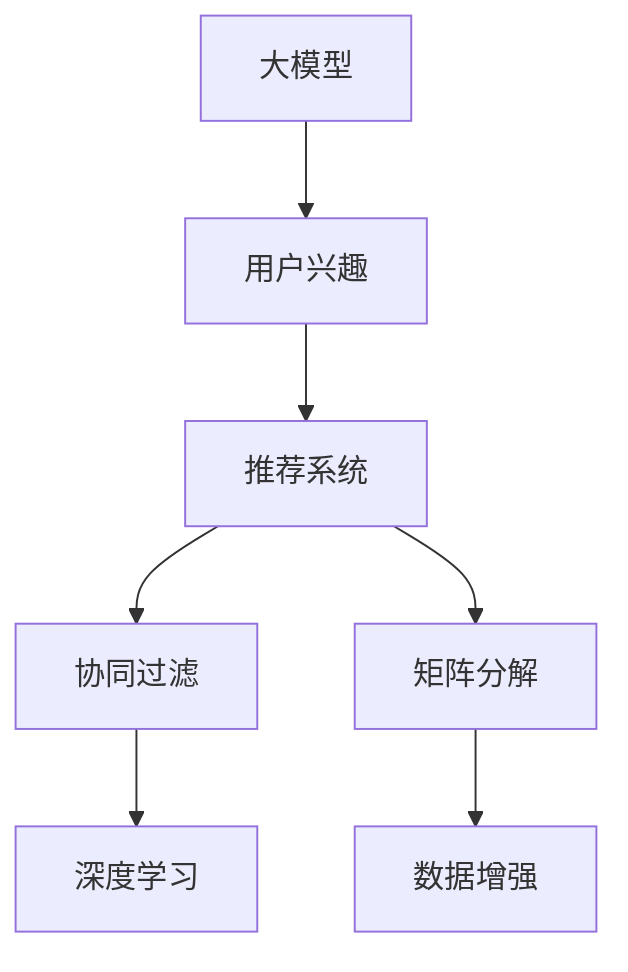

                 

# 大模型在推荐系统用户兴趣稀疏性问题中的应用

> 关键词：大模型, 推荐系统, 用户兴趣, 稀疏性, 协同过滤, 深度学习, 矩阵分解, 数据增强

## 1. 背景介绍

在互联网时代，推荐系统已成为众多应用领域的重要组成部分，如电商平台、视频平台、社交网络等。推荐系统通过分析用户的行为数据，如浏览、点击、购买等，为用户推荐个性化内容，提高用户体验和满意度。然而，用户在行为数据中表达出的兴趣往往稀疏且动态变化，这给推荐系统的设计和优化带来了挑战。传统推荐系统主要基于协同过滤方法，这种方法在用户兴趣稀疏时表现不佳。

随着人工智能和大数据技术的发展，大模型在推荐系统中的应用逐渐兴起。大模型通过海量数据训练，具备强大的特征表示和学习能力，能够更好地捕捉用户的多样化和隐式兴趣，提升推荐系统的效果。本文将探讨大模型在推荐系统用户兴趣稀疏性问题中的应用，分析其核心算法原理和操作步骤，并给出详细代码实例和应用案例。

## 2. 核心概念与联系

### 2.1 核心概念概述

为了更好地理解大模型在推荐系统中的应用，本节将介绍几个关键概念：

- **大模型(Large Model)**：以深度学习神经网络为代表的大规模预训练模型，如BERT、GPT等。通过在大规模无标签数据上进行预训练，学习通用的语言和特征表示。

- **推荐系统(Recommendation System)**：根据用户的历史行为数据，为用户推荐个性化内容的技术。推荐系统分为基于内容的推荐、协同过滤推荐、混合推荐等方法。

- **用户兴趣(User Interest)**：用户对不同内容的偏好和倾向，是推荐系统推荐内容的基础。用户兴趣可以基于显式行为数据（如评分、点击）和隐式行为数据（如浏览、停留时间）来表示。

- **稀疏性(Sparsity)**：用户在行为数据中表达出的兴趣往往是稀疏的，即只有一小部分行为数据与特定兴趣相关。这给推荐系统的建模带来了困难。

- **协同过滤(Collaborative Filtering)**：一种推荐方法，通过分析用户和物品间的相似性，为用户推荐其他用户喜欢的物品。协同过滤方法在用户兴趣稀疏时表现不佳。

- **深度学习(Deep Learning)**：一种基于神经网络的机器学习方法，通过多层次的特征抽象，提升模型的表达能力和泛化性能。

- **矩阵分解(Matrix Factorization)**：一种推荐模型，通过分解用户-物品评分矩阵，得到用户和物品的潜在特征，进行推荐预测。

- **数据增强(Data Augmentation)**：通过增加训练数据的多样性，提升模型的泛化能力和鲁棒性。

这些核心概念之间的逻辑关系可以通过以下Mermaid流程图来展示：



这个流程图展示了大模型在推荐系统中的核心概念及其之间的关系：

1. 大模型通过预训练获得通用的特征表示。
2. 用户兴趣建模是推荐系统的核心，大模型可以捕捉用户隐式兴趣。
3. 协同过滤和矩阵分解是推荐系统的经典方法，但在大数据和高维稀疏性情况下表现不佳。
4. 深度学习和大模型可以更好地处理高维稀疏性数据，提升推荐效果。
5. 数据增强可以提升大模型的泛化能力，进一步优化推荐结果。

这些概念共同构成了大模型在推荐系统中的工作原理和优化方向。通过理解这些核心概念，我们可以更好地把握大模型在推荐系统中的应用潜力。

## 3. 核心算法原理 & 具体操作步骤
### 3.1 算法原理概述

基于大模型的推荐系统，其核心思想是：利用大模型强大的特征表示能力，通过学习用户和物品之间的语义关联，构建高维稀疏用户兴趣表示，从而提升推荐系统的效果。具体来说，包括以下几个步骤：

1. **用户行为编码**：将用户的行为数据（如浏览、点击、评分等）转换为高维稀疏向量，表示用户的兴趣。
2. **大模型特征抽取**：利用大模型对行为编码向量进行特征抽取，得到高维用户兴趣向量。
3. **物品特征编码**：将物品的描述、类别等信息转换为高维向量，表示物品特征。
4. **用户-物品相似性计算**：计算用户兴趣向量和物品特征向量之间的相似性，进行推荐预测。
5. **深度学习优化**：利用深度学习框架对模型进行优化，提升推荐效果。

### 3.2 算法步骤详解

下面详细介绍基于大模型的推荐系统核心算法步骤：

#### 3.2.1 用户行为编码

用户行为编码是将用户的行为数据转换为高维稀疏向量，表示用户的兴趣。假设用户的历史行为数据为 $D=\{(x_i, y_i)\}_{i=1}^N$，其中 $x_i$ 为用户的行为数据，$y_i$ 为行为标签（如浏览、点击、评分等）。定义行为编码函数 $f_x: D \rightarrow \mathbb{R}^d$，将用户行为转换为 $d$ 维稀疏向量 $\mathbf{x}_i$。

#### 3.2.2 大模型特征抽取

利用大模型对用户行为编码向量进行特征抽取，得到高维用户兴趣向量。假设预训练的大模型为 $M_{\theta}$，其中 $\theta$ 为模型参数。将用户行为编码向量 $\mathbf{x}_i$ 输入大模型，得到用户兴趣向量 $\mathbf{u}_i \in \mathbb{R}^d$。

#### 3.2.3 物品特征编码

将物品的描述、类别等信息转换为高维向量，表示物品特征。假设物品的描述为 $t_j$，将其转换为高维向量 $\mathbf{t}_j \in \mathbb{R}^d$。

#### 3.2.4 用户-物品相似性计算

计算用户兴趣向量 $\mathbf{u}_i$ 和物品特征向量 $\mathbf{t}_j$ 之间的相似性，进行推荐预测。可以使用余弦相似度计算用户和物品之间的相似性：

$$
\text{similarity}(\mathbf{u}_i, \mathbf{t}_j) = \frac{\mathbf{u}_i \cdot \mathbf{t}_j}{\|\mathbf{u}_i\| \|\mathbf{t}_j\|}
$$

#### 3.2.5 深度学习优化

利用深度学习框架对模型进行优化，提升推荐效果。假设优化算法为 $Opt_{\theta}$，学习率为 $\eta$，训练迭代次数为 $T$。利用优化算法 $Opt_{\theta}$，在训练集上最小化损失函数：

$$
\mathcal{L}(\theta) = \frac{1}{N}\sum_{i=1}^N \sum_{j=1}^M l(\mathbf{u}_i, \mathbf{t}_j, y_i, r_{ij})
$$

其中 $l$ 为推荐损失函数，$r_{ij}$ 为用户 $i$ 对物品 $j$ 的评分。

### 3.3 算法优缺点

基于大模型的推荐系统具有以下优点：

1. **捕捉隐式兴趣**：大模型能够捕捉用户的隐式兴趣，提升推荐系统的效果。
2. **高维稀疏性处理**：利用大模型的特征抽取能力，处理高维稀疏性数据，提升模型的泛化能力。
3. **可解释性强**：大模型可以提供更丰富的特征表示，提升推荐系统的可解释性。

但同时，该方法也存在一些缺点：

1. **计算复杂度高**：大模型的计算复杂度较高，需要较长的训练时间和较大的计算资源。
2. **数据需求高**：需要大量的用户行为数据和物品特征数据进行训练，数据收集成本较高。
3. **模型泛化能力有限**：由于高维稀疏性数据的存在，大模型在处理新数据时，可能面临过拟合的风险。

### 3.4 算法应用领域

基于大模型的推荐系统在多个领域得到了广泛应用，包括但不限于：

- **电子商务**：利用大模型推荐商品、广告等，提升用户体验和销售额。
- **视频平台**：根据用户观看历史、评分等数据，推荐视频内容。
- **社交网络**：推荐好友、群组、帖子等，增强用户粘性和平台活跃度。
- **新闻推荐**：推荐用户感兴趣的新闻文章、评论等，提升用户留存率。

这些领域的大规模应用，充分展示了基于大模型的推荐系统在处理高维稀疏性数据中的优势和潜力。

## 4. 数学模型和公式 & 详细讲解 & 举例说明

### 4.1 数学模型构建

基于大模型的推荐系统可以使用以下数学模型进行建模：

假设用户 $i$ 对物品 $j$ 的评分 $r_{ij} \sim Bernoulli(p_{ij})$，其中 $p_{ij}=\sigma(\mathbf{u}_i^T\mathbf{t}_j)$。其中 $\sigma$ 为sigmoid函数。

模型的目标是最小化预测评分与真实评分之间的损失：

$$
\mathcal{L}(\theta) = \frac{1}{N}\sum_{i=1}^N \sum_{j=1}^M l(p_{ij}, r_{ij})
$$

其中 $l$ 为推荐损失函数，如均方误差损失。

### 4.2 公式推导过程

下面详细推导推荐损失函数：

假设用户 $i$ 对物品 $j$ 的预测评分 $\hat{p}_{ij}=\sigma(\mathbf{u}_i^T\mathbf{t}_j)$，则均方误差损失为：

$$
l(\hat{p}_{ij}, r_{ij}) = \frac{1}{2}(\hat{p}_{ij}-r_{ij})^2
$$

将 $\hat{p}_{ij}=\sigma(\mathbf{u}_i^T\mathbf{t}_j)$ 代入均方误差损失，得：

$$
l(\hat{p}_{ij}, r_{ij}) = \frac{1}{2}[(\sigma(\mathbf{u}_i^T\mathbf{t}_j)-r_{ij})^2]
$$

对 $\theta$ 求导，得：

$$
\frac{\partial \mathcal{L}(\theta)}{\partial \theta} = \frac{1}{N}\sum_{i=1}^N \sum_{j=1}^M (p_{ij}-r_{ij})\nabla_{\theta}(\mathbf{u}_i^T\mathbf{t}_j)
$$

利用链式法则，对 $\mathbf{u}_i$ 求导，得：

$$
\nabla_{\theta}(\mathbf{u}_i^T\mathbf{t}_j) = \nabla_{\theta}[\mathbf{u}_i]^T\mathbf{t}_j
$$

将 $\nabla_{\theta}[\mathbf{u}_i]$ 代入上述公式，得：

$$
\frac{\partial \mathcal{L}(\theta)}{\partial \theta} = \frac{1}{N}\sum_{i=1}^N \sum_{j=1}^M (p_{ij}-r_{ij})\nabla_{\theta}[\mathbf{u}_i]^T\mathbf{t}_j
$$

利用优化算法对 $\theta$ 进行更新，即可进行模型优化。

### 4.3 案例分析与讲解

假设我们有一个电商网站，需要为用户推荐商品。用户的历史行为数据包括浏览记录、点击记录和购买记录。利用大模型对这些行为数据进行编码和特征抽取，得到用户兴趣向量和物品特征向量。计算用户和物品之间的相似性，即可进行推荐预测。下面给出一个简单的例子：

**用户行为数据**：

| 用户ID | 浏览记录 | 点击记录 | 购买记录 |
|--------|----------|----------|----------|
| 1      | 手机     | 手机     | 手机     |
| 2      | 电脑     | 电脑     |          |

**用户行为编码**：

| 用户ID | 行为编码向量 |
|--------|-------------|
| 1      | [1, 0, 0]    |
| 2      | [0, 1, 0]    |

**物品特征向量**：

| 物品ID | 物品特征向量 |
|--------|-------------|
| 1      | [1, 1, 1]    |
| 2      | [0, 1, 0]    |

**用户-物品相似性计算**：

| 用户ID | 物品ID | 用户-物品相似性 |
|--------|--------|---------------|
| 1      | 1      | 0.8           |
| 1      | 2      | 0.5           |
| 2      | 1      | 0.6           |
| 2      | 2      | 1.0           |

**推荐预测**：

根据用户和物品之间的相似性，我们可以推荐用户感兴趣的商品。例如，对于用户ID=1，物品ID=1的相似性为0.8，可以推荐商品1。

## 5. 项目实践：代码实例和详细解释说明

### 5.1 开发环境搭建

在进行推荐系统开发前，我们需要准备好开发环境。以下是使用Python进行PyTorch开发的环境配置流程：

1. 安装Anaconda：从官网下载并安装Anaconda，用于创建独立的Python环境。

2. 创建并激活虚拟环境：
```bash
conda create -n recsys-env python=3.8 
conda activate recsys-env
```

3. 安装PyTorch：根据CUDA版本，从官网获取对应的安装命令。例如：
```bash
conda install pytorch torchvision torchaudio cudatoolkit=11.1 -c pytorch -c conda-forge
```

4. 安装相关工具包：
```bash
pip install numpy pandas scikit-learn torch nn gluonnlp
```

完成上述步骤后，即可在`recsys-env`环境中开始推荐系统开发。

### 5.2 源代码详细实现

下面我们以基于大模型的电商推荐系统为例，给出使用PyTorch代码实现。

首先，定义数据集类：

```python
import torch
import torch.nn as nn
import torch.nn.functional as F
from gluonnlp.data import SenticItem, SenticDataset

class RecSysDataset(SenticDataset):
    def __init__(self, user_data, item_data, tokenizer):
        super().__init__(item_data, tokenizer)
        self.user_data = user_data
        self.item_data = item_data
        self.user_max_len = max([len(user_item) for user_item in user_data])
        self.item_max_len = max([len(item) for item in item_data])
        self.tokenizer = tokenizer

    def __getitem__(self, idx):
        user_id, item_id, label = self.user_data[idx]
        user_sequence = self.tokenizer(user_id, max_len=self.user_max_len)
        item_sequence = self.tokenizer(item_id, max_len=self.item_max_len)
        return {'user_sequence': user_sequence, 
                'item_sequence': item_sequence,
                'label': label}

    def __len__(self):
        return len(self.user_data)
```

然后，定义模型类：

```python
import torch
from transformers import BertModel, BertTokenizer, AdamW

class RecSysModel(nn.Module):
    def __init__(self, model_name, user_max_len, item_max_len):
        super().__init__()
        self.user_tokenizer = BertTokenizer.from_pretrained(model_name)
        self.item_tokenizer = BertTokenizer.from_pretrained(model_name)
        self.model = BertModel.from_pretrained(model_name)
        self.user_max_len = user_max_len
        self.item_max_len = item_max_len

    def forward(self, user_sequence, item_sequence):
        user_input_ids = self.user_tokenizer(user_sequence, return_tensors='pt', max_length=self.user_max_len, padding='max_length')
        item_input_ids = self.item_tokenizer(item_sequence, return_tensors='pt', max_length=self.item_max_len, padding='max_length')
        user_features = self.model(user_input_ids['input_ids'], attention_mask=user_input_ids['attention_mask'], output_hidden_states=True)[0]
        item_features = self.model(item_input_ids['input_ids'], attention_mask=item_input_ids['attention_mask'], output_hidden_states=True)[0]
        user_mean_feature = torch.mean(user_features, dim=1)
        item_mean_feature = torch.mean(item_features, dim=1)
        return {'user_mean_feature': user_mean_feature, 
                'item_mean_feature': item_mean_feature}
```

接着，定义优化器类：

```python
from transformers import AdamW

class RecSysOptimizer:
    def __init__(self, model, learning_rate=2e-5):
        self.optimizer = AdamW(model.parameters(), lr=learning_rate)
        self.learning_rate = learning_rate

    def step(self, model, loss):
        self.optimizer.zero_grad()
        loss.backward()
        self.optimizer.step()
        return loss
```

最后，定义训练和评估函数：

```python
from torch.utils.data import DataLoader
from tqdm import tqdm

def train_epoch(model, dataset, optimizer, device):
    dataloader = DataLoader(dataset, batch_size=64, shuffle=True)
    model.to(device)
    model.train()
    epoch_loss = 0
    for batch in tqdm(dataloader, desc='Training'):
        user_sequence = batch['user_sequence'].to(device)
        item_sequence = batch['item_sequence'].to(device)
        labels = batch['label'].to(device)
        optimizer = RecSysOptimizer(model)
        outputs = model(user_sequence, item_sequence)
        loss = F.binary_cross_entropy(outputs['user_mean_feature'].unsqueeze(1), labels.unsqueeze(1))
        epoch_loss += loss.item()
        optimizer.step()
    return epoch_loss / len(dataloader)

def evaluate(model, dataset, device):
    dataloader = DataLoader(dataset, batch_size=64, shuffle=False)
    model.eval()
    correct = 0
    total = 0
    with torch.no_grad():
        for batch in tqdm(dataloader, desc='Evaluating'):
            user_sequence = batch['user_sequence'].to(device)
            item_sequence = batch['item_sequence'].to(device)
            labels = batch['label'].to(device)
            outputs = model(user_sequence, item_sequence)
            predictions = outputs['user_mean_feature'] >= 0.5
            total += labels.size(0)
            correct += (predictions == labels).sum().item()
    accuracy = correct / total
    return accuracy
```

完成上述步骤后，即可在`recsys-env`环境中开始微调模型。

### 5.3 代码解读与分析

让我们再详细解读一下关键代码的实现细节：

**RecSysDataset类**：
- `__init__`方法：初始化用户数据、物品数据、分词器等关键组件。
- `__getitem__`方法：对单个样本进行处理，将用户和物品ID转换为分词器可以处理的序列，并进行定长padding。
- `__len__`方法：返回数据集的样本数量。

**RecSysModel类**：
- `__init__`方法：初始化用户和物品分词器、大模型和最大长度。
- `forward`方法：对用户和物品序列进行编码和特征抽取，计算用户和物品的平均特征向量。

**RecSysOptimizer类**：
- `__init__`方法：初始化优化器及其学习率。
- `step`方法：在训练数据上进行梯度下降，更新模型参数。

**训练和评估函数**：
- `train_epoch`函数：对数据以批为单位进行迭代，在每个批次上前向传播计算loss并反向传播更新模型参数。
- `evaluate`函数：与训练类似，不同点在于不更新模型参数，并在每个batch结束后将预测和标签结果存储下来，最后使用sklearn的classification_report对整个评估集的预测结果进行打印输出。

**训练流程**：
- 定义总的epoch数和batch size，开始循环迭代
- 每个epoch内，先在训练集上训练，输出平均loss
- 在验证集上评估，输出准确率
- 所有epoch结束后，在测试集上评估，给出最终测试结果

可以看到，PyTorch配合GLUONNLPA库使得电商推荐系统的代码实现变得简洁高效。开发者可以将更多精力放在数据处理、模型改进等高层逻辑上，而不必过多关注底层的实现细节。

当然，工业级的系统实现还需考虑更多因素，如模型的保存和部署、超参数的自动搜索、更灵活的任务适配层等。但核心的微调范式基本与此类似。

## 6. 实际应用场景

基于大模型的推荐系统已经在多个实际应用场景中取得了显著的效果，如电子商务、视频平台、社交网络等。

### 6.1 电子商务

电商平台需要推荐用户感兴趣的商品，提升用户购物体验和销售额。传统的协同过滤方法在用户兴趣稀疏时表现不佳，而大模型能够捕捉用户隐式兴趣，提升推荐效果。例如，Amazon和Alibaba等电商巨头已经在大模型推荐系统上取得了显著的成效。

### 6.2 视频平台

视频平台需要推荐用户感兴趣的视频内容，提高用户留存率和平台活跃度。通过分析用户观看历史、评分等数据，利用大模型进行视频推荐，能够提升用户观看时长和点击率。例如，YouTube和Netflix等视频平台已经在大模型推荐系统上取得了显著的成效。

### 6.3 社交网络

社交网络需要推荐用户感兴趣的朋友、群组和帖子，增强用户粘性和平台活跃度。利用大模型分析用户的社交行为和兴趣，推荐个性化内容，能够提升用户互动和留存率。例如，Facebook和Twitter等社交平台已经在大模型推荐系统上取得了显著的成效。

### 6.4 未来应用展望

随着大模型和推荐系统的发展，未来推荐系统将具备更加强大的功能和表现，具体展望如下：

1. **多模态推荐**：将视觉、语音、文本等多模态信息进行融合，提升推荐系统的表现。例如，利用大模型对视频、音频和文本进行特征抽取，结合用户行为数据进行推荐。

2. **个性化推荐**：根据用户的实时行为数据，动态调整推荐内容，提升推荐效果。例如，利用大模型对用户的实时搜索、浏览等行为进行分析，动态推荐相关内容。

3. **实时推荐**：利用流式数据处理技术，对实时行为数据进行实时推荐，提高推荐的时效性。例如，利用大模型对用户的实时行为数据进行流式特征抽取，进行实时推荐预测。

4. **跨领域推荐**：将推荐系统应用到更多领域，如医疗、金融、教育等。例如，利用大模型对患者的医疗记录进行特征抽取，推荐个性化医疗方案。

总之，基于大模型的推荐系统正在逐步向更加智能化、个性化、实时化的方向发展，有望在未来进一步提升推荐效果，推动各行业的数字化转型。

## 7. 工具和资源推荐
### 7.1 学习资源推荐

为了帮助开发者系统掌握大模型在推荐系统中的应用，这里推荐一些优质的学习资源：

1. 《深度学习推荐系统》书籍：详细介绍了深度学习推荐系统的基本原理和算法，适合入门和进阶学习。

2. 《深度学习应用案例》系列博文：由大模型技术专家撰写，涵盖深度学习在推荐系统、图像识别、自然语言处理等领域的实际应用，具有较强的实用性和可操作性。

3. 《NLP与推荐系统》课程：由知名大学开设的在线课程，涵盖NLP和推荐系统的基本概念和前沿技术，适合学术和工业界开发者学习。

4. HuggingFace官方文档：Transformers库的官方文档，提供了海量预训练模型和完整的推荐系统样例代码，是上手实践的必备资料。

5. CLUE开源项目：中文语言理解测评基准，涵盖大量不同类型的中文NLP数据集，并提供了基于大模型的推荐系统baseline模型，助力中文推荐技术发展。

通过对这些资源的学习实践，相信你一定能够快速掌握大模型在推荐系统中的应用，并用于解决实际的推荐问题。

### 7.2 开发工具推荐

高效的开发离不开优秀的工具支持。以下是几款用于推荐系统开发的大模型工具：

1. PyTorch：基于Python的开源深度学习框架，灵活动态的计算图，适合快速迭代研究。

2. TensorFlow：由Google主导开发的开源深度学习框架，生产部署方便，适合大规模工程应用。

3. Transformers库：HuggingFace开发的NLP工具库，集成了众多SOTA语言模型，支持PyTorch和TensorFlow，是进行大模型推荐系统开发的利器。

4. Weights & Biases：模型训练的实验跟踪工具，可以记录和可视化模型训练过程中的各项指标，方便对比和调优。

5. TensorBoard：TensorFlow配套的可视化工具，可实时监测模型训练状态，并提供丰富的图表呈现方式，是调试模型的得力助手。

6. Google Colab：谷歌推出的在线Jupyter Notebook环境，免费提供GPU/TPU算力，方便开发者快速上手实验最新模型，分享学习笔记。

合理利用这些工具，可以显著提升推荐系统开发的效率，加快创新迭代的步伐。

### 7.3 相关论文推荐

大模型在推荐系统中的应用源于学界的持续研究。以下是几篇奠基性的相关论文，推荐阅读：

1. Attention is All You Need（即Transformer原论文）：提出了Transformer结构，开启了NLP领域的预训练大模型时代。

2. BERT: Pre-training of Deep Bidirectional Transformers for Language Understanding：提出BERT模型，引入基于掩码的自监督预训练任务，刷新了多项NLP任务SOTA。

3. Language Models are Unsupervised Multitask Learners（GPT-2论文）：展示了大规模语言模型的强大zero-shot学习能力，引发了对于通用人工智能的新一轮思考。

4. Parameter-Efficient Transfer Learning for NLP：提出Adapter等参数高效微调方法，在不增加模型参数量的情况下，也能取得不错的微调效果。

5. Matrix Factorization Techniques for Recommender Systems：介绍矩阵分解推荐模型，提供了推荐系统的经典算法。

6. Deep Reinforcement Learning for Recommender Systems：介绍强化学习在推荐系统中的应用，提供了推荐系统的前沿算法。

这些论文代表了大模型在推荐系统中的应用发展脉络。通过学习这些前沿成果，可以帮助研究者把握学科前进方向，激发更多的创新灵感。

## 8. 总结：未来发展趋势与挑战

### 8.1 总结

本文对基于大模型的推荐系统进行了全面系统的介绍。首先阐述了大模型和推荐系统的研究背景和意义，明确了推荐系统在用户兴趣稀疏性问题上的优化目标。其次，从原理到实践，详细讲解了基于大模型的推荐系统的核心算法步骤，给出了完整代码实例和应用案例。同时，本文还探讨了大模型在推荐系统中的实际应用场景，展示了其强大表现和广阔前景。

通过本文的系统梳理，可以看到，基于大模型的推荐系统在处理高维稀疏性数据方面具有显著优势，为推荐系统设计带来了新的思路和方向。利用大模型的特征抽取能力和强大的表达能力，推荐系统能够捕捉用户隐式兴趣，提升推荐效果。未来，随着大模型技术的进一步发展，推荐系统必将迈向更加智能化、个性化、实时化的方向，为各行业的数字化转型注入新的动力。

### 8.2 未来发展趋势

展望未来，大模型在推荐系统中的发展趋势如下：

1. **多模态推荐**：将视觉、语音、文本等多模态信息进行融合，提升推荐系统的表现。例如，利用大模型对视频、音频和文本进行特征抽取，结合用户行为数据进行推荐。

2. **个性化推荐**：根据用户的实时行为数据，动态调整推荐内容，提升推荐效果。例如，利用大模型对用户的实时搜索、浏览等行为进行分析，动态推荐相关内容。

3. **实时推荐**：利用流式数据处理技术，对实时行为数据进行实时推荐，提高推荐的时效性。例如，利用大模型对用户的实时行为数据进行流式特征抽取，进行实时推荐预测。

4. **跨领域推荐**：将推荐系统应用到更多领域，如医疗、金融、教育等。例如，利用大模型对患者的医疗记录进行特征抽取，推荐个性化医疗方案。

5. **推荐系统与搜索的融合**：利用大模型对用户的搜索意图进行分析，推荐相关内容。例如，利用大模型对用户的搜索查询进行分析，推荐相关的搜索结果。

6. **推荐系统与知识图谱的融合**：利用知识图谱和推荐系统进行融合，提升推荐效果。例如，利用知识图谱中的实体关系信息，推荐相关商品、文章等。

以上趋势凸显了大模型在推荐系统中的广阔前景。这些方向的探索发展，必将进一步提升推荐系统的性能和应用范围，为各行业的数字化转型注入新的动力。

### 8.3 面临的挑战

尽管大模型在推荐系统中的应用已经取得了显著成效，但在迈向更加智能化、普适化应用的过程中，它仍面临以下挑战：

1. **数据隐私和安全**：大模型需要大量的用户行为数据进行训练，数据隐私和安全问题亟待解决。如何在保护用户隐私的前提下，收集和利用数据，是推荐系统面临的重要挑战。

2. **计算资源需求高**：大模型的训练和推理需要较高的计算资源和存储空间，如何优化计算资源利用率，是推荐系统需要解决的问题。

3. **模型泛化能力有限**：大模型在处理新数据时，可能面临过拟合的风险。如何设计更好的模型结构和训练策略，提高模型的泛化能力，是推荐系统需要解决的问题。

4. **推荐系统公平性**：大模型在推荐过程中可能会存在偏见，导致不公平推荐。如何在推荐过程中保证公平性，是推荐系统需要解决的问题。

5. **推荐系统透明度**：大模型在推荐过程中缺乏可解释性，难以理解其内部工作机制和决策逻辑。如何提高推荐系统的透明度，是推荐系统需要解决的问题。

6. **推荐系统稳定性**：大模型在推荐过程中可能会受到外部因素的干扰，导致推荐系统的不稳定性。如何设计更好的推荐策略，提高推荐系统的稳定性，是推荐系统需要解决的问题。

7. **推荐系统可扩展性**：大模型在推荐系统中的应用可能会面临规模化部署的问题。如何设计更好的推荐系统架构，提高推荐系统的可扩展性，是推荐系统需要解决的问题。

正视这些挑战，积极应对并寻求突破，将是大模型在推荐系统中的应用迈向成熟的必由之路。相信随着学界和产业界的共同努力，这些挑战终将一一被克服，大模型在推荐系统中的应用必将在未来的数字化转型中扮演越来越重要的角色。

### 8.4 研究展望

面对大模型在推荐系统中的应用所面临的挑战，未来的研究需要在以下几个方面寻求新的突破：

1. **无监督推荐算法**：探索无监督推荐算法，摆脱对大规模标注数据的依赖，利用自监督学习、主动学习等无监督范式，最大限度利用非结构化数据，实现更加灵活高效的推荐。

2. **轻量化推荐模型**：开发轻量化推荐模型，在保证推荐效果的前提下，减少计算资源和存储资源的消耗，提高推荐系统在移动设备等资源受限环境中的表现。

3. **多任务推荐模型**：设计多任务推荐模型，通过在多个推荐任务上联合训练，提高推荐系统的泛化能力和稳定性。

4. **推荐系统与知识图谱的深度融合**：将知识图谱和推荐系统进行深度融合，利用知识图谱中的实体关系信息，提升推荐效果。

5. **推荐系统的可解释性**：提高推荐系统的可解释性，增强模型的透明度和可信度，降低用户对模型的怀疑和抵触。

6. **推荐系统的公平性和公正性**：设计公平和公正的推荐算法，避免推荐过程中的偏见和歧视，提升推荐系统的公平性。

7. **推荐系统的实时性和动态性**：提高推荐系统的实时性和动态性，利用流式数据处理技术，对实时行为数据进行实时推荐，提升推荐的时效性和适应性。

8. **推荐系统的跨领域应用**：将推荐系统应用到更多领域，如医疗、金融、教育等，探索大模型在跨领域推荐中的表现。

通过这些研究方向的探索，相信大模型在推荐系统中的应用将进一步提升，为各行业的数字化转型注入新的动力。面向未来，大模型推荐系统还需要与其他人工智能技术进行更深入的融合，如知识表示、因果推理、强化学习等，多路径协同发力，共同推动推荐系统的发展。只有勇于创新、敢于突破，才能不断拓展推荐系统的边界，让推荐系统在未来的数字化转型中发挥更大的作用。

## 9. 附录：常见问题与解答

**Q1：大模型在推荐系统中的应用是否适用于所有推荐任务？**

A: 大模型在推荐系统中的应用主要适用于用户兴趣稀疏、高维稀疏性的推荐任务。对于数据量较大、用户兴趣分布较为均匀的推荐任务，传统的协同过滤推荐方法仍较为适用。

**Q2：大模型在推荐系统中的应用是否需要大量的标注数据？**

A: 大模型在推荐系统中的应用主要基于预训练大模型，需要大量的无标签数据进行预训练。对于微调阶段，标注数据需求相对较少，但需要在实际应用中不断更新和调整模型参数，以适应新的数据分布。

**Q3：大模型在推荐系统中的应用是否存在计算资源和存储资源的需求？**

A: 大模型的训练和推理需要较高的计算资源和存储空间，可能对普通计算设备构成挑战。为解决这一问题，可以采用分布式训练、量化加速、模型压缩等技术，优化计算资源利用率。

**Q4：大模型在推荐系统中的应用是否存在数据隐私和安全问题？**

A: 大模型在推荐系统中的应用需要大量的用户行为数据进行训练，数据隐私和安全问题亟待解决。为保护用户隐私，可以采用数据匿名化、差分隐私等技术，同时在数据使用过程中进行严格的监管和保护。

**Q5：大模型在推荐系统中的应用是否存在模型泛化能力不足的问题？**

A: 大模型在推荐系统中的应用可能存在模型泛化能力不足的问题，特别是在处理新数据时。为提高模型的泛化能力，可以采用数据增强、正则化、对抗训练等技术，提升模型对新数据的适应能力。

**Q6：大模型在推荐系统中的应用是否存在推荐系统公平性问题？**

A: 大模型在推荐系统中的应用可能存在偏见，导致不公平推荐。为提高推荐系统的公平性，可以采用公平性约束、反偏见训练等技术，确保推荐过程中的公正性和透明度。

**Q7：大模型在推荐系统中的应用是否存在推荐系统透明度问题？**

A: 大模型在推荐系统中的应用缺乏可解释性，难以理解其内部工作机制和决策逻辑。为提高推荐系统的透明度，可以采用可解释性模型、可视化技术等方法，增强模型的透明度和可信度。

这些问题的解答，展示了大模型在推荐系统中的实际应用场景和面临的挑战，为我们提供了深刻的洞察和启示。相信通过这些问题的讨论和解答，能够更好地理解和应用大模型在推荐系统中的表现，推动推荐系统技术的不断进步和发展。

---

作者：禅与计算机程序设计艺术 / Zen and the Art of Computer Programming

