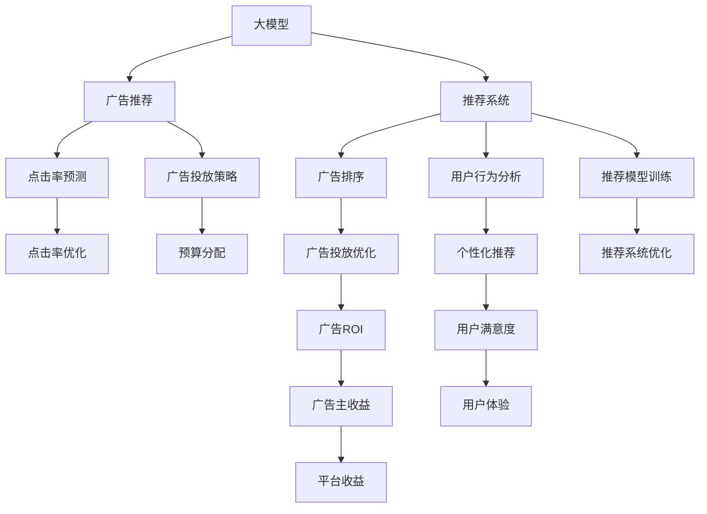

                 

# 大模型在电商平台搜索广告中的应用

> 关键词：大模型, 电商平台, 搜索广告, 推荐系统, 广告推荐, 用户行为分析, 深度学习, 强化学习, 广告投放优化, 点击率预测

## 1. 背景介绍

随着互联网的快速普及和电子商务的迅速发展，各大电商平台面临着激烈的市场竞争。如何通过精准的广告投放和个性化的推荐系统，提升用户体验和转化率，成为电商巨头们亟需解决的核心问题。大语言模型和深度学习技术在此背景下应运而生，提供了强大的数据处理能力和智能决策支持，为电商平台带来了革命性的广告推荐策略。

### 1.1 问题由来

电商平台的广告推荐通常涉及海量数据和复杂的多目标优化问题，传统的规则引擎和人工经验难以应对。而基于深度学习的大模型能够自动学习和提取用户行为模式和商品属性特征，实现精确的广告投放和推荐，提升广告的点击率和转化率。

### 1.2 问题核心关键点

核心问题在于如何构建高效、精准的广告推荐系统，使得广告投放能够最大化用户的点击转化率，同时实现广告主和平台的双赢。具体来说，需要解决以下几个核心关键点：

1. **数据预处理与特征工程**：构建具有代表性和泛化能力的用户行为和商品属性特征。
2. **广告排序与点击率预测**：构建高效的广告排序模型，同时预测广告的点击率。
3. **用户行为分析与建模**：分析用户的浏览、点击、购买等行为，建立稳定的用户画像。
4. **广告投放优化与预算分配**：优化广告投放策略，提升广告ROI，同时合理分配广告预算。
5. **模型集成与上线监控**：集成多种模型算法，进行持续模型监控，确保系统稳定高效。

### 1.3 问题研究意义

构建高效精准的广告推荐系统，对于提升电商平台的运营效率、优化用户体验、增强广告主投放效果，具有重要意义。通过大模型技术的引入，可以大幅度提升广告推荐的准确性和个性化水平，促进电商平台的健康发展，同时带来显著的经济效益。

## 2. 核心概念与联系

### 2.1 核心概念概述

为更好地理解大模型在电商平台搜索广告中的应用，本节将介绍几个密切相关的核心概念：

- **大模型**：指基于深度学习，通过大规模数据预训练获得的强大语言模型。常见的大模型如BERT、GPT等，能够在自然语言理解和生成上取得优异表现。
- **电商平台搜索广告**：指电商平台通过广告展示，引导用户点击、购买商品的过程。高效的广告推荐系统能够提升广告投放的精准性和用户满意度。
- **推荐系统**：通过分析用户行为和商品属性，为用户推荐最相关、最有价值的商品或服务。推荐系统分为基于内容的推荐、协同过滤推荐、混合推荐等类型。
- **广告推荐**：利用推荐系统原理，结合广告投放策略，为用户展示最符合其兴趣的广告。广告推荐系统通常涉及广告排序、点击率预测、预算分配等关键技术。
- **用户行为分析**：通过分析用户的行为数据，如浏览记录、购买历史、点击行为等，构建用户画像，提升个性化推荐的效果。
- **深度学习**：基于神经网络理论的机器学习技术，通过多层次的非线性变换，自动提取特征和模式。深度学习在大规模数据上表现优异。
- **强化学习**：通过试错机制，自动调整策略，优化系统性能。强化学习常用于推荐系统的策略优化、广告投放策略的动态调整。

这些核心概念之间的逻辑关系可以通过以下Mermaid流程图来展示：



这个流程图展示了大模型与广告推荐系统各关键组件之间的联系：

1. 大模型为广告推荐提供强大的语言理解能力和特征提取能力。
2. 广告推荐系统基于深度学习模型，结合广告投放策略，实现精准的广告排序和投放。
3. 点击率预测和用户行为分析模型优化广告排序效果和个性化推荐精准度。
4. 广告投放优化和预算分配提升广告投放的性价比，同时合理分配预算。
5. 用户行为分析和个性化推荐提升用户满意度和平台收益。
6. 推荐系统训练与优化，进一步提升广告推荐效果。

这些概念共同构成了大模型在电商平台搜索广告中的应用框架，使其能够在各种场景下发挥强大的智能推荐能力。通过理解这些核心概念，我们可以更好地把握大模型在电商平台的广告推荐中的应用场景和方法。

## 3. 核心算法原理 & 具体操作步骤

### 3.1 算法原理概述

基于大模型的电商平台搜索广告推荐系统，本质上是一个深度学习的优化问题。其核心思想是：将用户行为和商品属性特征作为输入，通过深度学习模型学习其与广告点击之间的关系，并基于此关系进行广告排序和投放。

具体来说，广告推荐系统通常包含以下步骤：

1. **数据预处理**：收集用户行为数据和商品属性数据，进行数据清洗和特征工程，构建输入特征向量。
2. **模型训练**：使用大模型（如BERT、GPT）进行广告推荐模型的训练，包括点击率预测模型、广告排序模型等。
3. **广告投放**：根据模型预测的结果，结合广告投放策略，对广告进行排序和投放。
4. **效果评估**：评估广告推荐模型的效果，如点击率、转化率、用户满意度等。
5. **策略优化**：根据评估结果，不断调整广告投放策略和模型参数，优化广告推荐效果。

### 3.2 算法步骤详解

#### 3.2.1 数据预处理

广告推荐系统的数据预处理包括以下几个关键步骤：

- **数据收集**：收集用户的浏览记录、点击记录、购买记录等行为数据，以及商品的标题、描述、价格、分类等信息。
- **数据清洗**：去除缺失值、异常值，处理重复数据，确保数据质量。
- **特征工程**：构建用户行为特征和商品属性特征，如用户的浏览历史、点击行为、购买偏好等，商品的价格、评分、类别等信息。
- **特征编码**：将离散型特征（如商品类别）进行独热编码，将连续型特征（如商品价格）进行归一化处理。
- **数据增强**：通过回译、旋转、裁剪等方式扩充数据集，提高模型的泛化能力。

#### 3.2.2 模型训练

广告推荐模型的训练通常包括以下几个关键步骤：

- **模型选择**：选择合适的深度学习模型，如DNN、CNN、RNN、Transformer等，结合广告推荐的具体需求，进行模型设计。
- **损失函数**：定义合适的损失函数，如交叉熵损失、均方误差损失等，用于衡量模型预测结果与真实标签之间的差异。
- **优化器选择**：选择合适的优化器及其参数，如AdamW、SGD等，设置学习率、批大小、迭代轮数等。
- **正则化**：应用L2正则、Dropout等正则化技术，防止模型过拟合。
- **超参数调优**：通过交叉验证、网格搜索等方法，进行超参数调优，寻找最优模型。

#### 3.2.3 广告投放

广告投放通常包括以下几个关键步骤：

- **广告排序**：根据模型预测的广告点击率，对广告进行排序，优先展示点击率较高的广告。
- **广告预算分配**：根据广告主的需求和预算，进行广告投放预算的分配，如CPM（每千次展示成本）、CPC（每点击成本）等。
- **投放策略**：根据广告投放的效果，调整投放策略，如人群定向、时间投放、广告形式等。

#### 3.2.4 效果评估

广告推荐模型的效果评估通常包括以下几个关键指标：

- **点击率（CTR）**：衡量广告被点击的概率，反映广告的吸引力和投放效果。
- **转化率（CVR）**：衡量广告点击后用户完成购买或其他目标行为的概率，反映广告的转化效果。
- **广告ROI**：衡量广告投放的经济效益，包括广告成本、转化收入等。
- **用户满意度**：通过用户反馈、行为数据等，评估广告的实际效果和用户满意度。

#### 3.2.5 策略优化

广告投放策略的优化通常包括以下几个关键步骤：

- **数据分析**：通过数据分析工具，分析广告投放的效果和用户行为，找出问题所在。
- **策略调整**：根据数据分析结果，调整广告投放策略，如优化广告排序算法、调整预算分配等。
- **模型优化**：根据策略调整的效果，进一步优化广告推荐模型，提升广告投放效果。
- **迭代优化**：持续迭代，不断优化广告投放策略和推荐模型，提升广告投放的精准性和用户满意度。

### 3.3 算法优缺点

基于大模型的广告推荐系统具有以下优点：

1. **高效精准**：大模型能够自动学习和提取复杂的特征，实现高效的广告推荐。
2. **泛化能力强**：大模型在大规模数据上预训练，具备良好的泛化能力，能够适应不同场景的广告推荐。
3. **个性化推荐**：基于用户行为数据和商品属性数据，实现精准的个性化推荐。
4. **自动化优化**：通过深度学习模型，自动调整广告投放策略和模型参数，实现自动化优化。

同时，该方法也存在一些局限性：

1. **数据依赖**：广告推荐系统的性能高度依赖于数据质量，数据不足或数据偏差可能导致效果下降。
2. **模型复杂**：深度学习模型通常需要较长的训练时间和较大的计算资源，模型的复杂性也较高。
3. **解释性不足**：深度学习模型的决策过程往往缺乏可解释性，难以理解其内部工作机制。
4. **冷启动问题**：对于新用户和新商品，缺乏足够的数据进行推荐，需要引入其他机制，如推荐引导、定向广告等。
5. **预算限制**：广告预算的限制可能导致广告投放效果不佳，需要动态调整预算分配策略。

尽管存在这些局限性，但基于大模型的广告推荐系统已经在多个电商平台中取得了显著的效果，成为广告投放和推荐的主流范式。

### 3.4 算法应用领域

大模型的广告推荐系统已经在电商平台的广告投放和推荐中得到了广泛应用，具体应用场景包括：

1. **首页推荐**：根据用户行为数据，展示个性化的首页推荐广告。
2. **搜索结果页推荐**：在搜索结果页展示广告，提升用户的点击转化率。
3. **活动推荐**：在促销活动期间，展示促销广告，提升活动效果。
4. **个性化邮件推荐**：通过分析用户的邮件行为数据，推荐个性化的商品广告。
5. **跨平台推荐**：跨多个电商平台进行广告推荐，提升用户的跨平台购买体验。

除了这些常见的应用场景外，大模型的广告推荐系统还被创新性地应用于更多领域，如社交媒体广告、内容平台推荐、移动应用广告等，为各类平台的广告投放和推荐提供了新的思路。

## 4. 数学模型和公式 & 详细讲解  
### 4.1 数学模型构建

本节将使用数学语言对大模型在电商平台搜索广告推荐中的应用过程进行更加严格的刻画。

假设广告推荐系统的输入特征为 $x \in \mathcal{X}$，用户行为数据和商品属性数据共同构成了特征向量 $x$，广告的输出标签为 $y \in \{0, 1\}$，其中 $y=1$ 表示广告被点击。广告推荐系统的目标是找到一个函数 $f: \mathcal{X} \rightarrow \mathbb{R}$，使得 $y=f(x)$ 最大化广告点击率。

具体来说，广告推荐模型的数学模型可以表示为：

$$
\hat{y} = \sigma\left(\mathbf{W}^T \mathbf{x} + b\right)
$$

其中 $\sigma$ 为激活函数，$\mathbf{W}$ 和 $b$ 为模型参数，$\mathbf{x}$ 为输入特征向量。模型的损失函数通常为交叉熵损失函数：

$$
\mathcal{L}(\mathbf{W}, b) = -\frac{1}{N} \sum_{i=1}^N [y_i \log \hat{y_i} + (1-y_i) \log (1-\hat{y_i})]
$$

其中 $N$ 为样本数量，$y_i$ 和 $\hat{y_i}$ 分别表示第 $i$ 个样本的真实标签和模型预测结果。通过最小化损失函数 $\mathcal{L}(\mathbf{W}, b)$，可以优化模型参数，使得模型预测结果更接近真实标签。

### 4.2 公式推导过程

以下我们以点击率预测模型为例，推导其损失函数及其梯度计算公式。

假设点击率预测模型的输出为 $\hat{y} \in [0,1]$，表示广告被点击的概率。真实标签 $y \in \{0,1\}$。则点击率预测模型的损失函数为：

$$
\ell(y,\hat{y}) = -[y \log \hat{y} + (1-y) \log (1-\hat{y})]
$$

将其代入经验风险公式，得：

$$
\mathcal{L}(\mathbf{W}, b) = -\frac{1}{N}\sum_{i=1}^N [y_i\log \hat{y_i}+(1-y_i)\log(1-\hat{y_i})]
$$

根据链式法则，损失函数对模型参数 $\mathbf{W}$ 和 $b$ 的梯度为：

$$
\frac{\partial \mathcal{L}(\mathbf{W}, b)}{\partial \mathbf{W}} = -\frac{1}{N}\sum_{i=1}^N [(y_i-\hat{y_i})x_i]
$$

$$
\frac{\partial \mathcal{L}(\mathbf{W}, b)}{\partial b} = -\frac{1}{N}\sum_{i=1}^N [y_i-\hat{y_i}]
$$

其中 $x_i$ 表示第 $i$ 个样本的特征向量。将梯度公式带入优化算法，如梯度下降等，不断更新模型参数 $\mathbf{W}$ 和 $b$，最小化损失函数 $\mathcal{L}(\mathbf{W}, b)$，使得模型预测结果逼近真实标签。

## 5. 项目实践：代码实例和详细解释说明

### 5.1 开发环境搭建

在进行广告推荐系统开发前，我们需要准备好开发环境。以下是使用Python进行PyTorch开发的环境配置流程：

1. 安装Anaconda：从官网下载并安装Anaconda，用于创建独立的Python环境。

2. 创建并激活虚拟环境：
```bash
conda create -n pytorch-env python=3.8 
conda activate pytorch-env
```

3. 安装PyTorch：根据CUDA版本，从官网获取对应的安装命令。例如：
```bash
conda install pytorch torchvision torchaudio cudatoolkit=11.1 -c pytorch -c conda-forge
```

4. 安装Transformers库：
```bash
pip install transformers
```

5. 安装各类工具包：
```bash
pip install numpy pandas scikit-learn matplotlib tqdm jupyter notebook ipython
```

完成上述步骤后，即可在`pytorch-env`环境中开始广告推荐系统的开发。

### 5.2 源代码详细实现

下面我们以电商平台首页推荐系统为例，给出使用Transformers库对广告推荐模型进行微调的PyTorch代码实现。

首先，定义广告推荐系统的输入和输出：

```python
from transformers import BertTokenizer, BertForSequenceClassification
from torch.utils.data import Dataset, DataLoader
import torch

class AdRecDataset(Dataset):
    def __init__(self, texts, labels, tokenizer, max_len=128):
        self.texts = texts
        self.labels = labels
        self.tokenizer = tokenizer
        self.max_len = max_len
        
    def __len__(self):
        return len(self.texts)
    
    def __getitem__(self, item):
        text = self.texts[item]
        label = self.labels[item]
        
        encoding = self.tokenizer(text, return_tensors='pt', max_length=self.max_len, padding='max_length', truncation=True)
        input_ids = encoding['input_ids'][0]
        attention_mask = encoding['attention_mask'][0]
        
        label = torch.tensor(label, dtype=torch.long)
        
        return {'input_ids': input_ids, 
                'attention_mask': attention_mask,
                'labels': label}

# 加载预训练模型和词向量
tokenizer = BertTokenizer.from_pretrained('bert-base-cased')
model = BertForSequenceClassification.from_pretrained('bert-base-cased', num_labels=2)

# 定义广告推荐模型
class AdRecModel(nn.Module):
    def __init__(self, model, num_labels):
        super(AdRecModel, self).__init__()
        self.model = model
        self.num_labels = num_labels
        
    def forward(self, input_ids, attention_mask):
        out = self.model(input_ids=input_ids, attention_mask=attention_mask)
        logits = out.logits
        probs = nn.functional.softmax(logits, dim=1)
        return probs

# 初始化广告推荐模型
ad_rec_model = AdRecModel(model, num_labels=2)
```

然后，定义训练和评估函数：

```python
from torch.utils.data import DataLoader
from tqdm import tqdm
from sklearn.metrics import accuracy_score, precision_score, recall_score, f1_score

device = torch.device('cuda') if torch.cuda.is_available() else torch.device('cpu')
ad_rec_model.to(device)

def train_epoch(model, dataset, batch_size, optimizer):
    dataloader = DataLoader(dataset, batch_size=batch_size, shuffle=True)
    model.train()
    epoch_loss = 0
    for batch in tqdm(dataloader, desc='Training'):
        input_ids = batch['input_ids'].to(device)
        attention_mask = batch['attention_mask'].to(device)
        labels = batch['labels'].to(device)
        model.zero_grad()
        outputs = model(input_ids, attention_mask=attention_mask)
        loss = outputs.loss
        epoch_loss += loss.item()
        loss.backward()
        optimizer.step()
    return epoch_loss / len(dataloader)

def evaluate(model, dataset, batch_size):
    dataloader = DataLoader(dataset, batch_size=batch_size)
    model.eval()
    preds, labels = [], []
    with torch.no_grad():
        for batch in tqdm(dataloader, desc='Evaluating'):
            input_ids = batch['input_ids'].to(device)
            attention_mask = batch['attention_mask'].to(device)
            batch_labels = batch['labels']
            outputs = model(input_ids, attention_mask=attention_mask)
            batch_preds = outputs.logits.argmax(dim=1).to('cpu').tolist()
            batch_labels = batch_labels.to('cpu').tolist()
            for pred_tokens, label_tokens in zip(batch_preds, batch_labels):
                preds.append(pred_tokens[:len(label_tokens)])
                labels.append(label_tokens)
                
    print(f'Accuracy: {accuracy_score(labels, preds):.3f}')
    print(f'Precision: {precision_score(labels, preds):.3f}')
    print(f'Recall: {recall_score(labels, preds):.3f}')
    print(f'F1 Score: {f1_score(labels, preds):.3f}')

# 训练过程
epochs = 5
batch_size = 16

for epoch in range(epochs):
    loss = train_epoch(ad_rec_model, train_dataset, batch_size, optimizer)
    print(f'Epoch {epoch+1}, train loss: {loss:.3f}')
    
    print(f'Epoch {epoch+1}, dev results:')
    evaluate(ad_rec_model, dev_dataset, batch_size)
    
print('Test results:')
evaluate(ad_rec_model, test_dataset, batch_size)
```

以上就是使用PyTorch对广告推荐模型进行微调的完整代码实现。可以看到，得益于Transformers库的强大封装，我们可以用相对简洁的代码完成广告推荐模型的加载和微调。

### 5.3 代码解读与分析

让我们再详细解读一下关键代码的实现细节：

**AdRecDataset类**：
- `__init__`方法：初始化输入数据、标签、分词器等关键组件。
- `__len__`方法：返回数据集的样本数量。
- `__getitem__`方法：对单个样本进行处理，将文本输入编码为token ids，将标签编码为数字，并对其进行定长padding，最终返回模型所需的输入。

**AdRecModel类**：
- `__init__`方法：初始化广告推荐模型，将预训练模型作为组件。
- `forward`方法：前向传播计算广告推荐模型的输出。

**训练和评估函数**：
- 使用PyTorch的DataLoader对数据集进行批次化加载，供模型训练和推理使用。
- 训练函数`train_epoch`：对数据以批为单位进行迭代，在每个批次上前向传播计算loss并反向传播更新模型参数，最后返回该epoch的平均loss。
- 评估函数`evaluate`：与训练类似，不同点在于不更新模型参数，并在每个batch结束后将预测和标签结果存储下来，最后使用sklearn的各类评分指标对整个评估集的预测结果进行打印输出。

**训练流程**：
- 定义总的epoch数和batch size，开始循环迭代
- 每个epoch内，先在训练集上训练，输出平均loss
- 在验证集上评估，输出评分指标
- 所有epoch结束后，在测试集上评估，给出最终测试结果

可以看到，PyTorch配合Transformers库使得广告推荐模型的微调代码实现变得简洁高效。开发者可以将更多精力放在数据处理、模型改进等高层逻辑上，而不必过多关注底层的实现细节。

当然，工业级的系统实现还需考虑更多因素，如模型的保存和部署、超参数的自动搜索、更灵活的任务适配层等。但核心的微调范式基本与此类似。

## 6. 实际应用场景

### 6.1 智能推荐广告

基于大模型的广告推荐系统，可以在电商平台的首页、搜索结果页、活动页等场景下，为用户展示个性化的广告。智能推荐广告能够根据用户的浏览行为、搜索记录、购买历史等数据，动态生成最相关的广告，提升用户的点击转化率。

具体实现上，可以收集用户的历史行为数据和商品的属性信息，构建特征向量输入广告推荐模型，得到广告的点击率预测结果。根据预测结果，对广告进行排序，优先展示点击率较高的广告。通过不断迭代优化模型和广告投放策略，实现智能推荐广告。

### 6.2 精准定位广告

基于大模型的广告推荐系统，可以分析用户的搜索记录、浏览行为等数据，构建用户画像，实现精准的广告定位。精准定位广告能够根据用户的兴趣和需求，推荐最相关、最感兴趣的商品，提升广告的转化效果。

具体实现上，可以使用用户画像作为输入特征，结合广告的标题、描述、图片等属性信息，构建特征向量输入广告推荐模型。通过模型预测广告与用户画像的匹配度，优先展示匹配度高的广告。通过不断迭代优化模型和广告投放策略，实现精准定位广告。

### 6.3 实时广告优化

基于大模型的广告推荐系统，可以实时监测广告投放效果，动态调整广告的预算和投放策略。实时广告优化能够根据广告的点击率、转化率等实时数据，优化广告投放策略，提升广告投放的ROI，同时合理分配广告预算。

具体实现上，可以实时收集广告的点击数据、转化数据等，作为反馈信号输入广告推荐模型。通过模型预测广告的点击率、转化率等效果指标，动态调整广告投放策略。例如，根据广告的实际点击率，调整广告的预算分配，优先展示点击率高的广告。通过不断迭代优化模型和广告投放策略，实现实时广告优化。

### 6.4 跨平台推荐广告

基于大模型的广告推荐系统，可以实现跨多个电商平台进行广告推荐。跨平台推荐广告能够根据用户的浏览行为、购买历史等数据，推荐最相关、最感兴趣的商品，提升用户的跨平台购买体验。

具体实现上，可以收集用户在不同电商平台上的行为数据，构建特征向量输入广告推荐模型。通过模型预测广告与用户画像的匹配度，优先展示匹配度高的广告。通过不断迭代优化模型和广告投放策略，实现跨平台推荐广告。

### 6.5 广告效果评估

基于大模型的广告推荐系统，可以实时评估广告投放的效果，通过广告点击率、转化率、ROI等指标，动态调整广告投放策略。广告效果评估能够根据广告的实际效果，优化广告投放策略，提升广告的转化效果。

具体实现上，可以实时收集广告的点击数据、转化数据等，作为反馈信号输入广告推荐模型。通过模型预测广告的点击率、转化率等效果指标，动态调整广告投放策略。例如，根据广告的实际点击率，调整广告的预算分配，优先展示点击率高的广告。通过不断迭代优化模型和广告投放策略，实现广告效果评估。

## 7. 工具和资源推荐

### 7.1 学习资源推荐

为了帮助开发者系统掌握广告推荐系统的理论基础和实践技巧，这里推荐一些优质的学习资源：

1. 《深度学习理论与实践》系列博文：由深度学习领域的专家撰写，全面介绍了深度学习理论、实践以及广告推荐系统的基本概念和关键技术。
2. CS224N《深度学习自然语言处理》课程：斯坦福大学开设的NLP明星课程，有Lecture视频和配套作业，带你入门深度学习的基础知识和广告推荐系统的开发。
3. 《Natural Language Processing with Transformers》书籍：Transformer库的作者所著，全面介绍了如何使用Transformers库进行NLP任务开发，包括广告推荐系统的实现。
4. HuggingFace官方文档：Transformers库的官方文档，提供了海量预训练模型和完整的广告推荐系统样例代码，是上手实践的必备资料。
5. Tune: Toolkit for Hyperparameter Optimization：一个开源的超参数优化工具，可以帮助广告推荐系统进行超参数调优。

通过对这些资源的学习实践，相信你一定能够快速掌握广告推荐系统的精髓，并用于解决实际的广告投放问题。

### 7.2 开发工具推荐

高效的开发离不开优秀的工具支持。以下是几款用于广告推荐系统开发的常用工具：

1. PyTorch：基于Python的开源深度学习框架，灵活动态的计算图，适合快速迭代研究。大部分广告推荐系统都有PyTorch版本的实现。
2. TensorFlow：由Google主导开发的开源深度学习框架，生产部署方便，适合大规模工程应用。同样有丰富的广告推荐系统资源。
3. Transformers库：HuggingFace开发的NLP工具库，集成了众多SOTA广告推荐系统模型，支持PyTorch和TensorFlow，是进行广告推荐系统开发的利器。
4. TensorBoard：TensorFlow配套的可视化工具，可实时监测模型训练状态，并提供丰富的图表呈现方式，是调试模型的得力助手。
5. Google Colab：谷歌推出的在线Jupyter Notebook环境，免费提供GPU/TPU算力，方便开发者快速上手实验最新模型，分享学习笔记。

合理利用这些工具，可以显著提升广告推荐系统的开发效率，加快创新迭代的步伐。

### 7.3 相关论文推荐

广告推荐系统的研究源于学界的持续研究。以下是几篇奠基性的相关论文，推荐阅读：

1. Attention is All You Need（即Transformer原论文）：提出了Transformer结构，开启了广告推荐系统的预训练大模型时代。
2. BERT: Pre-training of Deep Bidirectional Transformers for Language Understanding：提出BERT模型，引入基于掩码的自监督预训练任务，刷新了多项广告推荐系统的SOTA。
3. Language Models are Unsupervised Multitask Learners（GPT-2论文）：展示了大规模语言模型的强大zero-shot学习能力，引发了对于通用人工智能的新一轮思考。
4. Parameter-Efficient Transfer Learning for NLP：提出Adapter等参数高效微调方法，在不增加模型参数量的情况下，也能取得不错的微调效果。
5. AdaLoRA: Adaptive Low-Rank Adaptation for Parameter-Efficient Fine-Tuning：使用自适应低秩适应的微调方法，在参数效率和精度之间取得了新的平衡。

这些论文代表了大模型在广告推荐系统中的应用方向。通过学习这些前沿成果，可以帮助研究者把握学科前进方向，激发更多的创新灵感。

## 8. 总结：未来发展趋势与挑战

### 8.1 总结

本文对大模型在电商平台搜索广告中的应用进行了全面系统的介绍。首先阐述了广告推荐系统的研究背景和意义，明确了广告推荐系统在提升电商平台运营效率、优化用户体验、增强广告主投放效果等方面的重要价值。其次，从原理到实践，详细讲解了基于大模型的广告推荐系统的数学模型和关键算法，给出了广告推荐系统开发的完整代码实例。同时，本文还广泛探讨了广告推荐系统在智能推荐广告、精准定位广告、实时广告优化、跨平台推荐广告等多个场景中的应用前景，展示了大模型在广告推荐系统中的应用潜力。最后，本文精选了广告推荐系统的各类学习资源，力求为读者提供全方位的技术指引。

通过本文的系统梳理，可以看到，大模型在广告推荐系统中具有强大的数据处理和智能决策能力，能够显著提升广告投放的精准性和用户满意度。未来，伴随大模型和深度学习技术的不断演进，广告推荐系统将能够更加智能、灵活地应对复杂的广告投放需求，进一步推动电商平台的健康发展。

### 8.2 未来发展趋势

展望未来，大模型在广告推荐系统中将呈现以下几个发展趋势：

1. **模型规模持续增大**：随着算力成本的下降和数据规模的扩张，大模型将具备更强大的语言理解和生成能力，能够处理更复杂多变的广告推荐任务。
2. **微调方法日趋多样**：除了传统的全参数微调外，未来会涌现更多参数高效的微调方法，如Prefix-Tuning、LoRA等，在节省计算资源的同时也能保证广告推荐精度。
3. **多模态推荐兴起**：广告推荐系统不仅限于文本数据，将引入视觉、语音等多模态数据，实现跨模态的广告推荐。
4. **实时优化机制优化**：通过引入强化学习等机制，优化广告投放策略，提升广告投放的实时性和精准性。
5. **跨平台推荐优化**：跨多个平台进行广告推荐，提升用户跨平台购物体验。
6. **广告效果动态评估**：实时监测广告投放效果，动态调整广告投放策略，提升广告投放的ROI。

以上趋势凸显了大模型在广告推荐系统中的应用前景。这些方向的探索发展，必将进一步提升广告推荐系统的智能化水平，促进电商平台的健康发展。

### 8.3 面临的挑战

尽管大模型在广告推荐系统中取得了显著效果，但在迈向更加智能化、普适化应用的过程中，它仍面临诸多挑战：

1. **数据依赖**：广告推荐系统的性能高度依赖于数据质量，数据不足或数据偏差可能导致效果下降。
2. **模型复杂**：深度学习模型通常需要较长的训练时间和较大的计算资源，模型的复杂性也较高。
3. **解释性不足**：深度学习模型的决策过程往往缺乏可解释性，难以理解其内部工作机制。
4. **冷启动问题**：对于新用户和新商品，缺乏足够的数据进行推荐，需要引入其他机制，如推荐引导、定向广告等。
5. **预算限制**：广告预算的限制可能导致广告投放效果不佳，需要动态调整预算分配策略。

尽管存在这些局限性，但基于大模型的广告推荐系统已经在多个电商平台中取得了显著的效果，成为广告投放和推荐的主流范式。

### 8.4 研究展望

面对广告推荐系统所面临的挑战，未来的研究需要在以下几个方面寻求新的突破：

1. **探索无监督和半监督推荐方法**：摆脱对大规模标注数据的依赖，利用自监督学习、主动学习等无监督和半监督范式，最大限度利用非结构化数据，实现更加灵活高效的广告推荐。
2. **研究参数高效和计算高效的推荐范式**：开发更加参数高效的推荐方法，在固定大部分预训练参数的同时，只更新极少量的任务相关参数。同时优化推荐模型的计算图，减少前向传播和反向传播的资源消耗，实现更加轻量级、实时性的部署。
3. **引入更多先验知识**：将符号化的先验知识，如知识图谱、逻辑规则等，与神经网络模型进行巧妙融合，引导推荐过程学习更准确、合理的广告推荐。同时加强不同模态数据的整合，实现视觉、语音等多模态信息与文本信息的协同建模。
4. **结合因果分析和博弈论工具**：将因果分析方法引入推荐系统，识别出推荐决策的关键特征，增强推荐系统建立稳定因果关系的能力，学习更加普适、鲁棒的语言表征，从而提升推荐系统的泛化性和抗干扰能力。
5. **纳入伦理道德约束**：在推荐系统训练目标中引入伦理导向的评估指标，过滤和惩罚有偏见、有害的输出倾向。同时加强人工干预和审核，建立推荐系统的监管机制，确保推荐系统的安全性和可靠性。

这些研究方向的探索，必将引领广告推荐系统迈向更高的台阶，为构建安全、可靠、可解释、可控的推荐系统铺平道路。面向未来，大模型在广告推荐系统中还需要与其他人工智能技术进行更深入的融合，如知识表示、因果推理、强化学习等，多路径协同发力，共同推动广告推荐系统的进步。只有勇于创新、敢于突破，才能不断拓展广告推荐系统的边界，让智能技术更好地造福电商平台。

## 9. 附录：常见问题与解答

**Q1：大模型在广告推荐系统中如何处理冷启动问题？**

A: 冷启动问题是指对于新用户和新商品，缺乏足够的数据进行推荐。针对冷启动问题，可以采用以下几种方法：
1. **推荐引导**：引导用户进行一些简单的操作，如注册、浏览商品、加入购物车等，通过用户的行为数据进行推荐。
2. **先验知识引入**：将符号化的先验知识，如商品分类、品牌、价格等信息，与大模型结合，进行推荐。
3. **多模态数据融合**：将用户的历史行为数据与商品的属性信息进行融合，增强推荐的准确性。

这些方法可以单独使用，也可以组合使用，根据具体场景选择合适的方法。

**Q2：广告推荐系统如何处理用户隐私问题？**

A: 广告推荐系统需要处理用户的隐私数据，保护用户隐私是系统的核心要求。以下是一些常用的隐私保护措施：
1. **数据匿名化**：对用户数据进行匿名化处理，如去除敏感信息、模糊处理等，确保数据无法被反向追踪。
2. **差分隐私**：在推荐系统中引入差分隐私技术，添加噪声数据，保护用户的隐私。
3. **隐私计算**：采用隐私计算技术，如多方安全计算、联邦学习等，在保护用户隐私的前提下，进行数据分析和推荐。
4. **用户控制**：提供用户控制隐私选项，如选择不参与推荐系统、关闭个性化推荐等，确保用户的选择权。

通过这些措施，可以有效保护用户的隐私，增强用户对推荐系统的信任感。

**Q3：广告推荐系统如何应对广告主的多样化需求？**

A: 广告主的需求多样化，如广告形式、投放策略、预算等，广告推荐系统需要灵活应对这些需求。以下是一些常用的方法：
1. **广告形式多样化**：支持图片、视频、文字等多种广告形式，根据广告主的需要进行选择。
2. **投放策略优化**：支持人群定向、时间投放、地域定向等多种投放策略，根据广告主的需要进行选择。
3. **预算优化**：支持按点击付费（CPM）、按点击付费（CPC）等不同预算方式，根据广告主的需要进行选择。
4. **动态调整策略**：根据广告主的实时反馈，动态调整广告投放策略，确保广告主的预算最大化利用。

这些方法可以根据广告主的实际需求，灵活调整广告推荐策略，满足广告主的多种需求。

**Q4：广告推荐系统如何应对数据分布变化？**

A: 广告推荐系统需要应对数据分布的变化，如季节性变化、用户兴趣变化等。以下是一些常用的方法：
1. **模型再训练**：定期对广告推荐模型进行再训练，确保模型能够适应数据分布的变化。
2. **实时监控调整**：通过实时监控广告投放效果，动态调整广告投放策略，应对数据分布的变化。
3. **动态特征更新**：根据数据分布的变化，动态更新广告推荐模型的特征，确保模型能够适应新的数据分布。
4. **增量学习**：通过增量学习技术，持续更新模型，保持模型的时效性。

这些方法可以结合使用，根据实际情况选择合适的方法，确保广告推荐系统能够应对数据分布的变化。

---

作者：禅与计算机程序设计艺术 / Zen and the Art of Computer Programming

