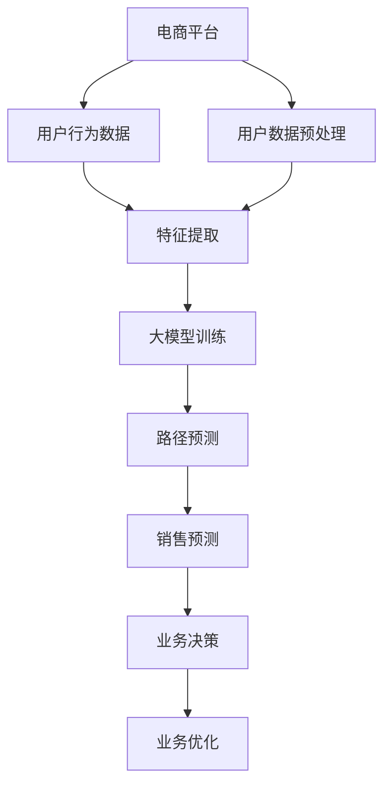

                 

# 大模型在电商平台用户购买路径分析中的应用

> 关键词：电商平台,用户行为分析,大模型,机器学习,深度学习,特征工程,路径预测,销售预测

## 1. 背景介绍

### 1.1 问题由来

在当下竞争激烈的电商市场中，电商平台需要精准把握用户行为，优化用户体验，提升转化率和销售量。传统的用户行为分析依赖于人工统计和手动建模，耗时耗力且容易产生偏差。而基于大模型的用户行为分析，能够通过自动化的方式，对大规模用户数据进行深入挖掘，发现用户购买路径的潜在规律，提升电商运营决策的科学性和精准性。

### 1.2 问题核心关键点

用户购买路径分析的核心在于：通过学习用户在不同电商平台的交互数据，预测用户未来的购买行为和路径选择。通过大模型的预测能力，可以准确识别用户当前所处购买阶段的特征，并根据这些特征预测用户接下来可能采取的行动。

### 1.3 问题研究意义

1. **提升转化率**：通过深入分析用户购买路径，能够及时干预用户决策，提升销售转化率。
2. **优化用户体验**：精准把握用户需求，提供个性化推荐和服务，提升用户满意度和忠诚度。
3. **降低运营成本**：自动化分析工具减少人工干预，降低成本，提升运营效率。
4. **驱动决策优化**：数据驱动的洞察力帮助决策者更准确地理解市场动态和用户需求，做出更优的运营策略。

## 2. 核心概念与联系

### 2.1 核心概念概述

- **电商平台**：提供线上购物服务、商品展示、交易结算等功能的综合性平台。
- **用户行为分析**：通过对用户行为数据的收集和分析，洞察用户需求和行为模式，提升运营效果。
- **大模型**：指具有大规模参数量、复杂结构、广泛应用场景的深度学习模型，如BERT、GPT、Transformer等。
- **特征工程**：对原始数据进行提取、选择、转换等操作，生成有利于模型训练和预测的特征。
- **路径预测**：基于用户历史行为数据，预测用户未来的行为轨迹，如下一步可能浏览的商品、可能购买的商品等。
- **销售预测**：预测未来一段时间内的销售情况，包括商品的销量、收益等。

这些概念之间的逻辑关系可以通过以下Mermaid流程图来展示：



这个流程图展示了大模型在电商平台用户购买路径分析中的核心概念及其之间的关系：

1. 电商平台收集用户行为数据，包括浏览、点击、购买等行为。
2. 数据预处理后进行特征提取，生成适合大模型训练的特征。
3. 大模型在大量标注数据上训练，获得预测路径的能力。
4. 利用路径预测结果进行销售预测，形成业务决策。
5. 业务决策指导业务优化，提升用户体验和运营效率。

## 3. 核心算法原理 & 具体操作步骤
### 3.1 算法原理概述

大模型在电商平台用户购买路径分析中主要基于监督学习的路径预测范式。其核心思想是：通过训练一个大模型，使其能够根据用户历史行为数据预测未来行为，从而分析用户购买路径。

具体而言，假设用户行为数据集为 $D=\{(x_i,y_i)\}_{i=1}^N$，其中 $x_i$ 为用户历史行为数据，$y_i$ 为用户未来行为，如是否购买某商品。我们的目标是训练一个大模型 $M$，使得 $M$ 能够根据 $x_i$ 预测 $y_i$，即：

$$
M(x_i) \approx y_i
$$

通过在大规模标注数据集上训练大模型，我们能够捕捉用户行为的复杂模式和规律，从而进行路径预测和销售预测。

### 3.2 算法步骤详解

大模型在电商平台用户购买路径分析中的应用主要包括以下几个步骤：

**Step 1: 数据预处理**
- 收集电商平台的用户行为数据，包括浏览记录、点击行为、购买记录等。
- 清洗数据，去除噪声和异常值。
- 划分训练集、验证集和测试集。

**Step 2: 特征工程**
- 提取用户行为特征，如用户ID、浏览次数、停留时间、浏览商品类别等。
- 选择并构造有利于模型训练的特征。
- 进行归一化、编码等预处理操作。

**Step 3: 模型训练**
- 选择合适的大模型，如BERT、LSTM等，加载预训练模型参数。
- 在训练集上使用优化算法（如Adam、SGD等）进行模型训练。
- 设置合适的学习率、批大小、迭代轮数等超参数。

**Step 4: 路径预测**
- 在验证集上评估模型性能，选择最优模型。
- 在测试集上对用户行为进行预测，生成路径预测结果。
- 根据预测结果进行业务决策，优化用户体验和运营策略。

**Step 5: 业务优化**
- 根据路径预测结果，推荐相关商品，提升用户购买意愿。
- 根据预测的销售情况，调整库存和促销策略，提升销售量。
- 持续收集用户反馈和行为数据，进行模型迭代和优化。

### 3.3 算法优缺点

**优点**：
1. 自动学习用户行为模式，提升预测准确性。
2. 能够处理大规模数据，提升运营效率。
3. 模型预测能力强，能够提供实时路径预测结果。
4. 可解释性较高，便于理解用户行为特征。

**缺点**：
1. 对标注数据依赖性强，标注成本较高。
2. 模型复杂度较高，计算资源需求大。
3. 对数据质量要求高，数据不平衡可能导致预测偏差。
4. 模型训练和优化过程较为复杂，需要专业知识。

### 3.4 算法应用领域

大模型在电商平台用户购买路径分析的应用领域包括：

- **用户行为分析**：分析用户浏览、点击、购买等行为模式，提升运营决策的精准性。
- **个性化推荐**：根据用户历史行为和路径预测，提供个性化推荐商品，提升用户体验。
- **销售预测**：预测未来一段时间内的销售情况，指导库存管理和促销策略。
- **用户流失预测**：分析用户流失风险，采取针对性措施，降低流失率。
- **异常行为检测**：识别异常用户行为，及时预警，提升平台安全性。

## 4. 数学模型和公式 & 详细讲解  
### 4.1 数学模型构建

假设用户行为数据集 $D=\{(x_i,y_i)\}_{i=1}^N$，其中 $x_i$ 为用户历史行为数据，$y_i$ 为用户未来行为。我们希望训练一个大模型 $M$，使其能够根据 $x_i$ 预测 $y_i$。

数学模型为：
$$
\min_{M} \sum_{i=1}^N \ell(M(x_i), y_i)
$$

其中 $\ell$ 为损失函数，常用的有交叉熵损失、均方误差损失等。

### 4.2 公式推导过程

以交叉熵损失为例，假设模型 $M$ 在输入 $x$ 上的输出为 $\hat{y}=M(x) \in [0,1]$，表示用户购买某商品的概率。则二分类交叉熵损失函数定义为：

$$
\ell(M(x),y) = -[y\log \hat{y} + (1-y)\log (1-\hat{y})]
$$

将其代入经验风险公式，得：

$$
\mathcal{L}(M) = -\frac{1}{N}\sum_{i=1}^N [y_i\log M(x_i)+(1-y_i)\log(1-M(x_i))]
$$

根据链式法则，损失函数对模型参数 $\theta$ 的梯度为：

$$
\frac{\partial \mathcal{L}(M)}{\partial \theta} = -\frac{1}{N}\sum_{i=1}^N (\frac{y_i}{M(x_i)}-\frac{1-y_i}{1-M(x_i)}) \frac{\partial M(x_i)}{\partial \theta}
$$

其中 $\frac{\partial M(x_i)}{\partial \theta}$ 可进一步递归展开，利用自动微分技术完成计算。

### 4.3 案例分析与讲解

以电商平台为例，假设用户行为数据集 $D=\{(x_i,y_i)\}_{i=1}^N$，其中 $x_i$ 为用户历史浏览记录，$y_i$ 为用户是否购买了浏览的商品。

1. **特征选择与构造**
   - 提取用户ID、浏览次数、停留时间、浏览商品类别等特征。
   - 构造用户行为序列，将用户浏览记录转化为时间序列数据。

2. **模型训练**
   - 选择BERT模型作为初始化参数，加载预训练模型。
   - 在训练集上使用交叉熵损失函数进行训练，设置合适的学习率和批大小。
   - 在验证集上评估模型性能，选择最优模型。

3. **路径预测**
   - 在测试集上对用户行为进行预测，生成路径预测结果。
   - 根据预测结果进行个性化推荐，提升用户购买意愿。
   - 分析用户购买路径，发现购买决策的关键因素。

4. **业务优化**
   - 根据预测结果调整库存和促销策略，提升销售量。
   - 收集用户反馈和行为数据，进行模型迭代和优化。

## 5. 项目实践：代码实例和详细解释说明
### 5.1 开发环境搭建

在进行大模型在电商平台用户购买路径分析的应用开发前，需要先搭建好开发环境。以下是使用Python进行TensorFlow开发的环境配置流程：

1. 安装Anaconda：从官网下载并安装Anaconda，用于创建独立的Python环境。

2. 创建并激活虚拟环境：
```bash
conda create -n tf-env python=3.8 
conda activate tf-env
```

3. 安装TensorFlow：根据CUDA版本，从官网获取对应的安装命令。例如：
```bash
conda install tensorflow -c tf -c conda-forge
```

4. 安装各类工具包：
```bash
pip install numpy pandas scikit-learn matplotlib tqdm jupyter notebook ipython
```

完成上述步骤后，即可在`tf-env`环境中开始开发实践。

### 5.2 源代码详细实现

下面我们以用户行为预测为例，给出使用TensorFlow对BERT模型进行训练和路径预测的PyTorch代码实现。

首先，定义用户行为预测任务的数据处理函数：

```python
import tensorflow as tf
from tensorflow.keras.layers import Dense, Input, Dropout
from tensorflow.keras.models import Model
from tensorflow.keras.optimizers import Adam
from sklearn.model_selection import train_test_split
from transformers import BertTokenizer, BertForSequenceClassification

class UserBehaviorPredictor:
    def __init__(self, max_len, num_labels):
        self.max_len = max_len
        self.num_labels = num_labels
        self.tokenizer = BertTokenizer.from_pretrained('bert-base-uncased')
        self.model = None
        
    def build_model(self, num_labels):
        input_ids = Input(shape=(self.max_len,), dtype=tf.int32, name='input_ids')
        attention_mask = Input(shape=(self.max_len,), dtype=tf.int32, name='attention_mask')
        sequence_output = BertForSequenceClassification(self.model.config, num_labels=num_labels)(input_ids, attention_mask=attention_mask)
        output = Dense(self.num_labels, activation='softmax', name='output')(sequence_output)
        self.model = Model(inputs=[input_ids, attention_mask], outputs=output)
        
    def compile_model(self, optimizer, loss, metrics):
        self.model.compile(optimizer=optimizer, loss=loss, metrics=metrics)
        
    def train_model(self, train_dataset, val_dataset, batch_size, epochs, save_path):
        self.model.fit(train_dataset, validation_data=val_dataset, batch_size=batch_size, epochs=epochs, callbacks=[tf.keras.callbacks.ModelCheckpoint(save_path, save_best_only=True)])
        
    def predict_user_behavior(self, test_dataset, batch_size):
        self.model.predict(test_dataset, batch_size=batch_size)
```

然后，定义模型和优化器：

```python
train_dataset = ...
val_dataset = ...
test_dataset = ...

model = UserBehaviorPredictor(max_len=128, num_labels=2)
model.build_model(num_labels=2)
model.compile_model(optimizer=Adam(learning_rate=2e-5), loss='binary_crossentropy', metrics=['accuracy'])
```

接着，定义训练和评估函数：

```python
def train_model(model, train_dataset, val_dataset, batch_size, epochs, save_path):
    model.train_model(train_dataset, val_dataset, batch_size=batch_size, epochs=epochs, save_path=save_path)
    
def evaluate_model(model, test_dataset, batch_size):
    model.predict_user_behavior(test_dataset, batch_size=batch_size)
```

最后，启动训练流程并在测试集上评估：

```python
train_model(model, train_dataset, val_dataset, batch_size=32, epochs=10, save_path='model.h5')
evaluate_model(model, test_dataset, batch_size=32)
```

以上就是使用TensorFlow对BERT进行用户行为预测的完整代码实现。可以看到，TensorFlow提供了丰富的深度学习组件，可以方便地构建和训练大模型。

### 5.3 代码解读与分析

让我们再详细解读一下关键代码的实现细节：

**UserBehaviorPredictor类**：
- `__init__`方法：初始化模型超参数，加载BERT分词器。
- `build_model`方法：定义模型结构，包括输入层、BERT嵌入层、全连接层等。
- `compile_model`方法：编译模型，设置优化器、损失函数、评估指标。
- `train_model`方法：进行模型训练，并保存最优模型。
- `predict_user_behavior`方法：进行用户行为预测，返回预测结果。

**BERT模型训练**：
- 使用`BertForSequenceClassification`类构建BERT模型，并传入预训练模型参数。
- 将用户ID和注意力掩码作为输入，通过BERT模型提取特征，并输入全连接层进行分类预测。
- 设置损失函数为二元交叉熵，优化器为Adam，进行模型编译。

**训练和评估流程**：
- 使用`train_model`方法进行模型训练，并在验证集上保存最优模型。
- 使用`evaluate_model`方法在测试集上进行路径预测，并返回预测结果。

可以看到，TensorFlow的高级API和组件能够帮助我们快速构建和训练大模型，大大简化了模型的开发流程。

当然，在实际应用中，还需要考虑更多因素，如模型的保存和部署、超参数的自动搜索、更灵活的任务适配层等。但核心的微调范式基本与此类似。

## 6. 实际应用场景
### 6.1 智能推荐系统

基于大模型在电商平台用户购买路径分析的应用，智能推荐系统能够进一步提升用户的购物体验和满意度。通过分析用户的历史行为和预测其未来的购买路径，系统能够提供更加精准的个性化推荐。

在技术实现上，可以收集用户的浏览、点击、购买等行为数据，并提取特征进行大模型的训练。微调后的模型能够预测用户接下来可能浏览和购买的商品，并根据这些预测结果进行推荐。

### 6.2 用户行为预测与流失分析

电商平台需要及时预测用户的流失风险，采取针对性的措施，减少用户流失。通过大模型的用户行为分析，可以实时监测用户的行为变化，预测其流失概率。

具体而言，可以收集用户的登录频率、浏览时长、购买频率等行为数据，训练大模型进行用户流失预测。预测结果可以用来制定挽留策略，如优惠券、赠品等，提高用户留存率。

### 6.3 广告投放优化

电商平台的广告投放效果很大程度上取决于用户的行为特征。通过大模型分析用户的行为路径，可以优化广告投放策略，提高广告的点击率和转化率。

在实际操作中，可以根据用户的购买路径，分析其偏好和行为模式，选择合适的广告内容和形式。利用大模型预测用户对不同广告的响应，优化广告投放策略，提升广告的投放效果。

### 6.4 未来应用展望

随着大模型和微调方法的不断进步，基于大模型在电商平台用户购买路径分析的应用将不断拓展，为电商运营带来新的突破。

在智慧物流领域，大模型可以用于预测货物的配送路径和配送时间，优化物流网络，提升配送效率。

在供应链管理中，大模型可以分析销售数据和用户行为，预测需求变化，优化库存管理，减少库存成本。

此外，在金融、医疗、娱乐等领域，大模型也将带来更多创新应用，为各个行业带来新的技术突破和业务增长点。

## 7. 工具和资源推荐
### 7.1 学习资源推荐

为了帮助开发者系统掌握大模型在电商平台用户购买路径分析的应用理论基础和实践技巧，这里推荐一些优质的学习资源：

1. 《深度学习》系列课程：由斯坦福大学开设，涵盖深度学习基础、模型训练、优化等核心内容，适合初学者入门。
2. CS229《机器学习》课程：斯坦福大学开设的机器学习经典课程，内容深入全面，适合深度学习进阶学习。
3. 《自然语言处理》系列书籍：涵盖NLP领域的经典模型和应用，帮助理解大模型在自然语言处理中的角色和应用。
4. TensorFlow官方文档：TensorFlow的官方文档，提供了丰富的API和样例，是快速上手TensorFlow的重要资源。
5. Kaggle平台：全球知名的数据科学竞赛平台，提供大量电商相关的数据集和竞赛题目，适合实践练手。

通过对这些资源的学习实践，相信你一定能够快速掌握大模型在电商平台用户购买路径分析中的应用，并用于解决实际的电商运营问题。

### 7.2 开发工具推荐

高效的开发离不开优秀的工具支持。以下是几款用于大模型在电商平台用户购买路径分析开发的常用工具：

1. TensorFlow：由Google主导开发的开源深度学习框架，生产部署方便，适合大规模工程应用。
2. PyTorch：基于Python的开源深度学习框架，灵活动态的计算图，适合快速迭代研究。
3. Weights & Biases：模型训练的实验跟踪工具，可以记录和可视化模型训练过程中的各项指标，方便对比和调优。
4. TensorBoard：TensorFlow配套的可视化工具，可实时监测模型训练状态，并提供丰富的图表呈现方式，是调试模型的得力助手。
5. Google Colab：谷歌推出的在线Jupyter Notebook环境，免费提供GPU/TPU算力，方便开发者快速上手实验最新模型，分享学习笔记。

合理利用这些工具，可以显著提升大模型在电商平台用户购买路径分析的开发效率，加快创新迭代的步伐。

### 7.3 相关论文推荐

大模型在电商平台用户购买路径分析的应用源于学界的持续研究。以下是几篇奠基性的相关论文，推荐阅读：

1. Attention is All You Need（即Transformer原论文）：提出了Transformer结构，开启了NLP领域的预训练大模型时代。
2. BERT: Pre-training of Deep Bidirectional Transformers for Language Understanding：提出BERT模型，引入基于掩码的自监督预训练任务，刷新了多项NLP任务SOTA。
3. Sales Prediction using Neural Networks：介绍了使用神经网络进行销售预测的方法，探讨了数据预处理和模型选择的影响。
4. Causal Neural Prediction with User Context: Perspective Prediction and Collaborative Filtering：提出利用用户上下文信息进行预测的方法，探讨了上下文信息的重要性。
5. Large-scale and Noisy Data-parallel Models with Minimal Communication：探讨了在大规模数据并行训练中的优化策略，解决了通信瓶颈问题。

这些论文代表了大模型在电商平台用户购买路径分析的发展脉络。通过学习这些前沿成果，可以帮助研究者把握学科前进方向，激发更多的创新灵感。

## 8. 总结：未来发展趋势与挑战
### 8.1 总结

本文对大模型在电商平台用户购买路径分析中的应用进行了全面系统的介绍。首先阐述了大模型和微调技术的研究背景和意义，明确了大模型在电商平台用户购买路径分析中的应用场景和潜力。其次，从原理到实践，详细讲解了基于大模型的路径预测和销售预测数学模型，给出了代码实现和详细解释。同时，本文还探讨了大模型在智能推荐、用户行为预测与流失分析、广告投放优化等多个电商运营场景中的应用前景，展示了大模型的强大能力和广阔前景。此外，本文精选了相关学习资源、开发工具和研究论文，力求为读者提供全方位的技术指引。

通过本文的系统梳理，可以看到，大模型在电商平台用户购买路径分析中的应用是大数据和人工智能技术结合的产物，具有深远的现实意义。其强大的预测能力和泛化性能，能够极大地提升电商平台的运营效率和用户体验，推动电商行业的数字化转型。

### 8.2 未来发展趋势

展望未来，大模型在电商平台用户购买路径分析的应用将呈现以下几个发展趋势：

1. **数据驱动的决策支持**：随着数据量的不断增加，大模型能够更好地把握用户行为规律，提供更精准的决策支持，如广告投放优化、库存管理等。
2. **实时预测与个性化推荐**：大模型能够实时处理用户数据，提供个性化的推荐服务，提升用户体验和满意度。
3. **跨平台协同分析**：大模型可以跨平台、跨业务领域进行协同分析，提供综合的电商运营策略。
4. **多模态数据融合**：结合用户行为数据、情感数据、社交数据等多模态信息，提高预测模型的泛化能力和鲁棒性。
5. **可解释性与透明性**：未来的大模型将更加注重模型的可解释性，通过解释模型预测逻辑，增强用户信任和接受度。
6. **联邦学习与隐私保护**：在保护用户隐私的前提下，进行数据分布式协同分析，提高预测模型的效果和效率。

这些趋势凸显了大模型在电商平台用户购买路径分析的巨大潜力。这些方向的探索发展，将进一步提升电商平台的运营效果和用户满意度，推动电商行业的智能化升级。

### 8.3 面临的挑战

尽管大模型在电商平台用户购买路径分析中已经取得了瞩目成就，但在迈向更加智能化、普适化应用的过程中，仍面临诸多挑战：

1. **数据质量与标注成本**：大模型对数据质量要求高，标注成本也相对较高。如何提升数据质量，降低标注成本，仍是一大挑战。
2. **模型计算资源消耗**：大模型的训练和推理需要高性能的计算资源，如何在资源受限的情况下进行模型优化和部署，是一个难题。
3. **模型泛化性与鲁棒性**：当前大模型在特定领域的泛化性仍有限，面对新任务和新数据，模型可能出现泛化性差、鲁棒性不足的问题。
4. **模型可解释性与透明性**：大模型的复杂性和黑箱特性，使其解释性和透明性较低。如何在保证模型性能的同时，增强可解释性和透明性，仍是一个未解难题。
5. **数据隐私与安全**：电商平台的运营涉及大量用户隐私数据，如何在大模型应用中保护数据隐私和安全，是一个重要挑战。

正视大模型在电商平台用户购买路径分析中面临的这些挑战，积极应对并寻求突破，将是大模型在电商平台用户购买路径分析走向成熟的必由之路。相信随着学界和产业界的共同努力，这些挑战终将一一被克服，大模型在电商平台用户购买路径分析中的应用将更加广泛和深入。

### 8.4 研究展望

面对大模型在电商平台用户购买路径分析中面临的挑战，未来的研究需要在以下几个方面寻求新的突破：

1. **自动化数据标注与生成**：开发更加智能的数据标注工具，自动生成高质量标注数据，减少人工标注成本。
2. **模型压缩与加速**：采用模型压缩和加速技术，降低大模型的计算资源消耗，提升模型部署效率。
3. **多任务学习和联合训练**：结合多个任务进行联合训练，提高模型的泛化能力和鲁棒性。
4. **可解释性与透明性增强**：引入可解释性模型和解释工具，增强大模型的解释性和透明性。
5. **联邦学习与隐私保护**：研究联邦学习技术，实现分布式数据协同训练，保护用户隐私。

这些研究方向的探索，将进一步推动大模型在电商平台用户购买路径分析中的应用，提升电商平台的运营效果和用户体验。相信随着技术的不断进步，大模型在电商平台用户购买路径分析中的应用将更加广泛和深入，带来更多的商业价值和创新突破。

## 9. 附录：常见问题与解答

**Q1：大模型在电商平台用户购买路径分析中需要多少标注数据？**

A: 大模型在电商平台用户购买路径分析中需要大量的标注数据进行微调。具体而言，标注数据的数量应与电商平台的业务规模和用户数量成正比。一般建议标注数据的规模在几万到几十万的范围内，以保证模型的泛化能力和性能。

**Q2：大模型在电商平台用户购买路径分析中的计算资源需求如何？**

A: 大模型在电商平台用户购买路径分析中的计算资源需求较大。一般需要高性能的GPU或TPU设备，并且在大规模数据集上进行模型训练。因此，在实际部署中，需要考虑计算资源的投入和优化，如分布式训练、模型压缩等。

**Q3：如何提高大模型在电商平台用户购买路径分析中的泛化能力？**

A: 提高大模型在电商平台用户购买路径分析中的泛化能力，可以从以下几个方面进行优化：
1. 数据多样性：收集更多的用户行为数据，确保数据的多样性和代表性。
2. 数据增强：通过数据增强技术，如回译、对抗样本等，提升数据的质量和多样性。
3. 模型优化：采用正则化技术、对抗训练等方法，提升模型的鲁棒性和泛化能力。
4. 模型压缩：通过模型压缩技术，如剪枝、量化等，减小模型规模，提高模型效率。

**Q4：大模型在电商平台用户购买路径分析中如何进行多任务学习？**

A: 大模型在电商平台用户购买路径分析中进行多任务学习，可以通过以下方式：
1. 多任务联合训练：将多个任务的标注数据合并，进行联合训练，提高模型的泛化能力。
2. 共享层与独立层：在共享层中提取共性特征，在独立层中进行特定任务的微调，实现多任务的协同优化。
3. 迁移学习：在大模型微调时，迁移利用其他任务的知识，提升模型的泛化能力。

**Q5：大模型在电商平台用户购买路径分析中如何进行模型压缩与加速？**

A: 大模型在电商平台用户购买路径分析中进行模型压缩与加速，可以通过以下方式：
1. 剪枝：去除模型中不必要的参数，减小模型规模，提高计算效率。
2. 量化：将模型中的浮点参数转化为定点参数，减小内存消耗，提升计算速度。
3. 知识蒸馏：利用小规模模型或预训练模型对大模型进行蒸馏，提高模型压缩效率。
4. 分布式训练：利用分布式计算技术，加速模型训练过程，提高模型训练效率。

这些方法可以结合使用，进一步提升大模型在电商平台用户购买路径分析中的性能和效率。

**Q6：大模型在电商平台用户购买路径分析中如何进行可解释性与透明性增强？**

A: 大模型在电商平台用户购买路径分析中进行可解释性与透明性增强，可以通过以下方式：
1. 特征可解释性：利用特征可视化技术，解释模型输入和输出之间的关系。
2. 模型可视化：使用模型可视化工具，展示模型的内部结构和工作机制。
3. 模型评估：使用可解释性模型和评估工具，评估模型的可解释性和透明性。
4. 交互式模型：开发交互式模型界面，使用户能够直观地理解模型的预测过程和结果。

这些方法可以结合使用，进一步增强大模型在电商平台用户购买路径分析中的可解释性和透明性。

通过本文的系统梳理，可以看到，大模型在电商平台用户购买路径分析中的应用是大数据和人工智能技术结合的产物，具有深远的现实意义。其强大的预测能力和泛化性能，能够极大地提升电商平台的运营效率和用户体验，推动电商行业的数字化转型。未来，伴随大模型和微调方法的持续演进，基于大模型在电商平台用户购买路径分析的应用将更加广泛和深入，带来更多的商业价值和创新突破。

---

作者：禅与计算机程序设计艺术 / Zen and the Art of Computer Programming

