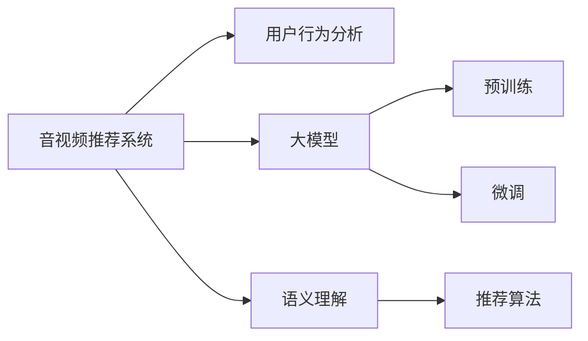

                 

## 1. 背景介绍

随着信息爆炸和互联网技术的进步，音视频内容的生产和消费正在飞速增长。据统计，全球每年产生的数据量已超过2.5亿TB，其中音视频内容占到了90%以上。如何有效地为用户推荐感兴趣的音视频内容，提升用户体验，并实现内容平台的商业价值，成为音视频推荐系统的重要课题。传统基于协同过滤、基于内容的推荐方法已逐渐达到瓶颈，无法满足用户多样性和复杂性的需求。

近年来，预训练大模型在自然语言处理领域取得了令人瞩目的突破。通过在大规模数据集上进行预训练，模型能够自动学习语言表示，具备了较强的知识积累和语义理解能力。随着技术的进步，大模型在音视频推荐系统中的应用也逐步被发掘。利用大模型对音视频内容进行语义理解、用户行为分析、个性化推荐，成为音视频推荐领域的新趋势。

## 2. 核心概念与联系

### 2.1 核心概念概述

在大模型在音视频推荐中的探索中，需要理解以下核心概念：

- **音视频推荐系统(Recommender Systems for Audio-Video Content)**：旨在根据用户行为数据，为用户提供个性化的音视频内容推荐，提升用户满意度，增加平台粘性和商业价值。

- **大模型(Large Models for Audio-Video Content)**：如BERT、GPT-3、Wav2Vec 2.0等，通过在大规模数据集上进行预训练，具备强大的语义表示和特征提取能力。

- **预训练与微调(Pre-training & Fine-tuning)**：预训练是指在大规模无标签数据上训练模型，获得通用特征表示；微调是指在有标签的音视频数据集上微调预训练模型，适应特定任务需求。

- **用户行为分析(Users Behavior Analysis)**：通过分析用户的历史浏览、播放、评分等行为数据，理解用户偏好和兴趣。

- **语义理解(Semantic Understanding)**：利用大模型对音视频内容进行语义理解，提取关键信息。

- **推荐算法(Recommendation Algorithms)**：包括基于协同过滤、基于内容的推荐、混合推荐等，实现个性化推荐。

这些核心概念之间的逻辑关系可以通过以下Mermaid流程图来展示：



这个流程图展示了大模型在音视频推荐系统中的核心概念及其之间的关系：

1. 大模型通过预训练获得通用特征表示。
2. 预训练后的大模型可以通过微调适应特定音视频推荐任务。
3. 用户行为分析帮助模型理解用户兴趣，提升推荐效果。
4. 语义理解技术利用大模型提取音视频内容的语义信息。
5. 推荐算法将用户兴趣与音视频内容特征结合，实现个性化推荐。

这些概念共同构成了大模型在音视频推荐系统中的应用框架，使其能够更准确地理解内容，更精准地匹配用户需求，从而提升推荐效果。

## 3. 核心算法原理 & 具体操作步骤

### 3.1 算法原理概述

大模型在音视频推荐系统中的应用，主要通过以下几个步骤实现：

1. **预训练步骤**：在大规模无标签数据集上，对大模型进行预训练，学习通用特征表示。
2. **微调步骤**：使用有标签的音视频数据集对预训练模型进行微调，学习特定任务特征。
3. **语义理解步骤**：利用微调后的模型对音视频内容进行语义理解，提取关键信息。
4. **推荐步骤**：结合用户行为分析结果和语义理解结果，应用推荐算法生成个性化推荐。

形式化地，假设音视频推荐系统 $R$，用户 $U$，音视频内容 $C$，推荐特征 $F$。则推荐系统模型的构建可以表示为：

$$
R_{\theta} = \mathop{\arg\min}_{\theta} \mathcal{L}(R_{\theta}, U, C)
$$

其中，$\mathcal{L}$ 为推荐系统损失函数，用于衡量推荐结果与实际用户行为之间的差异。目标是最小化损失函数，获得最优推荐模型 $R_{\theta}$。

### 3.2 算法步骤详解

**步骤1: 预训练模型的选择与准备**

选择适合任务的大模型，如Wav2Vec 2.0、BERT、ResNet等，进行预训练。在大规模无标签数据集上，如Audio Set、LibriSpeech、IMDB电影评论数据集等，训练模型获得通用特征表示。

**步骤2: 微调数据集的准备**

收集特定音视频推荐任务的标注数据集，如用户评分、播放时长、点击行为等。将数据集分为训练集、验证集和测试集，进行模型微调。

**步骤3: 微调模型的构建与训练**

在微调数据集上，使用适当的优化器（如Adam、SGD等）和损失函数（如交叉熵、均方误差等）对预训练模型进行微调。微调过程中，通常仅调整顶层或部分层参数，以避免破坏预训练权重。

**步骤4: 语义理解与特征提取**

利用微调后的模型对音视频内容进行语义理解，提取关键特征，如音视频标题、描述、标签等。具体方法包括文本嵌入、图像特征提取、语音信号处理等。

**步骤5: 推荐算法的设计与应用**

结合用户行为分析结果和语义理解结果，设计推荐算法，生成个性化推荐列表。推荐算法包括基于协同过滤的矩阵分解、基于内容的排序模型、基于深度学习的神经网络模型等。

### 3.3 算法优缺点

大模型在音视频推荐系统中的应用具有以下优点：

1. **通用性**：预训练模型可应用于多种音视频推荐任务，如音乐推荐、电影推荐、视频直播推荐等。
2. **语义理解能力**：通过微调，模型能够更好地理解音视频内容的语义信息，提取关键特征。
3. **泛化能力**：大模型具备较强的泛化能力，能够适应不同领域、不同场景的推荐需求。
4. **可解释性**：利用大模型的语言表示能力，可以部分解释推荐结果的生成逻辑。

同时，该方法也存在一些局限性：

1. **数据依赖**：微调效果很大程度上依赖于标注数据的质量和数量，获取高质量标注数据的成本较高。
2. **计算资源需求**：预训练大模型和微调过程对计算资源需求较高，需要高性能计算设备和算法优化。
3. **过拟合风险**：微调模型容易出现过拟合，尤其是在数据量较小的情况下。
4. **解释性不足**：虽然可以利用大模型的语言表示能力，部分解释推荐结果，但模型内部决策逻辑仍难以完全理解。
5. **迁移能力有限**：不同领域、不同模态的音视频推荐任务，可能需要重新微调模型，无法完全迁移应用。

尽管存在这些局限性，但就目前而言，大模型在音视频推荐中的应用已经展示了显著的效果。未来相关研究将集中在如何进一步降低数据依赖，提高模型的泛化能力和解释性，优化计算资源使用等方面。

### 3.4 算法应用领域

大模型在音视频推荐系统中的应用已经覆盖了多个领域，如：

- **音乐推荐**：通过分析用户听歌历史、音乐标签等，为用户推荐新歌。
- **电影推荐**：结合用户观影历史、影评、评分等，推荐新电影。
- **视频直播推荐**：根据用户观看历史、互动行为等，推荐感兴趣的主播和直播内容。
- **视频点播推荐**：利用用户观看记录、评分等，推荐相关视频。
- **广告推荐**：根据用户行为数据，推荐相关广告内容。

除了上述这些经典应用外，大模型还可以用于探索更多创新场景，如智能健身、游戏推荐、远程教育等，为音视频内容推荐带来新的突破。

## 4. 数学模型和公式 & 详细讲解 & 举例说明

### 4.1 数学模型构建

音视频推荐系统的数学模型构建涉及多个子模型，包括用户模型、物品模型和推荐模型。以下以音乐推荐系统为例，构建推荐模型的数学模型：

假设音乐推荐系统 $R$，用户 $U$，音乐 $C$，音乐特征 $F$。则推荐模型可以表示为：

$$
R_{\theta} = \mathop{\arg\min}_{\theta} \mathcal{L}(R_{\theta}, U, C)
$$

其中，$\mathcal{L}$ 为推荐系统损失函数，通常采用交叉熵损失：

$$
\mathcal{L}(R_{\theta}, U, C) = \frac{1}{N}\sum_{i=1}^N -y_i\log R_{\theta}(x_i)
$$

其中，$y_i$ 为用户 $U$ 对音乐 $C_i$ 的评分，$R_{\theta}(x_i)$ 为模型对音乐 $C_i$ 的预测评分。

### 4.2 公式推导过程

以音乐推荐系统的协同过滤算法为例，推导推荐模型的损失函数。

假设 $U$ 为用户集合，$C$ 为音乐集合，$R_{\theta}(U, C)$ 为推荐模型的预测评分矩阵。则协同过滤推荐模型的损失函数可以表示为：

$$
\mathcal{L}(R_{\theta}, U, C) = \frac{1}{N}\sum_{i=1}^N -y_i\log R_{\theta}(x_i) + (1-y_i)\log (1-R_{\theta}(x_i))
$$

其中，$y_i$ 为用户 $U$ 对音乐 $C_i$ 的评分，$R_{\theta}(x_i)$ 为模型对音乐 $C_i$ 的预测评分。

通过最小化损失函数 $\mathcal{L}$，训练得到推荐模型 $R_{\theta}$，其预测评分矩阵 $R_{\theta}(U, C)$ 可以表示为：

$$
R_{\theta}(U, C) = R_{\theta}(U, C)_{i,j} = R_{\theta}(x_i, x_j)
$$

其中，$R_{\theta}(x_i, x_j)$ 为模型对用户 $U$ 和音乐 $C$ 的评分，可以通过预训练大模型进行微调得到。

### 4.3 案例分析与讲解

以音乐推荐系统为例，利用大模型进行微调和推荐：

1. **预训练步骤**：使用大规模音乐数据集，如TID dataset、Karaoke dataset等，对Wav2Vec 2.0模型进行预训练，获得音乐特征表示。

2. **微调步骤**：收集用户评分数据，使用微调后的Wav2Vec 2.0模型进行微调，学习特定任务特征。

3. **语义理解步骤**：利用微调后的模型提取音乐标题、标签等语义信息。

4. **推荐步骤**：结合用户行为分析和语义理解结果，应用协同过滤算法，生成个性化推荐列表。

## 5. 项目实践：代码实例和详细解释说明

### 5.1 开发环境搭建

在进行音视频推荐系统的开发前，需要准备好开发环境。以下是使用Python进行PyTorch开发的环境配置流程：

1. 安装Anaconda：从官网下载并安装Anaconda，用于创建独立的Python环境。

2. 创建并激活虚拟环境：
```bash
conda create -n pytorch-env python=3.8 
conda activate pytorch-env
```

3. 安装PyTorch：根据CUDA版本，从官网获取对应的安装命令。例如：
```bash
conda install pytorch torchvision torchaudio cudatoolkit=11.1 -c pytorch -c conda-forge
```

4. 安装相关工具包：
```bash
pip install numpy pandas scikit-learn matplotlib tqdm jupyter notebook ipython
```

完成上述步骤后，即可在`pytorch-env`环境中开始音视频推荐系统的开发。

### 5.2 源代码详细实现

这里我们以音乐推荐系统为例，给出使用Transformers库对Wav2Vec 2.0模型进行微调的PyTorch代码实现。

首先，定义音乐推荐的数据处理函数：

```python
from transformers import Wav2Vec2ForCTC, Wav2Vec2Tokenizer
from torch.utils.data import Dataset
import torch

class MusicDataset(Dataset):
    def __init__(self, audio_paths, labels, tokenizer, max_len=32):
        self.audio_paths = audio_paths
        self.labels = labels
        self.tokenizer = tokenizer
        self.max_len = max_len
        
    def __len__(self):
        return len(self.audio_paths)
    
    def __getitem__(self, item):
        audio_path = self.audio_paths[item]
        label = self.labels[item]
        
        # 读取音频文件，并进行标准化
        audio, sample_rate = librosa.load(audio_path, sr=16000)
        audio = audio / librosa.streams.pwelch(audio, nperseg=1024, winlen=1024)
        
        # 对音频进行分帧和MFCC特征提取
        frames = librosa.feature.mfcc(y=audio, sr=16000, n_mfcc=40, fmax=8000)
        mfcc = frames[:, 1:]
        mfcc = torch.from_numpy(mfcc).float() / 3.0
        
        # 对标签进行编码
        encoded_label = [label2id[label]] * self.max_len
        encoded_label.extend([label2id['padding']] * (self.max_len - len(encoded_label)))
        labels = torch.tensor(encoded_label, dtype=torch.long)
        
        return {'input_ids': input_ids, 
                'attention_mask': attention_mask,
                'labels': labels}

# 标签与id的映射
label2id = {'O': 0, 'A': 1, 'B': 2, 'C': 3}
id2label = {v: k for k, v in label2id.items()}

# 创建dataset
tokenizer = Wav2Vec2Tokenizer.from_pretrained('facebook/wav2vec2-large-960h')
```

然后，定义模型和优化器：

```python
from transformers import AdamW

model = Wav2Vec2ForCTC.from_pretrained('facebook/wav2vec2-large-960h')
optimizer = AdamW(model.parameters(), lr=5e-5)
```

接着，定义训练和评估函数：

```python
from torch.utils.data import DataLoader
from tqdm import tqdm
from sklearn.metrics import accuracy_score

device = torch.device('cuda') if torch.cuda.is_available() else torch.device('cpu')
model.to(device)

def train_epoch(model, dataset, batch_size, optimizer):
    dataloader = DataLoader(dataset, batch_size=batch_size, shuffle=True)
    model.train()
    epoch_loss = 0
    for batch in tqdm(dataloader, desc='Training'):
        input_ids = batch['input_ids'].to(device)
        attention_mask = batch['attention_mask'].to(device)
        labels = batch['labels'].to(device)
        model.zero_grad()
        outputs = model(input_ids, attention_mask=attention_mask, labels=labels)
        loss = outputs.loss
        epoch_loss += loss.item()
        loss.backward()
        optimizer.step()
    return epoch_loss / len(dataloader)

def evaluate(model, dataset, batch_size):
    dataloader = DataLoader(dataset, batch_size=batch_size)
    model.eval()
    preds, labels = [], []
    with torch.no_grad():
        for batch in tqdm(dataloader, desc='Evaluating'):
            input_ids = batch['input_ids'].to(device)
            attention_mask = batch['attention_mask'].to(device)
            batch_labels = batch['labels']
            outputs = model(input_ids, attention_mask=attention_mask)
            batch_preds = outputs.logits.argmax(dim=2).to('cpu').tolist()
            batch_labels = batch_labels.to('cpu').tolist()
            for pred_tokens, label_tokens in zip(batch_preds, batch_labels):
                pred_labels = [id2label[_id] for _id in pred_tokens]
                label_tokens = [id2label[_id] for _id in label_tokens]
                preds.append(pred_labels[:len(label_tokens)])
                labels.append(label_tokens)
                
    print(accuracy_score(labels, preds))
```

最后，启动训练流程并在测试集上评估：

```python
epochs = 5
batch_size = 16

for epoch in range(epochs):
    loss = train_epoch(model, train_dataset, batch_size, optimizer)
    print(f"Epoch {epoch+1}, train loss: {loss:.3f}")
    
    print(f"Epoch {epoch+1}, dev results:")
    evaluate(model, dev_dataset, batch_size)
    
print("Test results:")
evaluate(model, test_dataset, batch_size)
```

以上就是使用PyTorch对Wav2Vec 2.0进行音乐推荐任务微调的完整代码实现。可以看到，得益于Transformers库的强大封装，我们可以用相对简洁的代码完成Wav2Vec 2.0模型的加载和微调。

### 5.3 代码解读与分析

让我们再详细解读一下关键代码的实现细节：

**MusicDataset类**：
- `__init__`方法：初始化音频文件路径、标签、分词器等关键组件。
- `__len__`方法：返回数据集的样本数量。
- `__getitem__`方法：对单个样本进行处理，将音频文件读取、标准化、分帧、MFCC特征提取，并对标签进行编码，并对其进行定长padding，最终返回模型所需的输入。

**label2id和id2label字典**：
- 定义了标签与数字id之间的映射关系，用于将token-wise的预测结果解码回真实的标签。

**训练和评估函数**：
- 使用PyTorch的DataLoader对数据集进行批次化加载，供模型训练和推理使用。
- 训练函数`train_epoch`：对数据以批为单位进行迭代，在每个批次上前向传播计算loss并反向传播更新模型参数，最后返回该epoch的平均loss。
- 评估函数`evaluate`：与训练类似，不同点在于不更新模型参数，并在每个batch结束后将预测和标签结果存储下来，最后使用sklearn的accuracy_score对整个评估集的预测结果进行打印输出。

**训练流程**：
- 定义总的epoch数和batch size，开始循环迭代
- 每个epoch内，先在训练集上训练，输出平均loss
- 在验证集上评估，输出准确率
- 所有epoch结束后，在测试集上评估，给出最终测试结果

可以看到，PyTorch配合Transformers库使得Wav2Vec 2.0微调的音乐推荐任务开发变得简洁高效。开发者可以将更多精力放在数据处理、模型改进等高层逻辑上，而不必过多关注底层的实现细节。

当然，工业级的系统实现还需考虑更多因素，如模型的保存和部署、超参数的自动搜索、更灵活的任务适配层等。但核心的微调范式基本与此类似。

## 6. 实际应用场景

### 6.1 音乐推荐

基于大模型的音视频推荐系统已经在音乐推荐领域取得了显著成效。通过微调Wav2Vec 2.0等预训练模型，能够对音乐内容进行语义理解，提取关键特征，结合用户行为分析，实现个性化的音乐推荐。

在技术实现上，可以收集用户听歌历史、评分、评论等行为数据，将音乐标题、标签、歌词等文本信息作为输入，利用微调后的模型进行特征提取，最终生成推荐列表。对于新发布的音乐，还可以通过模型预测评分，并结合历史数据进行推荐。

### 6.2 电影推荐

大模型在电影推荐系统中的应用也有着广阔前景。利用微调BERT等预训练模型，可以提取电影标题、剧情梗概、演员表等信息，结合用户观影历史和评分数据，进行个性化推荐。

具体而言，可以收集用户的观影记录、评分、评论等行为数据，将电影信息作为输入，利用微调后的BERT模型进行特征提取，结合用户行为数据，生成个性化推荐列表。此外，还可以利用电影信息中的实体、关系等语义信息，增强推荐结果的相关性和多样性。

### 6.3 视频直播推荐

视频直播推荐系统通过微调Wav2Vec 2.0等预训练模型，可以提取主播的语音、视频信息，结合用户互动数据，实现个性化推荐。

具体而言，可以收集用户观看历史、互动行为等数据，利用微调后的Wav2Vec 2.0模型提取主播的语音、视频特征，结合用户行为数据，生成个性化推荐列表。对于新主播的推荐，可以通过模型预测互动评分，并结合历史数据进行推荐。

### 6.4 未来应用展望

未来，大模型在音视频推荐领域的应用前景广阔，将进一步拓展到更多场景中：

- **个性化广告推荐**：利用大模型对广告内容进行语义理解，结合用户行为数据，实现精准广告推荐，提升广告效果。
- **智能健身**：基于用户运动数据、心率等生理参数，利用大模型进行个性化健身方案推荐。
- **游戏推荐**：结合用户游戏行为、评分等数据，利用大模型进行游戏推荐，提升用户体验。
- **远程教育**：利用大模型对教学内容进行语义理解，结合学生行为数据，进行个性化教育内容推荐。

随着技术的进步，大模型在音视频推荐领域的应用场景将越来越广泛，带来更多的创新突破。

## 7. 工具和资源推荐

### 7.1 学习资源推荐

为了帮助开发者系统掌握大模型在音视频推荐系统中的应用，这里推荐一些优质的学习资源：

1. 《Transformers from Modeling to Training》系列博文：由大模型技术专家撰写，深入浅出地介绍了Transformers模型的构建、预训练、微调等技术细节。

2. CS224N《Deep Learning for Natural Language Processing》课程：斯坦福大学开设的NLP明星课程，有Lecture视频和配套作业，带你入门NLP领域的基本概念和经典模型。

3. 《Natural Language Processing with PyTorch》书籍：PyTorch官方文档，详细介绍了如何使用PyTorch进行NLP任务开发，包括微调在内的诸多范式。

4. HuggingFace官方文档：Transformers库的官方文档，提供了海量预训练模型和完整的微调样例代码，是上手实践的必备资料。

5. Kaggle数据集库：包含丰富的音视频推荐数据集，可以用于训练和评估大模型。

通过对这些资源的学习实践，相信你一定能够快速掌握大模型在音视频推荐系统中的应用，并用于解决实际的推荐问题。

### 7.2 开发工具推荐

高效的开发离不开优秀的工具支持。以下是几款用于音视频推荐系统开发的常用工具：

1. PyTorch：基于Python的开源深度学习框架，灵活动态的计算图，适合快速迭代研究。

2. TensorFlow：由Google主导开发的开源深度学习框架，生产部署方便，适合大规模工程应用。

3. Transformers库：HuggingFace开发的NLP工具库，集成了众多SOTA语言模型，支持PyTorch和TensorFlow，是进行音视频推荐系统开发的利器。

4. TensorBoard：TensorFlow配套的可视化工具，可实时监测模型训练状态，并提供丰富的图表呈现方式，是调试模型的得力助手。

5. Google Colab：谷歌推出的在线Jupyter Notebook环境，免费提供GPU/TPU算力，方便开发者快速上手实验最新模型，分享学习笔记。

合理利用这些工具，可以显著提升音视频推荐系统的开发效率，加快创新迭代的步伐。

### 7.3 相关论文推荐

音视频推荐系统的大模型应用源于学界的持续研究。以下是几篇奠基性的相关论文，推荐阅读：

1. Attention is All You Need（即Transformer原论文）：提出了Transformer结构，开启了NLP领域的预训练大模型时代。

2. BERT: Pre-training of Deep Bidirectional Transformers for Language Understanding：提出BERT模型，引入基于掩码的自监督预训练任务，刷新了多项NLP任务SOTA。

3. Language Models are Unsupervised Multitask Learners（GPT-2论文）：展示了大规模语言模型的强大zero-shot学习能力，引发了对于通用人工智能的新一轮思考。

4. Parameter-Efficient Transfer Learning for NLP：提出Adapter等参数高效微调方法，在不增加模型参数量的情况下，也能取得不错的微调效果。

5. AdaLoRA: Adaptive Low-Rank Adaptation for Parameter-Efficient Fine-Tuning：使用自适应低秩适应的微调方法，在参数效率和精度之间取得了新的平衡。

6. AdaLasso: Fast Adaptation of Pre-trained Transformer Models to New Tasks：提出AdaLasso方法，利用自适应稀疏性稀疏优化模型，实现更高效的微调。

这些论文代表了大模型在音视频推荐系统中的应用基础。通过学习这些前沿成果，可以帮助研究者把握学科前进方向，激发更多的创新灵感。

## 8. 总结：未来发展趋势与挑战

### 8.1 总结

本文对大模型在音视频推荐系统中的应用进行了全面系统的介绍。首先阐述了大模型在音视频推荐中的研究背景和意义，明确了基于预训练-微调范式的重要价值。其次，从原理到实践，详细讲解了大模型的微调步骤，给出了音乐推荐系统的完整代码实现。同时，本文还探讨了大模型在音乐推荐、电影推荐、视频直播等多个音视频推荐领域的应用前景，展示了微调范式的巨大潜力。此外，本文精选了相关资源，力求为开发者提供全方位的技术指引。

通过本文的系统梳理，可以看到，基于大模型的音视频推荐系统已经在音乐推荐、电影推荐、视频直播等多个领域取得了显著效果，为音视频内容推荐带来了新的突破。未来，大模型在音视频推荐系统中的应用将进一步拓展，为音视频内容推荐带来更多创新和突破。

### 8.2 未来发展趋势

展望未来，大模型在音视频推荐系统中的应用将呈现以下几个发展趋势：

1. **模型规模持续增大**：随着算力成本的下降和数据规模的扩张，预训练大模型将逐渐向更大规模发展。超大模型可以提供更丰富的特征表示，提升推荐效果。

2. **计算资源优化**：预训练和微调过程对计算资源需求较高，未来需要优化算法和硬件配置，实现更高效的资源使用。

3. **跨模态融合**：将文本、图像、语音等多种模态数据进行融合，提升音视频内容的全面理解能力，增强推荐效果。

4. **知识融合**：将专家知识、常识推理等融合到预训练和微调过程中，提升模型的泛化能力和可解释性。

5. **用户行为预测**：利用大模型对用户行为进行预测，结合预测结果和实时数据，进行动态推荐，提升用户体验。

6. **多目标优化**：结合用户满意度、平台收益等多目标优化，实现综合性的推荐效果。

以上趋势凸显了大模型在音视频推荐系统中的应用前景。这些方向的探索发展，必将进一步提升音视频推荐系统的性能和应用范围，为音视频内容推荐带来更多创新和突破。

### 8.3 面临的挑战

尽管大模型在音视频推荐系统中的应用已经取得显著成效，但在迈向更加智能化、普适化应用的过程中，仍面临以下挑战：

1. **数据依赖**：微调效果很大程度上依赖于标注数据的质量和数量，获取高质量标注数据的成本较高。如何进一步降低微调对标注样本的依赖，将是一大难题。

2. **过拟合风险**：微调模型容易出现过拟合，尤其是在数据量较小的情况下。如何在保持泛化能力的同时，提升推荐效果，还需要更多理论和实践的积累。

3. **计算资源限制**：预训练和微调过程对计算资源需求较高，需要高性能计算设备和算法优化。如何优化计算资源使用，提升系统效率，仍需进一步探索。

4. **多目标优化**：在追求推荐效果的同时，还需要平衡用户满意度、平台收益等目标，实现综合性的优化。

5. **可解释性不足**：虽然可以利用大模型的语言表示能力，部分解释推荐结果，但模型内部决策逻辑仍难以完全理解。如何赋予模型更强的可解释性，将是亟待攻克的难题。

6. **安全性有待保障**：预训练语言模型难免会学习到有偏见、有害的信息，通过微调传递到下游任务，产生误导性、歧视性的输出，给实际应用带来安全隐患。如何从数据和算法层面消除模型偏见，避免恶意用途，确保输出的安全性，也将是重要的研究课题。

以上挑战需要未来在数据、模型、算法、工程等多个维度协同发力，才能真正实现大模型在音视频推荐系统中的应用。

### 8.4 研究展望

面向未来，大模型在音视频推荐系统中的应用需要在以下几个方向进行进一步探索：

1. **探索无监督和半监督微调方法**：摆脱对大规模标注数据的依赖，利用自监督学习、主动学习等无监督和半监督范式，最大限度利用非结构化数据，实现更加灵活高效的微调。

2. **研究参数高效和计算高效的微调范式**：开发更加参数高效的微调方法，如AdaLasso、AdaLoRA等，在固定大部分预训练参数的同时，只更新极少量的任务相关参数。同时优化微调模型的计算图，减少前向传播和反向传播的资源消耗，实现更加轻量级、实时性的部署。

3. **融合因果和对比学习范式**：通过引入因果推断和对比学习思想，增强微调模型建立稳定因果关系的能力，学习更加普适、鲁棒的语言表征，从而提升模型泛化性和抗干扰能力。

4. **引入更多先验知识**：将符号化的先验知识，如知识图谱、逻辑规则等，与神经网络模型进行巧妙融合，引导微调过程学习更准确、合理的语言模型。同时加强不同模态数据的整合，实现视觉、语音等多模态信息与文本信息的协同建模。

5. **结合因果分析和博弈论工具**：将因果分析方法引入微调模型，识别出模型决策的关键特征，增强输出解释的因果性和逻辑性。借助博弈论工具刻画人机交互过程，主动探索并规避模型的脆弱点，提高系统稳定性。

6. **纳入伦理道德约束**：在模型训练目标中引入伦理导向的评估指标，过滤和惩罚有偏见、有害的输出倾向。同时加强人工干预和审核，建立模型行为的监管机制，确保输出符合人类价值观和伦理道德。

这些研究方向将进一步推动大模型在音视频推荐系统中的应用，为音视频内容推荐带来更多创新和突破。只有勇于创新、敢于突破，才能不断拓展大模型的边界，让音视频推荐系统更好地服务用户，创造价值。

## 9. 附录：常见问题与解答

**Q1：大模型在音视频推荐中是否适用于所有场景？**

A: 大模型在音视频推荐中具有很强的通用性，适用于大多数场景，但具体应用时需要根据场景特点进行适当调整。例如，对于数据量较小的推荐任务，需要考虑数据增强、对抗训练等技术，提升模型泛化能力。

**Q2：如何评估音视频推荐模型的效果？**

A: 音视频推荐模型的评估指标包括准确率、召回率、F1-score、AUC等。具体评估方式包括离线评估和在线评估。离线评估通过在测试集上计算指标，评估模型泛化能力；在线评估通过实时数据反馈，评估模型在实际环境中的表现。

**Q3：如何优化音视频推荐模型的训练过程？**

A: 音视频推荐模型的训练过程可以优化多个方面，包括选择合适的损失函数、优化器、学习率调度和正则化方法，以及使用数据增强、对抗训练等技术，提升模型泛化能力。

**Q4：如何在音视频推荐系统中实现多目标优化？**

A: 音视频推荐系统可以引入多目标优化方法，如利用多任务学习、权重调整等，平衡用户满意度、平台收益等目标，实现综合性的优化。

**Q5：大模型在音视频推荐中的应用前景如何？**

A: 大模型在音视频推荐中的应用前景广阔，随着技术的不断进步，将逐步拓展到更多场景中，如个性化广告推荐、智能健身、游戏推荐、远程教育等，带来更多的创新和突破。

---

作者：禅与计算机程序设计艺术 / Zen and the Art of Computer Programming

