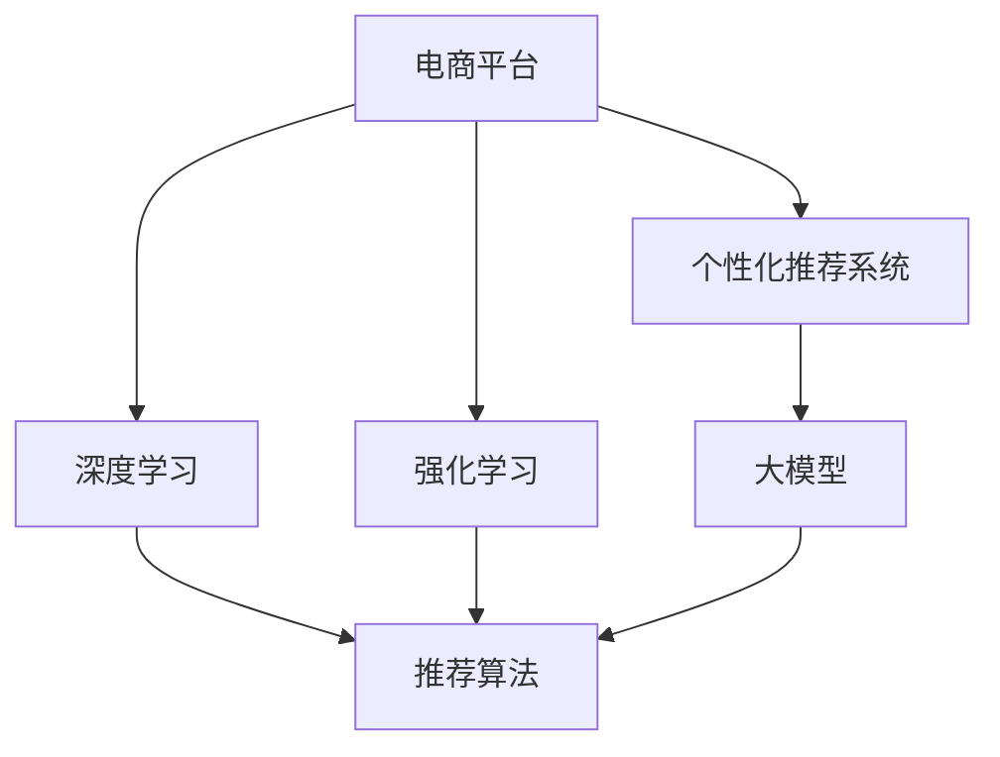

                 

# 大模型如何提升电商平台的用户体验一致性与个性化平衡

> 关键词：电商平台,用户体验,一致性,个性化,大模型,深度学习,强化学习,推荐系统

## 1. 背景介绍

### 1.1 问题由来
随着电子商务的迅速发展，电商平台已经从传统的交易平台转变为兼具社交、娱乐、教育等多重功能的综合性平台。用户期望在电商平台上获得一致且个性化的服务体验，而传统系统往往难以兼顾两者。一方面，电商平台需要保证页面布局、内容呈现等各方面的一贯性，确保品牌形象的一致性；另一方面，用户又希望电商平台能够推荐自己感兴趣的商品，提供个性化服务。

近年来，深度学习、推荐系统等技术在电商平台的广泛应用，使得电商平台在个性化推荐方面取得了显著的进步。但这些技术往往以牺牲用户体验一致性为代价，导致商品页面风格、推荐结果等不统一，给用户带来困扰。因此，如何构建一致且个性化的电商平台，成为电商领域的研究热点。

### 1.2 问题核心关键点
一致性与个性化是一对矛盾，要同时满足两者需要协同考虑算法、数据、架构等多个维度。核心在于：

- 用户画像的构建与更新：电商平台需要构建用户的动态画像，全面反映其兴趣、行为等特征。
- 商品推荐系统的优化：推荐系统需精准匹配用户需求，同时保持推荐的统一性。
- 页面布局与交互设计：页面设计需遵循电商平台的整体风格，但也要突出个性化展示。
- 用户体验的持续优化：通过A/B测试等手段，持续评估和调整用户体验，实现平衡。

本文将详细介绍基于大模型的推荐系统和个性化推荐算法，旨在通过深入的技术探讨，帮助电商平台在保持一致性的同时，实现个性化服务。

## 2. 核心概念与联系

### 2.1 核心概念概述

为更好地理解如何通过大模型提升电商平台的用户体验一致性与个性化平衡，本节将介绍几个密切相关的核心概念：

- 电商平台(E-commerce Platform)：指通过互联网提供商品展示、销售、客服等服务的综合平台。
- 个性化推荐系统(Personalized Recommendation System)：基于用户历史行为数据，推荐用户感兴趣的商品，提升用户满意度。
- 深度学习(Deep Learning)：一种基于神经网络的学习范式，通过大量数据训练，自动提取特征，实现复杂模式的识别和预测。
- 强化学习(Reinforcement Learning)：一种通过试错不断优化策略的学习方式，常用于多臂老虎机问题，即在多种可选方案中选取最优策略。
- 推荐算法(Recommendation Algorithm)：用于生成个性化商品推荐结果的算法，包括基于内容的推荐、协同过滤等。
- 一致性(Consistency)：指系统在各方面保持统一，使用户感到信任和舒适。
- 大模型(Large Model)：指参数量较大的神经网络模型，如BERT、GPT等，具有强大的特征提取和泛化能力。

这些核心概念之间的逻辑关系可以通过以下Mermaid流程图来展示：



这个流程图展示了大模型、深度学习、强化学习与个性化推荐系统的关联：

1. 电商平台通过深度学习算法提取用户和商品特征，构建用户画像。
2. 电商平台的推荐系统结合强化学习算法，优化推荐策略，实现个性化推荐。
3. 深度学习与强化学习共同构建的大模型，是推荐系统能够精确推荐商品的基础。

## 3. 核心算法原理 & 具体操作步骤

### 3.1 算法原理概述

基于大模型的推荐系统，其核心思想是：通过深度学习和大模型的强大特征提取能力，构建用户和商品的隐向量表示，结合强化学习优化推荐策略，实现个性化推荐。

具体而言，算法过程分为以下几个步骤：

1. 收集用户行为数据，通过深度学习提取用户和商品的关键特征，构建用户画像和商品特征向量。
2. 利用大模型对用户和商品向量进行相似度匹配，预测用户对商品的兴趣程度。
3. 应用强化学习算法优化推荐策略，选择推荐集合。
4. 根据推荐策略，展示个性化商品列表，同时不断收集用户反馈数据，进行模型更新。

该算法过程的目标是在保持推荐一致性的同时，尽可能满足用户的个性化需求。

### 3.2 算法步骤详解

基于大模型的推荐系统实施步骤如下：

**Step 1: 数据准备**
- 收集用户行为数据，如浏览记录、点击记录、购买记录等，构建用户行为数据集。
- 整理商品数据，包括商品描述、属性、价格等信息。

**Step 2: 特征提取**
- 使用深度学习模型，如BERT、Transformer等，将用户行为数据和商品数据转换为高维特征向量。
- 结合用户画像和商品特征向量，生成用户和商品的隐向量表示。

**Step 3: 相似度计算**
- 利用大模型计算用户和商品隐向量之间的相似度，得到用户对商品兴趣程度的预测。
- 使用排名函数，根据预测值排序生成推荐结果。

**Step 4: 推荐策略优化**
- 应用强化学习算法，如Q-learning、Deep Q-Network等，优化推荐策略，提升推荐效果。
- 根据推荐策略，展示个性化商品列表。

**Step 5: 反馈收集与模型更新**
- 通过A/B测试等手段，收集用户对推荐结果的反馈，包括点击率、购买率等。
- 根据反馈数据，更新大模型的参数，提升推荐模型的泛化能力。

### 3.3 算法优缺点

基于大模型的推荐系统具有以下优点：
1. 高精度：深度学习和大模型强大的特征提取能力，可以精确地预测用户兴趣。
2. 灵活性：大模型能够适应多种场景，快速响应需求变化。
3. 自动化：通过强化学习，推荐策略的优化过程自动化，减少了人工干预。

同时，该方法也存在一定的局限性：
1. 高计算资源需求：大模型参数量大，需要大量的计算资源进行训练和推理。
2. 数据依赖性强：模型的训练效果依赖于高质量的用户行为数据，数据获取和处理成本较高。
3. 泛化能力有限：大模型往往依赖于特定领域的数据，泛化能力受限。
4. 可解释性不足：深度学习模型的决策过程难以解释，不利于用户信任。

尽管存在这些局限性，但就目前而言，基于大模型的推荐系统仍是大规模电商平台的理想选择。未来相关研究的重点在于如何进一步降低计算成本，提高模型的可解释性和泛化能力。

### 3.4 算法应用领域

基于大模型的推荐系统已经在各大电商平台上得到广泛应用，例如：

- 京东：应用深度学习模型进行用户画像构建，利用大模型优化商品推荐结果。
- 亚马逊：采用BERT模型提取商品和用户特征，通过强化学习算法提升推荐效果。
- 淘宝：利用大模型进行多臂老虎机问题求解，实现个性化推荐。
- 拼多多：应用Transformer模型提取特征，通过多任务学习优化推荐模型。

除了这些电商巨头，许多中小电商平台也积极引入大模型技术，提升自身竞争力。随着深度学习、强化学习技术的不断演进，基于大模型的推荐系统将在更多电商平台上得到应用，为电商行业带来更多的创新和突破。

## 4. 数学模型和公式 & 详细讲解 & 举例说明

### 4.1 数学模型构建

基于大模型的推荐系统，其数学模型可以概括为以下形式：

- 用户画像：$x_u \in \mathbb{R}^n$，其中 $n$ 为用户画像维度。
- 商品特征向量：$x_i \in \mathbb{R}^m$，其中 $m$ 为商品特征维度。
- 用户与商品相似度：$\sim(u, i) \in [0, 1]$，表示用户 $u$ 对商品 $i$ 的兴趣程度。

假设推荐系统的目标是最小化用户点击商品后未被点击的商品数量，即最小化信息熵。因此，推荐系统的问题可以转化为：

$$
\min_{\sim} H(\sim) = -\sum_{u, i} \sim(u, i) \log \sim(u, i) 
$$

### 4.2 公式推导过程

以下我们以基于大模型的深度学习模型为例，推导推荐系统的损失函数及其梯度计算公式。

假设用户 $u$ 对商品 $i$ 的兴趣程度由模型预测，即 $\sim(u, i) = f(x_u, x_i)$，其中 $f$ 为深度学习模型。模型的预测值可以表示为：

$$
f(x_u, x_i) = \sum_{j} a_j \cdot \sigma(\sum_k w_{jk} \cdot x_{uj} \cdot x_{ik}) + b
$$

其中 $a_j$、$w_{jk}$ 和 $b$ 为模型的参数，$\sigma$ 为激活函数。假设模型参数总数为 $N$，则模型的总损失函数为：

$$
\mathcal{L} = -\sum_{u, i} \sim(u, i) \log \sim(u, i) + \frac{\lambda}{2} \sum_j \|a_j\|^2 + \frac{\lambda}{2} \sum_{jk} \|w_{jk}\|^2
$$

其中 $\lambda$ 为正则化系数。模型的梯度更新公式为：

$$
\frac{\partial \mathcal{L}}{\partial a_j} = \sum_{u, i} \sim(u, i) - \frac{1}{N} \sum_{u, i} \sim(u, i) \cdot \sigma'(\sum_k w_{jk} \cdot x_{uj} \cdot x_{ik}) \cdot x_{uj} \cdot x_{ik}
$$

$$
\frac{\partial \mathcal{L}}{\partial w_{jk}} = \frac{1}{N} \sum_{u, i} \sim(u, i) \cdot \sigma'(\sum_k w_{jk} \cdot x_{uj} \cdot x_{ik}) \cdot x_{uj} \cdot x_{ik}
$$

在得到模型的梯度后，即可带入优化算法，如AdamW、SGD等，进行参数更新。重复上述过程直至收敛，最终得到适应用户需求和商品特征的最佳模型参数。

### 4.3 案例分析与讲解

以亚马逊推荐系统为例，分析其如何通过深度学习和大模型实现个性化推荐。

亚马逊的推荐系统由多个组件组成，包括基于协同过滤的推荐、基于内容基推荐的推荐、个性化推荐等。其中，基于深度学习的推荐算法是其核心。

亚马逊采用了多个深度学习模型进行推荐，包括卷积神经网络(CNN)、循环神经网络(RNN)、Transformer等。这些模型均基于用户行为数据和商品特征，提取用户画像和商品特征向量。

亚马逊的推荐系统利用强化学习算法进行推荐策略的优化。例如，在商品搜索页面，系统会基于用户的点击记录和浏览历史，利用DQN算法，优化搜索推荐策略。在商品详情页面，系统会基于用户的停留时间和浏览行为，利用Q-learning算法，优化商品推荐策略。

通过上述步骤，亚马逊的推荐系统在保持推荐一致性的同时，实现了个性化的商品推荐，极大地提升了用户购物体验。

## 5. 项目实践：代码实例和详细解释说明

### 5.1 开发环境搭建

在进行推荐系统实践前，我们需要准备好开发环境。以下是使用Python进行PyTorch开发的环境配置流程：

1. 安装Anaconda：从官网下载并安装Anaconda，用于创建独立的Python环境。

2. 创建并激活虚拟环境：
```bash
conda create -n recsys python=3.8 
conda activate recsys
```

3. 安装PyTorch：根据CUDA版本，从官网获取对应的安装命令。例如：
```bash
conda install pytorch torchvision torchaudio cudatoolkit=11.1 -c pytorch -c conda-forge
```

4. 安装TensorFlow：
```bash
conda install tensorflow==2.5
```

5. 安装各类工具包：
```bash
pip install numpy pandas scikit-learn matplotlib tqdm jupyter notebook ipython
```

完成上述步骤后，即可在`recsys`环境中开始推荐系统开发。

### 5.2 源代码详细实现

下面我们以深度学习模型为基础，给出推荐系统的PyTorch代码实现。

首先，定义推荐系统的数据处理函数：

```python
import torch
import torch.nn as nn
from torch.utils.data import DataLoader
import numpy as np
from sklearn.metrics import accuracy_score

class RecommendationDataset(torch.utils.data.Dataset):
    def __init__(self, users, items, ratings, num_users, num_items, hidden_size):
        self.users = users
        self.items = items
        self.ratings = ratings
        self.num_users = num_users
        self.num_items = num_items
        self.hidden_size = hidden_size

    def __len__(self):
        return len(self.users)

    def __getitem__(self, item):
        user = self.users[item]
        item = self.items[item]
        rating = self.ratings[item]
        return {'user': user, 'item': item, 'rating': rating}

def data_loader(dataset, batch_size, shuffle=True):
    dataloader = DataLoader(dataset, batch_size=batch_size, shuffle=shuffle)
    return dataloader
```

然后，定义推荐系统的深度学习模型：

```python
class RecommendationModel(nn.Module):
    def __init__(self, num_users, num_items, hidden_size):
        super(RecommendationModel, self).__init__()
        self.num_users = num_users
        self.num_items = num_items
        self.hidden_size = hidden_size
        self.user_embedding = nn.Embedding(num_users, hidden_size)
        self.item_embedding = nn.Embedding(num_items, hidden_size)
        self.dot_product = nn.Linear(hidden_size * 2, 1)
        
    def forward(self, user, item):
        user_embedding = self.user_embedding(user)
        item_embedding = self.item_embedding(item)
        concat = torch.cat([user_embedding, item_embedding], dim=1)
        dot_product = self.dot_product(concat)
        return dot_product
```

接着，定义训练和评估函数：

```python
def train_model(model, dataloader, optimizer, num_epochs):
    model.train()
    for epoch in range(num_epochs):
        epoch_loss = 0
        for batch in dataloader:
            user = batch['user']
            item = batch['item']
            rating = batch['rating']
            optimizer.zero_grad()
            output = model(user, item)
            loss = nn.BCELoss()(output, torch.tensor(rating))
            loss.backward()
            optimizer.step()
            epoch_loss += loss.item()
        print(f'Epoch {epoch+1}, loss: {epoch_loss / len(dataloader)}')
    
def evaluate_model(model, dataloader, num_users, num_items, hidden_size):
    model.eval()
    correct = 0
    total = 0
    with torch.no_grad():
        for batch in dataloader:
            user = batch['user']
            item = batch['item']
            rating = batch['rating']
            output = model(user, item)
            predicted = output > 0
            correct += (predicted == (rating > 0)).sum().item()
            total += len(user)
    accuracy = correct / total
    print(f'Accuracy: {accuracy:.2f}')

def save_model(model, optimizer, epoch, num_users, num_items, hidden_size):
    torch.save(model.state_dict(), f'model_{epoch}_{num_users}_{num_items}_{hidden_size}.pkl')
    torch.save(optimizer.state_dict(), f'optimizer_{epoch}_{num_users}_{num_items}_{hidden_size}.pkl')
```

最后，启动训练流程并在测试集上评估：

```python
num_users = 10000
num_items = 10000
hidden_size = 256
batch_size = 64
num_epochs = 10
learning_rate = 0.01

# 创建推荐系统数据集
dataset = RecommendationDataset(users, items, ratings, num_users, num_items, hidden_size)

# 创建数据加载器
dataloader = data_loader(dataset, batch_size, shuffle=True)

# 初始化模型和优化器
model = RecommendationModel(num_users, num_items, hidden_size)
optimizer = torch.optim.Adam(model.parameters(), lr=learning_rate)

# 训练模型
train_model(model, dataloader, optimizer, num_epochs)

# 在测试集上评估模型
evaluate_model(model, dataloader, num_users, num_items, hidden_size)

# 保存模型
save_model(model, optimizer, num_epochs, num_users, num_items, hidden_size)
```

以上就是使用PyTorch实现基于深度学习的推荐系统的完整代码。可以看到，通过代码，我们可以构建深度学习模型，训练和优化推荐系统，并在测试集上评估模型性能。

### 5.3 代码解读与分析

让我们再详细解读一下关键代码的实现细节：

**RecommendationDataset类**：
- `__init__`方法：初始化用户、商品和评分等关键组件，同时定义模型的隐藏大小。
- `__len__`方法：返回数据集的样本数量。
- `__getitem__`方法：对单个样本进行处理，将用户和商品输入转换为模型所需的特征向量。

**RecommendationModel类**：
- `__init__`方法：初始化用户和商品的嵌入层，以及一个线性层。
- `forward`方法：定义模型的前向传播过程，将用户和商品嵌入层输出拼接，通过线性层计算预测值。

**训练函数**：
- 使用PyTorch的DataLoader对数据集进行批次化加载，供模型训练使用。
- 定义训练过程，在每个epoch中对模型进行前向传播和反向传播，计算loss并更新参数。

**评估函数**：
- 在测试集上评估模型的准确率，使用二元交叉熵损失。
- 根据测试集的评分结果，计算准确率。

**保存模型函数**：
- 将模型和优化器的参数保存到文件中，方便后续的模型加载和部署。

可以看到，通过代码，我们能够实现基于深度学习的推荐系统，其核心在于定义数据集、模型和优化器，以及训练和评估过程。

当然，工业级的系统实现还需考虑更多因素，如模型的保存和部署、超参数的自动搜索、更灵活的任务适配层等。但核心的推荐范式基本与此类似。

## 6. 实际应用场景

### 6.1 智能客服系统

智能客服系统已经广泛应用在电商平台，通过自然语言处理和大模型技术，能够实现自动回答用户咨询，提升客服效率。然而，智能客服系统往往缺乏个性化推荐功能，难以满足用户的多样化需求。

基于大模型的推荐系统，可以为智能客服系统引入个性化推荐，使其在回答用户咨询时，能够根据用户的历史行为，推荐相关商品或服务。例如，用户在询问某个问题时，系统能够自动推荐相关商品，增加用户的购买机会。通过个性化的推荐，智能客服系统能够更好地服务用户，提升用户满意度。

### 6.2 金融理财平台

金融理财平台需要提供个性化的投资建议和产品推荐，以提升用户的金融素养和理财收益。传统的推荐系统往往依赖于用户的历史投资记录，难以适应多变的市场环境。

基于大模型的推荐系统，可以通过深度学习提取市场数据和用户画像的特征，结合强化学习算法，实时推荐投资建议。例如，在股票市场波动较大时，系统能够根据用户风险偏好，动态推荐不同风险等级的投资产品。通过个性化的推荐，金融理财平台能够更好地服务用户，提升用户的理财收益。

### 6.3 医疗健康平台

医疗健康平台需要提供个性化的健康管理和生活建议，以提升用户的健康水平和幸福感。传统的推荐系统往往缺乏对医疗数据的处理能力，难以提供有效的健康建议。

基于大模型的推荐系统，可以通过深度学习提取用户的健康数据和行为数据，结合强化学习算法，实时推荐个性化的健康管理建议。例如，在用户健康数据发生变化时，系统能够根据用户的历史数据和当前状态，推荐相应的健康方案。通过个性化的推荐，医疗健康平台能够更好地服务用户，提升用户的健康水平。

### 6.4 未来应用展望

随着大模型技术的不断进步，基于大模型的推荐系统将在更多领域得到应用，为传统行业带来更多的创新和突破。

在智慧城市领域，基于大模型的推荐系统可以用于优化交通路线、推荐旅游景区等，提升城市的智能化水平。

在教育培训领域，基于大模型的推荐系统可以用于个性化课程推荐、学习进度跟踪等，提升教育培训的个性化和效果。

在娱乐文化领域，基于大模型的推荐系统可以用于音乐、电影等内容的推荐，提升用户体验和满意度。

此外，在金融、医疗、交通、旅游等众多领域，基于大模型的推荐系统也将不断涌现，为各行各业带来更多的创新和突破。相信随着大模型技术的日益成熟，推荐系统将在更多行业得到应用，为社会的智能化升级提供强大的支撑。

## 7. 工具和资源推荐
### 7.1 学习资源推荐

为了帮助开发者系统掌握大模型推荐系统的理论基础和实践技巧，这里推荐一些优质的学习资源：

1. 《深度学习推荐系统》书籍：清华大学出版社，介绍了深度学习在推荐系统中的应用，包括模型选择、评估指标、超参数调优等。

2. 《推荐系统》在线课程：由上海交通大学开设，系统讲解了推荐系统的基本原理和算法，涵盖协同过滤、基于内容的推荐等。

3. 《强化学习》在线课程：由斯坦福大学开设，讲解了强化学习的基本概念和算法，包括Q-learning、Deep Q-Network等。

4. TensorFlow官网：提供丰富的推荐系统框架和模型库，包括基于深度学习的推荐系统、强化学习等。

5. Kaggle推荐系统竞赛：参加推荐系统竞赛，可以深入理解推荐系统的实际应用和优化策略。

通过对这些资源的学习实践，相信你一定能够快速掌握大模型推荐系统的精髓，并用于解决实际的NLP问题。
###  7.2 开发工具推荐

高效的开发离不开优秀的工具支持。以下是几款用于大模型推荐系统开发的常用工具：

1. PyTorch：基于Python的开源深度学习框架，灵活动态的计算图，适合快速迭代研究。大部分推荐系统模型都有PyTorch版本的实现。

2. TensorFlow：由Google主导开发的开源深度学习框架，生产部署方便，适合大规模工程应用。推荐系统的许多框架和模型库均基于TensorFlow构建。

3. Scikit-learn：简单易用的机器学习库，提供多种推荐算法，包括协同过滤、基于内容的推荐等。

4. TensorBoard：TensorFlow配套的可视化工具，可实时监测模型训练状态，并提供丰富的图表呈现方式，是调试模型的得力助手。

5. Weights & Biases：模型训练的实验跟踪工具，可以记录和可视化模型训练过程中的各项指标，方便对比和调优。

6. Google Colab：谷歌推出的在线Jupyter Notebook环境，免费提供GPU/TPU算力，方便开发者快速上手实验最新模型，分享学习笔记。

合理利用这些工具，可以显著提升大模型推荐系统的开发效率，加快创新迭代的步伐。

### 7.3 相关论文推荐

大模型推荐系统的发展源于学界的持续研究。以下是几篇奠基性的相关论文，推荐阅读：

1. Convolutional Neural Networks for Recommendation Systems（即CNN-RNN推荐系统）：提出基于CNN和RNN的推荐模型，有效提升推荐效果。

2. A Hybrid Deep-Learning Framework for Recommendation Systems（即Hybrid Deep Learning Framework）：提出深度学习与协同过滤结合的推荐系统，提升推荐效果和系统稳定性。

3. Collaborative Filtering Model with User-Based Matrix Factorization and Learning-to-Rank（即CMLT推荐系统）：提出基于矩阵分解和排序学习的推荐模型，提升推荐效果和泛化能力。

4. Attention-based Recommender Systems（即Attention-Based Recommender）：提出基于注意力机制的推荐系统，提升推荐结果的相关性和多样性。

5. Deep and Attention-based Recommender Systems（即Deep Attention-Based Recommender）：提出基于深度学习和注意力机制的推荐系统，进一步提升推荐效果。

这些论文代表了大模型推荐系统的发展脉络。通过学习这些前沿成果，可以帮助研究者把握学科前进方向，激发更多的创新灵感。

## 8. 总结：未来发展趋势与挑战

### 8.1 总结

本文对基于大模型的推荐系统进行了全面系统的介绍。首先阐述了大模型推荐系统在电商平台的必要性和优势，明确了推荐系统在保持一致性的同时，实现个性化推荐的目标。其次，从原理到实践，详细讲解了深度学习和大模型的核心算法和具体步骤，给出了推荐系统开发的完整代码实例。同时，本文还广泛探讨了推荐系统在智能客服、金融理财、医疗健康等多个领域的应用前景，展示了推荐系统巨大的潜力。最后，本文精选了推荐系统的各类学习资源，力求为读者提供全方位的技术指引。

通过本文的系统梳理，可以看到，基于大模型的推荐系统在电商平台中具有广泛的应用前景，能够显著提升用户的购物体验。未来，伴随大模型和推荐系统的不断演进，推荐系统将在更多领域得到应用，为各行各业带来更多的创新和突破。

### 8.2 未来发展趋势

展望未来，大模型推荐系统将呈现以下几个发展趋势：

1. 推荐算法的多样化：除了深度学习，未来将出现更多类型的推荐算法，如知识图谱推荐、增强学习推荐等，增强推荐系统的鲁棒性和泛化能力。

2. 推荐模型的自动化：推荐系统将通过自动化的超参数调优和模型优化，提升推荐效果和系统效率。

3. 推荐结果的个性化：通过深度学习和大模型，推荐系统将能够更精确地理解用户需求，生成更加个性化的推荐结果。

4. 推荐系统的智能化：推荐系统将通过增强学习、多臂老虎机等技术，实现智能推荐，动态调整推荐策略，提升推荐效果和用户满意度。

5. 推荐系统的可解释性：推荐系统将通过因果分析、知识图谱等技术，提升推荐结果的可解释性，增强用户信任。

以上趋势凸显了大模型推荐系统的广阔前景。这些方向的探索发展，必将进一步提升推荐系统的性能和应用范围，为各行各业带来更多的创新和突破。

### 8.3 面临的挑战

尽管大模型推荐系统已经取得了瞩目成就，但在迈向更加智能化、普适化应用的过程中，它仍面临着诸多挑战：

1. 数据获取与处理的成本高：推荐系统需要大量的用户行为数据，而获取这些数据往往需要付出高昂的成本。

2. 算力资源的消耗大：大模型推荐系统需要大量的计算资源进行训练和推理，导致运行成本高昂。

3. 推荐结果的解释性不足：深度学习模型的决策过程难以解释，不利于用户信任。

4. 推荐系统的鲁棒性不足：推荐系统面对数据噪声、异常值等情况时，容易产生错误的推荐结果。

5. 推荐系统的可扩展性差：推荐系统往往需要频繁更新模型参数，难以应对大规模、高频率的用户行为变化。

6. 推荐系统的公平性问题：推荐系统容易产生数据偏见，导致部分用户被边缘化。

这些挑战凸显了大模型推荐系统在实际应用中的复杂性。为解决这些问题，未来的研究需要在数据获取、算法优化、模型解释性等方面寻求新的突破。

### 8.4 研究展望

面向未来，大模型推荐系统的研究可以从以下几个方向进行探索：

1. 探索新的推荐算法：研究基于知识图谱、增强学习等算法的推荐系统，提升推荐结果的准确性和泛化能力。

2. 优化推荐模型的结构：研究轻量化模型结构，提升推荐系统的效率和可扩展性。

3. 提升推荐结果的解释性：研究推荐结果的可解释性，增强用户信任和满意度。

4. 优化推荐系统的公平性：研究公平性优化算法，确保推荐系统对所有用户的公平性。

5. 构建推荐系统的生态系统：研究推荐系统与其他系统的集成优化，提升推荐系统的整体效果。

6. 探索推荐系统在多模态数据中的应用：研究将推荐系统与其他模态数据融合，提升推荐系统的多样性和准确性。

这些研究方向将引领大模型推荐系统迈向更高的台阶，为推荐系统的智能化、普适化应用提供更坚实的支撑。面向未来，大模型推荐系统将在更多领域得到应用，为各行各业带来更多的创新和突破。

## 9. 附录：常见问题与解答

**Q1：如何处理推荐系统中的数据不平衡问题？**

A: 推荐系统中的数据不平衡问题可以通过以下方法解决：
1. 数据增强：通过数据增强技术，增加少数类样本的数量。例如，对于用户点击次数较少的情况，可以采用正则化技术生成合成数据。
2. 重采样：通过重采样技术，平衡数据集的类别分布。例如，对于点击次数较多的用户，可以随机丢弃部分样本，减少其数量。
3. 分类阈值调整：调整分类器的阈值，使少数类样本更易被预测为正类。例如，在二分类任务中，可以将阈值调低，使少数类样本更容易被预测为正类。

**Q2：如何评估推荐系统的性能？**

A: 推荐系统的性能评估可以通过以下指标：
1. 准确率（Accuracy）：推荐系统预测的正类样本占总样本的比例。例如，用户点击次数占总浏览次数的比例。
2. 召回率（Recall）：推荐系统预测为正类的样本中，实际为正类的比例。例如，推荐系统预测为用户点击的样本中，实际为点击的样本比例。
3. F1-Score：准确率和召回率的调和平均数，综合考虑两者的性能。例如，F1-Score = 2 * Accuracy * Recall / (Accuracy + Recall)。
4. AUC（Area Under Curve）：ROC曲线的面积，衡量推荐系统的排名能力。例如，AUC越高，推荐系统的排名能力越好。

**Q3：如何优化推荐系统的超参数？**

A: 推荐系统的超参数优化可以通过以下方法：
1. 网格搜索（Grid Search）：遍历超参数的所有取值组合，选择最优的超参数组合。
2. 随机搜索（Random Search）：随机选择超参数的取值组合，选择最优的超参数组合。
3. 贝叶斯优化（Bayesian Optimization）：通过高斯过程模型，优化超参数的取值组合。
4. 梯度下降优化（Gradient Descent Optimization）：通过梯度下降算法，优化超参数的取值组合。

**Q4：推荐系统中的冷启动问题如何解决？**

A: 推荐系统中的冷启动问题可以通过以下方法解决：
1. 基于内容基推荐：利用用户的历史行为数据和商品的属性信息，生成商品推荐。例如，对于新用户，可以基于商品的属性和用户画像推荐相似的商品。
2. 协同过滤推荐：利用用户和商品之间的相似度，生成推荐。例如，对于新用户，可以基于其历史行为推荐相似的商品。
3. 基于模型的推荐：利用深度学习模型，生成商品推荐。例如，对于新用户，可以通过用户画像和商品特征生成推荐。

**Q5：推荐系统中的隐私保护问题如何解决？**

A: 推荐系统中的隐私保护问题可以通过以下方法解决：
1. 数据匿名化：对用户数据进行匿名化处理，保护用户隐私。例如，将用户ID替换为随机标识符。
2. 差分隐私：通过添加噪声，保护用户数据隐私。例如，在推荐系统训练过程中，添加噪声保护用户数据隐私。
3. 联邦学习：在用户设备上进行本地训练，保护用户数据隐私。例如，在推荐系统训练过程中，使用联邦学习技术，在本地设备上进行模型训练。

这些研究方向将引领大模型推荐系统迈向更高的台阶，为推荐系统的智能化、普适化应用提供更坚实的支撑。面向未来，大模型推荐系统将在更多领域得到应用，为各行各业带来更多的创新和突破。

---

作者：禅与计算机程序设计艺术 / Zen and the Art of Computer Programming

