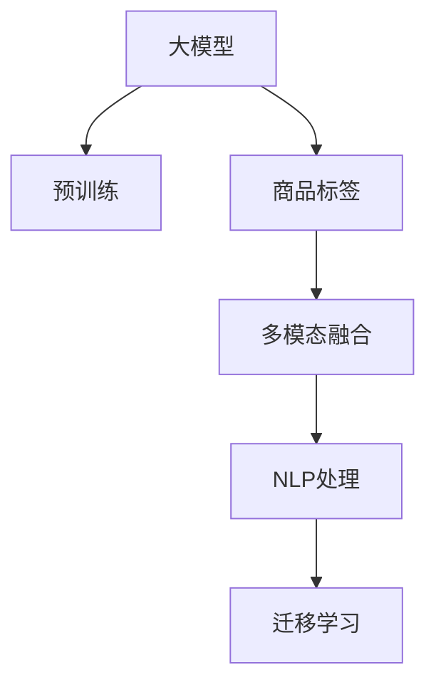

                 

# 大模型技术在电商平台商品标签生成中的应用

## 1. 背景介绍

### 1.1 问题由来
在现代电商平台上，商品标签的生成和管理是一个重要的环节，对提高商品搜索的精准度、提升用户体验、优化商品运营策略等都具有重要作用。传统的商品标签生成方式，主要依赖人工标注或者简单的机器学习算法，效率低、效果差、成本高。

近年来，随着大模型技术在自然语言处理领域的突破，基于大模型技术自动生成商品标签的方案开始受到广泛关注。其中，Transformer架构的预训练语言模型因其强大的语言理解能力，被广泛用于商品标签生成任务中。

### 1.2 问题核心关键点
商品标签生成的核心在于如何从商品的描述、属性、图片等多维度信息中，提取出关键特征，并映射到对应的标签集合中。传统的标签生成方法依赖人工或小规模机器学习模型，难以处理多模态数据，且标签生成效果受限于标注数据的质量和数量。

而基于大模型技术的解决方案，通过在大规模语料上进行预训练，学习到通用的语言表示和语义关系，从而在商品标签生成任务中能够更高效、准确地提取商品特征，并进行标签映射。

### 1.3 问题研究意义
基于大模型技术的商品标签生成方案，具有以下显著优势：

1. **高效性**：大模型通过预训练学习到通用的语言表示，能够在标注数据较少的情况下，快速进行标签生成，大大提高生成效率。
2. **准确性**：大模型具备强大的语言理解能力，能够更准确地提取商品特征，生成与商品描述和属性高度匹配的标签。
3. **泛化能力**：大模型能够适应多模态数据，不同商品之间的描述、属性可能存在差异，但通过大模型的泛化能力，能够对各类商品生成一致性的标签。
4. **成本效益**：相比于人工标注和传统机器学习算法，大模型技术大幅降低了标签生成的成本。

大模型技术在商品标签生成中的应用，有望彻底改变电商平台的商品标签生成方式，提升平台运营效率，改善用户体验，为电商市场带来新的发展机遇。

## 2. 核心概念与联系

### 2.1 核心概念概述

为了更好地理解基于大模型技术商品标签生成的原理和架构，本节将介绍几个关键概念：

- **大模型 (Large Model)**：指基于Transformer架构的预训练语言模型，如GPT-3、BERT等。通过在大规模语料上进行预训练，学习到通用的语言表示和语义关系。
- **商品标签 (Product Labeling)**：指将商品描述、属性、图片等文本信息映射到预定义的标签集合中，以便于搜索引擎、推荐系统、运营管理等进行数据分析和处理。
- **多模态融合 (Multimodal Fusion)**：指将商品的不同维度的信息（如文本、图片、属性等）进行融合，以得到更全面、准确的商品表示。
- **自然语言处理 (Natural Language Processing, NLP)**：涉及文本信息处理、理解、生成等，是实现商品标签生成的技术基础。
- **迁移学习 (Transfer Learning)**：指在预训练模型的基础上，通过微调或任务适配层等方式，适应特定任务的技术范式。

这些核心概念之间的逻辑关系可以通过以下Mermaid流程图来展示：



这个流程图展示了基于大模型技术商品标签生成的核心概念及其之间的关系：

1. 大模型通过预训练获得基础能力。
2. 商品标签生成任务涉及多模态融合和NLP处理。
3. 迁移学习是连接预训练模型与商品标签生成任务的桥梁，通过微调或任务适配层等方式实现。

## 3. 核心算法原理 & 具体操作步骤
### 3.1 算法原理概述

基于大模型技术的商品标签生成，本质上是一个多模态文本信息处理与分类任务。其核心思想是：将商品的描述、属性、图片等信息作为输入，通过大模型学习到商品的关键特征表示，然后映射到预定义的标签集合中。

具体而言，假设商品的描述为 $X$，属性为 $A$，图片为 $I$，则商品标签生成过程可以分为以下几个步骤：

1. 将商品信息 $X, A, I$ 进行多模态融合，得到一个多模态的输入向量 $V$。
2. 通过大模型 $M_{\theta}$ 对多模态输入向量 $V$ 进行编码，得到商品特征表示 $Z$。
3. 将商品特征表示 $Z$ 映射到预定义的标签集合 $T$ 中，得到商品标签 $L$。

数学上，可以将商品标签生成过程表示为：

$$
L = M_T(Z)
$$

其中 $M_T$ 为标签映射函数，$Z$ 为商品特征表示。

### 3.2 算法步骤详解

基于大模型技术的商品标签生成算法，主要包括以下几个关键步骤：

**Step 1: 数据预处理和特征提取**
- 将商品的描述、属性、图片等信息进行预处理和特征提取，得到多模态的输入向量 $V$。

**Step 2: 大模型编码**
- 将多模态输入向量 $V$ 输入到预训练的大模型 $M_{\theta}$ 中，得到商品特征表示 $Z$。

**Step 3: 标签映射**
- 通过标签映射函数 $M_T$，将商品特征表示 $Z$ 映射到预定义的标签集合 $T$ 中，得到商品标签 $L$。

**Step 4: 模型微调**
- 在商品标签生成任务上对大模型进行微调，以进一步提高标签生成的准确性和泛化能力。

**Step 5: 模型评估**
- 在验证集上评估微调后模型在商品标签生成任务上的性能，确保模型满足业务需求。

**Step 6: 部署应用**
- 将微调后的模型部署到电商平台的搜索、推荐、运营管理等系统中，进行实时商品标签生成。

以上是基于大模型技术的商品标签生成算法的一般流程。在实际应用中，还需要针对具体任务的特点，对微调过程的各个环节进行优化设计，如改进多模态融合方法，引入更多的正则化技术，搜索最优的超参数组合等，以进一步提升模型性能。

### 3.3 算法优缺点

基于大模型技术的商品标签生成算法具有以下优点：
1. 高效性：通过大模型预训练和微调，可以在少量标注数据的情况下，快速生成商品标签，提高标签生成效率。
2. 准确性：大模型具备强大的语言理解能力，能够更准确地提取商品特征，生成与商品描述和属性高度匹配的标签。
3. 泛化能力：大模型能够适应多模态数据，不同商品之间的描述、属性可能存在差异，但通过大模型的泛化能力，能够对各类商品生成一致性的标签。
4. 成本效益：相比于人工标注和传统机器学习算法，大模型技术大幅降低了标签生成的成本。

同时，该算法也存在一定的局限性：
1. 依赖标注数据：虽然大模型能够在少量标注数据下进行标签生成，但标注数据的质量和数量仍然影响生成效果。
2. 标注样本偏见：标注数据中的偏见可能会传递到标签生成结果中，导致标签生成不公正。
3. 过拟合风险：微调过程中，如果训练集数据量不足，可能会出现过拟合现象，影响模型的泛化能力。
4. 计算资源消耗：大模型训练和推理需要大量的计算资源，可能会对服务器资源造成压力。

尽管存在这些局限性，但就目前而言，基于大模型技术的商品标签生成算法在电商平台的商品标签生成任务中已经展现出了巨大的潜力。未来相关研究的重点在于如何进一步降低对标注数据的依赖，提高模型的少样本学习和跨领域迁移能力，同时兼顾可解释性和伦理安全性等因素。

### 3.4 算法应用领域

基于大模型技术的商品标签生成算法，已经在电商平台的搜索、推荐、运营管理等多个领域得到了广泛应用，具体包括：

- 商品搜索：利用商品标签进行商品搜索，提升搜索结果的相关性和准确性。
- 个性化推荐：根据用户的历史行为和兴趣，生成个性化的商品标签，推荐用户可能感兴趣的商品。
- 运营管理：通过商品标签，分析商品的热销趋势、库存管理、价格策略等，提升运营效率。
- 用户评论分析：从用户评论中提取商品标签，进行情感分析和市场监测。

除了上述这些经典应用外，基于大模型技术的商品标签生成算法还被创新性地应用到更多场景中，如基于标签的商品分类、基于标签的视觉搜索、基于标签的情感分析等，为电商平台带来了新的发展机遇。

## 4. 数学模型和公式 & 详细讲解 & 举例说明

### 4.1 数学模型构建

本节将使用数学语言对基于大模型技术商品标签生成的过程进行更加严格的刻画。

假设商品的描述为 $X$，属性为 $A$，图片为 $I$，则商品标签生成过程可以分为以下几个步骤：

1. 将商品信息 $X, A, I$ 进行多模态融合，得到一个多模态的输入向量 $V$。
2. 通过大模型 $M_{\theta}$ 对多模态输入向量 $V$ 进行编码，得到商品特征表示 $Z$。
3. 将商品特征表示 $Z$ 映射到预定义的标签集合 $T$ 中，得到商品标签 $L$。

数学上，可以将商品标签生成过程表示为：

$$
L = M_T(f_M(V))
$$

其中 $f_M$ 为多模态输入向量的编码函数，$M_{\theta}$ 为预训练的大模型，$M_T$ 为标签映射函数。

### 4.2 公式推导过程

以下我们以分类任务为例，推导基于大模型的商品标签生成过程的数学模型。

假设商品的描述为 $X$，属性为 $A$，图片为 $I$，则商品标签生成过程可以分为以下几个步骤：

1. 将商品信息 $X, A, I$ 进行多模态融合，得到一个多模态的输入向量 $V$。
2. 通过大模型 $M_{\theta}$ 对多模态输入向量 $V$ 进行编码，得到商品特征表示 $Z$。
3. 将商品特征表示 $Z$ 映射到预定义的标签集合 $T$ 中，得到商品标签 $L$。

数学上，可以将商品标签生成过程表示为：

$$
L = \text{softmax}(f_M(V))
$$

其中 $f_M$ 为多模态输入向量的编码函数，$M_{\theta}$ 为预训练的大模型，$\text{softmax}$ 为标签映射函数。

将上述公式进一步展开，可以得到：

$$
L = \text{softmax}(W_2W_1 \text{ReLU}(W_3 \text{Concat}(X, A, I))
$$

其中 $W_1, W_2, W_3$ 为可训练的线性变换权重，$\text{ReLU}$ 为激活函数，$\text{Concat}$ 为拼接操作。

### 4.3 案例分析与讲解

假设某电商平台的商品描述为 $X = \text{“高质量有机牛奶”}$，属性为 $A = \{\text{有机}, \text{高质量}\}$，图片为 $I$。

首先，我们将商品信息 $X, A, I$ 进行多模态融合，得到一个多模态的输入向量 $V$。

假设 $X$ 和 $A$ 的表示向量分别为 $X = [x_1, x_2, ..., x_n]$，$A = [a_1, a_2, ..., a_m]$，$I$ 为图片特征向量。则多模态融合可以表示为：

$$
V = \text{Concat}([X, A, I])
$$

假设 $V$ 的维度为 $d$，则有 $V = [v_1, v_2, ..., v_d]$。

然后，通过大模型 $M_{\theta}$ 对多模态输入向量 $V$ 进行编码，得到商品特征表示 $Z$。

假设大模型 $M_{\theta}$ 为 $LSTM$ 或 $GRU$ 等序列模型，则有：

$$
Z = M_{\theta}(V)
$$

假设 $Z$ 的维度为 $h$，则有 $Z = [z_1, z_2, ..., z_h]$。

最后，将商品特征表示 $Z$ 映射到预定义的标签集合 $T$ 中，得到商品标签 $L$。

假设 $T$ 中的标签数为 $k$，则有 $T = \{t_1, t_2, ..., t_k\}$，其中 $t_i$ 表示标签 $i$。则标签映射函数 $M_T$ 可以表示为：

$$
L = \text{softmax}(W_LW_Z + b_L)
$$

其中 $W_L$ 为可训练的线性变换权重，$b_L$ 为偏置项，$Z$ 为商品特征表示。

通过上述公式，我们可以得到商品标签生成过程的数学模型。该模型通过大模型编码和多模态融合，能够更全面地提取商品信息，并通过标签映射函数，将商品特征表示映射到预定义的标签集合中。

## 5. 项目实践：代码实例和详细解释说明

### 5.1 开发环境搭建

在进行商品标签生成实践前，我们需要准备好开发环境。以下是使用Python进行PyTorch开发的环境配置流程：

1. 安装Anaconda：从官网下载并安装Anaconda，用于创建独立的Python环境。

2. 创建并激活虚拟环境：
```bash
conda create -n pytorch-env python=3.8 
conda activate pytorch-env
```

3. 安装PyTorch：根据CUDA版本，从官网获取对应的安装命令。例如：
```bash
conda install pytorch torchvision torchaudio cudatoolkit=11.1 -c pytorch -c conda-forge
```

4. 安装Transformers库：
```bash
pip install transformers
```

5. 安装各类工具包：
```bash
pip install numpy pandas scikit-learn matplotlib tqdm jupyter notebook ipython
```

完成上述步骤后，即可在`pytorch-env`环境中开始商品标签生成的实践。

### 5.2 源代码详细实现

下面我们以基于BERT模型的商品标签生成为例，给出使用Transformers库对商品标签生成模型进行PyTorch代码实现。

首先，定义商品标签生成任务的数据处理函数：

```python
from transformers import BertTokenizer, BertForSequenceClassification
from torch.utils.data import Dataset
import torch

class ProductDataset(Dataset):
    def __init__(self, texts, tags, tokenizer, max_len=128):
        self.texts = texts
        self.tags = tags
        self.tokenizer = tokenizer
        self.max_len = max_len
        
    def __len__(self):
        return len(self.texts)
    
    def __getitem__(self, item):
        text = self.texts[item]
        tag = self.tags[item]
        
        encoding = self.tokenizer(text, return_tensors='pt', max_length=self.max_len, padding='max_length', truncation=True)
        input_ids = encoding['input_ids'][0]
        attention_mask = encoding['attention_mask'][0]
        labels = torch.tensor(tag2id[tag], dtype=torch.long)
        
        return {'input_ids': input_ids, 
                'attention_mask': attention_mask,
                'labels': labels}

# 标签与id的映射
tag2id = {'有机': 0, '高质量': 1, '低脂': 2, '高钙': 3, '低糖': 4}
id2tag = {v: k for k, v in tag2id.items()}

# 创建dataset
tokenizer = BertTokenizer.from_pretrained('bert-base-cased')

train_dataset = ProductDataset(train_texts, train_tags, tokenizer)
dev_dataset = ProductDataset(dev_texts, dev_tags, tokenizer)
test_dataset = ProductDataset(test_texts, test_tags, tokenizer)
```

然后，定义模型和优化器：

```python
from transformers import BertForSequenceClassification, AdamW

model = BertForSequenceClassification.from_pretrained('bert-base-cased', num_labels=len(tag2id))

optimizer = AdamW(model.parameters(), lr=2e-5)
```

接着，定义训练和评估函数：

```python
from torch.utils.data import DataLoader
from tqdm import tqdm
from sklearn.metrics import classification_report

device = torch.device('cuda') if torch.cuda.is_available() else torch.device('cpu')
model.to(device)

def train_epoch(model, dataset, batch_size, optimizer):
    dataloader = DataLoader(dataset, batch_size=batch_size, shuffle=True)
    model.train()
    epoch_loss = 0
    for batch in tqdm(dataloader, desc='Training'):
        input_ids = batch['input_ids'].to(device)
        attention_mask = batch['attention_mask'].to(device)
        labels = batch['labels'].to(device)
        model.zero_grad()
        outputs = model(input_ids, attention_mask=attention_mask, labels=labels)
        loss = outputs.loss
        epoch_loss += loss.item()
        loss.backward()
        optimizer.step()
    return epoch_loss / len(dataloader)

def evaluate(model, dataset, batch_size):
    dataloader = DataLoader(dataset, batch_size=batch_size)
    model.eval()
    preds, labels = [], []
    with torch.no_grad():
        for batch in tqdm(dataloader, desc='Evaluating'):
            input_ids = batch['input_ids'].to(device)
            attention_mask = batch['attention_mask'].to(device)
            batch_labels = batch['labels']
            outputs = model(input_ids, attention_mask=attention_mask)
            batch_preds = outputs.logits.argmax(dim=2).to('cpu').tolist()
            batch_labels = batch_labels.to('cpu').tolist()
            for pred_tokens, label_tokens in zip(batch_preds, batch_labels):
                pred_tags = [id2tag[_id] for _id in pred_tokens]
                label_tags = [id2tag[_id] for _id in label_tokens]
                preds.append(pred_tags[:len(label_tokens)])
                labels.append(label_tags)
                
    print(classification_report(labels, preds))
```

最后，启动训练流程并在测试集上评估：

```python
epochs = 5
batch_size = 16

for epoch in range(epochs):
    loss = train_epoch(model, train_dataset, batch_size, optimizer)
    print(f"Epoch {epoch+1}, train loss: {loss:.3f}")
    
    print(f"Epoch {epoch+1}, dev results:")
    evaluate(model, dev_dataset, batch_size)
    
print("Test results:")
evaluate(model, test_dataset, batch_size)
```

以上就是使用PyTorch对BERT进行商品标签生成任务的微调完整代码实现。可以看到，得益于Transformers库的强大封装，我们可以用相对简洁的代码完成BERT模型的加载和微调。

### 5.3 代码解读与分析

让我们再详细解读一下关键代码的实现细节：

**ProductDataset类**：
- `__init__`方法：初始化商品描述、标签、分词器等关键组件。
- `__len__`方法：返回数据集的样本数量。
- `__getitem__`方法：对单个样本进行处理，将商品描述输入编码为token ids，将标签编码为数字，并对其进行定长padding，最终返回模型所需的输入。

**tag2id和id2tag字典**：
- 定义了标签与数字id之间的映射关系，用于将token-wise的预测结果解码回真实的标签。

**训练和评估函数**：
- 使用PyTorch的DataLoader对数据集进行批次化加载，供模型训练和推理使用。
- 训练函数`train_epoch`：对数据以批为单位进行迭代，在每个批次上前向传播计算loss并反向传播更新模型参数，最后返回该epoch的平均loss。
- 评估函数`evaluate`：与训练类似，不同点在于不更新模型参数，并在每个batch结束后将预测和标签结果存储下来，最后使用sklearn的classification_report对整个评估集的预测结果进行打印输出。

**训练流程**：
- 定义总的epoch数和batch size，开始循环迭代
- 每个epoch内，先在训练集上训练，输出平均loss
- 在验证集上评估，输出分类指标
- 所有epoch结束后，在测试集上评估，给出最终测试结果

可以看到，PyTorch配合Transformers库使得BERT微调的代码实现变得简洁高效。开发者可以将更多精力放在数据处理、模型改进等高层逻辑上，而不必过多关注底层的实现细节。

当然，工业级的系统实现还需考虑更多因素，如模型的保存和部署、超参数的自动搜索、更灵活的任务适配层等。但核心的微调范式基本与此类似。

## 6. 实际应用场景
### 6.1 智能客服系统

基于大模型技术的商品标签生成方案，可以应用于智能客服系统的构建。智能客服系统能够自动理解用户意图，从用户输入的商品信息中生成商品标签，帮助客服快速定位到对应的商品，提升用户咨询体验。

在技术实现上，可以收集历史客服对话记录，将问题-标签对作为监督数据，在此基础上对预训练模型进行微调。微调后的模型能够自动理解用户意图，匹配最合适的商品标签，进行实时商品推荐和快速回复。

### 6.2 商品搜索优化

在电商平台中，商品搜索是用户获取商品信息的重要途径。基于大模型技术的商品标签生成方案，可以应用于商品搜索优化，提升搜索结果的相关性和准确性。

具体而言，可以通过商品标签生成模型对商品信息进行编码，生成与商品描述和属性高度匹配的商品标签。然后将商品标签与用户搜索查询进行匹配，生成最相关的商品搜索结果。

### 6.3 个性化推荐

在个性化推荐系统中，商品标签生成方案可以用于提升推荐效果。通过商品标签生成模型对商品进行编码，生成与用户兴趣高度相关的商品标签。然后将商品标签与用户行为数据进行匹配，生成个性化的推荐结果。

### 6.4 商品管理优化

在电商平台的商品管理中，商品标签生成方案可以用于提升库存管理和运营效率。通过对商品信息进行编码，生成商品标签，可以进行商品分类、库存管理、价格策略等运营管理分析。

### 6.5 用户体验分析

基于大模型技术的商品标签生成方案，可以用于用户体验分析。通过对用户评论进行编码，生成商品标签，进行情感分析和市场监测。通过分析用户对商品标签的反馈，可以提升用户满意度和平台的用户体验。

### 6.6 数据驱动决策

在电商平台的决策管理中，商品标签生成方案可以用于提升数据驱动决策能力。通过对商品信息进行编码，生成商品标签，进行数据分析和决策优化。通过商品标签，可以更全面、准确地分析市场趋势和用户需求，优化平台运营策略。

## 7. 工具和资源推荐
### 7.1 学习资源推荐

为了帮助开发者系统掌握大模型技术商品标签生成的理论基础和实践技巧，这里推荐一些优质的学习资源：

1. 《Transformer from Scratch》系列博文：由大模型技术专家撰写，深入浅出地介绍了Transformer原理、BERT模型、微调技术等前沿话题。

2. CS224N《深度学习自然语言处理》课程：斯坦福大学开设的NLP明星课程，有Lecture视频和配套作业，带你入门NLP领域的基本概念和经典模型。

3. 《Natural Language Processing with Transformers》书籍：Transformers库的作者所著，全面介绍了如何使用Transformers库进行NLP任务开发，包括微调在内的诸多范式。

4. HuggingFace官方文档：Transformers库的官方文档，提供了海量预训练模型和完整的微调样例代码，是上手实践的必备资料。

5. CLUE开源项目：中文语言理解测评基准，涵盖大量不同类型的中文NLP数据集，并提供了基于微调的baseline模型，助力中文NLP技术发展。

通过对这些资源的学习实践，相信你一定能够快速掌握大模型技术商品标签生成的精髓，并用于解决实际的NLP问题。
###  7.2 开发工具推荐

高效的开发离不开优秀的工具支持。以下是几款用于大模型技术商品标签生成开发的常用工具：

1. PyTorch：基于Python的开源深度学习框架，灵活动态的计算图，适合快速迭代研究。大部分预训练语言模型都有PyTorch版本的实现。

2. TensorFlow：由Google主导开发的开源深度学习框架，生产部署方便，适合大规模工程应用。同样有丰富的预训练语言模型资源。

3. Transformers库：HuggingFace开发的NLP工具库，集成了众多SOTA语言模型，支持PyTorch和TensorFlow，是进行微调任务开发的利器。

4. Weights & Biases：模型训练的实验跟踪工具，可以记录和可视化模型训练过程中的各项指标，方便对比和调优。与主流深度学习框架无缝集成。

5. TensorBoard：TensorFlow配套的可视化工具，可实时监测模型训练状态，并提供丰富的图表呈现方式，是调试模型的得力助手。

6. Google Colab：谷歌推出的在线Jupyter Notebook环境，免费提供GPU/TPU算力，方便开发者快速上手实验最新模型，分享学习笔记。

合理利用这些工具，可以显著提升大模型技术商品标签生成任务的开发效率，加快创新迭代的步伐。

### 7.3 相关论文推荐

大模型技术商品标签生成的研究源于学界的持续研究。以下是几篇奠基性的相关论文，推荐阅读：

1. Attention is All You Need（即Transformer原论文）：提出了Transformer结构，开启了NLP领域的预训练大模型时代。

2. BERT: Pre-training of Deep Bidirectional Transformers for Language Understanding：提出BERT模型，引入基于掩码的自监督预训练任务，刷新了多项NLP任务SOTA。

3. Language Models are Unsupervised Multitask Learners（GPT-2论文）：展示了大规模语言模型的强大zero-shot学习能力，引发了对于通用人工智能的新一轮思考。

4. Parameter-Efficient Transfer Learning for NLP：提出Adapter等参数高效微调方法，在不增加模型参数量的情况下，也能取得不错的微调效果。

5. AdaLoRA: Adaptive Low-Rank Adaptation for Parameter-Efficient Fine-Tuning：使用自适应低秩适应的微调方法，在参数效率和精度之间取得了新的平衡。

这些论文代表了大模型技术商品标签生成的发展脉络。通过学习这些前沿成果，可以帮助研究者把握学科前进方向，激发更多的创新灵感。

## 8. 总结：未来发展趋势与挑战

### 8.1 总结

本文对基于大模型技术的商品标签生成方法进行了全面系统的介绍。首先阐述了大模型技术和商品标签生成的研究背景和意义，明确了基于大模型技术的商品标签生成方案在电商平台的商品标签生成任务中能够显著提升标签生成的效率和准确性。其次，从原理到实践，详细讲解了基于大模型技术的商品标签生成算法的数学模型和关键步骤，给出了商品标签生成任务的完整代码实现。同时，本文还广泛探讨了基于大模型技术的商品标签生成方案在智能客服、商品搜索、个性化推荐、商品管理、用户体验分析、数据驱动决策等多个领域的应用前景，展示了基于大模型技术商品标签生成方案的巨大潜力。

通过本文的系统梳理，可以看到，基于大模型技术的商品标签生成方案正在成为电商平台商品标签生成的重要范式，显著提升了电商平台的运营效率和用户体验，为电商市场带来了新的发展机遇。未来，伴随大模型技术的发展和商品标签生成算法的改进，基于大模型技术的商品标签生成方案必将在更广泛的电商领域得到应用，为电商平台带来更多的创新和价值。

### 8.2 未来发展趋势

展望未来，基于大模型技术的商品标签生成方案将呈现以下几个发展趋势：

1. **模型规模持续增大**：随着算力成本的下降和数据规模的扩张，预训练语言模型的参数量还将持续增长。超大规模语言模型蕴含的丰富语言知识，有望支撑更加复杂多变的商品标签生成任务。

2. **微调方法日趋多样**：除了传统的全参数微调外，未来会涌现更多参数高效的微调方法，如Prefix-Tuning、LoRA等，在节省计算资源的同时也能保证商品标签生成效果。

3. **持续学习成为常态**：随着数据分布的不断变化，商品标签生成模型也需要持续学习新知识以保持性能。如何在不遗忘原有知识的同时，高效吸收新样本信息，将成为重要的研究课题。

4. **标注样本需求降低**：受启发于提示学习(Prompt-based Learning)的思路，未来的商品标签生成方案将更好地利用大模型的语言理解能力，通过更加巧妙的任务描述，在更少的标注样本上也能实现理想的商品标签生成效果。

5. **少样本学习（Few-shot Learning）和零样本学习（Zero-shot Learning）能力增强**：基于大模型的商品标签生成方案将能够通过少量标注数据或无需标注数据，直接生成商品标签，进一步提高商品标签生成方案的灵活性和普适性。

6. **多模态融合能力增强**：未来的商品标签生成方案将更好地融合商品的多模态数据，如文本、图片、属性等，以得到更全面、准确的商品表示，提升商品标签生成的效果。

以上趋势凸显了基于大模型技术的商品标签生成方案的广阔前景。这些方向的探索发展，必将进一步提升商品标签生成方案的性能和应用范围，为电商平台带来更多的创新和价值。

### 8.3 面临的挑战

尽管基于大模型技术的商品标签生成方案已经取得了瞩目成就，但在迈向更加智能化、普适化应用的过程中，它仍面临着诸多挑战：

1. **标注成本瓶颈**：虽然大模型能够在少量标注数据下进行商品标签生成，但标注数据的质量和数量仍然影响生成效果。如何进一步降低对标注数据的依赖，将是一大难题。

2. **标注样本偏见**：标注数据中的偏见可能会传递到商品标签生成结果中，导致商品标签生成不公正。

3. **过拟合风险**：微调过程中，如果训练集数据量不足，可能会出现过拟合现象，影响模型的泛化能力。

4. **计算资源消耗**：大模型训练和推理需要大量的计算资源，可能会对服务器资源造成压力。

尽管存在这些局限性，但就目前而言，基于大模型技术的商品标签生成方案在电商平台的商品标签生成任务中已经展现出了巨大的潜力。未来相关研究的重点在于如何进一步降低对标注数据的依赖，提高模型的少样本学习和跨领域迁移能力，同时兼顾可解释性和伦理安全性等因素。

### 8.4 研究展望

面对基于大模型技术的商品标签生成方案所面临的挑战，未来的研究需要在以下几个方面寻求新的突破：

1. **探索无监督和半监督商品标签生成方法**：摆脱对大规模标注数据的依赖，利用自监督学习、主动学习等无监督和半监督范式，最大限度利用非结构化数据，实现更加灵活高效的商品标签生成。

2. **研究参数高效和计算高效的商品标签生成范式**：开发更加参数高效的微调方法，在固定大部分预训练参数的同时，只更新极少量的任务相关参数。同时优化商品标签生成模型的计算图，减少前向传播和反向传播的资源消耗，实现更加轻量级、实时性的部署。

3. **引入因果推断和对比学习思想**：通过引入因果推断和对比学习思想，增强商品标签生成模型建立稳定因果关系的能力，学习更加普适、鲁棒的语言表征，从而提升模型泛化性和抗干扰能力。

4. **更多先验知识的引入**：将符号化的先验知识，如知识图谱、逻辑规则等，与神经网络模型进行巧妙融合，引导商品标签生成过程学习更准确、合理的商品表示。同时加强不同模态数据的整合，实现视觉、语音等多模态信息与文本信息的协同建模。

5. **结合因果分析和博弈论工具**：将因果分析方法引入商品标签生成模型，识别出模型决策的关键特征，增强输出解释的因果性和逻辑性。借助博弈论工具刻画人机交互过程，主动探索并规避模型的脆弱点，提高系统稳定性。

6. **纳入伦理道德约束**：在商品标签生成目标中引入伦理导向的评估指标，过滤和惩罚有偏见、有害的输出倾向。同时加强人工干预和审核，建立商品标签生成的监管机制，确保输出符合人类价值观和伦理道德。

这些研究方向的探索，必将引领基于大模型技术的商品标签生成方案迈向更高的台阶，为构建安全、可靠、可解释、可控的智能系统铺平道路。面向未来，基于大模型技术的商品标签生成方案还需要与其他人工智能技术进行更深入的融合，如知识表示、因果推理、强化学习等，多路径协同发力，共同推动自然语言理解和智能交互系统的进步。只有勇于创新、敢于突破，才能不断拓展大模型技术的边界，让智能技术更好地造福人类社会。

## 9. 附录：常见问题与解答

**Q1：商品标签生成的效果如何评估？**

A: 商品标签生成的效果可以通过多种指标进行评估，包括精确度、召回率、F1分数、准确率等。在电商平台的实际应用中，还可以结合点击率、转化率等业务指标进行综合评估。

**Q2：如何优化商品标签生成的模型？**

A: 优化商品标签生成的模型可以从数据、算法、工程等多个维度进行。例如，可以通过数据增强技术扩充训练集，引入对抗训练提高模型鲁棒性，使用自适应低秩适应的微调方法提高模型参数效率，优化模型计算图提升模型推理速度等。

**Q3：基于大模型技术的商品标签生成方案在电商平台的应用场景有哪些？**

A: 基于大模型技术的商品标签生成方案可以在电商平台中应用于智能客服、商品搜索优化、个性化推荐、商品管理优化、用户体验分析、数据驱动决策等多个场景，提升电商平台的运营效率和用户体验。

**Q4：商品标签生成任务中的多模态融合技术有哪些？**

A: 常见的多模态融合技术包括拼接融合、注意力机制、跨模态编码等。拼接融合是将不同模态的信息简单拼接在一起；注意力机制是在不同模态之间建立关联，赋予每个模态不同的权重；跨模态编码是将不同模态的信息映射到共同的特征空间，进行深度融合。

**Q5：基于大模型技术的商品标签生成方案有哪些优势？**

A: 基于大模型技术的商品标签生成方案具有以下显著优势：
1. 高效性：通过大模型预训练和微调，可以在少量标注数据的情况下，快速生成商品标签，提高标签生成效率。
2. 准确性：大模型具备强大的语言理解能力，能够更准确地提取商品特征，生成与商品描述和属性高度匹配的标签。
3. 泛化能力：大模型能够适应多模态数据，不同商品之间的描述、属性可能存在差异，但通过大模型的泛化能力，能够对各类商品生成一致性的标签。
4. 成本效益：相比于人工标注和传统机器学习算法，大模型技术大幅降低了标签生成的成本。

这些优势使得基于大模型技术的商品标签生成方案在电商平台中具有广泛的应用前景。

---

作者：禅与计算机程序设计艺术 / Zen and the Art of Computer Programming

