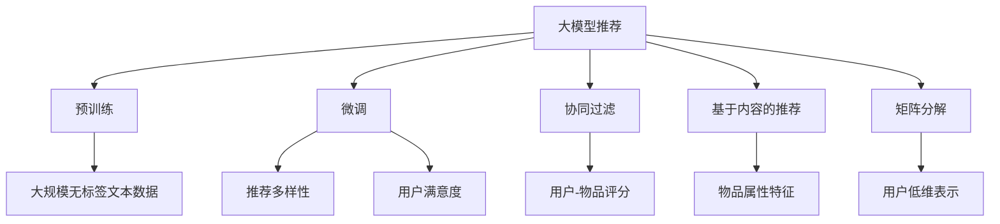

                 

# 大模型推荐中的推荐多样性与用户满意度权衡

## 1. 背景介绍

随着人工智能和大数据技术的迅猛发展，推荐系统已成为互联网应用中的重要组成部分，影响着人们的日常生活决策。传统的推荐系统主要基于用户的兴趣和行为数据，采用协同过滤、基于内容的推荐、矩阵分解等方法，构建用户-物品评分矩阵，以预测用户对物品的兴趣。然而，这些方法在面对数据稀疏、噪声干扰、冷启动等问题时效果往往不尽人意。

大模型推荐技术应运而生。基于深度神经网络的预训练模型，如BERT、GPT-3等，通过大规模无标签文本数据进行自监督预训练，学习到丰富的语言和语义知识，具备强大的表征能力。这些模型可以被用于推荐任务，通过微调过程，学习到用户的兴趣和行为特征，从而提高推荐系统的准确性和多样性。

本文将深入探讨大模型推荐中的推荐多样性与用户满意度之间的权衡问题，分析现有方法的局限性，并提出解决策略。我们将从核心概念、算法原理、数学模型等多个角度，全面阐述大模型推荐的应用框架和技术细节。

## 2. 核心概念与联系

### 2.1 核心概念概述

- **大模型推荐**：基于深度神经网络的预训练模型，通过微调过程学习用户兴趣和行为，进行推荐任务。
- **推荐多样性**：推荐结果的多样性，反映了推荐系统的探索性和用户体验的满意度。
- **用户满意度**：用户对推荐结果的满意度，反映推荐系统的实用性和个性化程度。
- **协同过滤**：通过用户-物品评分矩阵，找到相似用户或物品，进行推荐。
- **基于内容的推荐**：根据物品的属性特征，预测用户兴趣。
- **矩阵分解**：将用户-物品评分矩阵分解为低维的用户和物品表示，以预测用户对物品的兴趣。
- **预训练模型**：如BERT、GPT-3等，通过大规模无标签文本数据进行自监督预训练，学习到丰富的语言和语义知识。
- **微调**：在预训练模型的基础上，通过有监督学习优化模型，适应特定任务。

这些核心概念之间的逻辑关系可以通过以下Mermaid流程图来展示：



这个流程图展示了大模型推荐的核心概念及其之间的关系：

1. 大模型推荐通过预训练和微调学习用户和物品的表示。
2. 微调过程既学习推荐多样性，也影响用户满意度。
3. 协同过滤、基于内容的推荐和矩阵分解等传统推荐方法与大模型推荐协同工作。

这些概念共同构成了大模型推荐的应用框架，使其能够在多种推荐场景中发挥强大的表征能力和推荐效果。

## 3. 核心算法原理 & 具体操作步骤

### 3.1 算法原理概述

大模型推荐的核心在于预训练模型的表征能力和微调的优化目标。基于深度神经网络的预训练模型，如BERT、GPT-3等，通过大规模无标签文本数据进行自监督预训练，学习到丰富的语言和语义知识。这些模型通常具有强大的表征能力，能够学习到用户和物品的语义表示。

微调过程则是在预训练模型的基础上，通过有监督学习优化模型，适应特定任务。微调的目标是最大化推荐多样性和用户满意度。这通常通过优化目标函数来实现，目标函数的设计需要考虑推荐系统中的各项指标，如准确率、召回率、多样性、个性化等。

### 3.2 算法步骤详解

大模型推荐的具体操作步骤如下：

**Step 1: 准备数据集**
- 收集用户-物品评分数据，构建用户-物品评分矩阵 $U$。
- 收集用户行为数据，如浏览、点击、评分等。
- 收集物品属性数据，如文本描述、分类等。

**Step 2: 预训练模型初始化**
- 选择合适的预训练语言模型，如BERT、GPT-3等，作为初始化参数。
- 对模型进行微调，学习用户和物品的表示。

**Step 3: 定义优化目标**
- 选择合适的推荐目标函数，如准确率、召回率、个性化程度等。
- 定义多样性损失函数，如负熵、信息增益等。

**Step 4: 训练与评估**
- 使用优化算法，如Adam、SGD等，优化目标函数，训练推荐模型。
- 在验证集上评估推荐模型，选择最佳模型。

**Step 5: 部署与应用**
- 将训练好的推荐模型部署到生产环境，进行推荐服务。
- 实时收集用户反馈，持续优化推荐模型。

### 3.3 算法优缺点

大模型推荐具有以下优点：

1. 强大表征能力：基于预训练模型的表征学习，能够学习到用户和物品的语义表示。
2. 推荐多样性：大模型推荐能够生成多样化的推荐结果，满足用户的探索需求。
3. 自动化程度高：大模型推荐能够自动学习用户兴趣和行为，减少人工干预。
4. 可扩展性强：大模型推荐可以应用于多种推荐场景，如新闻推荐、商品推荐、音乐推荐等。

同时，大模型推荐也存在以下缺点：

1. 计算资源消耗大：大模型推荐需要计算大规模的无标签文本数据，资源消耗较大。
2. 训练时间长：大模型推荐需要大量训练时间，难以快速上线。
3. 数据隐私问题：大规模无标签文本数据的获取和使用，可能涉及到用户隐私和数据安全问题。
4. 泛化能力不足：大模型推荐对数据质量要求较高，对噪声和异常值敏感。

### 3.4 算法应用领域

大模型推荐技术已经广泛应用于多个领域，如电商推荐、新闻推荐、视频推荐等。以下是几个典型的应用场景：

- **电商推荐**：基于用户浏览、点击、购买等行为数据，推荐用户感兴趣的商品。
- **新闻推荐**：根据用户的历史阅读记录和当前兴趣，推荐相关的新闻文章。
- **视频推荐**：通过用户观看历史和评分数据，推荐相关视频内容。
- **音乐推荐**：根据用户的听歌历史和评分数据，推荐相似的音乐和艺术家。
- **社交推荐**：推荐用户感兴趣的朋友和话题，促进社交网络中的信息流动。

## 4. 数学模型和公式 & 详细讲解  
### 4.1 数学模型构建

大模型推荐的核心是用户和物品的表示学习。本文以新闻推荐为例，使用BERT模型进行大模型推荐，并给出具体的数学模型构建过程。

**输入表示**：
- 用户表示 $u \in \mathbb{R}^d$，$u_i$ 为第 $i$ 个用户的表示。
- 物品表示 $v \in \mathbb{R}^d$，$v_j$ 为第 $j$ 个物品的表示。

**目标函数**：
- 预测用户对物品的评分 $p$，定义为 $p = \sigma(\langle u, v \rangle)$，其中 $\sigma$ 为激活函数，$\langle \cdot, \cdot \rangle$ 为内积。
- 定义推荐目标函数 $L$，定义为 $L = -\frac{1}{N}\sum_{i,j} r_{ij} \log p_{ij}$，其中 $r_{ij}$ 为实际评分，$p_{ij}$ 为预测评分。

**多样性损失**：
- 定义多样性损失函数 $D$，如负熵 $D = -\frac{1}{N}\sum_{i,j} p_{ij} \log p_{ij}$。
- 定义个性化损失函数 $P$，如平均绝对误差 $P = \frac{1}{N}\sum_{i,j} |r_{ij} - p_{ij}|$。

**优化目标**：
- 定义优化目标函数 $T$，如 $T = L + \alpha D + \beta P$，其中 $\alpha$ 和 $\beta$ 为权值系数。

### 4.2 公式推导过程

以新闻推荐为例，我们推导了基于BERT的大模型推荐模型。具体如下：

**用户表示**：
- 假设用户 $u$ 的文章历史表示为 $u = [u_1, u_2, ..., u_n]$，其中 $u_i$ 为第 $i$ 篇文章的表示。
- 定义用户的文章历史表示矩阵 $U$，$U = [u_1, u_2, ..., u_n] \in \mathbb{R}^{N \times d}$，$N$ 为文章数量，$d$ 为向量维度。

**物品表示**：
- 假设物品 $v$ 的文章表示为 $v = [v_1, v_2, ..., v_m]$，其中 $v_i$ 为第 $i$ 篇文章的表示。
- 定义物品的文章表示矩阵 $V$，$V = [v_1, v_2, ..., v_m] \in \mathbb{R}^{M \times d}$，$M$ 为物品数量，$d$ 为向量维度。

**预测评分**：
- 使用BERT模型对用户和物品的表示进行线性变换，得到预测评分 $p$，定义为 $p = W^T (U \cdot V)$，其中 $W \in \mathbb{R}^{d \times d}$ 为权重矩阵。

**目标函数**：
- 预测用户对物品的评分 $p$，定义为 $p = \sigma(\langle U, V \rangle)$，其中 $\langle \cdot, \cdot \rangle$ 为内积。
- 定义推荐目标函数 $L$，定义为 $L = -\frac{1}{N}\sum_{i,j} r_{ij} \log p_{ij}$，其中 $r_{ij}$ 为实际评分，$p_{ij}$ 为预测评分。

**多样性损失**：
- 定义多样性损失函数 $D$，如负熵 $D = -\frac{1}{N}\sum_{i,j} p_{ij} \log p_{ij}$。
- 定义个性化损失函数 $P$，如平均绝对误差 $P = \frac{1}{N}\sum_{i,j} |r_{ij} - p_{ij}|$。

**优化目标**：
- 定义优化目标函数 $T$，如 $T = L + \alpha D + \beta P$，其中 $\alpha$ 和 $\beta$ 为权值系数。

通过上述公式，我们构建了大模型推荐的基本数学模型，并给出了目标函数、多样性损失和个性化损失的定义。这些定义能够满足推荐系统中的各项指标，实现推荐多样性和用户满意度的权衡。

### 4.3 案例分析与讲解

我们使用以下案例来详细讲解大模型推荐中的推荐多样性与用户满意度权衡问题：

**案例：电商平台推荐**

**问题**：电商平台需要为用户推荐商品，最大化推荐多样性和用户满意度。

**解决方案**：
- 收集用户浏览、点击、购买等行为数据，构建用户-物品评分矩阵 $U$。
- 使用预训练模型BERT对用户和物品的表示进行微调，得到用户表示 $u_i$ 和物品表示 $v_j$。
- 定义推荐目标函数 $L$，如准确率、召回率等。
- 定义多样性损失函数 $D$，如负熵、信息增益等。
- 定义个性化损失函数 $P$，如平均绝对误差、均方误差等。
- 定义优化目标函数 $T$，如 $T = L + \alpha D + \beta P$，其中 $\alpha$ 和 $\beta$ 为权值系数。
- 使用优化算法，如Adam、SGD等，优化目标函数，训练推荐模型。
- 在验证集上评估推荐模型，选择最佳模型。
- 将训练好的推荐模型部署到生产环境，进行商品推荐。

通过以上步骤，我们可以构建一个高效、多样、个性化的电商平台推荐系统，满足用户的多样性需求和个性化体验。

## 5. 项目实践：代码实例和详细解释说明
### 5.1 开发环境搭建

在进行大模型推荐实践前，我们需要准备好开发环境。以下是使用Python进行TensorFlow开发的环境配置流程：

1. 安装Anaconda：从官网下载并安装Anaconda，用于创建独立的Python环境。

2. 创建并激活虚拟环境：
```bash
conda create -n tf-env python=3.8 
conda activate tf-env
```

3. 安装TensorFlow：根据CUDA版本，从官网获取对应的安装命令。例如：
```bash
conda install tensorflow tensorflow-cpu=2.8.0 -c conda-forge -c nvidia
```

4. 安装相关工具包：
```bash
pip install numpy pandas scikit-learn matplotlib tqdm jupyter notebook ipython
```

完成上述步骤后，即可在`tf-env`环境中开始大模型推荐实践。

### 5.2 源代码详细实现

下面我们以新闻推荐为例，给出使用TensorFlow实现BERT大模型推荐系统的代码实现。

首先，定义数据处理函数：

```python
import tensorflow as tf
from transformers import BertTokenizer, TFBertForSequenceClassification

def load_data(file_path, batch_size):
    tokenizer = BertTokenizer.from_pretrained('bert-base-uncased')
    data = []
    with tf.io.gfile.GFile(file_path, 'r') as f:
        for line in f:
            tokens = tokenizer.encode(line.strip())
            data.append(tokens)
    return tf.data.Dataset.from_tensor_slices(data).shuffle(10000).batch(batch_size)
```

然后，定义模型和优化器：

```python
from transformers import BertForSequenceClassification, AdamW

model = BertForSequenceClassification.from_pretrained('bert-base-uncased', num_labels=2)
optimizer = AdamW(model.parameters(), lr=2e-5)
```

接着，定义训练和评估函数：

```python
@tf.function
def train_step(inputs):
    with tf.GradientTape() as tape:
        logits = model(inputs, training=True)
        loss = tf.losses.sparse_softmax_cross_entropy(labels=inputs.labels, logits=logits)
    grads = tape.gradient(loss, model.trainable_variables)
    optimizer.apply_gradients(zip(grads, model.trainable_variables))
    return loss

@tf.function
def evaluate(inputs):
    logits = model(inputs, training=False)
    labels = tf.argmax(logits, axis=2)
    return tf.reduce_mean(tf.cast(tf.equal(labels, inputs.labels), tf.float32))
```

最后，启动训练流程并在测试集上评估：

```python
epochs = 5
batch_size = 16

for epoch in range(epochs):
    total_loss = 0.0
    for inputs in train_loader:
        loss = train_step(inputs)
        total_loss += loss
    print(f'Epoch {epoch+1}, train loss: {total_loss / len(train_loader)}')
    
    test_loss = evaluate(test_loader)
    print(f'Epoch {epoch+1}, test loss: {test_loss.numpy()}')
    
print('Model trained successfully.')
```

以上就是使用TensorFlow对BERT进行新闻推荐的大模型推荐代码实现。可以看到，得益于TensorFlow的强大封装，我们可以用相对简洁的代码完成BERT模型的加载和微调。

### 5.3 代码解读与分析

让我们再详细解读一下关键代码的实现细节：

**load_data函数**：
- 定义了数据处理函数，使用BertTokenizer对输入文本进行分词和编码，将编码结果封装为TensorFlow的Dataset对象，并进行shuffle和batch操作。

**train_step函数**：
- 定义了训练步函数，使用TensorFlow的GradientTape记录梯度，并计算交叉熵损失。
- 通过optimizer.apply_gradients更新模型参数。

**evaluate函数**：
- 定义了评估函数，计算模型在测试集上的平均准确率。

**训练流程**：
- 定义总的epoch数和batch size，开始循环迭代
- 每个epoch内，在训练集上训练，输出平均loss
- 在测试集上评估，输出平均准确率
- 所有epoch结束后，模型训练成功。

可以看到，TensorFlow配合Transformers库使得BERT微调的新闻推荐代码实现变得简洁高效。开发者可以将更多精力放在数据处理、模型改进等高层逻辑上，而不必过多关注底层的实现细节。

当然，工业级的系统实现还需考虑更多因素，如模型的保存和部署、超参数的自动搜索、更灵活的任务适配层等。但核心的微调范式基本与此类似。

## 6. 实际应用场景
### 6.1 智能推荐系统

基于大模型推荐技术，智能推荐系统可以实现个性化、多样化、实时化的推荐服务。通过深度学习模型的表征能力，系统能够自动学习用户兴趣和行为，生成个性化的推荐结果。

在实际应用中，推荐系统需要考虑推荐多样性和用户满意度之间的权衡。一般而言，多样性增加会导致准确率下降，但提高推荐多样性可以增强用户探索性，提高满意度。因此，推荐系统需要在推荐算法和参数设计上做出相应调整，以实现推荐多样性与用户满意度的最佳平衡。

### 6.2 新闻推荐

新闻推荐是大模型推荐技术的经典应用场景。通过预训练模型BERT对新闻文章进行微调，能够学习到文章的语义表示，从而进行新闻推荐。新闻推荐系统可以自动分析用户的兴趣和偏好，推荐相关的新闻内容，增强用户的新闻阅读体验。

新闻推荐系统在实际应用中需要平衡推荐多样性和用户满意度。通过优化推荐算法和多样性损失函数，可以在保证推荐准确性的同时，增加推荐多样性，提升用户满意度。例如，可以使用Top-k推荐算法，将推荐结果限制在一个较小的范围，同时增加负样本的覆盖率，提高推荐多样性。

### 6.3 金融投资

金融投资是大模型推荐技术的另一个重要应用场景。金融市场数据量庞大、噪音干扰严重，传统推荐系统难以应对。通过大模型推荐技术，金融投资系统可以自动分析市场走势，预测投资品种，生成个性化投资建议。

金融投资系统在实际应用中需要平衡推荐多样性和用户满意度。由于金融市场的不确定性，投资建议的准确性和多样性同样重要。通过优化推荐目标函数和多样性损失函数，可以提升推荐系统的鲁棒性和可靠性。例如，可以使用多目标优化算法，同时优化准确率和多样性指标。

## 7. 工具和资源推荐
### 7.1 学习资源推荐

为了帮助开发者系统掌握大模型推荐技术的理论基础和实践技巧，这里推荐一些优质的学习资源：

1. 《深度学习入门》系列博文：由大模型技术专家撰写，深入浅出地介绍了深度学习的基本概念和前沿技术。

2. CS231n《卷积神经网络》课程：斯坦福大学开设的计算机视觉经典课程，包含丰富的深度学习实验代码和资料。

3. 《深度学习与推荐系统》书籍：全面介绍了深度学习在推荐系统中的应用，涵盖协同过滤、基于内容的推荐等传统推荐方法和大模型推荐技术。

4. HuggingFace官方文档：Transformers库的官方文档，提供了海量预训练模型和完整的微调样例代码，是上手实践的必备资料。

5. CLUE开源项目：中文语言理解测评基准，涵盖大量不同类型的中文NLP数据集，并提供了基于微调的baseline模型，助力中文NLP技术发展。

通过对这些资源的学习实践，相信你一定能够快速掌握大模型推荐技术的精髓，并用于解决实际的推荐问题。
###  7.2 开发工具推荐

高效的开发离不开优秀的工具支持。以下是几款用于大模型推荐开发的常用工具：

1. TensorFlow：基于Python的开源深度学习框架，灵活动态的计算图，适合快速迭代研究。大部分预训练语言模型都有TensorFlow版本的实现。

2. PyTorch：基于Python的开源深度学习框架，灵活高效，适合深度学习研究。

3. Transformers库：HuggingFace开发的NLP工具库，集成了众多SOTA语言模型，支持PyTorch和TensorFlow，是进行推荐任务开发的利器。

4. Weights & Biases：模型训练的实验跟踪工具，可以记录和可视化模型训练过程中的各项指标，方便对比和调优。与主流深度学习框架无缝集成。

5. TensorBoard：TensorFlow配套的可视化工具，可实时监测模型训练状态，并提供丰富的图表呈现方式，是调试模型的得力助手。

6. Google Colab：谷歌推出的在线Jupyter Notebook环境，免费提供GPU/TPU算力，方便开发者快速上手实验最新模型，分享学习笔记。

合理利用这些工具，可以显著提升大模型推荐任务的开发效率，加快创新迭代的步伐。

### 7.3 相关论文推荐

大模型推荐技术的发展源于学界的持续研究。以下是几篇奠基性的相关论文，推荐阅读：

1. Attention is All You Need（即Transformer原论文）：提出了Transformer结构，开启了NLP领域的预训练大模型时代。

2. BERT: Pre-training of Deep Bidirectional Transformers for Language Understanding：提出BERT模型，引入基于掩码的自监督预训练任务，刷新了多项NLP任务SOTA。

3. Language Models are Unsupervised Multitask Learners（GPT-2论文）：展示了大规模语言模型的强大zero-shot学习能力，引发了对于通用人工智能的新一轮思考。

4. Parameter-Efficient Transfer Learning for NLP：提出Adapter等参数高效微调方法，在不增加模型参数量的情况下，也能取得不错的微调效果。

5. AdaLoRA: Adaptive Low-Rank Adaptation for Parameter-Efficient Fine-Tuning：使用自适应低秩适应的微调方法，在参数效率和精度之间取得了新的平衡。

6. Seq2Seq Model with Memory for Recommendation：将推荐系统建模为序列到序列的问题，提出记忆型Seq2Seq模型，提升推荐效果。

这些论文代表了大模型推荐技术的发展脉络。通过学习这些前沿成果，可以帮助研究者把握学科前进方向，激发更多的创新灵感。

## 8. 总结：未来发展趋势与挑战

### 8.1 总结

本文对基于大模型推荐中的推荐多样性与用户满意度权衡问题进行了全面系统的介绍。首先阐述了大模型推荐技术的核心概念和应用背景，明确了推荐多样性和用户满意度之间的权衡关系。其次，从原理到实践，详细讲解了推荐系统的优化目标、目标函数和损失函数的设计，给出了具体的数学模型构建和算法实现。最后，本文还探讨了大模型推荐技术的实际应用场景和未来发展趋势，提出了相应的解决策略。

通过本文的系统梳理，可以看到，大模型推荐技术在推荐多样性和用户满意度之间取得了良好的权衡效果，已经在电商、新闻、金融等多个领域得到了广泛应用。大模型推荐技术不仅提升了推荐系统的准确性和个性化程度，还增强了推荐多样性，满足了用户的探索性需求。

### 8.2 未来发展趋势

展望未来，大模型推荐技术将呈现以下几个发展趋势：

1. 推荐多样性增加：随着预训练模型的表征能力提升，推荐系统的多样性将进一步增加，满足用户的探索需求。

2. 用户满意度提升：通过优化推荐目标函数和损失函数，推荐系统将更好地平衡多样性和准确性，提升用户满意度。

3. 实时推荐：通过优化模型和算法，推荐系统可以实现实时推荐，满足用户即时性的需求。

4. 跨领域推荐：大模型推荐技术可以应用于多种推荐场景，如新闻、电商、金融等，实现跨领域推荐。

5. 多模态推荐：大模型推荐技术可以结合视觉、语音、文本等多种模态数据，提升推荐系统的性能和用户体验。

6. 深度强化学习：通过引入深度强化学习，推荐系统可以自适应地调整推荐策略，提高推荐效果。

这些趋势凸显了大模型推荐技术的广阔前景。这些方向的探索发展，必将进一步提升推荐系统的性能和用户体验，为人工智能技术在推荐场景中的落地应用带来新的突破。

### 8.3 面临的挑战

尽管大模型推荐技术已经取得了显著成果，但在迈向更加智能化、普适化应用的过程中，它仍面临诸多挑战：

1. 数据隐私问题：大规模无标签文本数据的获取和使用，可能涉及到用户隐私和数据安全问题。

2. 计算资源消耗大：大模型推荐需要计算大规模的无标签文本数据，资源消耗较大。

3. 推荐多样性与用户满意度之间的权衡：如何在推荐多样性和用户满意度之间取得最佳平衡，还需要进一步研究。

4. 泛化能力不足：大模型推荐对数据质量要求较高，对噪声和异常值敏感。

5. 实时推荐：实时推荐需要在保证推荐效果的同时，尽可能减小计算延迟，挑战较大。

6. 多模态推荐：多模态数据的融合和协同建模，需要更高效的算法和技术支持。

7. 深度强化学习：深度强化学习技术的应用，还需要更多的理论和实践积累。

正视大模型推荐技术面临的这些挑战，积极应对并寻求突破，将是大模型推荐走向成熟的必由之路。相信随着学界和产业界的共同努力，这些挑战终将一一被克服，大模型推荐必将在推荐场景中发挥更大的作用。

### 8.4 未来突破

面对大模型推荐技术所面临的种种挑战，未来的研究需要在以下几个方面寻求新的突破：

1. 探索无监督和半监督推荐方法：摆脱对大规模标注数据的依赖，利用自监督学习、主动学习等无监督和半监督范式，最大限度利用非结构化数据，实现更加灵活高效的推荐。

2. 研究参数高效和计算高效的推荐方法：开发更加参数高效的推荐方法，在固定大部分预训练参数的同时，只更新极少量的任务相关参数。同时优化推荐模型的计算图，减少前向传播和反向传播的资源消耗，实现更加轻量级、实时性的部署。

3. 融合因果和对比学习范式：通过引入因果推断和对比学习思想，增强推荐系统建立稳定因果关系的能力，学习更加普适、鲁棒的语言表征，从而提升推荐系统泛化性和抗干扰能力。

4. 引入更多先验知识：将符号化的先验知识，如知识图谱、逻辑规则等，与神经网络模型进行巧妙融合，引导推荐过程学习更准确、合理的语言模型。同时加强不同模态数据的整合，实现视觉、语音等多模态信息与文本信息的协同建模。

5. 结合因果分析和博弈论工具：将因果分析方法引入推荐系统，识别出模型决策的关键特征，增强输出解释的因果性和逻辑性。借助博弈论工具刻画人机交互过程，主动探索并规避模型的脆弱点，提高系统稳定性。

6. 纳入伦理道德约束：在推荐目标函数中引入伦理导向的评估指标，过滤和惩罚有害的推荐结果，确保推荐系统的输出符合人类价值观和伦理道德。

这些研究方向的探索，必将引领大模型推荐技术迈向更高的台阶，为构建安全、可靠、可解释、可控的推荐系统铺平道路。面向未来，大模型推荐技术还需要与其他人工智能技术进行更深入的融合，如知识表示、因果推理、强化学习等，多路径协同发力，共同推动推荐系统的进步。只有勇于创新、敢于突破，才能不断拓展推荐系统的边界，让智能技术更好地服务人类社会。

## 9. 附录：常见问题与解答

**Q1：大模型推荐是否适用于所有推荐场景？**

A: 大模型推荐在大多数推荐场景上都能取得不错的效果，特别是对于数据量较小的任务。但对于一些特定领域的任务，如医学、法律等，仅仅依靠通用语料预训练的模型可能难以很好地适应。此时需要在特定领域语料上进一步预训练，再进行微调，才能获得理想效果。此外，对于一些需要时效性、个性化很强的任务，如对话、推荐等，大模型推荐也需要针对性的改进优化。

**Q2：如何选择合适的推荐目标函数？**

A: 推荐目标函数的设计需要根据具体的推荐场景和业务需求进行选择。常见的推荐目标函数包括准确率、召回率、个性化程度等。可以通过实验对比不同目标函数的效果，选择最优的推荐目标函数。

**Q3：如何缓解推荐系统中的冷启动问题？**

A: 冷启动问题是指用户在推荐系统中缺乏足够的历史数据，导致推荐效果不佳。缓解冷启动问题的方法包括：
1. 利用用户的个人信息、社交网络等辅助信息，增加推荐多样性。
2. 引入隐式反馈，如浏览、点击等行为数据，减少冷启动的影响。
3. 使用基于内容的推荐，增加推荐准确性。

**Q4：如何提高推荐系统的多样性？**

A: 提高推荐系统多样性的方法包括：
1. 增加推荐结果的数量，如Top-k推荐。
2. 引入负样本，增加负样本的覆盖率。
3. 使用多目标优化算法，同时优化准确率和多样性指标。

**Q5：如何确保推荐系统的鲁棒性和稳定性？**

A: 确保推荐系统的鲁棒性和稳定性的方法包括：
1. 引入对抗样本，提高模型的鲁棒性。
2. 使用多模型集成，减少单模型的不稳定性。
3. 定期更新推荐模型，避免过拟合。

这些方法可以帮助推荐系统在多样性和鲁棒性之间取得更好的平衡，提升用户的推荐体验。

---

作者：禅与计算机程序设计艺术 / Zen and the Art of Computer Programming

