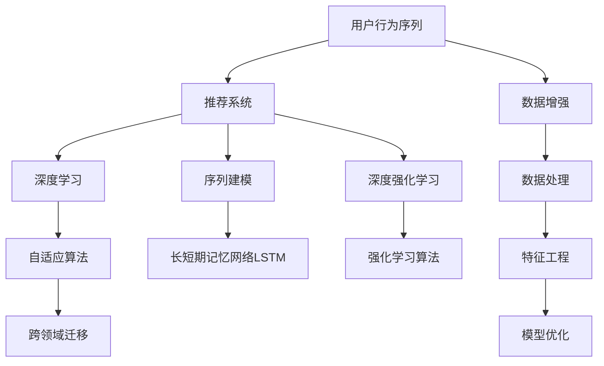

                 

# 大模型推荐中的用户行为序列建模新方法探索

> 关键词：用户行为序列, 推荐系统, 深度学习, 序列建模, 深度强化学习, 自适应算法, 跨领域迁移, 推荐模型

## 1. 背景介绍

### 1.1 问题由来

推荐系统是互联网公司及电商平台广泛使用的重要技术之一，其核心任务是根据用户的历史行为数据，预测用户对未购买/未浏览商品的兴趣，并进行个性化推荐。传统的推荐算法多基于静态的用户行为数据，难以捕捉到用户兴趣随时间演变的动态变化。近年来，序列推荐方法应运而生，成为推荐系统领域的热点研究方向之一。

### 1.2 问题核心关键点

在推荐系统中，用户的行为数据通常以时序形式呈现。以电商平台为例，用户的浏览、点击、购买行为，往往具有时间上的先后顺序，形成了一系列的行为序列。如何建模并利用这些时序特征，是实现高效推荐的关键。

传统的推荐系统多采用静态模型（如基于用户的协同过滤、基于物品的协同过滤等）或浅层序列模型（如RNN、CNN等），难以很好地处理长序列、多维度特征的推荐任务。近年来，基于深度学习的序列推荐方法逐渐兴起，特别是基于用户行为序列的深度学习推荐模型，因其能够捕捉序列中隐含的复杂关系，且泛化能力较强，被广泛应用于电商、视频、音乐、社交网络等推荐场景。

### 1.3 问题研究意义

用户行为序列建模是推荐系统研究中的一个重要方向，其研究意义如下：

1. **动态捕捉用户兴趣**：通过序列建模，推荐系统可以更准确地捕捉到用户兴趣的动态变化，提高推荐的及时性和准确性。
2. **多维度特征融合**：用户行为数据通常包含多种类型（如时间、类别、数量等），序列建模能够更好地融合这些多维度特征，提升推荐效果。
3. **泛化能力增强**：深度学习序列模型能够通过自适应学习，适应不同用户和物品的特征分布，增强模型泛化能力。
4. **优化推荐算法**：序列建模为推荐算法的设计提供了新的思路，促进了推荐系统技术的发展。

## 2. 核心概念与联系

### 2.1 核心概念概述

为更好地理解用户行为序列建模方法，本节将介绍几个密切相关的核心概念：

- **用户行为序列**：用户在不同时间点上的行为数据，如浏览记录、点击行为、购买记录等，形成一个时序序列。
- **推荐系统**：根据用户的历史行为数据，预测用户对未曝光物品的兴趣，并进行个性化推荐的技术系统。
- **深度学习**：通过多层神经网络结构，模拟人脑神经元间的连接关系，实现复杂数据的特征提取和分类。
- **序列建模**：通过序列数据建模，捕捉序列中的时间依赖关系，如RNN、LSTM等。
- **深度强化学习**：通过深度学习与强化学习的结合，在推荐系统中应用，如Q-learning、DQN等。
- **跨领域迁移**：在目标领域应用预训练模型，或迁移学习得到的模型，以提高模型泛化能力。

这些核心概念之间的逻辑关系可以通过以下Mermaid流程图来展示：



这个流程图展示了用户行为序列建模方法在推荐系统中的应用，具体而言：

1. 用户行为序列是推荐系统的输入数据。
2. 深度学习是用于捕捉用户行为序列中的复杂关系。
3. 序列建模方法（如RNN、LSTM等）是用于处理时序特征的关键技术。
4. 深度强化学习通过模拟强化学习过程，提升推荐模型的性能。
5. 自适应算法用于根据推荐系统任务特性，动态调整模型参数。
6. 长短期记忆网络LSTM是用于处理长序列的关键技术。
7. 强化学习算法如Q-learning、DQN等，用于在推荐系统中的智能决策。
8. 数据增强、数据处理、特征工程、模型优化等方法，用于提升数据质量、模型性能。
9. 跨领域迁移技术用于在不同领域、不同数据分布上应用预训练模型，提高模型泛化能力。

这些概念共同构成了推荐系统中的用户行为序列建模方法，为推荐系统提供了新的设计思路和技术手段。

## 3. 核心算法原理 & 具体操作步骤
### 3.1 算法原理概述

用户行为序列建模的核心思想是通过深度学习模型捕捉序列数据中的时间依赖关系，实现对用户行为序列的建模和预测。具体而言，对于用户行为序列 $X = \{x_1, x_2, \ldots, x_T\}$，其中 $x_t$ 表示用户在第 $t$ 时刻的行为数据，推荐系统的目标是预测用户对下一个时刻 $x_{t+1}$ 的兴趣。

推荐系统通常使用序列建模方法，如RNN、LSTM等，将用户行为序列输入到模型中，通过前向传播和反向传播算法，更新模型参数，最小化损失函数，从而优化模型的预测性能。常用的损失函数包括均方误差损失、交叉熵损失等。

### 3.2 算法步骤详解

用户行为序列建模的一般步骤包括以下几个关键步骤：

**Step 1: 准备数据和模型**

- 收集用户的历史行为数据，包括浏览记录、点击行为、购买记录等，并进行预处理（如缺失值处理、归一化等）。
- 选择合适的深度学习模型，如RNN、LSTM、GRU等，以及损失函数。

**Step 2: 数据编码**

- 将用户行为序列进行编码，得到模型的输入数据。常用的编码方法包括独热编码、词嵌入等。
- 对于长序列，还需要进行序列截断或填充，使得序列长度一致。

**Step 3: 训练模型**

- 使用训练集对模型进行前向传播和反向传播，最小化损失函数。
- 根据训练效果，调整模型参数和学习率等超参数。

**Step 4: 模型评估**

- 使用验证集对模型进行评估，如计算准确率、召回率、F1-score等指标。
- 根据评估结果，进一步优化模型参数。

**Step 5: 在线预测**

- 在线收集用户的新行为数据，输入到训练好的模型中进行预测。
- 根据模型输出，为用户推荐可能感兴趣的物品。

### 3.3 算法优缺点

用户行为序列建模方法具有以下优点：

1. 能够有效捕捉用户兴趣的动态变化，提升推荐的实时性和准确性。
2. 能够融合多维度特征，提升推荐的全面性和个性化。
3. 具有较强的泛化能力，能够适应不同用户和物品的特征分布。

同时，该方法也存在一些缺点：

1. 对数据质量要求较高，需要大量的用户行为数据。
2. 模型复杂度高，训练和推理时间较长。
3. 对超参数的选择和优化要求较高，需要一定的经验。

### 3.4 算法应用领域

用户行为序列建模方法在推荐系统中得到了广泛的应用，适用于各种类型的推荐任务，如电商推荐、视频推荐、音乐推荐、社交推荐等。这些方法在实践中也取得了显著的性能提升。

## 4. 数学模型和公式 & 详细讲解  
### 4.1 数学模型构建

以长短期记忆网络（LSTM）为例，构建用户行为序列的深度学习模型。设用户行为序列 $X = \{x_1, x_2, \ldots, x_T\}$，其中 $x_t = (i_t, c_t, o_t)$，$i_t$ 为输入门，$c_t$ 为记忆细胞，$o_t$ 为输出门。

定义LSTM模型的损失函数为：

$$
\mathcal{L} = \frac{1}{N}\sum_{t=1}^N \ell(M(x_t), y_t)
$$

其中 $\ell$ 为指定的损失函数，如均方误差损失、交叉熵损失等。

### 4.2 公式推导过程

以下我们以均方误差损失为例，推导LSTM模型的计算过程。

设用户行为序列 $X = \{x_1, x_2, \ldots, x_T\}$，其中 $x_t = (i_t, c_t, o_t)$。LSTM模型的输出为 $y_t$，其均方误差损失为：

$$
\ell(M(x_t), y_t) = \frac{1}{2}\left(y_t - M(x_t)\right)^2
$$

LSTM模型的前向传播过程如下：

1. 输入门计算：$i_t = \sigma(W_i x_{t-1} + b_i + U_i h_{t-1})$
2. 遗忘门计算：$f_t = \sigma(W_f x_{t-1} + b_f + U_f h_{t-1})$
3. 候选记忆细胞：$c'_t = tanh(W_c x_{t-1} + b_c + U_c h_{t-1})$
4. 记忆细胞更新：$c_t = f_t \odot c_{t-1} + i_t \odot c'_t$
5. 输出门计算：$o_t = \sigma(W_o x_{t-1} + b_o + U_o h_{t-1})$
6. 输出计算：$y_t = o_t \odot tanh(c_t)$

其中 $\sigma$ 为sigmoid函数，$\odot$ 为逐元素乘法。

LSTM模型的后向传播过程包括：

1. 计算损失梯度：$\frac{\partial \ell}{\partial M(x_t)} = y_t - M(x_t)$
2. 计算LSTM模型梯度：$\frac{\partial \ell}{\partial x_t} = \frac{\partial \ell}{\partial M(x_t)} \frac{\partial M(x_t)}{\partial x_t}$

通过上述前向和后向传播过程，即可得到LSTM模型的参数更新公式，如：

$$
\theta \leftarrow \theta - \eta \nabla_{\theta}\mathcal{L}
$$

其中 $\eta$ 为学习率，$\nabla_{\theta}\mathcal{L}$ 为损失函数对参数 $\theta$ 的梯度。

### 4.3 案例分析与讲解

以电商平台推荐为例，说明如何利用用户行为序列建模方法进行推荐。

设用户 $u$ 浏览过物品 $i_1, i_2, \ldots, i_t$，当前需要推荐用户 $u$ 对物品 $i_{t+1}$ 的兴趣。使用LSTM模型，将用户行为序列 $X = \{i_1, i_2, \ldots, i_t\}$ 输入到LSTM模型中，得到模型预测的兴趣度 $y_t$。

**假设**：用户对物品的兴趣度 $y_t$ 越接近于1，表示对物品 $i_{t+1}$ 的兴趣越强。

**案例分析**：假设用户 $u$ 浏览过物品 $i_1, i_2, \ldots, i_6$，使用LSTM模型对 $i_7$ 的兴趣进行预测。将用户行为序列 $X = \{i_1, i_2, \ldots, i_6\}$ 输入到LSTM模型中，得到模型预测的兴趣度 $y_7$。

根据均方误差损失的定义，LSTM模型的输出为 $y_7$，其均方误差损失为：

$$
\ell(M(x_7), y_7) = \frac{1}{2}\left(y_7 - M(x_7)\right)^2
$$

根据LSTM的前向传播和后向传播过程，可以得到模型参数的更新公式：

$$
\theta \leftarrow \theta - \eta \nabla_{\theta}\mathcal{L}
$$

通过迭代优化，最终得到用户 $u$ 对物品 $i_7$ 的兴趣度预测值 $y_7$。根据预测结果，为用户推荐最感兴趣的物品。

## 5. 项目实践：代码实例和详细解释说明
### 5.1 开发环境搭建

在进行用户行为序列建模实践前，我们需要准备好开发环境。以下是使用Python进行TensorFlow开发的环境配置流程：

1. 安装Anaconda：从官网下载并安装Anaconda，用于创建独立的Python环境。

2. 创建并激活虚拟环境：
```bash
conda create -n tf-env python=3.8 
conda activate tf-env
```

3. 安装TensorFlow：根据CUDA版本，从官网获取对应的安装命令。例如：
```bash
conda install tensorflow==2.7.0 -c tensorflow -c conda-forge
```

4. 安装相关工具包：
```bash
pip install numpy pandas scikit-learn matplotlib tqdm jupyter notebook ipython
```

完成上述步骤后，即可在`tf-env`环境中开始实践。

### 5.2 源代码详细实现

下面我们以LSTM模型为例，给出使用TensorFlow对用户行为序列进行建模的代码实现。

首先，定义LSTM模型类：

```python
import tensorflow as tf
from tensorflow.keras.layers import Input, LSTM, Dense

class LSTMRecommender(tf.keras.Model):
    def __init__(self, input_dim, hidden_dim, output_dim):
        super(LSTMRecommender, self).__init__()
        self.input_dim = input_dim
        self.hidden_dim = hidden_dim
        self.output_dim = output_dim
        self.lstm = LSTM(hidden_dim, return_sequences=True)
        self.dense = Dense(output_dim, activation='sigmoid')

    def call(self, inputs):
        x = self.lstm(inputs)
        x = self.dense(x)
        return x
```

然后，定义训练和评估函数：

```python
from tensorflow.keras.optimizers import Adam

def train_lstm(lstm_model, train_dataset, validation_dataset, epochs, batch_size, learning_rate):
    model = lstm_model(tf.keras.Input(shape=(None, input_dim)))
    model.compile(loss='mse', optimizer=Adam(learning_rate=learning_rate))
    history = model.fit(train_dataset, epochs=epochs, batch_size=batch_size, validation_data=validation_dataset)
    return model, history

def evaluate_lstm(model, test_dataset, batch_size):
    test_dataset = tf.data.Dataset.from_tensor_slices(test_dataset)
    test_dataset = test_dataset.batch(batch_size).prefetch(tf.data.AUTOTUNE)
    y_true, y_pred = [], []
    for x, y in test_dataset:
        y_true.append(y)
        y_pred.append(model.predict(x))
    y_pred = tf.concat(y_pred, axis=0)
    y_true = tf.concat(y_true, axis=0)
    mse = tf.keras.losses.MeanSquaredError()(y_true, y_pred)
    print('Mean Squared Error:', mse.numpy())
```

最后，启动LSTM模型的训练流程：

```python
input_dim = 5
hidden_dim = 10
output_dim = 1
epochs = 10
batch_size = 32
learning_rate = 0.001

# 加载数据
train_dataset = ...
validation_dataset = ...
test_dataset = ...

# 构建模型
lstm_model = LSTMRecommender(input_dim, hidden_dim, output_dim)

# 训练模型
model, history = train_lstm(lstm_model, train_dataset, validation_dataset, epochs, batch_size, learning_rate)

# 评估模型
evaluate_lstm(model, test_dataset, batch_size)
```

以上就是使用TensorFlow对用户行为序列进行建模的完整代码实现。可以看到，利用TensorFlow的高层API，可以快速搭建和训练LSTM模型，且代码简洁易懂。

### 5.3 代码解读与分析

让我们再详细解读一下关键代码的实现细节：

**LSTMRecommender类**：
- `__init__`方法：初始化LSTM模型的维度和结构。
- `call`方法：定义模型的前向传播过程。

**train_lstm函数**：
- 构建LSTM模型。
- 使用训练集对模型进行训练。
- 返回训练后的模型和训练过程中的历史指标。

**evaluate_lstm函数**：
- 使用测试集对模型进行评估。
- 计算模型在测试集上的均方误差。

**训练流程**：
- 定义输入维度、隐藏维度、输出维度等关键参数。
- 加载训练集、验证集和测试集。
- 构建LSTM推荐模型。
- 在训练集上训练模型，并记录训练历史。
- 在测试集上评估模型性能。

可以看到，TensorFlow提供了强大的API和工具，使得LSTM模型的构建和训练变得非常简单，极大提升了模型的开发效率。

当然，工业级的系统实现还需考虑更多因素，如模型的保存和部署、超参数的自动搜索、更灵活的任务适配层等。但核心的建模范式基本与此类似。

## 6. 实际应用场景
### 6.1 电商平台推荐

在电商平台推荐中，用户的行为数据通常以时序形式呈现。用户通过浏览、点击、购买等行为，表达对不同商品的兴趣。推荐系统根据用户的行为序列，预测用户对未购买物品的兴趣，并进行个性化推荐。

使用LSTM等深度学习模型，能够有效捕捉用户兴趣的动态变化，提高推荐的实时性和准确性。例如，电商平台可以使用用户的行为序列，对用户对不同物品的兴趣进行预测，并为用户推荐最感兴趣的物品。通过LSTM模型，推荐系统可以更加灵活地处理用户的个性化需求，提升用户体验。

### 6.2 视频推荐

视频推荐也是用户行为序列建模的重要应用场景之一。用户在视频平台上的观看行为，通常以序列形式呈现。推荐系统根据用户的历史观看序列，预测用户对未观看视频的兴趣，并进行个性化推荐。

使用LSTM等深度学习模型，能够有效捕捉用户兴趣的动态变化，提高推荐的实时性和准确性。例如，视频推荐系统可以使用用户的历史观看序列，对用户对不同视频的兴趣进行预测，并为用户推荐最感兴趣的视频。通过LSTM模型，推荐系统可以更加灵活地处理用户的个性化需求，提升用户的视频消费体验。

### 6.3 社交网络推荐

社交网络推荐也是用户行为序列建模的重要应用场景之一。用户在社交平台上的点赞、评论、分享等行为，通常以序列形式呈现。推荐系统根据用户的历史行为序列，预测用户对未互动内容的兴趣，并进行个性化推荐。

使用LSTM等深度学习模型，能够有效捕捉用户兴趣的动态变化，提高推荐的实时性和准确性。例如，社交网络推荐系统可以使用用户的历史互动序列，对用户对不同内容的兴趣进行预测，并为用户推荐最感兴趣的内容。通过LSTM模型，推荐系统可以更加灵活地处理用户的个性化需求，提升用户的内容消费体验。

### 6.4 未来应用展望

随着深度学习技术的发展，用户行为序列建模方法将在更多领域得到应用，为推荐系统提供新的设计思路和技术手段。

在智慧城市中，推荐系统可以根据用户的历史行为数据，预测用户的出行偏好，推荐最优的交通路径，提升出行体验。例如，智慧城市推荐系统可以使用用户的出行历史，对用户对不同交通路径的兴趣进行预测，并为用户推荐最优路径。通过用户行为序列建模方法，推荐系统可以更加灵活地处理用户的个性化需求，提升出行效率。

在金融领域，推荐系统可以根据用户的历史交易行为，预测用户对不同金融产品的兴趣，并进行个性化推荐。例如，金融推荐系统可以使用用户的历史交易序列，对用户对不同金融产品的兴趣进行预测，并为用户推荐最感兴趣的金融产品。通过用户行为序列建模方法，推荐系统可以更加灵活地处理用户的个性化需求，提升金融服务体验。

在医疗领域，推荐系统可以根据用户的健康数据，预测用户对不同医疗产品的兴趣，并进行个性化推荐。例如，医疗推荐系统可以使用用户的历史健康数据，对用户对不同医疗产品的兴趣进行预测，并为用户推荐最感兴趣的医疗产品。通过用户行为序列建模方法，推荐系统可以更加灵活地处理用户的个性化需求，提升医疗服务体验。

综上所述，用户行为序列建模方法将在更多领域得到应用，为推荐系统提供新的设计思路和技术手段，提升系统的实时性、准确性和个性化。

## 7. 工具和资源推荐
### 7.1 学习资源推荐

为了帮助开发者系统掌握用户行为序列建模的理论基础和实践技巧，这里推荐一些优质的学习资源：

1. 《深度学习》书籍：Ian Goodfellow等著，系统介绍了深度学习的基本原理和应用方法，包括序列建模等前沿话题。

2. 《序列建模与深度学习》课程：斯坦福大学开设的深度学习课程，有Lecture视频和配套作业，带你入门序列建模等深度学习技术。

3. 《推荐系统实战》书籍：吴恩达等著，系统介绍了推荐系统的前沿技术和应用实例，包括序列推荐方法等。

4. HuggingFace官方文档：HuggingFace提供的深度学习框架，包括LSTM等序列建模方法的详细文档和样例代码。

5. TensorFlow官方文档：TensorFlow提供的深度学习框架，包括LSTM等序列建模方法的详细文档和样例代码。

通过对这些资源的学习实践，相信你一定能够快速掌握用户行为序列建模的精髓，并用于解决实际的推荐问题。

### 7.2 开发工具推荐

高效的开发离不开优秀的工具支持。以下是几款用于用户行为序列建模开发的常用工具：

1. TensorFlow：由Google主导开发的开源深度学习框架，生产部署方便，适合大规模工程应用。

2. PyTorch：基于Python的开源深度学习框架，灵活动态的计算图，适合快速迭代研究。

3. Keras：基于TensorFlow和Theano等后端的高级API，提供了简单易用的深度学习模型构建接口。

4. Jupyter Notebook：支持Python和R等语言的交互式计算环境，适合数据分析和深度学习研究。

5. Scikit-learn：基于Python的机器学习库，提供了多种经典的机器学习算法和工具。

6. Weights & Biases：模型训练的实验跟踪工具，可以记录和可视化模型训练过程中的各项指标，方便对比和调优。

7. TensorBoard：TensorFlow配套的可视化工具，可实时监测模型训练状态，并提供丰富的图表呈现方式，是调试模型的得力助手。

合理利用这些工具，可以显著提升用户行为序列建模任务的开发效率，加快创新迭代的步伐。

### 7.3 相关论文推荐

用户行为序列建模是推荐系统研究中的一个重要方向，其研究意义如下：

1. 《Deep Learning》：Ian Goodfellow等著，系统介绍了深度学习的基本原理和应用方法，包括序列建模等前沿话题。

2. 《Sequence to Sequence Learning with Neural Networks》：Ian Goodfellow等著，介绍了序列到序列学习的深度学习模型，如LSTM等。

3. 《Learning Phrase Representations using RNN Encoder Decoder for Statistical Machine Translation》：Ilya Sutskever等著，介绍了使用LSTM进行机器翻译的深度学习模型。

4. 《A Neural Probabilistic Language Model》：Geoffrey Hinton等著，介绍了使用LSTM进行自然语言处理的深度学习模型。

5. 《Using Neural Network Algorithms for Machine Learning》：Geoffrey Hinton等著，介绍了使用LSTM等深度学习算法进行机器学习的方法。

这些论文代表了大模型推荐中的用户行为序列建模技术的发展脉络。通过学习这些前沿成果，可以帮助研究者把握学科前进方向，激发更多的创新灵感。

## 8. 总结：未来发展趋势与挑战

### 8.1 总结

本文对用户行为序列建模方法在推荐系统中的应用进行了全面系统的介绍。首先阐述了用户行为序列建模的研究背景和意义，明确了序列建模在推荐系统中的应用价值。其次，从原理到实践，详细讲解了用户行为序列建模的数学原理和关键步骤，给出了用户行为序列建模的完整代码实例。同时，本文还广泛探讨了用户行为序列建模方法在电商、视频、社交网络等推荐场景中的应用，展示了序列建模的巨大潜力。此外，本文精选了序列建模技术的各类学习资源，力求为读者提供全方位的技术指引。

通过本文的系统梳理，可以看到，用户行为序列建模方法在推荐系统中的应用前景广阔，其动态捕捉用户兴趣、融合多维度特征、增强泛化能力等优点，使其在推荐系统中具有重要的应用价值。未来，伴随着深度学习技术的发展和推荐系统应用的深入，用户行为序列建模方法将迎来更多的创新和突破，推动推荐系统技术的不断进步。

### 8.2 未来发展趋势

展望未来，用户行为序列建模方法将在推荐系统中呈现以下几个发展趋势：

1. **动态实时推荐**：随着时间序列数据的不断累积，推荐系统将能够更加实时地捕捉用户兴趣的变化，实现动态推荐。

2. **多模态数据融合**：推荐系统将能够融合用户的多模态数据（如行为数据、社交数据、情绪数据等），提升推荐的效果和个性化程度。

3. **跨领域迁移**：用户行为序列建模方法将在不同领域、不同数据分布上应用预训练模型，提高模型泛化能力，实现跨领域的推荐。

4. **深度强化学习**：推荐系统将结合深度强化学习技术，通过模拟强化学习过程，实现更智能化的推荐。

5. **自适应算法**：推荐系统将能够根据用户的个性化需求，动态调整推荐策略，实现更加个性化的推荐。

6. **分布式训练**：随着数据规模的不断扩大，推荐系统将需要分布式训练技术，实现大规模数据的高效处理。

以上趋势凸显了用户行为序列建模方法的广阔前景。这些方向的探索发展，必将进一步提升推荐系统的性能和应用范围，为推荐系统技术的发展带来新的突破。

### 8.3 面临的挑战

尽管用户行为序列建模方法已经取得了显著的成果，但在迈向更加智能化、普适化应用的过程中，它仍面临着诸多挑战：

1. **数据质量和量级**：推荐系统需要大量的用户行为数据，且数据质量必须较高，否则模型性能难以保证。

2. **模型复杂度**：用户行为序列建模方法涉及复杂的深度学习模型，模型参数量大，训练和推理时间长，需要高效的算法和硬件支持。

3. **模型泛化能力**：推荐系统需要在不同领域、不同用户之间实现泛化，避免过拟合。

4. **个性化需求**：推荐系统需要根据用户的个性化需求，动态调整推荐策略，实现更加个性化的推荐。

5. **模型鲁棒性**：推荐系统需要具备较强的鲁棒性，避免对数据噪声的敏感性。

6. **公平性和安全性**：推荐系统需要考虑用户的公平性、安全性问题，避免歧视性推荐和恶意攻击。

这些挑战需要研究者不断创新和优化，提升推荐系统的性能和应用效果。

### 8.4 研究展望

面对用户行为序列建模方法所面临的挑战，未来的研究需要在以下几个方面寻求新的突破：

1. **数据增强和数据处理**：通过数据增强和预处理技术，提高数据质量和量级，提升推荐系统的性能。

2. **模型优化和算法创新**：结合分布式训练、自适应算法等技术，优化模型参数，提升推荐系统的效率和效果。

3. **多模态数据融合**：通过融合多模态数据，提升推荐系统的全面性和个性化程度。

4. **跨领域迁移**：通过跨领域迁移技术，提高推荐系统的泛化能力，实现跨领域的推荐。

5. **深度强化学习**：结合深度强化学习技术，提升推荐系统的智能性和实时性。

6. **模型公平性和安全性**：通过公平性和安全性技术，提高推荐系统的公平性和安全性，避免歧视性推荐和恶意攻击。

这些研究方向的探索，必将引领用户行为序列建模方法迈向更高的台阶，为推荐系统技术的发展提供新的动力。面向未来，用户行为序列建模方法将与其他人工智能技术进行更深入的融合，共同推动推荐系统技术的进步，为推荐系统技术的发展提供新的动力。

## 9. 附录：常见问题与解答

**Q1：用户行为序列建模是否可以应用于所有推荐场景？**

A: 用户行为序列建模可以应用于大多数推荐场景，特别是需要捕捉用户兴趣动态变化的场景，如电商、视频、社交网络等。但对于一些需要低延迟、高精度的推荐场景，如实时推荐系统，可能需要采用其他方法。

**Q2：用户行为序列建模对数据质量和量级的要求是什么？**

A: 用户行为序列建模对数据质量和量级要求较高。需要大量的用户行为数据，且数据质量必须较高，否则模型性能难以保证。数据增强和预处理技术可以提升数据质量和量级，提升推荐系统的性能。

**Q3：用户行为序列建模需要哪些硬件资源？**

A: 用户行为序列建模需要较高的计算资源，特别是在训练过程中。需要高性能的GPU/TPU等硬件设备，以加速模型的训练和推理。

**Q4：用户行为序列建模是否可以应用于跨领域推荐？**

A: 用户行为序列建模可以应用于跨领域推荐，通过跨领域迁移技术，在目标领域应用预训练模型，提高模型的泛化能力。但需要考虑不同领域数据分布的差异，选择合适的迁移策略。

**Q5：用户行为序列建模是否适用于实时推荐系统？**

A: 用户行为序列建模适用于实时推荐系统，但需要优化模型的训练和推理时间，以适应实时性的需求。可以考虑采用分布式训练、自适应算法等技术，提升模型的效率和效果。

通过本文的系统梳理，可以看到，用户行为序列建模方法在推荐系统中的应用前景广阔，其动态捕捉用户兴趣、融合多维度特征、增强泛化能力等优点，使其在推荐系统中具有重要的应用价值。未来，伴随着深度学习技术的发展和推荐系统应用的深入，用户行为序列建模方法将迎来更多的创新和突破，推动推荐系统技术的不断进步。

---

作者：禅与计算机程序设计艺术 / Zen and the Art of Computer Programming

