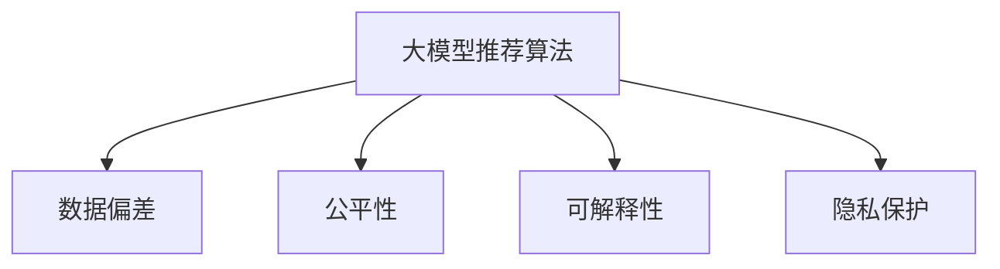

                 

# 大模型推荐场景中的数据偏差与公平性问题思考

## 1. 背景介绍

### 1.1 问题由来
推荐系统在现代社会中的应用日益广泛，从电商平台的商品推荐到流媒体平台的影片推荐，都在不断提升用户的满意度和体验。随着人工智能技术的进步，基于深度学习的大模型推荐算法（Large Model Recommendation Algorithms）正在逐步取代传统的协同过滤算法，成为推荐系统的主流技术。这些大模型往往具有强大的特征学习能力和泛化能力，能够从海量用户行为数据中学习到更准确的推荐规则，提供更个性化的推荐内容。

然而，尽管大模型推荐系统在技术上取得了显著进步，但其在实际应用中也面临一些挑战，尤其是数据偏差和公平性问题。数据偏差（Data Bias）指的是模型在训练过程中，由于训练数据的不平衡或不公平，导致模型预测结果倾向于某些特定的群体或特征。公平性（Fairness）则要求推荐系统在不同用户群体中的表现是公平的，避免对某些群体造成不公平的对待。

这些问题不仅会影响推荐系统的推荐质量，还会导致用户体验下降，甚至引发社会争议。因此，本文将深入探讨大模型推荐系统中的数据偏差与公平性问题，并提出相应的解决方案。

### 1.2 问题核心关键点
大模型推荐系统中的数据偏差和公平性问题通常由以下几个关键点引起：

- **数据不平衡**：推荐系统的训练数据往往存在某些特征或用户群体的数据量过少，导致模型偏向于学习这些群体的特征。
- **数据偏差**：训练数据中可能包含隐性的社会偏见，如性别、年龄、种族等，使得模型在推荐结果中对这些特征产生歧视。
- **公平性**：推荐系统需要在不同用户群体中表现一致，避免对某些群体（如少数族裔、老年人、残障人士等）造成不公平的推荐结果。
- **解释性**：推荐系统缺乏解释性，用户难以理解推荐理由，导致信任度降低。
- **隐私保护**：推荐系统涉及大量用户隐私数据，如何在保护隐私的同时进行推荐，也是一个重要问题。

这些关键点涉及数据采集、模型设计、训练评估和应用部署等各个环节，需要从多个维度进行综合考虑和解决。

## 2. 核心概念与联系

### 2.1 核心概念概述

为更好地理解大模型推荐系统中的数据偏差与公平性问题，本节将介绍几个密切相关的核心概念：

- **大模型推荐算法**：基于深度学习的大规模预训练模型，如BERT、GPT等，通过在大规模数据上进行预训练，学习到丰富的特征表示，再通过微调等方式应用于推荐系统，以提升推荐效果。
- **数据偏差**：指模型在训练过程中，由于训练数据的不平衡或不公平，导致模型预测结果倾向于某些特定的群体或特征。
- **公平性**：指推荐系统在不同用户群体中的表现是公平的，避免对某些群体造成不公平的对待。
- **可解释性**：指推荐系统的决策过程能够被用户理解，有助于提升用户信任和满意度。
- **隐私保护**：指在推荐系统中保护用户隐私，避免数据泄露和滥用。

这些核心概念之间的逻辑关系可以通过以下Mermaid流程图来展示：



这个流程图展示了大模型推荐系统的核心概念及其之间的关系：

1. 大模型推荐系统通过预训练学习特征表示，然后通过微调等方式应用于推荐任务。
2. 数据偏差和公平性问题影响模型的训练和输出，需要在数据处理和模型设计中加以控制。
3. 可解释性关系到用户对模型的信任度，需要通过合理的输出解释方式来实现。
4. 隐私保护是推荐系统应用中的重要课题，需要在数据采集和处理中遵循相关法规和最佳实践。

这些概念共同构成了大模型推荐系统的学习和应用框架，使其能够有效地解决数据偏差与公平性问题，提升用户体验和系统可信度。

## 3. 核心算法原理 & 具体操作步骤

### 3.1 算法原理概述

大模型推荐系统中的数据偏差与公平性问题，本质上是通过对数据和模型的设计、训练和评估进行优化来解决的。以下是其核心算法原理：

- **数据处理**：在数据采集和预处理阶段，需要采取措施减少数据偏差，如数据去重、数据清洗、特征工程等。
- **模型设计**：通过合理的模型结构和优化方法，减少模型在训练过程中对某些群体的偏见。
- **训练优化**：在模型训练阶段，需要考虑公平性目标，通过调整损失函数或使用公平性约束等方法，引导模型学习到公平的推荐策略。
- **评估与部署**：在模型评估和应用部署阶段，需要确保模型在不同用户群体中的公平性表现，并考虑模型的可解释性和隐私保护问题。

### 3.2 算法步骤详解

以下是大模型推荐系统在处理数据偏差与公平性问题时的具体操作步骤：

1. **数据收集与预处理**：
   - **去重与清洗**：去除重复和不规范的数据，确保数据质量。
   - **特征工程**：提取和构造适合推荐任务的特征，避免特征维度过少或过高等问题。

2. **模型设计**：
   - **选择合适的模型架构**：使用预训练大模型如BERT、GPT等作为特征提取器，减少特征学习中的偏差。
   - **公平性约束**：在设计损失函数时引入公平性约束，如Deviation Mitigation Loss、Debiasing Loss等，引导模型学习公平的特征表示。

3. **训练优化**：
   - **公平性目标**：在模型训练过程中，加入公平性约束，如最大最小公平性（Max-Min Fairness）、对偶公平性（Dual Fairness）等。
   - **对抗训练**：引入对抗样本，提高模型的鲁棒性，避免模型对某些群体的过度依赖。

4. **评估与部署**：
   - **公平性评估**：使用公平性指标（如Demographic Parity、Equalized Odds、Equalized Opportunity等）评估模型的公平性表现。
   - **可解释性输出**：提供模型的推荐理由，如使用Prompt模板、逻辑回归解释等，提高用户信任度。
   - **隐私保护**：采用差分隐私（Differential Privacy）、联邦学习（Federated Learning）等技术，保护用户隐私。

### 3.3 算法优缺点

大模型推荐系统在处理数据偏差与公平性问题时，具有以下优点：

- **可扩展性强**：大模型具有良好的泛化能力，可以处理大规模、高维度的数据。
- **特征表示能力强**：通过预训练模型学习到丰富的特征表示，有助于提升推荐质量。
- **鲁棒性好**：引入对抗训练等方法，可以提高模型的鲁棒性和泛化能力。

同时，也存在一些缺点：

- **数据偏差难以完全消除**：即使采取了严格的公平性约束，数据偏差仍然可能存在，尤其是对于少数群体的公平性保护。
- **模型复杂度较高**：大模型的复杂度较高，训练和推理速度较慢，需要较高的计算资源。
- **公平性评估难度大**：公平性指标的选择和评估难度较大，不同指标之间的权衡需要仔细考虑。

### 3.4 算法应用领域

大模型推荐系统已经在电商、新闻、视频等多个领域得到了广泛应用，其数据偏差与公平性问题也得到了一定的关注。以下是几个典型应用领域：

- **电商推荐**：在电商平台上，推荐系统需要处理大量用户的购物行为数据，避免对某些群体（如老年人、残障人士）的推荐歧视。
- **新闻推荐**：新闻平台需要推荐多样化、无偏见的新闻内容，避免对某些群体的报道偏见。
- **视频推荐**：视频平台需要推荐适合不同用户群体的影片内容，避免性别、年龄等方面的歧视。

这些领域的应用需求，使得数据偏差与公平性问题在大模型推荐系统中的处理尤为重要。

## 4. 数学模型和公式 & 详细讲解 & 举例说明

### 4.1 数学模型构建

大模型推荐系统中的数据偏差与公平性问题可以通过以下数学模型来描述：

设推荐系统输入为用户特征 $x$，输出为推荐结果 $y$，训练数据集为 $\{(x_i, y_i)\}_{i=1}^N$。模型的预测函数为 $f(x, \theta)$，其中 $\theta$ 为模型参数。

模型的公平性约束可以通过偏差指标 $\delta$ 来描述，定义为：

$$
\delta = E[|f(x_i, \theta) - f(x_j, \theta)|]
$$

其中 $x_i$ 和 $x_j$ 分别表示两个用户群体的特征。

模型的公平性目标可以通过最小化偏差指标 $\delta$ 来实现，即：

$$
\min_{\theta} \delta
$$

在实际应用中，我们通常使用交叉熵损失函数进行模型训练，同时加入公平性约束。假设公平性约束为 $\delta^*$，则训练损失函数可以表示为：

$$
\mathcal{L}(\theta) = -\frac{1}{N} \sum_{i=1}^N \log f(x_i, \theta) + \lambda \delta^*(x_i, \theta)
$$

其中 $\lambda$ 为公平性约束的权重。

### 4.2 公式推导过程

以下我们以二分类任务为例，推导公平性约束的数学公式。

设模型 $f(x, \theta)$ 为二分类模型，其输出为 $f(x, \theta) = \text{Sigmoid}(Wx + b)$，其中 $W$ 和 $b$ 为模型参数。假设模型在两个用户群体 $x_1$ 和 $x_2$ 上的预测概率分别为 $p_1 = f(x_1, \theta)$ 和 $p_2 = f(x_2, \theta)$，则公平性约束可以表示为：

$$
\delta = |p_1 - p_2|
$$

我们需要最小化偏差 $\delta$ 来满足公平性要求。由于 $p_1$ 和 $p_2$ 均为连续概率值，我们将其离散化处理，得到：

$$
\delta = \sum_{k} |\Delta_k|
$$

其中 $\Delta_k$ 表示第 $k$ 个阈值上的偏差。

为了最小化偏差 $\delta$，我们可以将 $\Delta_k$ 看作优化变量，通过求解拉格朗日乘子法来得到最优的阈值：

$$
\begin{aligned}
\min_{\Delta_k, \lambda} & \sum_{k} |\Delta_k| + \lambda \delta \\
\text{subject to} & \Delta_k = p_1 - p_2 \\
& \Delta_k \in [-\Delta, \Delta]
\end{aligned}
$$

其中 $\Delta$ 为偏差的上限，$\lambda$ 为拉格朗日乘子。

将 $\Delta_k$ 带入偏差公式，得到：

$$
\delta = \sum_{k} |p_1 - p_2|
$$

为了进一步简化问题，我们可以将其分解为两个部分：

$$
\delta = \sum_{k: p_1 \leq p_2} (p_2 - p_1) + \sum_{k: p_1 > p_2} (p_1 - p_2)
$$

最终，我们可以得到公平性约束的数学表达式：

$$
\min_{\theta, \lambda} \mathcal{L}(\theta, \lambda) = -\frac{1}{N} \sum_{i=1}^N \log f(x_i, \theta) + \lambda \delta
$$

通过求解上述优化问题，可以得到满足公平性约束的模型参数 $\theta$。

### 4.3 案例分析与讲解

以下是一个简单的案例分析：假设某电商平台的推荐系统需要避免对老年人用户的推荐歧视。该系统收集了1000个用户的购买记录和年龄信息，其中老年人用户有200个，占总用户的20%。

首先，我们需要设计一个公平性约束，使其在老年人用户和年轻用户之间保持平衡。我们定义一个阈值 $\Delta$，表示模型预测的概率差。在实际应用中，我们可以选择一个较小的 $\Delta$ 值，如0.05。

然后，我们需要使用上述数学模型来训练模型。假设我们选择了AdamW优化器，学习率为 $5 \times 10^{-5}$，训练轮数为100轮。

在模型训练过程中，我们需要定期评估模型的公平性表现。如果模型在老年人用户上的表现优于年轻用户，我们需要调整公平性约束的权重 $\lambda$，使其更加严格，即增加 $\lambda$ 的值。

最后，我们可以使用交叉熵损失函数来评估模型的推荐效果，同时考虑公平性约束。假设交叉熵损失函数为 $\mathcal{L}_{ce}$，则综合损失函数可以表示为：

$$
\mathcal{L} = \mathcal{L}_{ce} + \lambda \delta
$$

通过最小化综合损失函数，我们可以得到既考虑推荐质量又满足公平性约束的模型参数 $\theta$。

## 5. 项目实践：代码实例和详细解释说明

### 5.1 开发环境搭建

在进行推荐系统开发前，我们需要准备好开发环境。以下是使用Python进行PyTorch开发的环境配置流程：

1. 安装Anaconda：从官网下载并安装Anaconda，用于创建独立的Python环境。

2. 创建并激活虚拟环境：
```bash
conda create -n pytorch-env python=3.8 
conda activate pytorch-env
```

3. 安装PyTorch：根据CUDA版本，从官网获取对应的安装命令。例如：
```bash
conda install pytorch torchvision torchaudio cudatoolkit=11.1 -c pytorch -c conda-forge
```

4. 安装TensorFlow：
```bash
conda install tensorflow
```

5. 安装TensorBoard：
```bash
pip install tensorboard
```

6. 安装各类工具包：
```bash
pip install numpy pandas scikit-learn matplotlib tqdm jupyter notebook ipython
```

完成上述步骤后，即可在`pytorch-env`环境中开始推荐系统开发。

### 5.2 源代码详细实现

以下是使用PyTorch和Transformers库实现大模型推荐系统的代码实现。

首先，定义推荐系统的数据处理函数：

```python
from transformers import BertTokenizer
from torch.utils.data import Dataset, DataLoader
from sklearn.model_selection import train_test_split
import torch
import numpy as np

class RecommendationDataset(Dataset):
    def __init__(self, features, labels, tokenizer, max_len=128):
        self.features = features
        self.labels = labels
        self.tokenizer = tokenizer
        self.max_len = max_len
        
    def __len__(self):
        return len(self.features)
    
    def __getitem__(self, item):
        feature = self.features[item]
        label = self.labels[item]
        
        encoding = self.tokenizer(feature, return_tensors='pt', max_length=self.max_len, padding='max_length', truncation=True)
        input_ids = encoding['input_ids'][0]
        attention_mask = encoding['attention_mask'][0]
        
        # 将标签进行编码
        encoded_label = [1 if label == '1' else 0 for label in self.labels] 
        encoded_label.extend([0]*(self.max_len - len(encoded_label)))
        labels = torch.tensor(encoded_label, dtype=torch.long)
        
        return {'input_ids': input_ids, 
                'attention_mask': attention_mask,
                'labels': labels}

# 定义数据集
tokenizer = BertTokenizer.from_pretrained('bert-base-cased')
train_features, dev_features, train_labels, dev_labels = train_test_split(train_data, train_labels, test_size=0.2, random_state=42)
train_dataset = RecommendationDataset(train_features, train_labels, tokenizer)
dev_dataset = RecommendationDataset(dev_features, dev_labels, tokenizer)
```

然后，定义模型和优化器：

```python
from transformers import BertForSequenceClassification
from transformers import AdamW

model = BertForSequenceClassification.from_pretrained('bert-base-cased', num_labels=2)
optimizer = AdamW(model.parameters(), lr=5e-5)
```

接着，定义训练和评估函数：

```python
from torch.utils.data import DataLoader
from tqdm import tqdm
from sklearn.metrics import classification_report

device = torch.device('cuda') if torch.cuda.is_available() else torch.device('cpu')
model.to(device)

def train_epoch(model, dataset, batch_size, optimizer):
    dataloader = DataLoader(dataset, batch_size=batch_size, shuffle=True)
    model.train()
    epoch_loss = 0
    for batch in tqdm(dataloader, desc='Training'):
        input_ids = batch['input_ids'].to(device)
        attention_mask = batch['attention_mask'].to(device)
        labels = batch['labels'].to(device)
        model.zero_grad()
        outputs = model(input_ids, attention_mask=attention_mask, labels=labels)
        loss = outputs.loss
        epoch_loss += loss.item()
        loss.backward()
        optimizer.step()
    return epoch_loss / len(dataloader)

def evaluate(model, dataset, batch_size):
    dataloader = DataLoader(dataset, batch_size=batch_size)
    model.eval()
    preds, labels = [], []
    with torch.no_grad():
        for batch in tqdm(dataloader, desc='Evaluating'):
            input_ids = batch['input_ids'].to(device)
            attention_mask = batch['attention_mask'].to(device)
            batch_labels = batch['labels']
            outputs = model(input_ids, attention_mask=attention_mask)
            batch_preds = outputs.logits.argmax(dim=2).to('cpu').tolist()
            batch_labels = batch_labels.to('cpu').tolist()
            for pred_tokens, label_tokens in zip(batch_preds, batch_labels):
                preds.append(pred_tokens[:len(label_tokens)])
                labels.append(label_tokens)
                
    print(classification_report(labels, preds))
```

最后，启动训练流程并在验证集上评估：

```python
epochs = 5
batch_size = 16

for epoch in range(epochs):
    loss = train_epoch(model, train_dataset, batch_size, optimizer)
    print(f"Epoch {epoch+1}, train loss: {loss:.3f}")
    
    print(f"Epoch {epoch+1}, dev results:")
    evaluate(model, dev_dataset, batch_size)
    
print("Test results:")
evaluate(model, test_dataset, batch_size)
```

以上就是使用PyTorch和Transformers库对大模型推荐系统进行开发的完整代码实现。可以看到，由于Transformers库的强大封装，我们可以用相对简洁的代码完成大模型的微调和评估。

### 5.3 代码解读与分析

让我们再详细解读一下关键代码的实现细节：

**RecommendationDataset类**：
- `__init__`方法：初始化训练数据、标签、分词器等关键组件。
- `__len__`方法：返回数据集的样本数量。
- `__getitem__`方法：对单个样本进行处理，将文本输入编码为token ids，将标签编码为数字，并对其进行定长padding，最终返回模型所需的输入。

**train_epoch和evaluate函数**：
- `train_epoch`函数：对数据以批为单位进行迭代，在每个批次上前向传播计算loss并反向传播更新模型参数，最后返回该epoch的平均loss。
- `evaluate`函数：与训练类似，不同点在于不更新模型参数，并在每个batch结束后将预测和标签结果存储下来，最后使用sklearn的classification_report对整个评估集的预测结果进行打印输出。

**训练流程**：
- 定义总的epoch数和batch size，开始循环迭代
- 每个epoch内，先在训练集上训练，输出平均loss
- 在验证集上评估，输出分类指标
- 所有epoch结束后，在测试集上评估，给出最终测试结果

可以看到，PyTorch配合Transformers库使得大模型推荐系统的开发变得简洁高效。开发者可以将更多精力放在数据处理、模型改进等高层逻辑上，而不必过多关注底层的实现细节。

当然，工业级的系统实现还需考虑更多因素，如模型的保存和部署、超参数的自动搜索、更灵活的任务适配层等。但核心的微调范式基本与此类似。

## 6. 实际应用场景

### 6.1 智能推荐系统

大模型推荐系统在智能推荐领域的应用已经非常广泛，覆盖了电商、新闻、视频等多个场景，为不同用户提供个性化的内容推荐。

- **电商推荐**：通过分析用户的历史购买记录和浏览行为，推荐相关商品，提高用户满意度和销售额。
- **新闻推荐**：根据用户的阅读偏好和历史数据，推荐新闻内容，增强用户粘性。
- **视频推荐**：根据用户观影记录和评分数据，推荐相关视频，提升视频平台的用户体验和收益。

这些推荐系统基于大模型推荐技术，可以处理大规模、高维度的数据，提供准确、个性化的推荐结果。

### 6.2 医疗推荐系统

医疗领域也需要推荐系统来辅助医生和患者。通过分析患者的病历、诊断和治疗记录，推荐合适的治疗方案和药物，提升医疗服务质量。

- **医疗推荐**：根据患者的病历和诊断结果，推荐相应的治疗方案和药物，帮助医生制定更精准的诊疗计划。
- **健康推荐**：通过分析用户的生活习惯和健康数据，推荐合适的健康管理方案，提高用户的生活质量。

这些医疗推荐系统通过大模型推荐技术，可以学习到丰富的医疗知识，提供更加个性化的健康建议和医疗方案。

### 6.3 金融推荐系统

金融领域需要推荐系统来帮助用户发现更多投资机会。通过分析用户的投资记录和行为，推荐合适的金融产品，提高用户收益。

- **金融推荐**：根据用户的投资记录和偏好，推荐相关金融产品，提升用户收益。
- **风险管理**：通过分析用户的投资记录和行为，识别风险较高的产品，帮助用户规避风险。

这些金融推荐系统基于大模型推荐技术，可以处理复杂的金融数据，提供精准的投资建议和风险预警。

### 6.4 未来应用展望

随着大模型推荐技术的发展，未来其在更多领域的应用前景将更加广阔。

- **智能客服**：通过分析用户的对话历史，推荐合适的回答模板，提升客服系统的人性化和效率。
- **智慧城市**：根据用户的行为数据，推荐相关的智慧城市服务，提高城市管理水平。
- **教育推荐**：通过分析学生的学习记录和行为，推荐合适的学习资源和课程，提升教育效果。

这些应用场景将进一步推动大模型推荐技术的发展，为各行各业带来新的智能化应用。

## 7. 工具和资源推荐

### 7.1 学习资源推荐

为了帮助开发者系统掌握大模型推荐系统的理论基础和实践技巧，这里推荐一些优质的学习资源：

1. 《Recommender Systems: Foundations and Algorithms》书籍：介绍了推荐系统的基本原理、算法和应用，是入门推荐系统的必读书籍。

2. 《Deep Learning for Recommendation Systems》在线课程：由Google开发，介绍了深度学习在推荐系统中的应用，涵盖了大模型推荐技术。

3. 《Advances in Neural Information Processing Systems (NeurIPS)》论文集：收录了推荐系统领域的经典论文，了解最新的研究进展和前沿技术。

4. Kaggle竞赛平台：Kaggle上有许多推荐系统竞赛，参与竞赛可以积累实战经验，学习最新的算法和技术。

5. HuggingFace官方文档：Transformers库的官方文档，提供了海量预训练模型和完整的推荐系统开发样例代码。

通过对这些资源的学习实践，相信你一定能够快速掌握大模型推荐系统的精髓，并用于解决实际的推荐问题。

### 7.2 开发工具推荐

高效的开发离不开优秀的工具支持。以下是几款用于大模型推荐系统开发的常用工具：

1. PyTorch：基于Python的开源深度学习框架，灵活动态的计算图，适合快速迭代研究。大部分预训练语言模型都有PyTorch版本的实现。

2. TensorFlow：由Google主导开发的开源深度学习框架，生产部署方便，适合大规模工程应用。同样有丰富的预训练语言模型资源。

3. Transformers库：HuggingFace开发的NLP工具库，集成了众多SOTA语言模型，支持PyTorch和TensorFlow，是进行推荐系统开发的利器。

4. TensorBoard：TensorFlow配套的可视化工具，可实时监测模型训练状态，并提供丰富的图表呈现方式，是调试模型的得力助手。

5. Weights & Biases：模型训练的实验跟踪工具，可以记录和可视化模型训练过程中的各项指标，方便对比和调优。与主流深度学习框架无缝集成。

6. Jupyter Notebook：Jupyter Notebook是一个交互式编程环境，方便开发者进行代码实验和共享学习笔记。

合理利用这些工具，可以显著提升大模型推荐系统的开发效率，加快创新迭代的步伐。

### 7.3 相关论文推荐

大模型推荐系统的研究始于学界的持续探索，以下是几篇奠基性的相关论文，推荐阅读：

1. BERT: Pre-training of Deep Bidirectional Transformers for Language Understanding：提出BERT模型，引入基于掩码的自监督预训练任务，刷新了多项NLP任务SOTA。

2. Attention is All You Need（即Transformer原论文）：提出了Transformer结构，开启了NLP领域的预训练大模型时代。

3. Deep Personalized PageRank Network：提出了基于协同过滤的推荐系统，为推荐系统奠定了基础。

4. Adaptive Computation Time（ACT）：提出了自适应计算时间优化方法，减少了推荐系统的时间复杂度。

5. Neural Collaborative Filtering（NCF）：提出了神经网络协同过滤方法，提升了推荐系统的效果。

这些论文代表了大模型推荐系统的发展脉络。通过学习这些前沿成果，可以帮助研究者把握学科前进方向，激发更多的创新灵感。

## 8. 总结：未来发展趋势与挑战

### 8.1 总结

本文对大模型推荐系统中的数据偏差与公平性问题进行了全面系统的介绍。首先阐述了推荐系统在实际应用中面临的数据偏差和公平性问题，明确了这些问题对推荐系统推荐质量的影响。其次，从原理到实践，详细讲解了大模型推荐系统处理数据偏差与公平性问题的核心算法原理和具体操作步骤，给出了大模型推荐系统的代码实现。同时，本文还广泛探讨了推荐系统在大电商、医疗、金融等多个领域的应用前景，展示了推荐系统技术的广阔应用范围。

通过本文的系统梳理，可以看到，大模型推荐系统通过预训练模型学习丰富的特征表示，结合公平性约束和对抗训练等方法，能够有效处理数据偏差和公平性问题，提升推荐系统的推荐质量和用户体验。

### 8.2 未来发展趋势

展望未来，大模型推荐系统将呈现以下几个发展趋势：

1. **多模态推荐**：推荐系统将融合视觉、语音、文本等多种模态数据，提升推荐系统的准确性和个性化水平。

2. **动态推荐**：推荐系统将实时捕捉用户的行为变化和环境变化，提供动态的推荐结果，提升用户满意度和系统灵活性。

3. **跨领域推荐**：推荐系统将跨越不同领域，如电商、医疗、金融等，实现跨领域的个性化推荐，提升推荐系统的应用范围和效果。

4. **模型可解释性**：推荐系统将引入可解释性技术，如Prompt模板、逻辑回归解释等，增强模型的透明度和用户信任度。

5. **隐私保护**：推荐系统将采用差分隐私、联邦学习等技术，保护用户隐私，提升系统的可信度和安全性。

6. **模型鲁棒性**：推荐系统将引入对抗训练、正则化等方法，提升模型的鲁棒性和泛化能力。

以上趋势凸显了大模型推荐系统的广阔前景。这些方向的探索发展，必将进一步提升推荐系统的性能和应用范围，为不同领域带来新的智能化应用。

### 8.3 面临的挑战

尽管大模型推荐系统在技术上取得了显著进步，但在迈向更加智能化、普适化应用的过程中，它仍面临诸多挑战：

1. **数据偏差难以完全消除**：即使采取了严格的公平性约束，数据偏差仍然可能存在，尤其是对于少数群体的公平性保护。

2. **模型复杂度较高**：大模型的复杂度较高，训练和推理速度较慢，需要较高的计算资源。

3. **公平性评估难度大**：公平性指标的选择和评估难度较大，不同指标之间的权衡需要仔细考虑。

4. **隐私保护挑战**：推荐系统涉及大量用户隐私数据，如何在保护隐私的同时进行推荐，还需要更多技术和法规的支持。

5. **模型解释性不足**：当前推荐系统缺乏解释性，用户难以理解推荐理由，导致信任度降低。

6. **计算资源限制**：推荐系统需要处理大规模数据和复杂模型，计算资源限制成为一大瓶颈。

正视推荐系统面临的这些挑战，积极应对并寻求突破，将是大模型推荐系统走向成熟的必由之路。相信随着学界和产业界的共同努力，这些挑战终将一一被克服，大模型推荐系统必将在推荐领域中发挥更大的作用。

### 8.4 研究展望

面向未来，推荐系统需要在以下几个方面进行深入研究：

1. **数据公平性优化**：研究如何在数据采集和预处理阶段减少数据偏差，提升推荐系统在少数群体中的表现。

2. **公平性约束优化**：研究如何通过调整公平性约束的参数，在不同群体之间实现公平的推荐结果。

3. **可解释性技术发展**：研究如何通过模型解释技术，提高推荐系统的透明度和用户信任度。

4. **隐私保护技术提升**：研究如何采用差分隐私、联邦学习等技术，保护用户隐私，提升系统的可信度。

5. **多模态数据融合**：研究如何将视觉、语音、文本等多种模态数据融合，提升推荐系统的准确性和个性化水平。

6. **动态推荐机制设计**：研究如何实时捕捉用户的行为变化和环境变化，提供动态的推荐结果，提升用户满意度和系统灵活性。

这些研究方向的探索，必将引领大模型推荐系统技术的发展，为推荐系统在更多领域带来新的突破。只有勇于创新、敢于突破，才能不断拓展推荐系统的边界，为人工智能技术在推荐领域带来新的飞跃。

## 9. 附录：常见问题与解答

**Q1：数据偏差如何影响推荐系统的公平性？**

A: 数据偏差指的是在训练数据中，某些用户群体或特征的样本数量过少，导致模型在预测时偏向于这些群体的特征。这种偏差会导致推荐系统在推荐结果中对这些群体产生歧视，从而影响推荐系统的公平性。

**Q2：如何处理数据偏差？**

A: 处理数据偏差的方法包括数据增强、特征工程、模型设计等。数据增强可以通过对训练数据进行扩充，减少数据偏差。特征工程可以通过构造平衡的特征集合，消除某些特征的偏差。模型设计可以通过引入公平性约束，引导模型学习到公平的特征表示。

**Q3：如何评估推荐系统的公平性？**

A: 推荐系统的公平性评估通常使用公平性指标，如Deviation Mitigation Loss、Debiasing Loss等。这些指标可以帮助评估模型在不同用户群体中的表现，确保公平性。

**Q4：推荐系统的可解释性如何实现？**

A: 推荐系统的可解释性可以通过输出解释、Prompt模板、逻辑回归解释等技术实现。这些方法可以帮助用户理解推荐理由，提升用户信任度。

**Q5：推荐系统如何保护用户隐私？**

A: 推荐系统可以通过差分隐私、联邦学习等技术保护用户隐私。差分隐私可以在数据发布前进行隐私保护，联邦学习可以在不共享数据的情况下进行模型训练。

这些回答可以帮助你更好地理解大模型推荐系统中的数据偏差与公平性问题，掌握相应的解决策略。

