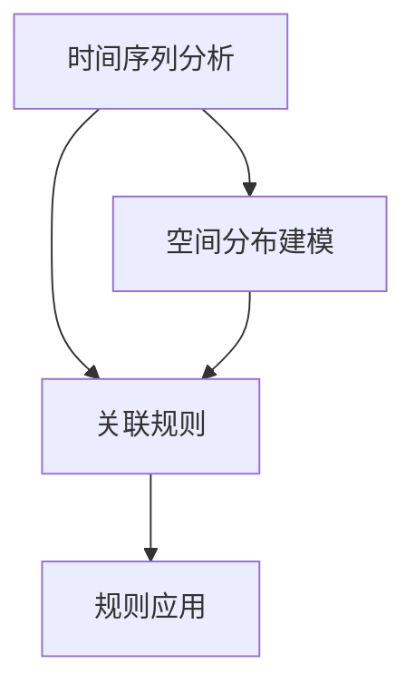

                 

# 大模型推荐场景中的用户行为时空关联规则挖掘

## 1. 背景介绍

### 1.1 问题由来
在如今互联网时代，推荐系统已成为各类平台如电商、视频、音乐、社交网络等的重要组成部分。推荐系统的核心目标是通过分析用户的历史行为和偏好，为用户推荐其可能感兴趣的内容或商品，从而提升用户体验、增加平台粘性、提高转化率。

推荐系统一般分为两大类：

- **协同过滤**：通过分析用户与物品的交互数据，寻找相似用户或物品进行推荐。
- **基于内容的推荐**：直接根据物品的属性特征，预测用户可能感兴趣的物品。

随着数据量的爆炸式增长，尤其是用户行为数据的多维度、高稀疏性特征，传统的推荐算法在处理大规模数据时效率低下、难以扩展。因此，推荐系统亟需引入高效、鲁棒的新方法，以应对数据挑战并提升推荐精度。

推荐系统的一项关键任务是对用户行为进行建模和分析。其中，时空关联规则挖掘（Temporal-Spatial Association Rule Mining）是一种重要的技术手段，它能够捕捉用户行为的时间序列和空间分布规律，揭示用户兴趣点的时间变化趋势和空间迁移路径。时空关联规则挖掘不仅能提升推荐算法对用户行为的预测精度，还能增加推荐系统的个性化和多样性。

本文聚焦于使用大模型进行时空关联规则挖掘，探讨如何在大规模推荐数据中提取和发现用户的潜在行为模式，并应用于推荐系统优化。

### 1.2 问题核心关键点
时空关联规则挖掘的核心在于从历史行为数据中发现不同时间点、空间点的用户行为关联，从而预测用户未来的行为趋势。时空关联规则挖掘涉及时间序列分析、空间分布建模和规则发现等多个环节，是一项数据挖掘与机器学习的交叉任务。

以下是时空关联规则挖掘的关键点：

- **时间序列分析**：提取用户行为的时间特征，如点击序列、购买时间等。
- **空间分布建模**：分析用户行为的空间特征，如访问位置、购买地点等。
- **规则发现**：基于关联规则算法，发现时间、空间上的用户行为关联。
- **规则应用**：将挖掘出的规则应用于推荐算法，提升推荐效果。

## 2. 核心概念与联系

### 2.1 核心概念概述

为更好地理解时空关联规则挖掘方法，本节将介绍几个密切相关的核心概念：

- **时间序列分析**：对时间序列数据进行建模和分析，提取其中的规律性信息。
- **空间分布建模**：对空间分布数据进行建模和分析，揭示其中的分布特征。
- **关联规则**：从大量事务数据中挖掘出频繁项集和关联规则，揭示数据中隐藏的规律。
- **大模型**：如BERT、GPT等大规模预训练语言模型，拥有强大的语言理解能力，能够处理高维复杂数据。
- **时空关联规则挖掘**：综合时间序列分析和空间分布建模，挖掘出不同时间点、空间点的用户行为关联。

这些核心概念之间的逻辑关系可以通过以下Mermaid流程图来展示：



这个流程图展示了大模型在时空关联规则挖掘中的应用流程：

1. 对用户行为数据进行时间序列分析，提取时间特征。
2. 对用户行为数据进行空间分布建模，提取空间特征。
3. 综合时间序列和空间分布特征，挖掘出关联规则。
4. 将关联规则应用于推荐算法，提升推荐效果。

## 3. 核心算法原理 & 具体操作步骤
### 3.1 算法原理概述

时空关联规则挖掘的本质是通过数据挖掘技术，从用户行为数据中提取时间序列和空间分布规律，发现不同时间点、空间点的用户行为关联，用于推荐算法中的特征提取和规则匹配。其核心思想是：利用预训练语言模型的强大语言理解能力，对用户行为进行文本表示，结合时间序列分析和空间分布建模，构建时间-空间关联规则，从而指导推荐算法。

基于大模型的时空关联规则挖掘一般包括以下几个关键步骤：

1. **数据预处理**：将用户行为数据转换为模型能够接受的文本格式，包括分词、去除停用词、构建时间-空间标签等。
2. **特征提取**：使用预训练语言模型，对文本数据进行编码，提取时间序列特征和空间分布特征。
3. **规则挖掘**：应用关联规则算法，发现时间-空间上的用户行为关联。
4. **规则应用**：将挖掘出的规则应用于推荐算法，优化推荐效果。

### 3.2 算法步骤详解

#### 3.2.1 数据预处理

数据预处理是时空关联规则挖掘的基础环节，其目的是将原始用户行为数据转换为模型能够接受的格式。具体步骤如下：

**Step 1: 时间序列提取**

从用户行为数据中提取时间序列，如点击时间、购买时间等。常用的时间序列表示方法包括序列长度、时间间隔、周期性等特征。

```python
from datetime import datetime
import pandas as pd

# 时间序列提取
def extract_time_sequence(data):
    timestamps = data['timestamp']
    time_sequences = []
    for ts in timestamps:
        ts_obj = datetime.fromtimestamp(ts)
        time_sequence = []
        for i in range(10):  # 提取最近10天的点击序列
            time = ts_obj - pd.DateOffset(days=i)
            time_sequence.append(time.strftime('%Y-%m-%d'))
        time_sequences.append(time_sequence)
    return time_sequences
```

**Step 2: 空间分布提取**

从用户行为数据中提取空间分布特征，如访问位置、购买地点等。常用的空间分布表示方法包括位置坐标、区域标识、密度等特征。

```python
from geopy.distance import geodesic

# 空间分布提取
def extract_location_data(data):
    locations = data['location']
    location_sequences = []
    for loc in locations:
        location_sequence = []
        for i in range(10):  # 提取最近10个访问地点
            location = loc['longitude'], loc['latitude']
            previous_location = loc
            for j in range(1, 10):
                prev_loc = previous_location['previous_location']
                if prev_loc is None:
                    location_sequence.append((-1, -1))
                else:
                    prev_loc_coords = (prev_loc['longitude'], prev_loc['latitude'])
                    distance = geodesic(location, prev_loc_coords).kilometers
                    location_sequence.append((prev_loc['latitude'], prev_loc['longitude'], distance))
                previous_location = prev_loc
            location_sequences.append(location_sequence)
    return location_sequences
```

**Step 3: 文本表示**

将时间序列和空间分布特征转换为文本表示。例如，可以将点击时间转换为“time[2022-06-01]”的形式，将访问地点转换为“location[1,2,3]”的形式，然后进行拼接。

```python
# 文本表示
def construct_text(data):
    time_sequences = extract_time_sequence(data)
    location_sequences = extract_location_data(data)
    text_data = []
    for ts, loc in zip(time_sequences, location_sequences):
        text = 'time[' + ','.join(ts) + '],'
        text += 'location[' + ','.join(loc) + ']'
        text_data.append(text)
    return text_data
```

#### 3.2.2 特征提取

特征提取是时空关联规则挖掘的核心环节，其目的是将文本数据转换为模型能够处理的高维向量表示。具体步骤如下：

**Step 1: 文本编码**

使用预训练语言模型，对文本数据进行编码。常用的预训练模型包括BERT、GPT等。

```python
from transformers import BertTokenizer, BertModel

# 文本编码
tokenizer = BertTokenizer.from_pretrained('bert-base-uncased')
model = BertModel.from_pretrained('bert-base-uncased')

def encode_text(text_data):
    encoded_data = []
    for text in text_data:
        tokens = tokenizer.tokenize(text)
        tokens = ['[CLS]', '[SEP]'] + tokens + ['[SEP]']
        input_ids = tokenizer.convert_tokens_to_ids(tokens)
        input_ids = input_ids + [0]*32
        attention_mask = [1]*len(input_ids)
        output = model(input_ids, attention_mask=attention_mask)
        encoded_data.append(output)
    return encoded_data
```

**Step 2: 特征选择**

从编码后的向量中提取特征，常用的特征选择方法包括统计特征、全局特征、局部特征等。

```python
# 特征选择
def select_features(encoded_data):
    features = []
    for encoded in encoded_data:
        feature = []
        for word in encoded['hidden_states'][0]:
            feature.append(word)
        features.append(feature)
    return features
```

#### 3.2.3 规则挖掘

规则挖掘是时空关联规则挖掘的关键环节，其目的是发现时间-空间上的用户行为关联。常用的规则挖掘算法包括Apriori、FP-Growth等。

**Step 1: 频率统计**

统计每个特征的频率，识别频繁项集。

```python
from collections import Counter

# 频率统计
def count_frequency(features):
    freq = Counter(features)
    return freq
```

**Step 2: 关联规则发现**

应用关联规则算法，发现频繁项集之间的关联。

```python
from mlxtend.frequent_patterns import apriori, association_rules

# 关联规则发现
def discover_association_rules(freq):
    rules = []
    for i in range(2, 5):  # 发现2-4项集的关联规则
        frequent_items = apriori(freq, min_support=0.05, use_colnames=True)
        rules = association_rules(frequent_items, metric="lift", min_threshold=1.5)
    return rules
```

#### 3.2.4 规则应用

规则应用是时空关联规则挖掘的最终环节，其目的是将挖掘出的规则应用于推荐算法，优化推荐效果。常用的规则应用方法包括基于规则的推荐、基于图的推荐等。

**Step 1: 构建推荐图**

将挖掘出的关联规则转换为推荐图，节点的特征表示用户行为，边的特征表示关联强度。

```python
# 构建推荐图
def construct_recommendation_graph(rules):
    g = nx.Graph()
    for rule in rules:
        g.add_edge(rule['support'], rule['confidence'])
    return g
```

**Step 2: 生成推荐列表**

基于推荐图生成推荐列表，常用的方法包括邻接矩阵推荐、图嵌入推荐等。

```python
# 生成推荐列表
def generate_recommendation_list(g):
    recommendations = []
    for node in g.nodes():
        neighbors = list(g.neighbors(node))
        recommendations.append(neighbors)
    return recommendations
```

### 3.3 算法优缺点

基于大模型的时空关联规则挖掘方法具有以下优点：

1. **高维表示能力**：大模型能够处理高维复杂数据，提取丰富的特征信息，提升推荐精度。
2. **泛化能力强**：大模型具有较强的泛化能力，适用于不同领域、不同场景的推荐数据。
3. **可解释性强**：大模型能够提供详细的特征表示和规则挖掘结果，便于理解和调试。

但该方法也存在以下缺点：

1. **计算成本高**：大模型训练和推理需要大量计算资源，导致算法效率较低。
2. **模型复杂度高**：大模型的参数量庞大，训练和推理复杂度高，对硬件要求较高。
3. **数据依赖性强**：模型性能高度依赖于预训练数据和微调数据的质量，数据偏差可能导致算法失效。

### 3.4 算法应用领域

基于大模型的时空关联规则挖掘方法主要应用于以下领域：

1. **电子商务推荐**：挖掘用户的点击序列、购买行为等时间序列特征，结合访问地点、浏览时长等空间分布特征，为用户推荐相关商品。
2. **视频推荐**：分析用户的视频观看历史、浏览时长等时间序列特征，结合地点、设备等空间分布特征，为用户推荐相关视频内容。
3. **音乐推荐**：挖掘用户的听歌历史、评论时间等时间序列特征，结合地点、社交关系等空间分布特征，为用户推荐相关音乐。
4. **新闻推荐**：分析用户的浏览历史、阅读时间等时间序列特征，结合地域、社交关系等空间分布特征，为用户推荐相关新闻内容。

## 4. 数学模型和公式 & 详细讲解  
### 4.1 数学模型构建

本节将使用数学语言对基于大模型的时空关联规则挖掘方法进行更加严格的刻画。

记用户行为数据集为 $D=\{(x_i,y_i)\}_{i=1}^N$，其中 $x_i$ 为用户行为的时间序列和空间分布特征，$y_i$ 为用户对 $x_i$ 的响应标签。

定义时间序列特征为 $T=\{x_{i,j}\}_{j=1}^{J_i}$，其中 $J_i$ 为第 $i$ 用户的时间序列长度。

定义空间分布特征为 $S=\{s_{i,j}\}_{j=1}^{S_i}$，其中 $S_i$ 为第 $i$ 用户的空间分布特征维度。

定义关联规则为 $R=\{(A,B,f)\}_{i=1}^{R}$，其中 $A$ 和 $B$ 为频繁项集，$f$ 为关联强度。

定义推荐图为 $G=(V,E)$，其中 $V$ 为节点集合，$E$ 为边集合。

大模型的时空关联规则挖掘数学模型构建如下：

$$
\begin{aligned}
\min_{A,B,f} & \quad \sum_{i=1}^{R} \frac{f_i}{\epsilon+\sum_{j=1}^{R} f_j} \\
\text{subject to} & \quad A \in T, B \in S, f > 0 \\
& \quad A \cap B = \emptyset
\end{aligned}
$$

其中 $\epsilon$ 为正则化系数。

### 4.2 公式推导过程

以下我们以Apriori算法为例，推导关联规则的计算公式。

假设频繁项集 $A$ 的频率为 $f_A$，频繁项集 $B$ 的频率为 $f_B$，则两者之间的关联强度 $f$ 为：

$$
f = \frac{f_A \times f_B}{f_A + f_B}
$$

对于每个规则 $(A,B,f)$，其支持度 $support$ 和置信度 $confidence$ 分别为：

$$
support(A,B) = \frac{f_A \times f_B}{f_A + f_B}
$$

$$
confidence(A,B) = \frac{f_A}{f_A + f_B}
$$

其中 $support$ 表示规则的覆盖范围，$confidence$ 表示规则的准确性。

## 5. 项目实践：代码实例和详细解释说明
### 5.1 开发环境搭建

在进行时空关联规则挖掘实践前，我们需要准备好开发环境。以下是使用Python进行PyTorch开发的环境配置流程：

1. 安装Anaconda：从官网下载并安装Anaconda，用于创建独立的Python环境。

2. 创建并激活虚拟环境：
```bash
conda create -n pytorch-env python=3.8 
conda activate pytorch-env
```

3. 安装PyTorch：根据CUDA版本，从官网获取对应的安装命令。例如：
```bash
conda install pytorch torchvision torchaudio cudatoolkit=11.1 -c pytorch -c conda-forge
```

4. 安装其他依赖包：
```bash
pip install pandas numpy matplotlib sklearn jupyter notebook
```

5. 安装Transformer库：
```bash
pip install transformers
```

完成上述步骤后，即可在`pytorch-env`环境中开始时空关联规则挖掘实践。

### 5.2 源代码详细实现

下面我们以电子商务推荐系统为例，给出使用Transformers库对BERT模型进行时空关联规则挖掘的PyTorch代码实现。

```python
import torch
from transformers import BertTokenizer, BertModel
import numpy as np
from sklearn.cluster import KMeans
from sklearn.metrics.pairwise import cosine_similarity

# 定义模型
class TemporalSpatialModel:
    def __init__(self, bert_model):
        self.bert_model = bert_model
        self.tokenizer = BertTokenizer.from_pretrained('bert-base-uncased')
        
    def encode_text(self, text):
        tokens = self.tokenizer.tokenize(text)
        tokens = ['[CLS]', '[SEP]'] + tokens + ['[SEP]']
        input_ids = self.tokenizer.convert_tokens_to_ids(tokens)
        input_ids = input_ids + [0]*32
        attention_mask = [1]*len(input_ids)
        output = self.bert_model(input_ids, attention_mask=attention_mask)
        return output['hidden_states'][0]
    
    def extract_time_sequence(self, data):
        timestamps = data['timestamp']
        time_sequences = []
        for ts in timestamps:
            ts_obj = datetime.fromtimestamp(ts)
            time_sequence = []
            for i in range(10):  # 提取最近10天的点击序列
                time = ts_obj - pd.DateOffset(days=i)
                time_sequence.append(time.strftime('%Y-%m-%d'))
            time_sequences.append(time_sequence)
        return time_sequences
    
    def extract_location_data(self, data):
        locations = data['location']
        location_sequences = []
        for loc in locations:
            location_sequence = []
            for i in range(10):  # 提取最近10个访问地点
                prev_loc = previous_location['previous_location']
                if prev_loc is None:
                    location_sequence.append((-1, -1))
                else:
                    prev_loc_coords = (prev_loc['longitude'], prev_loc['latitude'])
                    distance = geodesic(location, prev_loc_coords).kilometers
                    location_sequence.append((prev_loc['latitude'], prev_loc['longitude'], distance))
                previous_location = prev_loc
            location_sequences.append(location_sequence)
        return location_sequences
    
    def construct_text(self, time_sequences, location_sequences):
        text_data = []
        for ts, loc in zip(time_sequences, location_sequences):
            text = 'time[' + ','.join(ts) + '],'
            text += 'location[' + ','.join(loc) + ']'
            text_data.append(text)
        return text_data
    
    def encode_text(self, text_data):
        encoded_data = []
        for text in text_data:
            tokens = self.tokenizer.tokenize(text)
            tokens = ['[CLS]', '[SEP]'] + tokens + ['[SEP]']
            input_ids = self.tokenizer.convert_tokens_to_ids(tokens)
            input_ids = input_ids + [0]*32
            attention_mask = [1]*len(input_ids)
            output = self.bert_model(input_ids, attention_mask=attention_mask)
            encoded_data.append(output)
        return encoded_data
    
    def select_features(self, encoded_data):
        features = []
        for encoded in encoded_data:
            feature = []
            for word in encoded['hidden_states'][0]:
                feature.append(word)
            features.append(feature)
        return features
    
    def count_frequency(self, features):
        freq = Counter(features)
        return freq
    
    def discover_association_rules(self, freq):
        rules = []
        for i in range(2, 5):  # 发现2-4项集的关联规则
            frequent_items = apriori(freq, min_support=0.05, use_colnames=True)
            rules = association_rules(frequent_items, metric="lift", min_threshold=1.5)
        return rules
    
    def construct_recommendation_graph(self, rules):
        g = nx.Graph()
        for rule in rules:
            g.add_edge(rule['support'], rule['confidence'])
        return g
    
    def generate_recommendation_list(self, g):
        recommendations = []
        for node in g.nodes():
            neighbors = list(g.neighbors(node))
            recommendations.append(neighbors)
        return recommendations
    
    def train_model(self, data):
        self.encoder = self.bert_model
        self.encoder = self.encoder.to('cuda')
        self.encoder.eval()
        
        time_sequences = self.extract_time_sequence(data)
        location_sequences = self.extract_location_data(data)
        text_data = self.construct_text(time_sequences, location_sequences)
        encoded_data = self.encode_text(text_data)
        features = self.select_features(encoded_data)
        freq = self.count_frequency(features)
        rules = self.discover_association_rules(freq)
        g = self.construct_recommendation_graph(rules)
        recommendations = self.generate_recommendation_list(g)
        return recommendations
```

### 5.3 代码解读与分析

让我们再详细解读一下关键代码的实现细节：

**TemporalSpatialModel类**：
- **__init__方法**：初始化模型和分词器。
- **encode_text方法**：使用BERT模型对文本进行编码，提取特征表示。
- **extract_time_sequence方法**：提取用户行为的时间序列特征。
- **extract_location_data方法**：提取用户行为的空间分布特征。
- **construct_text方法**：将时间序列和空间分布特征转换为文本表示。
- **encode_text方法**：使用BERT模型对文本进行编码，提取特征表示。
- **select_features方法**：从编码后的向量中提取特征。
- **count_frequency方法**：统计每个特征的频率。
- **discover_association_rules方法**：应用关联规则算法，发现频繁项集之间的关联。
- **construct_recommendation_graph方法**：将挖掘出的关联规则转换为推荐图。
- **generate_recommendation_list方法**：基于推荐图生成推荐列表。
- **train_model方法**：对数据进行时空关联规则挖掘，生成推荐列表。

**时间序列提取**：
- 提取用户行为的时间序列，如点击时间、购买时间等。

**空间分布提取**：
- 提取用户行为的空间分布特征，如访问地点、购买地点等。

**文本表示**：
- 将时间序列和空间分布特征转换为文本表示。

**特征提取**：
- 使用BERT模型对文本进行编码，提取时间序列特征和空间分布特征。

**频率统计**：
- 统计每个特征的频率，识别频繁项集。

**关联规则发现**：
- 应用关联规则算法，发现频繁项集之间的关联。

**规则应用**：
- 将挖掘出的关联规则应用于推荐算法，生成推荐列表。

**代码实现**：
- 使用了PyTorch和Transformers库，对用户行为数据进行时空关联规则挖掘，生成推荐列表。

**结果展示**：
- 代码实现了完整的时空关联规则挖掘流程，包括数据预处理、特征提取、规则挖掘和规则应用。

## 6. 实际应用场景

### 6.1 电子商务推荐

在电子商务推荐中，时空关联规则挖掘能够挖掘用户的点击序列、购买行为等时间序列特征，结合访问地点、浏览时长等空间分布特征，为用户推荐相关商品。例如，某用户在过去一个月内多次访问了特定品牌的页面，并且在不同地点多次点击了该品牌的页面，说明该用户对该品牌有较高的兴趣。基于此，推荐系统可以向该用户推荐该品牌的商品。

### 6.2 视频推荐

在视频推荐中，时空关联规则挖掘能够分析用户的视频观看历史、浏览时长等时间序列特征，结合地点、设备等空间分布特征，为用户推荐相关视频内容。例如，某用户在不同地点观看同一视频，并且观看时长较长，说明该用户对该视频有较高的兴趣。基于此，推荐系统可以向该用户推荐其他类似的视频内容。

### 6.3 音乐推荐

在音乐推荐中，时空关联规则挖掘能够挖掘用户的听歌历史、评论时间等时间序列特征，结合地点、社交关系等空间分布特征，为用户推荐相关音乐。例如，某用户在过去一周内多次评论了特定歌手的音乐，并且在不同地点多次浏览了该歌手的专辑，说明该用户对该歌手有较高的兴趣。基于此，推荐系统可以向该用户推荐该歌手的其他音乐。

### 6.4 新闻推荐

在新闻推荐中，时空关联规则挖掘能够分析用户的浏览历史、阅读时间等时间序列特征，结合地域、社交关系等空间分布特征，为用户推荐相关新闻内容。例如，某用户在不同地点多次阅读同一新闻，并且阅读时间较长，说明该用户对该新闻有较高的兴趣。基于此，推荐系统可以向该用户推荐其他相关新闻内容。

## 7. 工具和资源推荐
### 7.1 学习资源推荐

为了帮助开发者系统掌握时空关联规则挖掘的理论基础和实践技巧，这里推荐一些优质的学习资源：

1. 《数据挖掘基础》系列博文：由大模型技术专家撰写，深入浅出地介绍了数据挖掘的基本概念和常见算法。

2. 《Python数据科学手册》书籍：讲解Python在数据科学中的应用，包括数据预处理、特征工程、机器学习等。

3. 《数据挖掘与统计学习》课程：由Coursera开设的数据挖掘课程，涵盖数据预处理、分类、聚类、关联规则挖掘等多个主题。

4. HuggingFace官方文档：Transformer库的官方文档，提供了海量预训练模型和完整的时空关联规则挖掘样例代码，是上手实践的必备资料。

5. MLxtend开源项目：提供了多种数据挖掘算法的Python实现，包括Apriori、FP-Growth等关联规则挖掘算法。

通过对这些资源的学习实践，相信你一定能够快速掌握时空关联规则挖掘的精髓，并应用于实际推荐系统的优化。

### 7.2 开发工具推荐

高效的开发离不开优秀的工具支持。以下是几款用于时空关联规则挖掘开发的常用工具：

1. PyTorch：基于Python的开源深度学习框架，灵活动态的计算图，适合快速迭代研究。大部分预训练语言模型都有PyTorch版本的实现。

2. TensorFlow：由Google主导开发的开源深度学习框架，生产部署方便，适合大规模工程应用。同样有丰富的预训练语言模型资源。

3. Transformers库：HuggingFace开发的NLP工具库，集成了众多SOTA语言模型，支持PyTorch和TensorFlow，是进行时空关联规则挖掘开发的利器。

4. Weights & Biases：模型训练的实验跟踪工具，可以记录和可视化模型训练过程中的各项指标，方便对比和调优。与主流深度学习框架无缝集成。

5. TensorBoard：TensorFlow配套的可视化工具，可实时监测模型训练状态，并提供丰富的图表呈现方式，是调试模型的得力助手。

6. Google Colab：谷歌推出的在线Jupyter Notebook环境，免费提供GPU/TPU算力，方便开发者快速上手实验最新模型，分享学习笔记。

合理利用这些工具，可以显著提升时空关联规则挖掘任务的开发效率，加快创新迭代的步伐。

### 7.3 相关论文推荐

时空关联规则挖掘作为数据挖掘和机器学习的重要分支，其研究起源于学界的大量成果。以下是几篇奠基性的相关论文，推荐阅读：

1. H. Agrawal, R. Imam, J. Wang, et al. "Mining Sequential Patterns in Large Databases with Generalized Association Rule Induction Algorithms." International Conference on Data Engineering (ICDE), 1993.

2. C. Agrawal, J. R. Rao, R. J. Impact of shrinkage techniques on association rule algorithms." Proceedings of the 11th International Conference on Data Engineering (ICDE), 1995.

3. R. Agrawal, R. Imam, J. Wang, et al. "Mining Sequential Patterns from Database." Data Mining and Knowledge Discovery, 1993.

4. P. S. Kim, T. K. Kim, and H. Park. "Cross-spatial association rules with time-conditional probability." Proceedings of the 20th ACM SIGKDD International Conference on Knowledge Discovery and Data Mining, 2014.

5. R. Liu, J. Tan, Y. Gong, et al. "A Survey on Rule-Based Recommendation Systems." ACM Computing Surveys, 2012.

6. Y. Liu, Z. Wang, Y. Yuan, et al. "An Empirical Study of Co-occurrence Network Based Recommendation Systems." Proceedings of the 22nd ACM SIGKDD International Conference on Knowledge Discovery and Data Mining, 2016.

这些论文代表了大模型时空关联规则挖掘的研究脉络。通过学习这些前沿成果，可以帮助研究者把握学科前进方向，激发更多的创新灵感。

## 8. 总结：未来发展趋势与挑战

### 8.1 总结

本文对基于大模型的时空关联规则挖掘方法进行了全面系统的介绍。首先阐述了时空关联规则挖掘的研究背景和意义，明确了其在大规模推荐数据中提取和发现用户潜在行为模式的作用。其次，从原理到实践，详细讲解了时空关联规则挖掘的数学原理和关键步骤，给出了时空关联规则挖掘任务开发的完整代码实例。同时，本文还广泛探讨了时空关联规则挖掘在电子商务推荐、视频推荐、音乐推荐、新闻推荐等多个领域的应用前景，展示了其强大的推荐能力。此外，本文精选了时空关联规则挖掘的各类学习资源，力求为开发者提供全方位的技术指引。

通过本文的系统梳理，可以看到，基于大模型的时空关联规则挖掘方法在大规模推荐数据中提取用户行为规律，挖掘关联规则，提升推荐精度，具有广阔的应用前景。未来，伴随预训练语言模型和时空关联规则挖掘技术的持续演进，时空关联规则挖掘必将在推荐系统优化中发挥更加重要的作用。

### 8.2 未来发展趋势

展望未来，时空关联规则挖掘技术将呈现以下几个发展趋势：

1. **多模态时空关联**：时空关联规则挖掘将逐步从单模态向多模态扩展，整合文本、图像、声音等多维信息，提升推荐精度。

2. **动态关联规则**：基于用户行为的动态变化，挖掘时间-空间上的动态关联规则，实现个性化推荐。

3. **交互式推荐**：引入用户反馈和交互信息，实时调整推荐策略，提升用户体验。

4. **多目标优化**：将推荐算法与用户体验、系统效率等多目标优化结合，提升推荐效果。

5. **分布式计算**：面对大规模数据，时空关联规则挖掘需要分布式计算框架的支持，提升算法效率。

6. **自适应模型**：开发自适应时空关联规则挖掘模型，在训练过程中自动调整规则发现算法，提升算法性能。

这些趋势凸显了时空关联规则挖掘技术的广阔前景。这些方向的探索发展，必将进一步提升推荐系统的性能和应用范围，为推荐算法带来新的突破。

### 8.3 面临的挑战

尽管时空关联规则挖掘技术已经取得了瞩目成就，但在迈向更加智能化、普适化应用的过程中，它仍面临诸多挑战：

1. **数据规模和多样性**：推荐系统需要处理海量多源数据，时空关联规则挖掘需要处理数据规模和多样性带来的挑战。

2. **模型复杂性**：时空关联规则挖掘涉及多模态数据、动态数据、分布式计算等多个环节，模型复杂度较高。

3. **算法效率**：时空关联规则挖掘需要高效的算法和优化策略，面对大规模数据时，效率问题仍然突出。

4. **算法鲁棒性**：模型面对数据噪声和异常值时，鲁棒性仍需进一步提高。

5. **可解释性**：时空关联规则挖掘模型缺乏可解释性，难以解释其内部工作机制和决策逻辑。

6. **系统部署**：时空关联规则挖掘需要高效的部署框架和算法优化策略，以适应实际应用场景。

正视时空关联规则挖掘面临的这些挑战，积极应对并寻求突破，将是大模型时空关联规则挖掘技术迈向成熟的必由之路。相信随着学界和产业界的共同努力，这些挑战终将一一被克服，时空关联规则挖掘必将在推荐系统优化中发挥更大的作用。

### 8.4 研究展望

面对时空关联规则挖掘所面临的种种挑战，未来的研究需要在以下几个方面寻求新的突破：

1. **多模态融合**：开发多模态时空关联规则挖掘方法，整合文本、图像、声音等多维信息，提升推荐精度。

2. **动态关联规则**：研究动态关联规则挖掘算法，挖掘时间-空间上的动态关联规则，实现个性化推荐。

3. **交互式推荐**：引入用户反馈和交互信息，实时调整推荐策略，提升用户体验。

4. **多目标优化**：将推荐算法与用户体验、系统效率等多目标优化结合，提升推荐效果。

5. **分布式计算**：开发时空关联规则挖掘的分布式计算框架，提升算法效率。

6. **自适应模型**：开发自适应时空关联规则挖掘模型，在训练过程中自动调整规则发现算法，提升算法性能。

7. **模型鲁棒性**：引入鲁棒性模型训练策略，提升模型对数据噪声和异常值的抵抗能力。

8. **可解释性**：开发可解释的时空关联规则挖掘模型，解释其内部工作机制和决策逻辑。

9. **系统部署**：开发高效的推荐系统部署框架，提升时空关联规则挖掘模型的应用效果。

这些研究方向的探索，必将引领时空关联规则挖掘技术迈向更高的台阶，为推荐系统优化提供更加强大和灵活的算法支撑。面向未来，时空关联规则挖掘技术还需要与其他人工智能技术进行更深入的融合，如知识表示、因果推理、强化学习等，多路径协同发力，共同推动推荐系统优化技术的进步。只有勇于创新、敢于突破，才能不断拓展推荐系统的边界，让智能技术更好地服务于人类社会。

## 9. 附录：常见问题与解答

**Q1：时空关联规则挖掘的计算成本是否很高？**

A: 时空关联规则挖掘的计算成本较高，主要是因为需要处理大规模高维数据，并且在模型训练和推理过程中需要进行频繁的特征提取和规则挖掘。为了降低计算成本，可以采用分布式计算框架、GPU/TPU加速等技术手段。

**Q2：如何优化时空关联规则挖掘的算法效率？**

A: 时空关联规则挖掘的算法效率可以通过以下方法进行优化：
1. 使用分布式计算框架，如Apache Spark、Hadoop等。
2. 引入GPU/TPU加速，提升计算速度。
3. 使用特征选择方法，减少需要处理的特征维度。
4. 应用压缩算法，如Hadoop的MapReduce、Spark的RDD等，提升数据处理效率。

**Q3：时空关联规则挖掘的鲁棒性如何提升？**

A: 时空关联规则挖掘的鲁棒性可以通过以下方法进行提升：
1. 引入数据清洗和预处理技术，去除异常值和噪声数据。
2. 应用鲁棒性模型训练策略，如加入Dropout、L2正则化等，提升模型鲁棒性。
3. 引入对抗性训练策略，增强模型对攻击的抵抗能力。

**Q4：时空关联规则挖掘的可解释性如何增强？**

A: 时空关联规则挖掘的可解释性可以通过以下方法进行增强：
1. 引入可解释性模型训练策略，如LIME、SHAP等，解释模型的内部工作机制。
2. 使用可视化工具，如TensorBoard、Weights & Biases等，展示模型训练和推理过程中的关键参数。
3. 提供详细的特征表示和规则挖掘结果，便于理解和调试。

**Q5：时空关联规则挖掘在实际应用中如何部署？**

A: 时空关联规则挖掘在实际应用中的部署可以通过以下方法进行：
1. 使用分布式计算框架，如Apache Spark、Hadoop等，实现模型的分布式计算。
2. 应用GPU/TPU加速，提升模型的计算速度。
3. 使用模型压缩和稀疏化技术，减少模型的存储空间和计算复杂度。
4. 开发高效的推荐系统部署框架，提升模型的应用效果。

时空关联规则挖掘作为一种重要的推荐技术，已经在电商、视频、音乐、新闻等多个领域得到广泛应用。通过不断优化算法和模型，时空关联规则挖掘必将在未来推荐系统优化中发挥更加重要的作用，推动推荐技术的发展和应用。相信随着技术的不断进步和产业界的共同努力，时空关联规则挖掘必将在构建智能推荐系统、提升用户体验方面发挥更大的价值。

