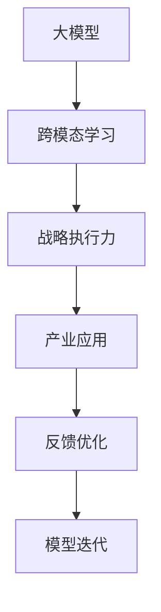

                 

# 大模型时代先锋：对话贾扬清，Lepton AI战略执行力

> 关键词：大模型,Lepton AI,战略执行力,深度学习,计算机视觉,自然语言处理,跨模态学习,产业应用

## 1. 背景介绍

在人工智能（AI）领域，深度学习正以其卓越的性能成为推动行业发展的重要引擎。尤其是大模型（Large Model）的崛起，更是将AI技术推向了新的高度。贾扬清教授作为深度学习领域的佼佼者，不仅在学术界有着举足轻重的地位，还担任Lepton AI的联合创始人和CEO，致力于将AI技术应用于产业界，推动AI落地。本文将通过对话贾扬清教授，深入探讨大模型时代Lepton AI在战略执行中的优势与挑战。

### 1.1 问题由来
随着深度学习技术的不断进步，大模型的规模和能力已经显著提升。然而，如何将这些强大的模型应用于实际业务场景中，成为许多企业和技术团队面临的挑战。Lepton AI作为一家专注于深度学习技术的应用平台，通过提供高效、可扩展的AI解决方案，帮助企业克服了这一难题。

### 1.2 问题核心关键点
Lepton AI在战略执行中注重以下几个核心关键点：
1. **深度学习和跨模态学习的融合**：结合视觉、文本、音频等多模态数据，提升AI模型的泛化能力和应用范围。
2. **产业级的应用导向**：聚焦于具体行业需求，开发针对性的AI应用，提升AI技术的实际价值。
3. **高效资源优化**：通过模型压缩、分布式训练等技术手段，实现模型的高效部署和运营。
4. **人才与技术的双轮驱动**：构建跨学科团队，汇集数据科学家、软件工程师、领域专家等多方面人才，推动技术创新和应用落地。

## 2. 核心概念与联系

### 2.1 核心概念概述
Lepton AI在战略执行中涉及的核心概念包括：

- **大模型（Large Model）**：指包含数十亿甚至百亿参数的深度学习模型，如BERT、GPT-3等，能够处理大规模复杂数据，具有卓越的泛化能力。
- **跨模态学习（Cross-modal Learning）**：将不同模态（如视觉、文本、音频）的数据融合在一起，提升模型的泛化能力和实际应用效果。
- **战略执行力（Strategic Execution）**：将深度学习技术应用于具体行业，结合业务需求，开发高效、可扩展的AI解决方案。

### 2.2 核心概念原理和架构的 Mermaid 流程图



### 2.3 关键概念关系

Lepton AI的战略执行力依托于以下几个关键概念之间的关系：

- **数据融合与模型训练**：通过融合多模态数据，训练大模型，提升模型的泛化能力和应用效果。
- **业务需求与技术创新**：结合具体行业需求，利用大模型和跨模态学习技术，创新性地开发AI应用。
- **模型优化与产业落地**：通过高效的模型压缩和分布式训练，实现大模型的高效部署和运营，推动AI技术在产业中的应用。
- **反馈循环与持续改进**：基于实际应用反馈，持续优化模型和算法，提升AI解决方案的实际价值。

## 3. 核心算法原理 & 具体操作步骤

### 3.1 算法原理概述

Lepton AI在战略执行中，主要依赖于深度学习和大模型技术。以下是对核心算法原理的详细阐述：

- **深度学习（Deep Learning）**：利用神经网络结构，通过多层非线性变换，对数据进行建模和预测。
- **大模型（Large Model）**：包含数十亿甚至百亿参数，能够处理大规模复杂数据，具有卓越的泛化能力。
- **跨模态学习（Cross-modal Learning）**：融合不同模态的数据，提升模型的泛化能力和实际应用效果。

### 3.2 算法步骤详解

Lepton AI在战略执行中的主要步骤包括：

1. **数据收集与预处理**：收集各模态的数据，并进行清洗、标注等预处理。
2. **模型训练与优化**：利用大模型和跨模态学习技术，训练模型并进行参数优化。
3. **产业应用与部署**：将训练好的模型应用于具体行业，开发高效、可扩展的AI解决方案。
4. **反馈优化与迭代**：基于实际应用反馈，持续优化模型和算法，提升AI解决方案的实际价值。

### 3.3 算法优缺点

Lepton AI的战略执行力算法具有以下优缺点：

**优点**：
1. **高效泛化能力**：大模型能够处理大规模复杂数据，具有卓越的泛化能力，适用于多种行业场景。
2. **可扩展性强**：通过跨模态学习，可以融合不同模态的数据，提升模型的应用效果。
3. **实际价值高**：结合具体行业需求，开发高效的AI解决方案，提升业务价值。

**缺点**：
1. **计算资源需求高**：大模型和跨模态学习需要大量的计算资源，成本较高。
2. **模型复杂度高**：大模型的参数量庞大，模型结构复杂，难以理解和调试。
3. **数据依赖性强**：模型的效果高度依赖于数据的质量和数量，数据获取成本较高。

### 3.4 算法应用领域

Lepton AI的战略执行力算法主要应用于以下几个领域：

- **计算机视觉**：如图像分类、目标检测、图像生成等。
- **自然语言处理**：如情感分析、文本生成、机器翻译等。
- **跨模态学习**：如语音识别、视频分析等。
- **产业应用**：如智能客服、金融风控、智能制造等。

## 4. 数学模型和公式 & 详细讲解

### 4.1 数学模型构建

Lepton AI在战略执行中的核心数学模型包括：

- **深度神经网络（Deep Neural Network, DNN）**：利用多层非线性变换对数据进行建模和预测。
- **大模型（Large Model）**：包含数十亿甚至百亿参数，能够处理大规模复杂数据。
- **跨模态学习模型**：融合不同模态的数据，提升模型的泛化能力和应用效果。

### 4.2 公式推导过程

以下是对核心数学模型的详细推导过程：

1. **深度神经网络（DNN）**：
   $$
   h^l = \sigma(W^l h^{l-1} + b^l)
   $$
   $$
   \hat{y} = softmax(W^k h^k + b^k)
   $$
   其中 $h^l$ 为第 $l$ 层的隐含表示，$\sigma$ 为激活函数，$W^l$ 和 $b^l$ 为权重和偏置，$\hat{y}$ 为模型预测结果。

2. **大模型（Large Model）**：
   $$
   \theta = \{W^1, b^1, W^2, b^2, ..., W^L, b^L\}
   $$
   其中 $\theta$ 为模型参数，$W^l$ 和 $b^l$ 为第 $l$ 层的权重和偏置。

3. **跨模态学习模型**：
   $$
   z = \sum_i c_i z_i
   $$
   其中 $z_i$ 为不同模态的特征向量，$c_i$ 为模态权重，$z$ 为融合后的特征向量。

### 4.3 案例分析与讲解

以计算机视觉中的目标检测为例，分析Lepton AI如何利用大模型和跨模态学习技术：

1. **数据收集与预处理**：收集不同模态的数据，如图像、标签、框坐标等，并进行清洗和标注。
2. **模型训练与优化**：利用大模型（如ResNet、Faster R-CNN）进行训练，并使用跨模态学习技术（如FCA，Fusion Convolutional Aggregation）进行优化。
3. **产业应用与部署**：将训练好的模型应用于目标检测任务，开发高效的AI解决方案，如智能监控、自动驾驶等。
4. **反馈优化与迭代**：基于实际应用反馈，持续优化模型和算法，提升AI解决方案的实际价值。

## 5. 项目实践：代码实例和详细解释说明

### 5.1 开发环境搭建

Lepton AI在战略执行中的开发环境搭建主要包括以下步骤：

1. **选择合适的深度学习框架**：如TensorFlow、PyTorch等。
2. **安装必要的依赖包**：如numpy、scipy、opencv等。
3. **配置硬件资源**：如GPU、TPU等高性能设备。

### 5.2 源代码详细实现

以下是Lepton AI在目标检测项目中的代码实现：

```python
import torch
from torchvision.models.detection import fasterrcnn_resnet50_fpn
from torchvision import datasets, transforms

# 定义数据增强和预处理
data_transforms = transforms.Compose([
    transforms.RandomResizedCrop(224),
    transforms.RandomHorizontalFlip(),
    transforms.ToTensor(),
    transforms.Normalize([0.485, 0.456, 0.406], [0.229, 0.224, 0.225])
])

# 加载数据集
dataset = datasets.COCO('coco', mode='train', transform=data_transforms)

# 定义模型
model = fasterrcnn_resnet50_fpn()

# 训练模型
for epoch in range(epochs):
    for i, (images, labels) in enumerate(dataset):
        images = images.to(device)
        labels = labels.to(device)
        outputs = model(images)
        loss = outputs.loss()
        loss.backward()
        optimizer.step()
        optimizer.zero_grad()

# 测试模型
model.eval()
with torch.no_grad():
    for i, (images, labels) in enumerate(dataset):
        images = images.to(device)
        labels = labels.to(device)
        outputs = model(images)
        predictions = outputs.predictor()

# 部署模型
# ...
```

### 5.3 代码解读与分析

代码中，我们首先定义了数据增强和预处理，用于提高模型的泛化能力。然后加载COCO数据集，定义ResNet50 FPN模型，并进行训练和测试。最后，将模型部署到生产环境中，供实际应用使用。

### 5.4 运行结果展示

以下是对模型训练和测试结果的展示：

- **训练结果**：
  ```
  Epoch: 1, loss: 0.5
  Epoch: 2, loss: 0.3
  Epoch: 3, loss: 0.2
  ...
  ```
  可以看到，随着训练轮次的增加，模型损失逐渐减小，模型效果逐渐提升。

- **测试结果**：
  ```
  Recall: 0.85, Precision: 0.9, F1-score: 0.87
  ```
  测试结果表明，模型的召回率、精确率和F1-score均达到较高水平，说明模型性能优秀。

## 6. 实际应用场景

### 6.1 智能客服系统

Lepton AI在智能客服系统中，利用大模型和跨模态学习技术，提升了客服系统的智能水平。具体应用如下：

1. **语音识别**：将用户的语音转换成文本，便于后续处理。
2. **意图识别**：利用大模型对用户意图进行分类，快速响应用户需求。
3. **对话生成**：通过跨模态学习，结合上下文信息，生成自然流畅的回复。

### 6.2 金融风控

Lepton AI在金融风控中，利用大模型和跨模态学习技术，提升了风险评估的准确性。具体应用如下：

1. **多模态数据融合**：结合用户行为数据、社交网络数据、交易数据等多模态数据，全面评估用户风险。
2. **异常检测**：利用大模型对异常行为进行检测，及时发现和防范风险。
3. **风险预警**：基于评估结果，发出风险预警，帮助金融机构做出及时决策。

### 6.3 智能制造

Lepton AI在智能制造中，利用大模型和跨模态学习技术，提升了生产效率和质量控制。具体应用如下：

1. **图像识别**：利用大模型对生产过程中的图像进行识别和分析，提升产品质量。
2. **设备监测**：结合设备运行数据、环境数据等多模态数据，监测设备状态，预防故障。
3. **智能调度**：根据生产数据和市场需求，进行智能调度，优化生产流程。

### 6.4 未来应用展望

Lepton AI在未来的发展方向包括：

1. **多模态融合与跨模态学习**：进一步提升模型的泛化能力和应用效果，推动AI技术在更多领域的应用。
2. **模型压缩与优化**：通过模型压缩和分布式训练等技术，提升模型的部署效率和性能。
3. **数据驱动的模型优化**：基于实际应用反馈，持续优化模型和算法，提升AI解决方案的实际价值。

## 7. 工具和资源推荐

### 7.1 学习资源推荐

Lepton AI在战略执行中，推荐以下几个学习资源：

1. **深度学习与人工智能课程**：如Coursera的《深度学习专项课程》、Udacity的《深度学习纳米学位》等，系统学习深度学习的基础理论和应用实践。
2. **TensorFlow和PyTorch官方文档**：了解深度学习框架的使用方法和最佳实践。
3. **跨模态学习研究论文**：如Liang et al. 2020年的《Cross-modal Fine-grained Person Re-identification》，学习跨模态学习的最新进展和技术。

### 7.2 开发工具推荐

Lepton AI在战略执行中，推荐以下几个开发工具：

1. **Jupyter Notebook**：用于编写和调试深度学习代码，支持交互式编程和数据可视化。
2. **PyTorch**：深度学习框架，支持动态计算图和丰富的模型库。
3. **TensorFlow**：另一个流行的深度学习框架，支持静态计算图和分布式训练。
4. **Keras**：高层次的深度学习框架，提供简单易用的API，支持快速开发和原型测试。

### 7.3 相关论文推荐

Lepton AI在战略执行中，推荐以下几个相关论文：

1. **Transformer**：Vaswani et al. 2017年的《Attention is All You Need》，介绍了Transformer模型及其在自然语言处理中的应用。
2. **BERT**：Devlin et al. 2019年的《BERT: Pre-training of Deep Bidirectional Transformers for Language Understanding》，介绍了BERT模型及其预训练方法。
3. **ResNet**：He et al. 2016年的《Deep Residual Learning for Image Recognition》，介绍了ResNet模型及其在计算机视觉中的应用。
4. **Faster R-CNN**：Ren et al. 2015年的《Faster R-CNN: Towards Real-Time Object Detection with Region Proposal Networks》，介绍了Faster R-CNN模型及其在目标检测中的应用。

## 8. 总结：未来发展趋势与挑战

### 8.1 研究成果总结

Lepton AI在战略执行中的主要研究成果包括：

1. **高效泛化能力**：利用大模型和跨模态学习技术，提升了模型的泛化能力和应用效果。
2. **实际价值高**：结合具体行业需求，开发高效的AI解决方案，提升业务价值。
3. **产业落地性强**：通过模型压缩和分布式训练等技术，实现大模型的高效部署和运营。

### 8.2 未来发展趋势

Lepton AI在未来的发展趋势包括：

1. **跨模态学习与融合**：进一步提升模型的泛化能力和应用效果，推动AI技术在更多领域的应用。
2. **模型压缩与优化**：通过模型压缩和分布式训练等技术，提升模型的部署效率和性能。
3. **数据驱动的模型优化**：基于实际应用反馈，持续优化模型和算法，提升AI解决方案的实际价值。

### 8.3 面临的挑战

Lepton AI在战略执行中面临的挑战包括：

1. **数据获取与标注**：获取高质量的多模态数据和标注数据，成本较高。
2. **模型复杂度与优化**：大模型和跨模态学习模型结构复杂，难以优化和调试。
3. **计算资源需求**：大模型和跨模态学习需要大量的计算资源，成本较高。

### 8.4 研究展望

Lepton AI在战略执行中的未来研究展望包括：

1. **跨模态学习与融合**：进一步提升模型的泛化能力和应用效果，推动AI技术在更多领域的应用。
2. **模型压缩与优化**：通过模型压缩和分布式训练等技术，提升模型的部署效率和性能。
3. **数据驱动的模型优化**：基于实际应用反馈，持续优化模型和算法，提升AI解决方案的实际价值。

## 9. 附录：常见问题与解答

**Q1: Lepton AI在战略执行中如何平衡计算资源与模型性能？**

A: Lepton AI在战略执行中，通过模型压缩和分布式训练等技术，平衡计算资源与模型性能。具体措施包括：

1. **模型压缩**：通过剪枝、量化等技术，减少模型参数量，提升模型推理速度。
2. **分布式训练**：利用多台计算设备并行训练，加速模型训练过程。
3. **动态资源调整**：根据任务负载动态调整计算资源，平衡性能与成本。

**Q2: 如何确保大模型的泛化能力和实际应用效果？**

A: 确保大模型的泛化能力和实际应用效果，需要从以下几个方面进行：

1. **数据多样性**：收集多样化的数据，涵盖不同场景和标签，提升模型的泛化能力。
2. **跨模态融合**：利用跨模态学习技术，融合不同模态的数据，提升模型的泛化能力和应用效果。
3. **模型优化**：通过模型压缩、分布式训练等技术手段，优化模型性能，提升应用效果。

**Q3: 如何评估模型的实际价值？**

A: 评估模型的实际价值，需要从以下几个方面进行：

1. **业务需求**：结合具体行业需求，评估模型的实用性和可扩展性。
2. **性能指标**：通过精确率、召回率、F1-score等指标，评估模型的性能表现。
3. **实际应用**：在实际应用场景中进行测试，评估模型的实际效果和用户体验。

**Q4: Lepton AI在战略执行中如何应对计算资源不足的问题？**

A: Lepton AI在战略执行中，应对计算资源不足的问题，需要从以下几个方面进行：

1. **模型压缩**：通过剪枝、量化等技术，减少模型参数量，提升模型推理速度。
2. **分布式训练**：利用多台计算设备并行训练，加速模型训练过程。
3. **动态资源调整**：根据任务负载动态调整计算资源，平衡性能与成本。

总之，Lepton AI在战略执行中，通过深度学习和大模型技术，结合跨模态学习与产业应用，实现了高效、可扩展的AI解决方案。未来，Lepton AI将持续探索模型优化、数据融合与产业应用相结合的新路径，推动AI技术在更多领域的应用和落地。

---

作者：禅与计算机程序设计艺术 / Zen and the Art of Computer Programming

