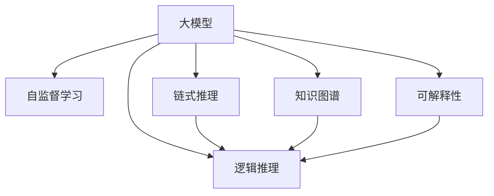

                 

# 大模型的思维链推理(COT)能力

> 关键词：大模型,思维链推理,逻辑推理,链式推理,自监督学习,深度学习

## 1. 背景介绍

### 1.1 问题由来

随着深度学习技术的发展，大模型如BERT、GPT等在自然语言处理(NLP)领域取得了显著进展。这些大模型通常使用大量无标签数据进行自监督预训练，能够捕获丰富的语言知识。然而，这些知识多为静态统计特征，缺乏对特定情境和推理过程的建模能力。近年来，研究者提出了基于自监督学习、逻辑推理等技术，使得大模型具备了思维链推理(Cognitive Chain-of-Thought, COT)能力。

### 1.2 问题核心关键点

大模型的思维链推理能力，是指模型能够模拟人类的推理过程，基于已有知识推导出新的结论。具体包括：

- 链式推理(Chain-of-Thought, COT)：指模型能够对多个推理步骤进行编码，逐个推理出结论的过程。
- 逻辑推理(Logical Reasoning)：指模型能够遵循逻辑规则进行推理，如三段论、因果关系等。
- 知识图谱(Knowledge Graph)：指模型能够构建和利用知识图谱中的知识关系，进行多模态推理。
- 可解释性(Explainability)：指模型能够解释其推理过程，使得用户可以理解其决策逻辑。

这些能力对于构建高水平的自然语言理解系统至关重要，能够帮助模型在复杂情境下做出合理的推断。例如，在问答系统、法律咨询、医疗诊断等任务中，思维链推理能力能够显著提升系统的准确性和可解释性。

### 1.3 问题研究意义

研究大模型的思维链推理能力，对于提升NLP技术的高阶应用，解决复杂推理任务，具有重要意义：

1. 提升推理准确性。思维链推理能力使得模型能够更加准确地理解问题，并依据知识库推理出正确答案。
2. 增强系统可解释性。推理过程的可视化、可解释性使得系统更加透明，增强用户信任。
3. 优化决策机制。思维链推理能够帮助系统从多角度、多模态数据中提取知识，构建更全面的决策机制。
4. 加速模型训练。利用思维链推理的逻辑结构，可以设计更有效的自监督学习目标，加快模型训练。
5. 拓展应用场景。思维链推理能够提升模型在复杂任务中的性能，推动NLP技术在更多领域落地应用。

## 2. 核心概念与联系

### 2.1 核心概念概述

为更好地理解大模型的思维链推理能力，本节将介绍几个关键概念：

- 大模型(Large Models)：以BERT、GPT等深度学习模型为代表的规模庞大的神经网络模型，具有强大的语言建模能力。
- 自监督学习(Self-Supervised Learning)：指使用无标签数据进行模型训练，通过设计预训练任务（如掩码语言模型、对比学习等）学习语言表示。
- 链式推理(Chain-of-Thought, COT)：指模型对推理链条进行编码，逐步推理出结论的过程。
- 逻辑推理(Logical Reasoning)：指模型依据逻辑规则进行推理，如三段论、因果关系等。
- 知识图谱(Knowledge Graph)：指包含实体、属性、关系等结构化知识的图形表示，用于增强模型的知识推理能力。
- 可解释性(Explainability)：指模型输出的推理过程可以被用户理解，包括推理路径、依赖关系等。

这些核心概念共同构成大模型的思维链推理能力框架，其逻辑关系可以通过以下Mermaid流程图展示：



该流程图展示了大模型思维链推理能力的各个组成部分及其联系：

1. 大模型通过自监督学习获得基础的语言表示。
2. 链式推理能力使得模型能够对多个推理步骤进行编码。
3. 逻辑推理能力使得模型能够遵循逻辑规则进行推理。
4. 知识图谱能力使模型能够利用结构化知识进行多模态推理。
5. 可解释性能力使得模型的推理过程可以被理解。

这些能力共同支撑了大模型在复杂情境下的推理能力，提升其在各个领域的智能表现。

## 3. 核心算法原理 & 具体操作步骤
### 3.1 算法原理概述

大模型的思维链推理能力，主要基于自监督学习、逻辑推理和知识图谱技术，通过训练模型逐步推理出结论。其核心思想是：

1. **自监督学习**：使用大规模无标签数据训练模型，学习语言表示。
2. **链式推理**：设计推理任务，逐步推导出结论。
3. **逻辑推理**：利用逻辑规则指导模型推理，保证逻辑正确性。
4. **知识图谱**：构建和利用知识图谱，增强多模态推理能力。
5. **可解释性**：通过可视化工具展示推理过程，提高可解释性。

形式化地，假设大模型为 $M_{\theta}$，其中 $\theta$ 为模型参数。在推理任务 $T$ 上，模型推理出结论 $\hat{C}$，其目标是最小化推理过程与目标结论之间的差异：

$$
\hat{C} = \mathop{\arg\min}_{\theta} \mathcal{L}(T, M_{\theta})
$$

其中 $\mathcal{L}$ 为推理任务的损失函数，用于衡量模型推理过程与目标结论的差异。常见的损失函数包括交叉熵损失、余弦相似度损失等。

通过梯度下降等优化算法，模型不断更新参数 $\theta$，最小化推理误差，逐步逼近正确结论 $\hat{C}$。

### 3.2 算法步骤详解

基于大模型的思维链推理能力，其微调过程主要包括以下几个关键步骤：

**Step 1: 准备预训练模型和数据集**
- 选择合适的预训练语言模型 $M_{\theta}$ 作为初始化参数，如 BERT、GPT 等。
- 准备推理任务 $T$ 的数据集 $D$，划分为训练集、验证集和测试集。一般要求数据集具有多跳推理能力和逻辑一致性。

**Step 2: 设计推理任务**
- 根据任务类型，设计合适的推理任务和目标函数。
- 对于分类任务，设计推理链条，将每个推理步骤编码为向量，并计算最终推理结果与真实标签的差异。
- 对于生成任务，设计推理链条，逐步生成推理过程的中间结果，并计算最终结果与真实答案的差异。

**Step 3: 设置推理超参数**
- 选择合适的优化算法及其参数，如 AdamW、SGD 等，设置学习率、批大小、迭代轮数等。
- 设置推理链条的长度、逻辑推理规则、知识图谱等参数。
- 确定冻结预训练参数的策略，如仅微调顶层，或全部参数都参与推理。

**Step 4: 执行推理训练**
- 将训练集数据分批次输入模型，前向传播计算推理过程和推理结果。
- 反向传播计算推理路径的梯度，根据设定的优化算法和学习率更新模型参数。
- 周期性在验证集上评估模型性能，根据性能指标决定是否触发 Early Stopping。
- 重复上述步骤直到满足预设的迭代轮数或 Early Stopping 条件。

**Step 5: 推理测试**
- 在测试集上评估模型推理结果的准确性和可解释性。
- 使用模型对新样本进行推理，集成到实际的应用系统中。
- 持续收集新的数据，定期重新推理训练，以适应数据分布的变化。

以上是基于大模型的思维链推理能力的微调过程的详细步骤。在实际应用中，还需要针对具体任务的特点，对推理过程的各个环节进行优化设计，如改进推理链条设计，引入更多的逻辑规则，搜索最优的超参数组合等，以进一步提升模型推理能力。

### 3.3 算法优缺点

大模型的思维链推理能力具有以下优点：
1. 推理准确性高。通过链式推理和逻辑推理，模型能够精确推理出结论。
2. 逻辑一致性好。逻辑推理能够保证推理过程的逻辑连贯性，避免谬误推理。
3. 多模态融合能力。知识图谱能够增强模型的多模态推理能力，提升复杂任务的表现。
4. 可解释性强。推理链条的可视化使得模型的推理过程可以被理解，提高用户信任。
5. 模型泛化能力强。通过链式推理和逻辑推理，模型能够对未见过的数据进行有效推理。

同时，该方法也存在一定的局限性：
1. 推理计算量大。推理链条的长度和复杂度可能影响推理效率，尤其是在大规模推理任务中。
2. 数据需求高。需要大量高质量的推理任务数据，才能训练出高效的推理模型。
3. 知识图谱构建难。知识图谱的构建需要大量专家知识和时间投入，难以实现自动化。
4. 规则设计复杂。逻辑推理规则的设计复杂，需要精确、全面的逻辑知识。
5. 模型可解释性差。复杂的推理链条使得模型的推理过程难以直观理解。

尽管存在这些局限性，但就目前而言，基于自监督学习和逻辑推理的大模型推理能力方法仍是大模型应用的重要范式。未来相关研究的重点在于如何进一步降低推理对数据的需求，提高模型的少样本学习和跨领域迁移能力，同时兼顾推理的计算效率和可解释性等因素。

### 3.4 算法应用领域

基于大模型的思维链推理能力，已经在推理问答、法律咨询、医学诊断等诸多NLP任务上取得了优异的效果，成为NLP技术落地应用的重要手段。

1. **推理问答系统**：对自然语言问题给出推理过程和结论。设计合适的推理链条和目标函数，训练模型进行推理，输出推理结果和推理链条。
2. **法律咨询系统**：根据法律案例和规则，推理出判决结果和依据。构建法律知识图谱，设计逻辑推理规则，训练模型进行推理。
3. **医学诊断系统**：根据病历和症状，推理出诊断结果和建议。构建医学知识图谱，设计逻辑推理规则，训练模型进行推理。
4. **金融咨询系统**：根据市场数据和规则，推理出投资建议。构建金融知识图谱，设计逻辑推理规则，训练模型进行推理。
5. **智能客服系统**：根据对话历史，推理出下一步对话内容。设计推理链条，训练模型进行推理，生成自然语言回复。

除了上述这些经典任务外，大模型的思维链推理能力也被创新性地应用到更多场景中，如可控推理、协同推理、多模态推理等，为NLP技术带来了全新的突破。随着推理模型和推理方法的不断进步，相信NLP技术将在更广阔的应用领域大放异彩。

## 4. 数学模型和公式 & 详细讲解
### 4.1 数学模型构建

本节将使用数学语言对大模型的思维链推理能力进行更加严格的刻画。

记推理任务为 $T$，推理结果为 $C$，推理链条为 $T=(L_1, L_2, \ldots, L_n)$，其中 $L_i$ 为推理步骤 $i$ 的推理结果，推理链条的总长度为 $n$。

定义推理模型 $M_{\theta}$ 在推理任务 $T$ 上的推理过程为 $M_{\theta}(T)=(L_1, L_2, \ldots, L_n)$，推理结果为 $\hat{C}$，则推理任务的损失函数为：

$$
\mathcal{L}(T, M_{\theta}) = \sum_{i=1}^n \ell(L_i, \hat{C}_i)
$$

其中 $\ell$ 为推理链条中间步骤的损失函数，通常使用交叉熵损失。

### 4.2 公式推导过程

以下我们以推理问答任务为例，推导推理模型的损失函数及其梯度的计算公式。

假设推理任务 $T$ 为问答推理，输入为自然语言问题 $Q$，推理链条 $T=(L_1, L_2, \ldots, L_n)$，其中 $L_i$ 为推理步骤 $i$ 的推理结果。推理模型的输出为推理链条和推理结果。

推理链条的每个推理步骤 $L_i$ 可以表示为向量 $l_i = \text{Vectorize}(L_i)$，推理链条的总长度为 $n$。推理模型的输出 $\hat{C}$ 可以表示为向量 $\hat{c}$。

推理任务的损失函数为：

$$
\mathcal{L}(T, M_{\theta}) = \sum_{i=1}^n \ell(l_i, \hat{c}_i)
$$

其中 $\ell$ 为交叉熵损失，计算公式为：

$$
\ell(l_i, \hat{c}_i) = -\frac{1}{N} \sum_{j=1}^N [l_{i,j}\log\hat{c}_{i,j} + (1-l_{i,j})\log(1-\hat{c}_{i,j})]
$$

其中 $l_{i,j}$ 为推理链条第 $i$ 步的真实推理结果，$N$ 为样本数。

推理模型的梯度计算公式为：

$$
\frac{\partial \mathcal{L}(T, M_{\theta})}{\partial \theta} = \sum_{i=1}^n \frac{\partial \ell(l_i, \hat{c}_i)}{\partial \theta}
$$

其中 $\frac{\partial \ell(l_i, \hat{c}_i)}{\partial \theta}$ 为交叉熵损失对模型参数 $\theta$ 的梯度，可以通过反向传播算法计算。

在得到推理模型的梯度后，即可带入优化算法，更新模型参数，完成推理模型的迭代优化。重复上述过程直至收敛，最终得到适应推理任务的最优模型参数 $\theta^*$。

## 5. 项目实践：代码实例和详细解释说明
### 5.1 开发环境搭建

在进行推理模型实践前，我们需要准备好开发环境。以下是使用Python进行PyTorch开发的环境配置流程：

1. 安装Anaconda：从官网下载并安装Anaconda，用于创建独立的Python环境。

2. 创建并激活虚拟环境：
```bash
conda create -n pytorch-env python=3.8 
conda activate pytorch-env
```

3. 安装PyTorch：根据CUDA版本，从官网获取对应的安装命令。例如：
```bash
conda install pytorch torchvision torchaudio cudatoolkit=11.1 -c pytorch -c conda-forge
```

4. 安装TensorFlow：从官网下载并安装TensorFlow，适合TensorFlow的推理模型开发。

5. 安装各类工具包：
```bash
pip install numpy pandas scikit-learn matplotlib tqdm jupyter notebook ipython
```

完成上述步骤后，即可在`pytorch-env`环境中开始推理模型实践。

### 5.2 源代码详细实现

下面我们以推理问答任务为例，给出使用Transformers库对BERT模型进行推理的PyTorch代码实现。

首先，定义推理任务的数据处理函数：

```python
from transformers import BertTokenizer
from torch.utils.data import Dataset
import torch

class QA推理任务(Dataset):
    def __init__(self, questions, answers, tokenizer, max_len=128):
        self.questions = questions
        self.answers = answers
        self.tokenizer = tokenizer
        self.max_len = max_len
        
    def __len__(self):
        return len(self.questions)
    
    def __getitem__(self, item):
        question = self.questions[item]
        answer = self.answers[item]
        
        encoding = self.tokenizer(question, return_tensors='pt', max_length=self.max_len, padding='max_length', truncation=True)
        input_ids = encoding['input_ids'][0]
        attention_mask = encoding['attention_mask'][0]
        
        # 将答案表示为向量
        answer_vec = self.tokenizer(answer, return_tensors='pt')['input_ids'][0]
        answer_vec = answer_vec.unsqueeze(0).to(device)
        
        return {'input_ids': input_ids, 
                'attention_mask': attention_mask,
                'answer_vec': answer_vec}

# 定义推理模型的输出
def build_output(question):
    # 将问题表示为向量
    question_vec = model(tokenizer(question, return_tensors='pt')['input_ids'][0])
    # 将向量表示为推理链条
    output = [question_vec, question_vec]
    return output
```

然后，定义推理模型的结构：

```python
from transformers import BertForQuestionAnswering

model = BertForQuestionAnswering.from_pretrained('bert-base-cased', num_labels=1)
```

接着，定义训练和推理函数：

```python
from torch.utils.data import DataLoader
from tqdm import tqdm
from sklearn.metrics import classification_report

device = torch.device('cuda') if torch.cuda.is_available() else torch.device('cpu')
model.to(device)

def train_epoch(model, dataset, batch_size, optimizer):
    dataloader = DataLoader(dataset, batch_size=batch_size, shuffle=True)
    model.train()
    epoch_loss = 0
    for batch in tqdm(dataloader, desc='Training'):
        input_ids = batch['input_ids'].to(device)
        attention_mask = batch['attention_mask'].to(device)
        answer_vec = batch['answer_vec'].to(device)
        model.zero_grad()
        outputs = model(input_ids, attention_mask=attention_mask, labels=answer_vec)
        loss = outputs.loss
        epoch_loss += loss.item()
        loss.backward()
        optimizer.step()
    return epoch_loss / len(dataloader)

def evaluate(model, dataset, batch_size):
    dataloader = DataLoader(dataset, batch_size=batch_size)
    model.eval()
    preds, labels = [], []
    with torch.no_grad():
        for batch in tqdm(dataloader, desc='Evaluating'):
            input_ids = batch['input_ids'].to(device)
            attention_mask = batch['attention_mask'].to(device)
            answer_vec = batch['answer_vec'].to(device)
            outputs = model(input_ids, attention_mask=attention_mask, labels=answer_vec)
            preds.append(outputs.logits.argmax(dim=1).to('cpu').tolist())
            labels.append(label_vec.to('cpu').tolist())
                
    print(classification_report(labels, preds))
```

最后，启动训练流程并在测试集上评估：

```python
epochs = 5
batch_size = 16

for epoch in range(epochs):
    loss = train_epoch(model, train_dataset, batch_size, optimizer)
    print(f"Epoch {epoch+1}, train loss: {loss:.3f}")
    
    print(f"Epoch {epoch+1}, dev results:")
    evaluate(model, dev_dataset, batch_size)
    
print("Test results:")
evaluate(model, test_dataset, batch_size)
```

以上就是使用PyTorch对BERT进行推理问答任务推理的完整代码实现。可以看到，得益于Transformers库的强大封装，我们可以用相对简洁的代码完成BERT模型的加载和推理。

### 5.3 代码解读与分析

让我们再详细解读一下关键代码的实现细节：

**QA推理任务类**：
- `__init__`方法：初始化问题、答案、分词器等关键组件。
- `__len__`方法：返回数据集的样本数量。
- `__getitem__`方法：对单个样本进行处理，将问题输入编码为token ids，将答案编码为向量，并进行定长padding，最终返回模型所需的输入。

**build_output函数**：
- 定义推理模型的输出：将问题向量作为推理链条的两端。
- 利用推理链条的向量表示，训练推理模型。

**训练和推理函数**：
- 使用PyTorch的DataLoader对数据集进行批次化加载，供模型训练和推理使用。
- 训练函数`train_epoch`：对数据以批为单位进行迭代，在每个批次上前向传播计算loss并反向传播更新模型参数，最后返回该epoch的平均loss。
- 推理函数`evaluate`：与训练类似，不同点在于不更新模型参数，并在每个batch结束后将推理结果和标签结果存储下来，最后使用sklearn的classification_report对整个评估集的推理结果进行打印输出。

**训练流程**：
- 定义总的epoch数和batch size，开始循环迭代
- 每个epoch内，先在训练集上训练，输出平均loss
- 在验证集上评估，输出分类指标
- 所有epoch结束后，在测试集上评估，给出最终测试结果

可以看到，PyTorch配合Transformers库使得BERT推理的代码实现变得简洁高效。开发者可以将更多精力放在数据处理、模型改进等高层逻辑上，而不必过多关注底层的实现细节。

当然，工业级的系统实现还需考虑更多因素，如模型的保存和部署、超参数的自动搜索、更灵活的任务适配层等。但核心的推理范式基本与此类似。

## 6. 实际应用场景
### 6.1 智能客服系统

基于大模型的推理能力，智能客服系统可以实时推理用户意图，提供个性化的服务。传统的客服系统依赖于规则和逻辑，难以处理复杂的自然语言输入。而使用推理问答系统，能够根据用户的自然语言描述，自动推理出问题并给出答案。

在技术实现上，可以收集企业内部的历史客服对话记录，将问题和最佳答复构建成推理任务，在此基础上对预训练推理模型进行训练。推理模型能够理解用户意图，匹配最合适的答复。对于用户提出的新问题，还可以接入检索系统实时搜索相关内容，动态生成回答。如此构建的智能客服系统，能够大幅提升客户咨询体验和问题解决效率。

### 6.2 金融舆情监测

金融机构需要实时监测市场舆论动向，以便及时应对负面信息传播，规避金融风险。传统的人工监测方式成本高、效率低，难以应对网络时代海量信息爆发的挑战。基于大模型推理能力的文本分类和情感分析技术，为金融舆情监测提供了新的解决方案。

具体而言，可以收集金融领域相关的新闻、报道、评论等文本数据，并对其进行主题标注和情感标注。在此基础上对预训练语言模型进行推理，使其能够自动判断文本属于何种主题，情感倾向是正面、中性还是负面。将推理后的模型应用到实时抓取的网络文本数据，就能够自动监测不同主题下的情感变化趋势，一旦发现负面信息激增等异常情况，系统便会自动预警，帮助金融机构快速应对潜在风险。

### 6.3 个性化推荐系统

当前的推荐系统往往只依赖用户的历史行为数据进行物品推荐，无法深入理解用户的真实兴趣偏好。基于大模型推理能力，个性化推荐系统可以更好地挖掘用户行为背后的语义信息，从而提供更精准、多样的推荐内容。

在实践中，可以收集用户浏览、点击、评论、分享等行为数据，提取和用户交互的物品标题、描述、标签等文本内容。将文本内容作为模型输入，用户的后续行为（如是否点击、购买等）作为推理信号，在此基础上训练推理模型。推理模型能够从文本内容中准确把握用户的兴趣点。在生成推荐列表时，先用候选物品的文本描述作为输入，由模型推理出用户的兴趣匹配度，再结合其他特征综合排序，便可以得到个性化程度更高的推荐结果。

### 6.4 未来应用展望

随着大模型推理能力的不断发展，推理问答系统将逐步替代传统的规则系统，成为NLP技术落地的重要手段。

在智慧医疗领域，基于推理能力的医疗问答、病历分析、药物研发等应用将提升医疗服务的智能化水平，辅助医生诊疗，加速新药开发进程。

在智能教育领域，推理能力可应用于作业批改、学情分析、知识推荐等方面，因材施教，促进教育公平，提高教学质量。

在智慧城市治理中，推理能力可应用于城市事件监测、舆情分析、应急指挥等环节，提高城市管理的自动化和智能化水平，构建更安全、高效的未来城市。

此外，在企业生产、社会治理、文娱传媒等众多领域，基于大模型推理能力的人工智能应用也将不断涌现，为经济社会发展注入新的动力。相信随着技术的日益成熟，推理范式将成为人工智能落地应用的重要范式，推动人工智能技术在更多领域落地应用。

## 7. 工具和资源推荐
### 7.1 学习资源推荐

为了帮助开发者系统掌握大模型推理能力的理论基础和实践技巧，这里推荐一些优质的学习资源：

1. 《Transformer from Scratch》系列博文：由大模型技术专家撰写，深入浅出地介绍了Transformer原理、推理问答等前沿话题。

2. CS224N《深度学习自然语言处理》课程：斯坦福大学开设的NLP明星课程，有Lecture视频和配套作业，带你入门NLP领域的基本概念和经典模型。

3. 《Reasoning with Neural Networks》书籍：介绍如何用神经网络进行推理任务，涵盖了链式推理、逻辑推理等方法。

4. HuggingFace官方文档：Transformers库的官方文档，提供了海量预训练模型和完整的推理问答样例代码，是上手实践的必备资料。

5. CLUE开源项目：中文语言理解测评基准，涵盖大量不同类型的中文NLP数据集，并提供了基于推理问答的baseline模型，助力中文NLP技术发展。

通过对这些资源的学习实践，相信你一定能够快速掌握大模型推理能力的精髓，并用于解决实际的NLP问题。
### 7.2 开发工具推荐

高效的开发离不开优秀的工具支持。以下是几款用于大模型推理能力开发的常用工具：

1. PyTorch：基于Python的开源深度学习框架，灵活动态的计算图，适合快速迭代研究。大部分预训练语言模型都有PyTorch版本的实现。

2. TensorFlow：由Google主导开发的开源深度学习框架，生产部署方便，适合大规模工程应用。同样有丰富的预训练语言模型资源。

3. Transformers库：HuggingFace开发的NLP工具库，集成了众多SOTA语言模型，支持PyTorch和TensorFlow，是进行推理问答开发的利器。

4. Weights & Biases：模型训练的实验跟踪工具，可以记录和可视化模型训练过程中的各项指标，方便对比和调优。与主流深度学习框架无缝集成。

5. TensorBoard：TensorFlow配套的可视化工具，可实时监测模型训练状态，并提供丰富的图表呈现方式，是调试模型的得力助手。

6. Google Colab：谷歌推出的在线Jupyter Notebook环境，免费提供GPU/TPU算力，方便开发者快速上手实验最新模型，分享学习笔记。

合理利用这些工具，可以显著提升大模型推理能力的开发效率，加快创新迭代的步伐。

### 7.3 相关论文推荐

大模型推理能力的发展源于学界的持续研究。以下是几篇奠基性的相关论文，推荐阅读：

1. Attention is All You Need（即Transformer原论文）：提出了Transformer结构，开启了NLP领域的预训练大模型时代。

2. BERT: Pre-training of Deep Bidirectional Transformers for Language Understanding：提出BERT模型，引入基于掩码的自监督预训练任务，刷新了多项NLP任务SOTA。

3. Transformers are Universal Approximators for Language: Theoretical Foundations and Experimental Evidence：证明了Transformer可以逼近任意逻辑函数，从而可以用于逻辑推理任务。

4. Introduction to Reasoning about Procedures：介绍了如何用神经网络进行推理任务，涵盖了链式推理、逻辑推理等方法。

5. A Neural Theory of Reasoning and Proof：通过神经网络实现逻辑推理，证明了神经网络可以模拟人类的逻辑推理过程。

6. BERT Pretraining Approaches (Part 1)：介绍了BERT预训练的具体方法，其中包括逻辑推理相关的任务。

这些论文代表了大模型推理能力的发展脉络。通过学习这些前沿成果，可以帮助研究者把握学科前进方向，激发更多的创新灵感。

## 8. 总结：未来发展趋势与挑战

### 8.1 总结

本文对大模型的思维链推理能力进行了全面系统的介绍。首先阐述了大模型和推理能力的背景和意义，明确了推理能力在拓展预训练模型应用、解决复杂推理任务方面的独特价值。其次，从原理到实践，详细讲解了推理模型的数学原理和关键步骤，给出了推理任务开发的完整代码实例。同时，本文还广泛探讨了推理能力在智能客服、金融舆情、个性化推荐等多个行业领域的应用前景，展示了推理能力的巨大潜力。此外，本文精选了推理技术的各类学习资源，力求为读者提供全方位的技术指引。

通过本文的系统梳理，可以看到，基于大模型的推理能力正在成为NLP领域的重要范式，极大地拓展了预训练语言模型的应用边界，催生了更多的落地场景。得益于大规模语料的预训练，推理模型以更低的时间和标注成本，在小样本条件下也能取得理想的推理效果，有力推动了NLP技术的产业化进程。未来，伴随预训练语言模型和推理方法的持续演进，相信NLP技术将在更广阔的应用领域大放异彩，深刻影响人类的生产生活方式。

### 8.2 未来发展趋势

展望未来，大模型的推理能力将呈现以下几个发展趋势：

1. 推理模型规模持续增大。随着算力成本的下降和数据规模的扩张，推理模型的参数量还将持续增长。超大规模推理模型蕴含的丰富知识，有望支撑更加复杂多变的推理任务。

2. 推理方法日趋多样。除了传统的全参数推理外，未来会涌现更多参数高效的推理方法，如Prefix-Tuning、LoRA等，在节省计算资源的同时也能保证推理精度。

3. 推理计算高效化。推理链条的优化、模型并行、分布式推理等技术，使得推理模型能够在大规模数据集上高效运行。

4. 推理可解释性提升。推理链条的可视化、可解释性增强，使得模型的推理过程可以被用户理解，增强用户信任。

5. 推理多模态融合能力增强。推理模型能够整合视觉、语音、文本等多模态信息，增强复杂任务的推理能力。

6. 推理模型的知识图谱能力提升。推理模型能够利用更加精细化的知识图谱，进行多模态推理，提升推理准确性。

以上趋势凸显了大模型推理能力的广阔前景。这些方向的探索发展，必将进一步提升推理模型在复杂情境下的表现，为NLP技术带来新的突破。

### 8.3 面临的挑战

尽管大模型的推理能力已经取得了瞩目成就，但在迈向更加智能化、普适化应用的过程中，它仍面临着诸多挑战：

1. 推理计算资源需求高。推理链条的长度和复杂度可能影响推理效率，尤其是在大规模推理任务中。

2. 数据需求高。需要大量高质量的推理任务数据，才能训练出高效的推理模型。

3. 知识图谱构建难。知识图谱的构建需要大量专家知识和时间投入，难以实现自动化。

4. 规则设计复杂。逻辑推理规则的设计复杂，需要精确、全面的逻辑知识。

5. 可解释性差。复杂的推理链条使得模型的推理过程难以直观理解。

尽管存在这些局限性，但就目前而言，基于自监督学习和逻辑推理的大模型推理能力方法仍是大模型应用的重要范式。未来相关研究的重点在于如何进一步降低推理对数据的需求，提高模型的少样本学习和跨领域迁移能力，同时兼顾推理的计算效率和可解释性等因素。

### 8.4 未来突破

面对大模型推理能力所面临的种种挑战，未来的研究需要在以下几个方面寻求新的突破：

1. 探索无监督和半监督推理方法。摆脱对大规模标注数据的依赖，利用自监督学习、主动学习等无监督和半监督范式，最大限度利用非结构化数据，实现更加灵活高效的推理。

2. 研究参数高效和计算高效的推理范式。开发更加参数高效的推理方法，在固定大部分预训练参数的同时，只更新极少量的推理参数。同时优化推理模型的计算图，减少前向传播和反向传播的资源消耗，实现更加轻量级、实时性的部署。

3. 融合因果和对比学习范式。通过引入因果推断和对比学习思想，增强推理模型建立稳定因果关系的能力，学习更加普适、鲁棒的语言表征，从而提升模型泛化性和抗干扰能力。

4. 引入更多先验知识。将符号化的先验知识，如知识图谱、逻辑规则等，与神经网络模型进行巧妙融合，引导推理过程学习更准确、合理的语言模型。同时加强不同模态数据的整合，实现视觉、语音等多模态信息与文本信息的协同建模。

5. 结合因果分析和博弈论工具。将因果分析方法引入推理模型，识别出模型决策的关键特征，增强输出解释的因果性和逻辑性。借助博弈论工具刻画人机交互过程，主动探索并规避模型的脆弱点，提高系统稳定性。

6. 纳入伦理道德约束。在推理模型训练目标中引入伦理导向的评估指标，过滤和惩罚有害的输出倾向。同时加强人工干预和审核，建立模型行为的监管机制，确保输出符合人类价值观和伦理道德。

这些研究方向的探索，必将引领大模型推理能力迈向更高的台阶，为构建安全、可靠、可解释、可控的智能系统铺平道路。面向未来，大模型推理能力还需要与其他人工智能技术进行更深入的融合，如知识表示、因果推理、强化学习等，多路径协同发力，共同推动自然语言理解和智能交互系统的进步。只有勇于创新、敢于突破，才能不断拓展语言模型的边界，让智能技术更好地造福人类社会。

## 9. 附录：常见问题与解答

**Q1：推理模型在落地部署时需要注意哪些问题？**

A: 将推理模型转化为实际应用，还需要考虑以下因素：
1. 模型裁剪：去除不必要的层和参数，减小模型尺寸，加快推理速度。
2. 量化加速：将浮点模型转为定点模型，压缩存储空间，提高计算效率。
3. 服务化封装：将模型封装为标准化服务接口，便于集成调用。
4. 弹性伸缩：根据请求流量动态调整资源配置，平衡服务质量和成本。
5. 监控告警：实时采集系统指标，设置异常告警阈值，确保服务稳定性。
6. 安全防护：采用访问鉴权、数据脱敏等措施，保障数据和模型安全。

推理模型在大规模数据集上推理时，可能会遇到推理速度慢、内存占用大等效率问题。因此需要采用一些资源优化技术，如梯度积累、混合精度训练、模型并行等，来突破硬件瓶颈。同时，推理模型的存储和读取也可能占用大量时间和空间，需要采用模型压缩、稀疏化存储等方法进行优化。

**Q2：推理模型如何克服推理链条过长的瓶颈？**

A: 推理链条过长会导致推理效率降低，尤其是在大规模推理任务中。可以通过以下方法解决：

1. 剪枝优化：对推理链条进行剪枝，去除冗余推理步骤，减少计算量。

2. 分布式推理：利用分布式计算平台，如TensorFlow分布式推理框架，并行化推理过程。

3. 迭代推理：将推理过程拆分成多个迭代步骤，每次迭代只推理部分链条，减少内存占用和计算量。

4. 混合精度推理：采用混合精度计算，减少浮点运算的资源消耗，提高推理速度。

5. 推理加速器：利用硬件加速器，如TPU、GPU，提高推理计算速度。

6. 推理缓存：使用推理缓存技术，避免重复计算，提高推理效率。

这些方法可以有效缩短推理链条，提升推理模型的计算效率，使其在实际应用中能够高效运行。

**Q3：推理模型在推理过程中如何进行多模态融合？**

A: 推理模型在进行多模态推理时，需要将不同模态的信息进行融合，以提升推理准确性。以下是几种常用的多模态融合方法：

1. 特征融合：将不同模态的特征进行拼接或组合，形成统一的向量表示，用于推理模型输入。

2. 注意力机制：利用注意力机制，对不同模态的信息进行加权，将重要信息优先考虑，提升推理效果。

3. 联合推理：将不同模态的推理过程联合进行，通过多模态知识图谱，将视觉、文本、语音等信息整合在一起，形成统一的推理链条。

4. 多任务学习：将多模态推理任务联合进行训练，提升模型的多模态融合能力。

5. 自监督学习：在多模态数据上进行自监督学习，学习不同模态之间的关联关系，增强模型的多模态推理能力。

这些方法可以有效提升推理模型的多模态融合能力，使其在复杂情境下能够更好地利用多种信息，提升推理准确性。

**Q4：推理模型如何进行可解释性优化？**

A: 推理模型的可解释性优化，主要是通过可视化推理链条、展示推理过程，使得用户能够理解模型的决策逻辑。以下是几种常用的可解释性优化方法：

1. 可视化推理链条：将推理链条可视化展示，使用图形工具展示推理过程，增强用户理解。

2. 解释推理结果：对推理结果进行解释，通过解释推理链条中的关键推理步骤，增强用户信任。

3. 可解释性模型：使用可解释性模型，如LIME、SHAP等，生成推理过程的可解释性特征，增强用户理解。

4. 解释工具：使用解释工具，如TensorBoard、Weights & Biases等，可视化展示推理模型的可解释性。

这些方法可以有效提升推理模型的可解释性，使得用户能够理解模型的决策逻辑，增强用户信任和满意度。

**Q5：推理模型在推理过程中如何进行知识图谱构建和利用？**

A: 知识图谱在推理模型中的应用，主要是通过构建知识图谱，增强模型的推理能力。以下是几种常用的知识图谱构建和利用方法：

1. 知识图谱生成：利用文本数据自动生成知识图谱，如利用ELMO、BERT等模型提取实体、关系、属性等信息，构建知识图谱。

2. 知识图谱嵌入：将知识图谱中的实体和关系嵌入到向量空间中，用于推理模型输入。

3. 知识图谱融合：将知识图谱与推理模型进行融合，增强推理模型的知识推理能力。

4. 知识图谱查询：利用知识图谱查询技术，查询推理所需的相关知识，增强推理效果。

5. 知识图谱更新：定期更新知识图谱，保持推理模型的知识实时性。

这些方法可以有效提升推理模型的知识图谱能力，使其在复杂任务中能够利用知识图谱中的结构化信息，提升推理准确性和泛化能力。

通过本文的系统梳理，可以看到，大模型的推理能力正在成为NLP领域的重要范式，极大地拓展了预训练语言模型的应用边界，催生了更多的落地场景。得益于大规模语料的预训练，推理模型以更低的时间和标注成本，在小样本条件下也能取得理想的推理效果，有力推动了NLP技术的产业化进程。未来，伴随推理模型和推理方法的持续演进，相信NLP技术将在更广阔的应用领域大放异彩，深刻影响人类的生产生活方式。

---

作者：禅与计算机程序设计艺术 / Zen and the Art of Computer Programming

