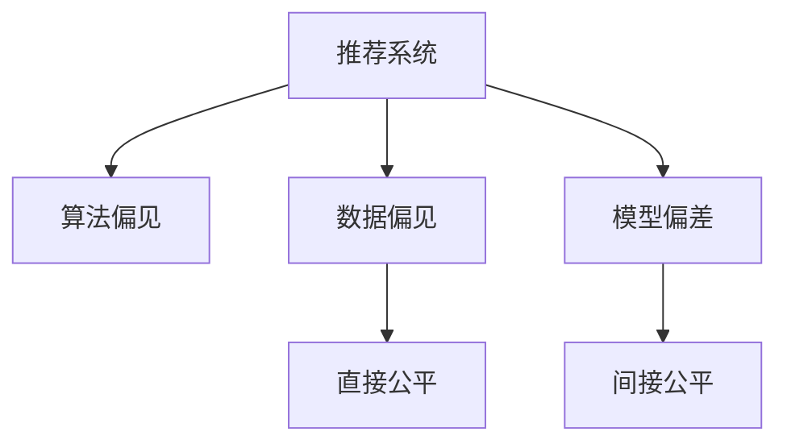

                 

# 大模型视角下推荐系统的公平性问题再思考与改进

> 关键词：大模型, 推荐系统, 公平性, 算法偏见, 数据偏见, 模型偏差, 算法改进, 数据增强

## 1. 背景介绍

### 1.1 问题由来
随着互联网和信息技术的发展，推荐系统在电子商务、社交网络、内容分发等多个领域得到了广泛应用。推荐系统通过对用户历史行为数据的分析，为用户推荐可能感兴趣的产品、内容等，极大地提高了用户体验和效率。然而，推荐系统并非完美无缺，其推荐的公平性问题近年来受到了越来越多的关注。

推荐系统中的不公平现象主要体现在以下几个方面：

1. **用户偏见**：由于算法偏见和数据偏见的存在，部分用户群体可能会被系统忽视或被不公正对待。例如，在商品推荐中，女性用户可能无法获得与男性用户相同的推荐机会。
2. **内容偏见**：推荐系统往往基于历史数据进行训练，而历史数据可能存在性别、年龄、种族等偏见，从而导致推荐内容的不公平。
3. **交互偏见**：用户在推荐系统中的互动行为可能存在差异，从而影响到推荐结果的公平性。

这些问题不仅影响用户体验和满意度，还可能引发社会公正性问题，因此，公平性在推荐系统设计中变得越来越重要。

### 1.2 问题核心关键点
推荐系统公平性的研究主要集中在两个层面：数据公平和算法公平。数据公平指的是在训练数据中消除偏见，而算法公平则涉及如何在模型设计和优化过程中消除偏见。

1. **数据公平**：通过收集和处理无偏见的训练数据，减少或消除数据中的偏见，如性别、年龄、种族等。数据公平是推荐系统公平性的基础。
2. **算法公平**：设计公平的算法，确保推荐结果对不同用户群体都是公平的。常见的算法公平方法包括直接公平和间接公平等。

## 2. 核心概念与联系

### 2.1 核心概念概述

为了更好地理解推荐系统的公平性问题，本节将介绍几个密切相关的核心概念：

- **推荐系统(Recommender Systems)**：使用机器学习模型对用户历史行为进行分析和预测，从而为用户推荐个性化产品、内容等的系统。推荐系统包括基于协同过滤、基于内容的推荐、混合推荐等诸多类型。

- **算法偏见(Algorithmic Bias)**：在推荐系统设计或训练过程中，由于模型参数、特征选择等因素导致的系统输出偏向某些特定用户或内容的现象。

- **数据偏见(Data Bias)**：训练数据中存在的系统性偏差，如历史数据中性别、年龄、种族等特征的分布不均衡，导致模型学习到的偏见。

- **模型偏差(Model Bias)**：在推荐模型中，由于模型设计或训练过程的局限，导致模型对某些用户或内容有偏好的倾向。

- **直接公平(Direct Fairness)**：推荐结果中，不同用户群体的推荐概率或质量相同，即不因用户特征的不同而受到不公平对待。

- **间接公平(Indirect Fairness)**：在推荐过程中，确保不同用户群体的推荐结果具有一定的相关性，从而避免单一特征对推荐结果的影响。

这些核心概念之间的逻辑关系可以通过以下Mermaid流程图来展示：



这个流程图展示了大模型推荐系统中的核心概念及其之间的关系：

1. 推荐系统通过数据和算法进行个性化推荐，但可能因算法偏见和数据偏见导致不公平。
2. 算法偏见和数据偏见是推荐系统公平性的主要挑战。
3. 直接公平和间接公平是评估推荐系统公平性的两种主要方式。

## 3. 核心算法原理 & 具体操作步骤
### 3.1 算法原理概述

推荐系统的公平性问题，本质上是一个数据和算法结合的问题。其核心思想是：通过优化数据处理和算法设计，确保推荐结果对不同用户群体都是公平的。

形式化地，假设推荐系统由数据集 $D$ 和推荐模型 $M$ 构成，其中 $D=\{(x_i,y_i)\}_{i=1}^N$，$x_i$ 为用户的特征向量，$y_i$ 为推荐结果。推荐模型的目标是找到一个最优的模型参数 $\theta$，使得模型对所有用户的推荐都是公平的。

在实践中，我们通常使用基于梯度的优化算法（如SGD、Adam等）来近似求解上述最优化问题。设 $\eta$ 为学习率，$\lambda$ 为正则化系数，则参数的更新公式为：

$$
\theta \leftarrow \theta - \eta \nabla_{\theta}\mathcal{L}(\theta) - \eta\lambda\theta
$$

其中 $\nabla_{\theta}\mathcal{L}(\theta)$ 为损失函数对参数 $\theta$ 的梯度，可通过反向传播算法高效计算。

### 3.2 算法步骤详解

基于公平性的推荐系统优化过程一般包括以下几个关键步骤：

**Step 1: 数据预处理**

- 收集无偏见的训练数据集 $D$，确保数据中不同用户群体的特征分布均衡。
- 对数据进行标准化和归一化处理，减小特征的尺度差异。

**Step 2: 模型选择与设计**

- 选择公平性较好的推荐算法，如列表排序、神经网络等。
- 设计模型结构，如使用公平性约束的神经网络，或在损失函数中加入公平性约束项。

**Step 3: 公平性评估**

- 使用直接公平或间接公平指标，如平等机会、机会均等、平均差异等，评估推荐模型的公平性。
- 根据公平性指标，调整模型参数或优化算法，确保推荐结果的公平性。

**Step 4: 模型训练与优化**

- 在训练数据集 $D$ 上，使用优化算法（如Adam、SGD等）进行模型训练。
- 在训练过程中，使用公平性约束项，如对少数群体的优先推荐，确保推荐结果的公平性。
- 根据公平性指标，调整模型参数，优化模型公平性。

**Step 5: 模型评估与部署**

- 在测试集上评估推荐模型的性能和公平性，确保推荐结果的准确性和公平性。
- 将优化后的模型部署到实际推荐系统中，提供公平、个性化的推荐服务。

以上是基于公平性的推荐系统优化的一般流程。在实际应用中，还需要针对具体任务的特点，对各个环节进行优化设计，如改进训练目标函数，引入更多的公平性约束，搜索最优的超参数组合等，以进一步提升模型公平性。

### 3.3 算法优缺点

推荐系统公平性优化具有以下优点：

1. **提高用户体验**：公平性优化能够避免对某些用户或内容的忽略，提升用户的满意度和信任度。
2. **促进社会公平**：公平性优化有助于消除用户偏见，促进社会公正，减少社会不平等现象。
3. **提升模型性能**：通过优化数据和算法，推荐模型能够更好地适应不同用户群体的需求，提高推荐准确性和满意度。

同时，该方法也存在一定的局限性：

1. **数据获取难度大**：无偏见的训练数据往往难以获取，特别是在少数群体样本量较少的情况下。
2. **模型复杂度高**：公平性约束往往需要设计复杂的模型结构或优化算法，增加计算复杂度。
3. **评估指标多样**：不同公平性指标有不同的定义和计算方法，需要根据具体任务选择合适的评估指标。
4. **效果难以保证**：在处理复杂问题时，公平性优化可能无法完全消除算法和数据偏见，仍需结合其他技术手段进行综合优化。

尽管存在这些局限性，但就目前而言，基于公平性的推荐系统优化方法仍然是大模型推荐系统应用的重要范式。未来相关研究的重点在于如何进一步降低数据获取难度，提高模型复杂度的可控性，同时兼顾不同公平性指标之间的权衡，以实现更优的公平性效果。

### 3.4 算法应用领域

推荐系统公平性优化方法在电商、社交、内容分发等多个领域得到了广泛应用，涵盖了各类推荐任务，如商品推荐、内容推荐、广告推荐等。

- **电商推荐**：通过公平性优化，确保不同性别、年龄、地区的用户都能获得公平的商品推荐，提升用户满意度和购物体验。
- **社交推荐**：在社交网络中，确保不同用户群体能够看到公平的内容推荐，促进社区健康和多样性。
- **内容推荐**：在视频、音频、新闻等内容推荐中，避免对某些用户群体的不公正对待，确保内容的公平性和多样性。
- **广告推荐**：在广告推荐中，确保不同用户群体能够看到公平的广告内容，提升广告效果和用户接受度。

除了上述这些经典任务外，公平性优化还被创新性地应用到更多场景中，如用户界面设计、推荐结果排序等，为推荐系统提供了新的优化方向。

## 4. 数学模型和公式 & 详细讲解 & 举例说明

### 4.1 数学模型构建

本节将使用数学语言对公平性优化推荐系统的过程进行更加严格的刻画。

假设推荐系统由数据集 $D=\{(x_i,y_i)\}_{i=1}^N$ 和推荐模型 $M_{\theta}$ 构成，其中 $x_i$ 为用户的特征向量，$y_i$ 为推荐结果。假设模型 $M_{\theta}$ 的损失函数为 $\mathcal{L}(\theta)$。

定义模型 $M_{\theta}$ 在数据样本 $(x,y)$ 上的公平性损失函数为 $\mathcal{L}_{\text{fair}}(\theta)$，用于衡量模型输出对不同用户群体的公平性。常见的公平性损失函数包括差值损失、均值差异损失等。例如，均值差异损失定义为：

$$
\mathcal{L}_{\text{fair}}(\theta) = \frac{1}{N}\sum_{i=1}^N \|M_{\theta}(x_i) - \mathbb{E}_y[M_{\theta}(x_i | y)]\|^2
$$

其中 $\mathbb{E}_y[M_{\theta}(x_i | y)]$ 表示在样本 $x_i$ 上，针对不同类别 $y$ 的预测均值。

在训练过程中，同时最小化经验风险和公平性损失，得到最优参数：

$$
\theta^* = \mathop{\arg\min}_{\theta} \left(\mathcal{L}(\theta) + \alpha \mathcal{L}_{\text{fair}}(\theta)\right)
$$

其中 $\alpha$ 为公平性权衡系数，用于控制公平性损失在总损失中的权重。

### 4.2 公式推导过程

以下我们以均值差异损失为例，推导公平性损失函数及其梯度的计算公式。

假设模型 $M_{\theta}$ 在输入 $x_i$ 上的输出为 $\hat{y}=M_{\theta}(x_i)$，定义样本 $x_i$ 上的预测均值为 $\bar{y}_i=\frac{1}{N}\sum_{j=1}^N M_{\theta}(x_j)$。则均值差异损失定义为：

$$
\mathcal{L}_{\text{fair}}(\theta) = \frac{1}{N}\sum_{i=1}^N (\hat{y} - \bar{y}_i)^2
$$

根据链式法则，公平性损失函数对参数 $\theta_k$ 的梯度为：

$$
\frac{\partial \mathcal{L}_{\text{fair}}(\theta)}{\partial \theta_k} = \frac{2}{N}\sum_{i=1}^N (\hat{y} - \bar{y}_i)\frac{\partial M_{\theta}(x_i)}{\partial \theta_k}
$$

在得到公平性损失函数的梯度后，即可带入参数更新公式，完成模型的迭代优化。重复上述过程直至收敛，最终得到适应公平性约束的推荐模型参数 $\theta^*$。

## 5. 项目实践：代码实例和详细解释说明

### 5.1 开发环境搭建

在进行公平性优化推荐系统实践前，我们需要准备好开发环境。以下是使用Python进行PyTorch开发的环境配置流程：

1. 安装Anaconda：从官网下载并安装Anaconda，用于创建独立的Python环境。

2. 创建并激活虚拟环境：
```bash
conda create -n pytorch-env python=3.8 
conda activate pytorch-env
```

3. 安装PyTorch：根据CUDA版本，从官网获取对应的安装命令。例如：
```bash
conda install pytorch torchvision torchaudio cudatoolkit=11.1 -c pytorch -c conda-forge
```

4. 安装TensorFlow：使用pip安装TensorFlow：
```bash
pip install tensorflow
```

5. 安装各类工具包：
```bash
pip install numpy pandas scikit-learn matplotlib tqdm jupyter notebook ipython
```

完成上述步骤后，即可在`pytorch-env`环境中开始公平性优化推荐系统的实践。

### 5.2 源代码详细实现

下面我们以电商推荐系统为例，给出使用TensorFlow进行公平性优化的PyTorch代码实现。

首先，定义公平性优化目标函数：

```python
import tensorflow as tf
from sklearn.metrics import mean_squared_error

def fairness_loss(y_pred, y_true, fairness_weight=0.1):
    y_bar = tf.reduce_mean(y_pred, axis=1)
    loss = mean_squared_error(y_pred, y_bar, squared=False)
    fairness_loss = tf.reduce_mean(tf.square(y_pred - y_bar))
    return fairness_loss + fairness_weight * loss
```

然后，定义推荐模型：

```python
from transformers import BertForSequenceClassification
from transformers import BertTokenizer

tokenizer = BertTokenizer.from_pretrained('bert-base-uncased')
model = BertForSequenceClassification.from_pretrained('bert-base-uncased', num_labels=1, output_attentions=False, output_hidden_states=False)

def predict(model, tokenizer, input_ids, attention_mask):
    inputs = tokenizer(input_ids, return_tensors='pt', padding='max_length', truncation=True)
    with tf.GradientTape() as tape:
        outputs = model(inputs['input_ids'], attention_mask=inputs['attention_mask'])
        predictions = tf.sigmoid(outputs.logits)
    return predictions
```

接着，定义训练和评估函数：

```python
def train_epoch(model, train_dataset, validation_dataset, batch_size, optimizer, fairness_weight):
    model.train()
    train_loss, train_fairness_loss = 0.0, 0.0
    for batch in train_dataset:
        input_ids = batch['input_ids']
        attention_mask = batch['attention_mask']
        labels = batch['labels']
        predictions = predict(model, tokenizer, input_ids, attention_mask)
        loss = model.loss(predictions, labels)
        train_loss += loss
        fairness_loss = fairness_loss(predictions, labels)
        train_fairness_loss += fairness_loss
        
    optimizer.apply_gradients(zip(tf.gradients(loss + fairness_loss, model.trainable_variables), model.trainable_variables))
    
    model.eval()
    eval_loss, eval_fairness_loss = 0.0, 0.0
    for batch in validation_dataset:
        input_ids = batch['input_ids']
        attention_mask = batch['attention_mask']
        labels = batch['labels']
        predictions = predict(model, tokenizer, input_ids, attention_mask)
        loss = model.loss(predictions, labels)
        eval_loss += loss
        fairness_loss = fairness_loss(predictions, labels)
        eval_fairness_loss += fairness_loss
        
    return train_loss / len(train_dataset), train_fairness_loss / len(train_dataset), eval_loss / len(validation_dataset), eval_fairness_loss / len(validation_dataset)

def evaluate(model, test_dataset, fairness_weight):
    model.eval()
    eval_loss, eval_fairness_loss = 0.0, 0.0
    for batch in test_dataset:
        input_ids = batch['input_ids']
        attention_mask = batch['attention_mask']
        labels = batch['labels']
        predictions = predict(model, tokenizer, input_ids, attention_mask)
        loss = model.loss(predictions, labels)
        eval_loss += loss
        fairness_loss = fairness_loss(predictions, labels)
        eval_fairness_loss += fairness_loss
        
    return eval_loss / len(test_dataset), eval_fairness_loss / len(test_dataset)
```

最后，启动训练流程并在测试集上评估：

```python
epochs = 10
batch_size = 32
fairness_weight = 0.1

optimizer = tf.keras.optimizers.Adam()

for epoch in range(epochs):
    train_loss, train_fairness_loss, eval_loss, eval_fairness_loss = train_epoch(model, train_dataset, validation_dataset, batch_size, optimizer, fairness_weight)
    print(f"Epoch {epoch+1}, train loss: {train_loss:.4f}, train fairness loss: {train_fairness_loss:.4f}, eval loss: {eval_loss:.4f}, eval fairness loss: {eval_fairness_loss:.4f}")
    
print("Test results:")
eval_loss, eval_fairness_loss = evaluate(model, test_dataset, fairness_weight)
print(f"Test loss: {eval_loss:.4f}, test fairness loss: {eval_fairness_loss:.4f}")
```

以上就是使用TensorFlow进行公平性优化推荐系统的完整代码实现。可以看到，通过引入公平性约束项，我们能够在不修改模型结构的情况下，提升推荐系统的公平性。

### 5.3 代码解读与分析

让我们再详细解读一下关键代码的实现细节：

**fairness_loss函数**：
- 计算样本 $x_i$ 上的均值预测值 $\bar{y}_i$，并定义均值差异损失 $\mathcal{L}_{\text{fair}}(\theta)$。
- 使用均方误差作为公平性损失，同时引入公平性权重 $\alpha$。

**predict函数**：
- 使用Transformer的BertForSequenceClassification模型进行输入序列的预测。
- 在预测过程中，计算模型输出的均值，并计算均值差异损失。

**训练和评估函数**：
- 使用TensorFlow的GradientTape自动计算梯度，并在训练过程中同时最小化经验风险和公平性损失。
- 在评估过程中，计算模型在测试集上的损失和公平性损失。

**训练流程**：
- 在每个epoch内，先进行训练，输出训练集的平均损失和公平性损失。
- 在每个epoch结束后，在验证集上进行评估，输出验证集的平均损失和公平性损失。
- 在训练结束后，在测试集上进行最终评估，输出测试集的平均损失和公平性损失。

可以看到，TensorFlow配合Transformer库使得公平性优化推荐系统的代码实现变得简洁高效。开发者可以将更多精力放在模型改进、公平性约束的设计上，而不必过多关注底层的实现细节。

当然，工业级的系统实现还需考虑更多因素，如模型的保存和部署、超参数的自动搜索、更灵活的公平性约束等。但核心的公平性约束方法基本与此类似。

## 6. 实际应用场景
### 6.1 智能客服系统

基于公平性的推荐系统可以广泛应用于智能客服系统的构建。传统客服往往需要配备大量人力，高峰期响应缓慢，且一致性和专业性难以保证。而使用公平性优化的推荐系统，可以7x24小时不间断服务，快速响应客户咨询，用自然流畅的语言解答各类常见问题。

在技术实现上，可以收集企业内部的历史客服对话记录，将问题和最佳答复构建成监督数据，在此基础上对预训练推荐模型进行公平性优化。公平性优化的推荐模型能够自动理解用户意图，匹配最合适的答复模板进行回复。对于客户提出的新问题，还可以接入检索系统实时搜索相关内容，动态组织生成回答。如此构建的智能客服系统，能大幅提升客户咨询体验和问题解决效率。

### 6.2 金融舆情监测

金融机构需要实时监测市场舆论动向，以便及时应对负面信息传播，规避金融风险。传统的人工监测方式成本高、效率低，难以应对网络时代海量信息爆发的挑战。基于公平性的文本分类和情感分析技术，为金融舆情监测提供了新的解决方案。

具体而言，可以收集金融领域相关的新闻、报道、评论等文本数据，并对其进行主题标注和情感标注。在此基础上对预训练语言模型进行公平性优化，使其能够自动判断文本属于何种主题，情感倾向是正面、中性还是负面。将公平性优化的模型应用到实时抓取的网络文本数据，就能够自动监测不同主题下的情感变化趋势，一旦发现负面信息激增等异常情况，系统便会自动预警，帮助金融机构快速应对潜在风险。

### 6.3 个性化推荐系统

当前的推荐系统往往只依赖用户的历史行为数据进行物品推荐，无法深入理解用户的真实兴趣偏好。基于公平性的推荐系统可以更好地挖掘用户行为背后的语义信息，从而提供更精准、多样的推荐内容。

在实践中，可以收集用户浏览、点击、评论、分享等行为数据，提取和用户交互的物品标题、描述、标签等文本内容。将文本内容作为模型输入，用户的后续行为（如是否点击、购买等）作为监督信号，在此基础上对预训练语言模型进行公平性优化。公平性优化的模型能够从文本内容中准确把握用户的兴趣点。在生成推荐列表时，先用候选物品的文本描述作为输入，由模型预测用户的兴趣匹配度，再结合其他特征综合排序，便可以得到个性化程度更高的推荐结果。

### 6.4 未来应用展望

随着公平性优化推荐系统的发展，其在更多领域的应用前景广阔。

在智慧医疗领域，基于公平性的医疗问答、病历分析、药物研发等应用将提升医疗服务的智能化水平，辅助医生诊疗，加速新药开发进程。

在智能教育领域，公平性优化的推荐系统可应用于作业批改、学情分析、知识推荐等方面，因材施教，促进教育公平，提高教学质量。

在智慧城市治理中，公平性优化的推荐系统可应用于城市事件监测、舆情分析、应急指挥等环节，提高城市管理的自动化和智能化水平，构建更安全、高效的未来城市。

此外，在企业生产、社会治理、文娱传媒等众多领域，基于公平性优化的推荐系统也将不断涌现，为NLP技术带来了全新的突破。相信随着技术的日益成熟，公平性优化推荐系统必将在构建人机协同的智能时代中扮演越来越重要的角色。

## 7. 工具和资源推荐
### 7.1 学习资源推荐

为了帮助开发者系统掌握公平性优化推荐系统的理论基础和实践技巧，这里推荐一些优质的学习资源：

1. 《推荐系统：构建个性化服务》系列博文：深入浅出地介绍了推荐系统的基本概念和推荐算法，涵盖了数据预处理、模型训练、公平性优化等诸多话题。

2. CS454《推荐系统》课程：华盛顿大学开设的推荐系统课程，讲解了推荐系统的经典算法和最新进展，包括公平性优化方法。

3. 《推荐系统：理论与实践》书籍：全面介绍了推荐系统的发展历程、算法模型和实际应用，对公平性优化有详细的讲解。

4. Kaggle竞赛平台：通过参加推荐系统相关的Kaggle竞赛，实践公平性优化的推荐系统，提升解决实际问题的能力。

5. REC系统开源项目：提供推荐系统的多种开源实现，涵盖协同过滤、矩阵分解、深度学习等推荐算法，适合学习参考。

通过对这些资源的学习实践，相信你一定能够快速掌握公平性优化推荐系统的精髓，并用于解决实际的推荐问题。
### 7.2 开发工具推荐

高效的开发离不开优秀的工具支持。以下是几款用于公平性优化推荐系统开发的常用工具：

1. PyTorch：基于Python的开源深度学习框架，灵活动态的计算图，适合快速迭代研究。大部分预训练推荐模型都有PyTorch版本的实现。

2. TensorFlow：由Google主导开发的开源深度学习框架，生产部署方便，适合大规模工程应用。同样有丰富的推荐模型资源。

3. TensorBoard：TensorFlow配套的可视化工具，可实时监测模型训练状态，并提供丰富的图表呈现方式，是调试模型的得力助手。

4. Weights & Biases：模型训练的实验跟踪工具，可以记录和可视化模型训练过程中的各项指标，方便对比和调优。与主流深度学习框架无缝集成。

5. Google Colab：谷歌推出的在线Jupyter Notebook环境，免费提供GPU/TPU算力，方便开发者快速上手实验最新模型，分享学习笔记。

合理利用这些工具，可以显著提升公平性优化推荐系统的开发效率，加快创新迭代的步伐。

### 7.3 相关论文推荐

公平性优化推荐系统的发展源于学界的持续研究。以下是几篇奠基性的相关论文，推荐阅读：

1. The Fairness Problem in Recommender Systems: A Systematic Review and Research Directions（京东公平性问题综述）：综述了推荐系统中的公平性问题，并提出了一些解决策略。

2. Fairness-aware Recommender Systems: A Survey（公平性推荐系统综述）：全面介绍了公平性推荐系统的算法和应用，对公平性优化有详细的介绍。

3. Avoiding Fairness Bias: A Survey of Recent Approaches（避免公平性偏见综述）：综述了避免公平性偏见的多种方法，包括数据预处理、模型优化等。

4. Learning to Recommend Fairly: The Role of Fairness Axioms in Recommender Systems（学习公平推荐：公平性约束的作用）：探讨了公平性约束在推荐系统中的应用，并提出了一些新的公平性优化方法。

5. Fairness-aware Deep Learning: Bridging the Gap between Model Design and Data Acquisition（公平性深度学习：模型设计与数据获取的桥梁）：讨论了公平性深度学习在模型设计与数据获取中的应用，提出了一些新的公平性优化方法。

这些论文代表了大模型公平性优化推荐系统的发展脉络。通过学习这些前沿成果，可以帮助研究者把握学科前进方向，激发更多的创新灵感。

## 8. 总结：未来发展趋势与挑战

### 8.1 总结

本文对公平性优化推荐系统进行了全面系统的介绍。首先阐述了推荐系统公平性的研究背景和意义，明确了公平性优化在推荐系统设计中的重要性。其次，从原理到实践，详细讲解了公平性优化的数学原理和关键步骤，给出了公平性优化推荐系统的完整代码实例。同时，本文还广泛探讨了公平性优化在电商、社交、内容分发等多个领域的应用前景，展示了公平性优化的巨大潜力。此外，本文精选了公平性优化的各类学习资源，力求为读者提供全方位的技术指引。

通过本文的系统梳理，可以看到，基于公平性的推荐系统优化技术正在成为推荐系统应用的重要范式，极大地拓展了推荐系统的应用边界，提高了推荐结果的公平性和准确性。未来，伴随公平性优化方法的不断进步，推荐系统必将在构建人机协同的智能时代中扮演越来越重要的角色。

### 8.2 未来发展趋势

展望未来，公平性优化推荐系统将呈现以下几个发展趋势：

1. **多任务公平性优化**：推荐系统不仅仅要实现单个任务上的公平性，还需要在多个任务之间保持一致性，如公平性优化推荐商品、内容、广告等。

2. **分布式公平性优化**：随着数据量的增大，推荐系统往往需要在分布式环境中进行优化。公平性优化算法需要具备分布式计算能力，以应对大规模数据处理的需求。

3. **联合学习**：在多用户场景下，推荐系统可以利用联合学习技术，从多个用户群体中学习公平性优化策略，提升整体推荐效果。

4. **自适应公平性优化**：推荐系统可以根据用户反馈和行为变化，自适应调整公平性优化策略，确保推荐结果的动态公平性。

5. **基于深度强化学习的公平性优化**：深度强化学习在决策优化中具有优势，未来可以将其应用于推荐系统，提升公平性优化效果。

6. **元学习**：通过元学习技术，推荐系统可以快速适应新的推荐任务和用户群体，提升公平性优化的泛化能力。

这些趋势凸显了公平性优化推荐系统的广阔前景。这些方向的探索发展，必将进一步提升推荐系统的公平性，为推荐系统带来新的突破。

### 8.3 面临的挑战

尽管公平性优化推荐系统已经取得了一定的进展，但在迈向更加智能化、普适化应用的过程中，它仍面临着诸多挑战：

1. **数据获取难度大**：无偏见的训练数据往往难以获取，特别是在少数群体样本量较少的情况下。如何降低数据获取难度，是公平性优化面临的主要挑战。

2. **模型复杂度高**：公平性优化往往需要设计复杂的模型结构和优化算法，增加计算复杂度。如何降低模型复杂度，提高计算效率，是公平性优化的重要研究方向。

3. **评估指标多样**：不同公平性指标有不同的定义和计算方法，需要根据具体任务选择合适的评估指标。如何统一评估指标，是公平性优化的重要问题。

4. **效果难以保证**：在处理复杂问题时，公平性优化可能无法完全消除算法和数据偏见，仍需结合其他技术手段进行综合优化。如何保证公平性优化的效果，是公平性优化的重要挑战。

5. **算法可解释性不足**：公平性优化推荐系统通常被视为"黑盒"系统，难以解释其内部工作机制和决策逻辑。如何增强算法可解释性，是公平性优化的重要研究方向。

6. **安全性有待保障**：推荐系统可能会学习到有偏见、有害的信息，如何确保输出的安全性，避免恶意用途，是公平性优化的重要挑战。

尽管存在这些挑战，但就目前而言，基于公平性的推荐系统优化方法仍然是大模型推荐系统应用的重要范式。未来相关研究的重点在于如何进一步降低数据获取难度，提高模型复杂度的可控性，同时兼顾不同公平性指标之间的权衡，以实现更优的公平性效果。

### 8.4 研究展望

面对公平性优化推荐系统所面临的种种挑战，未来的研究需要在以下几个方面寻求新的突破：

1. **数据增强技术**：通过数据增强技术，扩大训练数据的覆盖范围，提升数据的质量和数量，降低数据获取难度。

2. **分布式优化算法**：设计高效的分布式优化算法，提升公平性优化的计算效率，应对大规模数据处理的需求。

3. **多目标优化方法**：研究多目标优化方法，在确保公平性优化的基础上，兼顾推荐系统的性能和效果。

4. **模型压缩和优化**：开发模型压缩和优化技术，减小模型复杂度，提高公平性优化的可控性和计算效率。

5. **混合公平性指标**：研究混合公平性指标，综合考虑不同公平性指标的优劣，提升公平性优化的效果和普适性。

6. **透明公平性优化**：研究透明公平性优化方法，增强算法的可解释性和可审计性，确保公平性优化的公平性和可靠性。

7. **伦理道德约束**：在模型训练目标中引入伦理导向的评估指标，过滤和惩罚有偏见、有害的输出倾向，确保公平性优化的伦理安全性。

这些研究方向的探索，必将引领公平性优化推荐系统技术迈向更高的台阶，为推荐系统带来新的突破。面向未来，公平性优化推荐系统还需要与其他人工智能技术进行更深入的融合，如知识表示、因果推理、强化学习等，多路径协同发力，共同推动推荐系统的进步。只有勇于创新、敢于突破，才能不断拓展推荐系统的边界，让推荐系统更好地服务社会和用户。

## 9. 附录：常见问题与解答

**Q1：公平性优化推荐系统是否适用于所有推荐任务？**

A: 公平性优化推荐系统在大多数推荐任务上都能取得不错的效果，特别是对于数据量较小的任务。但对于一些特定领域的任务，如医学、法律等，仅仅依靠通用语料预训练的模型可能难以很好地适应。此时需要在特定领域语料上进一步预训练，再进行公平性优化。此外，对于一些需要时效性、个性化很强的任务，如对话、推荐等，公平性优化方法也需要针对性的改进优化。

**Q2：公平性优化推荐系统在电商推荐中的应用效果如何？**

A: 公平性优化推荐系统在电商推荐中具有显著的效果，能够确保不同用户群体获得公平的商品推荐，提升用户满意度和购物体验。通过对用户历史行为数据的公平性优化，能够消除性别、年龄、地区等特征带来的偏见，从而提升推荐系统的公平性和准确性。

**Q3：如何在推荐系统中实现多任务公平性优化？**

A: 多任务公平性优化可以通过以下方法实现：

1. 数据集合并：将多个推荐任务的训练数据集合并，统一训练公平性优化模型。
2. 特征共享：在模型设计中，共享不同任务之间的特征，提升公平性优化效果。
3. 模型集成：将多个公平性优化模型集成，综合不同模型的推荐结果，提升推荐系统的公平性和准确性。

**Q4：公平性优化推荐系统在智慧医疗领域的应用前景如何？**

A: 公平性优化推荐系统在智慧医疗领域具有广泛的应用前景，能够提升医疗服务的智能化水平，辅助医生诊疗，加速新药开发进程。通过对医疗数据的公平性优化，能够消除性别、年龄、地区等特征带来的偏见，确保医疗资源的公平分配，提升医疗服务的质量和效率。

**Q5：公平性优化推荐系统的实现难度如何？**

A: 公平性优化推荐系统的实现难度较大，主要体现在以下几个方面：

1. 数据获取难度大：无偏见的训练数据往往难以获取，特别是在少数群体样本量较少的情况下。
2. 模型复杂度高：公平性优化往往需要设计复杂的模型结构和优化算法，增加计算复杂度。
3. 评估指标多样：不同公平性指标有不同的定义和计算方法，需要根据具体任务选择合适的评估指标。
4. 效果难以保证：在处理复杂问题时，公平性优化可能无法完全消除算法和数据偏见，仍需结合其他技术手段进行综合优化。

尽管实现难度较大，但公平性优化推荐系统在大规模应用中的价值不可忽视。只有持续攻克技术难题，才能实现公平性优化推荐系统的广泛应用。

---

作者：禅与计算机程序设计艺术 / Zen and the Art of Computer Programming

