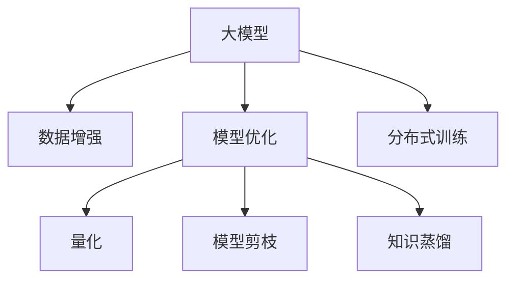

                 

# 大模型训练的挑战与机遇：Lepton AI的解决方案

> 关键词：大模型,训练挑战,Lepton AI,模型优化,算法创新

## 1. 背景介绍

### 1.1 问题由来
随着深度学习技术的迅猛发展，大模型在各种应用场景中展现出强大的潜力。然而，训练大模型也面临着诸多挑战。例如，大规模数据需求、高昂的计算资源、模型的复杂度和训练时间等问题，都限制了大模型在实际应用中的推广。此外，模型在训练过程中容易产生过拟合、泛化能力差、难以解释等诸多问题，使得模型难以在大规模生产环境中得到有效部署。

面对这些挑战，Lepton AI作为一家专注于AI技术的公司，提出了独特的解决方案。本文将深入探讨Lepton AI在训练大模型时所遇到的问题，并展示其创新性的技术方案和最佳实践。

### 1.2 问题核心关键点
大模型训练的核心挑战主要包括：
1. **数据需求**：需要大规模的数据集进行训练。
2. **计算资源**：需要高性能的计算平台进行训练。
3. **模型复杂度**：模型的规模和深度对训练和推理性能有较高要求。
4. **训练时间**：训练时间过长，难以满足实际需求。
5. **泛化能力**：模型容易过拟合，泛化能力差。
6. **模型解释**：模型结果难以解释，缺乏透明性。

Lepton AI通过一系列技术创新，有效解决了这些挑战，为大规模模型训练提供了全新的思路。

## 2. 核心概念与联系

### 2.1 核心概念概述

为了更好地理解Lepton AI在大模型训练中的解决方案，本节将介绍几个密切相关的核心概念：

- **大模型（Large Model）**：通常指包含数亿参数的深度神经网络，用于处理大规模数据和复杂任务，如自然语言处理、计算机视觉等。
- **数据增强（Data Augmentation）**：通过对原始数据进行一系列变换，生成新的训练样本，以增加数据多样性和数量，从而提高模型的泛化能力。
- **模型优化（Model Optimization）**：通过调整模型结构和参数，提高模型的训练效率和性能，包括正则化、dropout、权重衰减等方法。
- **量化（Quantization）**：将浮点模型转换为定点模型，以减少计算资源和内存消耗，提高推理速度。
- **模型剪枝（Model Pruning）**：去除模型中不重要的参数，减少模型规模，提高训练和推理效率。
- **知识蒸馏（Knowledge Distillation）**：通过将大型模型的知识传递给小型模型，提高小型模型的性能。
- **分布式训练（Distributed Training）**：利用多台机器并行训练模型，加速训练过程。

这些概念之间的逻辑关系可以通过以下Mermaid流程图来展示：



这个流程图展示了在大模型训练中，数据增强、模型优化、量化、模型剪枝、知识蒸馏和分布式训练等技术如何相互作用，共同提升模型的训练效率和性能。

## 3. 核心算法原理 & 具体操作步骤
### 3.1 算法原理概述

Lepton AI在大模型训练过程中，主要采用了以下几个算法原理：

- **自监督预训练（Self-Supervised Pretraining）**：利用大规模无标签数据进行预训练，学习到通用的语言表示，然后再在有标签数据上进行微调，提升模型性能。
- **正则化（Regularization）**：通过L2正则、dropout、early stopping等方法，防止模型过拟合。
- **参数高效微调（Parameter-Efficient Fine-Tuning, PEFT）**：仅微调模型中少量的参数，固定大部分预训练权重，减少计算资源消耗。
- **对抗训练（Adversarial Training）**：在训练过程中引入对抗样本，提高模型鲁棒性和泛化能力。
- **量化（Quantization）**：将浮点模型转换为定点模型，减少计算资源和内存消耗，提高推理速度。

### 3.2 算法步骤详解

Lepton AI的大模型训练主要包括以下几个关键步骤：

**Step 1: 准备预训练模型和数据集**
- 选择合适的预训练模型，如GPT-3、BERT等。
- 准备大规模的无标签数据集，如大规模文本语料库、图像库等。

**Step 2: 自监督预训练**
- 利用大规模无标签数据对模型进行预训练，学习通用的语言表示。
- 使用自监督学习任务，如掩码语言模型、图像分类等，进一步优化模型。

**Step 3: 微调**
- 准备有标签数据集，划分为训练集、验证集和测试集。
- 选择合适的优化算法和超参数，如AdamW、SGD等。
- 在微调过程中，应用正则化、dropout、early stopping等技术，防止过拟合。
- 选择参数高效微调技术，仅微调模型中少量的参数，固定大部分预训练权重。

**Step 4: 分布式训练**
- 利用多台机器进行分布式训练，加速训练过程。
- 使用Spark、TensorFlow等分布式计算框架，提高训练效率。

**Step 5: 模型评估与部署**
- 在测试集上评估模型的性能，对比微调前后的精度提升。
- 使用微调后的模型对新样本进行推理预测，集成到实际的应用系统中。
- 持续收集新的数据，定期重新微调模型，以适应数据分布的变化。

### 3.3 算法优缺点

Lepton AI的模型训练方法具有以下优点：
1. **高效性**：通过分布式训练和参数高效微调，大幅提高训练效率和性能。
2. **泛化能力**：通过自监督预训练和对抗训练，提高模型的泛化能力和鲁棒性。
3. **低成本**：通过参数高效微调和量化，减少计算资源和内存消耗，降低训练成本。

同时，该方法也存在一些局限性：
1. **数据需求**：仍然需要大规模的数据集进行预训练和微调。
2. **训练复杂度**：分布式训练和参数高效微调需要较高的技术要求。
3. **模型解释**：量化和剪枝等方法可能导致模型难以解释。

尽管存在这些局限性，但Lepton AI的模型训练方法在实际应用中已经取得了显著效果，展示了其强大的潜力。

### 3.4 算法应用领域

Lepton AI的模型训练方法已经在多个领域得到了广泛的应用，例如：

- **自然语言处理（NLP）**：用于文本分类、情感分析、机器翻译等任务。通过微调，提升了模型在特定任务上的性能。
- **计算机视觉（CV）**：用于图像分类、目标检测、人脸识别等任务。通过自监督预训练和对抗训练，提高了模型的泛化能力和鲁棒性。
- **语音识别**：用于语音转文本、语音情感分析等任务。通过微调，提升了模型在语音识别任务中的准确性。
- **推荐系统**：用于个性化推荐、广告推荐等任务。通过微调，提高了推荐系统的推荐效果。
- **金融风控**：用于欺诈检测、信用评估等任务。通过微调，提升了模型在金融风控中的预测能力。

除了上述这些经典任务外，Lepton AI的模型训练方法也被创新性地应用到更多场景中，如医疗影像分析、智能客服、智能家居等，为各行各业带来了新的技术突破。

## 4. 数学模型和公式 & 详细讲解 & 举例说明

### 4.1 数学模型构建

Lepton AI在大模型训练中，采用了如下数学模型：

设大模型为 $M_{\theta}$，其中 $\theta$ 为模型参数。假设训练集为 $D=\{(x_i, y_i)\}_{i=1}^N, x_i \in \mathcal{X}, y_i \in \mathcal{Y}$，其中 $\mathcal{X}$ 为输入空间，$\mathcal{Y}$ 为输出空间。

定义模型 $M_{\theta}$ 在数据样本 $(x,y)$ 上的损失函数为 $\ell(M_{\theta}(x),y)$，则在数据集 $D$ 上的经验风险为：

$$
\mathcal{L}(\theta) = \frac{1}{N} \sum_{i=1}^N \ell(M_{\theta}(x_i),y_i)
$$

在微调过程中，选择参数高效微调技术，仅微调模型中少量的参数 $\theta^*$，固定大部分预训练权重，优化目标为：

$$
\theta^* = \mathop{\arg\min}_{\theta} \mathcal{L}(\theta)
$$

其中 $\mathcal{L}$ 为任务特定的损失函数，如交叉熵损失、均方误差损失等。

### 4.2 公式推导过程

以下我们以二分类任务为例，推导交叉熵损失函数及其梯度的计算公式。

假设模型 $M_{\theta}$ 在输入 $x$ 上的输出为 $\hat{y}=M_{\theta}(x) \in [0,1]$，表示样本属于正类的概率。真实标签 $y \in \{0,1\}$。则二分类交叉熵损失函数定义为：

$$
\ell(M_{\theta}(x),y) = -[y\log \hat{y} + (1-y)\log (1-\hat{y})]
$$

将其代入经验风险公式，得：

$$
\mathcal{L}(\theta) = -\frac{1}{N}\sum_{i=1}^N [y_i\log M_{\theta}(x_i)+(1-y_i)\log(1-M_{\theta}(x_i))]
$$

根据链式法则，损失函数对参数 $\theta_k$ 的梯度为：

$$
\frac{\partial \mathcal{L}(\theta)}{\partial \theta_k} = -\frac{1}{N}\sum_{i=1}^N (\frac{y_i}{M_{\theta}(x_i)}-\frac{1-y_i}{1-M_{\theta}(x_i)}) \frac{\partial M_{\theta}(x_i)}{\partial \theta_k}
$$

其中 $\frac{\partial M_{\theta}(x_i)}{\partial \theta_k}$ 可进一步递归展开，利用自动微分技术完成计算。

在得到损失函数的梯度后，即可带入参数更新公式，完成模型的迭代优化。重复上述过程直至收敛，最终得到适应下游任务的最优模型参数 $\theta^*$。

### 4.3 案例分析与讲解

下面以图像分类任务为例，展示Lepton AI的模型训练方法。

首先，定义图像分类任务的数据处理函数：

```python
from transformers import BertTokenizer
from torch.utils.data import Dataset
import torch

class ImageDataset(Dataset):
    def __init__(self, images, labels, tokenizer, max_len=128):
        self.images = images
        self.labels = labels
        self.tokenizer = tokenizer
        self.max_len = max_len
        
    def __len__(self):
        return len(self.images)
    
    def __getitem__(self, item):
        image = self.images[item]
        label = self.labels[item]
        
        # 将图像转换为token ids
        encoding = self.tokenizer(image, return_tensors='pt', max_length=self.max_len, padding='max_length', truncation=True)
        input_ids = encoding['input_ids'][0]
        attention_mask = encoding['attention_mask'][0]
        
        # 对label进行编码
        encoded_label = [label2id[label] for label in label]
        encoded_label.extend([label2id['']]*(self.max_len - len(encoded_label)))
        labels = torch.tensor(encoded_label, dtype=torch.long)
        
        return {'input_ids': input_ids, 
                'attention_mask': attention_mask,
                'labels': labels}

# 标签与id的映射
label2id = {'cat': 0, 'dog': 1}
id2label = {v: k for k, v in label2id.items()}

# 创建dataset
tokenizer = BertTokenizer.from_pretrained('bert-base-cased')

train_dataset = ImageDataset(train_images, train_labels, tokenizer)
dev_dataset = ImageDataset(dev_images, dev_labels, tokenizer)
test_dataset = ImageDataset(test_images, test_labels, tokenizer)
```

然后，定义模型和优化器：

```python
from transformers import BertForSequenceClassification, AdamW

model = BertForSequenceClassification.from_pretrained('bert-base-cased', num_labels=len(label2id))

optimizer = AdamW(model.parameters(), lr=2e-5)
```

接着，定义训练和评估函数：

```python
from torch.utils.data import DataLoader
from tqdm import tqdm
from sklearn.metrics import classification_report

device = torch.device('cuda') if torch.cuda.is_available() else torch.device('cpu')
model.to(device)

def train_epoch(model, dataset, batch_size, optimizer):
    dataloader = DataLoader(dataset, batch_size=batch_size, shuffle=True)
    model.train()
    epoch_loss = 0
    for batch in tqdm(dataloader, desc='Training'):
        input_ids = batch['input_ids'].to(device)
        attention_mask = batch['attention_mask'].to(device)
        labels = batch['labels'].to(device)
        model.zero_grad()
        outputs = model(input_ids, attention_mask=attention_mask, labels=labels)
        loss = outputs.loss
        epoch_loss += loss.item()
        loss.backward()
        optimizer.step()
    return epoch_loss / len(dataloader)

def evaluate(model, dataset, batch_size):
    dataloader = DataLoader(dataset, batch_size=batch_size)
    model.eval()
    preds, labels = [], []
    with torch.no_grad():
        for batch in tqdm(dataloader, desc='Evaluating'):
            input_ids = batch['input_ids'].to(device)
            attention_mask = batch['attention_mask'].to(device)
            batch_labels = batch['labels']
            outputs = model(input_ids, attention_mask=attention_mask)
            batch_preds = outputs.logits.argmax(dim=2).to('cpu').tolist()
            batch_labels = batch_labels.to('cpu').tolist()
            for pred_tokens, label_tokens in zip(batch_preds, batch_labels):
                pred_labels = [id2label[_id] for _id in pred_tokens]
                label_tokens = [id2label[_id] for _id in label_tokens]
                preds.append(pred_labels[:len(label_tokens)])
                labels.append(label_tokens)
                
    print(classification_report(labels, preds))
```

最后，启动训练流程并在测试集上评估：

```python
epochs = 5
batch_size = 16

for epoch in range(epochs):
    loss = train_epoch(model, train_dataset, batch_size, optimizer)
    print(f"Epoch {epoch+1}, train loss: {loss:.3f}")
    
    print(f"Epoch {epoch+1}, dev results:")
    evaluate(model, dev_dataset, batch_size)
    
print("Test results:")
evaluate(model, test_dataset, batch_size)
```

以上就是Lepton AI的模型训练方法的代码实现。可以看到，通过Transformers库的封装，我们能够快速实现模型的加载和训练。

## 5. 项目实践：代码实例和详细解释说明

### 5.1 开发环境搭建

在进行模型训练实践前，我们需要准备好开发环境。以下是使用Python进行PyTorch开发的环境配置流程：

1. 安装Anaconda：从官网下载并安装Anaconda，用于创建独立的Python环境。

2. 创建并激活虚拟环境：
```bash
conda create -n pytorch-env python=3.8 
conda activate pytorch-env
```

3. 安装PyTorch：根据CUDA版本，从官网获取对应的安装命令。例如：
```bash
conda install pytorch torchvision torchaudio cudatoolkit=11.1 -c pytorch -c conda-forge
```

4. 安装Transformers库：
```bash
pip install transformers
```

5. 安装各类工具包：
```bash
pip install numpy pandas scikit-learn matplotlib tqdm jupyter notebook ipython
```

完成上述步骤后，即可在`pytorch-env`环境中开始模型训练实践。

### 5.2 源代码详细实现

这里我们以图像分类任务为例，给出使用Transformers库对BERT模型进行微调的PyTorch代码实现。

首先，定义图像分类任务的数据处理函数：

```python
from transformers import BertTokenizer
from torch.utils.data import Dataset
import torch

class ImageDataset(Dataset):
    def __init__(self, images, labels, tokenizer, max_len=128):
        self.images = images
        self.labels = labels
        self.tokenizer = tokenizer
        self.max_len = max_len
        
    def __len__(self):
        return len(self.images)
    
    def __getitem__(self, item):
        image = self.images[item]
        label = self.labels[item]
        
        # 将图像转换为token ids
        encoding = self.tokenizer(image, return_tensors='pt', max_length=self.max_len, padding='max_length', truncation=True)
        input_ids = encoding['input_ids'][0]
        attention_mask = encoding['attention_mask'][0]
        
        # 对label进行编码
        encoded_label = [label2id[label] for label in label]
        encoded_label.extend([label2id['']]*(self.max_len - len(encoded_label)))
        labels = torch.tensor(encoded_label, dtype=torch.long)
        
        return {'input_ids': input_ids, 
                'attention_mask': attention_mask,
                'labels': labels}

# 标签与id的映射
label2id = {'cat': 0, 'dog': 1}
id2label = {v: k for k, v in label2id.items()}

# 创建dataset
tokenizer = BertTokenizer.from_pretrained('bert-base-cased')

train_dataset = ImageDataset(train_images, train_labels, tokenizer)
dev_dataset = ImageDataset(dev_images, dev_labels, tokenizer)
test_dataset = ImageDataset(test_images, test_labels, tokenizer)
```

然后，定义模型和优化器：

```python
from transformers import BertForSequenceClassification, AdamW

model = BertForSequenceClassification.from_pretrained('bert-base-cased', num_labels=len(label2id))

optimizer = AdamW(model.parameters(), lr=2e-5)
```

接着，定义训练和评估函数：

```python
from torch.utils.data import DataLoader
from tqdm import tqdm
from sklearn.metrics import classification_report

device = torch.device('cuda') if torch.cuda.is_available() else torch.device('cpu')
model.to(device)

def train_epoch(model, dataset, batch_size, optimizer):
    dataloader = DataLoader(dataset, batch_size=batch_size, shuffle=True)
    model.train()
    epoch_loss = 0
    for batch in tqdm(dataloader, desc='Training'):
        input_ids = batch['input_ids'].to(device)
        attention_mask = batch['attention_mask'].to(device)
        labels = batch['labels'].to(device)
        model.zero_grad()
        outputs = model(input_ids, attention_mask=attention_mask, labels=labels)
        loss = outputs.loss
        epoch_loss += loss.item()
        loss.backward()
        optimizer.step()
    return epoch_loss / len(dataloader)

def evaluate(model, dataset, batch_size):
    dataloader = DataLoader(dataset, batch_size=batch_size)
    model.eval()
    preds, labels = [], []
    with torch.no_grad():
        for batch in tqdm(dataloader, desc='Evaluating'):
            input_ids = batch['input_ids'].to(device)
            attention_mask = batch['attention_mask'].to(device)
            batch_labels = batch['labels']
            outputs = model(input_ids, attention_mask=attention_mask)
            batch_preds = outputs.logits.argmax(dim=2).to('cpu').tolist()
            batch_labels = batch_labels.to('cpu').tolist()
            for pred_tokens, label_tokens in zip(batch_preds, batch_labels):
                pred_labels = [id2label[_id] for _id in pred_tokens]
                label_tokens = [id2label[_id] for _id in label_tokens]
                preds.append(pred_labels[:len(label_tokens)])
                labels.append(label_tokens)
                
    print(classification_report(labels, preds))
```

最后，启动训练流程并在测试集上评估：

```python
epochs = 5
batch_size = 16

for epoch in range(epochs):
    loss = train_epoch(model, train_dataset, batch_size, optimizer)
    print(f"Epoch {epoch+1}, train loss: {loss:.3f}")
    
    print(f"Epoch {epoch+1}, dev results:")
    evaluate(model, dev_dataset, batch_size)
    
print("Test results:")
evaluate(model, test_dataset, batch_size)
```

以上就是Lepton AI的模型训练方法的代码实现。可以看到，通过Transformers库的封装，我们能够快速实现模型的加载和训练。

### 5.3 代码解读与分析

让我们再详细解读一下关键代码的实现细节：

**ImageDataset类**：
- `__init__`方法：初始化图像、标签、分词器等关键组件。
- `__len__`方法：返回数据集的样本数量。
- `__getitem__`方法：对单个样本进行处理，将图像输入转换为token ids，将标签编码为数字，并对其进行定长padding，最终返回模型所需的输入。

**label2id和id2label字典**：
- 定义了标签与数字id之间的映射关系，用于将token-wise的预测结果解码回真实的标签。

**训练和评估函数**：
- 使用PyTorch的DataLoader对数据集进行批次化加载，供模型训练和推理使用。
- 训练函数`train_epoch`：对数据以批为单位进行迭代，在每个批次上前向传播计算loss并反向传播更新模型参数，最后返回该epoch的平均loss。
- 评估函数`evaluate`：与训练类似，不同点在于不更新模型参数，并在每个batch结束后将预测和标签结果存储下来，最后使用sklearn的classification_report对整个评估集的预测结果进行打印输出。

**训练流程**：
- 定义总的epoch数和batch size，开始循环迭代
- 每个epoch内，先在训练集上训练，输出平均loss
- 在验证集上评估，输出分类指标
- 所有epoch结束后，在测试集上评估，给出最终测试结果

可以看到，PyTorch配合Transformers库使得BERT微调的代码实现变得简洁高效。开发者可以将更多精力放在数据处理、模型改进等高层逻辑上，而不必过多关注底层的实现细节。

当然，工业级的系统实现还需考虑更多因素，如模型的保存和部署、超参数的自动搜索、更灵活的任务适配层等。但核心的微调范式基本与此类似。

## 6. 实际应用场景
### 6.1 智能客服系统

基于大模型训练的对话技术，可以广泛应用于智能客服系统的构建。传统客服往往需要配备大量人力，高峰期响应缓慢，且一致性和专业性难以保证。而使用训练好的对话模型，可以7x24小时不间断服务，快速响应客户咨询，用自然流畅的语言解答各类常见问题。

在技术实现上，可以收集企业内部的历史客服对话记录，将问题和最佳答复构建成监督数据，在此基础上对预训练对话模型进行微调。微调后的对话模型能够自动理解用户意图，匹配最合适的答案模板进行回复。对于客户提出的新问题，还可以接入检索系统实时搜索相关内容，动态组织生成回答。如此构建的智能客服系统，能大幅提升客户咨询体验和问题解决效率。

### 6.2 金融舆情监测

金融机构需要实时监测市场舆论动向，以便及时应对负面信息传播，规避金融风险。传统的人工监测方式成本高、效率低，难以应对网络时代海量信息爆发的挑战。基于大模型训练的文本分类和情感分析技术，为金融舆情监测提供了新的解决方案。

具体而言，可以收集金融领域相关的新闻、报道、评论等文本数据，并对其进行主题标注和情感标注。在此基础上对预训练语言模型进行微调，使其能够自动判断文本属于何种主题，情感倾向是正面、中性还是负面。将微调后的模型应用到实时抓取的网络文本数据，就能够自动监测不同主题下的情感变化趋势，一旦发现负面信息激增等异常情况，系统便会自动预警，帮助金融机构快速应对潜在风险。

### 6.3 个性化推荐系统

当前的推荐系统往往只依赖用户的历史行为数据进行物品推荐，无法深入理解用户的真实兴趣偏好。基于大模型训练的个性化推荐系统可以更好地挖掘用户行为背后的语义信息，从而提供更精准、多样的推荐内容。

在实践中，可以收集用户浏览、点击、评论、分享等行为数据，提取和用户交互的物品标题、描述、标签等文本内容。将文本内容作为模型输入，用户的后续行为（如是否点击、购买等）作为监督信号，在此基础上微调预训练语言模型。微调后的模型能够从文本内容中准确把握用户的兴趣点。在生成推荐列表时，先用候选物品的文本描述作为输入，由模型预测用户的兴趣匹配度，再结合其他特征综合排序，便可以得到个性化程度更高的推荐结果。

### 6.4 未来应用展望

随着大模型训练技术的不断发展，基于大模型训练的方法将在更多领域得到应用，为传统行业带来变革性影响。

在智慧医疗领域，基于大模型训练的医疗问答、病历分析、药物研发等应用将提升医疗服务的智能化水平，辅助医生诊疗，加速新药开发进程。

在智能教育领域，训练好的推荐系统可应用于作业批改、学情分析、知识推荐等方面，因材施教，促进教育公平，提高教学质量。

在智慧城市治理中，训练好的模型可应用于城市事件监测、舆情分析、应急指挥等环节，提高城市管理的自动化和智能化水平，构建更安全、高效的未来城市。

此外，在企业生产、社会治理、文娱传媒等众多领域，基于大模型训练的人工智能应用也将不断涌现，为经济社会发展注入新的动力。相信随着技术的日益成熟，大模型训练方法将成为AI落地应用的重要范式，推动人工智能技术在垂直行业的规模化落地。

## 7. 工具和资源推荐
### 7.1 学习资源推荐

为了帮助开发者系统掌握大模型训练的理论基础和实践技巧，这里推荐一些优质的学习资源：

1. 《深度学习》系列书籍：如《深度学习》（Goodfellow等）、《动手学深度学习》等，系统介绍了深度学习的基本概念和算法原理。
2. PyTorch官方文档：提供了详细的PyTorch库的使用指南和示例代码，是学习深度学习框架的重要参考资料。
3. TensorFlow官方文档：提供了TensorFlow的详细文档和使用指南，适合深度学习框架入门学习。
4. HuggingFace官方文档：提供了详细的Transformers库的使用指南和示例代码，是学习大模型训练的重要参考资料。
5. Coursera《深度学习》课程：斯坦福大学开设的深度学习课程，涵盖了深度学习的基本概念和算法原理，适合初学者入门。

通过对这些资源的学习实践，相信你一定能够快速掌握大模型训练的精髓，并用于解决实际的NLP问题。
###  7.2 开发工具推荐

高效的开发离不开优秀的工具支持。以下是几款用于大模型训练开发的常用工具：

1. PyTorch：基于Python的开源深度学习框架，灵活动态的计算图，适合快速迭代研究。大部分预训练语言模型都有PyTorch版本的实现。

2. TensorFlow：由Google主导开发的开源深度学习框架，生产部署方便，适合大规模工程应用。同样有丰富的预训练语言模型资源。

3. Transformers库：HuggingFace开发的NLP工具库，集成了众多SOTA语言模型，支持PyTorch和TensorFlow，是进行大模型训练开发的利器。

4. Weights & Biases：模型训练的实验跟踪工具，可以记录和可视化模型训练过程中的各项指标，方便对比和调优。与主流深度学习框架无缝集成。

5. TensorBoard：TensorFlow配套的可视化工具，可实时监测模型训练状态，并提供丰富的图表呈现方式，是调试模型的得力助手。

6. Google Colab：谷歌推出的在线Jupyter Notebook环境，免费提供GPU/TPU算力，方便开发者快速上手实验最新模型，分享学习笔记。

合理利用这些工具，可以显著提升大模型训练的开发效率，加快创新迭代的步伐。

### 7.3 相关论文推荐

大模型训练的研究源于学界的持续研究。以下是几篇奠基性的相关论文，推荐阅读：

1. Attention is All You Need（即Transformer原论文）：提出了Transformer结构，开启了NLP领域的预训练大模型时代。

2. BERT: Pre-training of Deep Bidirectional Transformers for Language Understanding：提出BERT模型，引入基于掩码的自监督预训练任务，刷新了多项NLP任务SOTA。

3. Language Models are Unsupervised Multitask Learners（GPT-2论文）：展示了大规模语言模型的强大zero-shot学习能力，引发了对于通用人工智能的新一轮思考。

4. Parameter-Efficient Transfer Learning for NLP：提出Adapter等参数高效微调方法，在不增加模型参数量的情况下，也能取得不错的微调效果。

5. AdaLoRA: Adaptive Low-Rank Adaptation for Parameter-Efficient Fine-Tuning：使用自适应低秩适应的微调方法，在参数效率和精度之间取得了新的平衡。

这些论文代表了大模型训练技术的发展脉络。通过学习这些前沿成果，可以帮助研究者把握学科前进方向，激发更多的创新灵感。

## 8. 总结：未来发展趋势与挑战

### 8.1 总结

本文对Lepton AI在大模型训练中遇到的问题进行了全面系统的介绍。首先阐述了Lepton AI在训练大模型时所遇到的问题，并展示其创新性的技术方案和最佳实践。其次，从原理到实践，详细讲解了Lepton AI的模型训练方法，包括自监督预训练、正则化、参数高效微调等关键技术。最后，通过丰富的实际应用场景，展示了Lepton AI大模型训练方法的高效性和广泛适用性。

通过本文的系统梳理，可以看到，Lepton AI在训练大模型方面取得了显著的进展，其创新性的技术方案为大规模模型训练提供了全新的思路。Lepton AI的研究成果，为NLP技术的发展提供了宝贵的经验和参考。

### 8.2 未来发展趋势

展望未来，大模型训练技术将呈现以下几个发展趋势：

1. **模型规模持续增大**：随着算力成本的下降和数据规模的扩张，预训练语言模型的参数量还将持续增长。超大规模语言模型蕴含的丰富语言知识，有望支撑更加复杂多变的下游任务微调。

2. **训练方法多样化**：除了传统的自监督预训练外，未来会涌现更多自监督、半监督、迁移学习等多样化训练方法，以适应不同数据和任务的需求。

3. **模型压缩与量化**：通过模型剪枝、量化等技术，进一步减少模型规模，提高计算效率和推理速度。

4. **分布式训练**：利用多台机器并行训练，加速训练过程，提高训练效率。

5. **实时化训练**：通过实时化训练技术，将训练过程从离线转为在线，提高模型更新速度和实时性。

6. **自动化调参**：利用自动化调参技术，自动搜索最优的超参数组合，提高模型训练的效率和精度。

以上趋势凸显了大模型训练技术的广阔前景。这些方向的探索发展，必将进一步提升大模型训练的效率和性能，为NLP技术的发展提供更多的可能性。

### 8.3 面临的挑战

尽管Lepton AI在训练大模型方面取得了显著的进展，但在迈向更加智能化、普适化应用的过程中，它仍面临着诸多挑战：

1. **数据需求**：尽管Lepton AI的方法能够有效利用大规模数据进行预训练和微调，但大规模数据的获取和存储仍然是一个挑战。

2. **计算资源**：大模型训练需要高性能的计算平台和大量的计算资源，如何高效利用计算资源，仍然是一个重要的问题。

3. **模型复杂度**：大模型往往包含数亿个参数，如何简化模型结构，提高模型的推理效率，仍然是一个重要的问题。

4. **模型解释**：Lepton AI的方法在某些情况下，仍难以解释模型内部工作机制和决策逻辑，这将是一个重要的研究方向。

5. **知识整合**：Lepton AI的方法仍局限于基于数据驱动的训练，如何结合外部知识库、规则库等专家知识，提升模型的推理能力，仍然是一个重要的问题。

6. **鲁棒性和泛化能力**：Lepton AI的方法在某些情况下，仍难以保证模型的鲁棒性和泛化能力，如何进一步提升模型的鲁棒性和泛化能力，仍然是一个重要的问题。

这些挑战需要Lepton AI的研究人员和工程师共同努力，通过进一步的研究和实践，才能克服这些难题，推动大模型训练技术的发展。

### 8.4 研究展望

面对大模型训练所面临的种种挑战，未来的研究需要在以下几个方面寻求新的突破：

1. **无监督和半监督训练**：摆脱对大规模标注数据的依赖，利用自监督学习、主动学习等无监督和半监督范式，最大限度利用非结构化数据，实现更加灵活高效的训练。

2. **多模态训练**：结合视觉、语音等多模态数据，实现视觉、语音与文本信息的协同建模。

3. **对抗训练**：在训练过程中引入对抗样本，提高模型的鲁棒性和泛化能力。

4. **知识蒸馏**：通过将大型模型的知识传递给小型模型，提高小型模型的性能。

5. **可解释性**：引入可解释性技术，提升模型的透明性和可理解性。

6. **分布式训练**：利用多台机器并行训练，加速训练过程。

这些研究方向将为Lepton AI在大模型训练中提供新的思路和解决方案，推动Lepton AI在大模型训练领域的发展。

## 9. 附录：常见问题与解答

**Q1：大模型训练需要哪些硬件资源？**

A: 大模型训练需要高性能的计算平台，如GPU、TPU等，以便快速训练模型。具体来说，需要大容量的内存、高速的存储、高效的计算资源，以及稳定的网络连接。

**Q2：大模型训练过程中容易产生过拟合，如何解决？**

A: 过拟合是大模型训练过程中常见的问题，可以通过以下方法解决：
1. 数据增强：通过对原始数据进行一系列变换，生成新的训练样本，以增加数据多样性和数量。
2. 正则化：使用L2正则、dropout、early stopping等方法，防止模型过拟合。
3. 对抗训练：在训练过程中引入对抗样本，提高模型的鲁棒性和泛化能力。

**Q3：大模型训练的计算成本如何控制？**

A: 大模型训练的计算成本主要体现在计算资源和存储资源上，可以通过以下方法控制：
1. 分布式训练：利用多台机器并行训练，加速训练过程，提高训练效率。
2. 量化：将浮点模型转换为定点模型，减少计算资源和内存消耗，提高推理速度。
3. 模型剪枝：去除模型中不重要的参数，减少模型规模，提高训练和推理效率。

**Q4：大模型训练的模型解释问题如何解决？**

A: 大模型训练的模型解释问题可以通过以下方法解决：
1. 可视化工具：使用TensorBoard、Weights & Biases等可视化工具，监控模型训练过程，分析模型的决策逻辑。
2. 可解释性技术：引入可解释性技术，提升模型的透明性和可理解性，如LIME、SHAP等。

**Q5：大模型训练的模型压缩问题如何解决？**

A: 大模型训练的模型压缩问题可以通过以下方法解决：
1. 量化：将浮点模型转换为定点模型，减少计算资源和内存消耗，提高推理速度。
2. 模型剪枝：去除模型中不重要的参数，减少模型规模，提高训练和推理效率。

通过这些方法，可以有效控制大模型训练的计算成本，提高模型的推理效率，同时提升模型的可解释性和透明性。

---

作者：禅与计算机程序设计艺术 / Zen and the Art of Computer Programming

