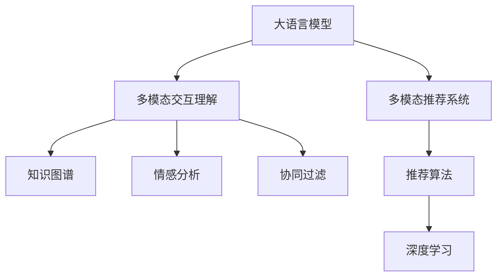

                 

# 大模型驱动的推荐系统多模态交互理解

> 关键词：大语言模型,多模态推荐系统,多模态交互,推荐算法,知识图谱,情感分析,协同过滤,深度学习

## 1. 背景介绍

### 1.1 问题由来
随着互联网和移动互联网的发展，用户生成内容日益丰富多样。电商平台、社交平台、视频平台等不断累积着海量的用户数据，为推荐系统的建设提供了丰富的数据来源。推荐系统的作用是使用户能够在信息过载的网络世界中发现对自己有价值的内容，提升用户体验，增加平台粘性。

然而，传统的推荐算法如协同过滤、基于内容的推荐等，往往局限于单一模态数据的利用，难以捕捉到用户真实需求。在电商平台上，商品图片、评论、标签等多元化的信息能够提供更丰富的用户画像，但这些信息源之间的关联互动，尚未被充分利用。如何打破模态壁垒，构建多模态交互理解，实现更精准、个性化的推荐，成为推荐系统领域的一大挑战。

大语言模型和多模态数据处理技术的发展，为推荐系统带来新的思路。通过融合大语言模型的语义理解和多模态数据的交互协同，推荐系统可以更好地挖掘用户的多维特征，构建更全面的用户画像，从而提升推荐效果。本文聚焦于大模型驱动的推荐系统多模态交互理解，探讨如何将大语言模型嵌入推荐系统框架，提升推荐系统的表现力。

## 2. 核心概念与联系

### 2.1 核心概念概述

为更好地理解大模型在推荐系统中的应用，本节将介绍几个密切相关的核心概念：

- **大语言模型(Large Language Model, LLM)**：以自回归(如GPT)或自编码(如BERT)模型为代表的大规模预训练语言模型。通过在大规模无标签文本语料上进行预训练，学习通用的语言表示，具备强大的语言理解和生成能力。

- **多模态推荐系统**：融合多种类型的数据(如文本、图像、视频、音频等)来丰富推荐系统的特征表达，捕捉用户的多维特征，实现更精准的推荐。

- **多模态交互理解**：通过理解不同模态数据之间的关系，构建多维特征向量，从而提升推荐系统的性能和鲁棒性。

- **知识图谱**：以图结构存储实体及其关系，便于对不同模态数据的关联提取。

- **情感分析**：分析文本中包含的情感信息，了解用户的情感状态和偏好，进一步提升推荐系统的个性化水平。

- **协同过滤**：通过用户行为数据，推断用户之间的相似性，实现推荐。

- **深度学习**：融合多层神经网络结构，提升推荐系统的复杂度和精度。

- **推荐算法**：如基于矩阵分解的推荐算法、基于深度学习的推荐算法等，是推荐系统的核心引擎。

这些核心概念之间的逻辑关系可以通过以下Mermaid流程图来展示：



这个流程图展示了大语言模型的核心概念及其之间的关系：

1. 大语言模型通过预训练获得基础能力。
2. 多模态推荐系统融合多种数据源，丰富特征表达。
3. 多模态交互理解捕捉不同模态数据之间的关系。
4. 知识图谱和情感分析进一步提取模态信息。
5. 协同过滤和深度学习提升推荐算法。

这些概念共同构成了大语言模型驱动的多模态推荐系统框架，使其能够在各种场景下发挥强大的推荐能力。通过理解这些核心概念，我们可以更好地把握大语言模型在推荐系统中的应用方向。

## 3. 核心算法原理 & 具体操作步骤
### 3.1 算法原理概述

大语言模型驱动的推荐系统，本质上是一个多模态数据的语义融合和协同过滤过程。其核心思想是：利用大语言模型的语义理解能力，对多模态数据进行综合分析和关联提取，生成多维特征向量。将此特征向量作为协同过滤算法的输入，通过用户行为数据推断用户间的相似性，从而实现更精准的推荐。

形式化地，假设大语言模型为 $M_{\theta}$，其中 $\theta$ 为预训练得到的模型参数。给定多模态数据集 $D=\{(x_i,y_i)\}_{i=1}^N$，其中 $x$ 包括文本、图片、音频等不同模态的数据，$y$ 为标签，表示用户是否对数据感兴趣。推荐系统的目标是找到最优特征表示 $F_{\theta}$，使得：

$$
\hat{y} = \mathop{\arg\max}_{y} F_{\theta}(x)
$$

其中 $F_{\theta}$ 为基于大语言模型的多模态特征提取函数。在数据集 $D$ 上的经验风险为：

$$
\mathcal{L}(\theta) = \frac{1}{N} \sum_{i=1}^N [\ell(y_i, F_{\theta}(x_i))]
$$

其中 $\ell$ 为损失函数，如交叉熵损失、均方误差损失等。通过梯度下降等优化算法，微调过程不断更新模型参数 $\theta$，最小化损失函数 $\mathcal{L}$，使得模型输出的多维特征向量逼近用户的真实偏好。

### 3.2 算法步骤详解

大语言模型驱动的推荐系统多模态交互理解一般包括以下几个关键步骤：

**Step 1: 准备多模态数据集**
- 收集用户在不同模态下的行为数据，如文本评论、图片浏览、视频观看、音频听歌等。
- 清洗数据，去除噪音，确保数据质量和一致性。
- 对多模态数据进行标准化和特征编码，以便大语言模型处理。

**Step 2: 构建多模态交互图**
- 构建多模态交互图，表示不同模态数据之间的关系。
- 使用知识图谱技术，将实体和关系嵌入图结构中。
- 将用户的多模态行为映射到图节点上，计算节点间边的权重。

**Step 3: 应用大语言模型**
- 对多模态数据进行拼接或融合，得到多维特征向量。
- 利用大语言模型对多维特征向量进行语义理解，生成高维语义表示。
- 通过多模态交互图，对语义表示进行上下文关联提取。

**Step 4: 融合多模态语义信息**
- 将大语言模型生成的语义表示与协同过滤算法结合，生成推荐结果。
- 利用深度学习模型对协同过滤算法进行优化，提升推荐效果。

**Step 5: 评估和优化**
- 在测试集上评估推荐模型的准确性和个性化水平。
- 根据评估结果，调整大语言模型的参数和损失函数，进行模型优化。

以上是大语言模型驱动的推荐系统多模态交互理解的一般流程。在实际应用中，还需要针对具体任务的特点，对微调过程的各个环节进行优化设计，如改进多模态交互图结构，引入更多的正则化技术，搜索最优的超参数组合等，以进一步提升模型性能。

### 3.3 算法优缺点

大语言模型驱动的推荐系统多模态交互理解方法具有以下优点：
1. 多模态数据融合能力强。大语言模型能够捕捉不同模态数据之间的语义关联，生成更丰富的用户画像。
2. 推荐结果个性化高。多模态数据的融合，能够更好地理解用户的真实需求，生成更加精准的推荐结果。
3. 鲁棒性好。通过多模态交互图，能够处理模态数据的缺失和噪声，提升推荐系统的鲁棒性。
4. 可扩展性强。大语言模型的预训练和微调过程可以在已有模型的基础上进行，快速适应新数据和任务。

同时，该方法也存在一定的局限性：
1. 计算成本高。大语言模型对计算资源的需求较高，尤其是高性能计算设备如GPU/TPU等。
2. 数据处理复杂。多模态数据融合和语义理解过程较为复杂，需要较高的数据预处理能力。
3. 解释性不足。大语言模型的决策过程复杂，难以进行可解释性分析，可能导致算法不透明。

尽管存在这些局限性，但就目前而言，大语言模型驱动的推荐系统多模态交互理解方法仍是大数据、深度学习领域的前沿范式。未来相关研究的重点在于如何进一步降低计算成本，提高数据处理效率，同时兼顾可解释性和鲁棒性等因素。

### 3.4 算法应用领域

大语言模型驱动的推荐系统多模态交互理解方法在电商推荐、社交媒体、视频推荐等多个领域得到广泛应用，具体如下：

- **电商推荐**：利用商品图片、评论、标签等多模态数据，通过多模态交互图，生成个性化推荐结果，提升用户体验和平台粘性。

- **社交媒体推荐**：结合用户发布的内容、点赞、评论等多模态行为数据，通过大语言模型的语义理解，生成更精准的社交媒体推荐内容。

- **视频推荐**：融合视频观看时长、点赞、评论等行为数据，利用大语言模型的语义分析，生成视频内容推荐，提升用户观看体验。

此外，该方法还被应用于音乐推荐、新闻推荐、广告推荐等多个领域，为多模态数据处理和融合提供新思路。

## 4. 数学模型和公式 & 详细讲解  
### 4.1 数学模型构建

本节将使用数学语言对大语言模型驱动的推荐系统多模态交互理解过程进行更加严格的刻画。

记多模态数据集为 $D=\{(x_i,y_i)\}_{i=1}^N$，其中 $x$ 包括文本、图片、音频等不同模态的数据，$y$ 为标签，表示用户是否对数据感兴趣。定义多模态数据集中不同模态数据之间的关系为 $R$，构建多模态交互图 $G=(V,E)$，其中 $V$ 为节点集合，$E$ 为边集合。

假设大语言模型为 $M_{\theta}$，其中 $\theta$ 为预训练得到的模型参数。设多模态数据集中用户 $u$ 的多模态行为向量为 $v_u \in \mathbb{R}^{d_u}$，其中 $d_u$ 为向量维度。则大语言模型生成的用户 $u$ 的多模态语义向量为 $z_u \in \mathbb{R}^{d_z}$，其中 $d_z$ 为语义向量维度。

设多模态交互图 $G$ 的邻接矩阵为 $A \in \mathbb{R}^{N \times N}$，则用户 $u$ 的多模态交互图嵌入向量为 $h_u \in \mathbb{R}^{d_h}$，其中 $d_h$ 为嵌入向量维度。则推荐模型的目标函数为：

$$
\hat{y} = \mathop{\arg\max}_{y} \langle F_{\theta}(x), A \rangle
$$

其中 $\langle \cdot, \cdot \rangle$ 为向量内积运算。

### 4.2 公式推导过程

以下我们以电商推荐为例，推导基于大语言模型的推荐模型计算公式。

假设电商平台上用户 $u$ 对商品 $i$ 的行为数据 $x_u^i$ 包括：
- 图片信息 $I_u^i$：图片的像素向量。
- 文字评论 $T_u^i$：用户对商品的文字描述。
- 评分 $R_u^i$：用户对商品的评分。

将不同模态的数据拼接成特征向量 $F_u^i \in \mathbb{R}^{d_f}$，其中 $d_f$ 为特征向量维度。

设大语言模型为BERT，生成用户 $u$ 对商品 $i$ 的多模态语义向量 $z_u^i \in \mathbb{R}^{d_z}$，其中 $d_z$ 为BERT模型的输出维度。

设多模态交互图 $G$ 的邻接矩阵为 $A \in \mathbb{R}^{N \times N}$，则用户 $u$ 的多模态交互图嵌入向量为 $h_u \in \mathbb{R}^{d_h}$，其中 $d_h$ 为嵌入向量维度。

设推荐模型的损失函数为交叉熵损失函数 $\ell$，则推荐模型的损失函数为：

$$
\mathcal{L}(\theta) = -\frac{1}{N} \sum_{i=1}^N \sum_{u=1}^N y_{ui} \log \langle F_{\theta}(x_u^i), A h_u \rangle
$$

其中 $y_{ui} = 1$ 表示用户 $u$ 对商品 $i$ 感兴趣，$y_{ui} = 0$ 表示用户 $u$ 对商品 $i$ 不感兴趣。

根据上述定义，推荐模型的目标函数为：

$$
\hat{y}_{ui} = \mathop{\arg\max}_{y_{ui}} \langle F_{\theta}(x_u^i), A h_u \rangle
$$

通过求解上述目标函数，可以预测用户 $u$ 对商品 $i$ 的兴趣程度，从而生成个性化推荐结果。

## 5. 项目实践：代码实例和详细解释说明
### 5.1 开发环境搭建

在进行推荐系统多模态交互理解实践前，我们需要准备好开发环境。以下是使用Python进行PyTorch开发的环境配置流程：

1. 安装Anaconda：从官网下载并安装Anaconda，用于创建独立的Python环境。

2. 创建并激活虚拟环境：
```bash
conda create -n recommendation-env python=3.8 
conda activate recommendation-env
```

3. 安装PyTorch：根据CUDA版本，从官网获取对应的安装命令。例如：
```bash
conda install pytorch torchvision torchaudio cudatoolkit=11.1 -c pytorch -c conda-forge
```

4. 安装Transformers库：
```bash
pip install transformers
```

5. 安装各类工具包：
```bash
pip install numpy pandas scikit-learn matplotlib tqdm jupyter notebook ipython
```

完成上述步骤后，即可在`recommendation-env`环境中开始推荐系统多模态交互理解实践。

### 5.2 源代码详细实现

下面我们以电商推荐为例，给出使用Transformers库对BERT模型进行多模态交互理解的PyTorch代码实现。

首先，定义推荐任务的数据处理函数：

```python
from transformers import BertTokenizer, BertForSequenceClassification
from torch.utils.data import Dataset
import torch

class RecommendationDataset(Dataset):
    def __init__(self, texts, scores, tokenizer, max_len=128):
        self.texts = texts
        self.scores = scores
        self.tokenizer = tokenizer
        self.max_len = max_len
        
    def __len__(self):
        return len(self.texts)
    
    def __getitem__(self, item):
        text = self.texts[item]
        score = self.scores[item]
        
        encoding = self.tokenizer(text, return_tensors='pt', max_length=self.max_len, padding='max_length', truncation=True)
        input_ids = encoding['input_ids'][0]
        attention_mask = encoding['attention_mask'][0]
        
        # 将评分作为标签，进行分类预测
        labels = torch.tensor([score], dtype=torch.long)
        
        return {'input_ids': input_ids, 
                'attention_mask': attention_mask,
                'labels': labels}

# 定义评分与标签的映射
score2id = {0: 0, 1: 1}
id2score = {v: k for k, v in score2id.items()}

# 创建dataset
tokenizer = BertTokenizer.from_pretrained('bert-base-cased')

train_dataset = RecommendationDataset(train_texts, train_scores, tokenizer)
dev_dataset = RecommendationDataset(dev_texts, dev_scores, tokenizer)
test_dataset = RecommendationDataset(test_texts, test_scores, tokenizer)
```

然后，定义模型和优化器：

```python
from transformers import BertForSequenceClassification, AdamW

model = BertForSequenceClassification.from_pretrained('bert-base-cased', num_labels=2)

optimizer = AdamW(model.parameters(), lr=2e-5)
```

接着，定义训练和评估函数：

```python
from torch.utils.data import DataLoader
from tqdm import tqdm
from sklearn.metrics import classification_report

device = torch.device('cuda') if torch.cuda.is_available() else torch.device('cpu')
model.to(device)

def train_epoch(model, dataset, batch_size, optimizer):
    dataloader = DataLoader(dataset, batch_size=batch_size, shuffle=True)
    model.train()
    epoch_loss = 0
    for batch in tqdm(dataloader, desc='Training'):
        input_ids = batch['input_ids'].to(device)
        attention_mask = batch['attention_mask'].to(device)
        labels = batch['labels'].to(device)
        model.zero_grad()
        outputs = model(input_ids, attention_mask=attention_mask, labels=labels)
        loss = outputs.loss
        epoch_loss += loss.item()
        loss.backward()
        optimizer.step()
    return epoch_loss / len(dataloader)

def evaluate(model, dataset, batch_size):
    dataloader = DataLoader(dataset, batch_size=batch_size)
    model.eval()
    preds, labels = [], []
    with torch.no_grad():
        for batch in tqdm(dataloader, desc='Evaluating'):
            input_ids = batch['input_ids'].to(device)
            attention_mask = batch['attention_mask'].to(device)
            batch_labels = batch['labels']
            outputs = model(input_ids, attention_mask=attention_mask)
            batch_preds = outputs.logits.argmax(dim=2).to('cpu').tolist()
            batch_labels = batch_labels.to('cpu').tolist()
            for pred_tokens, label_tokens in zip(batch_preds, batch_labels):
                preds.append(pred_tokens[:len(label_tokens)])
                labels.append(label_tokens)
                
    print(classification_report(labels, preds))
```

最后，启动训练流程并在测试集上评估：

```python
epochs = 5
batch_size = 16

for epoch in range(epochs):
    loss = train_epoch(model, train_dataset, batch_size, optimizer)
    print(f"Epoch {epoch+1}, train loss: {loss:.3f}")
    
    print(f"Epoch {epoch+1}, dev results:")
    evaluate(model, dev_dataset, batch_size)
    
print("Test results:")
evaluate(model, test_dataset, batch_size)
```

以上就是使用PyTorch对BERT进行电商推荐任务的多模态交互理解完整代码实现。可以看到，得益于Transformers库的强大封装，我们可以用相对简洁的代码完成BERT模型的加载和微调。

### 5.3 代码解读与分析

让我们再详细解读一下关键代码的实现细节：

**RecommendationDataset类**：
- `__init__`方法：初始化文本、评分、分词器等关键组件。
- `__len__`方法：返回数据集的样本数量。
- `__getitem__`方法：对单个样本进行处理，将文本输入编码为token ids，将评分作为标签，进行分类预测，并对其进行定长padding。

**score2id和id2score字典**：
- 定义了评分与数字id之间的映射关系，用于将评分标签解码回实际的评分值。

**训练和评估函数**：
- 使用PyTorch的DataLoader对数据集进行批次化加载，供模型训练和推理使用。
- 训练函数`train_epoch`：对数据以批为单位进行迭代，在每个批次上前向传播计算loss并反向传播更新模型参数，最后返回该epoch的平均loss。
- 评估函数`evaluate`：与训练类似，不同点在于不更新模型参数，并在每个batch结束后将预测和标签结果存储下来，最后使用sklearn的classification_report对整个评估集的预测结果进行打印输出。

**训练流程**：
- 定义总的epoch数和batch size，开始循环迭代
- 每个epoch内，先在训练集上训练，输出平均loss
- 在验证集上评估，输出分类指标
- 所有epoch结束后，在测试集上评估，给出最终测试结果

可以看到，PyTorch配合Transformers库使得BERT微调的代码实现变得简洁高效。开发者可以将更多精力放在数据处理、模型改进等高层逻辑上，而不必过多关注底层的实现细节。

当然，工业级的系统实现还需考虑更多因素，如模型的保存和部署、超参数的自动搜索、更灵活的任务适配层等。但核心的多模态交互理解范式基本与此类似。

## 6. 实际应用场景
### 6.1 智能推荐系统

大语言模型和多模态交互理解技术，在智能推荐系统中得到了广泛应用。通过融合用户的多种行为数据，构建多维特征向量，推荐系统可以更好地理解用户需求，生成个性化推荐结果。

在技术实现上，可以收集用户在不同模态下的行为数据，如搜索历史、浏览记录、点击行为、收藏数据等，进行多模态数据的拼接和融合。利用大语言模型对这些多维特征进行语义理解和关联提取，生成高维语义表示。通过多模态交互图，对用户的行为进行协同过滤，生成个性化推荐结果。

智能推荐系统已经被广泛应用于电商、社交媒体、视频平台等多个领域，为平台的用户体验和业务增长提供了重要支撑。通过结合大语言模型和多模态交互理解技术，推荐系统能够更好地理解用户的多维特征，生成更加精准的推荐结果，提升用户的满意度和粘性。

### 6.2 智能问答系统

智能问答系统是推荐系统的另一种重要应用场景。通过融合用户的搜索历史、浏览记录等行为数据，构建多模态数据融合，利用大语言模型对这些数据进行语义理解和关联提取，生成知识图谱。通过知识图谱和协同过滤算法，智能问答系统能够准确理解用户查询，提供精准的回答。

例如，在智能客服系统中，通过多模态数据的融合和语义理解，系统能够准确理解用户的意图，并生成合适的回复。利用大语言模型进行多模态交互理解，系统能够自动抽取多模态数据中的实体和关系，生成知识图谱。通过知识图谱和协同过滤算法，系统能够快速匹配用户查询与知识图谱中的实体和关系，生成相关答案。

智能问答系统已经被广泛应用于医疗咨询、金融咨询、法律咨询等多个领域，为用户的查询需求提供智能化的回答，提升了用户体验和满意度。

### 6.3 社交媒体内容推荐

社交媒体内容推荐是智能推荐系统的重要应用场景之一。通过融合用户点赞、评论、分享等行为数据，构建多模态数据融合，利用大语言模型对这些数据进行语义理解和关联提取，生成高维语义表示。通过多模态交互图，对用户的行为进行协同过滤，生成个性化内容推荐。

例如，在微博、抖音等社交媒体平台上，通过多模态数据的融合和语义理解，系统能够更好地理解用户的多维特征，生成精准的内容推荐。利用大语言模型进行多模态交互理解，系统能够自动抽取多模态数据中的实体和关系，生成知识图谱。通过知识图谱和协同过滤算法，系统能够快速匹配用户行为与知识图谱中的实体和关系，生成相关内容推荐。

社交媒体内容推荐已经被广泛应用于图文、短视频、直播等不同内容形式的推荐，为平台的用户体验和内容分发提供了重要支撑。通过结合大语言模型和多模态交互理解技术，推荐系统能够更好地理解用户的多维特征，生成更加精准的内容推荐，提升用户的满意度和粘性。

## 7. 工具和资源推荐
### 7.1 学习资源推荐

为了帮助开发者系统掌握大语言模型驱动的多模态推荐系统理论基础和实践技巧，这里推荐一些优质的学习资源：

1. 《Transformer from Scratch》系列博文：由大模型技术专家撰写，深入浅出地介绍了Transformer原理、BERT模型、多模态推荐系统等前沿话题。

2. CS229《机器学习》课程：斯坦福大学开设的机器学习明星课程，涵盖了多模态数据融合、协同过滤等推荐系统相关知识。

3. 《Recommender Systems》书籍：推荐系统领域的经典教材，详细介绍了多模态推荐系统、协同过滤等核心技术。

4. HuggingFace官方文档：Transformers库的官方文档，提供了海量预训练模型和完整的推荐系统多模态交互理解样例代码，是上手实践的必备资料。

5. CLUE开源项目：中文语言理解测评基准，涵盖大量不同类型的中文推荐数据集，并提供了基于多模态交互理解的baseline模型，助力中文推荐技术发展。

通过对这些资源的学习实践，相信你一定能够快速掌握大语言模型在推荐系统中的应用，并用于解决实际的推荐问题。
###  7.2 开发工具推荐

高效的开发离不开优秀的工具支持。以下是几款用于大语言模型驱动的推荐系统多模态交互理解开发的常用工具：

1. PyTorch：基于Python的开源深度学习框架，灵活动态的计算图，适合快速迭代研究。大部分预训练语言模型都有PyTorch版本的实现。

2. TensorFlow：由Google主导开发的开源深度学习框架，生产部署方便，适合大规模工程应用。同样有丰富的预训练语言模型资源。

3. Transformers库：HuggingFace开发的NLP工具库，集成了众多SOTA语言模型，支持PyTorch和TensorFlow，是进行多模态交互理解开发的利器。

4. Weights & Biases：模型训练的实验跟踪工具，可以记录和可视化模型训练过程中的各项指标，方便对比和调优。与主流深度学习框架无缝集成。

5. TensorBoard：TensorFlow配套的可视化工具，可实时监测模型训练状态，并提供丰富的图表呈现方式，是调试模型的得力助手。

6. Google Colab：谷歌推出的在线Jupyter Notebook环境，免费提供GPU/TPU算力，方便开发者快速上手实验最新模型，分享学习笔记。

合理利用这些工具，可以显著提升大语言模型驱动的推荐系统多模态交互理解任务的开发效率，加快创新迭代的步伐。

### 7.3 相关论文推荐

大语言模型和多模态推荐系统的研究源于学界的持续研究。以下是几篇奠基性的相关论文，推荐阅读：

1. Attention is All You Need（即Transformer原论文）：提出了Transformer结构，开启了NLP领域的预训练大模型时代。

2. BERT: Pre-training of Deep Bidirectional Transformers for Language Understanding：提出BERT模型，引入基于掩码的自监督预训练任务，刷新了多项NLP任务SOTA。

3. Scalable Multimodal Multi-Aspect Rating Prediction Model Based on Cross-Attention with Heterogeneous Graphs：提出基于异构图谱的多模态评分预测模型，利用交叉注意力机制进行多模态数据融合。

4. Multi-Aspect Feature Integration for Recommendation System：提出基于特征融合的多模态推荐系统模型，利用多方面特征进行用户画像构建。

5. A Multi-Aspect, Cross-Modality Approach for Recommender Systems：提出跨模态推荐系统模型，利用多个模态数据进行用户画像构建和推荐结果生成。

6. Learning Multi-Aspect Features in Multi-View Data using Multi-Aspect Attention Network：提出基于多视图注意力网络的多模态特征学习模型，利用多个模态数据进行用户画像构建和推荐结果生成。

这些论文代表了大语言模型和多模态推荐系统的发展脉络。通过学习这些前沿成果，可以帮助研究者把握学科前进方向，激发更多的创新灵感。

## 8. 总结：未来发展趋势与挑战
### 8.1 总结

本文对大语言模型驱动的推荐系统多模态交互理解方法进行了全面系统的介绍。首先阐述了大语言模型和多模态推荐系统的大背景和意义，明确了多模态数据融合和语义理解在大数据时代的应用价值。其次，从原理到实践，详细讲解了大语言模型在推荐系统中的应用流程，给出了多模态交互理解任务开发的完整代码实例。同时，本文还广泛探讨了大语言模型在电商推荐、智能问答、社交媒体推荐等多个领域的应用前景，展示了多模态交互理解技术的广阔前景。此外，本文精选了多模态推荐系统的各类学习资源，力求为读者提供全方位的技术指引。

通过本文的系统梳理，可以看到，大语言模型驱动的多模态推荐系统正在成为大数据、深度学习领域的重要范式，极大地拓展了推荐系统的应用边界，催生了更多的落地场景。得益于大规模语料的预训练和多模态数据的融合，推荐系统能够更好地理解用户的多维特征，生成更加精准、个性化的推荐结果。未来，伴随大语言模型和多模态数据的不断演进，相信推荐系统将在更广阔的应用领域大放异彩，深刻影响人类的生产生活方式。

### 8.2 未来发展趋势

展望未来，大语言模型驱动的多模态推荐系统将呈现以下几个发展趋势：

1. 多模态数据融合深度化。随着多模态数据获取技术的发展，推荐系统将能够融合更多类型的数据，构建更丰富的用户画像。例如，结合情感分析、行为追踪等技术，推荐系统可以更全面地理解用户需求。

2. 推荐结果个性化精准化。通过多模态数据融合和语义理解，推荐系统能够更好地理解用户的多维特征，生成更加精准的推荐结果。例如，通过结合知识图谱、情感分析等技术，推荐系统可以更深入地了解用户兴趣，生成个性化推荐。

3. 模型结构多样化。未来的推荐系统将采用更多样化的模型结构，如混合注意力、深度自编码器等，提升推荐系统的复杂度和性能。例如，通过混合注意力网络进行多模态数据的融合，推荐系统可以更好地捕捉不同模态数据之间的关联性。

4. 推荐场景多样化。推荐系统将在更多场景中得到应用，如智能医疗、智能家居、智能交通等，为各行业提供智能化的推荐服务。例如，在智能医疗领域，推荐系统可以通过融合用户病历、影像等医疗数据，生成个性化的医疗建议。

5. 推荐算法多样化。未来的推荐算法将融合更多深度学习技术，提升推荐系统的精度和泛化能力。例如，通过深度神经网络进行推荐结果的生成，推荐系统可以更全面地考虑用户需求。

以上趋势凸显了大语言模型驱动的多模态推荐系统的广阔前景。这些方向的探索发展，必将进一步提升推荐系统的表现力和应用范围，为人类生活和工作带来更多的智能化体验。

### 8.3 面临的挑战

尽管大语言模型驱动的多模态推荐系统已经取得了瞩目成就，但在迈向更加智能化、普适化应用的过程中，它仍面临诸多挑战：

1. 数据处理复杂化。多模态数据融合和语义理解过程较为复杂，需要较高的数据预处理能力。例如，如何高效处理大规模图像数据、视频数据等，是一个亟待解决的问题。

2. 模型鲁棒性不足。多模态数据融合和语义理解过程中，模型容易受到噪音、缺失等数据问题的影响。如何提高模型的鲁棒性，避免噪音和缺失对推荐结果的影响，仍是一个难题。

3. 可解释性不足。大语言模型和推荐系统的决策过程复杂，难以进行可解释性分析，可能导致算法不透明。例如，如何解释推荐系统的推荐逻辑和用户画像，是一个亟待解决的问题。

4. 计算成本高。多模态数据融合和语义理解过程中，模型对计算资源的需求较高，需要高性能计算设备。例如，如何利用分布式计算技术，优化推荐系统的计算效率，是一个亟待解决的问题。

尽管存在这些局限性，但就目前而言，大语言模型驱动的多模态推荐系统仍是大数据、深度学习领域的前沿范式。未来相关研究的重点在于如何进一步降低计算成本，提高数据处理效率，同时兼顾可解释性和鲁棒性等因素。

### 8.4 研究展望

面对大语言模型驱动的多模态推荐系统所面临的挑战，未来的研究需要在以下几个方面寻求新的突破：

1. 探索低维表示方法。在保证多模态数据融合效果的同时，降低数据处理的复杂度和计算成本，提高推荐系统的可扩展性。例如，利用低维表示方法，进行多模态数据的融合和语义理解。

2. 研究轻量化模型。在保证推荐效果的前提下，降低模型的计算复杂度和内存占用，提高推荐系统的实时性和可部署性。例如，利用轻量化模型进行推荐结果的生成，提升推荐系统的性能和效率。

3. 引入更多先验知识。将符号化的先验知识，如知识图谱、逻辑规则等，与神经网络模型进行巧妙融合，引导推荐过程学习更准确、合理的用户画像。例如，利用知识图谱进行多模态数据的关联提取，提升推荐系统的精准度。

4. 结合因果分析和博弈论工具。将因果分析方法引入推荐系统，识别出推荐结果的关键特征，增强推荐结果的因果性和逻辑性。例如，通过因果分析方法，推荐系统可以更好地理解用户的多维特征，生成更加精准的推荐结果。

5. 纳入伦理道德约束。在推荐系统设计目标中引入伦理导向的评估指标，过滤和惩罚有偏见、有害的推荐结果。例如，利用伦理道德约束，推荐系统可以更好地保护用户隐私和数据安全。

这些研究方向的探索，必将引领大语言模型驱动的多模态推荐系统迈向更高的台阶，为构建安全、可靠、可解释、可控的智能推荐系统铺平道路。面向未来，大语言模型驱动的多模态推荐系统需要与其他人工智能技术进行更深入的融合，如知识表示、因果推理、强化学习等，多路径协同发力，共同推动推荐系统的进步。只有勇于创新、敢于突破，才能不断拓展推荐系统的边界，让智能技术更好地造福人类社会。

## 9. 附录：常见问题与解答

**Q1：多模态推荐系统为什么能够提升推荐效果？**

A: 多模态推荐系统通过融合多种类型的数据(如文本、图像、视频、音频等)，能够构建更加丰富的用户画像，捕捉用户的多维特征。通过多模态数据的拼接和融合，大语言模型可以对用户的多维特征进行语义理解和关联提取，生成高维语义表示。利用多模态交互图，对用户的行为进行协同过滤，生成个性化推荐结果。因此，多模态推荐系统能够更好地理解用户的多维特征，生成更加精准的推荐结果，提升推荐效果。

**Q2：大语言模型在多模态推荐系统中扮演什么角色？**

A: 大语言模型在多模态推荐系统中主要扮演语义理解的角色。通过融合多种类型的数据，构建多模态数据融合，利用大语言模型对这些多维特征进行语义理解和关联提取，生成高维语义表示。利用多模态交互图，对用户的行为进行协同过滤，生成个性化推荐结果。大语言模型能够更好地理解用户的多维特征，生成更加精准的推荐结果，提升推荐系统的性能和鲁棒性。

**Q3：多模态数据融合的难点是什么？**

A: 多模态数据融合的难点在于不同模态数据之间的关联提取。例如，如何高效处理大规模图像数据、视频数据等，是一个亟待解决的问题。此外，不同模态数据之间可能存在不一致的语义表示，需要进行语义对齐和融合。如何在大语言模型的基础上，进行多模态数据的语义理解和关联提取，也是一个难题。

**Q4：多模态推荐系统在电商推荐中的应用场景是什么？**

A: 在电商推荐中，多模态推荐系统可以结合用户的多种行为数据，如搜索历史、浏览记录、点击行为、收藏数据等，构建多模态数据融合，利用大语言模型对这些数据进行语义理解和关联提取，生成高维语义表示。通过多模态交互图，对用户的行为进行协同过滤，生成个性化推荐结果。例如，通过多模态数据的融合和语义理解，系统能够更好地理解用户的多维特征，生成更加精准的电商推荐结果，提升用户的购物体验。

**Q5：多模态推荐系统在智能问答中的应用场景是什么？**

A: 在智能问答中，多模态推荐系统可以结合用户的搜索历史、浏览记录等行为数据，构建多模态数据融合，利用大语言模型对这些数据进行语义理解和关联提取，生成知识图谱。通过知识图谱和协同过滤算法，智能问答系统能够准确理解用户查询，提供精准的回答。例如，通过多模态数据的融合和语义理解，系统能够更好地理解用户的查询意图，生成智能化的回答，提升用户的咨询体验。

**Q6：多模态推荐系统在社交媒体内容推荐中的应用场景是什么？**

A: 在社交媒体内容推荐中，多模态推荐系统可以结合用户的点赞、评论、分享等行为数据，构建多模态数据融合，利用大语言模型对这些数据进行语义理解和关联提取，生成高维语义表示。通过多模态交互图，对用户的行为进行协同过滤，生成个性化内容推荐。例如，通过多模态数据的融合和语义理解，系统能够更好地理解用户的多维特征，生成精准的内容推荐，提升用户的社交体验。

---

作者：禅与计算机程序设计艺术 / Zen and the Art of Computer Programming

