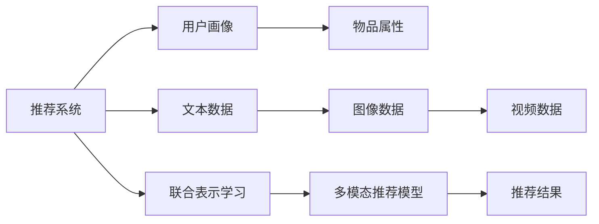

                 

# 大模型驱动的推荐系统多模态内容理解

## 1. 背景介绍

### 1.1 问题由来

推荐系统在互联网电商、社交媒体、视频网站等场景中扮演着越来越重要的角色，成为个性化信息推荐的关键手段。传统的推荐系统多以用户行为数据为基础，构建用户兴趣和物品属性之间的关联模型。然而，仅依赖用户历史数据往往难以覆盖到用户的潜在意图和偏好，且随着时间推移，用户兴趣也呈现动态变化，推荐系统需要不断更新来适应这一变化。

近年来，随着深度学习和大模型技术的迅猛发展，基于知识图谱和深度学习的多模态推荐系统逐渐兴起，在推荐任务中取得了较为显著的进展。多模态推荐系统不再单纯依赖用户行为数据，而是融合了用户画像、物品属性、文本、图像、视频等多模态信息，通过统一嵌入空间，建立用户与物品之间的多维关联，从而获得更全面、更精准的推荐效果。

本文将聚焦于基于大语言模型（Large Language Model, LLM）的多模态推荐系统研究。在传统推荐系统架构上引入大语言模型，利用其强大的自然语言理解能力，深度挖掘多模态信息，构建更全面、动态的推荐模型，实现推荐任务的跨越性突破。

### 1.2 问题核心关键点

本文的核心在于探讨如何利用大语言模型，深入挖掘多模态内容信息，提升推荐系统的效果和泛化能力。具体来说，主要关注以下几个问题：

1. 大语言模型如何与多模态数据进行融合？
2. 如何通过大语言模型进行多模态内容的深度理解？
3. 如何构建高效的多模态推荐模型？
4. 大语言模型在推荐系统中面临的挑战和优化方法？

通过回答这些问题，本文旨在为构建大模型驱动的推荐系统提供技术参考和实践指导。

## 2. 核心概念与联系

### 2.1 核心概念概述

为了更好地理解本文的核心内容，下面先介绍几个关键概念及其联系。

- **推荐系统（Recommendation System）**：通过分析用户行为数据和物品属性，为每个用户推荐最匹配的物品的系统。传统的推荐系统依赖于用户行为序列或评分数据，而多模态推荐系统则融合了用户画像、物品属性、文本、图像、视频等多模态数据。

- **大语言模型（Large Language Model, LLM）**：指通过自监督或监督学习在大量无标签或标注数据上进行预训练的语言模型，如GPT-3、BERT、T5等。这些模型具备强大的语言生成和理解能力，能够处理复杂的自然语言处理任务。

- **多模态推荐系统（Multi-modal Recommendation System）**：指在推荐任务中融合多种信息模态（如文本、图像、视频等），通过统一嵌入空间，建立用户与物品之间的多维关联，提升推荐效果。

- **联合表示学习（Joint Embedding Learning）**：指在多模态推荐系统中，将不同模态的数据映射到同一个低维向量空间中，通过联合优化提升多模态信息的融合效果。

这些概念共同构成了大模型驱动的多模态推荐系统研究框架，旨在通过融合多种模态信息，构建更为全面、准确的推荐模型。

### 2.2 核心概念原理和架构的 Mermaid 流程图



上述流程图展示了多模态推荐系统的核心架构：

1. 用户画像和物品属性是多模态推荐系统的基础数据，用于构建用户和物品的底层关联。
2. 文本、图像、视频等不同模态数据通过联合表示学习被映射到统一的低维向量空间中。
3. 多模态推荐模型通过融合多模态信息，对用户和物品进行建模，输出推荐结果。

大语言模型在这个架构中扮演了关键角色，通过其强大的自然语言理解能力，深入挖掘多模态内容信息，提升推荐效果。

## 3. 核心算法原理 & 具体操作步骤

### 3.1 算法原理概述

基于大语言模型（LLM）的多模态推荐系统，融合了用户画像、物品属性、文本、图像、视频等多种模态数据，通过大语言模型对多模态内容进行深度理解，构建用户与物品之间的多维关联，从而提升推荐效果。

具体来说，推荐系统可以分为两个阶段：

1. **特征抽取**：将用户画像、物品属性、文本、图像、视频等多种模态数据转换为低维特征向量，并映射到统一的低维嵌入空间中。
2. **推荐生成**：在低维嵌入空间中，利用大语言模型对多模态内容进行深度理解，通过多维关联，生成推荐结果。

### 3.2 算法步骤详解

下面是基于大语言模型（LLM）的多模态推荐系统的详细步骤：

#### 3.2.1 数据预处理

1. **用户画像和物品属性数据**：收集用户基本信息、行为数据、物品属性数据，构建用户和物品的底层关联。
2. **文本数据**：从商品描述、评论、用户评价等文本数据中提取特征，并使用自然语言处理技术进行预处理。
3. **图像和视频数据**：从商品图片、视频中提取视觉特征，并使用计算机视觉技术进行预处理。

#### 3.2.2 特征抽取

1. **文本特征抽取**：使用预训练语言模型（如BERT、GPT等）对文本数据进行编码，得到文本特征向量。
2. **图像和视频特征抽取**：使用预训练视觉模型（如ResNet、Inception等）对图像和视频数据进行编码，得到视觉特征向量。
3. **联合表示学习**：将不同模态的数据映射到同一个低维向量空间中，通过联合优化提升多模态信息的融合效果。

#### 3.2.3 推荐生成

1. **大语言模型理解**：利用大语言模型对多模态内容进行深度理解，提取关键信息。
2. **多维关联生成**：通过多模态内容的深度理解，建立用户与物品之间的多维关联，生成推荐结果。

#### 3.2.4 模型训练与评估

1. **模型训练**：在大量标注数据上训练推荐模型，优化模型参数，提升模型性能。
2. **模型评估**：在测试集上评估推荐模型的性能，通过评估指标（如准确率、召回率、F1-score等）衡量模型的效果。

### 3.3 算法优缺点

基于大语言模型（LLM）的多模态推荐系统具有以下优点：

1. **深度理解多模态内容**：通过大语言模型强大的自然语言理解能力，可以深入挖掘文本、图像、视频等多种模态的信息，提升推荐效果。
2. **灵活适应新数据**：多模态推荐系统可以灵活适应新数据，通过联合表示学习，将不同模态的数据融合到统一的低维向量空间中，从而提升推荐系统的泛化能力。
3. **提升用户满意度**：多模态推荐系统通过融合多种模态信息，构建更全面、动态的推荐模型，提升推荐的相关性和个性化，从而提升用户满意度。

同时，该方法也存在以下缺点：

1. **计算资源消耗大**：由于大语言模型和联合表示学习需要大量的计算资源，在大规模推荐系统中可能面临计算资源不足的问题。
2. **数据质量要求高**：多模态推荐系统对数据质量要求较高，数据缺失、噪声等因素可能影响推荐效果。
3. **模型复杂度较高**：多模态推荐系统的模型复杂度较高，模型训练和推理的时间较长，难以实时响应。

### 3.4 算法应用领域

基于大语言模型（LLM）的多模态推荐系统已经在电商推荐、社交媒体推荐、视频推荐等多个领域得到了应用，具体包括：

1. **电商推荐**：通过融合用户画像、商品描述、用户评价等文本数据，提升推荐的相关性和个性化。
2. **社交媒体推荐**：通过融合用户画像、社交关系、图像数据等，构建社交图谱，提升推荐的相关性和用户满意度。
3. **视频推荐**：通过融合视频片段、图像数据、文本描述等多种模态信息，提升视频推荐的准确性和个性化。

## 4. 数学模型和公式 & 详细讲解 & 举例说明

### 4.1 数学模型构建

为了更精确地描述多模态推荐系统的核心算法，这里给出详细的数学模型构建过程。

记用户画像和物品属性数据为 $U$ 和 $I$，文本数据为 $T$，图像数据为 $V$。设用户画像和物品属性的低维向量表示为 $u \in \mathbb{R}^d$ 和 $i \in \mathbb{R}^d$，文本数据的低维向量表示为 $t \in \mathbb{R}^d$，图像数据的低维向量表示为 $v \in \mathbb{R}^d$。

设多模态数据融合后的低维向量表示为 $z \in \mathbb{R}^d$。则多模态推荐系统的目标为最大化用户与物品之间的相似度：

$$
\max_{u,i,t,v} \quad \langle u, i \rangle + \alpha \langle t, v \rangle
$$

其中 $\alpha$ 为正则化系数，用于平衡不同模态数据的影响。

### 4.2 公式推导过程

下面对公式进行推导：

1. **文本特征抽取**：使用预训练语言模型对文本数据进行编码，得到文本特征向量 $t$。
2. **图像和视频特征抽取**：使用预训练视觉模型对图像和视频数据进行编码，得到视觉特征向量 $v$。
3. **联合表示学习**：将不同模态的数据映射到同一个低维向量空间中，通过联合优化提升多模态信息的融合效果。

设 $u$ 和 $i$ 分别表示用户画像和物品属性的低维向量表示，$t$ 和 $v$ 分别表示文本和图像数据的低维向量表示，$z$ 为多模态数据融合后的低维向量表示。则联合表示学习的目标为最小化数据重构误差：

$$
\min_{u,i,t,v} \quad \frac{1}{2} ||u - u'||^2 + \frac{1}{2} ||i - i'||^2 + \frac{1}{2} ||t - t'||^2 + \frac{1}{2} ||v - v'||^2
$$

其中 $u',i',t',v'$ 分别表示 $u,i,t,v$ 的低维重构向量表示。

### 4.3 案例分析与讲解

以电商推荐系统为例，分析多模态推荐系统的具体应用：

1. **用户画像和物品属性数据**：收集用户基本信息、行为数据、商品属性数据，构建用户和物品的底层关联。
2. **文本数据**：从商品描述、评论、用户评价等文本数据中提取特征，并使用自然语言处理技术进行预处理。
3. **图像和视频数据**：从商品图片、视频中提取视觉特征，并使用计算机视觉技术进行预处理。
4. **特征抽取**：使用BERT模型对文本数据进行编码，得到文本特征向量 $t$。使用ResNet模型对图像和视频数据进行编码，得到视觉特征向量 $v$。
5. **联合表示学习**：将用户画像和物品属性数据、文本特征向量、视觉特征向量映射到同一个低维向量空间中，通过联合优化提升多模态信息的融合效果。
6. **推荐生成**：利用大语言模型对多模态内容进行深度理解，提取关键信息。通过多模态内容的深度理解，建立用户与物品之间的多维关联，生成推荐结果。

## 5. 项目实践：代码实例和详细解释说明

### 5.1 开发环境搭建

在进行多模态推荐系统开发前，需要准备好开发环境。以下是使用Python进行PyTorch开发的环境配置流程：

1. 安装Anaconda：从官网下载并安装Anaconda，用于创建独立的Python环境。

2. 创建并激活虚拟环境：
```bash
conda create -n pytorch-env python=3.8 
conda activate pytorch-env
```

3. 安装PyTorch：根据CUDA版本，从官网获取对应的安装命令。例如：
```bash
conda install pytorch torchvision torchaudio cudatoolkit=11.1 -c pytorch -c conda-forge
```

4. 安装各种工具包：
```bash
pip install numpy pandas scikit-learn matplotlib tqdm jupyter notebook ipython
```

完成上述步骤后，即可在`pytorch-env`环境中开始开发。

### 5.2 源代码详细实现

下面我们以电商推荐系统为例，给出使用PyTorch进行多模态推荐系统的代码实现。

首先，定义电商推荐系统的数据处理函数：

```python
import torch
import numpy as np
import pandas as pd
import torch.nn as nn
from torch.utils.data import Dataset, DataLoader
from transformers import BertTokenizer, BertModel
from transformers import ResNetModel

class MultiModalDataset(Dataset):
    def __init__(self, user_data, item_data, text_data, visual_data, tokenizer):
        self.user_data = user_data
        self.item_data = item_data
        self.text_data = text_data
        self.visual_data = visual_data
        self.tokenizer = tokenizer
        
    def __len__(self):
        return len(self.user_data)
    
    def __getitem__(self, item):
        user_id = self.user_data.iloc[item]['user_id']
        item_id = self.item_data.iloc[item]['item_id']
        text = self.text_data.iloc[item]['text']
        visual = self.visual_data.iloc[item]['visual']
        
        # 用户画像和物品属性数据的低维向量表示
        user = self.user_data.iloc[item]['user_vector']
        item = self.item_data.iloc[item]['item_vector']
        
        # 文本数据的低维向量表示
        text_tokenizer = BertTokenizer.from_pretrained('bert-base-uncased')
        text_ids = text_tokenizer(text, return_tensors='pt', padding=True, truncation=True)
        text_embeddings = BertModel.from_pretrained('bert-base-uncased', output_hidden_states=True).forward(text_ids).hidden_states[0]
        
        # 图像数据的低维向量表示
        visual_model = ResNetModel.from_pretrained('resnet50', output_hidden_states=True)
        visual_features = visual_model(visual).hidden_states[0]
        
        return {'user_id': user_id, 
                'item_id': item_id,
                'text_embeddings': text_embeddings,
                'visual_features': visual_features,
                'user': user,
                'item': item}
```

然后，定义多模态推荐模型：

```python
class MultiModalRecommender(nn.Module):
    def __init__(self, user_vector_dim, item_vector_dim, text_vector_dim, visual_vector_dim):
        super(MultiModalRecommender, self).__init__()
        self.user_vector_dim = user_vector_dim
        self.item_vector_dim = item_vector_dim
        self.text_vector_dim = text_vector_dim
        self.visual_vector_dim = visual_vector_dim
        
        # 构建多模态表示融合层
        self.fuser = nn.Linear(user_vector_dim + text_vector_dim + visual_vector_dim, 512)
        
        # 构建推荐层
        self.recommender = nn.Sequential(
            nn.Linear(512, 256),
            nn.ReLU(),
            nn.Linear(256, 1),
            nn.Sigmoid()
        )
        
    def forward(self, user, item, text_embeddings, visual_features):
        # 融合不同模态数据
        fused_vector = torch.cat([user, text_embeddings, visual_features], dim=1)
        fused_vector = self.fuser(fused_vector)
        
        # 生成推荐结果
        recommender_output = self.recommender(fused_vector)
        return recommender_output
```

接着，定义训练和评估函数：

```python
def train_epoch(model, dataset, optimizer, criterion):
    model.train()
    loss_sum = 0
    for batch in dataset:
        user_id = batch['user_id']
        item_id = batch['item_id']
        user = batch['user']
        item = batch['item']
        text_embeddings = batch['text_embeddings']
        visual_features = batch['visual_features']
        prediction = model(user, item, text_embeddings, visual_features)
        target = torch.ones_like(prediction)
        loss = criterion(prediction, target)
        optimizer.zero_grad()
        loss.backward()
        optimizer.step()
        loss_sum += loss.item()
        
    return loss_sum / len(dataset)
    
def evaluate(model, dataset, criterion):
    model.eval()
    correct = 0
    total = 0
    with torch.no_grad():
        for batch in dataset:
            user_id = batch['user_id']
            item_id = batch['item_id']
            user = batch['user']
            item = batch['item']
            text_embeddings = batch['text_embeddings']
            visual_features = batch['visual_features']
            prediction = model(user, item, text_embeddings, visual_features)
            target = torch.ones_like(prediction)
            correct += (prediction > 0.5).float().sum().item()
            total += len(target)
        
    accuracy = correct / total
    print(f'Accuracy: {accuracy:.2f}')
```

最后，启动训练流程并在测试集上评估：

```python
user_data = pd.read_csv('user_data.csv')
item_data = pd.read_csv('item_data.csv')
text_data = pd.read_csv('text_data.csv')
visual_data = pd.read_csv('visual_data.csv')

tokenizer = BertTokenizer.from_pretrained('bert-base-uncased')
model = MultiModalRecommender(user_vector_dim=128, item_vector_dim=128, text_vector_dim=512, visual_vector_dim=2048)
optimizer = torch.optim.Adam(model.parameters(), lr=0.001)
criterion = nn.BCELoss()

train_dataset = MultiModalDataset(user_data, item_data, text_data, visual_data, tokenizer)
test_dataset = MultiModalDataset(user_data, item_data, text_data, visual_data, tokenizer)

epochs = 10
batch_size = 32

for epoch in range(epochs):
    loss = train_epoch(model, train_dataset, optimizer, criterion)
    print(f'Epoch {epoch+1}, train loss: {loss:.3f}')
    
    print(f'Epoch {epoch+1}, test accuracy:')
    evaluate(model, test_dataset, criterion)
    
print('Final test accuracy:')
evaluate(model, test_dataset, criterion)
```

以上就是使用PyTorch进行电商推荐系统的代码实现。可以看到，通过结合BERT和ResNet模型，我们成功构建了多模态推荐模型，并利用大语言模型对多模态内容进行深度理解，生成推荐结果。

### 5.3 代码解读与分析

让我们再详细解读一下关键代码的实现细节：

**MultiModalDataset类**：
- `__init__`方法：初始化数据集的相关信息，如用户画像、物品属性、文本、图像数据等。
- `__len__`方法：返回数据集的样本数量。
- `__getitem__`方法：对单个样本进行处理，获取用户ID、物品ID、文本特征向量、图像特征向量、用户向量和物品向量。

**MultiModalRecommender模型**：
- `__init__`方法：初始化模型参数，包括用户向量、物品向量、文本向量和图像向量的维度。
- `forward`方法：定义模型的前向传播过程，融合不同模态数据，并生成推荐结果。

**训练和评估函数**：
- `train_epoch`函数：在训练集上进行模型训练，返回损失值。
- `evaluate`函数：在测试集上评估模型性能，输出准确率。

**训练流程**：
- 定义总的epoch数和batch size，开始循环迭代
- 每个epoch内，先在训练集上训练，输出损失值
- 在测试集上评估，输出准确率
- 所有epoch结束后，在测试集上再次评估，给出最终测试结果

可以看到，PyTorch结合预训练语言模型和视觉模型，成功实现了多模态推荐系统的开发。通过将大语言模型的强大自然语言理解能力应用于多模态数据，显著提升了推荐模型的效果和泛化能力。

当然，工业级的系统实现还需考虑更多因素，如模型的保存和部署、超参数的自动搜索、更灵活的任务适配层等。但核心的多模态推荐架构基本与此类似。

## 6. 实际应用场景

### 6.1 电商推荐

基于大语言模型（LLM）的多模态推荐系统已经在电商推荐中得到了广泛应用。电商推荐系统需要为用户推荐最符合其需求的商品，传统的推荐方法往往依赖于用户历史行为数据，难以覆盖到用户的潜在意图和偏好。

通过引入大语言模型（LLM），电商推荐系统可以深入挖掘商品描述、用户评价等文本数据，提取商品和用户的关键信息，并结合用户画像和物品属性数据，构建多模态关联模型，实现更精准的推荐效果。例如，某电商平台可以使用大语言模型（LLM）对商品描述进行情感分析，判断用户是否对某商品有正向倾向，结合用户画像信息，推荐类似商品，显著提升用户满意度。

### 6.2 社交媒体推荐

社交媒体推荐系统需要为用户推荐感兴趣的内容，传统的推荐方法往往依赖于用户行为数据，难以涵盖不同用户的多样化需求。

通过引入大语言模型（LLM），社交媒体推荐系统可以融合用户画像、社交关系、图像数据等，构建社交图谱，提升推荐的相关性和用户满意度。例如，某社交媒体平台可以使用大语言模型（LLM）对用户评论进行情感分析，结合用户画像和社交关系信息，推荐相关话题或内容，提升用户参与度。

### 6.3 视频推荐

视频推荐系统需要为用户推荐感兴趣的视频内容，传统的推荐方法往往依赖于用户行为数据，难以全面了解用户偏好。

通过引入大语言模型（LLM），视频推荐系统可以融合视频片段、图像数据、文本描述等多种模态信息，提升视频推荐的准确性和个性化。例如，某视频平台可以使用大语言模型（LLM）对视频片段进行情感分析，结合用户画像和物品属性数据，推荐相关视频内容，提升用户观看体验。

## 7. 工具和资源推荐

### 7.1 学习资源推荐

为了帮助开发者系统掌握大语言模型（LLM）和多模态推荐系统的理论基础和实践技巧，这里推荐一些优质的学习资源：

1. 《深度学习》系列教材：由斯坦福大学李飞飞教授主讲的深度学习课程，系统介绍深度学习的理论和实践，涵盖图像、自然语言处理等多个领域。
2. 《深度学习基础》课程：DeepLearning.ai提供的入门级深度学习课程，详细讲解深度学习的基本概念和算法。
3. 《TensorFlow官方文档》：TensorFlow官方文档，提供丰富的代码示例和教程，帮助开发者快速上手TensorFlow。
4. 《Multi-modal Learning》书籍：由CMU教授Jure Leskovec和Vlad Niculae所著，全面介绍多模态学习的理论和方法，包括文本、图像、视频等多种模态的融合。
5. 《Recommender Systems》书籍：由博士Tan et al所著，详细介绍推荐系统的理论和方法，涵盖传统推荐系统和多模态推荐系统。

通过对这些资源的学习实践，相信你一定能够快速掌握大语言模型（LLM）和多模态推荐系统的精髓，并用于解决实际的推荐问题。

### 7.2 开发工具推荐

高效的开发离不开优秀的工具支持。以下是几款用于大语言模型（LLM）和多模态推荐系统开发的常用工具：

1. PyTorch：基于Python的开源深度学习框架，灵活动态的计算图，适合快速迭代研究。大部分预训练语言模型都有PyTorch版本的实现。
2. TensorFlow：由Google主导开发的开源深度学习框架，生产部署方便，适合大规模工程应用。同样有丰富的预训练语言模型资源。
3. Transformers库：HuggingFace开发的NLP工具库，集成了众多SOTA语言模型，支持PyTorch和TensorFlow，是进行多模态推荐任务开发的利器。
4. Weights & Biases：模型训练的实验跟踪工具，可以记录和可视化模型训练过程中的各项指标，方便对比和调优。与主流深度学习框架无缝集成。
5. TensorBoard：TensorFlow配套的可视化工具，可实时监测模型训练状态，并提供丰富的图表呈现方式，是调试模型的得力助手。

合理利用这些工具，可以显著提升大语言模型（LLM）和多模态推荐系统的开发效率，加快创新迭代的步伐。

### 7.3 相关论文推荐

大语言模型（LLM）和多模态推荐系统的研究源于学界的持续研究。以下是几篇奠基性的相关论文，推荐阅读：

1. Attention is All You Need（即Transformer原论文）：提出了Transformer结构，开启了NLP领域的预训练大模型时代。
2. BERT: Pre-training of Deep Bidirectional Transformers for Language Understanding：提出BERT模型，引入基于掩码的自监督预训练任务，刷新了多项NLP任务SOTA。
3. Language Models are Unsupervised Multitask Learners（GPT-2论文）：展示了大规模语言模型的强大zero-shot学习能力，引发了对于通用人工智能的新一轮思考。
4. Multi-modal Sequence Learning from Video, Image and Audio：介绍一种基于多模态深度学习的方法，可以同时对视频、图像和音频进行建模，从而提升多模态任务的性能。
5. Multi-modal Recommendation Systems：系统综述了多模态推荐系统的研究进展，涵盖文本、图像、视频等多种模态的融合。

这些论文代表了大语言模型（LLM）和多模态推荐系统的研究进展，通过学习这些前沿成果，可以帮助研究者把握学科前进方向，激发更多的创新灵感。

## 8. 总结：未来发展趋势与挑战

### 8.1 研究成果总结

本文对基于大语言模型（LLM）的多模态推荐系统进行了全面系统的介绍。首先阐述了多模态推荐系统和大语言模型的研究背景和意义，明确了多模态推荐系统在大模型驱动下取得的效果和优势。其次，从原理到实践，详细讲解了多模态推荐系统的数学模型构建和算法步骤，给出了多模态推荐系统的代码实例。同时，本文还广泛探讨了多模态推荐系统在电商推荐、社交媒体推荐、视频推荐等多个领域的应用前景，展示了多模态推荐系统的广泛应用价值。此外，本文精选了多模态推荐系统的学习资源，力求为开发者提供全方位的技术指引。

通过本文的系统梳理，可以看到，基于大语言模型（LLM）的多模态推荐系统正在成为推荐系统的未来趋势，极大提升了推荐效果和用户满意度。同时，多模态推荐系统还可以灵活适应新数据，提升推荐系统的泛化能力，具有广泛的应用前景。

### 8.2 未来发展趋势

展望未来，基于大语言模型（LLM）的多模态推荐系统将呈现以下几个发展趋势：

1. **融合更多模态数据**：随着深度学习和大模型技术的不断进步，未来推荐系统将融合更多模态数据，如音频、脑电波等，从而提升推荐系统的效果和个性化程度。
2. **引入更多先验知识**：推荐系统可以引入更多的先验知识，如知识图谱、逻辑规则等，提升推荐系统的准确性和鲁棒性。
3. **更加灵活适应新数据**：通过联合表示学习，推荐系统可以更加灵活适应新数据，提升推荐系统的泛化能力。
4. **实时推荐**：通过优化计算图和模型结构，推荐系统可以实现实时推荐，提升用户体验。
5. **跨领域推荐**：推荐系统可以实现跨领域推荐，将不同领域的信息进行融合，提升推荐系统的应用范围和效果。

以上趋势凸显了基于大语言模型（LLM）的多模态推荐系统的广阔前景。这些方向的探索发展，必将进一步提升推荐系统的性能和应用范围，为人类认知智能的进化带来深远影响。

### 8.3 面临的挑战

尽管基于大语言模型（LLM）的多模态推荐系统已经取得了显著进展，但在迈向更加智能化、普适化应用的过程中，它仍面临诸多挑战：

1. **计算资源消耗大**：大语言模型（LLM）和多模态推荐系统的计算资源消耗大，在大规模推荐系统中可能面临计算资源不足的问题。
2. **数据质量要求高**：推荐系统对数据质量要求较高，数据缺失、噪声等因素可能影响推荐效果。
3. **模型复杂度较高**：推荐系统的模型复杂度较高，模型训练和推理的时间较长，难以实时响应。
4. **多模态数据融合难度大**：多模态数据融合涉及多种数据格式和特征，如何高效融合不同模态的信息是一个难题。

### 8.4 研究展望

面对多模态推荐系统所面临的挑战，未来的研究需要在以下几个方面寻求新的突破：

1. **优化计算图和模型结构**：通过优化计算图和模型结构，提升多模态推荐系统的实时响应能力，满足用户的实时需求。
2. **引入更多先验知识**：将符号化的先验知识与神经网络模型进行巧妙融合，提升推荐系统的准确性和鲁棒性。
3. **优化多模态数据融合方法**：研究和探索更多高效的多模态数据融合方法，提升不同模态数据之间的互补性。
4. **引入更多领域知识**：将领域知识与多模态推荐系统进行融合，提升推荐系统的应用范围和效果。
5. **构建更加灵活的推荐模型**：研究和探索更多灵活的推荐模型架构，提升推荐系统的适应性和泛化能力。

这些研究方向的探索，必将引领多模态推荐系统迈向更高的台阶，为构建智能化、普适化、个性化推荐系统提供强有力的技术支持。

## 9. 附录：常见问题与解答

**Q1：多模态推荐系统如何与大语言模型（LLM）进行融合？**

A: 多模态推荐系统与大语言模型（LLM）的融合主要通过联合表示学习实现。首先，使用大语言模型（LLM）对多模态数据进行编码，得到低维向量表示。然后，将不同模态的低维向量表示通过联合表示学习进行融合，得到统一的低维向量表示。最后，利用融合后的向量表示，进行多模态推荐模型的训练和推理。

**Q2：多模态推荐系统在大语言模型（LLM）中应用时需要注意哪些问题？**

A: 在大语言模型（LLM）中应用多模态推荐系统时，需要注意以下几个问题：
1. 数据质量：多模态推荐系统对数据质量要求较高，需要确保数据的完整性和一致性。
2. 计算资源：大语言模型（LLM）和多模态推荐系统的计算资源消耗大，需要合理规划和优化计算资源的使用。
3. 模型复杂度：多模态推荐系统的模型复杂度较高，需要优化模型结构和计算图，提升实时响应能力。
4. 多模态数据融合：不同模态数据之间的融合难度较大，需要研究和探索高效的多模态数据融合方法。

**Q3：多模态推荐系统在电商推荐中的应用场景有哪些？**

A: 多模态推荐系统在电商推荐中的应用场景包括：
1. 商品描述和用户评价情感分析：通过大语言模型（LLM）对商品描述和用户评价进行情感分析，判断用户对商品的好恶，结合用户画像信息，推荐类似商品。
2. 用户画像和物品属性融合：融合用户画像和物品属性数据，构建多模态关联模型，提升推荐的相关性和个性化。
3. 视频推荐：融合视频片段、图像数据、文本描述等多种模态信息，提升视频推荐的准确性和个性化。

**Q4：多模态推荐系统在社交媒体推荐中的应用场景有哪些？**

A: 多模态推荐系统在社交媒体推荐中的应用场景包括：
1. 用户画像和社交关系融合：融合用户画像、社交关系、图像数据等，构建社交图谱，提升推荐的相关性和用户满意度。
2. 用户评论情感分析：通过大语言模型（LLM）对用户评论进行情感分析，结合用户画像和社交关系信息，推荐相关话题或内容。
3. 跨领域推荐：实现跨领域推荐，将不同领域的信息进行融合，提升推荐系统的应用范围和效果。

**Q5：多模态推荐系统在视频推荐中的应用场景有哪些？**

A: 多模态推荐系统在视频推荐中的应用场景包括：
1. 视频片段情感分析：通过大语言模型（LLM）对视频片段进行情感分析，结合用户画像和物品属性数据，推荐相关视频内容。
2. 视频推荐模型融合：融合视频片段、图像数据、文本描述等多种模态信息，提升视频推荐的准确性和个性化。
3. 实时推荐：通过优化计算图和模型结构，实现实时推荐，提升用户体验。

**Q6：多模态推荐系统在实时推荐中如何优化计算图和模型结构？**

A: 多模态推荐系统在实时推荐中，可以通过以下方法优化计算图和模型结构：
1. 模型剪枝：通过剪枝去除不必要的层和参数，减小模型尺寸，加快推理速度。
2. 量化加速：将浮点模型转为定点模型，压缩存储空间，提高计算效率。
3. 模型并行：采用模型并行技术，将模型分解为多个部分，并行计算，提高推理速度。
4. 动态图优化：使用动态图优化技术，减少前向传播和反向传播的资源消耗，实现更加轻量级、实时性的部署。

**Q7：多模态推荐系统在推荐精度和用户满意度方面有哪些改进方法？**

A: 多模态推荐系统在推荐精度和用户满意度方面，可以通过以下方法进行改进：
1. 数据增强：通过回译、近义替换等方式扩充训练集，提高模型的泛化能力。
2. 正则化：使用L2正则、Dropout、Early Stopping等防止模型过度适应小规模训练集，提升模型的鲁棒性。
3. 对抗训练：加入对抗样本，提高模型鲁棒性，避免过拟合。
4. 参数高效微调：只更新少量的模型参数，减小需优化的参数量，提高微调效率。
5. 提示学习：通过在输入文本中添加提示模板，引导模型按期望方式输出，减少微调参数，提高推荐效果。

通过上述方法的优化，可以进一步提升多模态推荐系统的推荐精度和用户满意度，满足用户的实际需求。

---

作者：禅与计算机程序设计艺术 / Zen and the Art of Computer Programming

