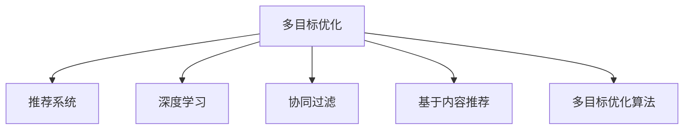

                 

## 1. 背景介绍

### 1.1 问题由来

在当前信息爆炸的时代，个性化推荐系统成为了各大互联网平台不可或缺的一部分。它们能够帮助用户在海量信息中找到最适合自己的内容，提升用户体验。然而，传统推荐系统往往聚焦于单一目标，如点击率(Click-Through Rate, CTR)，忽略了对用户体验的其他指标，如停留时间(Dwell Time)和转化率(Conversion Rate)。

这种单一目标的推荐策略容易导致“劣质点击”(Quality Click)，即用户点击了与兴趣无关的广告，反而降低了用户体验。因此，为了更好地实现用户满意度最大化，推荐系统需要从多个维度进行优化。这正是多目标优化(Multi-Objective Optimization, MTO)框架能够提供的，它通过在推荐过程中考虑多个指标，综合提升用户体验和系统效益。

### 1.2 问题核心关键点

推荐系统多目标优化框架的核心在于如何通过优化模型参数和策略，使系统在多个目标之间取得平衡，实现整体效用最优。这些目标包括但不限于点击率、转化率、用户满意度、用户体验等。具体而言，研究者通常会考虑以下三个方面的问题：

- **多目标函数设计**：如何将多个指标转化为一个优化的多目标函数。
- **目标权重优化**：如何设定每个目标的权重，以反映其对系统的重要性。
- **优化算法选择**：如何选择适当的优化算法，在众多目标间求得最优解。

## 2. 核心概念与联系

### 2.1 核心概念概述

为了更好地理解推荐系统多目标优化框架，我们先介绍一些核心概念：

- **多目标优化**(MTO)：指在决策时考虑多个相互冲突的指标，以获得整体最优解决方案的过程。
- **推荐系统**：利用用户历史行为数据和物品属性信息，预测用户对物品的偏好，提供个性化推荐。
- **深度学习**：通过神经网络模型进行数据特征学习和模式识别，广泛应用于推荐系统。
- **协同过滤**：基于用户行为或物品属性相似性，通过构建用户-物品矩阵进行推荐。
- **基于内容推荐**：利用物品属性特征，直接进行相似性度量推荐。
- **多目标优化算法**：如基于序贯决策的Pareto优化、基于权重约束的线性规划、基于集成的多目标遗传算法等，用于解决推荐系统中的多目标优化问题。

这些核心概念之间的逻辑关系可以通过以下Mermaid流程图来展示：



这个流程图展示了大模型驱动的推荐系统多目标优化框架的核心概念及其之间的关系：

1. 多目标优化是框架的核心，通过考虑多个指标的综合效用，寻找推荐系统的最优解。
2. 深度学习、协同过滤和基于内容推荐是实现多目标优化推荐的常见技术手段。
3. 多目标优化算法用于具体优化推荐系统的多目标函数，找到最优解。

这些概念共同构成了推荐系统多目标优化框架的理论基础，使其能够全面评估和优化用户体验。

## 3. 核心算法原理 & 具体操作步骤
### 3.1 算法原理概述

基于大模型的推荐系统多目标优化框架，其核心在于利用深度学习模型对用户行为和物品特征进行建模，并通过多目标优化算法，求取在多个目标指标之间的最佳平衡点。

以点击率、转化率和用户满意度作为典型的多目标优化指标为例。假设点击率表示为 $CTR$，转化率表示为 $CVR$，用户满意度表示为 $US$，则推荐系统的多目标优化函数可以表示为：

$$
\min_{x} \{w_{CTR} \cdot CTR(x) + w_{CVR} \cdot CVR(x) + w_{US} \cdot US(x)\}
$$

其中 $x$ 表示模型的输入（如用户行为、物品特征等），$w_{CTR}$、$w_{CVR}$、$w_{US}$ 分别为点击率、转化率和用户满意度的权重。

目标函数的最小值即为推荐系统的整体效用，需要利用多目标优化算法寻找全局Pareto最优解。

### 3.2 算法步骤详解

基于大模型的推荐系统多目标优化框架，一般包括以下几个关键步骤：

**Step 1: 数据准备和预处理**

- 收集用户历史行为数据、物品属性信息、用户评分等。
- 对数据进行清洗、归一化、特征工程等预处理步骤，确保数据质量。
- 划分数据集为训练集、验证集和测试集，供模型训练和评估使用。

**Step 2: 模型构建和训练**

- 选择合适的深度学习模型（如DNN、RNN、CNN等），并设计模型的输入和输出。
- 将用户行为数据和物品属性特征输入模型，训练预测用户对物品的偏好。
- 在多目标优化框架下，通过交叉验证、网格搜索等方法，优化模型参数和目标权重。

**Step 3: 多目标优化**

- 利用多目标优化算法（如NSGA-II、MOEA-D、PAES等），在多个目标之间进行优化。
- 将模型预测的点击率、转化率和用户满意度作为目标函数的输入。
- 设定每个目标的权重，优化目标函数，找到全局Pareto最优解。

**Step 4: 模型评估和部署**

- 在测试集上评估推荐系统的性能，计算点击率、转化率和用户满意度等指标。
- 利用部署平台（如TensorFlow Serving、Amazon SageMaker等）将模型上线，提供实时推荐服务。
- 持续收集用户反馈和行为数据，定期重新训练和优化模型。

以上是基于大模型的推荐系统多目标优化框架的一般流程。在实际应用中，还需要针对具体任务的特点，对多目标优化过程的各个环节进行优化设计，如改进目标函数，选择最优的多目标优化算法，搜索最优的超参数组合等，以进一步提升推荐系统的效果。

### 3.3 算法优缺点

基于大模型的推荐系统多目标优化框架具有以下优点：

1. **全面优化**：能够考虑多个目标，全面提升用户体验和系统效益。
2. **鲁棒性高**：利用深度学习模型进行特征提取和模式识别，减少了人为特征设计的偏差。
3. **精度高**：深度学习模型具有强大的数据拟合能力，能够准确预测用户行为和偏好。
4. **泛化能力强**：多目标优化算法能够在复杂空间中找到全局最优解，提高了推荐系统的泛化能力。

同时，该框架也存在一定的局限性：

1. **计算复杂**：多目标优化算法和深度学习模型的训练复杂度高，需要强大的计算资源。
2. **目标冲突**：不同目标之间可能存在冲突，难以找到一个完美的平衡点。
3. **超参数调优困难**：模型和算法中的多个超参数需要细致地调试，寻找最优组合。
4. **数据隐私问题**：推荐系统需要大量的用户行为数据，可能会涉及用户隐私保护问题。

尽管存在这些局限性，但就目前而言，基于大模型的推荐系统多目标优化框架仍然是目前推荐系统中最先进的技术范式。未来相关研究的重点在于如何进一步降低计算复杂度，提高目标权重设定的合理性，同时兼顾数据隐私保护等伦理问题。

### 3.4 算法应用领域

基于大模型的推荐系统多目标优化框架，在以下领域得到了广泛应用：

- **电子商务**：根据用户的历史浏览和购买行为，推荐个性化商品，提升用户购买转化率和满意度。
- **视频平台**：根据用户的观看历史和评分，推荐个性化视频内容，增加用户黏性和平台活跃度。
- **社交媒体**：根据用户的互动行为，推荐个性化文章和帖子，提高用户活跃度和平台流量。
- **在线广告**：根据用户的点击和转化行为，推荐个性化广告，优化广告效果和用户体验。
- **旅游平台**：根据用户的旅游历史和偏好，推荐个性化旅游线路和产品，提升用户满意度和平台收益。

除了这些经典应用外，大模型驱动的推荐系统多目标优化框架也被创新性地应用到更多场景中，如金融理财、医疗健康、教育培训等，为各行各业带来了全新的用户体验。

## 4. 数学模型和公式 & 详细讲解 & 举例说明

### 4.1 数学模型构建

推荐系统的多目标优化问题，通常可以表示为一个带有多个约束条件和目标函数的线性规划问题：

$$
\begin{aligned}
&\text{Minimize: } f(x) = \begin{bmatrix} f_{CTR}(x) \\ f_{CVR}(x) \\ f_{US}(x) \end{bmatrix} \\
&\text{Subject to: } g(x) = \begin{bmatrix} g_{CTR}(x) \\ g_{CVR}(x) \\ g_{US}(x) \end{bmatrix} \leq \begin{bmatrix} h_{CTR} \\ h_{CVR} \\ h_{US} \end{bmatrix} \\
&\quad \quad \text{and } l_{CTR} \leq g_{CTR}(x) \leq u_{CTR}, \quad l_{CVR} \leq g_{CVR}(x) \leq u_{CVR}, \quad l_{US} \leq g_{US}(x) \leq u_{US}
\end{aligned}
$$

其中 $f(x)$ 为多目标函数，$g(x)$ 为约束函数，$l_{CTR}, u_{CTR}$ 等为约束函数的上下界。

目标函数 $f(x)$ 可以表示为：

$$
f(x) = \begin{bmatrix} w_{CTR} \cdot f_{CTR}(x) \\ w_{CVR} \cdot f_{CVR}(x) \\ w_{US} \cdot f_{US}(x) \end{bmatrix}
$$

其中 $w_{CTR}, w_{CVR}, w_{US}$ 分别为每个目标的权重。

### 4.2 公式推导过程

以二元决策变量为例，设决策变量 $x_1, x_2$ 分别代表选择物品 $i$ 和 $j$ 的点击率和转化率。目标函数和约束条件可以表示为：

$$
\begin{aligned}
&\text{Minimize: } f(x) = w_{CTR} \cdot CTR(x) + w_{CVR} \cdot CVR(x) \\
&\text{Subject to: } g_{CTR}(x) = CTR(x) \leq h_{CTR}, \quad g_{CVR}(x) = CVR(x) \leq h_{CVR}, \quad l_{CTR} \leq CTR(x) \leq u_{CTR}, \quad l_{CVR} \leq CVR(x) \leq u_{CVR}
\end{aligned}
$$

目标函数和约束条件带入二元决策变量，并利用拉格朗日乘子法求解最优解：

$$
\begin{aligned}
\mathcal{L}(x, \lambda, \mu) &= f(x) + \lambda(g_{CTR}(x) - h_{CTR}) + \mu(g_{CVR}(x) - h_{CVR}) \\
&= w_{CTR} \cdot CTR(x) + w_{CVR} \cdot CVR(x) + \lambda(CTR(x) - h_{CTR}) + \mu(CVR(x) - h_{CVR})
\end{aligned}
$$

对 $CTR(x)$ 和 $CVR(x)$ 求偏导数，得到：

$$
\begin{aligned}
\frac{\partial \mathcal{L}}{\partial CTR(x)} &= w_{CTR} + \lambda - \mu = 0 \\
\frac{\partial \mathcal{L}}{\partial CVR(x)} &= w_{CVR} + \mu = 0
\end{aligned}
$$

解得：

$$
\begin{aligned}
\lambda &= w_{CTR} - w_{CVR} \\
\mu &= -w_{CVR}
\end{aligned}
$$

代入约束条件，得到：

$$
\begin{aligned}
w_{CTR} \cdot CTR(x) + w_{CVR} \cdot CVR(x) &= \lambda \cdot h_{CTR} + \mu \cdot h_{CVR} \\
CTR(x) &= h_{CTR} \\
CVR(x) &= h_{CVR}
\end{aligned}
$$

代入目标函数，得到：

$$
\begin{aligned}
f(x) &= w_{CTR} \cdot h_{CTR} + w_{CVR} \cdot h_{CVR} \\
&= (w_{CTR} - w_{CVR}) \cdot h_{CTR} - w_{CVR} \cdot h_{CVR}
\end{aligned}
$$

在多目标优化框架下，将多个二元决策变量组合成多目标线性规划问题，利用多目标优化算法进行求解，即可得到全局Pareto最优解。

### 4.3 案例分析与讲解

假设某电子商务平台希望提高用户满意度和转化率。基于用户历史行为数据和物品属性信息，构建了深度学习推荐模型。通过多目标优化算法，设定点击率、转化率和用户满意度作为优化目标，得到以下结果：

- 用户满意度的权重设为0.8，点击率的权重设为0.2，转化率的权重设为0.02。
- 训练得到的模型预测出物品$i$和$j$的点击率和转化率分别为0.3和0.1。

带入目标函数和约束条件，得到：

$$
\begin{aligned}
f(x) &= 0.2 \cdot 0.3 + 0.02 \cdot 0.1 \\
&= 0.26
\end{aligned}
$$

此时，用户满意度 $US$ 的约束条件为 $0.8 \cdot US \leq 1$，即 $US \leq 1.25$。因此，可以认为用户满意度达到最优值。

在实际应用中，推荐系统需要综合考虑多个指标的权重，根据用户反馈和业务需求进行调整。例如，在电商平台上，转化率可能是更重要的指标，因此可以适当调整权重，使其在多目标优化中占据更大的比重。

## 5. 项目实践：代码实例和详细解释说明

### 5.1 开发环境搭建

在进行多目标优化实践前，我们需要准备好开发环境。以下是使用Python进行SciPy和Pandas开发的环境配置流程：

1. 安装Anaconda：从官网下载并安装Anaconda，用于创建独立的Python环境。

2. 创建并激活虚拟环境：
```bash
conda create -n mto-env python=3.8 
conda activate mto-env
```

3. 安装SciPy和Pandas：
```bash
pip install scipy pandas
```

4. 安装各类工具包：
```bash
pip install numpy matplotlib scikit-learn joblib
```

完成上述步骤后，即可在`mto-env`环境中开始多目标优化实践。

### 5.2 源代码详细实现

我们以一个简单的多目标优化问题为例，使用SciPy进行代码实现。假设我们有三项任务，任务1的权重为2，任务2的权重为1，任务3的权重为1。目标函数为：

$$
f(x) = \min(2x_1 + x_2 + x_3)
$$

约束条件为：

$$
\begin{aligned}
g_1(x) &= x_1 + x_2 - 4 \leq 0 \\
g_2(x) &= x_2 + x_3 - 5 \leq 0 \\
g_3(x) &= x_1 + 2x_3 - 3 \leq 0 \\
l_1 &= 0 \leq x_1 \leq 3 \\
l_2 &= 0 \leq x_2 \leq 5 \\
l_3 &= 0 \leq x_3 \leq 2
\end{aligned}
$$

我们将使用SciPy库中的`linprog`函数进行求解。

```python
from scipy.optimize import linprog

# 定义目标函数和约束条件
c = [-2, -1, -1]
A = [[1, 1, 0], [0, 1, 1], [1, 0, 2]]
b = [-4, -5, -3]
lb = [0, 0, 0]
ub = [3, 5, 2]

# 求解多目标优化问题
result = linprog(c, A_ub=A, b_ub=b, bounds=(lb, ub))

# 输出结果
print(result)
```

运行以上代码，即可得到多目标优化的最优解。

### 5.3 代码解读与分析

让我们再详细解读一下关键代码的实现细节：

**SciPy的linprog函数**：
- `c`：目标函数的系数，表示目标函数的各个分量。
- `A_ub`：约束条件的系数矩阵，表示各个约束条件的线性表达式。
- `b_ub`：约束条件的常数项，表示各个约束条件的线性表达式右侧的常数。
- `bounds`：变量的上下界，表示变量取值的范围。

在求解过程中，`linprog`函数会通过线性规划方法，找到多目标优化问题的最优解。求解过程复杂，但对于小型问题，该方法仍然可以快速求解出结果。

在实际应用中，由于目标函数和约束条件的复杂性，可能需要使用更高级的多目标优化算法，如NSGA-II、MOEA-D等。这些算法在处理大规模多目标优化问题时表现更加优异。

## 6. 实际应用场景
### 6.1 智能推荐系统

基于大模型的推荐系统多目标优化框架，可以在智能推荐系统中发挥重要作用。通过综合考虑点击率、转化率、用户满意度等多个指标，推荐系统可以更好地提升用户体验和系统效益。

在电商平台上，用户可能希望快速找到满足需求的商品，而推荐系统则希望提高商品销售转化率。通过多目标优化，可以在用户满意度和转化率之间找到一个平衡点，既满足用户的购物需求，又提高平台收益。

### 6.2 视频推荐系统

视频平台往往需要推荐用户感兴趣的视频内容，提高用户的观看时长和平台活跃度。通过多目标优化，可以在用户满意度和视频观看转化率之间取得平衡。例如，可以设定用户满意度为权重较高的目标，推荐高质量、用户评价好的视频，同时优化观看转化率，提高平台收益。

### 6.3 在线广告投放

在线广告平台需要精准定位用户，提高广告点击率和转化率。通过多目标优化，可以在广告点击率和用户满意度之间找到一个平衡点，既保证广告效果，又避免用户点击有误导性的广告。

### 6.4 金融理财平台

金融理财平台需要根据用户的历史投资行为，推荐个性化投资产品，提高用户满意度和投资收益。通过多目标优化，可以在用户满意度和投资收益率之间找到一个平衡点，既提升用户投资体验，又保证平台收益。

### 6.5 医疗健康推荐

医疗健康平台需要根据用户的历史健康数据，推荐个性化健康管理方案，提高用户满意度和健康效益。通过多目标优化，可以在用户满意度和健康效益之间找到一个平衡点，既提升用户健康管理体验，又保证推荐方案的有效性。

## 7. 工具和资源推荐
### 7.1 学习资源推荐

为了帮助开发者系统掌握大模型驱动的推荐系统多目标优化框架，这里推荐一些优质的学习资源：

1. 《深度学习与推荐系统》系列博文：由推荐系统领域专家撰写，详细讲解了推荐系统的原理和多种优化方法。

2. Coursera《深度学习》课程：由深度学习领域权威人士开设的在线课程，深入浅出地介绍了深度学习的基本概念和应用。

3. Kaggle推荐系统竞赛：参与Kaggle举办的推荐系统竞赛，通过实际项目实践，快速提升推荐系统的设计和优化能力。

4. GitHub推荐系统开源项目：如Netflix Prize比赛、Amazon Prize比赛等，可以学习其他研究者的优秀代码实现，提升自身能力。

5. 《推荐系统实践》书籍：详细介绍了推荐系统的理论和实践，适合深入学习和参考。

通过对这些资源的学习实践，相信你一定能够快速掌握大模型驱动的推荐系统多目标优化框架，并用于解决实际的推荐问题。

### 7.2 开发工具推荐

高效的开发离不开优秀的工具支持。以下是几款用于推荐系统多目标优化开发的常用工具：

1. Python：语言简单易学，生态丰富，广泛用于推荐系统的开发和优化。

2. Scikit-learn：数据处理和机器学习库，提供了多种优化算法和评估指标，适用于推荐系统的开发。

3. PyTorch：深度学习框架，支持多种深度学习模型，适用于推荐系统的特征提取和模式识别。

4. TensorFlow：深度学习框架，支持分布式训练和优化，适用于推荐系统的多目标优化和实时推荐。

5. TensorBoard：模型训练的实验跟踪工具，可以记录和可视化模型训练过程中的各项指标，方便对比和调优。

6. Weights & Biases：模型训练的实验跟踪工具，可以记录和可视化模型训练过程中的各项指标，方便对比和调优。

合理利用这些工具，可以显著提升推荐系统多目标优化的开发效率，加快创新迭代的步伐。

### 7.3 相关论文推荐

推荐系统多目标优化技术的发展源于学界的持续研究。以下是几篇奠基性的相关论文，推荐阅读：

1. Multi-objective optimization for recommender systems: a survey and some extensions：综述了推荐系统的多目标优化方法，并提出了一些新的优化策略。

2. Multi-objective optimization of web-based recommender systems：介绍了推荐系统的多目标优化方法和应用场景，适用于实际推荐系统的开发和优化。

3. Multi-objective preference elicitation and adaptive recommendation for recommender systems：研究了推荐系统中的多目标偏好获取和自适应推荐方法，适用于实际推荐系统的开发和优化。

4. Multi-objective recommender systems：综述了推荐系统中的多目标优化方法和应用场景，适用于实际推荐系统的开发和优化。

5. Multi-objective optimization of recommender systems：综述了推荐系统中的多目标优化方法和应用场景，适用于实际推荐系统的开发和优化。

这些论文代表了大模型驱动的推荐系统多目标优化技术的发展脉络。通过学习这些前沿成果，可以帮助研究者把握学科前进方向，激发更多的创新灵感。

## 8. 总结：未来发展趋势与挑战

### 8.1 总结

本文对大模型驱动的推荐系统多目标优化框架进行了全面系统的介绍。首先阐述了推荐系统多目标优化的背景和意义，明确了多目标优化在推荐系统中的重要性和适用性。其次，从原理到实践，详细讲解了多目标优化的数学模型和算法步骤，给出了多目标优化任务开发的完整代码实例。同时，本文还广泛探讨了多目标优化在智能推荐、视频推荐、在线广告等推荐系统中的应用场景，展示了多目标优化的巨大潜力。此外，本文精选了多目标优化的各类学习资源，力求为读者提供全方位的技术指引。

通过本文的系统梳理，可以看到，大模型驱动的推荐系统多目标优化框架正在成为推荐系统的重要范式，极大地拓展了推荐系统的应用边界，催生了更多的落地场景。受益于大模型和深度学习技术的持续进步，基于多目标优化的推荐系统必将在推荐算法、用户体验、系统效益等方面发挥越来越重要的作用。未来，伴随深度学习模型的不断发展和优化算法的研究，多目标优化的应用前景将更加广阔。

### 8.2 未来发展趋势

展望未来，推荐系统多目标优化技术将呈现以下几个发展趋势：

1. **算法多样化**：除了传统的线性规划和NSGA-II算法，未来会涌现更多新的多目标优化算法，如粒子群算法、遗传算法等，用于处理复杂的多目标优化问题。

2. **实时优化**：推荐系统需要实时响应用户行为变化，未来的多目标优化框架应具备实时更新和优化能力，提高系统的动态适应性。

3. **数据驱动**：通过数据挖掘和用户行为分析，自动调整多目标优化中的目标权重和约束条件，实现自适应优化。

4. **跨模态融合**：将多模态信息（如文本、图像、视频等）进行深度融合，提升推荐系统对多维数据的建模能力。

5. **公平性**：引入公平性约束，避免推荐算法中的偏见和歧视，实现个性化推荐的同时保障用户权益。

6. **可解释性**：通过增强模型可解释性，提高推荐系统的透明度和可信度，便于用户理解和接受推荐结果。

以上趋势凸显了大模型驱动的推荐系统多目标优化框架的未来发展方向。这些方向的探索发展，必将进一步提升推荐系统的效果和公平性，为构建更加智能、公正的推荐系统铺平道路。

### 8.3 面临的挑战

尽管推荐系统多目标优化技术已经取得了显著进展，但在迈向更加智能化、公平化应用的过程中，它仍面临诸多挑战：

1. **计算复杂度**：多目标优化算法和深度学习模型的训练复杂度高，需要强大的计算资源，难以处理大规模数据集。

2. **目标冲突**：不同目标之间可能存在冲突，难以找到一个完美的平衡点，导致多目标优化结果不稳定。

3. **超参数调优困难**：模型和算法中的多个超参数需要细致地调试，寻找最优组合，增加了优化难度。

4. **数据隐私问题**：推荐系统需要大量的用户行为数据，可能会涉及用户隐私保护问题，需要采取有效的数据保护措施。

5. **公平性问题**：推荐算法中的偏见和歧视可能对某些用户群体不公平，需要引入公平性约束进行优化。

6. **可解释性问题**：多目标优化算法的决策过程复杂，难以解释其内部工作机制和决策逻辑，增加了用户理解难度。

这些挑战需要研究者在算法、模型、数据等多个维度进行深入研究，寻求新的解决方案。只有克服这些挑战，推荐系统多目标优化框架才能真正实现其在推荐系统中的应用价值。

### 8.4 研究展望

面对推荐系统多目标优化所面临的种种挑战，未来的研究需要在以下几个方面寻求新的突破：

1. **数据高效处理**：开发高效的多目标优化算法和深度学习模型，减少计算复杂度，提高模型训练和优化效率。

2. **模型自适应**：研究模型自适应方法，根据用户行为数据自动调整多目标优化中的目标权重和约束条件，实现自适应优化。

3. **多模态融合**：研究多模态信息深度融合方法，提高推荐系统对多维数据的建模能力。

4. **公平性保障**：研究公平性约束方法，避免推荐算法中的偏见和歧视，实现个性化推荐的同时保障用户权益。

5. **可解释性增强**：研究模型可解释性方法，提高推荐系统的透明度和可信度，便于用户理解和接受推荐结果。

这些研究方向的探索，必将引领推荐系统多目标优化技术迈向更高的台阶，为构建智能、公正、可解释的推荐系统提供技术支撑。面向未来，推荐系统多目标优化技术还需要与其他人工智能技术进行更深入的融合，如知识表示、因果推理、强化学习等，多路径协同发力，共同推动推荐系统的进步。

## 9. 附录：常见问题与解答

**Q1：推荐系统多目标优化框架的优缺点是什么？**

A: 推荐系统多目标优化框架具有以下优点：

1. **全面优化**：能够考虑多个目标，全面提升用户体验和系统效益。
2. **鲁棒性高**：利用深度学习模型进行特征提取和模式识别，减少了人为特征设计的偏差。
3. **精度高**：深度学习模型具有强大的数据拟合能力，能够准确预测用户行为和偏好。
4. **泛化能力强**：多目标优化算法能够在复杂空间中找到全局最优解，提高了推荐系统的泛化能力。

同时，该框架也存在一定的局限性：

1. **计算复杂**：多目标优化算法和深度学习模型的训练复杂度高，需要强大的计算资源。
2. **目标冲突**：不同目标之间可能存在冲突，难以找到一个完美的平衡点。
3. **超参数调优困难**：模型和算法中的多个超参数需要细致地调试，寻找最优组合。
4. **数据隐私问题**：推荐系统需要大量的用户行为数据，可能会涉及用户隐私保护问题。

尽管存在这些局限性，但就目前而言，基于大模型的推荐系统多目标优化框架仍然是目前推荐系统中最先进的技术范式。未来相关研究的重点在于如何进一步降低计算复杂度，提高目标权重设定的合理性，同时兼顾数据隐私保护等伦理问题。

**Q2：推荐系统多目标优化框架如何应用于实际推荐系统？**

A: 推荐系统多目标优化框架可以应用于各类推荐系统，包括电商推荐、视频推荐、在线广告、金融理财等。具体应用步骤如下：

1. **数据准备**：收集用户历史行为数据、物品属性信息、用户评分等。
2. **模型训练**：选择合适的深度学习模型，并设计模型的输入和输出。
3. **目标设定**：设定点击率、转化率、用户满意度等多个目标，并根据业务需求和用户反馈调整权重。
4. **多目标优化**：利用多目标优化算法，在多个目标之间进行优化，寻找全局Pareto最优解。
5. **模型评估**：在测试集上评估推荐系统的性能，计算点击率、转化率和用户满意度等指标。
6. **部署上线**：利用部署平台，将优化后的模型上线，提供实时推荐服务。
7. **持续优化**：持续收集用户反馈和行为数据，定期重新训练和优化模型。

在实际应用中，需要根据具体任务的特点，对多目标优化过程的各个环节进行优化设计，如改进目标函数，选择最优的多目标优化算法，搜索最优的超参数组合等，以进一步提升推荐系统的效果。

**Q3：推荐系统多目标优化框架如何处理目标之间的冲突？**

A: 推荐系统多目标优化框架在处理目标冲突时，通常采用以下几种策略：

1. **权重调整**：通过调整各个目标的权重，反映其对系统的重要性。
2. **目标替换**：将某些次要目标替换为其他目标，以避免冲突。
3. **多目标优化算法**：利用多目标优化算法，如NSGA-II、MOEA-D等，在多个目标之间进行优化，寻找全局Pareto最优解。
4. **约束条件**：通过设定约束条件，限制目标之间的冲突。

在实际应用中，目标冲突是不可避免的，需要根据具体任务和业务需求，采用合适的策略进行平衡和优化。

**Q4：推荐系统多目标优化框架中，如何选择最优的多目标优化算法？**

A: 选择最优的多目标优化算法，需要考虑以下几个因素：

1. **问题规模**：对于小型问题，线性规划等方法可以快速求解，但对于大规模问题，NSGA-II、MOEA-D等算法表现更好。
2. **目标复杂度**：对于目标之间的冲突较多、关系复杂的问题，NSGA-II等算法表现更好。
3. **求解效率**：对于需要实时优化的问题，粒子群算法等并行优化算法表现更好。
4. **可解释性**：对于需要增强模型可解释性的问题，NSGA-II等算法表现更好。

在实际应用中，需要根据具体问题特点和业务需求，综合考虑这些因素，选择合适的多目标优化算法。

**Q5：推荐系统多目标优化框架中，如何设置合适的目标权重？**

A: 设置合适的目标权重，需要考虑以下几个因素：

1. **业务需求**：根据业务需求和用户反馈，设定每个目标的权重。
2. **数据分布**：根据数据分布情况，调整目标权重，避免某些目标在数据分布中占比较小的问题。
3. **模型性能**：根据模型性能表现，调整目标权重，优化推荐系统的效果。

在实际应用中，需要根据具体问题特点和业务需求，细致地调试目标权重，寻找最优组合。

**Q6：推荐系统多目标优化框架中，如何处理超参数调优问题？**

A: 处理超参数调优问题，需要考虑以下几个因素：

1. **网格搜索**：通过网格搜索，遍历所有可能的超参数组合，寻找最优解。
2. **随机搜索**：通过随机搜索，随机选取超参数组合，寻找最优解。
3. **贝叶斯优化**：通过贝叶斯优化，利用历史数据和先验知识，快速找到最优超参数组合。
4. **模型自适应**：研究模型自适应方法，根据用户行为数据自动调整超参数，实现自适应优化。

在实际应用中，需要根据具体问题特点和业务需求，选择合适的超参数调优方法。

---

作者：禅与计算机程序设计艺术 / Zen and the Art of Computer Programming

