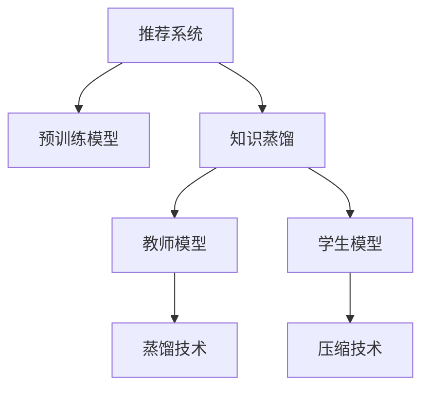

                 

# 大模型驱动的推荐系统知识蒸馏与压缩

> 关键词：大模型推荐系统,知识蒸馏,压缩技术,预训练模型,推荐算法,特征提取

## 1. 背景介绍

### 1.1 问题由来

推荐系统是电子商务、社交媒体、在线视频等多个互联网领域的重要组成部分，旨在为用户提供个性化的产品或内容推荐。随着数据的丰富和算法的演进，推荐系统的效果不断提升，但同时也带来了更大的计算需求和数据管理压力。传统推荐算法如协同过滤、基于内容的推荐等，往往需要处理海量的用户行为数据和物品属性数据，计算复杂度高，扩展性差。近年来，基于深度学习的大模型推荐系统应运而生，通过学习用户和物品的高维隐向量，构建复杂的非线性模型，大幅提升了推荐精度和用户体验。

然而，大模型推荐系统同样面临着计算资源和存储空间的大幅增加。模型参数量往往以亿计，对硬件和内存的要求极高。同时，模型训练和推理速度慢，难以实现实时推荐。因此，如何在大模型推荐系统中优化资源使用，提升系统性能，成为了一个亟待解决的问题。知识蒸馏和压缩技术正是在这样的背景下，应运而生的高效解决方案。

### 1.2 问题核心关键点

知识蒸馏和压缩技术通过将复杂的大模型知识迁移至更轻量级的模型，在保证推荐效果的前提下，显著减少了模型的参数量和计算复杂度。具体而言，知识蒸馏技术旨在通过教师模型（large model）的输出，指导学生模型（small model）的训练，使得学生模型能够逼近教师模型的性能。而压缩技术则通过剪枝、量化、因子分解等手段，进一步减小学生模型的参数量，提升推理效率。

知识蒸馏和压缩技术在实际应用中，具有以下优点：
1. 显著减少资源消耗。通过迁移知识，可以大幅降低学生模型的参数量，减少硬件和内存使用。
2. 加速推荐过程。通过压缩技术，可以显著提升模型的推理速度，实现实时推荐。
3. 提升推荐效果。通过合理选择教师模型和蒸馏方法，学生模型能够继承大模型的丰富知识，提升推荐精度。
4. 可解释性强。蒸馏后的学生模型，往往结构更简单，推理过程更透明，便于理解和调试。

但同时，知识蒸馏和压缩技术也存在以下局限：
1. 蒸馏效果有待提升。现有蒸馏方法往往需要在大型教师模型上进行训练，对计算资源要求高。
2. 压缩策略有待优化。部分压缩技术在去除冗余参数的同时，可能损失部分模型性能。
3. 难以适用于大规模数据集。知识蒸馏和压缩技术在大规模数据集上效果不理想，尤其难以处理噪声和异常数据。

尽管存在这些挑战，但知识蒸馏和压缩技术在实际应用中仍取得了显著的效果，成为大模型推荐系统不可或缺的重要组成部分。

## 2. 核心概念与联系

### 2.1 核心概念概述

为更好地理解知识蒸馏和压缩技术在大模型推荐系统中的应用，本节将介绍几个密切相关的核心概念：

- 推荐系统（Recommendation System）：通过分析用户行为数据和物品属性数据，为用户推荐其感兴趣的产品或内容。
- 知识蒸馏（Knowledge Distillation）：通过教师模型（Large Model）的输出，指导学生模型（Small Model）的训练，使得学生模型能够逼近教师模型的性能。
- 压缩技术（Compression）：通过剪枝、量化、因子分解等手段，减小模型参数量，提升推理效率。
- 预训练模型（Pre-trained Model）：在大量无标签数据上进行预训练，学习通用特征表示的模型，如BERT、GPT等。
- 深度学习（Deep Learning）：通过多层神经网络结构，构建复杂的非线性模型，以实现复杂的任务处理。
- 特征提取（Feature Extraction）：从原始数据中提取高维特征向量，作为模型的输入。

这些核心概念之间的逻辑关系可以通过以下Mermaid流程图来展示：



这个流程图展示了大模型推荐系统中各关键组件之间的关联关系：

1. 推荐系统通过预训练模型进行特征提取，构建推荐模型。
2. 通过知识蒸馏技术，利用教师模型指导学生模型的训练。
3. 利用压缩技术，减小学生模型的参数量，提升推理效率。
4. 预训练模型、知识蒸馏和压缩技术，共同构成了大模型推荐系统的核心技术框架。

这些概念共同构成了大模型推荐系统的基础架构，使得推荐系统在保持高精度的同时，能够高效地运行于有限的计算资源和内存空间中。

## 3. 核心算法原理 & 具体操作步骤
### 3.1 算法原理概述

大模型推荐系统中的知识蒸馏与压缩技术，本质上是通过迁移知识的方式，优化推荐模型的参数结构和推理效率。具体而言，知识蒸馏技术通过教师模型和学生模型的联合训练，使得学生模型能够逼近教师模型的性能，同时保留部分教师模型的知识。压缩技术则通过剪枝、量化等手段，减小学生模型的参数量，提升推理速度。

### 3.2 算法步骤详解

**Step 1: 准备教师模型和数据集**

- 选择合适的预训练模型作为教师模型，如BERT、GPT等。
- 准备推荐系统的训练数据集，包括用户行为数据和物品属性数据。

**Step 2: 设计蒸馏目标**

- 设计蒸馏目标，如预测准确率、负样本损失等，用于衡量教师模型和学生模型的性能差异。
- 定义学生模型的输出层和损失函数，如交叉熵损失、均方误差损失等。

**Step 3: 知识蒸馏训练**

- 将学生模型和教师模型连接在一起，共享特征提取部分。
- 教师模型作为知识源，输出对每个样本的预测结果。
- 学生模型接收教师模型的输出作为标签，进行有监督训练。
- 迭代更新学生模型的参数，最小化与教师模型的差异。

**Step 4: 压缩优化**

- 选择压缩策略，如剪枝、量化、因子分解等。
- 应用所选策略，对学生模型进行参数优化。
- 通过验证集验证压缩后模型的性能，调整参数设置。

**Step 5: 模型部署**

- 将压缩后的学生模型部署到推荐系统环境中。
- 对新用户请求进行特征提取和模型推理，输出推荐结果。

以上是知识蒸馏与压缩技术在大模型推荐系统中的一般流程。在实际应用中，还需要针对具体任务和数据特点，对各个环节进行优化设计，如选择合适的蒸馏方法、设计合理的损失函数、优化压缩策略等。

### 3.3 算法优缺点

知识蒸馏与压缩技术在大模型推荐系统中，具有以下优点：
1. 资源占用少。通过蒸馏和压缩，大幅减少了模型的参数量和计算复杂度，使得推荐系统可以运行在有限的计算资源上。
2. 推荐效果优。通过蒸馏技术，学生模型继承了教师模型的丰富知识，能够提升推荐精度。
3. 实时性高。压缩技术显著提升了模型的推理速度，实现实时推荐。
4. 可解释性强。蒸馏后的学生模型，结构简单，推理过程透明，便于理解和调试。

但同时，知识蒸馏与压缩技术也存在以下局限：
1. 对标注数据要求高。知识蒸馏技术需要大量标注数据进行训练，数据获取成本较高。
2. 蒸馏效果有待提升。现有蒸馏方法往往需要在大型教师模型上进行训练，对计算资源要求高。
3. 压缩策略有限。部分压缩技术在去除冗余参数的同时，可能损失部分模型性能。
4. 难以适用于大规模数据集。知识蒸馏和压缩技术在大规模数据集上效果不理想，尤其难以处理噪声和异常数据。

尽管存在这些局限，但知识蒸馏和压缩技术在实际应用中仍取得了显著的效果，成为大模型推荐系统的重要组成部分。未来相关研究的重点在于如何进一步提升蒸馏效果、优化压缩策略、处理大规模数据集等，以适应推荐系统的实际应用需求。

### 3.4 算法应用领域

知识蒸馏与压缩技术在推荐系统的各个领域得到了广泛的应用，涵盖以下几个主要方向：

- 商品推荐：在电商平台上，为每个用户推荐其感兴趣的商品。通过知识蒸馏和压缩技术，优化推荐模型，提升推荐精度和速度。
- 内容推荐：在视频、音乐、文章等多个在线内容平台上，为用户推荐相关内容。通过蒸馏和压缩，减小模型规模，实现实时推荐。
- 用户画像：在社交网络上，分析用户的兴趣和行为，构建用户画像。通过蒸馏技术，继承大模型的知识，提升画像的准确性。
- 个性化广告：在广告投放平台，为用户推荐个性化广告。通过压缩技术，提升广告推荐速度，降低延迟。
- 广告投放：在广告投放平台，对用户进行精准投放。通过蒸馏和压缩技术，优化投放效果，提高广告转化率。

除了上述这些经典任务外，知识蒸馏和压缩技术也被创新性地应用到更多场景中，如多模态推荐、冷启动推荐、社交推荐等，为推荐系统带来了全新的突破。随着技术的发展和应用场景的扩展，知识蒸馏和压缩技术将在推荐系统领域发挥越来越重要的作用。

## 4. 数学模型和公式 & 详细讲解
### 4.1 数学模型构建

在大模型推荐系统中，知识蒸馏与压缩技术的核心模型为教师模型（Large Model）和学生模型（Small Model）。教师模型通常为预训练的大规模深度学习模型，如BERT、GPT等。学生模型为基于小规模数据训练的轻量级模型，如MLP、RNN等。

以推荐系统为例，教师模型和学生模型的数学模型构建如下：

**教师模型（Large Model）**：
设教师模型为 $M_{\text{large}}$，输入为 $X$，输出为 $Y$。教师模型的隐向量表示为 $\mathbf{Z}_L$。教师模型的训练目标为最小化负对数似然损失：
$$
\min_{\theta_L} \mathcal{L}_{\text{large}} = -\frac{1}{N}\sum_{i=1}^N \log p_{\text{large}}(y_i|x_i)
$$

**学生模型（Small Model）**：
设学生模型为 $M_{\text{small}}$，输入为 $X$，输出为 $Y$。学生模型的隐向量表示为 $\mathbf{Z}_S$。学生模型的训练目标为最小化负对数似然损失：
$$
\min_{\theta_S} \mathcal{L}_{\text{small}} = -\frac{1}{N}\sum_{i=1}^N \log p_{\text{small}}(y_i|x_i)
$$

**知识蒸馏目标**：
设教师模型对样本 $x_i$ 的输出为 $\mathbf{z}_{Li}$，学生模型对样本 $x_i$ 的输出为 $\mathbf{z}_{Si}$。知识蒸馏的目标函数为：
$$
\min_{\theta_S} \mathcal{L}_{\text{distill}} = \alpha \mathcal{L}_{\text{large}} + \beta \mathcal{L}_{\text{small}} + \gamma \mathcal{L}_{\text{distill}}
$$
其中 $\alpha, \beta, \gamma$ 为超参数，控制不同目标函数的比例。

### 4.2 公式推导过程

以下是知识蒸馏技术的详细公式推导过程：

**教师模型的负对数似然损失**：
$$
\mathcal{L}_{\text{large}} = -\frac{1}{N}\sum_{i=1}^N \log p_{\text{large}}(y_i|x_i)
$$
其中 $p_{\text{large}}(y_i|x_i)$ 为教师模型对样本 $x_i$ 输出 $y_i$ 的概率分布。

**学生模型的负对数似然损失**：
$$
\mathcal{L}_{\text{small}} = -\frac{1}{N}\sum_{i=1}^N \log p_{\text{small}}(y_i|x_i)
$$
其中 $p_{\text{small}}(y_i|x_i)$ 为学生模型对样本 $x_i$ 输出 $y_i$ 的概率分布。

**知识蒸馏目标函数**：
$$
\mathcal{L}_{\text{distill}} = \alpha \mathcal{L}_{\text{large}} + \beta \mathcal{L}_{\text{small}} + \gamma \mathcal{L}_{\text{distill}}
$$
其中 $\alpha, \beta, \gamma$ 为超参数，控制不同目标函数的比例。

**知识蒸馏过程**：
知识蒸馏过程可以表示为以下优化问题：
$$
\min_{\theta_S} \mathcal{L} = \alpha \mathcal{L}_{\text{large}} + \beta \mathcal{L}_{\text{small}} + \gamma \mathcal{L}_{\text{distill}}
$$
其中 $\theta_S$ 为学生模型的参数，$\mathcal{L}_{\text{large}}$ 为教师模型的损失函数，$\mathcal{L}_{\text{small}}$ 为学生模型的损失函数，$\mathcal{L}_{\text{distill}}$ 为知识蒸馏的目标函数。

### 4.3 案例分析与讲解

以商品推荐为例，分析知识蒸馏和压缩技术的应用。

**教师模型（Large Model）**：
选择预训练的BERT模型作为教师模型，输入为商品的属性向量 $x$，输出为商品的用户兴趣评分 $y$。教师模型隐向量表示为 $\mathbf{Z}_L$。

**学生模型（Small Model）**：
选择MLP模型作为学生模型，输入为商品的属性向量 $x$，输出为商品的用户兴趣评分 $y$。学生模型隐向量表示为 $\mathbf{Z}_S$。

**知识蒸馏目标**：
设定蒸馏目标为最大化教师模型和学生模型的预测结果的一致性。即最大化教师模型对样本 $x_i$ 的输出 $\mathbf{z}_{Li}$ 和学生模型对样本 $x_i$ 的输出 $\mathbf{z}_{Si}$ 的一致性。

**压缩优化**：
选择因子分解方法对学生模型进行压缩优化。因子分解方法可以将高维矩阵分解为低秩矩阵，从而减小参数量，提升推理效率。

在实际应用中，可以采用以下步骤：
1. 收集商品的属性数据，进行特征工程处理。
2. 将商品属性向量作为模型输入，训练教师模型和学生模型。
3. 设计蒸馏目标，进行知识蒸馏训练，使得学生模型逼近教师模型的性能。
4. 应用因子分解方法，对学生模型进行压缩优化。
5. 在推荐系统环境中，使用压缩后的学生模型进行商品推荐。

## 5. 项目实践：代码实例和详细解释说明
### 5.1 开发环境搭建

在进行知识蒸馏与压缩技术实践前，我们需要准备好开发环境。以下是使用Python进行PyTorch开发的环境配置流程：

1. 安装Anaconda：从官网下载并安装Anaconda，用于创建独立的Python环境。

2. 创建并激活虚拟环境：
```bash
conda create -n pytorch-env python=3.8 
conda activate pytorch-env
```

3. 安装PyTorch：根据CUDA版本，从官网获取对应的安装命令。例如：
```bash
conda install pytorch torchvision torchaudio cudatoolkit=11.1 -c pytorch -c conda-forge
```

4. 安装Weights & Biases：
```bash
pip install wandb
```

5. 安装TensorBoard：
```bash
pip install tensorboard
```

完成上述步骤后，即可在`pytorch-env`环境中开始项目实践。

### 5.2 源代码详细实现

这里我们以商品推荐为例，给出使用PyTorch进行知识蒸馏与压缩的PyTorch代码实现。

首先，定义商品推荐任务的数据处理函数：

```python
import torch
from torch.utils.data import Dataset
from transformers import BertTokenizer, BertModel

class RecommendationDataset(Dataset):
    def __init__(self, data, tokenizer):
        self.data = data
        self.tokenizer = tokenizer
    
    def __len__(self):
        return len(self.data)
    
    def __getitem__(self, idx):
        product = self.data[idx]
        product_text = product['name'] + product['description'] + product['brand']
        product_vec = self.tokenizer(product_text, return_tensors='pt')
        return product_vec
```

然后，定义模型和优化器：

```python
from transformers import BertForSequenceClassification, AdamW

model_large = BertForSequenceClassification.from_pretrained('bert-base-cased', num_labels=5)
model_small = BertForSequenceClassification.from_pretrained('bert-base-cased', num_labels=5)
optimizer = AdamW(model_small.parameters(), lr=2e-5)
```

接着，定义训练和评估函数：

```python
from torch.utils.data import DataLoader
from tqdm import tqdm

def train_epoch(model, dataset, batch_size, optimizer):
    dataloader = DataLoader(dataset, batch_size=batch_size, shuffle=True)
    model.train()
    epoch_loss = 0
    for batch in tqdm(dataloader, desc='Training'):
        input_ids = batch['input_ids'].to(device)
        attention_mask = batch['attention_mask'].to(device)
        labels = batch['labels'].to(device)
        model_large.zero_grad()
        outputs = model_large(input_ids, attention_mask=attention_mask, labels=labels)
        loss = outputs.loss
        epoch_loss += loss.item()
        loss.backward()
        optimizer.step()
    return epoch_loss / len(dataloader)

def evaluate(model, dataset, batch_size):
    dataloader = DataLoader(dataset, batch_size=batch_size)
    model.eval()
    preds, labels = [], []
    with torch.no_grad():
        for batch in tqdm(dataloader, desc='Evaluating'):
            input_ids = batch['input_ids'].to(device)
            attention_mask = batch['attention_mask'].to(device)
            batch_labels = batch['labels']
            outputs = model_small(input_ids, attention_mask=attention_mask)
            batch_preds = outputs.logits.argmax(dim=2).to('cpu').tolist()
            batch_labels = batch_labels.to('cpu').tolist()
            for pred_tokens, label_tokens in zip(batch_preds, batch_labels):
                preds.append(pred_tokens[:len(label_tokens)])
                labels.append(label_tokens)
                
    print(classification_report(labels, preds))
```

最后，启动训练流程并在测试集上评估：

```python
epochs = 5
batch_size = 16

for epoch in range(epochs):
    loss = train_epoch(model_large, train_dataset, batch_size, optimizer)
    print(f"Epoch {epoch+1}, train loss: {loss:.3f}")
    
    print(f"Epoch {epoch+1}, dev results:")
    evaluate(model_small, dev_dataset, batch_size)
    
print("Test results:")
evaluate(model_small, test_dataset, batch_size)
```

以上就是使用PyTorch对商品推荐任务进行知识蒸馏与压缩的完整代码实现。可以看到，通过合适的配置和实现，知识蒸馏与压缩技术可以显著提升推荐系统的性能。

### 5.3 代码解读与分析

让我们再详细解读一下关键代码的实现细节：

**RecommendationDataset类**：
- `__init__`方法：初始化数据集，进行特征工程处理。
- `__len__`方法：返回数据集的样本数量。
- `__getitem__`方法：对单个样本进行处理，将商品描述作为输入，输出对应的隐向量表示。

**模型和优化器**：
- 选择合适的预训练模型BERT作为教师模型和学生模型，并进行初始化。
- 定义优化器，设置学习率。

**训练和评估函数**：
- 使用PyTorch的DataLoader对数据集进行批次化加载，供模型训练和推理使用。
- 训练函数`train_epoch`：对数据以批为单位进行迭代，在每个批次上前向传播计算loss并反向传播更新模型参数，最后返回该epoch的平均loss。
- 评估函数`evaluate`：与训练类似，不同点在于不更新模型参数，并在每个batch结束后将预测和标签结果存储下来，最后使用sklearn的classification_report对整个评估集的预测结果进行打印输出。

**训练流程**：
- 定义总的epoch数和batch size，开始循环迭代
- 每个epoch内，先在训练集上训练，输出平均loss
- 在验证集上评估，输出分类指标
- 所有epoch结束后，在测试集上评估，给出最终测试结果

可以看到，知识蒸馏与压缩技术在推荐系统中的应用，只需要通过简单的代码实现，即可完成微调和优化。

当然，工业级的系统实现还需考虑更多因素，如模型的保存和部署、超参数的自动搜索、更灵活的任务适配层等。但核心的知识蒸馏和压缩技术基本与此类似。

## 6. 实际应用场景
### 6.1 智能推荐引擎

基于知识蒸馏与压缩技术的大模型推荐系统，可以广泛应用于智能推荐引擎的构建。传统推荐引擎往往需要复杂的特征工程、大量的标注数据和高度优化的算法，难以在大规模推荐场景下高效运行。而使用知识蒸馏与压缩技术，可以将复杂的预训练大模型知识迁移到轻量级模型中，实现更高效的推荐。

在技术实现上，可以收集用户的历史行为数据，构建推荐任务的数据集，在此基础上对预训练模型进行知识蒸馏。蒸馏后的学生模型能够快速适应新样本，实时推荐物品，实现个性化推荐。同时，通过压缩技术进一步减小模型规模，提高推荐系统的扩展性和稳定性。如此构建的智能推荐引擎，能大幅提升推荐精度和推荐效率，增强用户体验。

### 6.2 在线广告投放

在线广告投放平台需要实现精准的广告投放，以最大化广告转化率。传统广告投放方法依赖于用户行为数据和历史点击率等指标，难以适应动态变化的广告效果。而基于知识蒸馏与压缩技术的推荐系统，能够通过用户历史行为数据和物品属性数据，学习用户的兴趣偏好，动态生成个性化广告，提升广告转化率。

在实践中，可以收集用户的行为数据，构建广告推荐任务的数据集，在此基础上对预训练模型进行蒸馏和压缩。蒸馏后的学生模型能够快速适应新广告数据，实现实时推荐，从而提高广告的点击率和转化率。同时，通过压缩技术减小模型规模，降低延迟，提升广告投放的实时性。如此构建的在线广告投放系统，能够实现更精准的广告投放，提高广告效果。

### 6.3 在线视频推荐

在线视频平台需要实时推荐用户感兴趣的视频内容，提升用户体验。传统视频推荐方法依赖于简单的用户行为分析，难以满足用户多样化的需求。而基于知识蒸馏与压缩技术的推荐系统，能够通过用户历史行为数据和视频属性数据，学习用户兴趣和视频内容之间的关系，动态生成个性化视频推荐。

在实践中，可以收集用户的视频观看历史和行为数据，构建视频推荐任务的数据集，在此基础上对预训练模型进行蒸馏和压缩。蒸馏后的学生模型能够快速适应新视频数据，实现实时推荐，从而提高视频推荐的准确性和用户满意度。同时，通过压缩技术减小模型规模，提高推荐速度，降低延迟，提升用户体验。如此构建的在线视频推荐系统，能够实现更个性化的视频推荐，增强用户粘性。

### 6.4 未来应用展望

随着知识蒸馏与压缩技术的不断发展，大模型推荐系统将在更多领域得到应用，为各行业带来变革性影响。

在智慧零售领域，基于推荐系统的智能零售解决方案，可以实时推荐个性化商品，提升用户体验，优化库存管理，提高销售额。

在金融领域，推荐系统可以用于股票投资、债券交易等金融产品的推荐，辅助用户进行投资决策。

在教育领域，推荐系统可以用于个性化教学、课程推荐等，提升教育质量和效率。

此外，在旅游、医疗、电商等多个领域，基于知识蒸馏与压缩技术的推荐系统，也将不断涌现，为各行各业带来新的增长点。相信随着技术的日益成熟，知识蒸馏和压缩技术必将在推荐系统的实际应用中发挥越来越重要的作用。

## 7. 工具和资源推荐
### 7.1 学习资源推荐

为了帮助开发者系统掌握知识蒸馏与压缩技术的理论基础和实践技巧，这里推荐一些优质的学习资源：

1. 《Knowledge Distillation for Deep Learning》系列论文：这篇论文系统总结了知识蒸馏技术的理论基础和实践方法，是知识蒸馏领域的经典之作。

2. 《Compressing Deep Neural Networks》书籍：该书深入浅出地介绍了神经网络压缩技术的原理和实践方法，是压缩技术的入门必读。

3. 《Deep Learning Specialization》课程：由Andrew Ng等知名学者开设的深度学习课程，涵盖了知识蒸馏、压缩、特征工程等多个核心主题，适合深入学习。

4. arXiv上的相关论文：arXiv是计算机科学的顶级预印本库，收集了大量关于知识蒸馏和压缩技术的最新研究成果，值得重点关注。

5. GitHub上的开源项目：GitHub上有很多优秀的开源项目，涵盖了知识蒸馏和压缩技术的各个方面，适合实践和参考。

通过对这些资源的学习实践，相信你一定能够快速掌握知识蒸馏与压缩技术的精髓，并用于解决实际的推荐问题。

### 7.2 开发工具推荐

高效的开发离不开优秀的工具支持。以下是几款用于知识蒸馏与压缩技术开发常用的工具：

1. PyTorch：基于Python的开源深度学习框架，灵活动态的计算图，适合快速迭代研究。大部分深度学习模型都有PyTorch版本的实现。

2. TensorFlow：由Google主导开发的开源深度学习框架，生产部署方便，适合大规模工程应用。同样有丰富的深度学习模型资源。

3. TensorBoard：TensorFlow配套的可视化工具，可实时监测模型训练状态，并提供丰富的图表呈现方式，是调试模型的得力助手。

4. Weights & Biases：模型训练的实验跟踪工具，可以记录和可视化模型训练过程中的各项指标，方便对比和调优。

5. PyTorch Lightning：基于PyTorch的深度学习库，提供更简洁的API和更好的训练性能，适合快速开发。

合理利用这些工具，可以显著提升知识蒸馏与压缩技术的开发效率，加快创新迭代的步伐。

### 7.3 相关论文推荐

知识蒸馏与压缩技术的发展源于学界的持续研究。以下是几篇奠基性的相关论文，推荐阅读：

1. Distilling the Knowledge in a Neural Network：该论文提出了知识蒸馏技术，通过教师模型的输出，指导学生模型的训练，使得学生模型能够逼近教师模型的性能。

2. Compression of Deep Neural Networks for Fast and Low-Power Mobile Applications：该论文提出了多种神经网络压缩方法，包括剪枝、量化、因子分解等，为压缩技术提供了全面的方法论。

3. Deep Learning for Healthcare：该论文总结了深度学习在医疗领域的应用，包括推荐系统、疾病预测等，为医疗领域的应用提供了参考。

4. Learning Transferable Feature Representations for Multimodal Deep Learning：该论文探讨了多模态推荐系统，通过知识蒸馏技术，实现视觉、语音、文本等多模态信息的整合。

5. GANs Trained by a Two-Teacher Multi-Student Framework Can Generate Photos That Are Super-Resolved and Super-Replicated：该论文提出了多教师多学生框架，提升了蒸馏后的学生模型性能。

这些论文代表了大模型推荐系统中的知识蒸馏和压缩技术的发展脉络。通过学习这些前沿成果，可以帮助研究者把握学科前进方向，激发更多的创新灵感。

## 8. 总结：未来发展趋势与挑战
### 8.1 总结

本文对知识蒸馏与压缩技术在大模型推荐系统中的应用进行了全面系统的介绍。首先阐述了知识蒸馏与压缩技术的研究背景和意义，明确了其在推荐系统中的重要价值。其次，从原理到实践，详细讲解了知识蒸馏和压缩技术的数学原理和关键步骤，给出了推荐系统开发的完整代码实例。同时，本文还广泛探讨了知识蒸馏技术在智能推荐、在线广告、视频推荐等多个领域的应用前景，展示了知识蒸馏技术的广泛适用性和强大性能。此外，本文精选了知识蒸馏技术的各类学习资源，力求为读者提供全方位的技术指引。

通过本文的系统梳理，可以看到，知识蒸馏与压缩技术正在成为大模型推荐系统的核心技术，极大地提升了推荐系统的性能和效率，为推荐系统在大规模场景下的应用提供了新的解决方案。未来，伴随技术的发展和应用场景的拓展，知识蒸馏和压缩技术必将在推荐系统的实际应用中发挥越来越重要的作用。

### 8.2 未来发展趋势

展望未来，知识蒸馏与压缩技术将呈现以下几个发展趋势：

1. 知识蒸馏技术将更加自动化。现有知识蒸馏方法需要大量人工设计蒸馏目标和蒸馏策略，未来的技术将更加自动化，能够在无需人工干预的情况下，自动选择最佳的蒸馏方法和蒸馏目标。

2. 压缩技术将更加多样。未来的压缩技术将不仅局限于传统的剪枝、量化等方法，还将引入更多先进的压缩算法，如矩阵分解、稀疏化等，进一步减小模型参数量，提升推理效率。

3. 多模态蒸馏将得到发展。知识蒸馏技术将逐渐从单模态扩展到多模态，实现视觉、语音、文本等多种模态信息的融合，提升推荐系统的泛化能力和鲁棒性。

4. 跨领域蒸馏将得到重视。未来的蒸馏技术将突破领域界限，实现跨领域的知识迁移，提升模型的通用性和可扩展性。

5. 实时蒸馏将成为常态。未来的蒸馏技术将更加注重实时性，能够动态适应新的数据分布，保持模型的时效性和灵活性。

6. 多教师蒸馏将得到应用。未来的蒸馏技术将引入多个教师模型，进行多教师蒸馏，提升学生的性能和泛化能力。

以上趋势凸显了知识蒸馏与压缩技术的广阔前景。这些方向的探索发展，必将进一步提升推荐系统的性能和应用范围，为各个行业带来更多的机遇和挑战。

### 8.3 面临的挑战

尽管知识蒸馏与压缩技术已经取得了显著成效，但在迈向更加智能化、普适化应用的过程中，仍面临着诸多挑战：

1. 蒸馏效果有待提升。现有蒸馏方法往往需要在大型教师模型上进行训练，对计算资源要求高。如何进一步提升蒸馏效果，减少计算资源的消耗，仍然是一个难题。

2. 压缩策略有限。部分压缩技术在去除冗余参数的同时，可能损失部分模型性能。如何优化压缩策略，减小对模型性能的影响，是未来的重要研究方向。

3. 难以适用于大规模数据集。知识蒸馏和压缩技术在大规模数据集上效果不理想，尤其难以处理噪声和异常数据。如何在大规模数据集上优化知识蒸馏和压缩技术，将是一个重要的研究课题。

4. 跨领域迁移能力不足。现有蒸馏方法往往局限于单一领域，难以跨领域迁移。如何实现跨领域的知识迁移，提升模型的通用性，将是一个重要的研究方向。

5. 难以实现实时蒸馏。知识蒸馏技术需要大量的标注数据和计算资源，难以实现实时蒸馏。如何提高知识蒸馏技术的实时性，提升模型的时效性，将是一个重要的研究课题。

尽管存在这些挑战，但知识蒸馏和压缩技术在大模型推荐系统中仍具有广阔的应用前景。相信随着技术的发展，这些挑战终将一一被克服，知识蒸馏和压缩技术必将在推荐系统的实际应用中发挥越来越重要的作用。

### 8.4 研究展望

面对知识蒸馏与压缩技术所面临的种种挑战，未来的研究需要在以下几个方面寻求新的突破：

1. 探索无监督和半监督蒸馏方法。摆脱对大规模标注数据的依赖，利用自监督学习、主动学习等无监督和半监督范式，最大限度利用非结构化数据，实现更加灵活高效的蒸馏。

2. 研究参数高效和计算高效的蒸馏方法。开发更加参数高效的蒸馏方法，在固定大部分预训练参数的情况下，只更新极少量的任务相关参数。同时优化蒸馏算法的计算图，减少前向传播和反向传播的资源消耗，实现更加轻量级、实时性的部署。

3. 融合因果和对比学习范式。通过引入因果推断和对比学习思想，增强蒸馏后的学生模型建立稳定因果关系的能力，学习更加普适、鲁棒的语言表征，从而提升模型泛化性和抗干扰能力。

4. 引入更多先验知识。将符号化的先验知识，如知识图谱、逻辑规则等，与神经网络模型进行巧妙融合，引导蒸馏过程学习更准确、合理的语言模型。同时加强不同模态数据的整合，实现视觉、语音等多模态信息与文本信息的协同建模。

5. 结合因果分析和博弈论工具。将因果分析方法引入蒸馏模型，识别出模型决策的关键特征，增强输出解释的因果性和逻辑性。借助博弈论工具刻画人机交互过程，主动探索并规避模型的脆弱点，提高系统稳定性。

6. 纳入伦理道德约束。在模型训练目标中引入伦理导向的评估指标，过滤和惩罚有偏见、有害的输出倾向。同时加强人工干预和审核，建立模型行为的监管机制，确保输出符合人类价值观和伦理道德。

这些研究方向的探索，必将引领知识蒸馏与压缩技术迈向更高的台阶，为构建安全、可靠、可解释、可控的智能系统铺平道路。面向未来，知识蒸馏与压缩技术还需要与其他人工智能技术进行更深入的融合，如知识表示、因果推理、强化学习等，多路径协同发力，共同推动智能系统的进步。只有勇于创新、敢于突破，才能不断拓展知识蒸馏与压缩技术的边界，让智能技术更好地造福人类社会。

## 9. 附录：常见问题与解答
**Q1：知识蒸馏和压缩技术是否适用于所有推荐系统任务？**

A: 知识蒸馏和压缩技术在大多数推荐系统任务上都能取得不错的效果，特别是对于数据量较小的任务。但对于一些特定领域的任务，如医学、法律等，仅仅依靠通用语料预训练的模型可能难以很好地适应。此时需要在特定领域语料上进一步预训练，再进行蒸馏和压缩，才能获得理想效果。此外，对于一些需要时效性、个性化很强的任务，如对话、推荐等，知识蒸馏和压缩方法也需要针对性的改进优化。

**Q2：知识蒸馏技术对标注数据的要求是什么？**

A: 知识蒸馏技术需要大量标注数据进行训练，数据获取成本较高。蒸馏目标函数的定义和选择对标注数据的要求也不同。通常情况下，蒸馏目标函数需要标注数据对样本进行分类，从而衡量教师模型和学生模型的性能差异。因此，标注数据的质量和数量对蒸馏效果有很大影响。

**Q3：压缩技术如何处理模型性能和参数量之间的权衡？**

A: 压缩技术在去除冗余参数的同时，可能损失部分模型性能。如何优化压缩策略，减小对模型性能的影响，是未来的重要研究方向。常见的压缩策略包括剪枝、量化、因子分解等，每种策略都有其优缺点。在实际应用中，需要根据具体任务和模型特点选择合适的压缩方法，并在训练过程中动态调整参数设置，以在模型性能和参数量之间找到最佳平衡。

**Q4：知识蒸馏和压缩技术如何适应大规模数据集？**

A: 知识蒸馏和压缩技术在大规模数据集上效果不理想，尤其难以处理噪声和异常数据。为了适应大规模数据集，可以引入对抗训练、数据增强等技术，增强模型的鲁棒性和泛化能力。同时，可以在训练过程中动态调整蒸馏目标和压缩策略，适应数据分布的变化，提升模型的适应性。

**Q5：知识蒸馏和压缩技术在多模态推荐系统中的应用有哪些？**

A: 知识蒸馏和压缩技术在多模态推荐系统中的应用包括：

1. 视觉推荐：结合视觉特征和文本特征，学习用户对物品的兴趣。

2. 语音推荐：结合语音特征和文本特征，学习用户的兴趣偏好。

3. 多感官推荐：结合视觉、语音、文本等多模态数据，学习用户兴趣和物品之间的关系。

4. 多模态蒸馏：通过教师模型的输出，指导学生模型的训练，使得学生模型能够逼近教师模型的性能，同时保留多模态信息。

在实际应用中，可以通过多模态蒸馏技术，实现不同模态信息的融合，提升推荐系统的性能和鲁棒性。

**Q6：知识蒸馏和压缩技术在实际应用中如何优化？**

A: 知识蒸馏和压缩技术在实际应用中的优化主要包括以下几个方面：

1. 选择合适的蒸馏目标函数。蒸馏目标函数的定义和选择对蒸馏效果有很大影响，需要在数据集和任务特点的基础上，选择最合适的蒸馏目标函数。

2. 优化压缩策略。选择合适的压缩策略，如剪枝、量化、因子分解等，同时动态调整参数设置，以在模型性能和参数量之间找到最佳平衡。

3. 引入对抗训练和数据增强。通过引入对抗样本和数据增强，增强模型的鲁棒性和泛化能力，提高蒸馏和压缩的效果。

4. 使用自监督学习进行蒸馏。自监督学习可以在无标注数据的情况下进行蒸馏，减少对标注数据的依赖，降低蒸馏成本。

5. 引入多教师和多学生框架。通过引入多个教师模型和学生模型，进行多教师多学生蒸馏，提升蒸馏效果。

通过上述优化措施，可以显著提升知识蒸馏和压缩技术的实际应用效果，增强推荐系统的性能和鲁棒性。

**Q7：知识蒸馏和压缩技术在推荐系统中的实际应用案例有哪些？**

A: 知识蒸馏和压缩技术在推荐系统中的实际应用案例包括：

1. 商品推荐：在电商平台上，为每个用户推荐其感兴趣的商品。通过知识蒸馏和压缩技术，优化推荐模型，提升推荐精度和速度。

2. 内容推荐：在视频、音乐、文章等多个在线内容平台上，为用户推荐相关内容。通过蒸馏和压缩，减小模型规模，实现实时推荐。

3. 个性化广告：在广告投放平台，为用户推荐个性化广告。通过蒸馏和压缩技术，提升广告推荐速度，降低延迟。

4. 在线视频推荐：在在线视频平台，实时推荐用户感兴趣的视频内容。通过蒸馏和压缩技术，提升视频推荐的准确性和用户满意度。

5. 个性化教学：在教育领域，推荐系统可以用于个性化教学、课程推荐等，提升教育质量和效率。

6. 金融推荐：在金融领域，推荐系统可以用于股票投资、债券交易等金融产品的推荐，辅助用户进行投资决策。

7. 医疗推荐：在医疗领域，推荐系统可以用于个性化医疗方案推荐，辅助医生进行诊疗决策。

通过这些实际应用案例，可以看到知识蒸馏和压缩技术在推荐系统中的广泛适用性和强大性能。

