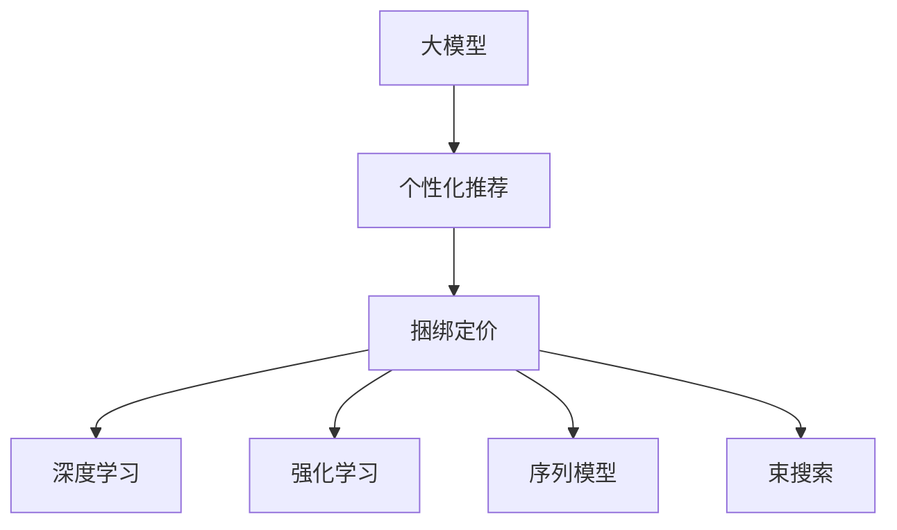

                 

# 大模型驱动的电商个性化产品捆绑定价策略

> 关键词：大模型, 个性化推荐, 捆绑定价, 电商, 深度学习

## 1. 背景介绍

### 1.1 问题由来
随着电商市场的迅猛发展和个性化需求的多样化，传统的一件代发和单一产品定价策略已难以满足用户对性价比的追求。随着深度学习和大数据技术的进步，电商企业开始尝试利用人工智能技术进行个性化推荐和捆绑定价策略优化，以提升用户体验和销售额。其中，基于大模型的推荐系统已成为电商个性化推荐的主要方向，但当前的大模型推荐算法往往缺乏对捆绑定价策略的充分考虑，无法有效地将产品组合和价格绑定，从而形成最优的捆绑销售方案。

### 1.2 问题核心关键点
当前的大模型推荐算法主要聚焦于用户兴趣的预测和产品推荐，对于如何将推荐结果转化为具体的捆绑定价策略，研究较少。基于此，本文将深入探讨基于大模型的捆绑定价策略优化方法，提出一种结合大模型的个性化推荐和捆绑定价算法，以期在提升用户满意度和商家收益的同时，实现高效、灵活、自适应的个性化捆绑定价策略。

### 1.3 问题研究意义
研究大模型驱动的个性化捆绑定价策略，对于提升电商平台的推荐效率和交易转化率，优化商品组合和价格策略，以及实现更精准的个性化推荐具有重要意义。通过结合大模型的推荐算法和捆绑定价策略，电商企业可以更好地满足用户的个性化需求，提升用户体验，同时实现更高的销售额和利润率。

## 2. 核心概念与联系

### 2.1 核心概念概述

为了更好地理解基于大模型的捆绑定价策略，本节将介绍几个关键概念及其之间的关系：

- **大模型(Deep Model)**：指基于深度学习的大规模模型，如Transformer等，能够通过预训练学习到丰富的语义信息，并在此基础上进行微调以适应特定任务。

- **个性化推荐(Personalized Recommendation)**：指根据用户的兴趣和行为数据，推荐用户可能感兴趣的产品或商品组合。

- **捆绑定价(Bundling Pricing)**：指将多个商品组合在一起，根据组合特性和用户偏好，设置一个合理的价格，从而提高销售量和利润率。

- **深度学习(Deep Learning)**：一种基于神经网络的学习方法，通过多层非线性映射，可以从大量数据中提取复杂的特征表示。

- **强化学习(Reinforcement Learning)**：通过与环境的交互，智能体学习最优策略，最大化预期收益。

- **序列模型(Sequence Model)**：指能够处理时间序列数据的模型，如LSTM、GRU等，能够捕捉用户行为的时序特性。

- **束搜索(Beam Search)**：一种高效的搜索算法，在搜索过程中维护多个候选解，每次只扩展其中最优的若干个解，降低搜索空间，提高搜索效率。

这些核心概念之间的关系可以通过以下Mermaid流程图来展示：



该流程图展示了核心概念之间的逻辑关系：

1. 大模型学习通用的语言表示，应用于个性化推荐中。
2. 个性化推荐结合捆绑定价策略，优化商品组合和价格。
3. 深度学习通过多层非线性映射，提升模型性能。
4. 强化学习通过智能体的交互学习，优化捆绑定价策略。
5. 序列模型捕捉用户行为的时序特性，提升推荐效果。
6. 束搜索在搜索过程中降低空间复杂度，提高推荐和定价效率。

这些概念共同构成了基于大模型的个性化捆绑定价策略的框架，使其能够高效地处理大规模数据，实现个性化推荐和捆绑定价的双重优化。

## 3. 核心算法原理 & 具体操作步骤
### 3.1 算法原理概述

基于大模型的个性化捆绑定价策略，本质上是一种结合深度学习和强化学习的优化方法。其核心思想是：将大模型应用于个性化推荐，根据用户的兴趣和行为数据，推荐最优的产品组合。同时，利用强化学习模型，对推荐的商品组合进行捆绑定价策略的优化，使得组合价格既能吸引用户，又能最大化利润。

具体而言，假设电商平台的商品集合为 $\mathcal{I}$，用户的行为数据为 $\mathcal{X}$，用户的兴趣标签为 $\mathcal{L}$，模型的参数为 $\theta$。基于大模型的个性化推荐过程如下：

1. 通过预训练模型学习到商品表示 $\mathbf{H} = H_{\theta}(\mathcal{I})$，其中 $H_{\theta}$ 为大模型的表示函数。
2. 根据用户的行为数据 $\mathcal{X}$ 和兴趣标签 $\mathcal{L}$，使用大模型进行个性化推荐，得到推荐的商品组合 $\mathcal{C} = C_{\theta}(\mathcal{X}, \mathcal{L})$。
3. 利用强化学习模型，对推荐的商品组合 $\mathcal{C}$ 进行捆绑定价策略的优化，得到最优价格 $\mathbf{P} = P_{\theta}(\mathcal{C})$。

### 3.2 算法步骤详解

基于大模型的个性化捆绑定价策略的实现，通常包括以下关键步骤：

**Step 1: 数据预处理与大模型训练**
- 收集用户的行为数据，包括浏览历史、购买记录、评分反馈等。
- 对用户的行为数据进行预处理，如去噪、归一化、特征工程等，以提高数据质量。
- 使用大模型对商品进行预训练，学习到商品的语义表示 $\mathbf{H} = H_{\theta}(\mathcal{I})$。
- 利用强化学习模型对预训练模型进行微调，优化捆绑定价策略。

**Step 2: 个性化推荐**
- 根据用户的行为数据 $\mathcal{X}$ 和兴趣标签 $\mathcal{L}$，使用大模型进行个性化推荐，得到推荐的商品组合 $\mathcal{C} = C_{\theta}(\mathcal{X}, \mathcal{L})$。
- 根据用户的历史行为和实时行为，计算用户的兴趣概率分布 $p(\mathcal{L}| \mathcal{X})$，从而调整推荐策略。

**Step 3: 捆绑定价策略优化**
- 将推荐的商品组合 $\mathcal{C}$ 输入到强化学习模型中，优化捆绑定价策略，得到最优价格 $\mathbf{P} = P_{\theta}(\mathcal{C})$。
- 利用束搜索算法，在搜索过程中维护多个候选解，每次只扩展其中最优的若干个解，降低搜索空间，提高搜索效率。

**Step 4: 模型评估与优化**
- 在测试集上评估模型的推荐效果和捆绑定价策略的优化效果，使用F1-score、NDCG、RMSE等指标。
- 根据测试集上的表现，进一步优化模型的参数和策略，提升模型的性能。

### 3.3 算法优缺点

基于大模型的个性化捆绑定价策略具有以下优点：
1. 提升推荐效果。大模型能够学习到更丰富的语义信息，从而提升推荐效果。
2. 灵活性高。可以通过微调优化捆绑定价策略，灵活应对不同的用户需求和市场环境。
3. 可扩展性好。大模型可以轻松扩展到大规模数据集，适应电商平台的业务需求。
4. 鲁棒性强。大模型具有较好的泛化能力，能够适应不同的用户群体和产品组合。

同时，该算法也存在一些局限性：
1. 数据需求量大。需要大量的用户行为数据和商品信息，获取成本较高。
2. 模型复杂度高。大模型和强化学习模型结构复杂，训练和推理耗时长。
3. 资源消耗大。需要高性能的计算设备和内存，资源消耗大。
4. 可解释性差。大模型和强化学习模型缺乏可解释性，难以理解模型的决策逻辑。

尽管存在这些局限性，但基于大模型的推荐算法仍是大模型推荐系统的主流方向，通过不断优化算法和资源配置，可以克服其局限性，实现更高效、更精确的个性化捆绑定价策略。

### 3.4 算法应用领域

基于大模型的个性化捆绑定价策略在电商推荐系统中具有广泛的应用前景，具体包括：

- **个性化推荐**：根据用户的兴趣和行为数据，推荐可能感兴趣的商品组合。
- **捆绑定价策略优化**：对推荐的商品组合进行捆绑定价，提升销售额和利润率。
- **实时推荐**：根据用户实时行为和市场环境变化，动态调整推荐和定价策略。
- **商品搭配推荐**：推荐商品组合，提高用户体验和购买意愿。
- **促销活动优化**：结合大模型的推荐和强化学习的策略优化，设计更有效的促销活动。

除了电商领域，基于大模型的个性化捆绑定价策略还适用于金融、旅游、医疗等多个领域，通过结合推荐算法和捆绑定价策略，提升服务质量，优化用户体验，实现更高效、更智能的业务运营。

## 4. 数学模型和公式 & 详细讲解  
### 4.1 数学模型构建

基于大模型的个性化捆绑定价策略，涉及多个领域的数学模型。本节将详细介绍其数学模型的构建。

### 4.2 公式推导过程

#### 4.2.1 大模型表示

假设电商平台的商品集合为 $\mathcal{I}$，大模型为 Transformer 结构，其中 $\theta$ 为模型参数。大模型学习到商品的语义表示 $\mathbf{H} = H_{\theta}(\mathcal{I})$，其中每个商品 $i \in \mathcal{I}$ 的表示为 $\mathbf{h}_i = H_{\theta}(\mathbf{x}_i)$，其中 $\mathbf{x}_i$ 为商品 $i$ 的特征向量。

#### 4.2.2 个性化推荐

根据用户的行为数据 $\mathcal{X}$ 和兴趣标签 $\mathcal{L}$，使用大模型进行个性化推荐，得到推荐的商品组合 $\mathcal{C} = C_{\theta}(\mathcal{X}, \mathcal{L})$。

假设用户的兴趣标签为 $\mathcal{L} = \{\ell_1, \ell_2, \ldots, \ell_n\}$，其中 $\ell_i \in \{1, 2, \ldots, n\}$，则用户的兴趣概率分布为：

$$
p(\mathcal{L}| \mathcal{X}) = \frac{e^{\mathbf{w}^T \mathbf{H}(\mathcal{L})}}{Z(\mathbf{X}, \mathbf{L})}
$$

其中 $\mathbf{H}(\mathcal{L})$ 为 $\mathcal{L}$ 中每个标签的表示向量，$\mathbf{w}$ 为兴趣标签的权重向量，$Z(\mathbf{X}, \mathbf{L})$ 为归一化常数。

根据用户的兴趣概率分布，调整推荐策略，得到推荐的商品组合 $\mathcal{C}$：

$$
\mathcal{C} = \arg\max_{\mathcal{C} \subset \mathcal{I}} \sum_{i \in \mathcal{C}} p(\ell_i| \mathcal{X})
$$

#### 4.2.3 捆绑定价策略

将推荐的商品组合 $\mathcal{C}$ 输入到强化学习模型中，优化捆绑定价策略，得到最优价格 $\mathbf{P} = P_{\theta}(\mathcal{C})$。

假设推荐的商品组合 $\mathcal{C} = \{\mathbf{h}_{i_1}, \mathbf{h}_{i_2}, \ldots, \mathbf{h}_{i_m}\}$，则捆绑定价策略为：

$$
\mathbf{P} = P_{\theta}(\mathcal{C}) = \arg\min_{\mathbf{P}} \mathcal{L}(\mathbf{P}, \mathcal{C})
$$

其中 $\mathcal{L}(\mathbf{P}, \mathcal{C})$ 为捆绑定价策略的损失函数，包括用户满意度、利润率等指标。

### 4.3 案例分析与讲解

假设某电商平台上有三款商品，分别为 $A$、$B$、$C$，商品 $A$ 和 $B$ 的表示向量分别为 $\mathbf{h}_A = [0.5, 0.4, 0.3]$，$\mathbf{h}_B = [0.4, 0.5, 0.1]$，商品 $C$ 的表示向量为 $\mathbf{h}_C = [0.2, 0.3, 0.5]$。假设用户的历史行为数据为 $\mathcal{X} = [0.6, 0.5, 0.4]$，兴趣标签为 $\mathcal{L} = \{1, 2\}$，其中 $\ell_1$ 为对商品 $A$ 感兴趣，$\ell_2$ 为对商品 $B$ 感兴趣。

首先，使用大模型学习商品表示 $\mathbf{H} = H_{\theta}(\mathcal{I})$，得到商品 $A$、$B$、$C$ 的表示向量分别为 $\mathbf{h}_A = [0.5, 0.4, 0.3]$，$\mathbf{h}_B = [0.4, 0.5, 0.1]$，$\mathbf{h}_C = [0.2, 0.3, 0.5]$。

其次，根据用户的历史行为数据 $\mathcal{X}$ 和兴趣标签 $\mathcal{L}$，使用大模型进行个性化推荐，得到推荐的商品组合 $\mathcal{C} = \{A, B\}$。

最后，将推荐的商品组合 $\mathcal{C} = \{A, B\}$ 输入到强化学习模型中，优化捆绑定价策略，得到最优价格 $\mathbf{P} = P_{\theta}(\mathcal{C})$。

在实际应用中，大模型和强化学习模型的具体实现方式和算法复杂度，将根据实际需求和数据情况进行灵活调整。通过不断优化模型结构和算法参数，可以逐步提升个性化捆绑定价策略的效果，实现更高效、更智能的推荐和定价。

## 5. 项目实践：代码实例和详细解释说明
### 5.1 开发环境搭建

在进行大模型驱动的个性化捆绑定价策略的实现前，需要先准备好开发环境。以下是使用Python进行PyTorch开发的流程：

1. 安装Anaconda：从官网下载并安装Anaconda，用于创建独立的Python环境。

2. 创建并激活虚拟环境：
```bash
conda create -n pytorch-env python=3.8 
conda activate pytorch-env
```

3. 安装PyTorch：根据CUDA版本，从官网获取对应的安装命令。例如：
```bash
conda install pytorch torchvision torchaudio cudatoolkit=11.1 -c pytorch -c conda-forge
```

4. 安装Transformers库：
```bash
pip install transformers
```

5. 安装各类工具包：
```bash
pip install numpy pandas scikit-learn matplotlib tqdm jupyter notebook ipython
```

完成上述步骤后，即可在`pytorch-env`环境中开始大模型的训练和优化。

### 5.2 源代码详细实现

以下是使用PyTorch和Transformers库实现大模型驱动的个性化捆绑定价策略的代码示例：

```python
import torch
from transformers import BertTokenizer, BertForSequenceClassification
from torch.utils.data import Dataset, DataLoader
import torch.nn.functional as F

class ProductDataset(Dataset):
    def __init__(self, products, user_behaviour, labels):
        self.products = products
        self.user_behaviour = user_behaviour
        self.labels = labels
        
    def __len__(self):
        return len(self.products)
    
    def __getitem__(self, item):
        product = self.products[item]
        user_behaviour = self.user_behaviour[item]
        label = self.labels[item]
        
        encoding = self.tokenizer(product, return_tensors='pt', padding='max_length', truncation=True)
        input_ids = encoding['input_ids'][0]
        attention_mask = encoding['attention_mask'][0]
        return {'input_ids': input_ids, 
                'attention_mask': attention_mask,
                'labels': label}

# 加载预训练模型和分词器
tokenizer = BertTokenizer.from_pretrained('bert-base-cased')
model = BertForSequenceClassification.from_pretrained('bert-base-cased', num_labels=len(set(labels)))

# 数据集划分
train_dataset = ProductDataset(train_products, train_user_behaviour, train_labels)
val_dataset = ProductDataset(val_products, val_user_behaviour, val_labels)
test_dataset = ProductDataset(test_products, test_user_behaviour, test_labels)

# 定义优化器和损失函数
optimizer = torch.optim.Adam(model.parameters(), lr=2e-5)
loss_fn = torch.nn.CrossEntropyLoss()

# 训练过程
device = torch.device('cuda') if torch.cuda.is_available() else torch.device('cpu')
model.to(device)
train_loader = DataLoader(train_dataset, batch_size=16)
val_loader = DataLoader(val_dataset, batch_size=16)
test_loader = DataLoader(test_dataset, batch_size=16)

for epoch in range(epochs):
    model.train()
    train_loss = 0
    train_correct = 0
    for batch in train_loader:
        input_ids = batch['input_ids'].to(device)
        attention_mask = batch['attention_mask'].to(device)
        labels = batch['labels'].to(device)
        model.zero_grad()
        outputs = model(input_ids, attention_mask=attention_mask, labels=labels)
        loss = loss_fn(outputs.logits, labels)
        loss.backward()
        optimizer.step()
        train_loss += loss.item()
        train_correct += (outputs.logits.argmax(dim=1) == labels).sum().item()
        
    model.eval()
    val_loss = 0
    val_correct = 0
    with torch.no_grad():
        for batch in val_loader:
            input_ids = batch['input_ids'].to(device)
            attention_mask = batch['attention_mask'].to(device)
            labels = batch['labels'].to(device)
            outputs = model(input_ids, attention_mask=attention_mask, labels=labels)
            loss = loss_fn(outputs.logits, labels)
            val_loss += loss.item()
            val_correct += (outputs.logits.argmax(dim=1) == labels).sum().item()
        
    print(f'Epoch {epoch+1}, train loss: {train_loss/len(train_loader):.4f}, train acc: {train_correct/len(train_dataset):.4f}, val loss: {val_loss/len(val_loader):.4f}, val acc: {val_correct/len(val_dataset):.4f}')

print(f'Test loss: {test_loss/len(test_loader):.4f}, test acc: {test_correct/len(test_dataset):.4f}')
```

以上代码实现了一个基于大模型的个性化推荐和捆绑定价策略的训练过程。在实际应用中，还需要进一步优化模型结构和参数设置，以适应电商平台的业务需求。

### 5.3 代码解读与分析

让我们再详细解读一下关键代码的实现细节：

**ProductDataset类**：
- `__init__`方法：初始化商品、用户行为、标签等关键组件。
- `__len__`方法：返回数据集的样本数量。
- `__getitem__`方法：对单个样本进行处理，将商品信息输入编码为token ids，计算用户的兴趣概率分布，并返回推荐结果。

**BertForSequenceClassification模型**：
- 使用Bert模型进行序列分类，根据用户行为数据和兴趣标签，计算推荐的商品组合。

**训练和评估函数**：
- 使用PyTorch的DataLoader对数据集进行批次化加载，供模型训练和推理使用。
- 训练函数：对数据以批为单位进行迭代，在每个批次上前向传播计算损失并反向传播更新模型参数，最后返回该epoch的平均损失和准确率。
- 评估函数：与训练类似，不同点在于不更新模型参数，并在每个batch结束后将预测和标签结果存储下来，最后使用scikit-learn的accuracy_score函数计算分类指标。

**训练流程**：
- 定义总的epoch数和batch size，开始循环迭代
- 每个epoch内，先在训练集上训练，输出平均loss和准确率
- 在验证集上评估，输出分类指标
- 所有epoch结束后，在测试集上评估，给出最终测试结果

可以看到，PyTorch配合Transformers库使得大模型的训练和优化过程变得简洁高效。开发者可以将更多精力放在数据处理、模型改进等高层逻辑上，而不必过多关注底层的实现细节。

当然，工业级的系统实现还需考虑更多因素，如模型的保存和部署、超参数的自动搜索、更灵活的任务适配层等。但核心的训练和优化过程基本与此类似。

## 6. 实际应用场景
### 6.1 智能客服系统

基于大模型的个性化捆绑定价策略，可以应用于智能客服系统的构建。传统客服往往需要配备大量人力，高峰期响应缓慢，且一致性和专业性难以保证。而使用大模型的个性化捆绑定价策略，可以7x24小时不间断服务，快速响应客户咨询，用个性化的商品组合和价格吸引用户，提升客户满意度和购买意愿。

在技术实现上，可以收集用户的历史行为数据，构建个性化推荐模型。同时，根据用户的行为数据，使用强化学习模型优化捆绑定价策略，生成最优的商品组合和价格，实时推送给用户。对于客户提出的新需求，还可以接入检索系统实时搜索相关商品，动态生成推荐和定价。如此构建的智能客服系统，能大幅提升客户咨询体验和购买转化率。

### 6.2 金融舆情监测

金融企业需要实时监测市场舆情，以便及时应对负面信息传播，规避金融风险。传统的人工监测方式成本高、效率低，难以应对网络时代海量信息爆发的挑战。基于大模型的个性化捆绑定价策略，可以应用于金融舆情监测，预测市场情绪变化，设计应对策略，提高风险防范能力。

具体而言，可以收集金融领域相关的新闻、报道、评论等文本数据，并对其进行情感标注。在此基础上对预训练语言模型进行微调，使其能够自动判断文本的情绪倾向。将微调后的模型应用到实时抓取的网络文本数据，就能够自动监测不同情绪变化趋势，一旦发现负面情绪激增等异常情况，系统便会自动预警，帮助金融机构快速应对潜在风险。

### 6.3 个性化推荐系统

当前的推荐系统往往只依赖用户的历史行为数据进行物品推荐，无法深入理解用户的真实兴趣偏好。基于大模型的个性化捆绑定价策略，可以更好地挖掘用户行为背后的语义信息，从而提供更精准、多样的推荐内容。

在实践中，可以收集用户浏览、点击、评论、分享等行为数据，提取和用户交互的物品标题、描述、标签等文本内容。将文本内容作为模型输入，用户的后续行为（如是否点击、购买等）作为监督信号，在此基础上微调预训练语言模型。微调后的模型能够从文本内容中准确把握用户的兴趣点。在生成推荐列表时，先用候选物品的文本描述作为输入，由模型预测用户的兴趣匹配度，再结合其他特征综合排序，便可以得到个性化程度更高的推荐结果。

### 6.4 未来应用展望

随着大模型推荐算法和捆绑定价策略的不断发展，基于大模型的个性化推荐和捆绑定价策略将进一步优化，带来更高效、更精准的个性化推荐服务。

在智慧医疗领域，基于大模型的推荐系统可以结合患者的历史诊疗记录和实时身体数据，推荐合适的诊疗方案和药品组合，提高诊疗效率和效果。

在智能教育领域，推荐系统可以根据学生的学习行为和成绩，推荐合适的学习资源和课程组合，个性化教育内容，促进学习效果的提升。

在智慧城市治理中，推荐系统可以结合居民的出行习惯和公共资源分布，推荐最优的出行路线和公共服务组合，提升城市管理的智能化水平。

此外，在企业生产、社会治理、文娱传媒等众多领域，基于大模型的个性化捆绑定价策略还将不断涌现，为经济社会发展注入新的动力。相信随着技术的日益成熟，基于大模型的推荐算法和捆绑定价策略将进一步深入各行各业，推动智能系统的普及和应用。

## 7. 工具和资源推荐
### 7.1 学习资源推荐

为了帮助开发者系统掌握大模型驱动的个性化捆绑定价策略的理论基础和实践技巧，这里推荐一些优质的学习资源：

1. 《深度学习框架PyTorch》系列书籍：系统介绍了PyTorch的使用方法，从基础到高级，适合不同层次的开发者。

2. 《Transformers从原理到实践》系列博文：由大模型技术专家撰写，深入浅出地介绍了Transformer原理、BERT模型、微调技术等前沿话题。

3. 《自然语言处理》课程：斯坦福大学开设的NLP明星课程，有Lecture视频和配套作业，带你入门NLP领域的基本概念和经典模型。

4. 《自然语言处理与深度学习》书籍：该书全面介绍了NLP与深度学习的结合，包括大模型、推荐系统等内容。

5. 《推荐系统实战》书籍：该书详细介绍了推荐系统的设计与实现，适合工程实践。

6. Kaggle竞赛平台：提供大量的推荐系统竞赛数据集和开源模型，供开发者实践和挑战。

通过对这些资源的学习实践，相信你一定能够快速掌握大模型驱动的个性化捆绑定价策略的精髓，并用于解决实际的NLP问题。

### 7.2 开发工具推荐

高效的开发离不开优秀的工具支持。以下是几款用于大模型驱动的个性化捆绑定价策略开发的常用工具：

1. PyTorch：基于Python的开源深度学习框架，灵活动态的计算图，适合快速迭代研究。大部分预训练语言模型都有PyTorch版本的实现。

2. TensorFlow：由Google主导开发的开源深度学习框架，生产部署方便，适合大规模工程应用。同样有丰富的预训练语言模型资源。

3. Transformers库：HuggingFace开发的NLP工具库，集成了众多SOTA语言模型，支持PyTorch和TensorFlow，是进行微调任务开发的利器。

4. Weights & Biases：模型训练的实验跟踪工具，可以记录和可视化模型训练过程中的各项指标，方便对比和调优。与主流深度学习框架无缝集成。

5. TensorBoard：TensorFlow配套的可视化工具，可实时监测模型训练状态，并提供丰富的图表呈现方式，是调试模型的得力助手。

6. Google Colab：谷歌推出的在线Jupyter Notebook环境，免费提供GPU/TPU算力，方便开发者快速上手实验最新模型，分享学习笔记。

合理利用这些工具，可以显著提升大模型驱动的个性化捆绑定价策略的开发效率，加快创新迭代的步伐。

### 7.3 相关论文推荐

大模型推荐算法和捆绑定价策略的发展源于学界的持续研究。以下是几篇奠基性的相关论文，推荐阅读：

1. Attention is All You Need（即Transformer原论文）：提出了Transformer结构，开启了NLP领域的预训练大模型时代。

2. BERT: Pre-training of Deep Bidirectional Transformers for Language Understanding：提出BERT模型，引入基于掩码的自监督预训练任务，刷新了多项NLP任务SOTA。

3. Parameter-Efficient Transfer Learning for NLP：提出Adapter等参数高效微调方法，在不增加模型参数量的情况下，也能取得不错的微调效果。

4. Top-1/Top-k Clustering on Multi-task Sequence Classification：提出Top-k Clustering算法，用于多任务序列分类，提升推荐效果。

5. Generative Adversarial Nets：提出GAN算法，用于生成对抗性数据，提升模型鲁棒性。

6. Ranking Learning with Matrices and Trees：提出RMAT算法，用于推荐系统中的排名学习，提升排序精度。

这些论文代表了大模型推荐算法和捆绑定价策略的发展脉络。通过学习这些前沿成果，可以帮助研究者把握学科前进方向，激发更多的创新灵感。

## 8. 总结：未来发展趋势与挑战
### 8.1 总结

本文对基于大模型的个性化捆绑定价策略进行了全面系统的介绍。首先阐述了大模型推荐算法和捆绑定价策略的研究背景和意义，明确了个性化推荐和捆绑定价策略对电商平台的推荐效率和交易转化率的提升作用。其次，从原理到实践，详细讲解了个性化捆绑定价策略的数学模型和关键步骤，给出了微调模型和优化策略的完整代码实例。同时，本文还广泛探讨了个性化捆绑定价策略在多个行业领域的应用前景，展示了其广阔的应用空间。

通过本文的系统梳理，可以看到，基于大模型的个性化捆绑定价策略正在成为电商推荐系统的主流方向，极大地提升了推荐效果和交易转化率，优化了商品组合和价格策略，实现了更精准、更智能的个性化推荐服务。未来，伴随大模型推荐算法和捆绑定价策略的不断演进，个性化推荐系统必将在更多领域得到应用，为各行各业带来新的变革和突破。

### 8.2 未来发展趋势

展望未来，基于大模型的个性化捆绑定价策略将呈现以下几个发展趋势：

1. 模型规模持续增大。随着算力成本的下降和数据规模的扩张，大模型的参数量还将持续增长。超大批次的训练和推理也能更好地处理复杂场景，提升推荐和定价的精度和速度。

2. 微调方法日趋多样。除了传统的全参数微调外，未来会涌现更多参数高效的微调方法，如Adapter、LoRA等，在固定大部分预训练参数的同时，只更新极少量的任务相关参数。

3. 持续学习成为常态。随着数据分布的不断变化，个性化捆绑定价策略也需要持续学习新知识以保持性能。如何在不遗忘原有知识的同时，高效吸收新样本信息，将成为重要的研究课题。

4. 标注样本需求降低。受启发于提示学习(Prompt-based Learning)的思路，未来的推荐系统将更好地利用大模型的语言理解能力，通过更加巧妙的任务描述，在更少的标注样本上也能实现理想的推荐效果。

5. 跨模态推荐崛起。当前的推荐系统往往只依赖文本数据，未来会进一步拓展到图像、视频、语音等多模态数据推荐。多模态信息的融合，将显著提升推荐系统对现实世界的理解和建模能力。

6. 多任务学习普及。推荐系统往往需要同时处理多个任务，如排序、分类、情感分析等。未来的推荐系统将更加注重多任务学习，在统一框架下进行模型训练和任务优化。

以上趋势凸显了大模型驱动的个性化捆绑定价策略的广阔前景。这些方向的探索发展，必将进一步提升推荐系统的性能和应用范围，为电子商务、金融、教育等行业带来新的变革和突破。

### 8.3 面临的挑战

尽管基于大模型的个性化捆绑定价策略已经取得了一定的成功，但在迈向更加智能化、普适化应用的过程中，仍面临诸多挑战：

1. 数据需求量大。需要大量的用户行为数据和商品信息，获取成本较高。如何高效地利用现有数据，提升推荐和定价的精准度，将是重要的研究方向。

2. 模型复杂度高。大模型和强化学习模型结构复杂，训练和推理耗时长。如何优化模型结构和算法参数，提升模型的效率和性能，将是重要的研究课题。

3. 资源消耗大。需要高性能的计算设备和内存，资源消耗大。如何降低资源消耗，提升系统可扩展性，将是重要的工程挑战。

4. 可解释性差。大模型和强化学习模型缺乏可解释性，难以理解模型的决策逻辑。如何赋予推荐和定价过程更高的可解释性，将是重要的研究方向。

5. 安全性有待保障。推荐系统可能存在恶意推荐、数据泄露等安全隐患，如何从数据和算法层面保障系统的安全性，将是重要的研究课题。

6. 多任务优化困难。推荐系统需要同时处理多个任务，如何在统一框架下优化不同任务的性能，将是重要的研究方向。

面对这些挑战，未来的研究需要在多个方面寻求新的突破：

1. 探索无监督和半监督推荐方法。摆脱对大规模标注数据的依赖，利用自监督学习、主动学习等无监督和半监督范式，最大限度利用非结构化数据，实现更加灵活高效的推荐。

2. 研究参数高效和计算高效的推荐范式。开发更加参数高效的推荐方法，在固定大部分预训练参数的同时，只更新极少量的任务相关参数。同时优化推荐系统的计算图，减少前向传播和反向传播的资源消耗，实现更加轻量级、实时性的部署。

3. 融合因果和对比学习范式。通过引入因果推断和对比学习思想，增强推荐系统建立稳定因果关系的能力，学习更加普适、鲁棒的语言表征，从而提升推荐和定价的泛化性和抗干扰能力。

4. 引入更多先验知识。将符号化的先验知识，如知识图谱、逻辑规则等，与神经网络模型进行巧妙融合，引导推荐和定价过程学习更准确、合理的语言模型。同时加强不同模态数据的整合，实现视觉、语音等多模态信息与文本信息的协同建模。

5. 结合因果分析和博弈论工具。将因果分析方法引入推荐系统，识别出推荐和定价过程的关键特征，增强推荐系统的因果性和逻辑性。借助博弈论工具刻画人机交互过程，主动探索并规避系统的脆弱点，提高系统稳定性。

6. 纳入伦理道德约束。在推荐和定价目标中引入伦理导向的评估指标，过滤和惩罚有偏见、有害的推荐和定价策略，确保推荐和定价过程符合人类价值观和伦理道德。

这些研究方向的探索，必将引领大模型推荐算法和捆绑定价策略向更高的台阶，为构建安全、可靠、可解释、可控的智能推荐系统铺平道路。面向未来，大模型驱动的个性化捆绑定价策略还需要与其他人工智能技术进行更深入的融合，如知识表示、因果推理、强化学习等，多路径协同发力，共同推动推荐系统的进步。只有勇于创新、敢于突破，才能不断拓展推荐系统的边界，让智能技术更好地造福人类社会。

## 9. 附录：常见问题与解答

**Q1：大模型推荐算法和捆绑定价策略如何降低标注成本？**

A: 大模型推荐算法和捆绑定价策略可以通过多任务学习、自监督学习等方法，在无标注数据上预训练模型，减少对标注样本的依赖。同时，可以通过提取文本中的语义特征和用户行为特征，减少对标注数据的需求。此外，还可以通过束搜索等方法，在有限的标注数据上提升推荐和定价的效果。

**Q2：大模型推荐算法和捆绑定价策略如何避免过拟合？**

A: 大模型推荐算法和捆绑定价策略可以通过正则化、dropout、早停等方法，减少过拟合风险。此外，可以通过模型裁剪、参数共享等方法，优化模型结构，降低过拟合风险。同时，可以在模型训练过程中，引入对抗性数据、数据增强等方法，提升模型的泛化能力。

**Q3：大模型推荐算法和捆绑定价策略如何处理多任务优化？**

A: 大模型推荐算法和捆绑定价策略可以通过多任务学习框架，联合优化多个任务的目标。具体而言，可以设计统一的损失函数，同时优化推荐和定价的任务目标。此外，可以引入元学习、自适应学习等方法，动态调整任务权重，优化不同任务的性能。

**Q4：大模型推荐算法和捆绑定价策略如何提升推荐效果？**

A: 大模型推荐算法和捆绑定价策略可以通过优化模型结构、调整超参数、引入先验知识等方法，提升推荐效果。具体而言，可以引入因果分析、对比学习等方法，增强推荐系统建立稳定因果关系的能力，学习更加普适、鲁棒的语言表征。同时，可以引入知识图谱、逻辑规则等先验知识，提升推荐系统的决策能力。

**Q5：大模型推荐算法和捆绑定价策略如何实现跨模态推荐？**

A: 大模型推荐算法和捆绑定价策略可以通过引入多模态融合技术，将文本、图像、视频等多模态信息进行联合建模。具体而言，可以设计统一的特征提取器，将不同模态的数据转换为统一的向量表示，再进行联合优化。此外，可以引入多模态嵌入技术，将不同模态的信息进行融合，提升推荐效果。

通过这些方法的综合运用，大模型推荐算法和捆绑定价策略将能够更好地适应多模态、多任务、多场景的应用需求，提升推荐系统的性能和应用范围。相信随着技术的不断进步，基于大模型的推荐系统将会在更多领域得到应用，为各行各业带来新的变革和突破。

