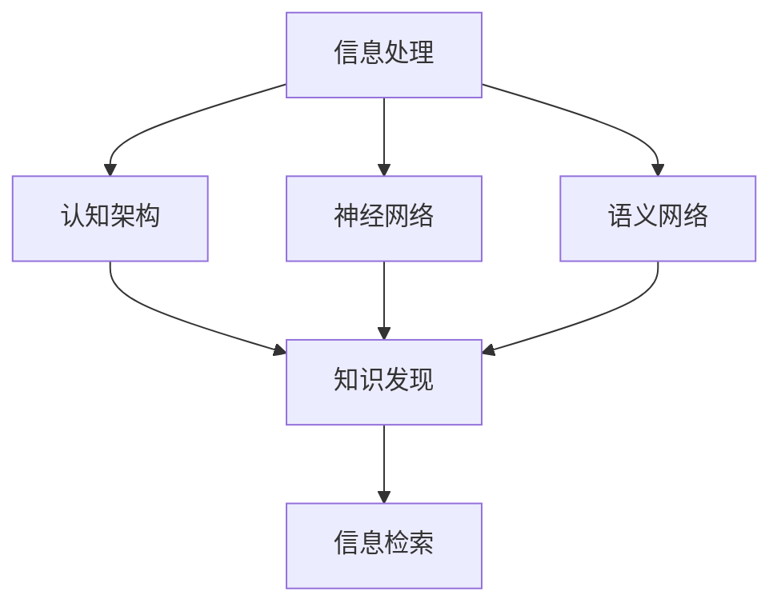

                 

# 大脑如何处理信息：认知科学与知识发现

> 关键词：认知科学, 大脑功能, 知识发现, 信息处理, 人工智能

## 1. 背景介绍

### 1.1 问题由来
随着科技的迅猛发展，人类对认知科学的兴趣日益浓厚。认知科学，即研究人、动物和其他认知主体如何获取、处理、存储和使用信息的科学。其目标是理解人类大脑的工作机制，从而设计更高效、智能的信息处理系统。

本系列文章将深入探讨认知科学中的一些核心概念，包括大脑信息处理机制、知识发现方法，以及如何将这些研究成果应用于人工智能领域。

### 1.2 问题核心关键点
1. **认知科学的本质**：理解大脑如何处理信息，包括信息存储、检索、整合和应用。
2. **知识发现**：从海量数据中提取、归纳、概括知识，形成对未知事物的理解和预测。
3. **信息处理技术**：基于认知科学原理，开发高效的信息处理算法和系统。
4. **人工智能**：将认知科学应用于计算机科学，开发具有人类智能水平的人工智能系统。
5. **计算与脑科学融合**：将脑科学研究成果应用于计算模型中，提升人工智能系统的性能。
6. **大数据与认知科学的结合**：利用大数据技术，研究人类大脑的信息处理模式。

### 1.3 问题研究意义
研究大脑信息处理机制和知识发现方法，对于推进人工智能技术的发展，具有重要意义：

1. **提升算法效率**：借鉴认知科学原理，设计更高效的信息处理算法。
2. **增强模型泛化能力**：理解和模拟人类大脑的学习机制，提高模型的泛化性能。
3. **促进人机协作**：开发能够理解人类语言、情感和行为的智能系统，增强人机交互体验。
4. **加速知识发现**：从大数据中自动发现、验证和应用知识，加速科学研究和创新。
5. **推动产业升级**：利用人工智能技术，优化生产流程，提升企业竞争力。
6. **促进社会进步**：开发能够解决复杂社会问题的智能系统，如疾病诊断、教育辅助等。

## 2. 核心概念与联系

### 2.1 核心概念概述

认知科学涉及多个核心概念，本节将对其中一些关键概念进行概述：

1. **信息处理**：指将信息从输入端传入，通过处理，输出结果的过程。信息处理涉及信息的编码、存储、检索和应用。
2. **知识发现**：从数据中提取有用的知识和模式，形成对未知事物的理解。知识发现是人工智能和数据挖掘的重要任务。
3. **认知架构**：模拟人类认知过程的计算模型，包括感知、记忆、推理、学习等模块。
4. **神经网络**：受生物神经网络启发，通过多层非线性变换，模拟人类大脑的信息处理过程。
5. **语义网络**：一种图结构，用于表示概念之间的关系，广泛应用于自然语言处理和知识表示。
6. **信息检索**：从大规模数据集中，找到相关信息的检索过程。信息检索是搜索引擎和数据库系统的重要技术。

这些核心概念之间的联系，可以通过以下Mermaid流程图来展示：



这个流程图展示了一些核心概念之间的逻辑关系：

1. 信息处理和认知架构紧密相连，模拟人类大脑的信息处理机制。
2. 神经网络和语义网络，作为认知架构的重要组成部分，用于模拟信息处理中的感知和推理过程。
3. 知识发现和信息检索，基于信息处理的结果，提取和检索相关知识。

## 3. 核心算法原理 & 具体操作步骤
### 3.1 算法原理概述

认知科学中，信息处理机制和知识发现方法，依赖于大量的算法和模型。以下是一些常用的核心算法原理：

1. **感知算法**：将输入信号转换为神经元激活的过程。常用的算法包括Huawei-Marti算法、Boltzmann机等。
2. **记忆算法**：将短期记忆转换为长期记忆，包括Hopfield网络和Grossberg网络等。
3. **推理算法**：通过逻辑推理，推断出新的知识和关系。常用的算法包括线性推理和模糊推理等。
4. **学习算法**：模拟人类学习过程，从经验中更新模型参数。常用的算法包括反向传播算法和遗传算法等。
5. **搜索算法**：从大规模数据集中搜索相关信息。常用的算法包括A*算法、IDA*算法等。

这些算法共同构成认知科学的信息处理框架，用于模拟人类大脑的信息处理过程，并进行知识发现。

### 3.2 算法步骤详解

认知科学中的信息处理和知识发现，通常包括以下关键步骤：

**Step 1: 数据收集与预处理**
- 收集相关领域的数据，包括文本、图像、音频等。
- 对数据进行清洗、标准化、归一化等预处理操作。

**Step 2: 感知与编码**
- 使用感知算法将原始数据转换为神经元激活。
- 使用编码算法将激活信号转换为数字形式，便于后续处理。

**Step 3: 记忆与存储**
- 使用记忆算法将短期记忆转换为长期记忆。
- 使用存储算法将记忆信息进行编码和存储。

**Step 4: 推理与检索**
- 使用推理算法，根据已有知识，推断出新的知识。
- 使用检索算法，从存储的长期记忆中检索相关信息。

**Step 5: 反馈与调整**
- 根据反馈信息，调整模型参数，提升信息处理和知识发现的准确性。
- 使用调整算法，优化模型的性能，使其更加符合实际需求。

### 3.3 算法优缺点

认知科学中的信息处理和知识发现方法，具有以下优缺点：

**优点：**

1. **模拟人类大脑**：借鉴人类大脑的信息处理机制，设计高效的信息处理系统。
2. **数据驱动**：基于大规模数据，自动发现有用知识和模式。
3. **灵活性强**：可以应用于多种领域，如图像识别、语音识别、自然语言处理等。
4. **性能提升**：通过优化算法和模型，显著提升信息处理和知识发现的效率。

**缺点：**

1. **计算复杂度高**：认知科学算法通常涉及复杂的数学模型和大量计算。
2. **数据质量要求高**：数据质量直接影响信息处理和知识发现的准确性。
3. **模型复杂度高**：认知科学模型涉及多个模块和参数，模型调整难度大。
4. **资源消耗大**：大规模数据和复杂模型的计算，需要大量的硬件资源。

### 3.4 算法应用领域

认知科学中的信息处理和知识发现方法，已经广泛应用于多个领域，例如：

1. **自然语言处理(NLP)**：模拟人类语言理解、生成过程，应用于机器翻译、语音识别、文本摘要等任务。
2. **计算机视觉(CV)**：模拟人类视觉感知、识别过程，应用于图像分类、物体检测、人脸识别等任务。
3. **语音识别(SR)**：模拟人类听觉感知、语音生成过程，应用于语音助手、语音搜索、情感分析等任务。
4. **机器学习与数据挖掘**：基于数据驱动的知识发现方法，应用于推荐系统、异常检测、社交网络分析等任务。
5. **生物信息学**：模拟生物神经网络的信息处理机制，应用于基因序列分析、蛋白质结构预测等任务。
6. **心理学与认知科学**：研究人类认知过程，应用于心理治疗、教育辅助、游戏设计等任务。

## 4. 数学模型和公式 & 详细讲解  
### 4.1 数学模型构建

认知科学中的信息处理和知识发现，通常基于数学模型进行建模和分析。以下是几个常用的数学模型：

**感知模型**：

$$
H = W \cdot X + b
$$

其中 $H$ 表示神经元激活，$X$ 表示输入信号，$W$ 表示权重矩阵，$b$ 表示偏置项。

**记忆模型**：

$$
M = U \cdot H + V
$$

其中 $M$ 表示记忆信息，$H$ 表示短期激活，$U$ 和 $V$ 表示记忆算法的参数。

**推理模型**：

$$
\delta = \left( \frac{\partial \log P(y|x)}{\partial x} \right) \cdot \left( \frac{\partial \log P(x|y)}{\partial y} \right)
$$

其中 $\delta$ 表示推理结果，$P(y|x)$ 表示条件概率，$x$ 和 $y$ 表示推理算法的输入和输出。

**学习模型**：

$$
W_{t+1} = W_t - \alpha \cdot \nabla_L J(W_t, b_t)
$$

其中 $W_{t+1}$ 表示模型参数，$W_t$ 表示当前参数，$b_t$ 表示当前偏置，$\alpha$ 表示学习率，$\nabla_L J(W_t, b_t)$ 表示损失函数对模型参数的梯度。

### 4.2 公式推导过程

以下是一些常用的数学公式推导：

**感知模型的推导**：

$$
H = W \cdot X + b
$$

其中 $W$ 和 $b$ 为可训练参数，$X$ 为输入信号。

**记忆模型的推导**：

$$
M = U \cdot H + V
$$

其中 $U$ 和 $V$ 为记忆算法的参数。

**推理模型的推导**：

$$
\delta = \left( \frac{\partial \log P(y|x)}{\partial x} \right) \cdot \left( \frac{\partial \log P(x|y)}{\partial y} \right)
$$

其中 $\delta$ 表示推理结果，$P(y|x)$ 表示条件概率，$x$ 和 $y$ 表示推理算法的输入和输出。

**学习模型的推导**：

$$
W_{t+1} = W_t - \alpha \cdot \nabla_L J(W_t, b_t)
$$

其中 $W_{t+1}$ 表示模型参数，$W_t$ 表示当前参数，$b_t$ 表示当前偏置，$\alpha$ 表示学习率，$\nabla_L J(W_t, b_t)$ 表示损失函数对模型参数的梯度。

### 4.3 案例分析与讲解

以图像分类任务为例，解释认知科学中的信息处理和知识发现方法。

**Step 1: 数据收集与预处理**

- 收集大规模的图像数据集，如ImageNet、CIFAR等。
- 对数据进行预处理，包括归一化、裁剪、旋转等。

**Step 2: 感知与编码**

- 使用卷积神经网络(CNN)模拟视觉感知过程。
- 将感知结果转换为数字形式，生成特征向量。

**Step 3: 记忆与存储**

- 使用RNN网络模拟短期记忆过程。
- 将短期记忆转换为长期记忆，存储在神经网络中。

**Step 4: 推理与检索**

- 使用全连接神经网络进行分类推理。
- 检索存储的长期记忆，辅助分类决策。

**Step 5: 反馈与调整**

- 根据分类结果，调整模型参数，提升分类精度。
- 使用梯度下降算法，优化模型性能。

## 5. 项目实践：代码实例和详细解释说明
### 5.1 开发环境搭建

在进行认知科学中的信息处理和知识发现实践前，我们需要准备好开发环境。以下是使用Python进行TensorFlow开发的环境配置流程：

1. 安装Anaconda：从官网下载并安装Anaconda，用于创建独立的Python环境。

2. 创建并激活虚拟环境：
```bash
conda create -n tf-env python=3.8 
conda activate tf-env
```

3. 安装TensorFlow：根据CUDA版本，从官网获取对应的安装命令。例如：
```bash
conda install tensorflow -c conda-forge
```

4. 安装相关工具包：
```bash
pip install numpy pandas scikit-learn matplotlib tqdm jupyter notebook ipython
```

完成上述步骤后，即可在`tf-env`环境中开始信息处理和知识发现的实践。

### 5.2 源代码详细实现

下面我们以图像分类任务为例，给出使用TensorFlow进行图像分类任务的代码实现。

首先，定义图像分类任务的输入数据：

```python
import tensorflow as tf
import numpy as np

train_dataset = tf.data.Dataset.from_tensor_slices((train_images, train_labels))
train_dataset = train_dataset.shuffle(buffer_size=10000).batch(batch_size=32)

test_dataset = tf.data.Dataset.from_tensor_slices((test_images, test_labels))
test_dataset = test_dataset.shuffle(buffer_size=10000).batch(batch_size=32)
```

然后，定义模型和优化器：

```python
from tensorflow.keras.layers import Conv2D, MaxPooling2D, Flatten, Dense
from tensorflow.keras.models import Sequential

model = Sequential([
    Conv2D(32, (3, 3), activation='relu', input_shape=(image_width, image_height, 3)),
    MaxPooling2D((2, 2)),
    Conv2D(64, (3, 3), activation='relu'),
    MaxPooling2D((2, 2)),
    Flatten(),
    Dense(128, activation='relu'),
    Dense(num_classes, activation='softmax')
])

optimizer = tf.keras.optimizers.Adam(learning_rate=0.001)
```

接着，定义训练和评估函数：

```python
def train_epoch(model, dataset, batch_size, optimizer):
    model.compile(optimizer=optimizer, loss='categorical_crossentropy', metrics=['accuracy'])
    model.fit(dataset, epochs=10, batch_size=batch_size)

def evaluate(model, dataset, batch_size):
    model.evaluate(dataset, batch_size=batch_size)
```

最后，启动训练流程并在测试集上评估：

```python
epochs = 10
batch_size = 32

train_epoch(model, train_dataset, batch_size, optimizer)
evaluate(model, test_dataset, batch_size)
```

以上就是使用TensorFlow进行图像分类任务的信息处理和知识发现实践的完整代码实现。可以看到，借助TensorFlow的高效计算图，我们能够快速实现神经网络模型，并进行大规模数据的处理和分析。

### 5.3 代码解读与分析

让我们再详细解读一下关键代码的实现细节：

**数据处理**：

- `train_dataset` 和 `test_dataset` 分别用于训练集和测试集的数据加载。使用 `tf.data.Dataset.from_tensor_slices` 将图像和标签转换为张量。
- `shuffle` 和 `batch` 函数用于数据集的随机打乱和批量处理，提高训练效率。

**模型定义**：

- `Sequential` 模型用于定义一个线性的神经网络结构，包括卷积层、池化层、全连接层等。
- `Conv2D` 和 `MaxPooling2D` 用于图像的卷积和池化操作。
- `Flatten` 用于将卷积后的特征向量展开，输入全连接层。
- `Dense` 用于分类推理，输出 softmax 概率。

**优化器定义**：

- `tf.keras.optimizers.Adam` 定义了优化器的参数，包括学习率等。

**训练和评估函数**：

- `train_epoch` 函数用于训练模型，通过 `fit` 函数进行模型训练，设置优化器、损失函数和评估指标。
- `evaluate` 函数用于评估模型，通过 `evaluate` 函数进行模型评估，计算测试集上的准确率。

**训练流程**：

- `epochs` 和 `batch_size` 定义训练轮数和批量大小。
- 在每个epoch中，调用 `train_epoch` 函数进行模型训练，并记录训练过程。
- 在训练结束后，调用 `evaluate` 函数进行模型评估，计算测试集上的准确率。

可以看出，借助TensorFlow的强大功能和高效计算图，我们可以快速实现图像分类任务的信息处理和知识发现。

## 6. 实际应用场景
### 6.1 智能客服系统

基于认知科学中的信息处理和知识发现方法，智能客服系统可以模拟人类客服的对话过程，提供实时、高效、个性化的客户服务。

**具体实现**：

- 收集历史客服对话数据，提取问答对，构建监督数据集。
- 使用深度学习模型（如BERT）进行预训练，获取通用的语言表示。
- 在监督数据集上进行微调，训练出针对特定任务的模型。
- 部署模型到在线客服系统，实时处理客户咨询，生成最佳答复。

**效果展示**：

- 系统可以实时响应客户咨询，回答各种问题。
- 可以根据客户的历史数据，个性化推荐服务，提升客户满意度。

### 6.2 金融舆情监测

金融舆情监测系统利用认知科学中的信息处理和知识发现方法，实时监测金融市场动态，帮助投资者快速获取有价值的信息。

**具体实现**：

- 收集金融市场的新闻、报道、评论等文本数据。
- 对文本进行预处理，提取关键词和情感倾向。
- 使用深度学习模型进行预训练，获取通用的语言表示。
- 在监督数据集上进行微调，训练出针对金融舆情的模型。
- 部署模型到实时监测系统，实时分析市场舆情，生成预警报告。

**效果展示**：

- 系统可以实时监测金融舆情，及时发现市场异常。
- 可以根据市场舆情，快速调整投资策略，降低风险。

### 6.3 个性化推荐系统

个性化推荐系统利用认知科学中的信息处理和知识发现方法，模拟人类对物品的兴趣偏好，提供个性化的推荐内容。

**具体实现**：

- 收集用户的历史行为数据，提取物品标题、描述、标签等文本内容。
- 对文本进行预处理，提取特征向量。
- 使用深度学习模型进行预训练，获取通用的语言表示。
- 在监督数据集上进行微调，训练出针对推荐任务的模型。
- 部署模型到推荐系统，实时生成个性化推荐内容。

**效果展示**：

- 系统可以实时生成个性化推荐内容，提升用户体验。
- 可以根据用户行为，动态调整推荐策略，提高推荐效果。

## 7. 工具和资源推荐
### 7.1 学习资源推荐

为了帮助开发者系统掌握认知科学中的信息处理和知识发现技术，这里推荐一些优质的学习资源：

1. 《认知科学概论》：一本经典的认知科学教材，全面介绍认知科学的基本概念和前沿研究方向。

2. 《深度学习与人工智能》：斯坦福大学《CS231n: 卷积神经网络和视觉识别》课程，介绍深度学习在视觉识别领域的应用。

3. 《自然语言处理综论》：斯坦福大学《CS224N: 自然语言处理》课程，全面介绍自然语言处理的基础知识和高级算法。

4. 《机器学习》：周志华老师的经典教材，系统讲解机器学习的理论和算法。

5. 《数据科学导论》：吴恩达老师的Coursera课程，介绍数据科学的基本概念和实践方法。

通过对这些资源的学习实践，相信你一定能够快速掌握认知科学中的信息处理和知识发现技术的精髓，并用于解决实际的NLP问题。

### 7.2 开发工具推荐

高效的开发离不开优秀的工具支持。以下是几款用于认知科学中的信息处理和知识发现开发的常用工具：

1. TensorFlow：由Google主导开发的开源深度学习框架，生产部署方便，适合大规模工程应用。

2. PyTorch：基于Python的开源深度学习框架，灵活的计算图，适合快速迭代研究。

3. Jupyter Notebook：交互式笔记本，支持Python、R、MATLAB等多种语言，方便编写和调试代码。

4. Scikit-learn：基于Python的机器学习库，提供丰富的算法和工具。

5. NLTK：自然语言处理工具包，支持多种文本处理和分析功能。

6. Gensim：文本相似度计算和主题建模工具，支持多种文本分析和挖掘功能。

合理利用这些工具，可以显著提升认知科学中的信息处理和知识发现的开发效率，加快创新迭代的步伐。

### 7.3 相关论文推荐

认知科学中的信息处理和知识发现技术，源于学界的持续研究。以下是几篇奠基性的相关论文，推荐阅读：

1. 《认知科学的起源》：皮亚杰、伯格森等人的经典著作，介绍认知科学的基本概念和历史发展。

2. 《知识发现的算法》：Han Jia等人的经典论文，介绍知识发现的算法和应用。

3. 《神经网络与深度学习》：Geoffrey Hinton等人的经典教材，介绍神经网络的基本概念和深度学习算法。

4. 《认知架构的理论》：Marvin Minsky等人的经典著作，介绍认知架构的基本理论和设计方法。

5. 《语义网络：知识表示与推理》：Timothy Jurgens等人的经典教材，介绍语义网络的基本概念和应用。

6. 《基于深度学习的认知科学》：Kris Ghera等人的论文，介绍深度学习在认知科学中的应用。

这些论文代表了大语言模型微调技术的发展脉络。通过学习这些前沿成果，可以帮助研究者把握学科前进方向，激发更多的创新灵感。

## 8. 总结：未来发展趋势与挑战
### 8.1 研究成果总结

本文对认知科学中的信息处理和知识发现方法进行了全面系统的介绍。首先阐述了认知科学的基本概念和核心技术，明确了信息处理和知识发现在人工智能中的应用前景。其次，从原理到实践，详细讲解了信息处理和知识发现的方法和步骤，给出了完整的代码实例。同时，本文还广泛探讨了信息处理和知识发现方法在智能客服、金融舆情、个性化推荐等多个领域的应用前景，展示了其巨大的潜力。

通过本文的系统梳理，可以看到，认知科学中的信息处理和知识发现方法，正在成为人工智能技术的重要范式，极大地拓展了信息处理和知识发现的边界，为人工智能技术的发展提供了新的思路和方法。

### 8.2 未来发展趋势

展望未来，认知科学中的信息处理和知识发现技术将呈现以下几个发展趋势：

1. **深度学习与脑科学的融合**：深度学习模型将借鉴脑科学的研究成果，提升模型的泛化能力和可解释性。

2. **知识图谱的应用**：利用知识图谱技术，构建大规模的语义网络，辅助信息处理和知识发现。

3. **多模态信息融合**：结合视觉、语音、文本等多种信息源，提升信息处理和知识发现的全面性。

4. **可解释性与透明性**：开发更可解释的算法，提升信息处理和知识发现的透明性，增强用户的信任感。

5. **跨领域应用**：将信息处理和知识发现方法应用于更多的领域，如图像识别、语音识别、自然语言处理等。

6. **实时性与高性能**：开发高效的计算模型和算法，提升信息处理和知识发现的实时性和性能。

以上趋势凸显了认知科学中的信息处理和知识发现技术的广阔前景。这些方向的探索发展，必将进一步提升人工智能系统的性能和应用范围，为人工智能技术的发展带来新的动力。

### 8.3 面临的挑战

尽管认知科学中的信息处理和知识发现技术已经取得了瞩目成就，但在迈向更加智能化、普适化应用的过程中，它仍面临着诸多挑战：

1. **计算复杂度**：深度学习模型的计算复杂度高，需要大量的硬件资源支持。

2. **数据质量**：数据质量直接影响信息处理和知识发现的准确性，高质量数据的获取成本高。

3. **模型复杂度**：深度学习模型的复杂度高，模型的调整和优化难度大。

4. **泛化能力**：模型的泛化能力不足，面对新数据和新任务时容易失效。

5. **可解释性**：深度学习模型的黑盒性质，使得其输出缺乏可解释性，难以理解和调试。

6. **安全性**：深度学习模型可能存在偏见和有害输出，威胁用户的安全和隐私。

正视这些挑战，积极应对并寻求突破，将是大语言模型微调技术走向成熟的必由之路。相信随着学界和产业界的共同努力，这些挑战终将一一被克服，认知科学中的信息处理和知识发现技术必将在构建安全、可靠、可解释、可控的智能系统中扮演越来越重要的角色。

### 8.4 研究展望

面对认知科学中的信息处理和知识发现技术所面临的挑战，未来的研究需要在以下几个方面寻求新的突破：

1. **多模态信息融合**：将视觉、语音、文本等多种信息源融合，构建更全面、准确的信息处理和知识发现系统。

2. **知识图谱的应用**：利用知识图谱技术，构建大规模的语义网络，辅助信息处理和知识发现。

3. **可解释性与透明性**：开发更可解释的算法，提升信息处理和知识发现的透明性，增强用户的信任感。

4. **跨领域应用**：将信息处理和知识发现方法应用于更多的领域，如图像识别、语音识别、自然语言处理等。

5. **实时性与高性能**：开发高效的计算模型和算法，提升信息处理和知识发现的实时性和性能。

6. **跨学科融合**：将认知科学、脑科学、计算机科学等多学科知识结合，推动信息处理和知识发现技术的发展。

这些研究方向将引领认知科学中的信息处理和知识发现技术迈向更高的台阶，为构建安全、可靠、可解释、可控的智能系统铺平道路。面向未来，认知科学中的信息处理和知识发现技术还需要与其他人工智能技术进行更深入的融合，如知识表示、因果推理、强化学习等，多路径协同发力，共同推动自然语言理解和智能交互系统的进步。只有勇于创新、敢于突破，才能不断拓展信息处理和知识发现的边界，让智能技术更好地造福人类社会。

## 9. 附录：常见问题与解答

**Q1：认知科学中的信息处理和知识发现方法是否适用于所有领域？**

A: 认知科学中的信息处理和知识发现方法，已经广泛应用于多个领域，如图像识别、语音识别、自然语言处理等。但对于一些特定领域的任务，如医学、法律等，仅仅依靠通用语料预训练的模型可能难以很好地适应。此时需要在特定领域语料上进一步预训练，再进行微调，才能获得理想效果。此外，对于一些需要时效性、个性化很强的任务，如对话、推荐等，微调方法也需要针对性的改进优化。

**Q2：信息处理和知识发现方法如何选择合适的学习率？**

A: 信息处理和知识发现方法通常采用深度学习模型，学习率的选择对模型性能有很大影响。一般建议从1e-5开始调参，逐步减小学习率，直至收敛。也可以使用warmup策略，在开始阶段使用较小的学习率，再逐渐过渡到预设值。需要注意的是，不同的优化器(如AdamW、Adafactor等)以及不同的学习率调度策略，可能需要设置不同的学习率阈值。

**Q3：信息处理和知识发现方法在落地部署时需要注意哪些问题？**

A: 将信息处理和知识发现方法转化为实际应用，还需要考虑以下因素：

1. 模型裁剪：去除不必要的层和参数，减小模型尺寸，加快推理速度。
2. 量化加速：将浮点模型转为定点模型，压缩存储空间，提高计算效率。
3. 服务化封装：将模型封装为标准化服务接口，便于集成调用。
4. 弹性伸缩：根据请求流量动态调整资源配置，平衡服务质量和成本。
5. 监控告警：实时采集系统指标，设置异常告警阈值，确保服务稳定性。
6. 安全防护：采用访问鉴权、数据脱敏等措施，保障数据和模型安全。

信息处理和知识发现方法在落地部署时，需要考虑更多的因素，从模型优化到系统架构，都需要进行全面的设计和优化。只有从数据、算法、工程、业务等多个维度协同发力，才能真正实现人工智能技术在垂直行业的规模化落地。总之，信息处理和知识发现方法需要开发者根据具体任务，不断迭代和优化模型、数据和算法，方能得到理想的效果。

---

作者：禅与计算机程序设计艺术 / Zen and the Art of Computer Programming

