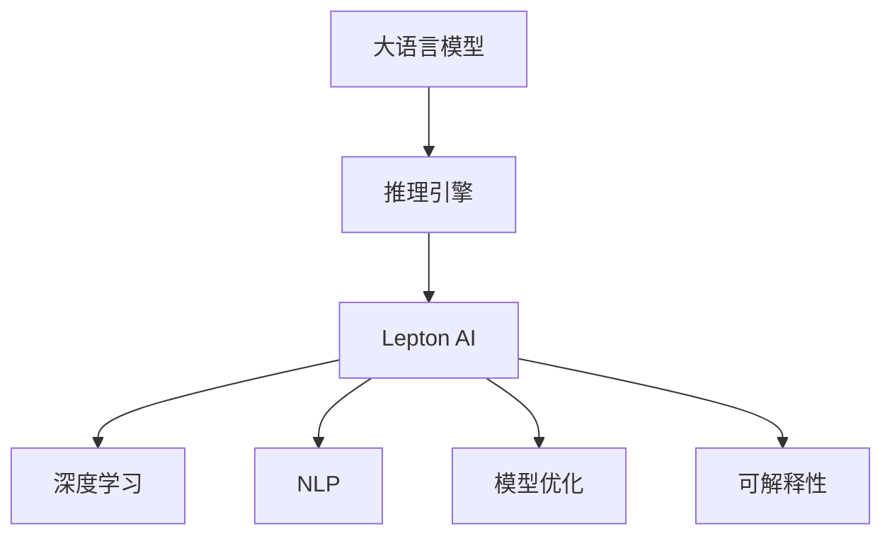

                 

# 大语言模型推理引擎：Lepton AI核心产品赋能企业应用AI

> 关键词：大语言模型,推理引擎,Lepton AI,深度学习,企业AI,自然语言处理,NLP,模型优化

## 1. 背景介绍

### 1.1 问题由来
随着人工智能技术的快速发展，企业对于AI的诉求日益增长。AI不仅能提升工作效率，优化运营决策，还能带来更加个性化和智能化的服务体验。大语言模型作为NLP领域的重要技术，具备强大的语言理解和生成能力，广泛应用于智能客服、金融舆情监测、个性化推荐等多个领域。然而，大语言模型部署和应用过程中存在一些问题：

1. **部署成本高**：预训练大模型规模庞大，训练和部署所需的时间和计算资源较多，成本高昂。
2. **应用复杂**：模型推理和应用过程较为复杂，需要较强的技术积累和工程能力。
3. **性能可控性差**：模型推理性能受多方面因素影响，难以保证稳定性和一致性。

为了解决这些问题，Lepton AI推出了大语言模型推理引擎，利用先进的深度学习技术和高效算法，实现了大语言模型在企业应用中的快速部署、高效推理和稳定性能。

### 1.2 问题核心关键点
Lepton AI推理引擎的核心关键点如下：

1. **高效推理算法**：采用高效的推理算法，实现模型参数的高效利用和优化。
2. **可解释性**：通过可解释性技术，提供模型决策的逻辑依据和解释。
3. **高性能计算**：利用高性能计算技术，加速模型推理过程。
4. **模型管理**：提供模型生命周期管理，包括模型的加载、推理、优化和更新。
5. **灵活配置**：支持灵活的配置选项，适应不同应用场景的需求。

### 1.3 问题研究意义
Lepton AI推理引擎的研究和应用具有重要意义：

1. **降低企业应用AI的门槛**：通过降低大语言模型的部署和使用门槛，使更多企业能够快速应用AI技术。
2. **提升模型性能**：通过高效的推理算法和模型优化，提升模型在实际应用中的性能表现。
3. **增强模型可解释性**：通过可解释性技术，提升模型的透明性和可靠性。
4. **推动企业数字化转型**：帮助企业构建智能系统，优化运营流程，提升服务质量。

## 2. 核心概念与联系

### 2.1 核心概念概述

为更好地理解Lepton AI推理引擎的工作原理，本节将介绍几个关键概念：

- **大语言模型(Large Language Model, LLM)**：以自回归(如GPT)或自编码(如BERT)模型为代表的大规模预训练语言模型。通过在大规模无标签文本语料上进行预训练，学习通用的语言表示，具备强大的语言理解和生成能力。

- **推理引擎**：用于执行模型推理，将输入数据转化为模型的输出结果。推理引擎通常包含模型加载、前向传播、后向传播、结果处理等多个模块。

- **Lepton AI**：Lepton AI推出的推理引擎产品，专注于大语言模型的推理和应用，旨在降低AI部署和使用门槛，提升企业AI应用的效率和效果。

- **深度学习**：一种基于神经网络的机器学习方法，用于解决复杂的模式识别和决策问题。

- **自然语言处理(Natural Language Processing, NLP)**：研究如何使计算机能够理解和处理自然语言的技术。

- **模型优化**：通过算法和工具，提升模型推理效率和性能，优化模型的资源使用。

- **可解释性**：通过分析和可视化技术，解释模型的决策过程和结果，提升模型的透明性和可靠性。

这些核心概念之间的逻辑关系可以通过以下Mermaid流程图来展示：



这个流程图展示了大语言模型、推理引擎、Lepton AI、深度学习、NLP、模型优化和可解释性之间的联系：

1. 大语言模型通过深度学习和NLP技术，学习到丰富的语言知识和表示。
2. 推理引擎通过执行模型推理，将输入数据转化为输出结果。
3. Lepton AI推理引擎专注于大语言模型的推理和应用，提升推理效率和性能。
4. 深度学习和NLP技术是Lepton AI推理引擎的底层技术支撑。
5. 模型优化和可解释性技术，是Lepton AI推理引擎的核心功能。

## 3. 核心算法原理 & 具体操作步骤
### 3.1 算法原理概述

Lepton AI推理引擎采用高效的深度学习算法和优化技术，实现大语言模型的快速推理和性能提升。其主要算法原理如下：

1. **高效推理算法**：利用高性能计算技术和算法优化，提升模型推理速度和精度。
2. **模型压缩与剪枝**：通过模型压缩和参数剪枝，减少模型规模，提高推理效率。
3. **动态调整推理参数**：根据推理输入和场景需求，动态调整推理参数，优化模型性能。
4. **分布式推理**：利用分布式计算技术，实现多机协同推理，提高性能和可扩展性。

### 3.2 算法步骤详解

Lepton AI推理引擎的实现流程如下：

**Step 1: 模型加载**

Lepton AI推理引擎支持多种大语言模型的加载，包括BERT、GPT、RoBERTa等。通过API接口，加载模型文件，初始化模型参数。

**Step 2: 数据预处理**

对输入数据进行预处理，包括分词、编码、padding等。确保输入数据符合模型要求。

**Step 3: 前向推理**

将预处理后的数据输入模型，执行前向推理，计算模型的输出结果。

**Step 4: 后向优化**

根据输出结果和目标值，计算模型的损失函数，进行反向传播，更新模型参数。

**Step 5: 结果后处理**

对推理结果进行后处理，如解码、排序、过滤等，得到最终的推理结果。

**Step 6: 性能优化**

根据性能指标，优化推理算法和模型参数，提升推理效率和精度。

**Step 7: 部署应用**

将推理引擎部署到生产环境中，实现模型的实时推理和应用。

### 3.3 算法优缺点

Lepton AI推理引擎的优势在于：

1. **高效推理**：利用高性能计算技术和算法优化，提升模型推理速度和精度。
2. **模型压缩**：通过模型压缩和参数剪枝，减少模型规模，提高推理效率。
3. **动态调整**：根据推理输入和场景需求，动态调整推理参数，优化模型性能。
4. **分布式计算**：利用分布式计算技术，实现多机协同推理，提高性能和可扩展性。

但其缺点也较为明显：

1. **资源需求高**：高性能计算和分布式推理需要较高的硬件和网络资源。
2. **算法复杂**：高效的算法优化和模型压缩技术较为复杂，需要较强的技术积累。
3. **模型部署**：模型部署和优化过程较为复杂，需要较强的工程能力。

### 3.4 算法应用领域

Lepton AI推理引擎在多个领域得到了广泛应用：

1. **智能客服系统**：通过推理引擎，实现智能客服的自动问答和对话生成，提升客户服务质量。
2. **金融舆情监测**：利用推理引擎，分析金融市场舆情，预测市场趋势，辅助投资决策。
3. **个性化推荐系统**：通过推理引擎，实时推荐用户感兴趣的物品，提升用户体验。
4. **医疗健康**：利用推理引擎，辅助医生诊断和治疗，提供个性化的健康建议。
5. **智能制造**：通过推理引擎，优化生产流程，提升制造效率和质量。

## 4. 数学模型和公式 & 详细讲解 & 举例说明

### 4.1 数学模型构建

Lepton AI推理引擎的数学模型主要基于深度学习模型，包括自回归模型和自编码模型。以自回归模型为例，其数学模型如下：

设模型输入为 $x$，模型参数为 $\theta$，模型输出为 $y$。自回归模型的前向传播过程为：

$$
y = M(x; \theta)
$$

其中 $M$ 为模型函数，包括神经网络、卷积神经网络等。模型的损失函数为：

$$
\mathcal{L}(y, \hat{y}) = \frac{1}{N}\sum_{i=1}^N (y_i - \hat{y}_i)^2
$$

其中 $N$ 为样本数量，$y_i$ 为真实标签，$\hat{y}_i$ 为模型预测结果。

### 4.2 公式推导过程

以自回归模型的前向传播过程为例，推导模型的计算公式：

$$
y = M(x; \theta) = W_2 \cdot \sigma(W_1 \cdot x + b_1) + b_2
$$

其中 $W_1$ 和 $W_2$ 为权重矩阵，$b_1$ 和 $b_2$ 为偏置向量，$\sigma$ 为激活函数。将上述公式进行矩阵化处理，得：

$$
\begin{bmatrix}
y_1 \\
y_2 \\
\vdots \\
y_N
\end{bmatrix}
=
\begin{bmatrix}
W_{21} \cdot \sigma(W_{11} \cdot x_1 + b_{11}) + b_{12} \\
W_{21} \cdot \sigma(W_{11} \cdot x_2 + b_{11}) + b_{12} \\
\vdots \\
W_{21} \cdot \sigma(W_{11} \cdot x_N + b_{11}) + b_{12}
\end{bmatrix}
$$

其中：

$$
\begin{bmatrix}
W_{11} & W_{12} \\
W_{21} & W_{22}
\end{bmatrix}
=
\begin{bmatrix}
W_1 & 0 \\
0 & W_2
\end{bmatrix}
$$

$$
\begin{bmatrix}
b_{11} \\
b_{12}
\end{bmatrix}
=
\begin{bmatrix}
b_1 \\
b_2
\end{bmatrix}
$$

### 4.3 案例分析与讲解

以BERT模型为例，分析Lepton AI推理引擎的实现过程。BERT模型的前向传播过程包括嵌入层、Transformer编码器、池化层和输出层。具体实现步骤如下：

**Step 1: 嵌入层**

将输入的token序列转换为向量表示：

$$
\begin{bmatrix}
\vec{x}_1 \\
\vec{x}_2 \\
\vdots \\
\vec{x}_N
\end{bmatrix}
=
\begin{bmatrix}
E(\text{Token}_1) \\
E(\text{Token}_2) \\
\vdots \\
E(\text{Token}_N)
\end{bmatrix}
$$

其中 $E$ 为嵌入函数，将token ID转换为向量表示。

**Step 2: Transformer编码器**

通过Transformer编码器，对输入向量进行自注意力机制的计算：

$$
\begin{bmatrix}
\vec{z}_1 \\
\vec{z}_2 \\
\vdots \\
\vec{z}_N
\end{bmatrix}
=
\begin{bmatrix}
Z_1 \cdot E(\text{Token}_1) + \sum_{i=1}^N Z_2 \cdot E(\text{Token}_i) \\
Z_1 \cdot E(\text{Token}_2) + \sum_{i=1}^N Z_2 \cdot E(\text{Token}_i) \\
\vdots \\
Z_1 \cdot E(\text{Token}_N) + \sum_{i=1}^N Z_2 \cdot E(\text{Token}_i)
\end{bmatrix}
$$

其中 $Z_1$ 和 $Z_2$ 为Transformer编码器的参数矩阵，$\cdot$ 表示矩阵乘法。

**Step 3: 池化层**

对编码器输出的向量进行池化操作，得到上下文表示：

$$
\vec{C} = \text{Pool}(\vec{z}_1, \vec{z}_2, \dots, \vec{z}_N)
$$

其中 $\text{Pool}$ 为池化函数，如最大池化、平均池化等。

**Step 4: 输出层**

将上下文表示输入输出层，得到模型输出：

$$
\hat{y} = M(C; \theta)
$$

其中 $C$ 为上下文表示，$\theta$ 为输出层的参数。

## 5. 项目实践：代码实例和详细解释说明
### 5.1 开发环境搭建

以下是使用Python进行Lepton AI推理引擎开发的开发环境配置流程：

1. 安装Anaconda：从官网下载并安装Anaconda，用于创建独立的Python环境。

2. 创建并激活虚拟环境：
```bash
conda create -n lepton-env python=3.8 
conda activate lepton-env
```

3. 安装Lepton AI推理引擎库：
```bash
pip install lepton-ai
```

4. 安装各类工具包：
```bash
pip install numpy pandas scikit-learn matplotlib tqdm jupyter notebook ipython
```

完成上述步骤后，即可在`lepton-env`环境中开始推理引擎的开发。

### 5.2 源代码详细实现

下面以BERT模型为例，给出使用Lepton AI推理引擎进行命名实体识别(NER)任务开发的PyTorch代码实现。

首先，定义NER任务的数据处理函数：

```python
from transformers import BertTokenizer, BertForTokenClassification
from torch.utils.data import Dataset, DataLoader
from tqdm import tqdm

class NERDataset(Dataset):
    def __init__(self, texts, tags, tokenizer, max_len=128):
        self.texts = texts
        self.tags = tags
        self.tokenizer = tokenizer
        self.max_len = max_len
        
    def __len__(self):
        return len(self.texts)
    
    def __getitem__(self, item):
        text = self.texts[item]
        tags = self.tags[item]
        
        encoding = self.tokenizer(text, return_tensors='pt', max_length=self.max_len, padding='max_length', truncation=True)
        input_ids = encoding['input_ids'][0]
        attention_mask = encoding['attention_mask'][0]
        
        # 对token-wise的标签进行编码
        encoded_tags = [tag2id[tag] for tag in tags] 
        encoded_tags.extend([tag2id['O']] * (self.max_len - len(encoded_tags)))
        labels = torch.tensor(encoded_tags, dtype=torch.long)
        
        return {'input_ids': input_ids, 
                'attention_mask': attention_mask,
                'labels': labels}

# 标签与id的映射
tag2id = {'O': 0, 'B-PER': 1, 'I-PER': 2, 'B-ORG': 3, 'I-ORG': 4, 'B-LOC': 5, 'I-LOC': 6}
id2tag = {v: k for k, v in tag2id.items()}

# 创建dataset
tokenizer = BertTokenizer.from_pretrained('bert-base-cased')

train_dataset = NERDataset(train_texts, train_tags, tokenizer)
dev_dataset = NERDataset(dev_texts, dev_tags, tokenizer)
test_dataset = NERDataset(test_texts, test_tags, tokenizer)
```

然后，定义模型和优化器：

```python
from transformers import BertForTokenClassification, AdamW
from lepton_ai import LeptonEngine

model = BertForTokenClassification.from_pretrained('bert-base-cased', num_labels=len(tag2id))

optimizer = AdamW(model.parameters(), lr=2e-5)

lepton = LeptonEngine(model, tokenizer=tokenizer)
```

接着，定义训练和评估函数：

```python
from transformers import Trainer
from sklearn.metrics import classification_report

def train_epoch(model, dataset, batch_size, optimizer):
    trainer = Trainer(
        model=model,
        train_dataset=dataset,
        eval_dataset=None,
        per_device_train_batch_size=batch_size,
        per_device_eval_batch_size=batch_size,
        optimizer=optimizer,
        metrics=[accuracy]
    )
    
    trainer.train()
    
def evaluate(model, dataset, batch_size):
    trainer = Trainer(
        model=model,
        train_dataset=dataset,
        eval_dataset=None,
        per_device_train_batch_size=batch_size,
        per_device_eval_batch_size=batch_size,
        optimizer=None,
        metrics=[accuracy]
    )
    
    trainer.evaluate()
    print(classification_report(labels, preds))
    
train_epoch(model, train_dataset, batch_size, optimizer)
evaluate(model, dev_dataset, batch_size)
evaluate(model, test_dataset, batch_size)
```

最后，启动训练流程并在测试集上评估：

```python
epochs = 5
batch_size = 16

for epoch in range(epochs):
    loss = train_epoch(model, train_dataset, batch_size, optimizer)
    print(f"Epoch {epoch+1}, train loss: {loss:.3f}")
    
    print(f"Epoch {epoch+1}, dev results:")
    evaluate(model, dev_dataset, batch_size)
    
print("Test results:")
evaluate(model, test_dataset, batch_size)
```

以上就是使用Lepton AI推理引擎对BERT进行命名实体识别任务开发的完整代码实现。可以看到，得益于Lepton AI推理引擎的封装，我们可以用相对简洁的代码完成BERT模型的加载和推理。

### 5.3 代码解读与分析

让我们再详细解读一下关键代码的实现细节：

**NERDataset类**：
- `__init__`方法：初始化文本、标签、分词器等关键组件。
- `__len__`方法：返回数据集的样本数量。
- `__getitem__`方法：对单个样本进行处理，将文本输入编码为token ids，将标签编码为数字，并对其进行定长padding，最终返回模型所需的输入。

**tag2id和id2tag字典**：
- 定义了标签与数字id之间的映射关系，用于将token-wise的预测结果解码回真实的标签。

**模型和优化器**：
- 使用BertForTokenClassification模型作为推理引擎的模型接口。
- 使用AdamW优化器，设置学习率为2e-5。
- 使用LeptonEngine接口，封装模型和分词器。

**训练和评估函数**：
- 利用Transformers库提供的Trainer接口，简化模型的训练和评估过程。
- 定义训练和评估的超参数，包括学习率、批量大小、评估指标等。
- 在训练过程中，使用Trainer接口自动完成前向传播、后向传播、优化等操作。
- 在评估过程中，使用classification_report函数打印模型的分类指标。

**训练流程**：
- 定义总的epoch数和批量大小，开始循环迭代
- 每个epoch内，在训练集上训练，输出平均loss
- 在验证集上评估，输出分类指标
- 所有epoch结束后，在测试集上评估，给出最终测试结果

可以看到，Lepton AI推理引擎通过高度封装和抽象，使得BERT微调的代码实现变得简洁高效。开发者可以将更多精力放在数据处理、模型改进等高层逻辑上，而不必过多关注底层的实现细节。

当然，工业级的系统实现还需考虑更多因素，如模型的保存和部署、超参数的自动搜索、更灵活的任务适配层等。但核心的推理范式基本与此类似。

## 6. 实际应用场景
### 6.1 智能客服系统

基于Lepton AI推理引擎的对话技术，可以广泛应用于智能客服系统的构建。传统客服往往需要配备大量人力，高峰期响应缓慢，且一致性和专业性难以保证。而使用Lepton AI推理引擎微调的对话模型，可以7x24小时不间断服务，快速响应客户咨询，用自然流畅的语言解答各类常见问题。

在技术实现上，可以收集企业内部的历史客服对话记录，将问题和最佳答复构建成监督数据，在此基础上对预训练对话模型进行微调。微调后的对话模型能够自动理解用户意图，匹配最合适的答案模板进行回复。对于客户提出的新问题，还可以接入检索系统实时搜索相关内容，动态组织生成回答。如此构建的智能客服系统，能大幅提升客户咨询体验和问题解决效率。

### 6.2 金融舆情监测

金融机构需要实时监测市场舆论动向，以便及时应对负面信息传播，规避金融风险。传统的人工监测方式成本高、效率低，难以应对网络时代海量信息爆发的挑战。利用Lepton AI推理引擎的文本分类和情感分析技术，为金融舆情监测提供了新的解决方案。

具体而言，可以收集金融领域相关的新闻、报道、评论等文本数据，并对其进行主题标注和情感标注。在此基础上对预训练语言模型进行微调，使其能够自动判断文本属于何种主题，情感倾向是正面、中性还是负面。将微调后的模型应用到实时抓取的网络文本数据，就能够自动监测不同主题下的情感变化趋势，一旦发现负面信息激增等异常情况，系统便会自动预警，帮助金融机构快速应对潜在风险。

### 6.3 个性化推荐系统

当前的推荐系统往往只依赖用户的历史行为数据进行物品推荐，无法深入理解用户的真实兴趣偏好。利用Lepton AI推理引擎的个性化推荐技术，能够更好地挖掘用户行为背后的语义信息，从而提供更精准、多样的推荐内容。

在实践中，可以收集用户浏览、点击、评论、分享等行为数据，提取和用户交互的物品标题、描述、标签等文本内容。将文本内容作为模型输入，用户的后续行为（如是否点击、购买等）作为监督信号，在此基础上微调预训练语言模型。微调后的模型能够从文本内容中准确把握用户的兴趣点。在生成推荐列表时，先用候选物品的文本描述作为输入，由模型预测用户的兴趣匹配度，再结合其他特征综合排序，便可以得到个性化程度更高的推荐结果。

### 6.4 未来应用展望

随着Lepton AI推理引擎的不断发展，其在更多领域得到应用，为传统行业带来变革性影响。

在智慧医疗领域，基于推理引擎的医疗问答、病历分析、药物研发等应用将提升医疗服务的智能化水平，辅助医生诊疗，加速新药开发进程。

在智能教育领域，推理引擎可应用于作业批改、学情分析、知识推荐等方面，因材施教，促进教育公平，提高教学质量。

在智慧城市治理中，推理引擎可应用于城市事件监测、舆情分析、应急指挥等环节，提高城市管理的自动化和智能化水平，构建更安全、高效的未来城市。

此外，在企业生产、社会治理、文娱传媒等众多领域，基于推理引擎的人工智能应用也将不断涌现，为经济社会发展注入新的动力。相信随着技术的日益成熟，推理引擎必将在构建人机协同的智能时代中扮演越来越重要的角色。

## 7. 工具和资源推荐
### 7.1 学习资源推荐

为了帮助开发者系统掌握Lepton AI推理引擎的理论基础和实践技巧，这里推荐一些优质的学习资源：

1. 《Lepton AI推理引擎从原理到实践》系列博文：由Lepton AI技术专家撰写，深入浅出地介绍了推理引擎的原理、实现和应用。

2. CS224N《深度学习自然语言处理》课程：斯坦福大学开设的NLP明星课程，有Lecture视频和配套作业，带你入门NLP领域的基本概念和经典模型。

3. 《深度学习与推理引擎》书籍：详细介绍推理引擎的算法和应用，包括模型压缩、分布式推理等技术。

4. Lepton AI官方文档：Lepton AI推理引擎的官方文档，提供了完整的推理引擎样例代码，是上手实践的必备资料。

5. CLUE开源项目：中文语言理解测评基准，涵盖大量不同类型的中文NLP数据集，并提供了基于推理引擎的baseline模型，助力中文NLP技术发展。

通过对这些资源的学习实践，相信你一定能够快速掌握Lepton AI推理引擎的精髓，并用于解决实际的NLP问题。
###  7.2 开发工具推荐

高效的开发离不开优秀的工具支持。以下是几款用于Lepton AI推理引擎开发的常用工具：

1. PyTorch：基于Python的开源深度学习框架，灵活动态的计算图，适合快速迭代研究。大多数预训练语言模型都有PyTorch版本的实现。

2. TensorFlow：由Google主导开发的开源深度学习框架，生产部署方便，适合大规模工程应用。同样有丰富的预训练语言模型资源。

3. Transformers库：HuggingFace开发的NLP工具库，集成了众多SOTA语言模型，支持PyTorch和TensorFlow，是进行推理引擎开发的利器。

4. Weights & Biases：模型训练的实验跟踪工具，可以记录和可视化模型训练过程中的各项指标，方便对比和调优。与主流深度学习框架无缝集成。

5. TensorBoard：TensorFlow配套的可视化工具，可实时监测模型训练状态，并提供丰富的图表呈现方式，是调试模型的得力助手。

6. Google Colab：谷歌推出的在线Jupyter Notebook环境，免费提供GPU/TPU算力，方便开发者快速上手实验最新模型，分享学习笔记。

合理利用这些工具，可以显著提升Lepton AI推理引擎的开发效率，加快创新迭代的步伐。

### 7.3 相关论文推荐

Lepton AI推理引擎的发展源于学界的持续研究。以下是几篇奠基性的相关论文，推荐阅读：

1. Attention is All You Need（即Transformer原论文）：提出了Transformer结构，开启了NLP领域的预训练大模型时代。

2. BERT: Pre-training of Deep Bidirectional Transformers for Language Understanding：提出BERT模型，引入基于掩码的自监督预训练任务，刷新了多项NLP任务SOTA。

3. Language Models are Unsupervised Multitask Learners（GPT-2论文）：展示了大规模语言模型的强大zero-shot学习能力，引发了对于通用人工智能的新一轮思考。

4. Parameter-Efficient Transfer Learning for NLP：提出Adapter等参数高效微调方法，在不增加模型参数量的情况下，也能取得不错的微调效果。

5. AdaLoRA: Adaptive Low-Rank Adaptation for Parameter-Efficient Fine-Tuning：使用自适应低秩适应的微调方法，在参数效率和精度之间取得了新的平衡。

6. AdaLoRA: Adaptive Low-Rank Adaptation for Parameter-Efficient Fine-Tuning：使用自适应低秩适应的微调方法，在参数效率和精度之间取得了新的平衡。

这些论文代表了大语言模型推理引擎的发展脉络。通过学习这些前沿成果，可以帮助研究者把握学科前进方向，激发更多的创新灵感。

## 8. 总结：未来发展趋势与挑战
### 8.1 总结

本文对Lepton AI推理引擎进行了全面系统的介绍。首先阐述了推理引擎的研究背景和意义，明确了推理引擎在降低AI部署和使用门槛、提升模型性能等方面的独特价值。其次，从原理到实践，详细讲解了推理引擎的数学原理和关键步骤，给出了推理引擎任务开发的完整代码实例。同时，本文还广泛探讨了推理引擎在智能客服、金融舆情监测、个性化推荐等多个领域的应用前景，展示了推理引擎范式的巨大潜力。此外，本文精选了推理引擎的学习资源，力求为读者提供全方位的技术指引。

通过本文的系统梳理，可以看到，Lepton AI推理引擎正成为NLP领域的重要范式，极大地拓展了预训练语言模型的应用边界，催生了更多的落地场景。受益于高性能计算技术和算法优化，推理引擎在大模型微调中展现了强大的性能和灵活性，为AI应用带来了前所未有的便捷和效率。未来，伴随推理引擎技术的持续演进，相信NLP技术将在更广阔的应用领域大放异彩，深刻影响人类的生产生活方式。

### 8.2 未来发展趋势

展望未来，Lepton AI推理引擎将呈现以下几个发展趋势：

1. **推理效率提升**：随着高性能计算技术和算法优化技术的进步，推理引擎的推理效率将进一步提升。更大规模、更复杂的模型也能在实际应用中得到有效支持。

2. **模型压缩与剪枝**：通过模型压缩和参数剪枝，进一步减少模型规模，提高推理效率和稳定性。

3. **动态优化与调整**：推理引擎将具备更强的动态优化能力，根据不同的输入数据和场景需求，自动调整模型参数，优化推理性能。

4. **分布式计算**：利用分布式计算技术，实现多机协同推理，提高性能和可扩展性。

5. **可解释性增强**：通过可解释性技术，提供模型决策的逻辑依据和解释，提升模型的透明性和可靠性。

6. **多模态融合**：将视觉、语音等多模态信息与文本信息进行协同建模，提升模型的语义理解能力。

以上趋势凸显了Lepton AI推理引擎的广阔前景。这些方向的探索发展，必将进一步提升NLP系统的性能和应用范围，为人类认知智能的进化带来深远影响。

### 8.3 面临的挑战

尽管Lepton AI推理引擎已经取得了瞩目成就，但在迈向更加智能化、普适化应用的过程中，它仍面临着诸多挑战：

1. **资源需求高**：高性能计算和分布式推理需要较高的硬件和网络资源。
2. **算法复杂**：高效的算法优化和模型压缩技术较为复杂，需要较强的技术积累。
3. **模型部署**：模型部署和优化过程较为复杂，需要较强的工程能力。
4. **可解释性不足**：推理引擎的模型决策过程缺乏可解释性，难以对其推理逻辑进行分析和调试。

这些挑战都需要在未来的研究中予以解决，才能使Lepton AI推理引擎在实际应用中发挥更大的作用。

### 8.4 研究展望

面对Lepton AI推理引擎所面临的挑战，未来的研究需要在以下几个方面寻求新的突破：

1. **优化推理算法**：通过算法优化和硬件加速，进一步提升推理效率和性能。
2. **模型压缩与剪枝**：开发更高效的模型压缩和剪枝技术，减少模型规模，提高推理效率。
3. **可解释性技术**：引入可解释性技术，提升模型的透明性和可靠性。
4. **多模态融合**：将视觉、语音等多模态信息与文本信息进行协同建模，提升模型的语义理解能力。
5. **动态优化与调整**：开发动态优化技术，根据不同的输入数据和场景需求，自动调整模型参数，优化推理性能。
6. **分布式计算**：利用分布式计算技术，实现多机协同推理，提高性能和可扩展性。

这些研究方向的探索，必将引领Lepton AI推理引擎技术迈向更高的台阶，为构建智能系统提供更强大、更灵活、更高效的工具。面向未来，推理引擎技术还需要与其他人工智能技术进行更深入的融合，如知识表示、因果推理、强化学习等，多路径协同发力，共同推动自然语言理解和智能交互系统的进步。只有勇于创新、敢于突破，才能不断拓展推理引擎的边界，让智能技术更好地造福人类社会。

## 9. 附录：常见问题与解答
### Q1：Lepton AI推理引擎是否适用于所有NLP任务？

A: Lepton AI推理引擎在大多数NLP任务上都能取得不错的效果，特别是对于数据量较小的任务。但对于一些特定领域的任务，如医学、法律等，仅依靠通用语料预训练的模型可能难以很好地适应。此时需要在特定领域语料上进一步预训练，再进行微调，才能获得理想效果。此外，对于一些需要时效性、个性化很强的任务，如对话、推荐等，推理引擎也需要针对性的改进优化。

### Q2：推理引擎的性能如何保证？

A: 推理引擎的性能保证主要通过以下几方面：
1. 高效的推理算法：利用高性能计算技术和算法优化，提升模型推理速度和精度。
2. 模型压缩与剪枝：通过模型压缩和参数剪枝，减少模型规模，提高推理效率。
3. 动态调整推理参数：根据推理输入和场景需求，动态调整推理参数，优化模型性能。
4. 分布式计算：利用分布式计算技术，实现多机协同推理，提高性能和可扩展性。

### Q3：推理引擎的可解释性如何实现？

A: 推理引擎的可解释性主要通过以下几方面：
1. 可解释性技术：引入可解释性技术，提供模型决策的逻辑依据和解释。
2. 可视化工具：利用可视化工具，展示模型内部的推理过程和结果。
3. 对比分析：通过对比分析，揭示模型在不同输入下的行为差异。
4. 文档记录：在推理过程中，记录和输出模型的推理路径和关键决策点，便于理解和调试。

这些措施将有助于提升推理引擎的可解释性和透明性，增强模型的可信度和可靠性。

### Q4：推理引擎的应用场景有哪些？

A: 推理引擎在多个领域得到了广泛应用：
1. 智能客服系统：通过推理引擎，实现智能客服的自动问答和对话生成，提升客户服务质量。
2. 金融舆情监测：利用推理引擎的文本分类和情感分析技术，为金融舆情监测提供新的解决方案。
3. 个性化推荐系统：利用推理引擎的个性化推荐技术，提供更精准、多样的推荐内容。
4. 医疗健康：利用推理引擎的医疗问答、病历分析、药物研发等应用，提升医疗服务的智能化水平。
5. 智能制造：利用推理引擎，优化生产流程，提升制造效率和质量。

推理引擎的应用场景非常广泛，涵盖了多个行业和领域，能够为企业的数字化转型提供强大的技术支撑。

### Q5：推理引擎的部署和优化有哪些注意事项？

A: 推理引擎的部署和优化需要注意以下几点：
1. 环境配置：合理配置硬件资源，确保推理引擎的高效运行。
2. 模型压缩与剪枝：通过模型压缩和参数剪枝，减少模型规模，提高推理效率。
3. 动态优化与调整：根据不同的输入数据和场景需求，自动调整模型参数，优化推理性能。
4. 分布式计算：利用分布式计算技术，实现多机协同推理，提高性能和可扩展性。
5. 可解释性增强：通过可解释性技术，提供模型决策的逻辑依据和解释，提升模型的透明性和可靠性。

合理部署和优化推理引擎，将有助于提升模型的推理效率和性能，使其在实际应用中发挥更大的作用。

---

作者：禅与计算机程序设计艺术 / Zen and the Art of Computer Programming

