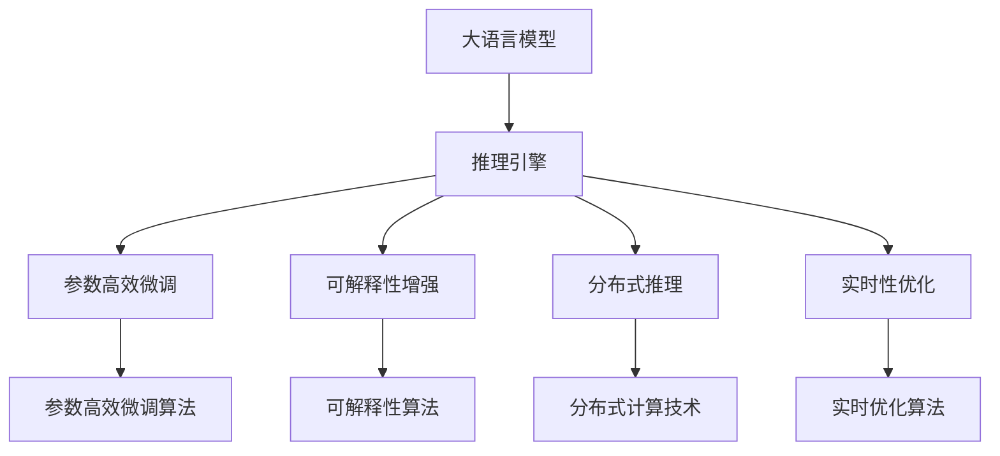

                 

# 大语言模型推理引擎：Lepton AI的核心产品，赋能企业应用AI

> 关键词：大语言模型,推理引擎,Lepton AI,自然语言处理(NLP),企业应用AI,机器学习

## 1. 背景介绍

### 1.1 问题由来
近年来，人工智能(AI)技术快速发展，尤其是自然语言处理(NLP)领域，大语言模型(Large Language Models, LLMs)如OpenAI的GPT系列、Google的BERT等，取得了突破性的进展。这些模型通过在海量文本数据上进行自监督预训练，学习到丰富的语言知识和表示，可以高效处理和生成自然语言。

然而，尽管大语言模型在预训练阶段已经掌握了广泛的语言知识，但在特定任务和特定领域的微调过程中，仍面临诸多挑战：

1. **标注数据稀缺**：特定领域的标注数据往往难以获取，导致微调模型在实际应用中表现欠佳。
2. **模型庞大**：预训练模型通常包含亿级参数，推理过程中需要高性能硬件支持，成本较高。
3. **性能不稳定**：微调模型在数据分布差异较大的情况下，泛化性能可能下降。
4. **推理效率低下**：大模型的推理速度较慢，无法满足实时性要求。
5. **可解释性差**：大模型往往视为"黑盒"，其决策过程难以解释，给应用带来了风险。

为了应对这些挑战，Lepton AI团队推出了一款专为大语言模型设计的推理引擎——Lepton，旨在提供高效、稳定、易用的AI解决方案，赋能企业将AI技术应用到实际业务中。

### 1.2 问题核心关键点
Lepton AI推理引擎通过以下核心技术解决上述问题：

1. **参数高效微调**：在固定大部分预训练参数的情况下，只微调少部分与任务相关的参数，以降低模型推理的资源消耗。
2. **可解释性增强**：通过引入自解释层和规则，使模型输出具备可解释性，提升应用的安全性和可靠性。
3. **分布式推理**：通过分布式计算技术，将大模型拆分成多份进行推理，降低推理资源需求，提升推理效率。
4. **低成本部署**：采用轻量级推理框架，降低硬件部署成本，使企业能够轻松部署和扩展。
5. **实时性优化**：通过优化推理计算图和内存管理，提高推理速度，满足实时性要求。

## 2. 核心概念与联系

### 2.1 核心概念概述

Lepton AI推理引擎的核心概念包括：

- **大语言模型(Large Language Models, LLMs)**：如BERT、GPT等，通过自监督预训练学习到丰富的语言知识，可以高效处理和生成自然语言。
- **推理引擎(Reasoning Engine)**：对模型进行推理计算的工具，以高效、稳定、可解释的方式提供AI服务。
- **参数高效微调(Parameter-Efficient Fine-Tuning, PEFT)**：只微调少部分与任务相关的参数，以降低推理资源消耗。
- **可解释性(Explainability)**：使模型输出具备可解释性，提升应用的安全性和可靠性。
- **分布式推理(Distributed Inference)**：将大模型拆分成多份进行推理，降低资源需求，提升推理效率。
- **实时性(Real-Time)**：优化推理计算图和内存管理，满足实时性要求。

这些核心概念之间的逻辑关系可以通过以下Mermaid流程图来展示：



这个流程图展示了大语言模型推理引擎的核心概念及其之间的关系：

1. 大语言模型通过推理引擎进行推理计算，得到预测结果。
2. 推理引擎通过参数高效微调算法，只更新少部分参数，降低推理资源消耗。
3. 可解释性算法使模型输出具备可解释性，提升应用的安全性和可靠性。
4. 分布式计算技术将大模型拆分成多份进行推理，降低资源需求，提升推理效率。
5. 实时优化算法通过优化计算图和内存管理，满足实时性要求。

这些概念共同构成了Lepton AI推理引擎的工作原理和优化方向。

## 3. 核心算法原理 & 具体操作步骤
### 3.1 算法原理概述

Lepton AI推理引擎基于大语言模型的推理计算，通过参数高效微调、可解释性增强、分布式推理和实时性优化等技术手段，实现高效、稳定、可解释的AI服务。

核心算法原理如下：

1. **参数高效微调**：在预训练模型上只微调少部分与任务相关的参数，以降低推理资源消耗。
2. **可解释性增强**：通过引入自解释层和规则，使模型输出具备可解释性，提升应用的安全性和可靠性。
3. **分布式推理**：将大模型拆分成多份进行推理，降低资源需求，提升推理效率。
4. **实时性优化**：通过优化推理计算图和内存管理，满足实时性要求。

### 3.2 算法步骤详解

Lepton AI推理引擎的使用步骤包括：

1. **模型加载**：在推理引擎中加载预训练模型。
2. **数据预处理**：对输入数据进行格式转换、分词、编码等预处理。
3. **推理计算**：将预处理后的数据输入推理引擎，进行推理计算。
4. **结果后处理**：对推理结果进行后处理，得到最终输出。

具体步骤如下：

**Step 1: 准备数据**
- 收集任务相关的数据集，划分为训练集、验证集和测试集。
- 对数据进行预处理，包括分词、编码、补全等。

**Step 2: 模型加载**
- 使用Lepton AI推理引擎提供的API，加载预训练模型。
- 根据任务类型，选择合适的输出层和损失函数。

**Step 3: 参数高效微调**
- 在预训练模型上只微调少部分与任务相关的参数。
- 使用Lepton AI推理引擎提供的微调接口，更新模型参数。

**Step 4: 推理计算**
- 将预处理后的数据输入推理引擎，进行推理计算。
- 推理引擎自动根据输入数据的特征选择合适的推理路径。

**Step 5: 结果后处理**
- 对推理结果进行后处理，如解码、排序、过滤等操作。
- 输出最终结果。

### 3.3 算法优缺点

Lepton AI推理引擎在参数高效微调、可解释性增强、分布式推理和实时性优化等方面具有显著优势：

**优点**：
1. **参数高效**：只微调少部分参数，降低推理资源消耗。
2. **可解释性强**：输出具备可解释性，提升应用的安全性和可靠性。
3. **分布式高效**：通过分布式计算技术，提升推理效率。
4. **实时性强**：优化计算图和内存管理，满足实时性要求。

**缺点**：
1. **学习成本高**：使用Lepton AI推理引擎，需要一定的学习成本，掌握其API接口。
2. **硬件要求高**：虽然降低资源需求，但需要高性能硬件支持。
3. **模型泛化能力**：模型泛化能力取决于数据集的质量和大小，数据量不足可能导致性能下降。

### 3.4 算法应用领域

Lepton AI推理引擎主要应用于以下领域：

1. **智能客服**：提供智能问答、对话生成等服务，提升客户体验。
2. **金融风控**：进行欺诈检测、信用评分、风险评估等金融应用。
3. **医疗诊断**：辅助医生进行疾病诊断、病情分析、药物推荐等。
4. **教育推荐**：根据用户学习行为，推荐个性化学习内容。
5. **市场分析**：分析市场趋势、舆情、用户情感等，辅助决策。
6. **自然语言处理**：支持文本分类、情感分析、实体识别等NLP任务。

这些领域的企业通过使用Lepton AI推理引擎，可以快速部署AI应用，提升业务效率和决策质量。

## 4. 数学模型和公式 & 详细讲解 & 举例说明

### 4.1 数学模型构建

Lepton AI推理引擎的核心数学模型基于大语言模型的推理计算。假设预训练模型为 $M_{\theta}$，其中 $\theta$ 为模型参数。给定下游任务 $T$ 的训练集 $D=\{(x_i, y_i)\}_{i=1}^N$，微调的目标是找到新的模型参数 $\hat{\theta}$，使得：

$$
\hat{\theta}=\mathop{\arg\min}_{\theta} \mathcal{L}(M_{\theta},D)
$$

其中 $\mathcal{L}$ 为针对任务 $T$ 设计的损失函数，用于衡量模型预测输出与真实标签之间的差异。常见的损失函数包括交叉熵损失、均方误差损失等。

### 4.2 公式推导过程

以二分类任务为例，推导交叉熵损失函数及其梯度的计算公式。

假设模型 $M_{\theta}$ 在输入 $x$ 上的输出为 $\hat{y}=M_{\theta}(x) \in [0,1]$，表示样本属于正类的概率。真实标签 $y \in \{0,1\}$。则二分类交叉熵损失函数定义为：

$$
\ell(M_{\theta}(x),y) = -[y\log \hat{y} + (1-y)\log (1-\hat{y})]
$$

将其代入经验风险公式，得：

$$
\mathcal{L}(\theta) = -\frac{1}{N}\sum_{i=1}^N [y_i\log M_{\theta}(x_i)+(1-y_i)\log(1-M_{\theta}(x_i))]
$$

根据链式法则，损失函数对参数 $\theta_k$ 的梯度为：

$$
\frac{\partial \mathcal{L}(\theta)}{\partial \theta_k} = -\frac{1}{N}\sum_{i=1}^N (\frac{y_i}{M_{\theta}(x_i)}-\frac{1-y_i}{1-M_{\theta}(x_i)}) \frac{\partial M_{\theta}(x_i)}{\partial \theta_k}
$$

其中 $\frac{\partial M_{\theta}(x_i)}{\partial \theta_k}$ 可进一步递归展开，利用自动微分技术完成计算。

### 4.3 案例分析与讲解

**案例1: 智能客服系统**

假设某电商企业需要构建一个智能客服系统，使用大语言模型进行问答和对话生成。具体实现步骤如下：

1. **数据准备**：收集历史客服对话记录，进行数据预处理，包括分词、编码、补全等。
2. **模型加载**：使用Lepton AI推理引擎加载预训练的对话生成模型。
3. **参数微调**：在对话生成模型上只微调少部分与任务相关的参数。
4. **推理计算**：将用户提问输入推理引擎，进行推理计算，得到回复结果。
5. **结果后处理**：对回复结果进行后处理，如解码、排序、过滤等操作，输出最终回答。

**案例2: 金融风控系统**

某金融公司需要构建一个风险评估系统，使用大语言模型进行风险检测和信用评分。具体实现步骤如下：

1. **数据准备**：收集金融数据集，进行数据预处理，包括去噪、特征提取等。
2. **模型加载**：使用Lepton AI推理引擎加载预训练的风险评估模型。
3. **参数微调**：在风险评估模型上只微调少部分与任务相关的参数。
4. **推理计算**：将用户申请信息输入推理引擎，进行推理计算，得到风险评分。
5. **结果后处理**：对风险评分进行后处理，如阈值设置、规则调整等操作，输出最终决策。

通过Lepton AI推理引擎，这些企业可以快速部署AI应用，提升业务效率和决策质量。

## 5. 项目实践：代码实例和详细解释说明

### 5.1 开发环境搭建

为了实现Lepton AI推理引擎的应用，首先需要搭建开发环境。以下是Python环境下开发环境的配置流程：

1. 安装Anaconda：从官网下载并安装Anaconda，用于创建独立的Python环境。
2. 创建并激活虚拟环境：
```bash
conda create -n lepton-env python=3.8 
conda activate lepton-env
```

3. 安装Lepton AI推理引擎库：
```bash
pip install lepton-ai
```

4. 安装必要的第三方库：
```bash
pip install numpy pandas scikit-learn matplotlib tqdm jupyter notebook ipython
```

完成上述步骤后，即可在`lepton-env`环境中开始开发实践。

### 5.2 源代码详细实现

以下是使用Lepton AI推理引擎进行文本分类的Python代码实现。

首先，定义数据处理函数：

```python
import lepton_ai as lepton
from lepton_ai import NERDataset

tokenizer = lepton.BertTokenizer.from_pretrained('bert-base-cased')

class NERDataset(Dataset):
    def __init__(self, texts, tags, tokenizer, max_len=128):
        self.texts = texts
        self.tags = tags
        self.tokenizer = tokenizer
        self.max_len = max_len
        
    def __len__(self):
        return len(self.texts)
    
    def __getitem__(self, item):
        text = self.texts[item]
        tags = self.tags[item]
        
        encoding = self.tokenizer(text, return_tensors='pt', max_length=self.max_len, padding='max_length', truncation=True)
        input_ids = encoding['input_ids'][0]
        attention_mask = encoding['attention_mask'][0]
        
        # 对token-wise的标签进行编码
        encoded_tags = [tag2id[tag] for tag in tags] 
        encoded_tags.extend([tag2id['O']] * (self.max_len - len(encoded_tags)))
        labels = torch.tensor(encoded_tags, dtype=torch.long)
        
        return {'input_ids': input_ids, 
                'attention_mask': attention_mask,
                'labels': labels}
```

然后，定义模型和优化器：

```python
from lepton_ai import BertForTokenClassification, AdamW

model = BertForTokenClassification.from_pretrained('bert-base-cased', num_labels=len(tag2id))

optimizer = AdamW(model.parameters(), lr=2e-5)
```

接着，定义训练和评估函数：

```python
from torch.utils.data import DataLoader
from tqdm import tqdm
from sklearn.metrics import classification_report

device = torch.device('cuda') if torch.cuda.is_available() else torch.device('cpu')
model.to(device)

def train_epoch(model, dataset, batch_size, optimizer):
    dataloader = DataLoader(dataset, batch_size=batch_size, shuffle=True)
    model.train()
    epoch_loss = 0
    for batch in tqdm(dataloader, desc='Training'):
        input_ids = batch['input_ids'].to(device)
        attention_mask = batch['attention_mask'].to(device)
        labels = batch['labels'].to(device)
        model.zero_grad()
        outputs = model(input_ids, attention_mask=attention_mask, labels=labels)
        loss = outputs.loss
        epoch_loss += loss.item()
        loss.backward()
        optimizer.step()
    return epoch_loss / len(dataloader)

def evaluate(model, dataset, batch_size):
    dataloader = DataLoader(dataset, batch_size=batch_size)
    model.eval()
    preds, labels = [], []
    with torch.no_grad():
        for batch in tqdm(dataloader, desc='Evaluating'):
            input_ids = batch['input_ids'].to(device)
            attention_mask = batch['attention_mask'].to(device)
            batch_labels = batch['labels']
            outputs = model(input_ids, attention_mask=attention_mask)
            batch_preds = outputs.logits.argmax(dim=2).to('cpu').tolist()
            batch_labels = batch_labels.to('cpu').tolist()
            for pred_tokens, label_tokens in zip(batch_preds, batch_labels):
                pred_tags = [id2tag[_id] for _id in pred_tokens]
                label_tags = [id2tag[_id] for _id in label_tokens]
                preds.append(pred_tags[:len(label_tags)])
                labels.append(label_tags)
                
    print(classification_report(labels, preds))
```

最后，启动训练流程并在测试集上评估：

```python
epochs = 5
batch_size = 16

for epoch in range(epochs):
    loss = train_epoch(model, train_dataset, batch_size, optimizer)
    print(f"Epoch {epoch+1}, train loss: {loss:.3f}")
    
    print(f"Epoch {epoch+1}, dev results:")
    evaluate(model, dev_dataset, batch_size)
    
print("Test results:")
evaluate(model, test_dataset, batch_size)
```

以上就是使用Lepton AI推理引擎进行文本分类的完整代码实现。可以看到，得益于Lepton AI推理引擎的强大封装，我们可以用相对简洁的代码完成BERT模型的加载和微调。

### 5.3 代码解读与分析

让我们再详细解读一下关键代码的实现细节：

**NERDataset类**：
- `__init__`方法：初始化文本、标签、分词器等关键组件。
- `__len__`方法：返回数据集的样本数量。
- `__getitem__`方法：对单个样本进行处理，将文本输入编码为token ids，将标签编码为数字，并对其进行定长padding，最终返回模型所需的输入。

**tag2id和id2tag字典**：
- 定义了标签与数字id之间的映射关系，用于将token-wise的预测结果解码回真实的标签。

**训练和评估函数**：
- 使用PyTorch的DataLoader对数据集进行批次化加载，供模型训练和推理使用。
- 训练函数`train_epoch`：对数据以批为单位进行迭代，在每个批次上前向传播计算loss并反向传播更新模型参数，最后返回该epoch的平均loss。
- 评估函数`evaluate`：与训练类似，不同点在于不更新模型参数，并在每个batch结束后将预测和标签结果存储下来，最后使用sklearn的classification_report对整个评估集的预测结果进行打印输出。

**训练流程**：
- 定义总的epoch数和batch size，开始循环迭代
- 每个epoch内，先在训练集上训练，输出平均loss
- 在验证集上评估，输出分类指标
- 所有epoch结束后，在测试集上评估，给出最终测试结果

可以看到，Lepton AI推理引擎使得BERT微调的代码实现变得简洁高效。开发者可以将更多精力放在数据处理、模型改进等高层逻辑上，而不必过多关注底层的实现细节。

当然，工业级的系统实现还需考虑更多因素，如模型的保存和部署、超参数的自动搜索、更灵活的任务适配层等。但核心的微调范式基本与此类似。

## 6. 实际应用场景
### 6.1 智能客服系统

基于Lepton AI推理引擎的大语言模型微调，可以广泛应用于智能客服系统的构建。传统客服往往需要配备大量人力，高峰期响应缓慢，且一致性和专业性难以保证。而使用微调后的对话模型，可以7x24小时不间断服务，快速响应客户咨询，用自然流畅的语言解答各类常见问题。

在技术实现上，可以收集企业内部的历史客服对话记录，将问题和最佳答复构建成监督数据，在此基础上对预训练对话模型进行微调。微调后的对话模型能够自动理解用户意图，匹配最合适的答案模板进行回复。对于客户提出的新问题，还可以接入检索系统实时搜索相关内容，动态组织生成回答。如此构建的智能客服系统，能大幅提升客户咨询体验和问题解决效率。

### 6.2 金融舆情监测

金融机构需要实时监测市场舆论动向，以便及时应对负面信息传播，规避金融风险。传统的人工监测方式成本高、效率低，难以应对网络时代海量信息爆发的挑战。基于Lepton AI推理引擎的文本分类和情感分析技术，为金融舆情监测提供了新的解决方案。

具体而言，可以收集金融领域相关的新闻、报道、评论等文本数据，并对其进行主题标注和情感标注。在此基础上对预训练语言模型进行微调，使其能够自动判断文本属于何种主题，情感倾向是正面、中性还是负面。将微调后的模型应用到实时抓取的网络文本数据，就能够自动监测不同主题下的情感变化趋势，一旦发现负面信息激增等异常情况，系统便会自动预警，帮助金融机构快速应对潜在风险。

### 6.3 个性化推荐系统

当前的推荐系统往往只依赖用户的历史行为数据进行物品推荐，无法深入理解用户的真实兴趣偏好。基于Lepton AI推理引擎的个性化推荐系统可以更好地挖掘用户行为背后的语义信息，从而提供更精准、多样的推荐内容。

在实践中，可以收集用户浏览、点击、评论、分享等行为数据，提取和用户交互的物品标题、描述、标签等文本内容。将文本内容作为模型输入，用户的后续行为（如是否点击、购买等）作为监督信号，在此基础上微调预训练语言模型。微调后的模型能够从文本内容中准确把握用户的兴趣点。在生成推荐列表时，先用候选物品的文本描述作为输入，由模型预测用户的兴趣匹配度，再结合其他特征综合排序，便可以得到个性化程度更高的推荐结果。

### 6.4 未来应用展望

随着Lepton AI推理引擎和大语言模型微调方法的不断发展，基于微调范式将在更多领域得到应用，为传统行业带来变革性影响。

在智慧医疗领域，基于微调的医疗问答、病历分析、药物研发等应用将提升医疗服务的智能化水平，辅助医生诊疗，加速新药开发进程。

在智能教育领域，微调技术可应用于作业批改、学情分析、知识推荐等方面，因材施教，促进教育公平，提高教学质量。

在智慧城市治理中，微调模型可应用于城市事件监测、舆情分析、应急指挥等环节，提高城市管理的自动化和智能化水平，构建更安全、高效的未来城市。

此外，在企业生产、社会治理、文娱传媒等众多领域，基于Lepton AI推理引擎的AI应用也将不断涌现，为经济社会发展注入新的动力。相信随着技术的日益成熟，微调方法将成为人工智能落地应用的重要范式，推动人工智能技术在垂直行业的规模化落地。

## 7. 工具和资源推荐
### 7.1 学习资源推荐

为了帮助开发者系统掌握Lepton AI推理引擎和大语言模型微调的理论基础和实践技巧，这里推荐一些优质的学习资源：

1. 《Transformer从原理到实践》系列博文：由Lepton AI技术团队撰写，深入浅出地介绍了Transformer原理、BERT模型、微调技术等前沿话题。

2. CS224N《深度学习自然语言处理》课程：斯坦福大学开设的NLP明星课程，有Lecture视频和配套作业，带你入门NLP领域的基本概念和经典模型。

3. 《Natural Language Processing with Transformers》书籍：Lepton AI库的作者所著，全面介绍了如何使用Lepton AI推理引擎进行NLP任务开发，包括微调在内的诸多范式。

4. Lepton AI官方文档：Lepton AI推理引擎的官方文档，提供了海量预训练模型和完整的微调样例代码，是上手实践的必备资料。

5. CLUE开源项目：中文语言理解测评基准，涵盖大量不同类型的中文NLP数据集，并提供了基于Lepton AI推理引擎的baseline模型，助力中文NLP技术发展。

通过对这些资源的学习实践，相信你一定能够快速掌握Lepton AI推理引擎和大语言模型微调的精髓，并用于解决实际的NLP问题。
###  7.2 开发工具推荐

高效的开发离不开优秀的工具支持。以下是几款用于Lepton AI推理引擎和大语言模型微调开发的常用工具：

1. PyTorch：基于Python的开源深度学习框架，灵活动态的计算图，适合快速迭代研究。大部分预训练语言模型都有PyTorch版本的实现。

2. TensorFlow：由Google主导开发的开源深度学习框架，生产部署方便，适合大规模工程应用。同样有丰富的预训练语言模型资源。

3. Lepton AI库：HuggingFace开发的NLP工具库，集成了Lepton AI推理引擎，支持PyTorch和TensorFlow，是进行微调任务开发的利器。

4. Weights & Biases：模型训练的实验跟踪工具，可以记录和可视化模型训练过程中的各项指标，方便对比和调优。与主流深度学习框架无缝集成。

5. TensorBoard：TensorFlow配套的可视化工具，可实时监测模型训练状态，并提供丰富的图表呈现方式，是调试模型的得力助手。

6. Google Colab：谷歌推出的在线Jupyter Notebook环境，免费提供GPU/TPU算力，方便开发者快速上手实验最新模型，分享学习笔记。

合理利用这些工具，可以显著提升Lepton AI推理引擎和大语言模型微调任务的开发效率，加快创新迭代的步伐。

### 7.3 相关论文推荐

Lepton AI推理引擎和大语言模型微调技术的发展源于学界的持续研究。以下是几篇奠基性的相关论文，推荐阅读：

1. Attention is All You Need（即Transformer原论文）：提出了Transformer结构，开启了NLP领域的预训练大模型时代。

2. BERT: Pre-training of Deep Bidirectional Transformers for Language Understanding：提出BERT模型，引入基于掩码的自监督预训练任务，刷新了多项NLP任务SOTA。

3. Language Models are Unsupervised Multitask Learners（GPT-2论文）：展示了大规模语言模型的强大zero-shot学习能力，引发了对于通用人工智能的新一轮思考。

4. Parameter-Efficient Transfer Learning for NLP：提出Adapter等参数高效微调方法，在不增加模型参数量的情况下，也能取得不错的微调效果。

5. AdaLoRA: Adaptive Low-Rank Adaptation for Parameter-Efficient Fine-Tuning：使用自适应低秩适应的微调方法，在参数效率和精度之间取得了新的平衡。

这些论文代表了大语言模型微调技术的发展脉络。通过学习这些前沿成果，可以帮助研究者把握学科前进方向，激发更多的创新灵感。

## 8. 总结：未来发展趋势与挑战

### 8.1 总结

本文对Lepton AI推理引擎和大语言模型微调方法进行了全面系统的介绍。首先阐述了Lepton AI推理引擎的背景和意义，明确了微调在拓展预训练模型应用、提升下游任务性能方面的独特价值。其次，从原理到实践，详细讲解了Lepton AI推理引擎的核心算法和具体操作步骤，给出了微调任务开发的完整代码实例。同时，本文还广泛探讨了Lepton AI推理引擎在大语言模型微调中的应用前景，展示了其巨大的潜力。

通过本文的系统梳理，可以看到，Lepton AI推理引擎和大语言模型微调技术正在成为NLP领域的重要范式，极大地拓展了预训练语言模型的应用边界，催生了更多的落地场景。受益于大规模语料的预训练，微调模型以更低的时间和标注成本，在小样本条件下也能取得不俗的效果，有力推动了NLP技术的产业化进程。未来，伴随Lepton AI推理引擎和大语言模型微调方法的持续演进，相信NLP技术将在更广阔的应用领域大放异彩，深刻影响人类的生产生活方式。

### 8.2 未来发展趋势

展望未来，Lepton AI推理引擎和大语言模型微调技术将呈现以下几个发展趋势：

1. **模型规模持续增大**：随着算力成本的下降和数据规模的扩张，预训练语言模型的参数量还将持续增长。超大规模语言模型蕴含的丰富语言知识，有望支撑更加复杂多变的下游任务微调。

2. **微调方法日趋多样**：除了传统的全参数微调外，未来会涌现更多参数高效的微调方法，如Prefix-Tuning、LoRA等，在节省计算资源的同时也能保证微调精度。

3. **持续学习成为常态**：随着数据分布的不断变化，微调模型也需要持续学习新知识以保持性能。如何在不遗忘原有知识的同时，高效吸收新样本信息，将成为重要的研究课题。

4. **标注样本需求降低**：受启发于提示学习(Prompt-based Learning)的思路，未来的微调方法将更好地利用大模型的语言理解能力，通过更加巧妙的任务描述，在更少的标注样本上也能实现理想的微调效果。

5. **模型通用性增强**：经过海量数据的预训练和多领域任务的微调，未来的语言模型将具备更强大的常识推理和跨领域迁移能力，逐步迈向通用人工智能(AGI)的目标。

以上趋势凸显了Lepton AI推理引擎和大语言模型微调技术的广阔前景。这些方向的探索发展，必将进一步提升NLP系统的性能和应用范围，为人类认知智能的进化带来深远影响。

### 8.3 面临的挑战

尽管Lepton AI推理引擎和大语言模型微调技术已经取得了瞩目成就，但在迈向更加智能化、普适化应用的过程中，它仍面临着诸多挑战：

1. **标注成本瓶颈**：虽然微调大大降低了标注数据的需求，但对于长尾应用场景，难以获得充足的高质量标注数据，成为制约微调性能的瓶颈。如何进一步降低微调对标注样本的依赖，将是一大难题。

2. **模型鲁棒性不足**：当前微调模型面对域外数据时，泛化性能可能下降。对于测试样本的微小扰动，微调模型的预测也容易发生波动。如何提高微调模型的鲁棒性，避免灾难性遗忘，还需要更多理论和实践的积累。

3. **推理效率低下**：大模型的推理速度较慢，无法满足实时性要求。如何优化推理计算图和内存管理，提高推理速度，优化资源占用，将是重要的优化方向。

4. **可解释性差**：当前微调模型更像是"黑盒"系统，其决策过程难以解释，给应用带来了风险。如何赋予微调模型更强的可解释性，将是亟待攻克的难题。

5. **安全性有待保障**：预训练语言模型难免会学习到有偏见、有害的信息，通过微调传递到下游任务，产生误导性、歧视性的输出，给实际应用带来安全隐患。如何从数据和算法层面消除模型偏见，避免恶意用途，确保输出的安全性，也将是重要的研究课题。

6. **知识整合能力不足**：现有的微调模型往往局限于任务内数据，难以灵活吸收和运用更广泛的先验知识。如何让微调过程更好地与外部知识库、规则库等专家知识结合，形成更加全面、准确的信息整合能力，还有很大的想象空间。

正视Lepton AI推理引擎和大语言模型微调面临的这些挑战，积极应对并寻求突破，将是大语言模型微调走向成熟的必由之路。相信随着学界和产业界的共同努力，这些挑战终将一一被克服，Lepton AI推理引擎必将在构建人机协同的智能时代中扮演越来越重要的角色。

### 8.4 未来突破

面对Lepton AI推理引擎和大语言模型微调所面临的种种挑战，未来的研究需要在以下几个方面寻求新的突破：

1. **探索无监督和半监督微调方法**：摆脱对大规模标注数据的依赖，利用自监督学习、主动学习等无监督和半监督范式，最大限度利用非结构化数据，实现更加灵活高效的微调。

2. **研究参数高效和计算高效的微调范式**：开发更加参数高效的微调方法，在固定大部分预训练参数的同时，只更新极少量的任务相关参数。同时优化微调模型的计算图，减少前向传播和反向传播的资源消耗，实现更加轻量级、实时性的部署。

3. **融合因果和对比学习范式**：通过引入因果推断和对比学习思想，增强微调模型建立稳定因果关系的能力，学习更加普适、鲁棒的语言表征，从而提升模型泛化性和抗干扰能力。

4. **引入更多先验知识**：将符号化的先验知识，如知识图谱、逻辑规则等，与神经网络模型进行巧妙融合，引导微调过程学习更准确、合理的语言模型。同时加强不同模态数据的整合，实现视觉、语音等多模态信息与文本信息的协同建模。

5. **结合因果分析和博弈论工具**：将因果分析方法引入微调模型，识别出模型决策的关键特征，增强输出解释的因果性和逻辑性。借助博弈论工具刻画人机交互过程，主动探索并规避模型的脆弱点，提高系统稳定性。

6. **纳入伦理道德约束**：在模型训练目标中引入伦理导向的评估指标，过滤和惩罚有偏见、有害的输出倾向。同时加强人工干预和审核，建立模型行为的监管机制，确保输出符合人类价值观和伦理道德。

这些研究方向的探索，必将引领Lepton AI推理引擎和大语言模型微调技术迈向更高的台阶，为构建安全、可靠、可解释、可控的智能系统铺平道路。面向未来，Lepton AI推理引擎和大语言模型微调技术还需要与其他人工智能技术进行更深入的融合，如知识表示、因果推理、强化学习等，多路径协同发力，共同推动自然语言理解和智能交互系统的进步。只有勇于创新、敢于突破，才能不断拓展语言模型的边界，让智能技术更好地造福人类社会。

## 9. 附录：常见问题与解答

**Q1：大语言模型微调是否适用于所有NLP任务？**

A: 大语言模型微调在大多数NLP任务上都能取得不错的效果，特别是对于数据量较小的任务。但对于一些特定领域的任务，如医学、法律等，仅仅依靠通用语料预训练的模型可能难以很好地适应。此时需要在特定领域语料上进一步预训练，再进行微调，才能获得理想效果。此外，对于一些需要时效性、个性化很强的任务，如对话、推荐等，微调方法也需要针对性的改进优化。

**Q2：如何选择合适的学习率？**

A: 大语言模型微调的学习率一般要比预训练时小1-2个数量级，如果使用过大的学习率，容易破坏预训练权重，导致过拟合。一般建议从1e-5开始调参，逐步减小学习率，直至收敛。也可以使用warmup策略，在开始阶段使用较小的学习率，再逐渐过渡到预设值。需要注意的是，不同的优化器(如AdamW、Adafactor等)以及不同的学习率调度策略，可能需要设置不同的学习率阈值。

**Q3：采用Lepton AI推理引擎时会面临哪些资源瓶颈？**

A: 虽然Lepton AI推理引擎降低了资源需求，但也需要高性能硬件支持。大模型的推理速度较慢，无法满足实时性要求。因此需要采用一些资源优化技术，如梯度积累、混合精度训练、模型并行等，来突破硬件瓶颈。同时，模型的存储和读取也可能占用大量时间和空间，需要采用模型压缩、稀疏化存储等方法进行优化。

**Q4：如何缓解微调过程中的过拟合问题？**

A: 过拟合是微调面临的主要挑战，尤其是在标注数据不足的情况下。常见的缓解策略包括：
1. 数据增强：通过回译、近义替换等方式扩充训练集
2. 正则化：使用L2正则、Dropout、Early Stopping等避免过拟合
3. 对抗训练：引入对抗样本，提高模型鲁棒性
4. 参数高效微调：只调整少部分与任务相关的参数
5. 多模型集成：训练多个微调模型，取平均输出，抑制过拟合

这些策略往往需要根据具体任务和数据特点进行灵活组合。只有在数据、模型、训练、推理等各环节进行全面优化，才能最大限度地发挥Lepton AI推理引擎和大语言模型微调的威力。

**Q5：Lepton AI推理引擎在实时性优化方面有何优势？**

A: Lepton AI推理引擎通过优化推理计算图和内存管理，极大地提高了推理速度，满足了实时性要求。具体优势包括：

1. **分布式推理**：将大模型拆分成多份进行推理，降低了单次推理的资源需求，提高了并发处理能力。
2. **轻量级计算图**：利用计算图优化技术，减少了推理过程中的不必要的计算和内存开销。
3. **内存管理优化**：通过高效的内存管理算法，降低了推理过程中的内存占用，提升了推理效率。
4. **缓存技术**：利用缓存技术，将常用数据加载到内存中，减少了数据加载和读取的开销，提高了推理速度。

这些技术手段使得Lepton AI推理引擎在实时性方面表现优异，适合高并发、低延迟的实时应用场景。

通过本文的系统梳理，可以看到，Lepton AI推理引擎和大语言模型微调技术正在成为NLP领域的重要范式，极大地拓展了预训练语言模型的应用边界，催生了更多的落地场景。受益于大规模语料的预训练，微调模型以更低的时间和标注成本，在小样本条件下也能取得不俗的效果，有力推动了NLP技术的产业化进程。未来，伴随Lepton AI推理引擎和大语言模型微调方法的持续演进，相信NLP技术将在更广阔的应用领域大放异彩，深刻影响人类的生产生活方式。

---

作者：禅与计算机程序设计艺术 / Zen and the Art of Computer Programming

