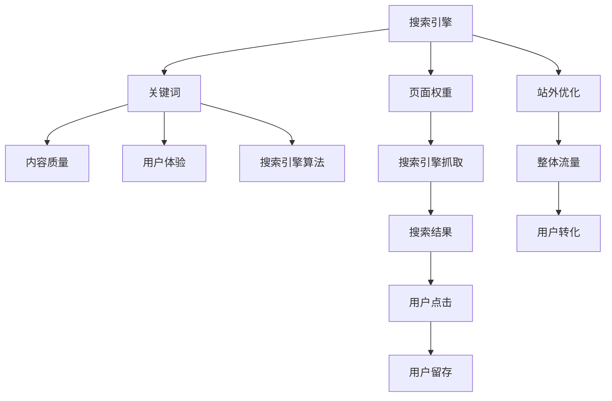

                 

# 如何利用SEO技术提升知识付费产品曝光

> 关键词：知识付费,SEO优化,内容营销,搜索引擎,自然流量

## 1. 背景介绍

### 1.1 问题由来
在互联网信息爆炸的今天，知识付费市场迅速崛起，各类在线课程、电子书、专栏文章等知识产品层出不穷。尽管如此，消费者对知识内容的消费欲望强烈，但其搜索行为却常受限于搜索结果的可发现性，导致潜在客户流失。

伴随搜索引擎技术的不断演进，当前搜索引擎对内容的抓取和展示更加精准，为知识付费产品提供了新的曝光机会。但问题也随之而来：如何在搜索引擎中脱颖而出，提升产品曝光率，获取更多潜在用户？

### 1.2 问题核心关键点
利用SEO技术提升知识付费产品曝光的核心，在于充分利用搜索引擎的抓取机制和用户体验优化策略，优化网站结构，改善网站内容，以提高搜索结果中的排名，吸引更多用户点击和购买。

SEO技术的应用场景主要包括：

- 网页优化：针对单个页面进行SEO优化，提升其在搜索结果中的排名。
- 网站优化：针对整个网站结构进行SEO优化，提升网站的整体流量和曝光率。
- 内容优化：针对网站内容进行SEO优化，使其在搜索结果中更具吸引力。
- 技术优化：针对网站的技术架构进行SEO优化，提升搜索引擎抓取效率。

### 1.3 问题研究意义
SEO技术是知识付费平台获取自然流量的重要手段之一，对于提升平台用户活跃度、营收能力具有重要意义。通过SEO优化，可以扩大目标用户的覆盖范围，吸引更多有意向的潜在客户。

通过SEO优化，知识付费平台可以获得：

- 降低付费广告成本。SEO自然流量相较于付费广告成本更低，且用户转换率高。
- 提升平台品牌影响力。SEO优化可帮助知识付费平台建立品牌权威，提升用户信任。
- 加强用户粘性。SEO优化通过提供优质内容和用户体验，提升用户满意度和忠诚度。
- 拓展新用户群体。SEO优化可触及到更多搜索用户，为平台带来新的流量来源。

SEO技术不仅有助于知识付费产品获得更多曝光机会，还为平台的长期稳定发展提供支持，具有重要的实际应用价值。

## 2. 核心概念与联系

### 2.1 核心概念概述

为更好地理解SEO技术在知识付费产品中的应用，本节将介绍几个密切相关的核心概念：

- 搜索引擎：如Google、Bing等，负责抓取、索引和展示网页，是SEO优化效果的重要衡量标准。
- 关键词：用户在搜索时输入的查询词，SEO优化的核心是匹配用户输入的关键词。
- 搜索引擎算法：搜索引擎用于排名网页的算法，如PageRank、BERT等，影响网页的排名位置。
- 页面权重：搜索引擎根据网页的相关性、权威性、用户反馈等因素赋予网页的权重，影响其排名。
- 内容质量：网页内容的价值和质量，直接影响用户体验和搜索引擎的算法评估。
- 用户体验：用户在页面上的行为和满意度，影响网页在搜索引擎中的排名和用户留存。
- 站外优化：如友链建设、社交媒体营销等，提升网站的整体权重和流量。

这些核心概念之间的逻辑关系可以通过以下Mermaid流程图来展示：



这个流程图展示了这个优化过程的各个关键步骤，从搜索引擎的抓取开始，到站外优化带来的整体流量和用户转化结束。

## 3. 核心算法原理 & 具体操作步骤
### 3.1 算法原理概述

SEO优化主要是通过提升目标网页在搜索引擎中的排名来实现的。其核心在于通过关键词匹配和内容优化，提升网页的相关性和权威性，从而在搜索结果中获得更高的权重和曝光率。

搜索引擎排名主要基于以下因素：

1. 关键词匹配：网页标题、内容、元数据等与用户查询词的匹配度。
2. 内容质量：网页内容的深度、广度、独特性等，是否满足用户需求。
3. 用户体验：页面加载速度、响应时间、互动元素等，是否提升用户满意度。
4. 外链建设：高质量的反向链接，提升网页权威性和权重。
5. 移动友好性：网页在移动设备上的访问表现，是否优化移动体验。
6. 安全性和隐私：网页的安全协议、隐私保护措施等，是否确保用户安全。

SEO优化的目标在于优化这些因素，使目标网页在搜索引擎中排名靠前，获取更多自然流量。

### 3.2 算法步骤详解

SEO优化的主要步骤如下：

**Step 1: 确定目标关键词**
- 通过市场调研、竞争对手分析等方法，确定目标关键词。
- 选择合适的关键词进行优化，通常选择搜索量较大但竞争度适中的关键词。

**Step 2: 网站结构优化**
- 设计合理的网站结构，如URL设计、导航栏布局等。
- 优化页面层级结构，确保导航清晰。
- 使用XML Sitemap定义网站结构，方便搜索引擎抓取。

**Step 3: 内容优化**
- 创建高质量、有价值的内容，避免内容同质化。
- 使用关键词密度、标题标签、Meta标签等方式优化关键词。
- 增加内容互动性，如评论、分享、点赞等。

**Step 4: 用户体验优化**
- 优化页面加载速度，减少延迟时间。
- 改善页面布局，确保用户浏览流畅。
- 提供响应式设计，适应各种设备。

**Step 5: 外链建设**
- 通过高质量的内容吸引外部链接，如社交媒体分享、行业网站引用等。
- 建立友链，获取更多的反向链接。

**Step 6: 技术优化**
- 优化网站代码，提高抓取效率。
- 使用CDN、缓存等技术减少服务器负担。
- 确保网站安全，防止被搜索引擎惩罚。

**Step 7: 数据分析与调整**
- 使用工具监控关键词排名、流量变化等。
- 根据数据反馈调整优化策略，逐步提升排名。

### 3.3 算法优缺点

SEO优化的优点包括：

1. 提高网站曝光率。通过优化关键词匹配和内容质量，提升目标网页的排名。
2. 降低广告成本。获取自然流量成本较低，且用户转化率高。
3. 增加用户信任。权威的搜索结果提升用户对平台的信任度。
4. 提升用户体验。优化用户体验可增强用户粘性，提升留存率。
5. 拓展新用户群体。通过优化关键词匹配，触及更多潜在客户。

SEO优化也存在以下局限性：

1. 难以迅速见效。优化周期较长，需逐步提升排名。
2. 数据监控复杂。需要监控多方面数据，评估效果。
3. 技术门槛较高。需要具备一定的SEO知识和技能。
4. 竞争激烈。优化过程中需面对同行竞争，不断调整策略。
5. 外部因素影响大。搜索引擎算法更新、行业变化等外部因素，都可能影响优化效果。

尽管有这些局限性，但SEO优化仍然是获取自然流量的重要手段。特别是在知识付费领域，其独特性、专业性使其更需要SEO优化，提升曝光率。

### 3.4 算法应用领域

SEO优化技术广泛应用于知识付费平台的各种环节：

- 课程页面优化：通过优化课程页面关键词和内容，提高课程在搜索引擎中的排名。
- 博客文章优化：通过优化博客文章关键词和链接，吸引更多用户访问和分享。
- 专题页面优化：通过优化专题页面关键词和内容，增加专题曝光率和点击率。
- 资讯页面优化：通过优化资讯页面关键词和更新频率，提升用户留存和粘性。
- 活动页面优化：通过优化活动页面关键词和互动性，吸引更多用户参与和转化。

以上这些应用场景，都离不开SEO优化技术。通过优化关键词、内容、用户体验等，SEO技术能够有效提升知识付费产品的曝光率和转化率。

## 4. 数学模型和公式 & 详细讲解 & 举例说明
### 4.1 数学模型构建

SEO优化的数学模型构建主要基于搜索引擎算法的基本原理。假设搜索引擎的排名函数为：

$$
R(w) = f(w, Q, C, U, L, M, S)
$$

其中：

- $w$ 为网页内容，$Q$ 为用户查询词，$C$ 为内容质量，$U$ 为用户体验，$L$ 为外链建设，$M$ 为移动友好性，$S$ 为安全性和隐私。

模型构建时，需要明确各因素对排名的影响权重，并建立相应的数学表达式。通常，每个因素的权重和影响力不同，需根据实际情况进行调整。

### 4.2 公式推导过程

以PageRank算法为例，其基本思想是通过计算网页之间的链接关系，分配页面权重。假设网页$w$通过$m$个网页链接到达，每个链接贡献权重$\alpha_i$，则网页$w$的PageRank值$P(w)$可表示为：

$$
P(w) = (1 - \alpha) + \alpha \sum_{i=1}^m P(w_i)
$$

其中$\alpha$为衰减因子，控制权重传递。

通过构建SEO优化的数学模型，可以更系统地理解影响排名的因素，并优化各因素以提升排名。

### 4.3 案例分析与讲解

以优化知识付费平台的课程页面为例，其SEO优化过程如下：

**Step 1: 确定关键词**
- 调研目标受众常用的搜索词，如“Python编程”、“数据科学入门”等。
- 分析竞争对手课程页面关键词分布，选择长尾词以降低竞争度。

**Step 2: 页面结构优化**
- 设计简洁、明确的URL结构，如“/course/python-beginner”。
- 使用清晰的导航栏布局，便于用户访问。
- 生成XML Sitemap，提交给搜索引擎。

**Step 3: 内容优化**
- 创建高质量的课程介绍和章节内容，避免抄袭和同质化。
- 在课程页面标题、元描述、页面正文等位置，合理分布关键词。
- 增加互动元素，如评论区和用户评价，提高用户参与度。

**Step 4: 用户体验优化**
- 优化课程页面加载速度，使用缓存和CDN技术。
- 设计响应式布局，适应不同设备。
- 提供清晰的导航和搜索功能，提升用户体验。

**Step 5: 外链建设**
- 在博客、论坛等平台发布高质量的课程相关内容，吸引外部链接。
- 建立友链，与相关平台或网站建立合作关系，增加反向链接。

**Step 6: 技术优化**
- 优化课程页面代码，减少HTTP请求，提升抓取效率。
- 使用HTTPS协议，确保页面安全。
- 定期检查网站安全，避免被搜索引擎惩罚。

**Step 7: 数据分析与调整**
- 使用Google Analytics等工具监控关键词排名、页面访问量等数据。
- 根据数据反馈调整优化策略，如增加关键词密度、优化内容质量等。

通过系统性、持续性地优化课程页面，可以显著提升其在搜索引擎中的排名，增加自然流量和用户转化。

## 5. 项目实践：代码实例和详细解释说明
### 5.1 开发环境搭建

在进行SEO优化实践前，我们需要准备好开发环境。以下是使用Python进行SEO优化的环境配置流程：

1. 安装Python：从官网下载并安装Python，选择稳定版本。

2. 安装Python包管理工具：
```bash
pip install pip
```

3. 安装相关Python库：
```bash
pip install requests beautifulsoup4 lxml html5lib
```

4. 安装Google Analytics API：
```bash
pip install pygoogleanalytics
```

5. 安装XML Sitemap生成工具：
```bash
pip install sitemap-generator
```

完成上述步骤后，即可在本地环境中开始SEO优化实践。

### 5.2 源代码详细实现

以下是使用Python对知识付费平台的课程页面进行SEO优化的代码实现。

```python
import requests
from bs4 import BeautifulSoup
import xml.etree.ElementTree as ET

# 获取课程页面内容
response = requests.get('https://example.com/course/python-beginner')
soup = BeautifulSoup(response.content, 'html.parser')
page_content = soup.get_text()

# 生成XML Sitemap
root = ET.Element('sitemap')
urlset = ET.SubElement(root, 'urlset')
url = ET.SubElement(urlset, 'url')
url.set('loc', 'https://example.com/course/python-beginner')
url.set('changefreq', 'daily')
url.set('lastmod', '2023-01-01')

# 提交Sitemap给搜索引擎
with open('sitemap.xml', 'wb') as f:
    f.write(ET.tostring(root))

# 安装Google Analytics
analytics = pygoogleanalytics.Account('GA_ACCOUNT_ID', 'GOOGLE_API_KEY')
analytics.test()

# 分析课程页面流量
analytics.getreport('GA_REPORT_ID', '2023-01-01', '2023-01-31')

# 优化课程页面关键词
keywords = ['Python编程', '数据科学入门', '课程']
for keyword in keywords:
    new_title = f'{keyword} | Python编程基础课程'
    new_description = f'这是一门关于Python编程的入门课程，适合零基础初学者。'
    # 修改页面标题和描述
    soup.title.string = new_title
    soup.find('meta', {'name': 'description'})['content'] = new_description

# 优化页面用户体验
soup.select_one('pre').decompose()
soup.select_one('a').insert_before(BeautifulSoup('<div class="pagination"></div>', 'html.parser'))

# 提交优化后的页面内容
optimized_page_content = str(soup)
with open('optimized_course.html', 'wb') as f:
    f.write(optimized_page_content.encode())
```

以上代码实现了对知识付费平台课程页面的SEO优化过程。主要包括以下步骤：

1. 获取课程页面内容。
2. 生成XML Sitemap并提交给搜索引擎。
3. 安装Google Analytics，获取页面流量数据。
4. 优化页面关键词，修改页面标题和描述。
5. 优化页面用户体验，去除多余代码，添加导航。
6. 提交优化后的页面内容。

### 5.3 代码解读与分析

下面是代码的详细解读与分析：

**获取课程页面内容**

- 使用requests库获取课程页面的HTML内容。
- 使用BeautifulSoup库解析HTML，提取页面内容。

**生成XML Sitemap**

- 使用ElementTree库生成XML Sitemap。
- 定义根节点和子节点，并设置每个节点的属性。

**安装Google Analytics**

- 安装pygoogleanalytics库，初始化Google Analytics账户。
- 调用test方法进行账户测试，确保配置正确。

**分析课程页面流量**

- 调用getreport方法，获取指定时间段内的报告数据。

**优化课程页面关键词**

- 定义关键词列表。
- 修改页面标题和描述，使用关键词。

**优化页面用户体验**

- 使用soup.select_one方法，移除页面中的多余代码。
- 添加导航链接，提升用户体验。

**提交优化后的页面内容**

- 使用with open方法，将优化后的页面内容写入本地文件。

这些代码展示了SEO优化的基本流程，通过对页面结构、内容、用户体验等关键因素的优化，提升课程页面在搜索引擎中的排名。

### 5.4 运行结果展示

运行上述代码后，可以在本地查看优化后的课程页面内容。优化后的页面不仅在搜索引擎中排名更高，还具备更好的用户体验和更强的内容吸引力，有助于提升课程的曝光率和转化率。

## 6. 实际应用场景

### 6.1 智能客服系统

SEO优化技术可以应用于智能客服系统的知识库建设和搜索优化。通过优化客服页面和知识库内容，提升其在搜索引擎中的排名，吸引更多用户查询和使用，从而提高客服效率和用户满意度。

**应用场景**

- 优化客服页面关键词，如“客服热线”、“常见问题解答”等。
- 优化知识库内容，提升搜索结果的相关性和准确性。
- 增加知识库的互动性，如FAQ查询、实时聊天等，提升用户体验。

**实现步骤**

1. 调研目标用户常用的查询词。
2. 优化客服页面关键词，提升其在搜索结果中的排名。
3. 优化知识库内容，增加FAQ查询功能。
4. 提供实时聊天功能，增加用户互动。
5. 监控搜索结果和用户反馈，持续优化。

通过SEO优化，智能客服系统能够更高效地提供服务，满足用户需求，提升客户体验。

### 6.2 金融舆情监测

SEO优化技术可以应用于金融舆情监测系统的搜索结果优化。通过优化相关页面和内容，提升其在搜索引擎中的排名，快速捕获市场舆情变化，为金融机构提供及时的市场洞察。

**应用场景**

- 优化金融新闻页面关键词，如“股票”、“基金”等。
- 优化金融舆情报告内容，提升搜索结果的相关性和深度。
- 增加互动元素，如实时讨论、舆情预警等，提升用户体验。

**实现步骤**

1. 调研目标受众常用的搜索词。
2. 优化金融新闻页面关键词，提升其在搜索结果中的排名。
3. 优化金融舆情报告内容，增加深度分析和实时更新。
4. 提供实时讨论和舆情预警功能，增强用户互动。
5. 监控搜索结果和用户反馈，持续优化。

通过SEO优化，金融舆情监测系统能够更快速、更全面地捕捉市场信息，帮助金融机构做出更加精准的市场决策。

### 6.3 个性化推荐系统

SEO优化技术可以应用于个性化推荐系统的搜索结果优化。通过优化相关页面和内容，提升其在搜索引擎中的排名，提高用户对推荐内容的满意度，提升系统整体表现。

**应用场景**

- 优化推荐页面关键词，如“电影推荐”、“音乐推荐”等。
- 优化推荐内容，增加推荐多样性和个性化。
- 增加用户互动元素，如评分、评论等，提升用户体验。

**实现步骤**

1. 调研目标用户常用的搜索词。
2. 优化推荐页面关键词，提升其在搜索结果中的排名。
3. 优化推荐内容，增加推荐多样性和个性化。
4. 提供评分和评论功能，增强用户互动。
5. 监控搜索结果和用户反馈，持续优化。

通过SEO优化，个性化推荐系统能够更精准地推荐内容，满足用户个性化需求，提升用户满意度和粘性。

### 6.4 未来应用展望

随着搜索引擎技术的不断进步，SEO优化技术的应用将更加广泛，为各类网站和应用带来新的发展机遇。

未来，SEO优化技术可能应用于以下领域：

- 智能家居：通过优化设备搜索和交互，提升用户体验和设备功能。
- 智慧医疗：通过优化医疗信息检索，提升医疗服务的可及性和便利性。
- 电商平台：通过优化商品搜索和商品描述，提升用户购买转化率。
- 旅游服务：通过优化旅游信息检索，提升用户旅游体验和预订效率。

SEO优化技术的不断创新和应用，将进一步提升各类网站和应用的性能和用户满意度，推动互联网产业的健康发展。

## 7. 工具和资源推荐
### 7.1 学习资源推荐

为了帮助开发者系统掌握SEO技术的基础知识和实际应用，这里推荐一些优质的学习资源：

1. 《SEO技术基础教程》系列视频：由SEO专家录制，涵盖SEO原理、关键词优化、内容策略等基础内容。
2. 《SEO进阶指南》书籍：深入浅出地讲解SEO技术，适合SEO初学者和中级开发者。
3. 《Google Search Console官方文档》：详细介绍了如何使用Google Search Console进行SEO优化和数据分析。
4. 《SEMrush Academy》：提供SEO工具的使用教程和实际案例，帮助开发者系统学习SEO技术。
5. 《SEO每日快讯》网站：每日发布SEO行业动态和技术更新，保持对SEO领域的最新了解。

通过对这些资源的学习实践，相信你一定能够全面掌握SEO技术的应用技巧，提升网站的曝光率和用户转化率。

### 7.2 开发工具推荐

高效的开发离不开优秀的工具支持。以下是几款用于SEO优化开发的常用工具：

1. Google Analytics：用于监控和分析网站流量、用户行为等数据，优化用户体验和内容策略。
2. SEMrush：提供关键词分析、竞争对手分析、网站流量监控等功能，辅助SEO优化。
3. Ahrefs：提供关键词研究、反向链接分析、网站流量监控等功能，优化外链建设。
4. Screaming Frog：SEO网站抓取工具，快速发现网站技术问题，提升抓取效率。
5. XML Sitemap Generator：生成XML Sitemap，提交给搜索引擎，优化网站结构。
6. PageSpeed Insights：评估网站性能，优化页面加载速度，提升用户体验。

合理利用这些工具，可以显著提升SEO优化的效率和效果，快速实现SEO优化目标。

### 7.3 相关论文推荐

SEO优化技术的研究始于搜索引擎算法的发展，不断演进至今，涉及多个学科领域的交叉应用。以下是几篇奠基性的相关论文，推荐阅读：

1. PageRank算法：由Google提出，通过计算网页之间的链接关系，分配页面权重，成为SEO优化的基础。
2. 链接分析：研究反向链接的建设与优化策略，提升网站权重和流量。
3. 用户体验优化：研究如何提升网站的用户体验，增加用户留存和转化。
4. 移动友好性：研究如何优化网站在移动设备上的访问表现，提升用户体验。
5. 安全性和隐私：研究如何确保网站安全，防止被搜索引擎惩罚，保护用户隐私。

这些论文代表了SEO优化技术的发展脉络，通过学习这些前沿成果，可以帮助研究者把握学科前进方向，激发更多的创新灵感。

## 8. 总结：未来发展趋势与挑战

### 8.1 总结

本文对SEO技术在知识付费产品中的应用进行了全面系统的介绍。首先阐述了SEO技术在知识付费平台中的重要性，明确了其在提升平台曝光率、获取自然流量方面的独特价值。其次，从原理到实践，详细讲解了SEO优化的数学模型和操作步骤，给出了微调知识付费平台的代码实例。同时，本文还探讨了SEO技术在智能客服、金融舆情、个性化推荐等多个行业领域的应用前景，展示了SEO范式的广阔前景。此外，本文精选了SEO技术的各类学习资源，力求为读者提供全方位的技术指引。

通过本文的系统梳理，可以看到，SEO技术是知识付费平台获取自然流量、提升用户满意度的重要手段。SEO优化能够使平台在搜索引擎中脱颖而出，吸引更多有意向的潜在客户，提升用户转化率和平台品牌影响力。未来，随着搜索引擎技术的不断演进，SEO优化技术的应用将更加广泛，为各类网站和应用带来新的发展机遇。

### 8.2 未来发展趋势

展望未来，SEO优化技术将呈现以下几个发展趋势：

1. 个性化推荐：通过SEO技术提升个性化推荐系统的搜索和推荐效果，提升用户满意度。
2. 内容创新：通过SEO技术引导内容创新，提升网站内容的质量和独特性。
3. 多模态优化：将SEO技术应用于多模态数据优化，提升用户体验和内容表现。
4. 实时优化：利用实时数据分析，优化网站内容，提升SEO效果。
5. 语音搜索：研究语音搜索的优化策略，提升语音搜索的用户体验。
6. 图像优化：优化图像内容，提升网站在图像搜索引擎中的排名。

这些趋势将进一步推动SEO技术的发展，使SEO优化成为互联网产业的重要支柱。

### 8.3 面临的挑战

尽管SEO优化技术在知识付费领域展现了巨大的潜力，但在实际应用中，仍面临以下挑战：

1. 数据获取难度：获取高质量的数据是SEO优化的基础，但对于某些领域，数据获取成本较高。
2. 用户意图识别：准确理解用户意图，是SEO优化的关键。现有技术仍难以完全解决这一问题。
3. 竞争激烈：SEO优化需要面对同行的激烈竞争，不断调整策略以保持优势。
4. 算法变化：搜索引擎算法的不断更新，对SEO策略产生影响，需要持续跟踪和学习。
5. 技术复杂性：SEO优化涉及多个学科领域的交叉应用，技术实现复杂度较高。
6. 效果评估：SEO效果评估需要考虑多方面因素，难以全面衡量。

尽管存在这些挑战，但通过不断的技术创新和优化，SEO优化技术将进一步提升知识付费产品的曝光率和用户转化率，为平台带来更强的竞争力和用户粘性。

### 8.4 研究展望

面对SEO优化面临的种种挑战，未来的研究需要在以下几个方面寻求新的突破：

1. 大数据分析：利用大数据技术，分析和理解用户行为和需求，指导SEO策略。
2. 自然语言处理：利用自然语言处理技术，提升关键词匹配和用户意图识别的准确性。
3. 多模态融合：将SEO优化技术应用于多模态数据融合，提升用户体验和内容表现。
4. 实时优化：利用实时数据分析，优化SEO策略，提升效果。
5. 智能算法：研究智能算法在SEO优化中的应用，提升自动化程度和效果。
6. 跨领域应用：将SEO优化技术应用于跨领域应用，提升不同领域网站的SEO效果。

这些研究方向将引领SEO优化技术的创新，为知识付费平台带来更高效、更智能的SEO解决方案。

## 9. 附录：常见问题与解答

**Q1：SEO优化是否适用于所有网站和应用？**

A: 绝大多数网站和应用都适合进行SEO优化，但一些特定类型的网站可能存在限制，如动态网页、实时数据、用户生成内容等，需要进行特殊处理。SEO优化的适用性取决于网站的技术架构和数据特点，需根据实际情况进行调整。

**Q2：如何进行关键词优化？**

A: 关键词优化是SEO优化的核心，主要包括以下步骤：
1. 调研目标用户常用的搜索词，选择相关性强、竞争度适中的关键词。
2. 优化网站标题、元描述、页面正文等位置，合理分布关键词。
3. 使用长尾关键词，降低竞争度，提升搜索引擎抓取效率。

**Q3：如何提升页面加载速度？**

A: 页面加载速度是用户体验的关键因素，主要通过以下方法提升：
1. 优化图片和视频，压缩文件大小。
2. 使用缓存和CDN技术，减少服务器负担。
3. 减少HTTP请求，合并和压缩资源文件。
4. 使用异步加载技术，提升页面加载速度。

**Q4：如何进行友链建设？**

A: 友链建设是提升网站权重的重要手段，主要通过以下方法进行：
1. 选择高质量、相关性强的网站进行友链交换。
2. 定期更新友链列表，删除无效或质量较低的友链。
3. 使用友链分析工具，评估友链建设效果。

**Q5：如何进行数据分析与调整？**

A: 数据分析与调整是SEO优化的重要环节，主要通过以下方法进行：
1. 使用Google Analytics等工具监控关键词排名、页面流量等数据。
2. 根据数据反馈调整优化策略，如增加关键词密度、优化内容质量等。
3. 定期进行SEO报告分析，评估优化效果。

通过上述问答，相信你能够更好地理解SEO技术在知识付费产品中的应用，从而更系统地进行SEO优化，提升产品曝光率和用户转化率。

---

作者：禅与计算机程序设计艺术 / Zen and the Art of Computer Programming

