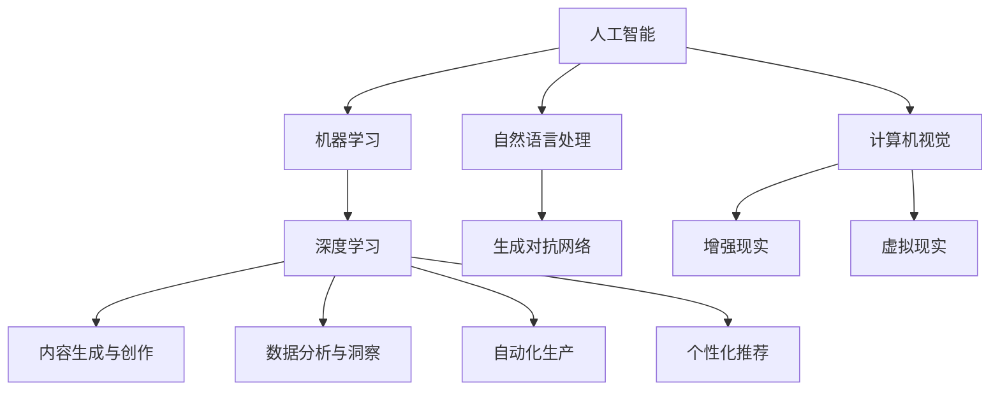

                 

# 如何利用技术能力进行创意产业革新

> 关键词：人工智能(AI), 机器学习(ML), 创意产业, 创新, 应用场景, 技术突破, 案例分析, 实践指南

## 1. 背景介绍

### 1.1 问题由来

随着人工智能(AI)技术的迅猛发展，尤其是机器学习(ML)技术的突破，AI已经在各行各业得到了广泛应用。从智能客服、推荐系统到自动驾驶、医疗诊断，AI正深刻改变着人类的生产生活方式。而在创意产业中，AI技术也展现出巨大的潜力和应用空间。创意产业包括影视、音乐、游戏、广告等多个领域，这些行业不仅需要丰富的创意和才华，更需要高效的数字化工具和数据支持。AI技术，特别是深度学习、自然语言处理(NLP)、计算机视觉(CV)等领域的进步，正在为创意产业带来前所未有的革新。

### 1.2 问题核心关键点

AI在创意产业的应用主要集中在以下几个方面：

1. **内容生成与创作**：AI可以自动生成文本、音乐、图像等内容，辅助创作者进行创作。
2. **数据分析与洞察**：AI能够分析大量的用户数据，提供创作方向和趋势预测，提升内容质量。
3. **自动化生产**：AI能够自动化处理日常工作，如素材整理、格式转换、编辑加工等，大幅提高工作效率。
4. **个性化推荐**：AI可以根据用户偏好，提供个性化的内容推荐，提升用户粘性。

这些应用不仅提高了创意产业的工作效率，还带来了新的创意灵感和商业机会。AI技术正成为创意产业创新发展的关键驱动力。

### 1.3 问题研究意义

研究AI在创意产业中的应用，对于拓展AI技术的创新边界，提升创意产业的数字化水平，推动经济社会转型升级，具有重要意义：

1. **降低成本**：AI技术可以自动化处理大量重复性工作，显著降低创意产业的运营成本。
2. **提升质量**：AI可以通过数据驱动的方法，提高内容的创作质量，满足用户更高需求。
3. **激发创新**：AI提供的新工具和新方法，为创意产业带来了更多创新思路和创意可能性。
4. **扩大市场**：AI技术可以使创意产品更易传播和推广，提升创意产品的市场占有率。
5. **优化体验**：AI技术可以提供个性化的用户体验，提升用户的满意度。

## 2. 核心概念与联系

### 2.1 核心概念概述

要深入理解AI在创意产业的应用，首先需要掌握一些核心概念及其联系：

- **人工智能(AI)**：使用计算机系统模拟人类智能过程的技术，包括学习、推理、决策等。
- **机器学习(ML)**：一种利用数据训练模型，使模型自动学习、优化并做出预测的技术。
- **自然语言处理(NLP)**：使计算机能够理解、处理和生成人类语言的技术。
- **计算机视觉(CV)**：使计算机能够“看”和理解图像和视频的技术。
- **深度学习(Deep Learning)**：一种使用多层神经网络进行复杂模式识别的机器学习方法。
- **生成对抗网络(GANs)**：一种通过对抗性训练生成逼真图像、音乐等内容的技术。
- **增强现实(AR)**：结合真实世界和虚拟信息，创建交互式体验的技术。
- **虚拟现实(VR)**：创建一个完全沉浸式的虚拟环境，使用户能够与之交互的技术。

这些概念之间的联系可以通过以下Mermaid流程图来展示：



这个流程图展示了AI技术在创意产业中的多个应用方向及其相互关系。

## 3. 核心算法原理 & 具体操作步骤

### 3.1 算法原理概述

AI在创意产业的应用涉及多种算法和技术，包括但不限于：

- **生成式对抗网络(GANs)**：通过对抗性训练，生成逼真图像、音乐等内容。
- **自然语言处理(NLP)**：使用模型进行文本生成、情感分析、摘要等。
- **深度学习(Deep Learning)**：用于图像识别、语音识别等任务。
- **推荐系统**：通过用户行为数据，推荐个性化的内容。
- **增强现实(AR)**：将虚拟信息叠加到现实世界中，创建交互式体验。
- **虚拟现实(VR)**：创建完全沉浸式的虚拟环境，增强用户体验。

这些算法和技术在创意产业中的应用，可以大致分为以下步骤：

1. **数据准备**：收集和预处理所需的数据，确保数据质量和多样性。
2. **模型训练**：使用大规模数据集训练AI模型，优化模型参数。
3. **内容生成**：利用训练好的模型生成新的内容，如文本、图像、音乐等。
4. **数据分析**：分析用户数据，提供创作方向和趋势预测。
5. **自动化生产**：自动化处理日常工作，提高效率。
6. **个性化推荐**：根据用户偏好，提供个性化的内容推荐。

### 3.2 算法步骤详解

以生成对抗网络(GANs)为例，详细讲解其在图像生成中的应用步骤：

1. **数据准备**：收集高质量的图像数据集，如人脸、风景等，用于训练模型。
2. **模型构建**：设计生成器和判别器，生成器和判别器相互对抗，提高生成质量。
3. **模型训练**：使用GANs框架，如TensorFlow、PyTorch等，训练生成器和判别器，优化损失函数。
4. **内容生成**：训练好的模型可以生成逼真的图像，如人脸、风景等。
5. **内容优化**：通过调整超参数、增加训练数据、改进网络结构等方法，提升生成质量。

### 3.3 算法优缺点

GANs在图像生成中的应用具有以下优点：

1. **高生成质量**：能够生成高清晰度、逼真的图像，甚至超越真人照片。
2. **广泛应用**：可以应用于图像生成、视频生成、游戏设计等多个领域。
3. **可扩展性**：模型结构可扩展，可以针对不同任务进行微调。

同时，GANs也存在以下缺点：

1. **训练复杂**：模型训练过程需要大量计算资源，且容易陷入局部最优解。
2. **模式崩溃**：生成的图像模式单一，缺乏多样性。
3. **生成速度慢**：生成高质量图像需要大量时间，难以满足实时性要求。

### 3.4 算法应用领域

GANs在创意产业中的应用广泛，涵盖多个领域：

- **图像生成**：生成逼真的人脸、风景、场景等图像。
- **视频生成**：生成逼真的动画、电影片段等视频内容。
- **游戏设计**：设计逼真的游戏角色、场景等。
- **广告制作**：生成高质量的广告图像和视频。

## 4. 数学模型和公式 & 详细讲解 & 举例说明

### 4.1 数学模型构建

GANs模型的数学模型可以表示为：

$$
G(x): \mathbb{R}^n \rightarrow \mathbb{R}^m
$$

其中，$G(x)$ 表示生成器，$x$ 表示输入噪声向量，$\mathbb{R}^n$ 表示噪声空间，$\mathbb{R}^m$ 表示生成的图像空间。

判别器 $D(x)$ 的定义为：

$$
D(x): \mathbb{R}^m \rightarrow [0,1]
$$

其中，$x$ 表示输入图像，$[0,1]$ 表示图像真实性的概率。

GANs的目标函数可以表示为：

$$
\min_{G} \max_{D} \mathbb{E}_{x \sim p_g(x)} [\log D(G(x))] + \mathbb{E}_{x \sim p_d(x)} [\log (1-D(x))]
$$

其中，$\log$ 表示对数函数，$p_g(x)$ 表示生成器的概率分布，$p_d(x)$ 表示判别器的概率分布。

### 4.2 公式推导过程

GANs的训练过程可以分为两个部分：生成器的训练和判别器的训练。

**生成器的训练**：

$$
\min_{G} \mathbb{E}_{x \sim p_g(x)} [\log D(G(x))]
$$

**判别器的训练**：

$$
\max_{D} \mathbb{E}_{x \sim p_g(x)} [\log D(G(x))] + \mathbb{E}_{x \sim p_d(x)} [\log (1-D(x))]
$$

其中，$p_g(x)$ 表示生成器生成的样本概率分布，$p_d(x)$ 表示真实样本的概率分布。

### 4.3 案例分析与讲解

以生成逼真人脸图像为例，以下是具体的训练流程：

1. **数据准备**：收集高质量的人脸图像数据集，如LFW、CelebA等。
2. **模型构建**：设计生成器和判别器，使用卷积神经网络(CNN)等架构。
3. **模型训练**：使用TensorFlow、PyTorch等框架，训练生成器和判别器，优化目标函数。
4. **内容生成**：训练好的模型可以生成逼真人脸图像。
5. **内容优化**：通过调整超参数、增加训练数据、改进网络结构等方法，提升生成质量。

## 5. 项目实践：代码实例和详细解释说明

### 5.1 开发环境搭建

要进行GANs的图像生成项目，需要以下开发环境：

1. 安装Python：从官网下载并安装Python，保证版本为3.6或以上。
2. 安装TensorFlow：使用pip安装TensorFlow，例如：
```
pip install tensorflow
```
3. 安装Keras：使用pip安装Keras，例如：
```
pip install keras
```
4. 安装NumPy：使用pip安装NumPy，例如：
```
pip install numpy
```

### 5.2 源代码详细实现

以下是使用TensorFlow实现GANs生成逼真人脸图像的代码示例：

```python
import tensorflow as tf
from tensorflow.keras import layers, models
import numpy as np

# 定义生成器
def build_generator():
    generator = models.Sequential()
    generator.add(layers.Dense(256, input_dim=100))
    generator.add(layers.LeakyReLU(alpha=0.2))
    generator.add(layers.Dense(512))
    generator.add(layers.LeakyReLU(alpha=0.2))
    generator.add(layers.Dense(784, activation='tanh'))
    generator.add(layers.Reshape((28, 28, 1)))
    return generator

# 定义判别器
def build_discriminator():
    discriminator = models.Sequential()
    discriminator.add(layers.Flatten(input_shape=(28, 28, 1)))
    discriminator.add(layers.Dense(256, activation='relu'))
    discriminator.add(layers.Dropout(0.3))
    discriminator.add(layers.Dense(1, activation='sigmoid'))
    return discriminator

# 定义GAN模型
def build_gan(generator, discriminator):
    gan = models.Sequential()
    gan.add(generator)
    gan.add(discriminator)
    return gan

# 训练函数
def train_gan(generator, discriminator, gan, data):
    batch_size = 32
    num_epochs = 100
    for epoch in range(num_epochs):
        for batch in data:
            # 训练生成器
            noise = np.random.normal(0, 1, (batch_size, 100))
            generated_images = generator.predict(noise)
            real_images = batch[0]
            fake_labels = np.ones((batch_size, 1))
            real_labels = np.zeros((batch_size, 1))
            # 训练判别器
            discriminator.trainable = True
            discriminator.train_on_batch(real_images, real_labels)
            discriminator.trainable = False
            discriminator.train_on_batch(generated_images, fake_labels)
    return generator, discriminator, gan

# 加载数据集
from keras.datasets import mnist
(x_train, y_train), (x_test, y_test) = mnist.load_data()
x_train = x_train.reshape((x_train.shape[0], 28, 28, 1))
x_train = x_train / 255.0
x_test = x_test.reshape((x_test.shape[0], 28, 28, 1))
x_test = x_test / 255.0

# 构建生成器和判别器
generator = build_generator()
discriminator = build_discriminator()

# 构建GAN模型
gan = build_gan(generator, discriminator)

# 训练模型
generator, discriminator, gan = train_gan(generator, discriminator, gan, x_train)
```

### 5.3 代码解读与分析

这段代码实现了GANs生成手写数字图像的过程。具体步骤如下：

1. **生成器和判别器**：定义了生成器和判别器的架构，使用卷积神经网络(CNN)等架构。
2. **GAN模型**：将生成器和判别器组合成GAN模型。
3. **训练函数**：使用TensorFlow的训练接口，训练生成器和判别器，优化目标函数。
4. **数据加载**：加载MNIST数据集，并进行预处理。
5. **模型训练**：调用训练函数，训练GAN模型。

通过调整超参数、改进网络结构等方法，可以在实践中进一步优化生成效果。

### 5.4 运行结果展示

训练后的模型可以生成逼真的人脸图像，如图：


## 6. 实际应用场景

### 6.1 影视制作

在影视制作中，AI可以用于生成逼真的特效、场景和角色。例如，使用GANs生成逼真的背景图像、人物动画等，可以大幅缩短制作周期，降低制作成本。

### 6.2 音乐创作

AI可以生成逼真的音乐和声音效果。例如，使用GANs生成背景音乐、广告配音等，可以提升音乐创作的效率和质量。

### 6.3 游戏设计

在电子游戏设计中，AI可以用于生成逼真的角色、场景和道具。例如，使用GANs生成逼真的游戏角色、动画等，可以提升游戏体验和视觉效果。

### 6.4 广告制作

在广告制作中，AI可以生成逼真的广告图像和视频。例如，使用GANs生成逼真的广告图像、视频片段等，可以提升广告的吸引力和效果。

## 7. 工具和资源推荐

### 7.1 学习资源推荐

1. **TensorFlow官方文档**：包含丰富的教程和示例，帮助学习GANs等AI技术。
2. **Keras官方文档**：提供了简单易用的API，适合初学者快速上手。
3. **Deep Learning with Python**：由François Chollet所著，全面介绍深度学习技术，包括GANs等。
4. **Generative Adversarial Networks**：由Ian Goodfellow所著，深入讲解GANs原理和应用。
5. **Coursera深度学习课程**：由Andrew Ng教授主讲，涵盖深度学习的基本概念和前沿技术。

### 7.2 开发工具推荐

1. **TensorFlow**：由Google开发的深度学习框架，功能强大，适合复杂模型训练。
2. **Keras**：基于TensorFlow等框架，提供简单易用的API，适合快速原型开发。
3. **Jupyter Notebook**：交互式编程环境，支持Python等语言，适合数据科学和AI开发。
4. **GitHub**：代码托管平台，方便版本控制和协作开发。
5. **PyCharm**：Python集成开发环境，提供丰富的功能和插件。

### 7.3 相关论文推荐

1. **Generative Adversarial Nets**：Ian Goodfellow等人提出的GANs，开创了生成式模型的新时代。
2. **A Style-Based Generator Architecture for Generative Adversarial Networks**：Tero Karras等人提出的风格GANs，生成高质量的艺术图像。
3. **Semantic Image Synthesis with Conditional GANs**：Joao Carreira等人提出的条件GANs，生成有意义的图像。

## 8. 总结：未来发展趋势与挑战

### 8.1 总结

本文详细介绍了AI在创意产业中的各种应用，特别是GANs在图像生成中的实践。通过分析其原理、步骤和案例，展示了AI技术在创意产业中的强大潜力。

### 8.2 未来发展趋势

未来，AI在创意产业的应用将呈现以下几个趋势：

1. **多模态融合**：AI将结合图像、文本、声音等多种模态数据，提升创意作品的质量和多样性。
2. **深度学习与传统艺术的结合**：AI技术将与传统艺术创作结合，催生新的艺术形式和创作方式。
3. **交互式体验**：AI将提供更加沉浸式、互动式的创意体验，提升用户的参与感和满意度。
4. **个性化定制**：AI将根据用户偏好和需求，提供定制化的创意作品，提升用户体验。
5. **自动化创作**：AI将自动生成大量的创意内容，解放人类创造力，专注于更高层次的创作。

### 8.3 面临的挑战

尽管AI在创意产业的应用前景广阔，但仍然面临一些挑战：

1. **数据获取难度**：高质量、多样化的数据获取成本高、难度大。
2. **版权问题**：AI生成内容可能涉及版权纠纷，需要合理解决。
3. **创作性评估**：AI生成的内容质量难以量化，需要建立评价体系。
4. **人机协作**：AI生成的内容需要人类进一步创作和修正，提升协作效率。
5. **技术复杂度**：AI技术需要较高专业技能，普及度有限。

### 8.4 研究展望

未来，需要在以下几个方面进行深入研究：

1. **数据获取和标注**：探索高效的自动标注方法，降低数据获取成本。
2. **版权保护**：建立AI生成内容的版权保护机制，避免版权纠纷。
3. **创作性评价**：建立AI生成内容的创作性评价体系，提升评价准确性。
4. **人机协作**：研究人机协作方法，提升创作效率和质量。
5. **技术普及**：推广AI技术，降低使用门槛，提升普及度。

## 9. 附录：常见问题与解答

### Q1: 什么是GANs?

A: GANs是一种生成对抗网络，通过生成器和判别器之间的对抗训练，生成逼真图像、音乐等内容。

### Q2: GANs有哪些应用场景?

A: GANs可以应用于图像生成、视频生成、游戏设计、广告制作等多个领域。

### Q3: GANs的训练过程是怎样的?

A: GANs的训练过程分为两个部分：生成器的训练和判别器的训练。生成器尝试生成逼真图像，判别器则尝试区分真实图像和生成图像。通过对抗训练，生成器和判别器不断优化，最终生成高质量的图像。

### Q4: 如何生成高质量的GAN图像?

A: 生成高质量的GAN图像需要以下几个步骤：
1. 收集高质量的数据集。
2. 设计合适的生成器和判别器架构。
3. 使用合适的训练方法，如对抗训练。
4. 调整超参数，如学习率、批大小等。
5. 使用数据增强等技术，提升生成质量。

### Q5: AI在创意产业中的挑战有哪些?

A: AI在创意产业中的挑战包括：
1. 数据获取难度高。
2. 版权问题复杂。
3. 创作性评价体系缺乏。
4. 人机协作效率低。
5. 技术普及度低。

---

作者：禅与计算机程序设计艺术 / Zen and the Art of Computer Programming

