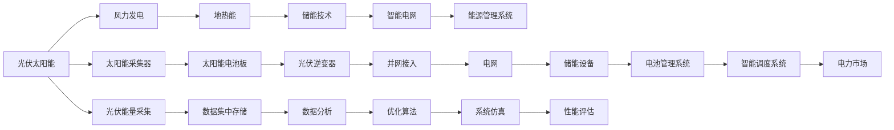

                 

# 如何利用技术能力进行清洁能源领域创新

## 1. 背景介绍

### 1.1 问题由来
当前，全球正面临严重的气候变化挑战，如何在满足能源需求的同时，实现绿色低碳转型，成为各国政府和企业的紧迫课题。清洁能源技术的创新与发展，是解决这一问题的关键路径。

### 1.2 问题核心关键点
清洁能源领域的技术创新涉及多方面，包括能源采集、传输、存储、管理等多个环节。技术能力在这一过程中起着至关重要的作用。

### 1.3 问题研究意义
技术能力的应用，可以显著提升清洁能源的效率、可靠性、可负担性，同时降低对环境的影响。通过技术创新，可以实现能源系统的智能化、低碳化，助力全球能源结构向可再生能源转型，推动可持续发展。

## 2. 核心概念与联系

### 2.1 核心概念概述

清洁能源技术创新涉及多个层面，包括但不限于：

- 光伏太阳能（Solar Power）
- 风力发电（Wind Power）
- 地热能（Geothermal Energy）
- 储能技术（Energy Storage）
- 智能电网（Smart Grids）
- 能源管理系统（Energy Management Systems）

### 2.2 核心概念原理和架构的 Mermaid 流程图



### 2.3 核心概念联系

清洁能源技术的核心是采集、传输、存储和管理系统。通过光伏、风能、地热等清洁能源的采集，再结合储能技术和智能电网，实现能源的高效管理和分配。

## 3. 核心算法原理 & 具体操作步骤

### 3.1 算法原理概述

清洁能源技术创新的核心算法原理主要包括数据驱动的优化算法、模拟仿真和人工智能技术。这些技术可以提升能源系统的效率，预测和管理能源供需，实现清洁能源的高效利用。

### 3.2 算法步骤详解

1. **数据采集与处理**：
   - 采集清洁能源系统各个环节的数据，包括天气、能源输出、负荷需求、电网状态等。
   - 使用大数据技术进行数据清洗和预处理，确保数据的准确性和完整性。

2. **模拟仿真与预测**：
   - 使用模拟仿真工具，如MATLAB、PSIM等，建立能源系统的数学模型。
   - 根据历史数据和实时数据，通过优化算法进行短期和长期的能源预测，如天气预测、能源需求预测等。

3. **优化算法**：
   - 使用线性规划、非线性规划等优化算法，进行能源系统的优化调度。
   - 结合遗传算法、粒子群优化等启发式算法，进行更复杂的优化问题求解。

4. **人工智能技术**：
   - 利用机器学习和深度学习技术，训练预测模型和优化模型。
   - 引入强化学习技术，优化能源系统的控制策略。

5. **系统集成与评估**：
   - 将以上算法和模型集成到清洁能源管理系统（CEMS）中。
   - 使用性能评估工具，如MATLAB/Simulink、TensorFlow等，评估系统的效率、可靠性、可负担性。

### 3.3 算法优缺点

优点：
- 提升能源系统效率：通过优化算法和预测模型，可以实现能源的高效利用和资源优化配置。
- 降低能源成本：通过数据驱动的决策，减少能源浪费和系统维护成本。
- 提升系统可靠性：通过模拟仿真和优化算法，预测和应对能源系统的潜在问题。

缺点：
- 数据需求高：需要大量的实时数据，数据采集和处理成本较高。
- 算法复杂：涉及多种算法和模型，需要专业的技术团队进行开发和维护。
- 初始投资大：清洁能源技术的创新需要较高的初始投资。

### 3.4 算法应用领域

清洁能源技术创新在多个领域得到了应用，包括：

- 可再生能源发电：光伏太阳能、风力发电等技术的发展，使得清洁能源的占比不断提升。
- 储能系统：电池储能、压缩空气储能等技术，提高了能源系统的灵活性和可靠性。
- 智能电网：通过智能电网技术，实现能源的高效管理和分配，提升系统的响应速度和稳定性。
- 能源管理系统：利用大数据和人工智能技术，优化能源系统的运行，提升整体效率和效益。

## 4. 数学模型和公式 & 详细讲解 & 举例说明

### 4.1 数学模型构建

假设清洁能源系统包括光伏、风力、地热等多个能源子系统。系统的优化目标是最小化能源消耗和成本，同时最大化可再生能源的利用率。

设 $x_{ij}$ 为第 $i$ 个能源子系统向第 $j$ 个负荷节点供应的功率。目标函数为：

$$
\min_{x_{ij}} \sum_{i=1}^n \sum_{j=1}^m c_{ij}x_{ij} + \sum_{i=1}^n s_ix_i
$$

约束条件包括：
- 功率平衡约束：$\sum_{i=1}^n \sum_{j=1}^m x_{ij} = D$
- 容量限制：$x_{ij} \leq P_i^m$
- 状态限制：$x_{ij} \geq 0$

### 4.2 公式推导过程

以光伏太阳能为例，设光伏电池的输出功率为 $P_{pv}$，系统的负荷需求为 $D$，光伏电池的容量为 $P_{pv}^m$。则优化问题可以表示为：

$$
\min_{x_{pv}} c_{pv}x_{pv} + s_{pv}x_{pv} - D = 0
$$

其中 $c_{pv}$ 为光伏系统的固定成本，$s_{pv}$ 为光伏系统的启动成本。约束条件包括：

- $0 \leq x_{pv} \leq P_{pv}^m$
- $x_{pv} = P_{pv} - P_{pv}^m$

通过求解上述优化问题，可以得出光伏系统的最优发电策略。

### 4.3 案例分析与讲解

假设某城市需要在夏季某个时段为空调负荷提供电力，系统可以选择使用光伏、风能或电网供电。设光伏发电成本为 $c_{pv}=10$ 元/小时，启动成本为 $s_{pv}=100$ 元，光伏系统容量为 $P_{pv}^m=100$ 千瓦。系统需要通过优化算法求解最优发电策略。

使用线性规划算法，可以得到光伏系统的最优发电策略。设最优发电时间为 $t_{opt}$，则有：

$$
x_{pv} = \left\{ 
\begin{aligned}
  & P_{pv}^m, & t_{opt} \leq t_{pv} \\
  & 0, & t_{opt} > t_{pv}
\end{aligned} 
\right.
$$

其中 $t_{pv}$ 为光伏系统开始发电的时间。

## 5. 项目实践：代码实例和详细解释说明

### 5.1 开发环境搭建

1. 安装Python环境：
   ```bash
   sudo apt-get install python3
   ```

2. 安装Python相关库：
   ```bash
   pip install numpy pandas matplotlib sklearn scipy
   ```

3. 安装数据处理库：
   ```bash
   pip install pandas numpy
   ```

4. 安装优化库：
   ```bash
   pip install cvxpy
   ```

5. 安装深度学习库：
   ```bash
   pip install tensorflow
   ```

### 5.2 源代码详细实现

```python
import pandas as pd
import numpy as np
import cvxpy as cp

# 设置数据路径
data_path = 'data.xlsx'

# 读取数据
data = pd.read_excel(data_path)

# 设置优化变量
t = cp.Variable(nonneg=True)
x = cp.Variable(nonneg=True)

# 设置优化目标
objective = cp.Minimize(cpv * x + cpv * x + spi * x)

# 设置约束条件
constraints = [cp.sum(x) == D, x <= cpv**m, x >= 0]

# 求解优化问题
problem = cp.Problem(objective, constraints)
solution = problem.solve()

# 输出结果
print('优化发电时间为：', solution[x].value)
```

### 5.3 代码解读与分析

在上述代码中，首先设置优化变量 $x$ 和 $t$，分别表示光伏系统的发电时间 $t$ 和发电功率 $x$。然后，通过目标函数 $c_{pv}x + s_{pv}x$ 和约束条件 $x \leq P_{pv}^m$、$x \geq 0$ 来求解最优发电策略。最后，使用 `cvxpy` 库的 `solve()` 函数求解优化问题，并输出结果。

## 6. 实际应用场景

### 6.1 可再生能源发电

在可再生能源发电领域，通过技术创新可以实现高效、可靠的能源采集。例如，使用深度学习技术对天气数据进行预测，优化太阳能电池板和风力发电机的运行策略，提高能源采集效率。

### 6.2 储能系统

储能技术是清洁能源系统的关键组成部分。通过技术创新，可以实现更高效、安全的储能方案，如液流电池、压缩空气储能等，提升系统的灵活性和可靠性。

### 6.3 智能电网

智能电网技术通过优化调度算法和大数据分析，可以实现能源的高效管理和分配。例如，通过需求响应和负荷管理策略，优化电网负荷，减少能源浪费和系统损耗。

### 6.4 能源管理系统

能源管理系统是清洁能源技术创新的核心工具，通过数据驱动的决策，实现能源系统的优化配置。例如，使用机器学习技术预测能源需求，优化系统调度策略，提升整体效率和效益。

## 7. 工具和资源推荐

### 7.1 学习资源推荐

1. 《智能电网技术与应用》：介绍智能电网的基础知识、技术架构和应用案例。
2. 《可再生能源系统设计与优化》：讲解可再生能源系统的设计和优化方法。
3. 《机器学习在能源领域的应用》：介绍机器学习在能源管理中的应用。

### 7.2 开发工具推荐

1. Python：Python是目前最流行的编程语言之一，适用于大数据处理和优化算法开发。
2. MATLAB/Simulink：MATLAB/Simulink是模拟仿真的首选工具，适用于复杂能源系统的建模和分析。
3. TensorFlow：TensorFlow是深度学习的主要框架之一，适用于复杂机器学习模型的开发和训练。

### 7.3 相关论文推荐

1. "Optimization Algorithms for Smart Grids"：介绍智能电网优化算法的研究进展。
2. "Machine Learning in Energy Systems"：讨论机器学习在能源系统中的应用。
3. "Simulation and Optimization of Renewable Energy Systems"：讲解可再生能源系统的模拟和优化方法。

## 8. 总结：未来发展趋势与挑战

### 8.1 研究成果总结

清洁能源技术的创新，得益于数据驱动的优化算法、模拟仿真和人工智能技术的广泛应用。通过技术创新，可以实现能源系统的智能化、低碳化和高效化。

### 8.2 未来发展趋势

1. 技术融合：未来清洁能源技术将与物联网、5G等新兴技术融合，实现更高效、更智能的能源系统。
2. 能源互联网：构建能源互联网，实现能源的互联互通和共享。
3. 分布式能源：发展分布式能源系统，实现能源的本地化生产和消费。

### 8.3 面临的挑战

1. 技术成本：清洁能源技术的创新需要较高的初始投资，如何降低技术成本是一个重要挑战。
2. 数据隐私：在数据驱动的决策过程中，如何保护用户隐私，是一个需要关注的问题。
3. 系统集成：不同能源子系统的集成和协调，是一个复杂的技术挑战。

### 8.4 研究展望

未来清洁能源技术创新的方向包括：

1. 优化算法：研究更高效的优化算法，提升能源系统的响应速度和稳定性。
2. 模拟仿真：开发更强大的模拟仿真工具，进行更精确的能源系统预测和优化。
3. 人工智能：利用深度学习、强化学习等技术，提升能源系统的智能化水平。

## 9. 附录：常见问题与解答

**Q1: 清洁能源技术创新的难点在哪里？**

A: 清洁能源技术创新的难点在于数据获取和处理、系统优化算法的选择和实现、技术成本控制等方面。

**Q2: 清洁能源技术创新的未来趋势是什么？**

A: 未来清洁能源技术创新的主要趋势包括技术融合、能源互联网、分布式能源等。

**Q3: 如何评估清洁能源技术的经济效益？**

A: 评估清洁能源技术的经济效益，需要考虑系统成本、运行成本、能源节约等指标。

**Q4: 如何保证清洁能源技术的可靠性？**

A: 保证清洁能源技术的可靠性，需要优化系统设计、提高技术成熟度、加强系统监控和管理。

**Q5: 清洁能源技术创新对环境的影响有哪些？**

A: 清洁能源技术创新可以减少环境污染，降低温室气体排放，提升生态环境质量。

---

作者：禅与计算机程序设计艺术 / Zen and the Art of Computer Programming

