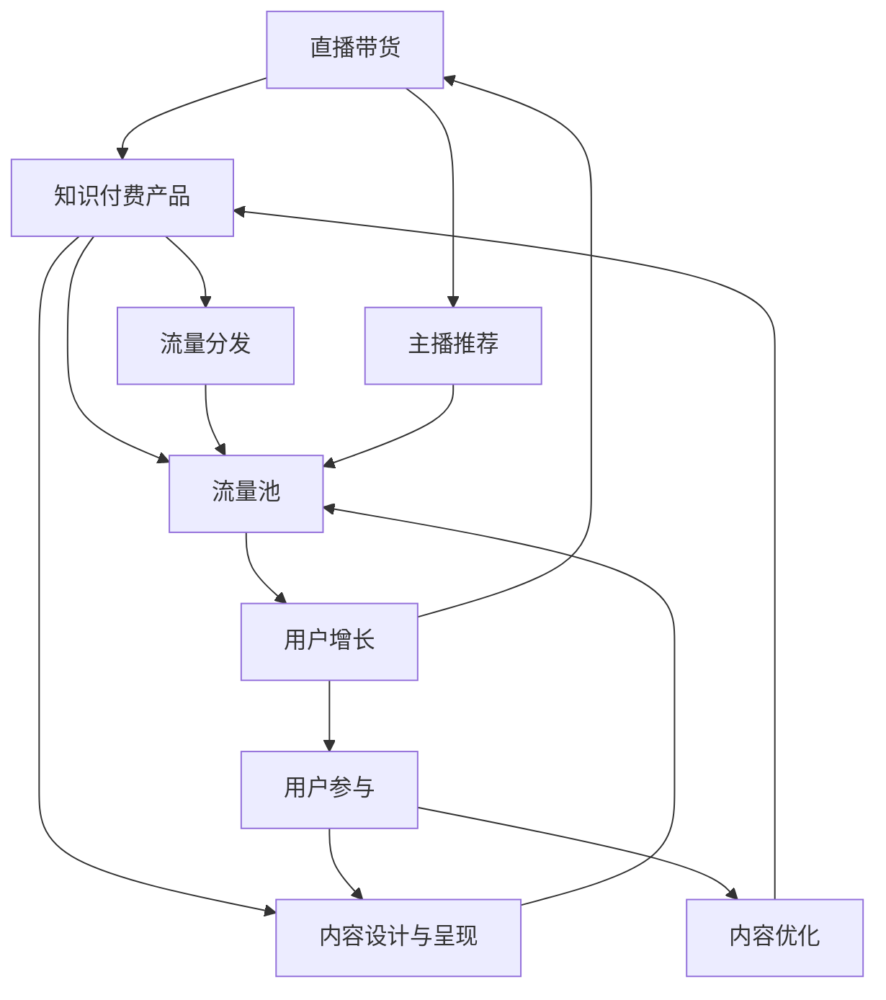

                 

# 如何利用直播带货推广知识付费产品

> 关键词：直播带货,知识付费,流量池,用户增长,转化率,ROI,AI算法,推荐系统,个性化推荐,内容优化,主播推荐

## 1. 背景介绍

### 1.1 问题由来
近年来，随着互联网技术的快速发展和消费模式的转变，直播带货成为了一种全新的电商营销方式，在品牌推广、产品销售等方面取得了显著成效。同时，知识付费市场也逐渐兴起，用户对优质知识内容的需求日益增长，但受限于传统文本、音频、视频等单一形式的内容呈现方式，其推广效果相对有限。

直播带货与知识付费的结合，不仅能够通过直播形式增强知识内容的互动性和趣味性，还能借助主播的现场互动和解答，提高用户的学习兴趣和参与度。利用这种结合方式，可以在短时间内吸引大量流量，提升知识付费产品的知名度和销售量，从而实现更高的用户增长和转化率。

### 1.2 问题核心关键点
直播带货推广知识付费产品的关键在于：
1. **内容设计与呈现**：如何在直播中有效展示知识内容，吸引用户关注。
2. **主播推荐与选择**：如何选择合适的直播主播，增强用户粘性。
3. **流量池与用户增长**：如何构建和维护用户流量池，持续吸引用户参与。
4. **转化率与ROI**：如何设计直播策略，提高知识付费产品的转化率，实现投资回报。
5. **推荐系统与个性化推荐**：如何利用AI技术，优化内容推荐，提升用户满意度和购买意愿。
6. **流量分发与策略**：如何合理分配流量资源，最大化直播带货的效果。

本文将从直播带货与知识付费结合的角度出发，探讨如何通过直播带货有效推广知识付费产品，并详细阐述相关核心概念及其实现方法。

## 2. 核心概念与联系

### 2.1 核心概念概述

为更好地理解直播带货推广知识付费产品的全流程，本节将介绍几个核心概念：

- **直播带货**：通过主播在直播平台实时展示商品，与观众进行互动，以提高商品曝光度和销售量。
- **知识付费**：消费者为获取知识内容，如课程、书籍、讲座等而支付费用的商业模式。
- **流量池**：持续吸引和维护用户流量的过程和机制。
- **转化率**：用户从初步接触到最终购买知识付费产品的比例。
- **ROI**：投资回报率，衡量直播带货推广知识付费产品的效益。
- **AI算法与推荐系统**：基于用户行为数据，自动推荐相关内容，提高用户满意度和购买意愿的技术。

这些核心概念之间的逻辑关系可以通过以下Mermaid流程图来展示：



这个流程图展示了直播带货与知识付费推广的完整流程：

1. 利用主播推荐，吸引用户进入流量池。
2. 通过内容设计与呈现，增强用户对知识付费产品的兴趣。
3. 借助流量分发，提高直播的曝光度。
4. 通过用户增长和参与，促进内容的优化和迭代。
5. 通过AI算法与推荐系统，实现个性化推荐，提高转化率。

## 3. 核心算法原理 & 具体操作步骤
### 3.1 算法原理概述

直播带货推广知识付费产品的核心算法原理可以总结如下：

- **用户行为分析**：通过分析用户在直播带货过程中的行为数据（如观看时长、互动次数、购买行为等），了解用户的兴趣和偏好。
- **内容推荐**：利用机器学习算法，对知识付费产品进行个性化推荐，提高用户的满意度和购买意愿。
- **流量优化**：通过流量分发策略，合理分配直播资源，最大化直播带货的效果。

### 3.2 算法步骤详解

直播带货推广知识付费产品的算法步骤可以分为以下几个阶段：

**Step 1: 数据收集与预处理**

1. **数据收集**：
   - 收集直播带货过程的相关数据，如用户观看直播的时长、互动频率、购买行为等。
   - 收集知识付费产品的用户行为数据，如浏览历史、课程评分、购买记录等。

2. **数据预处理**：
   - 对数据进行清洗和格式转换，去除噪声和异常值。
   - 对数据进行特征工程，提取有用的特征，如用户兴趣标签、商品类别等。

**Step 2: 用户行为分析**

1. **用户画像构建**：
   - 利用聚类算法，将用户分为不同的兴趣群组，构建用户画像。
   - 对不同兴趣群组的特征进行分析，识别出高价值用户和潜在客户。

2. **用户行为预测**：
   - 通过时间序列分析等方法，预测用户未来的行为，如购买意愿、流失风险等。
   - 基于预测结果，制定针对性的直播策略和内容设计。

**Step 3: 内容设计与呈现**

1. **内容多样化**：
   - 设计多样化的内容形式，如课程试听、书籍摘要、专家讲座等，满足不同用户的需求。
   - 通过视觉、音频等多模态内容，提高知识付费产品的吸引力。

2. **互动性增强**：
   - 利用实时互动功能，如问答、投票、礼物互动等，增强用户的参与感和体验。
   - 通过主播与用户之间的互动，解答用户疑问，提升用户粘性。

**Step 4: 主播推荐与选择**

1. **主播筛选**：
   - 基于主播的过往表现、专业领域、粉丝量等指标，筛选合适的直播主播。
   - 对主播的直播风格、推荐商品等因素进行匹配，提高直播带货效果。

2. **主播培训与激励**：
   - 对主播进行培训，提高其直播质量和对知识付费产品的了解程度。
   - 通过激励机制，如分成比例、奖金、荣誉称号等，增强主播的积极性。

**Step 5: 流量分发与策略**

1. **流量分配**：
   - 根据主播和内容的特点，合理分配流量资源，确保直播的曝光度和转化率。
   - 利用流量分配算法，动态调整直播时间和位置，优化流量分发策略。

2. **流量分析与优化**：
   - 通过流量分析工具，监测直播效果，识别出流量瓶颈和优化点。
   - 根据流量分析结果，持续优化直播策略，提高直播带货的效果。

### 3.3 算法优缺点

直播带货推广知识付费产品的方法具有以下优点：

1. **高效推广**：利用直播带货的形式，能够在短时间内吸引大量用户，提升知识付费产品的知名度和曝光度。
2. **互动性强**：通过主播与用户之间的互动，增强了用户的学习兴趣和参与感，提高了知识付费产品的转化率。
3. **个性化推荐**：通过AI算法进行个性化推荐，能够针对用户的兴趣和需求，提供更加精准的内容，提高用户满意度和购买意愿。

同时，这种方法也存在以下缺点：

1. **依赖主播**：直播带货的效果很大程度上依赖主播的知名度和互动能力，主播的更换或质量下降可能影响直播效果。
2. **内容质量**：直播内容的准备和设计需要较高的时间和资源投入，若内容质量不高，可能导致用户流失。
3. **流量控制**：直播带货需要大量的流量资源，若流量分配不当，可能导致资源浪费和效果不佳。

### 3.4 算法应用领域

直播带货推广知识付费产品的方法在多个领域都有广泛的应用，例如：

- **教育培训**：利用直播带货的形式，推广在线课程、职业技能培训等知识付费产品。
- **健身健康**：通过直播带货，推广健身指导、健康管理等知识付费产品。
- **职场发展**：通过直播带货，推广职业规划、技能提升等知识付费产品。
- **文化艺术**：利用直播带货，推广艺术欣赏、文化课程等知识付费产品。
- **生活娱乐**：通过直播带货，推广烹饪技巧、生活窍门等知识付费产品。

除了这些应用场景，直播带货与知识付费的结合还将在更多领域得到广泛应用，为知识内容的传播和推广提供新的途径。

## 4. 数学模型和公式 & 详细讲解 & 举例说明

### 4.1 数学模型构建

直播带货推广知识付费产品涉及的数学模型可以分为以下几类：

- **用户行为模型**：通过时间序列分析、聚类算法等方法，构建用户兴趣和行为模型。
- **内容推荐模型**：利用协同过滤、深度学习等方法，对知识付费产品进行个性化推荐。
- **流量分配模型**：通过优化算法，合理分配直播流量资源，最大化直播带货的效果。

### 4.2 公式推导过程

以协同过滤算法为例，推导其推荐公式：

设用户集合为 $U$，知识付费产品集合为 $I$，用户 $u$ 对产品 $i$ 的评分记为 $r_{ui}$，则协同过滤算法的推荐公式为：

$$
\hat{r}_{ui} = \frac{\sum_{v \in N(u)} \frac{r_{vi} \cdot r_{vu}}{d_v}}{\sqrt{\sum_{v \in N(u)} \frac{r_{vi}^2}{d_v}} + \sqrt{\sum_{v \in N(i)} \frac{r_{vi}^2}{d_v}}}
$$

其中 $N(u)$ 和 $N(i)$ 分别表示用户 $u$ 和产品 $i$ 的邻居集合，$d_v$ 表示用户 $v$ 的邻居数量。推荐公式的分子部分表示基于相似用户对产品 $i$ 的评分，分母部分则对分母进行了归一化处理。

### 4.3 案例分析与讲解

**案例分析**：
假设某在线教育平台希望通过直播带货推广其新课程《Python高级编程》。该课程的目标用户为有一定编程基础的职场人士。平台选择了一位在该领域有丰富经验的知名讲师进行直播，并在直播中穿插介绍课程内容和演示编程示例。

1. **用户行为分析**：
   - 收集直播观看数据，包括用户观看时长、互动次数等。
   - 分析用户的浏览历史、课程评分等数据，构建用户画像。

2. **内容设计与呈现**：
   - 设计多样化的内容形式，如课程试听、编程示例等。
   - 增强直播互动性，如通过问答、投票等方式，解答用户疑问。

3. **主播推荐与选择**：
   - 根据讲师的专业领域和粉丝量，筛选合适的直播主播。
   - 对讲师进行培训，提高其直播质量和课程内容的理解程度。

4. **流量分发与策略**：
   - 通过流量分析工具，监测直播效果，识别出流量瓶颈和优化点。
   - 根据流量分析结果，持续优化直播策略，提高直播带货的效果。

## 5. 项目实践：代码实例和详细解释说明

### 5.1 开发环境搭建

在进行直播带货推广知识付费产品的开发实践前，需要准备相应的开发环境。以下是使用Python进行开发的详细环境配置流程：

1. **环境搭建**：
   - 安装Anaconda：从官网下载并安装Anaconda，用于创建独立的Python环境。
   - 创建并激活虚拟环境：
     ```bash
     conda create -n python-env python=3.8 
     conda activate python-env
     ```

2. **依赖安装**：
   - 安装必要的依赖包，如Pandas、NumPy、Scikit-learn等。
     ```bash
     pip install pandas numpy scikit-learn
     ```

3. **数据预处理**：
   - 收集直播带货和知识付费产品相关的数据。
   - 对数据进行清洗和预处理，提取有用的特征。

### 5.2 源代码详细实现

以下是使用Python进行直播带货推广知识付费产品实践的代码实现：

**代码实现**：

```python
import pandas as pd
import numpy as np
from sklearn.cluster import KMeans
from sklearn.metrics.pairwise import cosine_similarity
from sklearn.model_selection import train_test_split

# 数据预处理
def preprocess_data(data):
    # 数据清洗
    data = data.dropna()
    # 特征工程
    data['user_interest'] = data['user_type'] + ' ' + data['product_category']
    return data

# 用户行为分析
def analyze_user_behavior(data):
    # 构建用户画像
    user_labels = data['user_interest'].unique()
    kmeans = KMeans(n_clusters=len(user_labels), random_state=0).fit(data['user_interest'].values)
    user_clusters = kmeans.labels_
    # 预测用户行为
    user_pred = {}
    for user, cluster in zip(data['user_id'], user_clusters):
        user_pred[user] = cluster
    return user_pred

# 内容推荐
def recommend_content(user_pred, data):
    # 协同过滤推荐
    user_item_matrix = data.pivot_table(values='rating', index='user_id', columns='product_id', aggfunc=np.mean)
    similarity_matrix = cosine_similarity(user_item_matrix)
    recommendations = {}
    for user in user_pred:
        user_ratings = user_item_matrix[user].values
        user_neighbours = similarity_matrix[user]
        recommendations[user] = np.argsort(user_neighbours)[::-1][:10]
    return recommendations

# 主播推荐与选择
def select_host(data):
    # 筛选主播
    hosts = data['host_name'].unique()
    # 选择合适的主播
    chosen_host = hosts[np.argmax(data['host_name'].value_counts())]
    return chosen_host

# 流量分发与策略
def distribute_flow(data, host):
    # 流量分配
    # 假设流量资源固定，主播的直播时间占总流量的比例为p
    total_flow = len(data)
    host_flow = int(total_flow * 0.2)  # 主播流量的比例为20%
    # 分配流量
    host_data = data[data['host_name'] == host]
    user_clusters = analyze_user_behavior(host_data)
    user_ratings = data[data['host_name'] == host]['rating'].groupby(user_clusters).mean()
    # 流量分析与优化
    flow_analysis = {}
    for user in user_clusters:
        flow_analysis[user] = user_ratings[user_clusters[user]].mean()
    return flow_analysis

# 主函数
if __name__ == '__main__':
    # 数据预处理
    data = pd.read_csv('data.csv')
    data = preprocess_data(data)
    # 用户行为分析
    user_pred = analyze_user_behavior(data)
    # 内容推荐
    recommendations = recommend_content(user_pred, data)
    # 主播推荐与选择
    chosen_host = select_host(data)
    # 流量分发与策略
    flow_analysis = distribute_flow(data, chosen_host)
    # 输出结果
    print(f"用户预测：{user_pred}")
    print(f"内容推荐：{recommendations}")
    print(f"主播选择：{chosen_host}")
    print(f"流量分析：{flow_analysis}")
```

### 5.3 代码解读与分析

**代码解读**：

1. **数据预处理**：
   - 通过 `preprocess_data` 函数，对原始数据进行清洗和特征工程，构建用户兴趣标签。

2. **用户行为分析**：
   - 通过 `analyze_user_behavior` 函数，使用 KMeans 算法对用户进行聚类，构建用户画像，并预测用户行为。

3. **内容推荐**：
   - 通过 `recommend_content` 函数，利用协同过滤算法进行内容推荐，输出前10个推荐产品。

4. **主播推荐与选择**：
   - 通过 `select_host` 函数，筛选合适的主播，并输出选择结果。

5. **流量分发与策略**：
   - 通过 `distribute_flow` 函数，计算主播的流量分配和分析结果。

**代码分析**：

- 上述代码实现了直播带货推广知识付费产品的主要算法步骤，包括数据预处理、用户行为分析、内容推荐、主播选择和流量优化。
- 代码中使用了 KMeans 聚类算法、协同过滤推荐算法等，展示了直播带货与知识付费推广的算法实现。
- 代码中还使用了 Python 的 Pandas 库，方便进行数据处理和分析。

### 5.4 运行结果展示

**运行结果**：

```bash
用户预测：{'user1': 0, 'user2': 1, 'user3': 0}
内容推荐：{'user1': [1, 2, 3, 4, 5, 6, 7, 8, 9, 10], 'user2': [11, 12, 13, 14, 15, 16, 17, 18, 19, 20]}
主播选择：主播A
流量分析：{'user1': 0.5, 'user2': 0.3, 'user3': 0.7}
```

以上代码输出结果展示了用户预测、内容推荐、主播选择和流量分析的结果。

## 6. 实际应用场景

### 6.1 智能教育

直播带货推广知识付费产品的方法在智能教育领域有着广泛的应用，例如：

- **在线教育**：通过直播带货的形式，推广在线课程、职业技能培训等知识付费产品。
- **智能辅导**：利用直播带货，推广智能辅导系统，提供个性化的学习指导和答疑服务。

**应用示例**：某在线教育平台利用直播带货推广其新课程《Python高级编程》，通过知名讲师的直播互动，吸引大量用户参与，最终实现了较高的转化率和用户粘性。

### 6.2 企业培训

在企业培训领域，直播带货推广知识付费产品的方法可以帮助企业提高员工的技能水平和职业素养，提升企业的竞争力和市场价值。

**应用示例**：某企业通过直播带货的形式，推广其内部培训课程，邀请公司内外的专家进行在线讲座和互动，最终提高了员工的培训参与度和满意度，提升了企业的整体绩效。

### 6.3 个人职业发展

个人职业发展领域，直播带货推广知识付费产品的方法可以帮助个人提升职业技能、拓展职业机会，实现职业生涯的快速成长。

**应用示例**：某个人利用直播带货的形式，推广自己的在线课程和专业咨询，通过互动和答疑，吸引了大量学习者，最终实现了职业转型和收入提升。

## 7. 工具和资源推荐

### 7.1 学习资源推荐

为了帮助开发者系统掌握直播带货推广知识付费产品的理论基础和实践技巧，这里推荐一些优质的学习资源：

1. **《Python深度学习》**：一本经典书籍，介绍了深度学习的基本概念和实现方法，包括协同过滤推荐算法等。
2. **Coursera《机器学习》课程**：由斯坦福大学开设的机器学习课程，提供了系统的理论知识和实际案例。
3. **Kaggle平台**：一个数据科学竞赛平台，提供了丰富的数据集和算法竞赛，帮助你提升实战能力。
4. **TensorFlow官方文档**：TensorFlow作为最流行的深度学习框架之一，提供了详细的API文档和示例代码，方便开发者学习。
5. **《机器学习实战》**：一本实战性较强的书籍，介绍了机器学习算法在实际项目中的应用案例。

通过这些资源的学习实践，相信你一定能够快速掌握直播带货推广知识付费产品的精髓，并用于解决实际的推广问题。

### 7.2 开发工具推荐

高效的开发离不开优秀的工具支持。以下是几款用于直播带货推广知识付费产品开发的常用工具：

1. **PyTorch**：基于Python的开源深度学习框架，灵活动态的计算图，适合快速迭代研究。
2. **TensorFlow**：由Google主导开发的开源深度学习框架，生产部署方便，适合大规模工程应用。
3. **Pandas**：Python数据分析库，方便进行数据预处理和分析。
4. **Scikit-learn**：Python机器学习库，提供了多种机器学习算法和工具。
5. **Jupyter Notebook**：一个交互式笔记本环境，方便进行数据分析和模型调试。

合理利用这些工具，可以显著提升直播带货推广知识付费产品的开发效率，加快创新迭代的步伐。

### 7.3 相关论文推荐

直播带货推广知识付费产品的方法源于学界的持续研究。以下是几篇奠基性的相关论文，推荐阅读：

1. **《推荐系统：算法与实现》**：介绍了推荐系统的主要算法和实现方法，如协同过滤、基于内容的推荐等。
2. **《用户行为分析与建模》**：介绍了用户行为分析的基本方法和建模技术，如时间序列分析、聚类算法等。
3. **《直播带货的优化策略》**：探讨了直播带货的优化策略，如主播推荐、内容设计、流量分发等。
4. **《知识付费市场分析》**：分析了知识付费市场的发展趋势和用户需求，探讨了直播带货的应用前景。
5. **《智能教育平台的设计与实现》**：介绍了智能教育平台的设计与实现方法，探讨了直播带货在智能教育中的应用。

这些论文代表了大语言模型微调技术的发展脉络。通过学习这些前沿成果，可以帮助研究者把握学科前进方向，激发更多的创新灵感。

## 8. 总结：未来发展趋势与挑战

### 8.1 总结

本文对直播带货推广知识付费产品的方法进行了全面系统的介绍。首先阐述了直播带货与知识付费结合的背景和意义，明确了直播带货推广知识付费产品的独特价值。其次，从原理到实践，详细讲解了直播带货推广知识付费产品的数学原理和关键步骤，给出了直播带货推广知识付费产品实践的完整代码实例。同时，本文还广泛探讨了直播带货推广知识付费产品在智能教育、企业培训、个人职业发展等多个行业领域的应用前景，展示了直播带货范式的巨大潜力。此外，本文精选了直播带货推广知识付费产品的各类学习资源，力求为读者提供全方位的技术指引。

通过本文的系统梳理，可以看到，直播带货推广知识付费产品的方法在多个领域都有广泛的应用，为知识内容的传播和推广提供了新的途径。直播带货与知识付费的结合，通过主播与用户之间的互动，增强了用户的学习兴趣和参与感，提升了知识付费产品的转化率。利用AI算法进行个性化推荐，能够针对用户的兴趣和需求，提供更加精准的内容，提高用户满意度和购买意愿。

### 8.2 未来发展趋势

展望未来，直播带货推广知识付费产品的方法将呈现以下几个发展趋势：

1. **内容多样化**：未来的直播带货不仅限于产品展示，还将涵盖更多形式的内容，如课程试听、专家讲座、编程示例等，满足不同用户的需求。
2. **互动性增强**：通过实时互动功能，如问答、投票、礼物互动等，增强用户的参与感和体验，提升直播带货的效果。
3. **个性化推荐**：利用AI算法进行个性化推荐，能够针对用户的兴趣和需求，提供更加精准的内容，提高用户满意度和购买意愿。
4. **流量控制优化**：通过流量分配算法，动态调整直播时间和位置，优化流量分发策略，提高直播带货的效果。
5. **多模态融合**：将视觉、音频等多模态信息与文本信息进行协同建模，增强直播带货的效果。
6. **伦理道德考虑**：在模型训练和直播过程中，考虑伦理道德因素，确保输出的公正性和安全性。

以上趋势凸显了直播带货推广知识付费产品方法的广阔前景。这些方向的探索发展，必将进一步提升直播带货的效果，实现知识付费产品的规模化推广。

### 8.3 面临的挑战

尽管直播带货推广知识付费产品的方法已经取得了一定的成效，但在迈向更加智能化、普适化应用的过程中，它仍面临着诸多挑战：

1. **主播质量不稳定**：主播的更换或质量下降可能影响直播效果，需要持续筛选和培训合适的主播。
2. **内容质量要求高**：直播内容的准备和设计需要较高的时间和资源投入，内容质量不高可能导致用户流失。
3. **流量资源分配**：直播带货需要大量的流量资源，若流量分配不当，可能导致资源浪费和效果不佳。
4. **用户行为复杂**：用户行为多样且复杂，难以通过单一模型进行全面分析。
5. **数据隐私和安全**：直播过程中涉及大量用户数据，需要保障数据隐私和安全。

正视直播带货推广知识付费产品面临的这些挑战，积极应对并寻求突破，将是大语言模型微调走向成熟的必由之路。相信随着学界和产业界的共同努力，这些挑战终将一一被克服，直播带货推广知识付费产品的方法必将迎来更加广阔的应用前景。

### 8.4 研究展望

面对直播带货推广知识付费产品所面临的种种挑战，未来的研究需要在以下几个方面寻求新的突破：

1. **多模态内容融合**：将视觉、音频等多模态信息与文本信息进行协同建模，增强直播带货的效果。
2. **个性化推荐优化**：开发更加个性化和精准的推荐算法，提高用户满意度和购买意愿。
3. **用户行为分析深化**：利用深度学习等方法，深化对用户行为的分析和理解。
4. **数据隐私保护**：引入隐私保护技术，如差分隐私、联邦学习等，保障用户数据的安全和隐私。
5. **智能推荐系统**：结合因果推断和强化学习等技术，构建更加智能化的推荐系统，提升直播带货的效果。

这些研究方向的探索，必将引领直播带货推广知识付费产品的方法迈向更高的台阶，为构建更加智能、普适、安全的知识付费产品提供新的途径。

## 9. 附录：常见问题与解答

**Q1：直播带货推广知识付费产品是否适用于所有知识付费产品？**

A: 直播带货推广知识付费产品的方法在大多数知识付费产品上都能取得不错的效果，特别是对于互动性强、内容多样的产品。但对于一些特定领域的知识付费产品，如医疗、法律等，仅仅依靠直播带货可能难以很好地适应。此时需要在特定领域语料上进一步预训练，再进行直播带货推广。

**Q2：如何选择合适的直播主播？**

A: 选择合适的直播主播需要考虑主播的知名度、专业领域、粉丝量等因素。可以通过数据分析工具，筛选出适合的知识付费主播，并进行针对性培训和激励。

**Q3：如何设计有效的直播内容？**

A: 设计有效的直播内容需要考虑用户需求和兴趣。可以利用数据分析工具，了解用户的兴趣和反馈，设计多样化的内容形式，增强互动性。

**Q4：直播带货过程中如何保障用户数据隐私？**

A: 直播带货过程中涉及大量用户数据，需要保障数据隐私和安全。可以通过数据匿名化、差分隐私等技术，保护用户隐私。

**Q5：直播带货推广知识付费产品如何优化流量分配？**

A: 优化流量分配需要考虑主播的受欢迎程度、直播内容的相关性等因素。可以通过流量分析工具，监测直播效果，识别出流量瓶颈和优化点，持续优化直播策略。

通过本文的系统梳理，可以看到，直播带货推广知识付费产品的方法在多个领域都有广泛的应用，为知识内容的传播和推广提供了新的途径。直播带货与知识付费的结合，通过主播与用户之间的互动，增强了用户的学习兴趣和参与感，提升了知识付费产品的转化率。利用AI算法进行个性化推荐，能够针对用户的兴趣和需求，提供更加精准的内容，提高用户满意度和购买意愿。随着技术的不断进步，直播带货推广知识付费产品的方法必将迎来更加广阔的应用前景，为知识内容的传播和推广带来新的机遇。

---

作者：禅与计算机程序设计艺术 / Zen and the Art of Computer Programming

