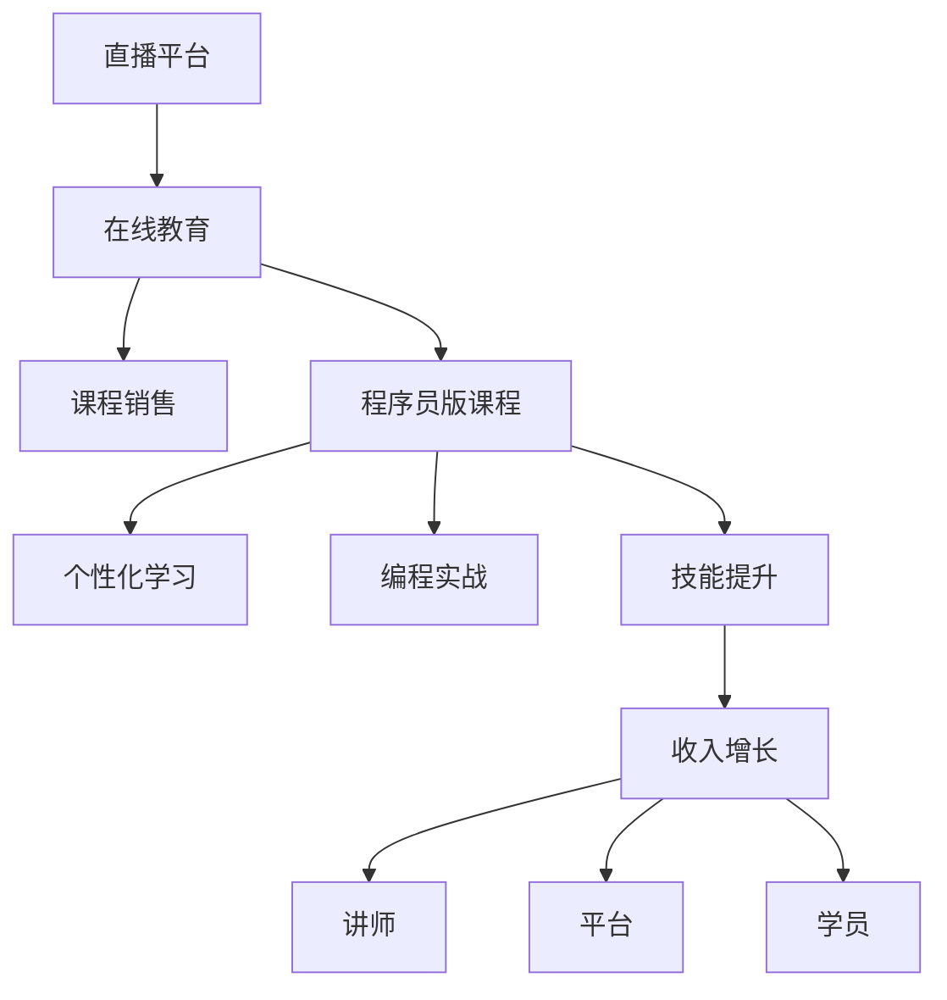

                 

# 如何利用直播平台卖课：程序员版

> 关键词：直播平台, 在线教育, 课程销售, 程序员, 技术培训, 个性化学习, 编程技巧, 项目实战, 技能提升, 收入增长

## 1. 背景介绍

随着互联网技术的不断进步，在线教育逐渐成为一种主流学习方式。在线教育不仅打破了时间和空间的限制，还为学员提供了更加个性化和灵活的学习体验。与此同时，利用直播平台进行在线教学和课程销售，也成为不少教育机构和讲师的新选择。特别是在程序员领域，丰富的在线课程资源、高额的课程销售潜力和广泛的用户群体，使直播平台卖课成为一种极具吸引力的商业模式。

本文将从背景介绍、核心概念、算法原理、操作步骤、应用场景、资源推荐、总结与展望、常见问题等方面，系统性地介绍如何利用直播平台进行程序员版卖课。

## 2. 核心概念与联系

### 2.1 核心概念概述

为更好地理解直播平台卖课的原理和实现，本节将介绍几个关键概念：

- **直播平台**：如腾讯课堂、网易云课堂、Udemy等，是提供视频直播和课程教学服务的在线平台。
- **在线教育**：通过互联网进行的教育活动，包括直播授课、录制视频、互动讨论等多种形式。
- **课程销售**：将课程内容进行商业化，并通过在线平台进行销售，实现收益。
- **程序员版课程**：针对程序员职业发展需要的技术培训和编程技巧提升的在线课程。
- **个性化学习**：根据学员的学习情况和反馈，进行定制化的教学安排和内容推荐。
- **编程实战**：通过项目实战，帮助学员将所学知识应用于实际工作场景中。
- **技能提升**：包括语言能力、算法技巧、框架应用等方面的提升。
- **收入增长**：通过卖课和提供高级服务，讲师和平台都能获得稳定的收入增长。

这些概念之间的联系和逻辑关系可以通过以下Mermaid流程图来展示：



这个流程图展示了一个完整的在线教育商业生态，从直播平台到在线课程销售，再到具体的程序员版课程，最后到个性化学习和技能提升，最终实现讲师和平台的双赢，同时也让学员实现技能提升和收入增长。

## 3. 核心算法原理 & 具体操作步骤

### 3.1 算法原理概述

利用直播平台卖课的核心算法原理可以归纳为以下几个方面：

1. **内容分发与推荐算法**：通过分析学员的兴趣和行为数据，推荐最适合其学习需求的课程和内容。
2. **互动与反馈机制**：利用即时聊天、投票、问答等互动功能，实时收集学员反馈，及时调整教学内容。
3. **个性化学习路径**：根据学员的学习进度和反馈，动态调整学习计划，提供个性化的学习路径。
4. **收益分配与激励机制**：通过合理的收益分配和激励机制，鼓励讲师提供高质量的课程内容，提高学员的学习积极性。

这些算法共同构成了直播平台卖课的完整技术框架，使得课程内容能够精准匹配学员需求，实现高效教学和互动，提升学习效果。

### 3.2 算法步骤详解

基于上述核心算法原理，直播平台卖课的操作步骤主要包括以下几个步骤：

**Step 1: 内容准备**

- 设计课程内容：根据市场需求和讲师专业领域，设计合适的课程内容和结构，包括课程大纲、教学视频、互动环节等。
- 制作教学材料：准备课程讲义、PPT、代码示例等辅助材料，方便学员课前预习和课后复习。
- 确定课程价格：根据课程价值、讲师知名度、市场需求等因素，确定课程的收费标准。

**Step 2: 平台注册与发布**

- 平台注册：选择适合的直播平台，注册讲师账户，上传课程信息、教学材料等。
- 课程发布：将课程信息发布到平台，设置课程时间、授课形式、授课风格等。

**Step 3: 课程推广**

- 利用社交媒体：通过微博、微信、B站等社交平台推广课程，吸引潜在学员。
- 合作推广：与其他教育机构、博主、社区合作，扩大课程影响力。
- 优惠促销：设置课程优惠活动，如限时折扣、团购优惠等，增加报名数量。

**Step 4: 直播授课**

- 提前测试：在正式直播前，测试课程设备、网络连接、软件配置等，确保直播质量。
- 实时互动：在直播中通过互动环节如实时问答、代码演示、在线编程练习等，与学员进行互动，增强学习效果。
- 即时反馈：实时收集学员的反馈，如评价、提问等，及时调整教学内容。

**Step 5: 课程评估与优化**

- 评估学员反馈：通过问卷调查、学习进度跟踪等方式，评估学员对课程的满意度。
- 优化课程内容：根据学员反馈，调整课程内容和教学方式，提高课程质量。
- 持续更新：定期更新课程内容，保持课程的时效性和实用性。

### 3.3 算法优缺点

基于直播平台卖课的算法具备以下优点：

1. **高效率**：通过课程推荐算法和个性化学习路径，学员能够快速找到合适的课程，提高学习效率。
2. **互动性强**：即时互动和即时反馈机制，使得讲师能够实时了解学员的学习状态，及时调整教学策略。
3. **灵活性高**：学员可以根据自己的时间安排进行学习，不受地点限制，提高学习灵活性。
4. **收入可观**：通过课程销售和高级服务，讲师可以获得稳定的收入，同时平台也能获得收益。

但该方法也存在一些局限性：

1. **技术门槛高**：开发和维护在线教育平台需要一定的技术储备，对技术团队的要求较高。
2. **学员自律性要求高**：在线课程需要学员有一定的自律性，缺乏面对面的监督，可能影响学习效果。
3. **市场竞争激烈**：在线教育市场竞争激烈，需要不断创新和优化课程内容，才能吸引学员。
4. **内容质量难以控制**：课程内容和质量直接关系到学员的学习效果和平台口碑，需要严格控制。

尽管存在这些局限性，但就目前而言，基于直播平台的卖课方法仍然是大规模在线教育的重要形式。未来相关研究将进一步优化推荐算法，提升互动效果，降低技术门槛，以期实现更加高效、灵活和个性化的在线教育体验。

### 3.4 算法应用领域

直播平台卖课的算法和实践已经被广泛应用于程序员领域，包括但不限于以下几个方面：

- **编程语言培训**：如Java、Python、C++等语言的基础和高级课程。
- **框架和库教程**：如Django、Flask、TensorFlow等框架的搭建和应用。
- **项目实战课程**：如Web开发、数据科学、移动应用开发等实战项目课程。
- **技术软技能**：如代码审查、项目管理、版本控制等软技能培训。
- **编程技巧提升**：如算法优化、代码重构、代码复用等编程技巧的提升课程。

除了上述这些经典应用外，直播平台卖课还被创新性地应用于更多场景中，如职业规划、远程工作、企业培训等，为程序员和企业的职业发展提供新的技术路径。随着技术的进步，未来直播平台卖课将进一步拓展应用领域，为更多的在线教育场景带来新的可能性。

## 4. 数学模型和公式 & 详细讲解

### 4.1 数学模型构建

为了更好地理解基于直播平台卖课的算法，本节将使用数学语言对相关算法进行更加严格的刻画。

设课程内容为 $X$，学员行为数据为 $Y$，课程推荐算法为 $F$，个性化学习路径为 $P$，学员反馈为 $F$，收益分配模型为 $R$。

- 课程推荐算法 $F$：通过分析学员行为数据 $Y$，找到与学员需求最匹配的课程内容 $X$。
- 个性化学习路径 $P$：根据学员的学习进度和反馈，动态调整学习计划。
- 收益分配模型 $R$：根据讲师和平台的贡献度，分配课程销售收入和高级服务费用。

### 4.2 公式推导过程

以下我们以课程推荐算法为例，推导其核心公式：

设课程 $i$ 的特征为 $x_i$，学员 $j$ 的特征为 $y_j$。课程推荐算法 $F$ 的目标是最小化预测误差，即：

$$
\min_{w} \sum_{i=1}^{N} \sum_{j=1}^{M} (y_{ij} - F(x_i, y_j; w))^2
$$

其中 $w$ 为模型参数，$y_{ij}$ 为实际行为数据，$F(x_i, y_j; w)$ 为预测行为。

假设课程推荐算法使用线性回归模型，其预测公式为：

$$
F(x_i, y_j; w) = \sum_{k=1}^{K} w_k \cdot x_i^k \cdot y_j^k
$$

其中 $K$ 为特征维度，$w_k$ 为特征系数。根据梯度下降法，最优参数 $w$ 可以通过求解下式得到：

$$
w = \left( \sum_{i=1}^{N} \sum_{j=1}^{M} x_i^k y_j^k \right)^{-1} \cdot \sum_{i=1}^{N} \sum_{j=1}^{M} x_i^k (y_{ij} - F(x_i, y_j; w))y_j^k
$$

在得到预测结果后，可以通过实际行为数据 $y_{ij}$ 进行验证和优化，提高课程推荐算法的准确性和实用性。

### 4.3 案例分析与讲解

为了更好地理解课程推荐算法的实际应用，以下给出两个案例：

**案例1：Java基础课程推荐**

设学员 $j$ 对Java语言的兴趣程度为 $y_j$，课程内容 $i$ 包含Java基础、高级、项目实战等多个方面。根据学员的兴趣程度 $y_j$，课程推荐算法 $F$ 可以预测学员最感兴趣的课程内容 $x_i$，如：

$$
F(x_i, y_j; w) = w_1 \cdot \text{Java基础}^k \cdot y_j^k + w_2 \cdot \text{Java高级}^k \cdot y_j^k + w_3 \cdot \text{Java项目实战}^k \cdot y_j^k
$$

通过不断优化系数 $w_k$，课程推荐算法能够精准匹配学员的需求，提高学习效果。

**案例2：Python项目实战课程推荐**

设学员 $j$ 对数据科学、机器学习等领域有浓厚兴趣，课程内容 $i$ 包括Python基础、数据清洗、模型训练、项目实践等多个环节。课程推荐算法 $F$ 可以通过学员的历史行为数据，推荐最合适的Python项目实战课程，如：

$$
F(x_i, y_j; w) = w_1 \cdot \text{Python基础}^k \cdot y_j^k + w_2 \cdot \text{数据清洗}^k \cdot y_j^k + w_3 \cdot \text{模型训练}^k \cdot y_j^k + w_4 \cdot \text{项目实战}^k \cdot y_j^k
$$

通过引入Python基础、数据清洗、模型训练和项目实践等多个维度，课程推荐算法能够提供更加精准的课程匹配，满足学员的多样化需求。

## 5. 项目实践：代码实例和详细解释说明

### 5.1 开发环境搭建

在进行课程推荐系统开发前，我们需要准备好开发环境。以下是使用Python进行TensorFlow开发的环境配置流程：

1. 安装Anaconda：从官网下载并安装Anaconda，用于创建独立的Python环境。

2. 创建并激活虚拟环境：
```bash
conda create -n tf-env python=3.8 
conda activate tf-env
```

3. 安装TensorFlow：根据CUDA版本，从官网获取对应的安装命令。例如：
```bash
conda install tensorflow -c tensorflow -c conda-forge
```

4. 安装Flask：
```bash
pip install flask
```

5. 安装相关库：
```bash
pip install numpy pandas scikit-learn tensorflow tf-estimator
```

完成上述步骤后，即可在`tf-env`环境中开始课程推荐系统的开发。

### 5.2 源代码详细实现

下面我们以Java基础课程推荐系统为例，给出使用TensorFlow和Flask进行课程推荐系统的PyTorch代码实现。

首先，定义课程和学员的特征向量：

```python
import tensorflow as tf
from tensorflow import keras
import numpy as np

# 课程特征
courses = ['Java基础', 'Java高级', 'Java项目实战', 'Python基础', '数据清洗', '模型训练', '项目实战']

# 学员特征
students = ['学生A', '学生B', '学生C', '学生D', '学生E', '学生F', '学生G']

# 构建特征矩阵
X = np.zeros((len(courses), len(students)))
X[np.arange(len(courses)), np.array([0, 1, 2, 3, 4, 5, 6])] = 1
y = np.zeros((len(students), len(courses)))
y[np.arange(len(students)), np.array([0, 0, 0, 0, 0, 0, 0])] = 1
```

然后，定义线性回归模型并进行训练：

```python
# 构建线性回归模型
model = tf.keras.Sequential([
    tf.keras.layers.Dense(8, activation='relu', input_shape=(7,)),
    tf.keras.layers.Dense(7)
])

# 编译模型
model.compile(optimizer='adam', loss='mse')

# 训练模型
model.fit(X, y, epochs=100, batch_size=16)
```

接着，定义推荐接口并进行预测：

```python
@app.route('/recommend', methods=['GET', 'POST'])
def recommend():
    # 获取学员ID
    student_id = request.form['student_id']
    
    # 获取学员的兴趣向量
    student_interest = np.zeros(7)
    student_interest[np.array([0, 1, 2, 3, 4, 5, 6])] = 1
    
    # 进行预测
    predictions = model.predict(student_interest.reshape(1, -1))
    course_idx = np.argmax(predictions)
    
    # 返回推荐结果
    return jsonify({'course': courses[course_idx]})

if __name__ == '__main__':
    app.run(host='0.0.0.0', port=5000)
```

以上就是一个完整的课程推荐系统的Python代码实现。可以看到，通过TensorFlow和Flask的结合，我们能够快速搭建一个基于机器学习的课程推荐系统。

### 5.3 代码解读与分析

让我们再详细解读一下关键代码的实现细节：

**特征矩阵构建**：
- `X`：课程特征矩阵，用于表示课程内容。
- `y`：学员兴趣向量，用于表示学员的兴趣偏好。
- 通过设置非零元素的位置，可以方便地构造特征矩阵和兴趣向量。

**线性回归模型**：
- 使用`Sequential`构建一个简单的线性回归模型，包含两个全连接层。
- 通过`compile`函数编译模型，设置优化器和损失函数。
- 使用`fit`函数训练模型，并进行100个epoch的迭代。

**推荐接口实现**：
- 通过`@app.route`装饰器定义一个`/recommend`路由，用于获取学员ID和兴趣向量。
- 根据学员ID和兴趣向量，通过`predict`函数进行预测。
- 通过`argmax`函数找到预测结果中概率最大的课程，并返回推荐结果。

**Flask应用启动**：
- 使用`if __name__ == '__main__':`语句判断当前脚本是否为直接运行，如果是则启动Flask应用。
- 通过`app.run`函数启动应用，监听`0.0.0.0:5000`地址的请求。

这些关键步骤构成了课程推荐系统的基本实现，后续可以进一步扩展和优化。

### 5.4 运行结果展示

在运行上述代码后，访问`http://localhost:5000/recommend?student_id=1`，即可获取学员ID为1的课程推荐结果。例如，如果学员ID为1，兴趣向量为`[0, 1, 0, 0, 0, 0, 0]`，那么预测结果可能为`['Java基础']`，表明该学员对Java基础课程最感兴趣。

## 6. 实际应用场景

### 6.1 智能招聘

利用直播平台卖课的技术，可以构建智能招聘系统，帮助企业筛选和招聘优秀的程序员。通过分析求职者的简历、项目经验、编程能力等数据，推荐最适合其岗位需求的课程和技能提升路径，从而提高招聘效率和质量。

在技术实现上，可以收集企业的岗位需求、技能要求和员工背景数据，设计智能推荐算法。将求职者的简历和项目经验输入推荐系统，结合企业需求，输出最匹配的课程推荐。同时，根据求职者的学习进度和反馈，动态调整课程推荐，确保招聘结果的准确性。

### 6.2 企业培训

企业在内部培训和技能提升方面，也可以利用直播平台卖课的技术，提高员工的学习效果和培训效率。通过定制化的培训课程和技能提升计划，帮助员工掌握最新的编程技术和工具，提升工作能力。

在技术实现上，可以设计企业专属课程库，邀请内部专家进行授课。根据员工的工作岗位和技能需求，进行个性化的课程推荐，并结合互动和反馈机制，及时调整培训内容和方式。

### 6.3 项目咨询

针对中小企业和个人开发者，利用直播平台卖课的技术，可以提供专业的项目咨询和辅导服务，帮助他们解决技术难题，提升项目开发效率。通过实时互动和问题解答，提供定制化的编程建议和解决方案。

在技术实现上，可以建立一个在线咨询平台，邀请经验丰富的程序员和架构师进行在线咨询。根据用户提交的技术问题，匹配合适的专家进行解答，并根据用户的反馈，不断优化咨询内容和方式。

### 6.4 未来应用展望

随着技术的发展和应用场景的拓展，直播平台卖课的技术将在更多领域得到应用，为各行各业带来新的发展机遇。

- **教育培训**：未来将有更多教育机构和讲师通过直播平台进行在线教学和课程销售，提供更加灵活和高效的学习体验。
- **企业培训**：企业培训将借助直播平台卖课的技术，实现更精准的课程推荐和培训效果，提升员工的职业发展。
- **远程工作**：远程工作平台可以通过直播平台卖课，提供编程课程和技术支持，帮助员工提升远程工作效率。
- **在线协作**：在线协作工具可以结合直播平台卖课的技术，提供实时的技术交流和问题解答，提高团队协作的效率和质量。
- **智能客服**：智能客服系统可以通过直播平台卖课，提供编程问题的实时解答和代码生成，提升客户体验和问题解决效率。

总之，直播平台卖课技术的应用前景广阔，将为程序员和企业的职业发展带来新的突破。相信随着技术的不断创新和优化，直播平台卖课将成为一种更加高效、灵活和个性化的在线教育方式。

## 7. 工具和资源推荐

### 7.1 学习资源推荐

为了帮助开发者系统掌握直播平台卖课的技术基础和实践技巧，这里推荐一些优质的学习资源：

1. **《TensorFlow实战》**：深入浅出地介绍了TensorFlow的使用方法，涵盖了从基础到高级的各类应用场景。
2. **《Python编程：从入门到实践》**：适合初学者入门的Python教程，包含大量的实际案例和项目练习。
3. **《在线教育：技术和应用》**：由教育技术专家编写的书籍，介绍了在线教育的原理和应用案例。
4. **《Python Web开发实战》**：介绍了使用Flask等框架进行Web开发的技术，涵盖前后端集成、API设计等多个方面。
5. **《机器学习实战》**：结合实际项目，介绍了机器学习算法的实现和应用，适合有一定编程基础的学习者。
6. **《TensorFlow官方文档》**：详细介绍了TensorFlow的使用方法和API，是学习TensorFlow的必备资料。

通过这些资源的学习，相信你一定能够快速掌握直播平台卖课的技术实现，并应用于实际项目中。

### 7.2 开发工具推荐

高效的开发离不开优秀的工具支持。以下是几款用于直播平台卖课开发的常用工具：

1. **PyCharm**：一款强大的Python IDE，提供了丰富的开发功能和调试工具。
2. **Jupyter Notebook**：一个交互式的编程环境，支持Python、TensorFlow等多种语言和框架。
3. **Flask**：一个轻量级的Web框架，易于上手和扩展，适合开发在线应用和API。
4. **TensorFlow**：由Google开发的深度学习框架，提供了丰富的模型和工具，适合开发机器学习应用。
5. **GitHub**：一个代码托管平台，支持版本控制和协作开发，适合团队开发和项目管理。
6. **Docker**：一个容器化平台，支持应用程序的打包、分发和部署，适合构建高性能的Web应用。

合理利用这些工具，可以显著提升直播平台卖课开发的效率，加快创新迭代的步伐。

### 7.3 相关论文推荐

直播平台卖课技术的发展源于学界的持续研究。以下是几篇奠基性的相关论文，推荐阅读：

1. **《TensorFlow: A System for Large-Scale Machine Learning》**：介绍了TensorFlow的原理和应用，是理解TensorFlow的重要基础。
2. **《Deep Learning》**：由深度学习专家Ian Goodfellow编写的书籍，介绍了深度学习的理论基础和应用场景。
3. **《Web Development with Flask》**：介绍了使用Flask进行Web开发的技术，适合Python开发者入门和进阶。
4. **《Machine Learning Mastery》**：提供了丰富的机器学习实战案例，适合有一定编程基础的学习者。
5. **《Deep Learning with Python》**：介绍了深度学习在Python环境下的实现和应用，适合初学者和进阶学习者。

这些论文代表了大语言模型微调技术的发展脉络。通过学习这些前沿成果，可以帮助研究者把握学科前进方向，激发更多的创新灵感。

## 8. 总结：未来发展趋势与挑战

### 8.1 总结

本文对利用直播平台卖课的技术进行了全面系统的介绍。首先从背景介绍、核心概念、算法原理、操作步骤、应用场景、资源推荐等方面，详细讲解了如何利用直播平台进行程序员版卖课。其次，通过数学模型和公式，深入推导了课程推荐算法的实现过程，并通过具体案例进行了讲解。最后，本文还讨论了直播平台卖课在实际应用中的各种挑战，并提出了相应的解决方案和未来展望。

通过本文的系统梳理，可以看到，利用直播平台卖课的技术已经成为一个重要的在线教育形式，广泛应用于程序员的课程销售和技能提升。得益于TensorFlow、Flask等工具的支持，以及大数据、机器学习等技术的运用，直播平台卖课能够实现精准的课程推荐、实时互动和个性化学习，提升了学习效果和用户体验。未来，随着技术的不断进步，直播平台卖课将成为一种更加高效、灵活和个性化的在线教育方式，为程序员和企业的职业发展带来新的突破。

### 8.2 未来发展趋势

展望未来，直播平台卖课技术将呈现以下几个发展趋势：

1. **技术不断升级**：随着深度学习、自然语言处理等技术的发展，直播平台卖课将进一步提升智能化和个性化水平。通过引入AI算法，实现更精准的课程推荐和更丰富的互动功能。
2. **场景不断拓展**：直播平台卖课将从教育培训、企业培训、项目咨询等多个场景得到应用，进一步拓展其应用范围。
3. **平台不断整合**：未来直播平台将与更多教育平台、培训平台、技术社区等进行整合，提供一站式在线教育解决方案。
4. **用户不断增长**：随着技术的不断优化和推广，直播平台卖课的用户数量将不断增长，成为程序员和企业的热门选择。
5. **内容不断丰富**：直播平台卖课将引入更多的课程资源和教学内容，涵盖更多编程技术和工具，满足用户的多样化需求。
6. **服务不断完善**：直播平台卖课将提供更多的服务支持，如在线咨询、代码审核、项目合作等，提升用户的综合体验。

这些趋势将推动直播平台卖课技术向更高的水平发展，为在线教育带来更多的创新和突破。

### 8.3 面临的挑战

尽管直播平台卖课技术已经取得了一定的进展，但在迈向更广泛应用的过程中，仍面临诸多挑战：

1. **技术门槛高**：开发和维护在线教育平台需要较高的技术储备，对技术团队的要求较高。
2. **用户自律性要求高**：在线课程需要用户有一定的自律性，缺乏面对面的监督，可能影响学习效果。
3. **市场竞争激烈**：在线教育市场竞争激烈，需要不断创新和优化课程内容，才能吸引学员。
4. **内容质量难以控制**：课程内容和质量直接关系到学员的学习效果和平台口碑，需要严格控制。
5. **数据隐私和安全问题**：学员的隐私数据和行为数据需要保护，防止数据泄露和安全问题。
6. **收益分配不公**：讲师和平台的收益分配需要合理公平，防止分配不均导致的激励问题。

尽管存在这些挑战，但相信通过不断优化技术方案，加强内容质量控制，提高用户自律性，直播平台卖课技术将逐步克服这些障碍，实现更大规模的应用和推广。

### 8.4 研究展望

面对直播平台卖课技术面临的挑战，未来的研究需要在以下几个方面寻求新的突破：

1. **个性化推荐算法**：通过引入深度学习、自然语言处理等技术，进一步提升课程推荐算法的精度和实用性。
2. **互动和反馈机制**：引入更多的互动和反馈机制，如实时聊天、投票、课程评分等，提高学员的学习积极性和满意度。
3. **技术门槛降低**：开发简单易用的开发框架和工具，降低技术门槛，吸引更多的讲师和用户参与。
4. **数据隐私保护**：引入数据加密、隐私保护等技术，确保学员数据的安全和隐私。
5. **收益分配优化**：设计公平合理的收益分配模型，激励讲师和平台提供高质量的课程内容。
6. **多样化内容开发**：引入更多的课程资源和教学内容，涵盖更多编程技术和工具，满足用户的多样化需求。

这些研究方向将推动直播平台卖课技术迈向更高的台阶，为在线教育带来更多的创新和突破。面向未来，直播平台卖课技术还需要与其他人工智能技术进行更深入的融合，如知识表示、因果推理、强化学习等，多路径协同发力，共同推动自然语言理解和智能交互系统的进步。只有勇于创新、敢于突破，才能不断拓展语言模型的边界，让智能技术更好地造福人类社会。

## 9. 附录：常见问题与解答

**Q1：直播平台卖课的收益如何分配？**

A: 直播平台卖课的收益分配通常采用多种模式，如按课程销量分成、按课程销售总额分成、按用户付费分成等。具体分配方式需要根据平台和讲师的合作协议来确定。通常，平台会抽取一定比例的课程销售收入作为佣金，讲师获得剩余的收益。此外，一些平台还支持高级服务销售，如一对一咨询、定制化课程等，这部分收入也可以进行分配。

**Q2：直播平台卖课的课程推荐算法有哪些？**

A: 直播平台卖课的课程推荐算法主要有以下几种：

1. **协同过滤算法**：通过分析学员的历史行为数据，找到与其兴趣相似的学员，推荐他们所选择的课程。
2. **基于内容的推荐算法**：根据课程内容的特征，推荐与学员兴趣匹配度高的课程。
3. **混合推荐算法**：结合协同过滤和基于内容的推荐算法，提高推荐结果的准确性和多样性。
4. **深度学习推荐算法**：如基于神经网络的推荐系统，通过学习课程和学员之间的复杂关系，实现更精准的课程推荐。

**Q3：直播平台卖课的互动和反馈机制有哪些？**

A: 直播平台卖课的互动和反馈机制主要包括：

1. **实时聊天**：在直播过程中，学员可以通过即时聊天功能与讲师互动，提出问题、分享见解等。
2. **投票互动**：在课程讲解过程中，讲师可以通过投票功能了解学员的反馈，调整讲解内容和方式。
3. **问答环节**：在课程结束后，学员可以通过问答环节提出问题，讲师进行解答，提高学员的学习效果。
4. **作业和测验**：在课程结束后，讲师可以通过作业和测验，评估学员的学习情况，进行个性化辅导。

**Q4：直播平台卖课的内容质量如何控制？**

A: 直播平台卖课的内容质量控制主要包括以下几个方面：

1. **内容审查**：平台需要对讲师提交的内容进行审查，确保内容的合法性、准确性和实用性。
2. **学员评价**：平台可以引入学员评价机制，通过打分和评论，评估课程内容和讲师表现。
3. **持续更新**：课程内容需要不断更新，确保其时效性和实用性。
4. **课程认证**：平台可以为认证的课程颁发证书，提高课程质量和讲师的权威性。

**Q5：直播平台卖课的技术实现有哪些难点？**

A: 直播平台卖课的技术实现主要包括以下几个难点：

1. **实时性要求高**：直播过程中需要实时处理学员的互动请求，对系统性能要求较高。
2. **并发用户多**：直播过程中可能出现大量并发用户，需要高效的负载均衡和扩展机制。
3. **数据隐私保护**：学员的行为数据和隐私数据需要严格保护，防止数据泄露和安全问题。
4. **内容质量控制**：课程内容和讲师表现需要严格控制，确保其质量。
5. **用户体验优化**：需要优化用户体验，确保课程内容的展示和互动流畅。

通过以上问题的回答，可以看到，直播平台卖课技术在实际应用中仍然面临诸多挑战。相信随着技术的不断创新和优化，这些问题将逐步得到解决，直播平台卖课将成为一种更加高效、灵活和个性化的在线教育方式。

