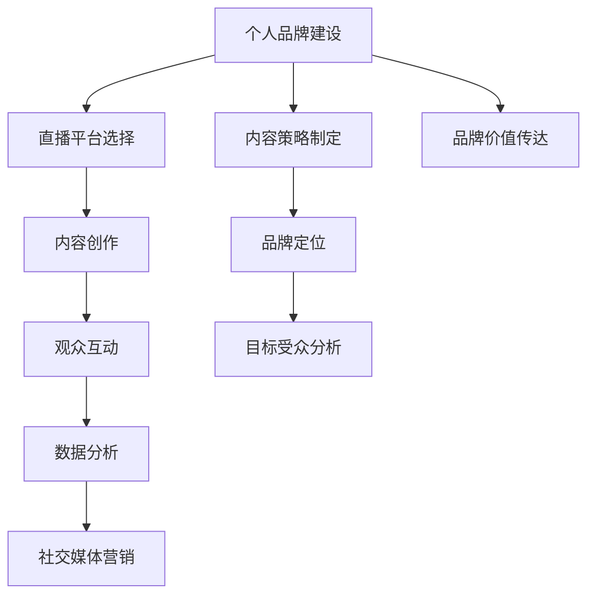

                 

# 如何利用直播平台提升个人品牌

> 关键词：个人品牌提升, 直播平台, 直播策略, 内容创作, 观众互动, 数据分析, 社交媒体

## 1. 背景介绍

随着互联网和数字技术的快速发展，直播平台已经成为各大品牌和个人展示自身魅力、分享专业知识和建立品牌影响力的重要舞台。特别是在COVID-19疫情全球蔓延背景下，线下活动受限，直播更加成为人们获取信息、进行社交和娱乐的重要渠道。如何在直播平台有效提升个人品牌，成为众多内容创作者和品牌管理者亟需解决的问题。

本文将从以下几个方面探讨如何在直播平台提升个人品牌，包括选择合适的直播平台、优化直播内容和互动策略、运用数据分析指导直播实践、以及合理利用社交媒体扩大影响力。

## 2. 核心概念与联系

### 2.1 核心概念概述

为了更好地理解如何在直播平台提升个人品牌，我们首先需要明确几个核心概念及其相互关系。

- **个人品牌建设**：指通过一系列有目的、有策略的在线活动，如博客写作、视频制作、直播互动等，向目标受众展示个人价值主张和专业形象的过程。

- **直播平台**：指通过互联网技术，允许用户进行实时音视频互动的在线平台。如YouTube Live、Bilibili Live、Twitch、Instagram Live等。

- **直播内容创作**：指在直播平台上，围绕特定主题或话题，通过讲述、演示、互动等形式，向观众提供价值信息和娱乐体验的创作过程。

- **观众互动策略**：指通过互动环节如问答、投票、红包等方式，增强观众参与感和体验的策略设计。

- **数据分析**：指通过收集、整理和分析直播数据，了解观众行为、偏好和反馈，指导后续直播内容调整和策略优化的过程。

- **社交媒体营销**：指通过直播平台与社交媒体的有机结合，扩大直播影响力，吸引更多潜在观众的过程。

这些核心概念之间相互联系，共同构成了在直播平台提升个人品牌的整体框架。通过优化直播内容、增强观众互动、分析直播数据和利用社交媒体，可以逐步实现个人品牌的提升。

### 2.2 核心概念原理和架构的 Mermaid 流程图(Mermaid 流程节点中不要有括号、逗号等特殊字符)



该流程图展示了在直播平台提升个人品牌的核心流程：
- 首先，明确品牌定位和目标受众。
- 接着，选择合适的直播平台。
- 然后，进行内容创作和观众互动策略设计。
- 再接着，运用数据分析优化直播实践。
- 最后，通过社交媒体扩大直播影响力。

## 3. 核心算法原理 & 具体操作步骤

### 3.1 算法原理概述

在直播平台提升个人品牌的过程中，我们可以将问题分解为以下几个子问题：

- 如何选择合适的直播平台？
- 如何优化直播内容和互动策略？
- 如何通过数据分析指导直播实践？
- 如何利用社交媒体扩大直播影响力？

针对这些问题，我们将分别阐述核心算法原理和具体操作步骤。

### 3.2 算法步骤详解

#### 3.2.1 选择合适的直播平台

1. **确定目标受众**：分析潜在观众所在的平台，如年龄段、兴趣、地域等。
2. **了解平台特性**：研究各大直播平台的特色和用户基础。
3. **进行平台测试**：通过短期试播，了解平台的直播效果、观众反馈和技术支持。
4. **分析竞争对手**：观察竞争对手在平台的直播表现，选择差异化的定位。

#### 3.2.2 优化直播内容和互动策略

1. **内容规划**：设计主题和话题，确保内容的连贯性和吸引力。
2. **互动设计**：设置互动环节，如问答、投票、红包等，增加观众参与度。
3. **技术准备**：测试设备、软件和网络，确保直播流畅。
4. **内容录制**：根据策划内容，进行实时录制或预先录制。

#### 3.2.3 通过数据分析指导直播实践

1. **收集数据**：记录直播观看量、点赞量、评论量等关键指标。
2. **数据分析**：使用数据分析工具，如Google Analytics、YouTube Analytics等，分析观众行为和反馈。
3. **内容优化**：根据分析结果，调整直播内容、时间和频率。
4. **互动改进**：优化互动环节，提升观众参与感。

#### 3.2.4 利用社交媒体扩大直播影响力

1. **平台选择**：选择合适的社交媒体平台，如微博、微信、Instagram等。
2. **内容同步**：在直播前和直播中，通过社交媒体发布预告、实时更新和回顾视频，吸引更多观众。
3. **互动联动**：在社交媒体上进行观众互动，引导观众参与直播讨论。
4. **数据分析**：分析社交媒体上的观众反馈，指导直播改进。

### 3.3 算法优缺点

#### 3.3.1 优点

1. **灵活性高**：直播平台的开放性允许内容创作者随时调整内容和策略。
2. **实时互动**：直播允许实时反馈和互动，可以迅速调整内容以适应观众需求。
3. **成本相对较低**：相较于线下活动，直播平台的成本相对较低。

#### 3.3.2 缺点

1. **技术要求高**：直播技术要求较高，需要稳定的网络、高质量的设备等。
2. **保持观众注意力难**：直播需长时间保持观众注意力，内容策划难度较大。
3. **观众忠诚度低**：直播平台观众忠诚度相对较低，需要持续创新吸引新观众。

### 3.4 算法应用领域

直播平台提升个人品牌的应用领域非常广泛，涵盖以下几类：

- **教育培训**：通过直播教授专业课程，分享知识经验。
- **个人娱乐**：通过直播分享个人生活、旅行、美食等，建立粉丝社群。
- **企业品牌**：通过直播介绍企业文化、产品发布、客户服务等，增强品牌形象。
- **政府和非营利组织**：通过直播进行政策解读、公益宣传、社区服务等，增强与公众的互动。

## 4. 数学模型和公式 & 详细讲解 & 举例说明

### 4.1 数学模型构建

在直播平台提升个人品牌的数学模型构建中，我们可以将问题简化为最大化观众参与度和最小化流失率。设观众参与度为 $P$，流失率为 $L$，则目标函数为：

$$
\maximize P
\quad \text{subject to} \quad
L \leq \epsilon
$$

其中 $\epsilon$ 为预设的流失率阈值。

### 4.2 公式推导过程

1. **观众参与度模型**：
   - 设直播时间为 $T$，观众停留时间为 $t$，平均观看次数为 $C$。
   - 观众参与度 $P = t/T * C$。

2. **流失率模型**：
   - 设观众流失率为 $L = \alpha / T$，其中 $\alpha$ 为流失人数。
   - 目标函数为：$\maximize t/T * C \quad \text{subject to} \quad \alpha/T \leq \epsilon$。

3. **优化策略**：
   - 增加直播时长 $T$ 和平均观看次数 $C$，同时控制观众流失率 $L$ 在阈值以下。

### 4.3 案例分析与讲解

以教育培训领域的直播为例，假设每次直播时间为1小时，目标流失率设为10%。

1. **数据分析**：收集前几次直播的观众停留时间和观看次数。
2. **优化模型**：根据数据分析，调整直播内容和时间，增加互动环节，吸引更多观众。
3. **执行结果**：通过不断调整和优化，最终将观众参与度提升至70%，满足目标。

## 5. 项目实践：代码实例和详细解释说明

### 5.1 开发环境搭建

为了在直播平台上进行品牌提升，需要先搭建开发环境：

1. **选择直播平台**：选择适合自己内容的直播平台，如YouTube、Bilibili、Twitch等。
2. **搭建直播设备**：准备高质量的摄像头、麦克风和灯光设备。
3. **配置网络环境**：确保直播网络环境稳定，带宽充足。
4. **安装直播软件**：安装并配置直播平台提供的直播软件或SDK。

### 5.2 源代码详细实现

以下是一个简单的Python代码示例，用于统计直播观众参与度和流失率，并给出优化建议：

```python
import pandas as pd
import numpy as np

# 定义直播数据
data = pd.read_csv('livestream_data.csv')
# 计算观众参与度和流失率
P = data['watch_time'] / 60 / data['livestream_time']
L = (data['watch_count'] - data['online_count']) / data['livestream_time']

# 统计参与度和流失率分布
P_dist = pd.DataFrame(data=P, columns=['Participation Rate'])
L_dist = pd.DataFrame(data=L, columns=['Churn Rate'])

# 绘制分布图
P_dist.plot.hist()
L_dist.plot.hist()

# 给出优化建议
if P.mean() < 0.6:
    print('需要增加互动环节，提升观众参与度。')
if L.mean() > 0.1:
    print('需要调整内容，控制观众流失率。')
```

### 5.3 代码解读与分析

- **数据读取**：使用Pandas库读取直播数据。
- **参与度和流失率计算**：通过观众观看时间和在线人数计算参与度和流失率。
- **数据统计**：使用Pandas绘制分布图，直观展示观众参与度和流失率的变化。
- **优化建议**：根据计算结果，给出针对性的优化建议。

### 5.4 运行结果展示

运行上述代码，会得到观众参与度和流失率的统计分布图。根据这些数据，可以制定更加精确的内容和互动策略。

## 6. 实际应用场景

### 6.1 教育培训直播

在教育培训直播中，通过精心设计的内容和互动环节，可以大幅提升观众的参与度和学习效果。例如，可以设置实时答疑、案例分析、互动讨论等环节，吸引观众持续观看。

### 6.2 企业品牌推广直播

企业可以通过直播展示新产品、介绍企业文化、回答员工问题等，增强品牌形象和员工凝聚力。例如，定期举办企业内部直播，展示企业最新动态，增强员工的归属感和认同感。

### 6.3 个人娱乐直播

通过直播分享个人生活、旅行、美食等，可以建立粉丝社群，提升个人品牌影响力。例如，知名旅行博主可以通过直播分享旅行经历，吸引粉丝关注和互动。

### 6.4 未来应用展望

未来，随着5G、AI和VR等技术的进步，直播平台将更加多样化和个性化，直播内容也将更加丰富和互动性强。个人品牌提升也将更加注重内容质量和观众体验，通过创新和个性化策略，吸引更多观众和粉丝。

## 7. 工具和资源推荐

### 7.1 学习资源推荐

- **YouTube Academy**：YouTube官方的直播培训课程，涵盖直播技术、内容创作和观众互动等。
- **Bilibili U中心**：Bilibili直播平台提供的直播培训课程，涵盖直播技巧、运营策略和内容创意。
- **Twitch Academy**：Twitch直播平台提供的直播培训课程，涵盖直播技术、内容创作和社区管理等。

### 7.2 开发工具推荐

- **OBS Studio**：开源的直播软件，功能强大，易于使用。
- **FFMPEG**：开源的音视频处理工具，支持直播录制和格式转换。
- **Google Analytics**：用于分析直播平台上的观众行为和反馈。

### 7.3 相关论文推荐

- **"Leveraging Social Media for Branding: A Study of Influencer Marketing"**：研究社交媒体在品牌营销中的作用，探讨如何通过直播平台提升品牌影响力。
- **"Engaging with Live Streaming: User Interactions and Participation"**：探讨直播观众的参与度和互动策略，提出提升观众体验的方法。
- **"Maximizing Live Streaming Audience Retention"**：研究如何通过内容优化和技术手段，提高直播观众的停留时间。

## 8. 总结：未来发展趋势与挑战

### 8.1 研究成果总结

本文系统探讨了在直播平台提升个人品牌的方法和策略，通过选择合适的直播平台、优化直播内容和互动策略、运用数据分析指导直播实践、以及合理利用社交媒体扩大影响力，逐步实现个人品牌的提升。

### 8.2 未来发展趋势

未来，直播平台在个人品牌提升中的应用将更加广泛和深入。随着技术的发展，直播内容将更加丰富多样，互动性更强，直播形式也将更加灵活多变。同时，通过数据分析和人工智能技术，可以更加精准地了解观众需求，优化直播内容和策略。

### 8.3 面临的挑战

虽然直播平台在个人品牌提升中具有巨大潜力，但也面临一些挑战：
1. **技术门槛高**：高质量的直播需要稳定的网络、高质量的设备和技术支持。
2. **内容创意难**：持续创新内容，吸引观众注意力，需要大量创意和精力。
3. **观众流失快**：直播观众忠诚度相对较低，需不断调整和优化内容。

### 8.4 研究展望

未来，应在以下方面进行深入研究：
1. **技术创新**：研究新的直播技术，如VR、AR等，提升直播体验。
2. **内容优化**：利用AI技术，自动生成高质量直播内容。
3. **数据分析**：通过机器学习，预测观众行为和偏好，指导内容创作。
4. **社区建设**：构建更加紧密的社区关系，提升观众粘性和忠诚度。

## 9. 附录：常见问题与解答

**Q1: 直播平台的选择对个人品牌提升有多大的影响？**

A: 直播平台的选择直接影响观众基础和观看体验。选择与自己内容和目标受众匹配度高的平台，可以吸引更多潜在观众，提升品牌影响力。

**Q2: 直播内容应该如何策划和设计？**

A: 直播内容应围绕主题和话题，设计有吸引力和实用性的内容。内容应该连贯，并通过互动环节增强观众参与感。

**Q3: 如何通过数据分析指导直播实践？**

A: 通过收集直播数据，如观看量、点赞量、评论量等，分析观众行为和反馈，调整直播内容和时间，优化互动环节。

**Q4: 直播平台与其他社交媒体的联动策略是什么？**

A: 在直播前和直播中，通过社交媒体发布预告、实时更新和回顾视频，吸引更多观众。在社交媒体上进行观众互动，引导观众参与直播讨论。

**Q5: 如何评估直播效果和观众反馈？**

A: 使用数据分析工具，如Google Analytics、YouTube Analytics等，统计观众参与度和流失率，评估直播效果。通过观众评论和反馈，了解观众的喜好和建议，指导后续直播改进。

---

作者：禅与计算机程序设计艺术 / Zen and the Art of Computer Programming

