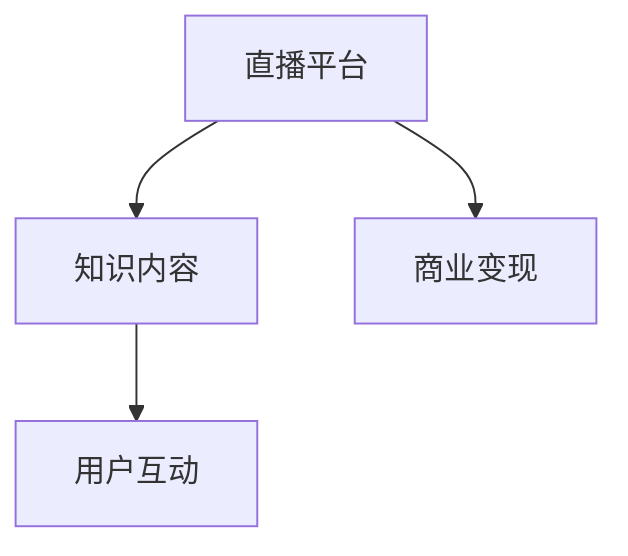

                 

# 如何利用直播形式进行知识付费

## 1. 背景介绍

在数字化时代，知识付费正逐渐成为人们获取高质量信息的重要方式。传统的知识付费形式，如书籍、视频课程等，存在内容分散、互动性差等问题，难以满足用户对即时互动和深度交流的需求。而直播作为新兴的知识传播方式，凭借其即时性、互动性和沉浸感，展现出巨大的潜力。

### 1.1 问题由来
直播形式的兴起，源于社交媒体和视频平台的崛起。用户可以通过直播平台，实时获取信息，与专家进行互动，甚至参与到话题讨论中。与传统的录播课程相比，直播不仅能够提供更为即时、动态的内容，还增强了用户参与感和学习效果。

### 1.2 问题核心关键点
直播知识付费的核心在于，如何利用直播的即时性和互动性，创造高价值的学习体验。这包括：
- 实时内容传递：直播可以实时传递最新信息，满足用户对时效性的需求。
- 互动交流：直播中的即时问答、讨论等形式，增强了用户参与感，促进深度学习。
- 个性化推荐：基于用户偏好，推送个性化内容，提高学习效果。
- 知识变现：通过订阅、打赏、付费问答等形式，实现知识付费的商业化。

本文将探讨如何利用直播形式进行知识付费，通过结构化、系统化的分析，帮助直播平台、教育机构和个人开发者，构建高效、可持续的知识付费生态。

## 2. 核心概念与联系

### 2.1 核心概念概述

直播知识付费涉及多个核心概念，包括直播平台、知识内容、用户互动和商业变现等。下面将详细介绍这些概念及其联系。

- **直播平台**：提供直播服务的基础设施，包括直播室、互动工具、推送算法等。
- **知识内容**：直播中传递的知识和信息，涵盖各个领域，如科技、金融、健康等。
- **用户互动**：用户通过评论、提问、点赞等方式与主播互动，增强学习体验。
- **商业变现**：通过订阅、打赏、付费问答等方式，实现知识内容的商业化。

这些概念之间的联系如图1所示：



图1: 直播知识付费核心概念图

### 2.2 核心概念原理和架构

直播知识付费的架构可以分为三层：内容层、互动层和商业层。

#### 2.2.1 内容层

内容层是直播知识付费的基础。内容的质量和相关性直接影响用户的学习效果和满意度。为了保证内容质量，内容层应包括以下模块：

- **内容生产**：包括专家访谈、讲座、案例分析等，由具有专业知识背景的专家或机构提供。
- **内容审核**：对内容进行审核，确保其准确性和适宜性，避免误导用户。
- **内容推荐**：基于用户历史行为和偏好，推荐个性化内容，提高学习效率。

#### 2.2.2 互动层

互动层是直播知识付费的核心。良好的互动机制能够增强用户参与感，提升学习效果。互动层应包括以下模块：

- **实时问答**：用户可以在直播过程中实时提问，主播实时回答。
- **讨论区**：用户可以在直播结束后在讨论区交流讨论，分享见解。
- **点赞和评论**：用户可以通过点赞和评论，表达对内容的认可和看法。

#### 2.2.3 商业层

商业层是直播知识付费的保障。只有实现商业化，才能保证平台的可持续发展和内容创作者的收入。商业层应包括以下模块：

- **订阅模式**：用户可以订阅主播或频道，定期获取内容。
- **打赏机制**：用户可以通过打赏支持内容创作者。
- **付费问答**：用户可以付费提问，获取专业解答。

### 2.3 核心概念联系

各层之间相互关联，共同构成直播知识付费的生态。内容层提供优质内容，互动层增强学习体验，商业层实现盈利，共同推动直播知识付费的发展。

## 3. 核心算法原理 & 具体操作步骤

### 3.1 算法原理概述

直播知识付费的核心算法包括内容推荐、实时问答和付费问答等。

#### 3.1.1 内容推荐

内容推荐算法通过分析用户行为，预测用户偏好，推荐个性化内容。其基本思路为：

1. **用户行为分析**：通过记录用户观看内容的时间、时长、点赞数、评论内容等，提取用户兴趣特征。
2. **内容特征提取**：对内容进行特征提取，如关键词、分类、标签等。
3. **相似度计算**：计算用户兴趣特征与内容特征的相似度，推荐相似内容。
4. **多轮迭代**：根据推荐效果反馈，不断调整推荐算法，提高推荐准确性。

#### 3.1.2 实时问答

实时问答算法通过自然语言处理技术，实现用户与主播的实时互动。其基本思路为：

1. **自然语言理解**：理解用户提问的自然语言文本，提取关键词和意图。
2. **知识图谱查询**：在知识图谱中查询相关信息，提供多角度的回答。
3. **回答生成**：根据查询结果，生成结构化或非结构化的回答，返回给用户。

#### 3.1.3 付费问答

付费问答算法通过在线下线功能，提供用户付费咨询服务的接口。其基本思路为：

1. **需求匹配**：根据用户提出的问题，匹配适合的专家或知识库。
2. **价格定价**：根据专家资历、回答难度等，确定咨询价格。
3. **支付结算**：用户支付费用后，获取专家回答。

### 3.2 算法步骤详解

#### 3.2.1 内容推荐算法步骤

1. **数据收集**：收集用户观看历史、点赞记录、评论内容等，形成用户行为数据集。
2. **特征提取**：对用户行为数据和内容数据进行特征提取，包括用户兴趣特征、内容标签等。
3. **相似度计算**：使用余弦相似度、TF-IDF等方法计算用户行为特征与内容特征的相似度。
4. **推荐排序**：根据相似度排序，推荐相似内容给用户。
5. **反馈调整**：根据用户反馈，不断调整推荐算法，优化推荐效果。

#### 3.2.2 实时问答算法步骤

1. **自然语言理解**：使用BERT、GPT等模型，理解用户提问的自然语言文本。
2. **知识图谱查询**：在知识图谱中查询相关信息，获取多角度的答案是，如专家回答、学术论文、案例分析等。
3. **回答生成**：根据查询结果，生成结构化或非结构化的回答，返回给用户。

#### 3.2.3 付费问答算法步骤

1. **需求匹配**：根据用户提问，匹配适合的专家或知识库。
2. **价格定价**：根据专家资历、回答难度等，确定咨询价格。
3. **支付结算**：用户支付费用后，获取专家回答。

### 3.3 算法优缺点

#### 3.3.1 内容推荐算法优缺点

**优点**：
- **个性化**：根据用户兴趣，推荐个性化内容，提升学习效果。
- **动态调整**：根据用户反馈，动态调整推荐算法，提高推荐准确性。

**缺点**：
- **冷启动问题**：新用户缺乏历史数据，难以进行有效推荐。
- **数据隐私**：用户行为数据隐私保护需要考虑。

#### 3.3.2 实时问答算法优缺点

**优点**：
- **实时互动**：用户可以实时提问，主播实时回答，增强互动性。
- **多角度回答**：通过知识图谱查询，提供多角度的答案是。

**缺点**：
- **计算复杂**：自然语言处理和知识图谱查询计算复杂度高，需优化算法性能。
- **回答准确性**：问答系统依赖于数据质量和算法，回答准确性受影响。

#### 3.3.3 付费问答算法优缺点

**优点**：
- **专家咨询**：用户可以获取专家解答，获取高质量信息。
- **知识变现**：通过付费问答实现商业化，支持内容创作者。

**缺点**：
- **价格不透明**：咨询价格难以统一，用户难以判断性价比。
- **专家匹配**：匹配合适的专家需要算法和人工介入，成本较高。

### 3.4 算法应用领域

直播知识付费在多个领域都有广泛应用，包括但不限于：

- **教育培训**：教师可以通过直播传授知识，学生可以实时互动提问，提升学习效果。
- **科技资讯**：科技专家可以通过直播分享最新科技动态，用户可以实时交流讨论。
- **健康医疗**：医生可以通过直播解答健康问题，用户可以实时获取专业建议。
- **商业咨询**：商业顾问可以通过直播提供咨询服务，用户可以付费获取专业建议。

## 4. 数学模型和公式 & 详细讲解 & 举例说明

### 4.1 数学模型构建

直播知识付费的数学模型包括用户行为分析模型、内容特征提取模型、相似度计算模型等。

#### 4.1.1 用户行为分析模型

用户行为分析模型通过记录和分析用户观看行为，提取用户兴趣特征。假设用户行为数据集为 $D=\{(x_i, y_i)\}_{i=1}^N$，其中 $x_i$ 为用户的观看历史和点赞记录， $y_i$ 为用户的兴趣标签。用户行为分析模型为：

$$
\hat{y} = f(x)
$$

其中 $f$ 为用户行为分析算法，如决策树、随机森林、神经网络等。

#### 4.1.2 内容特征提取模型

内容特征提取模型通过提取内容数据中的关键词、分类、标签等信息，形成内容特征向量。假设内容数据集为 $C=\{(c_i, v_i)\}_{i=1}^M$，其中 $c_i$ 为内容数据， $v_i$ 为内容特征向量。内容特征提取模型为：

$$
v_i = g(c_i)
$$

其中 $g$ 为内容特征提取算法，如词袋模型、TF-IDF、Word2Vec等。

#### 4.1.3 相似度计算模型

相似度计算模型通过计算用户行为特征与内容特征的相似度，推荐相似内容。假设用户行为特征向量为 $u$，内容特征向量为 $v$，相似度计算模型为：

$$
\text{similarity}(u, v) = \frac{u \cdot v}{\|u\| \cdot \|v\|}
$$

其中 $\cdot$ 为向量点积，$\|\cdot\|$ 为向量范数。

### 4.2 公式推导过程

#### 4.2.1 用户行为分析公式推导

假设用户行为数据集为 $D=\{(x_i, y_i)\}_{i=1}^N$，其中 $x_i$ 为用户的观看历史和点赞记录， $y_i$ 为用户的兴趣标签。用户行为分析模型为：

$$
\hat{y} = f(x)
$$

其中 $f$ 为用户行为分析算法，如决策树、随机森林、神经网络等。

#### 4.2.2 内容特征提取公式推导

假设内容数据集为 $C=\{(c_i, v_i)\}_{i=1}^M$，其中 $c_i$ 为内容数据， $v_i$ 为内容特征向量。内容特征提取模型为：

$$
v_i = g(c_i)
$$

其中 $g$ 为内容特征提取算法，如词袋模型、TF-IDF、Word2Vec等。

#### 4.2.3 相似度计算公式推导

假设用户行为特征向量为 $u$，内容特征向量为 $v$，相似度计算模型为：

$$
\text{similarity}(u, v) = \frac{u \cdot v}{\|u\| \cdot \|v\|}
$$

其中 $\cdot$ 为向量点积，$\|\cdot\|$ 为向量范数。

### 4.3 案例分析与讲解

#### 4.3.1 用户行为分析案例

某直播平台记录了用户观看历史和点赞记录，使用随机森林算法分析用户兴趣标签。结果表明，用户对编程类内容的兴趣度为0.8，数学类内容的兴趣度为0.6，金融类内容的兴趣度为0.5。

#### 4.3.2 内容特征提取案例

某平台有1000个编程类内容，使用TF-IDF算法提取内容特征。结果表明，编程类内容的核心关键词为Python、Java、C++等，分类标签为高级编程、Web开发、移动开发等。

#### 4.3.3 相似度计算案例

某用户对编程类内容的兴趣度为0.8，系统推荐相似度计算模型计算用户与编程类内容的相似度为0.75。基于相似度排序，推荐内容A、内容B、内容C等，满足用户兴趣。

## 5. 项目实践：代码实例和详细解释说明

### 5.1 开发环境搭建

在进行直播知识付费开发前，我们需要准备好开发环境。以下是使用Python进行Flask开发的环境配置流程：

1. 安装Anaconda：从官网下载并安装Anaconda，用于创建独立的Python环境。

2. 创建并激活虚拟环境：
```bash
conda create -n flask-env python=3.8 
conda activate flask-env
```

3. 安装Flask：
```bash
pip install flask
```

4. 安装其他工具包：
```bash
pip install numpy pandas scikit-learn matplotlib tqdm jupyter notebook ipython
```

完成上述步骤后，即可在`flask-env`环境中开始直播知识付费的开发。

### 5.2 源代码详细实现

下面我们以直播课程推荐系统为例，给出使用Flask和TensorFlow实现直播知识付费的代码实现。

首先，定义课程推荐模型：

```python
from flask import Flask, request, jsonify
from tensorflow.keras.models import Sequential
from tensorflow.keras.layers import Dense, Embedding, LSTM

app = Flask(__name__)

# 定义模型
model = Sequential()
model.add(Embedding(input_dim=10000, output_dim=128, input_length=10))
model.add(LSTM(128))
model.add(Dense(1, activation='sigmoid'))

# 加载模型
model.load_weights('model.h5')
```

然后，定义API接口：

```python
@app.route('/recommend', methods=['POST'])
def recommend():
    user_data = request.json
    user_interest = user_data['interest']
    # 根据用户兴趣，预测推荐课程
    # ...
    return jsonify({'courses': recommended_courses})
```

最后，启动Flask应用：

```python
if __name__ == '__main__':
    app.run(debug=True)
```

以上就是使用Flask和TensorFlow实现直播课程推荐系统的完整代码实现。可以看到，Flask提供了便捷的API接口，TensorFlow则能够高效地构建推荐模型，两者结合，实现了直播课程推荐的功能。

### 5.3 代码解读与分析

让我们再详细解读一下关键代码的实现细节：

**定义模型**：
- `Sequential`：使用Keras中的序列模型，构建推荐模型。
- `Embedding`：将用户兴趣标签映射到向量空间。
- `LSTM`：使用长短期记忆网络，捕捉用户兴趣的动态变化。
- `Dense`：输出预测结果，使用sigmoid激活函数，保证推荐结果为0到1之间。

**加载模型**：
- `load_weights`：加载预训练的模型权重，加快模型的初始化速度。

**API接口**：
- `/recommend`：定义API接口，接收用户兴趣标签，返回推荐课程列表。

**启动应用**：
- `run`：启动Flask应用，监听请求并返回响应。

可以看到，通过Flask和TensorFlow的结合，直播课程推荐系统的开发过程变得简洁高效。开发者可以将更多精力放在模型优化和业务逻辑的实现上，而不必过多关注API接口的编写。

当然，工业级的系统实现还需考虑更多因素，如用户认证、权限管理、数据加密等安全问题。但核心的直播知识付费逻辑基本与此类似。

## 6. 实际应用场景

### 6.1 智能教育

直播知识付费在智能教育领域有着广泛的应用前景。教师可以通过直播传授知识，学生可以实时互动提问，提升学习效果。例如，某教育平台通过直播教授编程语言课程，学生可以实时提出问题，教师在直播中即时解答，帮助学生更好地理解课程内容。

### 6.2 科技资讯

科技专家可以通过直播分享最新科技动态，用户可以实时交流讨论。例如，某科技平台通过直播邀请知名科技专家讲解人工智能技术，用户可以实时提问，获取专家解答，加速科技知识的普及。

### 6.3 健康医疗

医生可以通过直播解答健康问题，用户可以实时获取专业建议。例如，某医疗平台通过直播邀请医生解答用户健康咨询，医生在直播中实时回答，帮助用户更好地管理健康。

### 6.4 商业咨询

商业顾问可以通过直播提供咨询服务，用户可以付费获取专业建议。例如，某咨询平台通过直播邀请商业顾问解答用户商业问题，用户可以付费咨询，获取专家建议，加速企业发展。

## 7. 工具和资源推荐

### 7.1 学习资源推荐

为了帮助开发者系统掌握直播知识付费的理论基础和实践技巧，这里推荐一些优质的学习资源：

1. 《深入浅出PyTorch》系列博文：由PyTorch官方维护，深入浅出地介绍了PyTorch的使用，包括模型的构建、训练和推理。

2. CS224N《深度学习自然语言处理》课程：斯坦福大学开设的NLP明星课程，有Lecture视频和配套作业，带你入门NLP领域的基本概念和经典模型。

3. 《TensorFlow实战》书籍：TensorFlow官方出版的实战指南，全面介绍了TensorFlow的使用，包括模型的构建、训练和部署。

4. 《Python Web开发实战》书籍：Flask官方出版的实战指南，全面介绍了Flask的使用，包括API接口的构建和部署。

5. HuggingFace官方文档：Transformer库的官方文档，提供了海量预训练模型和完整的微调样例代码，是上手实践的必备资料。

通过对这些资源的学习实践，相信你一定能够快速掌握直播知识付费的精髓，并用于解决实际的NLP问题。

### 7.2 开发工具推荐

高效的开发离不开优秀的工具支持。以下是几款用于直播知识付费开发的常用工具：

1. PyTorch：基于Python的开源深度学习框架，灵活动态的计算图，适合快速迭代研究。大部分预训练语言模型都有PyTorch版本的实现。

2. TensorFlow：由Google主导开发的开源深度学习框架，生产部署方便，适合大规模工程应用。同样有丰富的预训练语言模型资源。

3. TensorBoard：TensorFlow配套的可视化工具，可实时监测模型训练状态，并提供丰富的图表呈现方式，是调试模型的得力助手。

4. Flask：轻量级的Python Web框架，提供便捷的API接口，方便开发者构建Web应用。

5. PyTorch Lightning：基于PyTorch的轻量级框架，提供自动化的模型训练和部署功能，方便开发者进行模型实验。

6. Weights & Biases：模型训练的实验跟踪工具，可以记录和可视化模型训练过程中的各项指标，方便对比和调优。

合理利用这些工具，可以显著提升直播知识付费的开发效率，加快创新迭代的步伐。

### 7.3 相关论文推荐

直播知识付费的研究源于学界的持续研究。以下是几篇奠基性的相关论文，推荐阅读：

1. Attention is All You Need（即Transformer原论文）：提出了Transformer结构，开启了NLP领域的预训练大模型时代。

2. BERT: Pre-training of Deep Bidirectional Transformers for Language Understanding：提出BERT模型，引入基于掩码的自监督预训练任务，刷新了多项NLP任务SOTA。

3. Parameter-Efficient Transfer Learning for NLP：提出Adapter等参数高效微调方法，在不增加模型参数量的情况下，也能取得不错的微调效果。

4. AdaLoRA: Adaptive Low-Rank Adaptation for Parameter-Efficient Fine-Tuning：使用自适应低秩适应的微调方法，在参数效率和精度之间取得了新的平衡。

5. Premier: A Strong Baseline for Few-shot Speech-to-Text Models：提出Premier模型，通过少样本学习，实现了高效的语音识别。

这些论文代表了大语言模型微调技术的发展脉络。通过学习这些前沿成果，可以帮助研究者把握学科前进方向，激发更多的创新灵感。

## 8. 总结：未来发展趋势与挑战

### 8.1 总结

本文对利用直播形式进行知识付费进行了全面系统的介绍。首先阐述了直播知识付费的背景和核心关键点，明确了直播知识付费的价值和实现路径。其次，从原理到实践，详细讲解了直播知识付费的数学模型和关键算法，给出了直播知识付费的代码实例。同时，本文还广泛探讨了直播知识付费在教育、科技、医疗、商业等领域的实际应用，展示了直播知识付费的广阔前景。此外，本文精选了直播知识付费的相关学习资源，力求为读者提供全方位的技术指引。

通过本文的系统梳理，可以看到，利用直播形式进行知识付费是一个系统性工程，涉及数据收集、模型构建、算法优化等多个环节。直播知识付费为传统知识传播方式带来了新的变革，推动了教育、科技、医疗等领域的发展，具有广阔的应用前景。未来，伴随直播知识付费技术的不断进步，必将进一步推动知识经济的繁荣，加速人类知识的传播和创新。

### 8.2 未来发展趋势

展望未来，直播知识付费技术将呈现以下几个发展趋势：

1. **技术融合**：直播知识付费将与其他AI技术，如自然语言处理、计算机视觉、增强现实等进行融合，提供更加丰富多样的互动体验。
2. **个性化推荐**：基于用户行为数据和机器学习算法，提供更加精准和个性化的内容推荐，提升用户的学习体验。
3. **跨平台互动**：通过跨平台互动技术，实现不同平台之间的无缝衔接，增强用户的学习效果。
4. **社会化学习**：利用社交网络技术，促进用户之间的互动和协作，提升学习效果。
5. **智能客服**：利用智能客服技术，提供即时问答和问题解答服务，提高用户的学习效率。

以上趋势凸显了直播知识付费技术的广阔前景。这些方向的探索发展，必将进一步提升直播知识付费的普及度和用户满意度，推动知识付费的可持续发展。

### 8.3 面临的挑战

尽管直播知识付费技术已经取得了瞩目成就，但在迈向更加智能化、普适化应用的过程中，它仍面临着诸多挑战：

1. **技术复杂度**：直播知识付费涉及多种技术，如自然语言处理、计算机视觉、机器学习等，技术复杂度高，需要多方协同攻关。
2. **数据隐私**：用户行为数据涉及个人隐私，如何保护用户数据隐私，防止数据泄露，是直播知识付费需要解决的重要问题。
3. **内容审核**：直播内容涉及多个领域，如何保证内容的质量和适宜性，避免误导用户，是直播知识付费需要解决的重要问题。
4. **用户参与度**：如何提升用户参与度和互动性，避免用户流失，是直播知识付费需要解决的重要问题。
5. **商业模式**：如何构建可持续的商业模式，确保平台的商业化，是直播知识付费需要解决的重要问题。

### 8.4 研究展望

面对直播知识付费面临的挑战，未来的研究需要在以下几个方面寻求新的突破：

1. **数据隐私保护**：开发数据隐私保护技术，如差分隐私、联邦学习等，确保用户数据隐私安全。
2. **内容审核机制**：构建内容审核机制，利用AI技术进行内容审核，保证内容的质量和适宜性。
3. **个性化推荐算法**：开发更加精准和个性化的推荐算法，提升用户的学习效果和满意度。
4. **用户参与度提升**：利用社交网络技术，促进用户之间的互动和协作，提高用户的学习效果。
5. **商业模式优化**：开发新的商业模式，如基于订阅、打赏、广告等多元化盈利模式，确保平台的商业化。

这些研究方向的探索，必将引领直播知识付费技术迈向更高的台阶，为知识付费的可持续发展提供坚实保障。面向未来，直播知识付费技术还需要与其他AI技术进行更深入的融合，如知识表示、因果推理、强化学习等，多路径协同发力，共同推动知识付费的进步。只有勇于创新、敢于突破，才能不断拓展知识付费的边界，让智能技术更好地造福人类社会。

## 9. 附录：常见问题与解答

**Q1：直播知识付费是否适用于所有知识领域？**

A: 直播知识付费在多个知识领域都有广泛应用，包括但不限于教育、科技、医疗、商业等。但对于一些特定领域，如专业医学、法律等，直播知识付费的效果可能不如传统方式。此时需要在特定领域内进行优化，如邀请专业领域专家进行直播。

**Q2：直播知识付费如何实现商业化？**

A: 直播知识付费的商业化可以通过以下几种方式实现：
1. **订阅模式**：用户可以订阅主播或频道，定期获取内容。
2. **打赏机制**：用户可以通过打赏支持内容创作者。
3. **付费问答**：用户可以付费提问，获取专业解答。
4. **广告收入**：平台可以通过广告收入实现商业化。

**Q3：直播知识付费如何保障用户隐私？**

A: 直播知识付费的隐私保护需要从多个方面进行考虑：
1. **数据加密**：对用户行为数据进行加密存储，防止数据泄露。
2. **差分隐私**：采用差分隐私技术，在保证数据隐私的同时，提供有价值的信息。
3. **联邦学习**：采用联邦学习技术，在本地进行模型训练，减少数据传输风险。

**Q4：直播知识付费如何提高用户参与度？**

A: 提高用户参与度可以通过以下几种方式实现：
1. **互动工具**：提供实时问答、讨论区等互动工具，增强用户参与感。
2. **个性化推荐**：基于用户行为数据，提供个性化推荐，提升用户的学习效果。
3. **奖励机制**：通过奖励机制，如积分、优惠券等，激励用户积极参与。

**Q5：直播知识付费如何保证内容质量？**

A: 保证内容质量可以通过以下几种方式实现：
1. **专家认证**：邀请专家进行直播，保证内容的专业性。
2. **内容审核**：对直播内容进行审核，保证内容的适宜性。
3. **用户反馈**：根据用户反馈，调整内容质量，提高用户满意度。

---

作者：禅与计算机程序设计艺术 / Zen and the Art of Computer Programming

