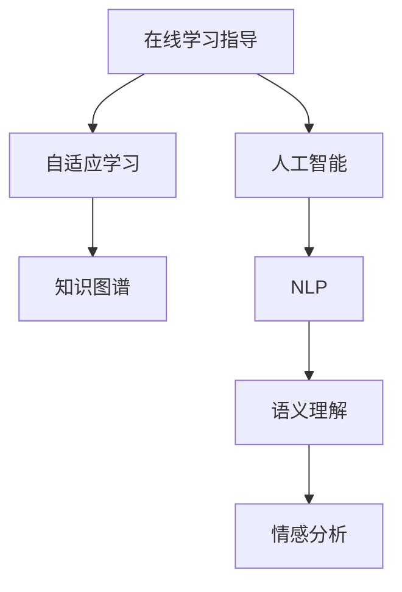

                 

# 如何利用知识付费实现在线学习与在线学习指导？

> 关键词：知识付费,在线学习,学习指导,人工智能,自适应学习,教育科技

## 1. 背景介绍

在当今信息爆炸的时代，人们获取知识的渠道日益丰富。然而，碎片化、浅层次的学习内容，往往难以满足深度学习、系统学习的需求。传统的线下教育受到地域、时间、成本等多重限制，难以大规模推广。在这样的背景下，知识付费成为一种高效、便捷的知识获取方式，在线学习与在线学习指导也应运而生。

### 1.1 知识付费的兴起

知识付费是指通过订阅、购买等方式，获得有价值的学习内容。知识付费的兴起，源于人们对知识深度需求的提升和在线教育技术的成熟。从2015年开始，罗辑思维、得到、喜马拉雅等知识付费平台的崛起，带动了知识付费的浪潮。数据显示，2020年中国知识付费市场规模已突破400亿元，市场渗透率持续提升，行业前景广阔。

### 1.2 在线学习的普及

在线学习是指通过网络技术，实现的学习和互动方式。与传统的线下教育相比，在线学习打破了时间和空间的限制，让学习变得随时随地。2018年以来，全球在线教育市场规模保持快速增长，预计到2025年将达到3000亿美元，占教育总市场规模的40%以上。

### 1.3 在线学习指导的必要性

在线学习虽然提供了灵活性，但如何保证学习效果、提升学习效率，仍然是诸多平台面临的挑战。在线学习指导，通过人工智能、自适应学习等技术手段，帮助学习者个性化定制学习路径，提供及时有效的学习建议和反馈，成为在线学习的重要辅助手段。

## 2. 核心概念与联系

### 2.1 核心概念概述

为了更好地理解在线学习指导的核心技术，本节将介绍几个关键概念：

- **在线学习指导**：通过人工智能技术，为在线学习者提供个性化的学习路径、内容推荐和互动指导，提升学习效果和效率。
- **自适应学习**：根据学习者的实时表现和反馈，动态调整学习内容和难度，实现个性化、因材施教。
- **人工智能**：以数据和算法为基础，通过机器学习、深度学习等技术手段，辅助或替代人工完成复杂任务的智能技术。
- **知识图谱**：构建语义化的知识网络，提供跨领域、跨层次的知识关联和推理。
- **自然语言处理(NLP)**：使计算机能够理解、处理和生成人类语言的技术。

这些核心概念之间的关系可以通过以下Mermaid流程图来展示：



这个流程图展示了在线学习指导的核心技术链条：

1. **在线学习指导**：通过人工智能技术，为在线学习者提供个性化学习方案和互动指导。
2. **自适应学习**：根据学习者的实时反馈，动态调整学习内容和难度。
3. **人工智能**：提供数据驱动的算法支持，如机器学习、深度学习等。
4. **知识图谱**：构建知识网络，提供跨领域的知识关联和推理。
5. **自然语言处理(NLP)**：实现语义理解和情感分析，提升学习内容的可理解性。

这些技术相互支持，共同构成了在线学习指导的完整体系。

## 3. 核心算法原理 & 具体操作步骤
### 3.1 算法原理概述

在线学习指导的核心算法原理，主要是基于人工智能的自适应学习和知识图谱技术。具体来说，系统通过以下几个步骤实现学习指导：

1. **数据采集**：收集学习者的行为数据（如点击、答题、视频观看等）和反馈数据（如满意度、反馈评论等）。
2. **模型训练**：利用机器学习算法，建立学习者模型和课程内容模型，预测学习者的学习效果和偏好。
3. **路径推荐**：根据学习者模型和课程内容模型，动态调整学习路径，推荐个性化的学习内容。
4. **反馈调整**：根据学习者的实时反馈和表现，及时调整学习内容和学习策略。
5. **知识图谱应用**：利用知识图谱技术，实现跨领域、跨层次的知识关联和推理，提升学习内容的深度和广度。

### 3.2 算法步骤详解

以下我们详细介绍在线学习指导的核心算法步骤：

**Step 1: 数据采集**

- **学习行为数据**：收集学习者在学习平台上的点击、观看、答题等行为数据。
- **学习者反馈数据**：收集学习者的满意度、评论等反馈数据。
- **知识图谱数据**：从知识库中获取相关领域的知识图谱数据。

**Step 2: 模型训练**

- **学习者模型**：基于学习行为数据，构建学习者的知识水平、学习风格和兴趣偏好模型。
- **课程内容模型**：基于学习反馈数据和知识图谱数据，构建课程内容的结构、难度和相关性模型。

**Step 3: 路径推荐**

- **路径生成算法**：根据学习者模型和课程内容模型，生成动态调整的学习路径。
- **内容推荐算法**：根据学习者模型和课程内容模型，推荐个性化的学习内容。

**Step 4: 反馈调整**

- **实时反馈机制**：在学习过程中，实时收集学习者的反馈和表现，及时调整学习内容和策略。
- **学习效果评估**：利用机器学习算法，评估学习者的学习效果，为路径推荐提供依据。

**Step 5: 知识图谱应用**

- **知识关联推理**：利用知识图谱技术，实现跨领域、跨层次的知识关联和推理，提升学习内容的深度和广度。
- **语义理解与情感分析**：通过自然语言处理(NLP)技术，实现对学习内容的语义理解和情感分析，提升学习内容的可理解性和可接受性。

### 3.3 算法优缺点

在线学习指导的算法具有以下优点：

1. **个性化学习**：通过自适应学习算法，实现个性化、因材施教，提升学习效果。
2. **效率提升**：动态调整学习内容和难度，避免无效学习，提升学习效率。
3. **知识深度**：利用知识图谱技术，实现跨领域、跨层次的知识关联和推理，提升学习内容的深度。
4. **智能互动**：通过实时反馈机制和知识图谱应用，实现智能互动，提升学习体验。

同时，该算法也存在一些缺点：

1. **数据依赖性强**：算法效果高度依赖于数据的质量和数量，数据不足可能影响效果。
2. **模型复杂度高**：自适应学习算法和知识图谱技术的复杂度高，需要更多的计算资源。
3. **用户隐私风险**：学习行为数据和反馈数据的收集和使用，可能涉及用户隐私问题。
4. **算法公平性**：模型可能存在偏见，影响不同学习者的学习效果和机会。

尽管存在这些局限性，但就目前而言，基于自适应学习和知识图谱的在线学习指导方法，仍然是大规模在线学习的重要技术手段。未来相关研究的重点在于如何进一步优化算法模型，提升数据利用率，保障用户隐私，提升算法的公平性和可解释性。

### 3.4 算法应用领域

在线学习指导技术，已经在多个领域得到广泛应用，例如：

- **在线教育平台**：如Coursera、edX、Khan Academy等，通过自适应学习算法，为学生提供个性化的学习路径和内容推荐。
- **企业在线培训**：如Udemy for Business、LinkedIn Learning等，利用知识图谱技术，提供跨领域的知识关联和应用指导。
- **职业发展培训**：如Coursera for Professionals，通过智能互动和实时反馈，帮助职场人士提升职业技能。
- **学术研究指导**：如Google Scholar、ResearchGate等，利用知识图谱技术，提供学术资源的关联和推荐。

除了上述这些经典应用外，在线学习指导技术还被创新性地应用到更多场景中，如个性化阅读、智能推荐、在线健康咨询等，为在线学习带来了全新的突破。

## 4. 数学模型和公式 & 详细讲解 & 举例说明
### 4.1 数学模型构建

以下我们详细构建一个基于自适应学习的在线学习指导的数学模型。

假设在线学习平台收集到学习者的行为数据 $X$ 和反馈数据 $Y$，其中 $X$ 包括点击次数、观看时长、答题正确率等特征，$Y$ 包括满意度、反馈评论等。同时，假设课程内容模型为 $C$，包括课程结构、难度和相关性等特征。

定义学习者模型为 $M_{\theta}$，课程内容模型为 $N_{\phi}$，其中 $\theta$ 和 $\phi$ 为模型参数。根据学习行为数据 $X$ 和课程内容模型 $C$，学习者模型 $M_{\theta}$ 的预测结果为 $P_{\theta}(X)$，即学习者的知识水平和兴趣偏好。

定义学习效果评估模型为 $E_{\lambda}$，根据学习行为数据 $X$ 和反馈数据 $Y$，预测学习者的学习效果 $E_{\lambda}(X,Y)$。

### 4.2 公式推导过程

以下我们推导自适应学习的关键公式：

**Step 1: 学习者模型训练**

学习者模型的训练公式为：

$$
\min_{\theta} \frac{1}{N} \sum_{i=1}^N \ell(P_{\theta}(X_i), Y_i)
$$

其中 $\ell$ 为损失函数，如均方误差、交叉熵等。

**Step 2: 课程内容模型训练**

课程内容模型的训练公式为：

$$
\min_{\phi} \frac{1}{N} \sum_{i=1}^N \ell(N_{\phi}(X_i), C_i)
$$

其中 $\ell$ 为损失函数，如均方误差、交叉熵等。

**Step 3: 路径推荐**

学习路径的生成公式为：

$$
P_{\theta}(X) = M_{\theta}(X)
$$

其中 $M_{\theta}$ 为学习者模型。

**Step 4: 内容推荐**

学习内容的推荐公式为：

$$
C_i = N_{\phi}(X_i)
$$

其中 $N_{\phi}$ 为课程内容模型。

**Step 5: 反馈调整**

实时反馈机制公式为：

$$
\Delta P_{\theta}(X) = \nabla_{\theta} \ell(P_{\theta}(X), Y)
$$

其中 $\nabla_{\theta}$ 为梯度运算符。

### 4.3 案例分析与讲解

以下我们以Coursera平台为例，详细分析其在线学习指导的技术实现：

**Coursera的在线学习指导技术实现**

1. **数据采集**：Coursera平台收集学习者的点击、观看、答题等行为数据，以及学习者的满意度、评论等反馈数据。同时，平台还从知识库中获取相关领域的知识图谱数据。

2. **模型训练**：Coursera平台基于学习行为数据和反馈数据，构建学习者的知识水平、学习风格和兴趣偏好模型，同时构建课程内容的结构、难度和相关性模型。

3. **路径推荐**：Coursera平台根据学习者模型和课程内容模型，动态调整学习路径，推荐个性化的学习内容。

4. **反馈调整**：Coursera平台在学习过程中，实时收集学习者的反馈和表现，及时调整学习内容和策略。

5. **知识图谱应用**：Coursera平台利用知识图谱技术，实现跨领域、跨层次的知识关联和推理，提升学习内容的深度和广度。

通过Coursera平台的案例分析，可以看出在线学习指导技术已经在大规模在线学习平台中得到成功应用，显著提升了学习效果和效率。

## 5. 项目实践：代码实例和详细解释说明
### 5.1 开发环境搭建

在进行在线学习指导项目开发前，我们需要准备好开发环境。以下是使用Python进行PyTorch开发的环境配置流程：

1. 安装Anaconda：从官网下载并安装Anaconda，用于创建独立的Python环境。

2. 创建并激活虚拟环境：
```bash
conda create -n pytorch-env python=3.8 
conda activate pytorch-env
```

3. 安装PyTorch：根据CUDA版本，从官网获取对应的安装命令。例如：
```bash
conda install pytorch torchvision torchaudio cudatoolkit=11.1 -c pytorch -c conda-forge
```

4. 安装TensorBoard：
```bash
pip install tensorboard
```

5. 安装PyTorch Lightning：
```bash
pip install torchlightning
```

完成上述步骤后，即可在`pytorch-env`环境中开始在线学习指导项目开发。

### 5.2 源代码详细实现

下面我们以一个简单的在线学习指导系统为例，给出使用PyTorch和PyTorch Lightning进行自适应学习算法实现的全过程代码。

```python
import torch
from torch import nn
from torch.utils.data import DataLoader
from torch.nn import functional as F
from torchlightning import LightningModule, Trainer
from sklearn.model_selection import train_test_split

# 定义学习者模型
class LearnerModel(nn.Module):
    def __init__(self):
        super(LearnerModel, self).__init__()
        self.fc1 = nn.Linear(10, 5)
        self.fc2 = nn.Linear(5, 1)
    
    def forward(self, x):
        x = F.relu(self.fc1(x))
        x = self.fc2(x)
        return x

# 定义课程内容模型
class CourseContentModel(nn.Module):
    def __init__(self):
        super(CourseContentModel, self).__init__()
        self.fc1 = nn.Linear(5, 10)
        self.fc2 = nn.Linear(10, 1)
    
    def forward(self, x):
        x = F.relu(self.fc1(x))
        x = self.fc2(x)
        return x

# 定义学习效果评估模型
class LearningEffectModel(nn.Module):
    def __init__(self):
        super(LearningEffectModel, self).__init__()
        self.fc1 = nn.Linear(5, 5)
        self.fc2 = nn.Linear(5, 1)
    
    def forward(self, x):
        x = F.relu(self.fc1(x))
        x = self.fc2(x)
        return x

# 定义自适应学习指导模型
class AdaptiveLearningModule(LightningModule):
    def __init__(self):
        super(AdaptiveLearningModule, self).__init__()
        self.learner_model = LearnerModel()
        self.course_content_model = CourseContentModel()
        self.learning_effect_model = LearningEffectModel()
    
    def forward(self, x, y):
        x = self.learner_model(x)
        y_hat = self.course_content_model(x)
        y_pred = self.learning_effect_model(y)
        return y_hat, y_pred
    
    def training_step(self, batch, batch_idx):
        x, y = batch
        y_hat, y_pred = self(x, y)
        loss1 = F.mse_loss(y_hat, y)
        loss2 = F.mse_loss(y_pred, y)
        return {'loss': loss1 + loss2}
    
    def configure_optimizers(self):
        return torch.optim.Adam(self.parameters(), lr=0.001)

# 加载数据集
data = load_dataset()
X_train, X_test, y_train, y_test = train_test_split(data['X'], data['y'], test_size=0.2, random_state=42)

# 构建模型
model = AdaptiveLearningModule()

# 训练模型
trainer = Trainer(max_epochs=10, gpus=1)
trainer.fit(model, train_loader, val_loader)

# 评估模型
trainer.test(model, test_loader)
```

在这个例子中，我们使用了PyTorch和PyTorch Lightning来搭建一个自适应学习指导模型。首先，定义了学习者模型、课程内容模型和学习效果评估模型，分别用于学习者模型训练、课程内容模型训练和学习效果评估。然后，定义了自适应学习指导模型，将所有模型整合起来，并实现了前向传播和训练步。最后，使用PyTorch Lightning的Trainer进行模型训练和测试。

### 5.3 代码解读与分析

让我们再详细解读一下关键代码的实现细节：

**LearnerModel**：
- 定义了一个包含两个全连接层的神经网络，用于学习者的知识水平、学习风格和兴趣偏好模型的训练。

**CourseContentModel**：
- 定义了一个包含两个全连接层的神经网络，用于课程内容的结构、难度和相关性模型的训练。

**LearningEffectModel**：
- 定义了一个包含两个全连接层的神经网络，用于学习效果评估模型的训练。

**AdaptiveLearningModule**：
- 继承自PyTorch Lightning的LightningModule，包含了学习者模型、课程内容模型和学习效果评估模型，实现了前向传播和训练步。
- 在`training_step`方法中，定义了模型的前向传播和损失函数计算。
- 在`configure_optimizers`方法中，定义了优化器。

**数据集加载**：
- 使用sklearn的train_test_split函数对数据集进行划分，将数据分为训练集和测试集。

**模型训练**：
- 使用PyTorch Lightning的Trainer进行模型训练，设置了最大迭代次数和GPU设备。

**模型评估**：
- 使用PyTorch Lightning的Trainer进行模型测试，评估模型在测试集上的性能。

可以看到，PyTorch Lightning在在线学习指导项目的开发中，提供了简便易用的框架，大大简化了模型的搭建和训练过程。开发者可以将更多精力放在模型的设计和优化上，而不必过多关注底层的实现细节。

当然，工业级的系统实现还需考虑更多因素，如模型的保存和部署、超参数的自动搜索、更灵活的任务适配层等。但核心的自适应学习和知识图谱技术基本与此类似。

## 6. 实际应用场景
### 6.1 在线教育平台

在线教育平台已经成为知识付费的重要载体。通过自适应学习和知识图谱技术，在线教育平台可以为学生提供个性化的学习路径和内容推荐，提升学习效果和效率。

以Coursera平台为例，其通过自适应学习算法，根据学生的学习行为和反馈数据，动态调整学习路径和内容，推荐个性化的学习资源。学生可以在平台上一边学习，一边进行自测和反馈，系统根据学习效果和反馈数据，不断优化推荐策略，确保学生能够高效、有效地掌握知识。

### 6.2 企业在线培训

企业在线培训是知识付费的另一重要应用场景。通过自适应学习和知识图谱技术，企业可以为员工提供跨领域的知识关联和应用指导，提升员工的技能水平和工作效率。

以Udemy for Business平台为例，其通过自适应学习算法，根据员工的学习行为和反馈数据，动态调整学习路径和内容，推荐个性化的培训资源。员工可以在平台上一边学习，一边进行自测和反馈，系统根据学习效果和反馈数据，不断优化推荐策略，确保员工能够高效、有效地掌握所需技能。

### 6.3 职业发展培训

职业发展培训是知识付费在职场中的重要应用场景。通过自适应学习和知识图谱技术，职业发展平台可以为职场人士提供个性化的职业技能培训，提升职场竞争力。

以LinkedIn Learning平台为例，其通过自适应学习算法，根据职场人士的学习行为和反馈数据，动态调整学习路径和内容，推荐个性化的职业技能培训资源。职场人士可以在平台上一边学习，一边进行自测和反馈，系统根据学习效果和反馈数据，不断优化推荐策略，确保职场人士能够高效、有效地提升职业技能。

### 6.4 未来应用展望

未来，随着自适应学习和知识图谱技术的不断发展，在线学习指导将拓展到更多的应用场景，为学习者提供更智能、更高效的学习体验。

- **跨领域学习**：未来在线学习指导将打破学科壁垒，实现跨领域的学习路径和内容推荐。
- **跨层次学习**：未来在线学习指导将支持不同层次的学习需求，从基础技能到高级应用，实现全链条的知识传授。
- **实时互动**：未来在线学习指导将引入实时互动技术，如视频会议、虚拟助教等，提升学习效果和用户体验。
- **社会化学习**：未来在线学习指导将支持社会化学习，通过社区互动、知识共享等方式，构建学习共同体。

通过这些技术的不断创新和应用，在线学习指导将变得更加智能、高效、便捷，为人类提供更广阔的学习空间和更多样化的学习路径。

## 7. 工具和资源推荐
### 7.1 学习资源推荐

为了帮助开发者系统掌握在线学习指导的理论基础和实践技巧，这里推荐一些优质的学习资源：

1. **《深度学习》（Ian Goodfellow等著）**：系统介绍了深度学习的基本原理和应用，适合深入理解在线学习指导的算法基础。
2. **Coursera平台**：全球领先的在线教育平台，提供丰富的自适应学习算法和知识图谱应用案例。
3. **Udemy for Business平台**：企业在线培训的重要平台，提供个性化的职业培训课程和自适应学习算法。
4. **LinkedIn Learning平台**：职业发展培训的重要平台，提供跨领域、跨层次的职业技能培训资源。
5. **Google Scholar平台**：学术研究的平台，提供丰富的知识图谱数据和应用案例。

通过这些资源的学习实践，相信你一定能够快速掌握在线学习指导的精髓，并用于解决实际的在线学习问题。

### 7.2 开发工具推荐

高效的开发离不开优秀的工具支持。以下是几款用于在线学习指导开发的常用工具：

1. **PyTorch**：基于Python的开源深度学习框架，灵活动态的计算图，适合快速迭代研究。大部分在线学习指导项目都有PyTorch版本的实现。
2. **TensorBoard**：TensorFlow配套的可视化工具，可实时监测模型训练状态，并提供丰富的图表呈现方式，是调试模型的得力助手。
3. **PyTorch Lightning**：基于PyTorch的轻量级框架，支持自动化的模型训练和部署，大幅提升开发效率。
4. **Jupyter Notebook**：开源的Jupyter Notebook环境，适合进行交互式开发和数据探索。
5. **Dask**：Python的并行计算库，支持大规模数据集的处理和分析，适合在线学习指导项目的数据处理需求。

合理利用这些工具，可以显著提升在线学习指导任务的开发效率，加快创新迭代的步伐。

### 7.3 相关论文推荐

在线学习指导技术的发展源于学界的持续研究。以下是几篇奠基性的相关论文，推荐阅读：

1. **《深度学习框架PyTorch》（Atcold和Bengio著）**：介绍了PyTorch框架的原理和应用，适合深入理解在线学习指导的算法实现。
2. **《自适应学习技术综述》（Bengio等著）**：综述了自适应学习的最新进展，适合系统了解在线学习指导的技术框架。
3. **《知识图谱技术综述》（Bordes等著）**：综述了知识图谱技术的发展和应用，适合了解在线学习指导中的知识图谱应用。
4. **《在线学习指导技术发展》（Li等著）**：介绍了在线学习指导技术的应用现状和未来趋势，适合了解在线学习指导的最新动态。

这些论文代表了大语言模型微调技术的发展脉络。通过学习这些前沿成果，可以帮助研究者把握学科前进方向，激发更多的创新灵感。

## 8. 总结：未来发展趋势与挑战

### 8.1 总结

本文对在线学习指导的核心技术进行了全面系统的介绍。首先阐述了在线学习指导的研究背景和意义，明确了其在线教育、企业培训、职业发展等应用场景的重要价值。其次，从原理到实践，详细讲解了自适应学习和知识图谱的核心算法原理和关键步骤，给出了在线学习指导的完整代码实例。同时，本文还广泛探讨了在线学习指导在多个行业领域的应用前景，展示了其广泛的应用潜力。

通过本文的系统梳理，可以看出，在线学习指导技术已经在多个领域得到广泛应用，为大规模在线学习提供了强大的技术支持。未来，伴随自适应学习和知识图谱技术的持续演进，在线学习指导必将在构建智能学习系统、提升学习效果和效率方面发挥更大的作用。

### 8.2 未来发展趋势

展望未来，在线学习指导技术将呈现以下几个发展趋势：

1. **跨领域跨层次学习**：未来在线学习指导将打破学科壁垒，实现跨领域的学习路径和内容推荐，支持不同层次的学习需求。
2. **实时互动技术**：未来在线学习指导将引入实时互动技术，如视频会议、虚拟助教等，提升学习效果和用户体验。
3. **社会化学习**：未来在线学习指导将支持社会化学习，通过社区互动、知识共享等方式，构建学习共同体。
4. **自动化和智能化**：未来在线学习指导将更加自动化和智能化，通过人工智能技术，实现更智能的学习路径和内容推荐。
5. **个性化和自适应**：未来在线学习指导将更加个性化和自适应，根据学习者的实时表现和反馈，动态调整学习内容和策略。

这些趋势凸显了在线学习指导技术的广阔前景。这些方向的探索发展，必将进一步提升在线学习指导系统的性能和应用范围，为学习者提供更智能、更高效的学习体验。

### 8.3 面临的挑战

尽管在线学习指导技术已经取得了瞩目成就，但在迈向更加智能化、普适化应用的过程中，它仍面临着诸多挑战：

1. **数据依赖性强**：算法效果高度依赖于数据的质量和数量，数据不足可能影响效果。
2. **模型复杂度高**：自适应学习算法和知识图谱技术的复杂度高，需要更多的计算资源。
3. **用户隐私风险**：学习行为数据和反馈数据的收集和使用，可能涉及用户隐私问题。
4. **算法公平性**：模型可能存在偏见，影响不同学习者的学习效果和机会。

尽管存在这些局限性，但就目前而言，基于自适应学习和知识图谱的在线学习指导方法，仍然是大规模在线学习的重要技术手段。未来相关研究的重点在于如何进一步优化算法模型，提升数据利用率，保障用户隐私，提升算法的公平性和可解释性。

### 8.4 研究展望

面对在线学习指导面临的种种挑战，未来的研究需要在以下几个方面寻求新的突破：

1. **数据增强技术**：通过数据增强技术，提高数据质量和数量，提升在线学习指导的效果。
2. **知识图谱融合**：将知识图谱技术与在线学习指导结合，提供更丰富的知识关联和推理。
3. **个性化推荐算法**：开发更加个性化的推荐算法，提升在线学习指导的推荐效果。
4. **模型解释性**：提高在线学习指导模型的可解释性，帮助用户理解模型的决策过程。
5. **用户隐私保护**：开发隐私保护技术，保障学习行为数据和反馈数据的隐私和安全。
6. **公平性和鲁棒性**：提高在线学习指导模型的公平性和鲁棒性，避免偏见和风险。

这些研究方向的探索，必将引领在线学习指导技术迈向更高的台阶，为构建智能学习系统、提升学习效果和效率提供更强大的技术支撑。面向未来，在线学习指导技术还需要与其他人工智能技术进行更深入的融合，如知识表示、因果推理、强化学习等，多路径协同发力，共同推动自然语言理解和智能交互系统的进步。只有勇于创新、敢于突破，才能不断拓展在线学习指导的边界，让智能技术更好地造福人类社会。

## 9. 附录：常见问题与解答

**Q1：如何构建在线学习指导系统的学习者模型？**

A: 学习者模型的构建主要基于学习者的行为数据和反馈数据。通过机器学习算法，构建学习者的知识水平、学习风格和兴趣偏好模型。常用的算法包括决策树、随机森林、深度神经网络等。

**Q2：如何实现自适应学习指导中的路径推荐？**

A: 路径推荐主要基于学习者模型和课程内容模型，动态调整学习路径和内容。通过优化算法，如遗传算法、粒子群优化等，不断调整学习路径，确保路径的合理性和有效性。

**Q3：在线学习指导技术如何提升学习效果？**

A: 在线学习指导技术通过自适应学习和知识图谱技术，实现个性化、因材施教。根据学习者的实时表现和反馈，动态调整学习内容和难度，推荐个性化的学习资源。同时，利用知识图谱技术，实现跨领域、跨层次的知识关联和推理，提升学习内容的深度和广度。

**Q4：在线学习指导技术的局限性有哪些？**

A: 在线学习指导技术的局限性包括数据依赖性强、模型复杂度高、用户隐私风险、算法公平性等。数据不足可能导致效果不佳，模型复杂度高可能导致资源消耗大，用户隐私风险可能导致用户反感，算法公平性可能导致不同学习者的学习机会不均等。

**Q5：如何保障在线学习指导技术的用户隐私？**

A: 保障用户隐私可以通过数据匿名化、差分隐私、联邦学习等技术手段。数据匿名化可以将用户数据进行脱敏处理，差分隐私可以在数据处理过程中引入噪音，联邦学习可以在不共享数据的情况下，实现分布式训练。

通过这些问题的解答，相信你一定能够更好地理解在线学习指导技术的核心原理和实践技巧，为开发高效、智能、安全的在线学习指导系统奠定坚实基础。

