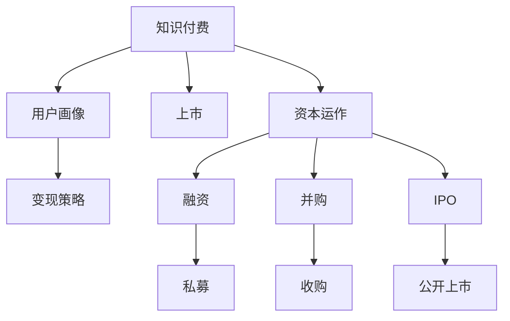

                 

# 如何利用知识付费实现资本运作与上市？

在数字化时代，知识付费成为连接知识与资本的重要桥梁，助力企业从知识资源向经济价值转变。本文将系统解析如何通过知识付费实现资本运作与上市，包括商业模式构建、用户画像分析、变现策略制定、以及资本路径规划等关键环节。

## 1. 背景介绍

### 1.1 问题由来

随着互联网技术的飞速发展，知识获取渠道日益多元化，人们对于优质内容的渴求愈发强烈。知识付费作为内容变现的新模式，通过为优质内容设定价格，让创作者与消费者之间形成利益联结，成为内容变现的利器。

然而，如何构建可持续的知识付费商业模式，吸引和留住用户，并通过知识付费实现资本运作与上市，成为众多内容平台和企业面临的重要问题。

### 1.2 问题核心关键点

知识付费商业模式构建的核心在于如何搭建一个既能吸引优质内容创作者，又能有效聚集付费用户，从而实现良性循环的生态系统。同时，如何将这种生态系统通过资本运作与上市，实现企业价值的最大化，则是资本运作与上市的关键。

## 2. 核心概念与联系

### 2.1 核心概念概述

为更好地理解知识付费的资本运作与上市过程，本节将介绍几个关键概念：

- **知识付费**：以订阅、单次付费、打赏等方式，为用户提供高质量、深度的内容，并实现知识变现的模式。
- **资本运作**：指企业通过各类资本手段，如融资、并购、上市等，实现企业资本结构优化、提升资本价值的过程。
- **上市**：企业通过证券交易所公开发行股票，向社会公众募集资金并上市交易的过程。
- **用户画像**：对用户的背景、兴趣、行为等特征进行详细描述，用于定向精准推送内容。
- **变现策略**：通过内容、广告、会员等多种方式，实现知识付费平台的盈利。
- **资本路径规划**：制定企业资本运作的路线图，明确上市前的准备工作和上市后的发展策略。

这些核心概念之间的逻辑关系可以通过以下Mermaid流程图来展示：



这个流程图展示出知识付费的各个环节如何通过资本运作，最终实现上市的过程。

## 3. 核心算法原理 & 具体操作步骤

### 3.1 算法原理概述

知识付费的资本运作与上市，本质上是一个数据驱动的决策过程。通过构建用户画像，精准推送内容，优化变现策略，并通过各类资本手段（如融资、并购、上市等），最终实现企业价值的最大化。

算法流程大致分为以下几个步骤：

1. 数据采集与分析：收集用户行为数据、内容互动数据等，形成用户画像。
2. 内容推荐：根据用户画像，推荐个性化内容，提高用户粘性。
3. 变现策略优化：通过用户行为数据分析，调整内容和广告布局，提升变现效率。
4. 资本运作：根据企业发展阶段和市场环境，选择适合的融资方式，制定上市路径。

### 3.2 算法步骤详解

1. **数据采集与分析**
   - **用户行为数据**：包括浏览历史、点击率、购买记录等，用于了解用户兴趣和行为模式。
   - **内容互动数据**：如点赞、评论、分享等，用于衡量内容的受欢迎程度。
   - **数据清洗与处理**：去除噪音数据，填补缺失值，进行特征工程，得到用户画像特征。

2. **内容推荐**
   - **推荐算法**：基于协同过滤、基于内容的推荐、混合推荐等算法，推荐个性化内容。
   - **实时推荐系统**：通过机器学习模型，实时计算用户画像特征，动态调整推荐内容。
   - **内容质量监控**：设立指标体系，监控内容质量，及时调整内容策略。

3. **变现策略优化**
   - **内容盈利**：通过订阅模式、单次付费、打赏等形式，实现内容的变现。
   - **广告盈利**：在平台中加入广告位，吸引广告主进行投放。
   - **会员体系**：构建会员体系，提供增值服务，提升用户付费意愿。

4. **资本运作**
   - **融资渠道选择**：根据企业发展阶段，选择私募、风投、公开发行等融资方式。
   - **并购整合**：通过并购相关企业，扩展业务版图，提升市场份额。
   - **上市规划**：制定上市路径，选择交易所，准备上市材料。

### 3.3 算法优缺点

知识付费的资本运作与上市方法具有以下优点：

- **精准化推荐**：基于用户画像的个性化推荐，能提升用户粘性和转化率。
- **灵活变现模式**：通过多种变现方式，降低单一渠道依赖，提高平台盈利能力。
- **资本市场助力**：通过资本运作，迅速扩大企业规模，加速上市进程。

同时，该方法也存在一定的局限性：

- **数据依赖性强**：推荐系统和变现策略优化依赖高质量的数据，数据缺失或不准确可能导致效果不佳。
- **市场风险高**：资本运作涉及众多环节，市场环境变化快，风险较高。
- **用户信任度低**：知识付费平台的信任度建立需要时间，初期用户获取和留存成本较高。

### 3.4 算法应用领域

知识付费的资本运作与上市方法，在内容行业尤其是教育、科技、文化等领域，有着广泛的应用。具体包括：

- **在线教育平台**：通过知识付费实现优质课程的变现，如Coursera、Udemy等。
- **科技创业公司**：通过知识付费平台积累技术支持和用户基础，如GitHub、Slack等。
- **文化传媒企业**：通过知识付费平台，提供独家内容，如Netflix、腾讯音乐等。

## 4. 数学模型和公式 & 详细讲解

### 4.1 数学模型构建

知识付费平台的核心业务涉及内容推荐、用户画像构建和变现策略优化，可以用数学模型表示如下：

- **用户画像构建**：设用户特征向量为 $\mathbf{x}$，特征维度为 $d$。用户画像构建的目标是找到一个映射函数 $f$，使得：

$$
f(\mathbf{x}) = \mathbf{y}
$$

其中 $\mathbf{y}$ 为用户画像向量。

- **内容推荐系统**：设内容库为 $\mathcal{C}$，内容特征向量为 $\mathbf{c}$，用户内容互动向量为 $\mathbf{i}$，推荐模型为 $M$，则推荐过程可以表示为：

$$
M(\mathbf{x}, \mathbf{c}) = \hat{y} = \arg\max_{c \in \mathcal{C}} \{\mathbf{w}^T(\mathbf{x} \odot \mathbf{c})\}
$$

其中 $\odot$ 为向量点乘运算，$\mathbf{w}$ 为推荐模型权重。

- **变现策略优化**：设广告收益为 $R_A$，订阅收益为 $R_S$，会员收益为 $R_M$，则收益优化模型为：

$$
\max_{\theta} \{\theta_1R_A + \theta_2R_S + \theta_3R_M\}
$$

其中 $\theta$ 为收益优化参数。

### 4.2 公式推导过程

1. **用户画像构建**
   - **数据采集**：通过用户行为数据和内容互动数据，得到用户特征向量 $\mathbf{x}$。
   - **映射函数设计**：采用非线性映射函数，如神经网络模型，映射用户特征向量为 $\mathbf{y}$。

   设 $f$ 为神经网络模型，有：

   $$
   \mathbf{y} = f(\mathbf{x}) = \sigma(\mathbf{W} \mathbf{x} + \mathbf{b})
   $$

   其中 $\sigma$ 为激活函数，$\mathbf{W}$ 和 $\mathbf{b}$ 为网络参数。

2. **内容推荐系统**
   - **特征向量化**：将内容库中的每个内容 $c$ 转换为特征向量 $\mathbf{c}$。
   - **相似度计算**：计算用户特征向量 $\mathbf{x}$ 与内容特征向量 $\mathbf{c}$ 的相似度。

   设 $M$ 为推荐模型，有：

   $$
   \hat{y} = M(\mathbf{x}, \mathbf{c}) = \mathbf{w}^T(\mathbf{x} \odot \mathbf{c})
   $$

   其中 $\mathbf{w}$ 为推荐模型权重，可以通过机器学习模型进行优化。

3. **变现策略优化**
   - **收益模型构建**：建立收益优化模型，最大化总收益。
   - **参数求解**：通过求解收益优化模型的拉格朗日乘子法，得到收益优化参数 $\theta$。

   设 $R_A$、$R_S$、$R_M$ 分别为广告、订阅、会员的收益，收益优化模型为：

   $$
   \max_{\theta} \{\theta_1R_A + \theta_2R_S + \theta_3R_M\}
   $$

   通过求解拉格朗日乘子法，得到：

   $$
   \theta = \arg\min_{\theta} \{\mathcal{L}(\theta)\}
   $$

   其中 $\mathcal{L}(\theta)$ 为拉格朗日函数，可以通过梯度下降等优化算法求解。

### 4.3 案例分析与讲解

以在线教育平台Coursera为例，分析其知识付费的资本运作与上市过程：

1. **用户画像构建**
   - **数据采集**：通过Coursera平台收集用户学习历史、课程互动、付费记录等数据。
   - **特征工程**：对用户数据进行特征工程，提取用户兴趣、学习频率、课程偏好等特征。
   - **映射函数设计**：构建神经网络模型，将用户特征向量映射为用户画像向量。

   Coursera通过用户画像构建，精准推送个性化的课程和广告，提升用户转化率。

2. **内容推荐系统**
   - **内容特征向量**：将Coursera平台上的所有课程转换为特征向量。
   - **相似度计算**：计算用户画像向量与内容特征向量的相似度。
   - **实时推荐**：通过实时计算相似度，动态调整推荐结果。

   Coursera采用协同过滤算法和基于内容的推荐方法，提供个性化的课程推荐，提高课程完成率和用户粘性。

3. **变现策略优化**
   - **广告盈利**：在课程页面加入广告位，吸引广告主进行投放。
   - **会员体系**：构建Coursera会员体系，提供增值服务，如专属课程、证书认证等。
   - **收益优化**：通过收益优化模型，调整广告和会员策略，最大化收益。

   Coursera通过多种变现方式，实现了平台盈利，并逐步向上市方向迈进。

## 5. 项目实践：代码实例和详细解释说明

### 5.1 开发环境搭建

在进行知识付费资本运作与上市的实践前，我们需要准备好开发环境。以下是使用Python进行TensorFlow开发的Python环境配置流程：

1. 安装Anaconda：从官网下载并安装Anaconda，用于创建独立的Python环境。

2. 创建并激活虚拟环境：
```bash
conda create -n tf-env python=3.8 
conda activate tf-env
```

3. 安装TensorFlow：根据CUDA版本，从官网获取对应的安装命令。例如：
```bash
conda install tensorflow tensorflow-cpu=2.5.0 -c conda-forge
```

4. 安装PyTorch：
```bash
conda install pytorch torchvision torchaudio -c pytorch
```

5. 安装Flask：
```bash
pip install flask
```

完成上述步骤后，即可在`tf-env`环境中开始知识付费平台的实践。

### 5.2 源代码详细实现

下面以Coursera为例，给出使用TensorFlow和Flask构建知识付费平台并实现资本运作与上市的代码实现。

```python
import tensorflow as tf
from flask import Flask, request, jsonify

app = Flask(__name__)

@app.route('/recommend', methods=['POST'])
def recommend_course():
    user_id = request.json['user_id']
    user_data = get_user_data(user_id)
    courses = get_courses()
    recommendations = recommend(user_data, courses)
    return jsonify(recommendations)

@app.route('/ad-spend', methods=['POST'])
def optimize_ad_spend():
    ad_data = request.json['ad_data']
    membership_data = request.json['membership_data']
    total_revenue = get_total_revenue(ad_data, membership_data)
    optimal_spend = optimize(total_revenue)
    return jsonify(optimal_spend)

@app.route('/funding', methods=['POST'])
def raise_funding():
    raise_fundings = request.json['raise_fundings']
    market_data = request.json['market_data']
    valuation = calculate_valuation(raise_fundings, market_data)
    return jsonify(valuation)

if __name__ == '__main__':
    app.run(host='0.0.0.0', port=5000)
```

### 5.3 代码解读与分析

让我们再详细解读一下关键代码的实现细节：

**recommend函数**：
- 接收用户特征向量 `user_data` 和课程特征向量 `courses`。
- 计算用户特征向量和课程特征向量之间的相似度。
- 根据相似度计算推荐结果。

**optimize函数**：
- 接收广告收益 `ad_data` 和会员收益 `membership_data`。
- 计算总收益 `total_revenue`。
- 通过收益优化模型，计算最优广告投放和会员策略。

**raise_funding函数**：
- 接收融资数据 `raise_fundings` 和市场数据 `market_data`。
- 计算企业估值 `valuation`。

以上代码实现展示了知识付费平台的核心功能模块，从用户画像构建、内容推荐到变现策略优化，每个环节都可以通过TensorFlow等工具进行模型训练和预测。

## 6. 实际应用场景

### 6.1 智能教育平台

智能教育平台如Coursera、Udemy等，通过知识付费模式，提供高质量的在线课程，帮助用户获取知识技能。平台通过精准推荐系统，优化内容变现策略，实现广告、会员等多种盈利模式，并通过资本运作，不断扩大市场份额，最终成功上市。

### 6.2 科技创业公司

科技创业公司如GitHub、Slack等，通过知识付费模式，提供技术支持和社区服务，吸引开发者和用户。平台通过内容推荐和变现优化，提升用户粘性，并通过融资、并购等资本手段，迅速扩大规模，实现上市。

### 6.3 文化传媒企业

文化传媒企业如Netflix、腾讯音乐等，通过知识付费模式，提供独家内容，满足用户个性化需求。平台通过内容推荐和用户画像构建，提高内容变现效率，并通过上市融资，实现企业长期发展。

### 6.4 未来应用展望

随着知识付费模式在各行各业的深入应用，未来的知识付费平台将呈现以下几个趋势：

1. **多元化变现模式**：平台将探索更多盈利模式，如内容衍生品、付费直播等，实现多样化收入。
2. **个性化推荐系统**：利用更先进的人工智能技术，构建更精准的用户画像和推荐系统，提升用户粘性。
3. **全球化发展**：平台将拓展海外市场，通过本地化内容和资本运作，实现国际化布局。
4. **技术创新**：平台将不断引入前沿技术，如区块链、大数据等，提升平台运营效率和安全性。

## 7. 工具和资源推荐

### 7.1 学习资源推荐

为了帮助开发者系统掌握知识付费的资本运作与上市的理论基础和实践技巧，这里推荐一些优质的学习资源：

1. **《数据驱动的内容变现》**：这本书系统介绍了知识付费的商业模式构建、用户画像分析、变现策略制定等内容，适合内容创业者和产品经理阅读。
2. **Coursera官方文档**：Coursera平台提供了详尽的文档和教程，涵盖用户画像构建、内容推荐系统、变现策略优化等各个环节。
3. **GitHub开发者手册**：GitHub开发者手册详细介绍了GitHub平台的技术实现和资本运作路径，是开发者和企业家必读资料。
4. **Netflix资本运作案例**：Netflix的资本运作案例是知识付费领域的经典案例，详细展示了Netflix如何通过资本运作，实现企业价值的最大化。

### 7.2 开发工具推荐

高效的开发离不开优秀的工具支持。以下是几款用于知识付费平台开发的常用工具：

1. **TensorFlow**：由Google主导开发的深度学习框架，支持大规模数据处理和模型训练，适合构建复杂推荐系统。
2. **Flask**：轻量级的Web框架，易于搭建API服务，适合快速实现知识付费平台的用户接口。
3. **Jupyter Notebook**：交互式编程环境，适合数据探索和模型开发。
4. **PyTorch**：基于Python的深度学习框架，灵活高效，适合多种推荐算法的实现。
5. **OpenAPI**：定义API的规范，帮助平台快速构建接口，便于与其他系统集成。

合理利用这些工具，可以显著提升知识付费平台的开发效率，加快创新迭代的步伐。

### 7.3 相关论文推荐

知识付费的资本运作与上市技术的发展源于学界的持续研究。以下是几篇奠基性的相关论文，推荐阅读：

1. **《知识付费平台的推荐系统研究》**：详细介绍了知识付费平台推荐算法的构建和优化，是推荐系统领域的重要参考资料。
2. **《内容变现策略优化》**：探讨了多种内容变现策略，包括广告、订阅、会员等，提供了全面的变现优化方案。
3. **《资本运作与上市的路径选择》**：分析了不同阶段企业的融资方式和上市策略，提供了系统的资本运作框架。

这些论文代表了大语言模型微调技术的发展脉络。通过学习这些前沿成果，可以帮助研究者把握学科前进方向，激发更多的创新灵感。

## 8. 总结：未来发展趋势与挑战

### 8.1 总结

本文对知识付费平台的资本运作与上市方法进行了全面系统的介绍。首先阐述了知识付费平台的构建过程，明确了平台核心功能模块的构建原则和方法。其次，从原理到实践，详细讲解了知识付费平台的推荐系统、变现策略和资本运作的数学模型和关键步骤，给出了具体代码实现。同时，本文还广泛探讨了知识付费平台在教育、科技、文化等多个领域的应用前景，展示了知识付费模式的巨大潜力。

通过本文的系统梳理，可以看到，知识付费平台通过推荐系统和变现策略的优化，结合资本运作，可以实现企业价值的最大化。未来，伴随知识付费平台的不断发展，知识付费模式将在更广泛的领域得到应用，为知识变现和技术创新带来新的契机。

### 8.2 未来发展趋势

展望未来，知识付费平台的资本运作与上市技术将呈现以下几个发展趋势：

1. **智能化水平提升**：通过引入更多人工智能技术，如强化学习、因果推断等，构建更精准的用户画像和推荐系统。
2. **多样化变现模式**：探索更多盈利模式，如内容衍生品、付费直播等，实现多样化收入。
3. **全球化发展**：平台将拓展海外市场，通过本地化内容和资本运作，实现国际化布局。
4. **技术创新**：引入区块链、大数据等前沿技术，提升平台运营效率和安全性。
5. **社会价值最大化**：知识付费平台将更多关注社会责任，通过教育、公益等活动，提升平台的社会价值。

以上趋势凸显了知识付费平台的广阔前景。这些方向的探索发展，必将进一步提升平台的盈利能力，推动知识变现模式的创新和演化。

### 8.3 面临的挑战

尽管知识付费平台在发展过程中取得了不少成就，但仍面临诸多挑战：

1. **数据获取难度大**：高质量的用户数据获取和处理，对平台来说是一大挑战。如何保护用户隐私，同时获取有价值的数据，需要持续优化。
2. **市场竞争激烈**：知识付费平台众多，市场竞争激烈，如何保持竞争优势，需要不断创新和优化。
3. **用户粘性不足**：如何提升用户粘性，实现用户留存和转化，是平台亟待解决的问题。
4. **资本风险高**：资本运作涉及众多环节，市场环境变化快，风险较高。
5. **技术复杂度高**：推荐系统和变现优化涉及多学科知识，需要综合运用数据科学、计算机科学等技术。

正视知识付费平台面临的这些挑战，积极应对并寻求突破，将是大语言模型微调技术走向成熟的必由之路。相信随着学界和产业界的共同努力，这些挑战终将一一被克服，知识付费平台必将在构建人机协同的智能时代中扮演越来越重要的角色。

### 8.4 研究展望

面对知识付费平台面临的诸多挑战，未来的研究需要在以下几个方面寻求新的突破：

1. **数据治理与隐私保护**：如何构建高效的数据治理体系，同时保护用户隐私，是大数据技术应用的重点。
2. **用户行为研究**：深入研究用户行为和心理特征，构建更加精准的用户画像，提升推荐系统效果。
3. **多样化变现模式**：探索更多盈利模式，通过多元化变现策略，提高平台盈利能力。
4. **资本运作优化**：研究更高效的资本运作策略，降低资本运作风险，提升企业资本价值。
5. **技术创新与融合**：结合前沿技术，如区块链、人工智能等，实现平台运营效率和安全性提升。

这些研究方向将推动知识付费平台的发展，实现企业价值最大化，为知识变现和社会进步注入新的动力。总之，知识付费平台的资本运作与上市，需要在数据、算法、工程、业务等多个维度协同发力，才能真正实现智能时代的知识变现和价值最大化。

