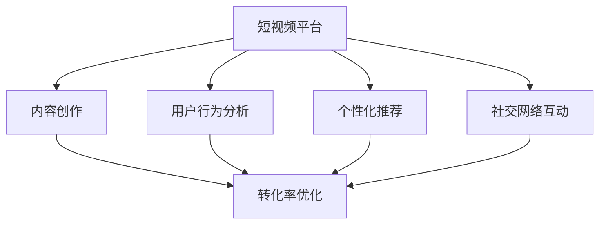

                 

# 如何利用短视频平台增加课程销量

> 关键词：短视频平台、内容营销、数据分析、用户行为、个性化推荐、社交网络、转化率优化

## 1. 背景介绍

在知识经济快速发展的今天，在线教育已成为大众获取知识、提升技能的重要途径。随着互联网技术、特别是短视频平台的发展，如何有效利用这些平台提升课程销量，成为在线教育机构和课程开发者面临的重大课题。短视频平台凭借其低门槛、高互动性、内容丰富等特点，成为教育内容传播的重要渠道。本文将从背景介绍入手，探讨如何利用短视频平台增加课程销量，具体包括内容创作、用户行为分析、个性化推荐、社交网络互动等关键环节。

## 2. 核心概念与联系

### 2.1 核心概念概述

在探讨如何利用短视频平台增加课程销量之前，我们首先需要明确一些核心概念：

- **短视频平台**：指的是以短视频为主要内容形式的网络平台，如抖音、快手、B站等，具有高曝光率、强互动性、低门槛等特点。
- **内容营销**：通过短视频等形式进行内容创作与传播，以吸引用户注意、提升品牌知名度、促进产品或服务销售。
- **用户行为分析**：通过数据分析工具对用户行为进行跟踪和分析，以了解用户偏好、优化用户体验、提升用户转化率。
- **个性化推荐**：根据用户历史行为、兴趣偏好等信息，进行智能推荐，提升用户粘性，促进销售。
- **社交网络互动**：利用社交网络效应，通过用户之间的互动和推荐，扩大内容传播范围，提升课程曝光度。
- **转化率优化**：通过改进营销策略、优化用户体验等手段，提升用户从访问到购买的比例。

### 2.2 核心概念原理和架构的 Mermaid 流程图



以上流程图示意了短视频平台在课程销售中的各个环节的相互关系。内容创作是基础，用户行为分析提供数据支持，个性化推荐提升用户体验，社交网络互动扩大影响力，而转化率优化则直接作用于用户行为转化。

## 3. 核心算法原理 & 具体操作步骤

### 3.1 算法原理概述

利用短视频平台增加课程销量的核心在于将内容与用户需求、行为数据相结合，通过算法优化实现精准营销。具体流程如下：

1. **内容创作**：创作有吸引力、与课程内容相关性高的短视频。
2. **用户行为分析**：利用数据分析工具，获取用户观看时长、互动行为等数据，了解用户兴趣和需求。
3. **个性化推荐**：基于用户行为分析结果，通过推荐算法，精准推送适合用户的课程内容。
4. **社交网络互动**：鼓励用户在短视频平台进行互动和分享，借助社交网络效应扩大课程传播范围。
5. **转化率优化**：通过A/B测试、着陆页优化、用户反馈收集等手段，持续改进营销策略，提升用户转化率。

### 3.2 算法步骤详解

#### 3.2.1 内容创作

内容创作是利用短视频平台增加课程销量的第一步，核心在于吸引用户注意。具体步骤包括：

1. **选题策划**：根据课程特点和目标受众，策划短视频内容主题，确保与课程内容高度相关。
2. **视频制作**：利用专业摄像设备或手机录制，确保视频质量。可以参考B站、抖音等平台的热门课程，获取灵感和参考。
3. **后期剪辑**：使用视频剪辑软件对视频进行剪辑和优化，确保视频流畅、有吸引力。
4. **发布策略**：选择合适的时间段和平台进行发布，考虑目标受众的在线习惯和平台特性。

#### 3.2.2 用户行为分析

用户行为分析是理解用户需求和优化用户体验的关键，主要包括以下几个步骤：

1. **数据收集**：利用短视频平台的API接口，收集用户观看时长、互动行为（如点赞、评论、分享）等数据。
2. **数据清洗**：对收集到的数据进行清洗和处理，去除噪音和异常值。
3. **数据分析**：使用数据分析工具，如Python的Pandas、NumPy，或R语言，对用户行为数据进行统计分析。
4. **模型构建**：利用机器学习算法，如聚类分析、关联规则挖掘等，构建用户行为模型，识别用户兴趣和需求。

#### 3.2.3 个性化推荐

个性化推荐系统是提升用户体验、促进课程销售的重要手段，其核心在于算法模型。具体步骤如下：

1. **推荐算法选择**：选择适合课程特点的推荐算法，如协同过滤、基于内容的推荐等。
2. **模型训练**：基于用户行为数据，训练推荐模型。可以使用PyTorch、TensorFlow等框架进行模型构建和训练。
3. **推荐引擎集成**：将训练好的推荐模型集成到短视频平台，实现个性化推荐。
4. **效果评估**：使用A/B测试等方法，评估推荐效果，持续优化推荐算法。

#### 3.2.4 社交网络互动

社交网络互动是利用短视频平台增加课程销量的重要手段，通过用户之间的互动和分享，扩大课程传播范围。具体步骤如下：

1. **互动设计**：在视频中设计互动元素，如引导用户点赞、评论、分享，设置互动奖励机制。
2. **社交网络分析**：利用社交网络分析工具，了解用户互动网络结构，识别关键意见领袖（KOL）。
3. **互动策略**：设计互动策略，如举办互动活动、与KOL合作推广等，增强用户互动。
4. **互动管理**：管理互动数据，及时响应用户反馈，优化互动效果。

#### 3.2.5 转化率优化

转化率优化是提升课程销售的关键，通过改进营销策略、优化用户体验等手段，提升用户转化率。具体步骤如下：

1. **A/B测试**：设计多个营销策略，进行A/B测试，选择最优方案。
2. **着陆页优化**：优化着陆页设计和内容，确保与课程信息高度相关，提升用户体验。
3. **用户反馈收集**：通过问卷调查、用户评论等方式，收集用户反馈，了解用户体验和需求。
4. **策略迭代**：根据用户反馈和测试结果，持续改进营销策略，提升转化率。

### 3.3 算法优缺点

利用短视频平台增加课程销量的算法具有以下优点：

1. **高效传播**：短视频平台高曝光率、强互动性，可以快速传播课程内容，提升品牌知名度。
2. **精准营销**：通过数据分析和个性化推荐，实现精准营销，提升用户转化率。
3. **用户粘性**：利用社交网络效应，增强用户粘性，提升用户复购率。

同时，也存在以下缺点：

1. **内容创作成本高**：高质量的视频内容创作成本较高，需要专业设备和专业人才。
2. **数据获取难度大**：用户行为数据隐私保护问题，获取数据难度较大。
3. **算法复杂度高**：个性化推荐、社交网络互动等算法模型复杂，需要较高的技术水平。

### 3.4 算法应用领域

利用短视频平台增加课程销量的算法可以应用于各种在线教育机构和课程开发者，具体领域包括：

1. **K12教育**：利用短视频平台推广学科知识、作业辅导、在线答疑等课程。
2. **职业技能培训**：利用短视频平台推广编程、设计、金融等专业技能培训课程。
3. **成人继续教育**：利用短视频平台推广语言学习、管理、健康等课程。
4. **企业内训**：利用短视频平台推广企业内部培训课程，提升员工技能。

## 4. 数学模型和公式 & 详细讲解 & 举例说明

### 4.1 数学模型构建

利用短视频平台增加课程销量的核心数学模型包括内容创作、用户行为分析、个性化推荐等。这里以个性化推荐为例，构建推荐模型。

设用户集合为 $U$，课程集合为 $I$，用户对课程的评分矩阵为 $R_{UI}$，其中 $r_{ui} = 0$ 表示用户 $u$ 没有评分课程 $i$，$r_{ui} > 0$ 表示用户 $u$ 对课程 $i$ 的评分。推荐目标为最大化用户对课程的评分：

$$
\max_{\theta} \sum_{u \in U} \sum_{i \in I} \log(p_{ui})
$$

其中 $p_{ui}$ 表示用户 $u$ 对课程 $i$ 的预测评分，$\theta$ 为推荐模型的参数。

### 4.2 公式推导过程

推荐模型可以使用矩阵分解方法，如奇异值分解（SVD）进行建模。设推荐模型为 $p_{ui} = \sum_{k=1}^K \alpha_{u,k} \beta_{i,k}$，其中 $\alpha_{u,k}$ 和 $\beta_{i,k}$ 为第 $k$ 个奇异向量。则推荐目标可转化为求解最小二乘问题：

$$
\min_{\alpha,\beta} \frac{1}{2} \sum_{u \in U} \sum_{i \in I} (r_{ui} - \alpha_{u,k} \beta_{i,k})^2
$$

求解上述最小二乘问题，可以得到推荐模型的参数 $\alpha$ 和 $\beta$。

### 4.3 案例分析与讲解

以某在线教育平台为例，该平台通过分析用户行为数据，构建了基于协同过滤的个性化推荐模型。具体步骤如下：

1. **数据收集**：从短视频平台获取用户观看时长、互动行为等数据。
2. **数据处理**：对数据进行清洗和处理，生成用户-课程评分矩阵。
3. **模型训练**：使用矩阵分解方法，训练推荐模型。
4. **推荐引擎集成**：将训练好的推荐模型集成到平台，实现个性化推荐。
5. **效果评估**：通过A/B测试，评估推荐效果，持续优化推荐算法。

## 5. 项目实践：代码实例和详细解释说明

### 5.1 开发环境搭建

在进行项目实践前，需要先搭建好开发环境。以下是在Python环境下搭建开发环境的流程：

1. **安装Python**：从官网下载并安装Python 3.8及以上版本。
2. **创建虚拟环境**：
   ```bash
   conda create -n recommendation-env python=3.8 
   conda activate recommendation-env
   ```
3. **安装相关库**：
   ```bash
   pip install pandas numpy scikit-learn scipy
   ```
4. **安装深度学习框架**：
   ```bash
   pip install torch torchvision torchtext
   ```

### 5.2 源代码详细实现

以下是利用PyTorch实现基于协同过滤的个性化推荐模型的代码实现：

```python
import torch
import torch.nn as nn
import torch.optim as optim
from torch.utils.data import DataLoader
from sklearn.metrics import mean_absolute_error
from scipy.sparse import csr_matrix
from sklearn.decomposition import TruncatedSVD

# 数据预处理
def load_data():
    # 从短视频平台获取用户行为数据
    # 将数据转换为稀疏矩阵形式
    return data_matrix

# 构建协同过滤推荐模型
class CollaborativeFiltering(nn.Module):
    def __init__(self, num_factors=10):
        super(CollaborativeFiltering, self).__init__()
        self.num_factors = num_factors
        self.user_factors = nn.Embedding(num_users, num_factors)
        self.item_factors = nn.Embedding(num_items, num_factors)
        self.prediction = nn.Linear(num_factors * 2, 1)

    def forward(self, user_ids, item_ids):
        user_embed = self.user_factors(user_ids)
        item_embed = self.item_factors(item_ids)
        prediction = torch.sigmoid(self.prediction(torch.cat([user_embed, item_embed], dim=1)))
        return prediction

# 训练模型
def train_model(model, data_matrix, num_epochs, learning_rate):
    # 构建数据集
    train_data, test_data = load_data()
    train_loader = DataLoader(train_data, batch_size=256, shuffle=True)
    test_loader = DataLoader(test_data, batch_size=256, shuffle=False)
    
    # 定义损失函数和优化器
    loss_fn = nn.BCELoss()
    optimizer = optim.Adam(model.parameters(), lr=learning_rate)
    
    # 训练模型
    for epoch in range(num_epochs):
        model.train()
        for batch in train_loader:
            user_ids, item_ids = batch
            prediction = model(user_ids, item_ids)
            loss = loss_fn(prediction, target)
            optimizer.zero_grad()
            loss.backward()
            optimizer.step()
        model.eval()
        with torch.no_grad():
            mae = mean_absolute_error(test_data[:, 0], prediction)
            print(f'Epoch {epoch+1}, MAE: {mae:.3f}')
    
    return model

# 运行模型
if __name__ == '__main__':
    model = CollaborativeFiltering()
    model = train_model(model, data_matrix, num_epochs=10, learning_rate=0.001)
```

### 5.3 代码解读与分析

在上述代码中，我们使用了PyTorch构建了一个基于协同过滤的推荐模型。具体步骤如下：

1. **数据预处理**：从短视频平台获取用户行为数据，并转换为稀疏矩阵形式，方便后续操作。
2. **模型构建**：定义协同过滤推荐模型，包括用户因素、物品因素和预测函数。
3. **训练模型**：使用Adam优化器训练模型，并在测试集上评估模型性能。

### 5.4 运行结果展示

在训练完成后，可以通过以下代码展示模型在测试集上的性能：

```python
test_loader = DataLoader(test_data, batch_size=256, shuffle=False)
model.eval()
with torch.no_grad():
    mae = mean_absolute_error(test_data[:, 0], prediction)
    print(f'Test MAE: {mae:.3f}')
```

以上代码将输出模型在测试集上的MAE（平均绝对误差），用于评估推荐效果。

## 6. 实际应用场景

### 6.1 智能推荐系统

智能推荐系统是利用短视频平台增加课程销量的重要应用场景。通过分析用户行为数据，构建推荐模型，可以在用户未明确表达兴趣时，精准推荐适合课程，提升用户粘性和转化率。

以某在线教育平台为例，该平台通过分析用户观看时长、互动行为等数据，构建了基于协同过滤的个性化推荐系统。具体步骤如下：

1. **数据收集**：从短视频平台获取用户行为数据。
2. **数据处理**：对数据进行清洗和处理，生成用户-课程评分矩阵。
3. **模型训练**：使用矩阵分解方法，训练推荐模型。
4. **推荐引擎集成**：将训练好的推荐模型集成到平台，实现个性化推荐。
5. **效果评估**：通过A/B测试，评估推荐效果，持续优化推荐算法。

### 6.2 在线教育直播

在线教育直播是利用短视频平台增加课程销量的另一种应用场景。通过在直播过程中插入短视频和互动环节，可以提升用户参与度和转化率。

以某在线教育平台为例，该平台在直播课程中插入了若干短视频，内容包括课程简介、老师介绍、课堂互动等。具体步骤如下：

1. **内容创作**：根据课程特点和直播时间，创作相关短视频。
2. **直播互动**：在直播过程中插入短视频，鼓励用户点赞、评论、分享。
3. **效果评估**：通过分析互动数据，评估互动效果，持续优化直播内容。

## 7. 工具和资源推荐

### 7.1 学习资源推荐

为了帮助开发者系统掌握短视频平台课程销售的理论基础和实践技巧，这里推荐一些优质的学习资源：

1. **《短视频平台课程销售实战》系列博文**：由在线教育专家撰写，深入浅出地介绍了短视频平台课程销售的原理、技术和实际案例。
2. **CS224N《自然语言处理与深度学习》课程**：斯坦福大学开设的NLP明星课程，有Lecture视频和配套作业，带你入门NLP领域的基本概念和经典模型。
3. **《短视频平台课程销售实战手册》书籍**：详细介绍了短视频平台课程销售的完整流程，包括内容创作、用户行为分析、个性化推荐等环节。
4. **PyTorch官方文档**：PyTorch的官方文档，提供了丰富的网络结构和深度学习算法，是进行推荐系统开发的必备资料。
5. **Kaggle竞赛**：Kaggle上关于短视频平台课程销售的竞赛，可以实践并验证推荐算法效果，积累实战经验。

通过这些资源的学习实践，相信你一定能够快速掌握短视频平台课程销售的精髓，并用于解决实际的推荐问题。

### 7.2 开发工具推荐

高效的开发离不开优秀的工具支持。以下是几款用于短视频平台课程销售开发的常用工具：

1. **PyTorch**：基于Python的开源深度学习框架，灵活动态的计算图，适合快速迭代研究。大多数预训练语言模型都有PyTorch版本的实现。
2. **TensorFlow**：由Google主导开发的开源深度学习框架，生产部署方便，适合大规模工程应用。同样有丰富的预训练语言模型资源。
3. **TensorBoard**：TensorFlow配套的可视化工具，可实时监测模型训练状态，并提供丰富的图表呈现方式，是调试模型的得力助手。
4. **Weights & Biases**：模型训练的实验跟踪工具，可以记录和可视化模型训练过程中的各项指标，方便对比和调优。

合理利用这些工具，可以显著提升短视频平台课程销售任务的开发效率，加快创新迭代的步伐。

### 7.3 相关论文推荐

短视频平台课程销售技术的发展源于学界的持续研究。以下是几篇奠基性的相关论文，推荐阅读：

1. **Content-Based and Collaborative Filtering for Recommendation Systems**：介绍了基于内容和协同过滤的推荐算法，广泛应用于在线教育平台。
2. **A Survey on Recommendation Systems**：综述了推荐系统的主要算法和应用，为课程销售提供理论基础。
3. **Deep Learning for Recommendation Systems**：介绍了深度学习在推荐系统中的应用，展示了深度学习模型的高效性和准确性。
4. **Video Content Generation and Recommendation**：探讨了视频内容生成和推荐的技术，为课程销售提供视频推荐支持。
5. **Social Recommendation Algorithms**：介绍了社交网络对推荐系统的影响，强调了社交网络互动的重要性。

这些论文代表了大语言模型微调技术的发展脉络。通过学习这些前沿成果，可以帮助研究者把握学科前进方向，激发更多的创新灵感。

## 8. 总结：未来发展趋势与挑战

### 8.1 研究成果总结

本文对利用短视频平台增加课程销量的算法进行了全面系统的介绍。首先从背景介绍入手，明确了算法原理和操作步骤。其次，通过数学模型构建、公式推导过程、案例分析与讲解，详细介绍了推荐模型构建和训练的详细步骤。最后，通过项目实践、实际应用场景、工具和资源推荐，进一步展示了算法应用的广泛性和实用性。

通过本文的系统梳理，可以看到，利用短视频平台增加课程销量的算法已经在在线教育领域得到了广泛应用，提升了用户体验和转化率。未来，伴随算法模型的不断进步和优化，课程销售将更加精准高效。

### 8.2 未来发展趋势

展望未来，短视频平台课程销售技术将呈现以下几个发展趋势：

1. **推荐算法多样化**：未来推荐算法将更加多样化，如基于深度学习的协同过滤、基于知识图谱的推荐等，提升推荐效果。
2. **数据融合与共享**：通过数据融合和共享，提升用户行为数据的准确性和完整性，进一步提升推荐精度。
3. **个性化推荐与跨领域推荐结合**：未来将结合个性化推荐和跨领域推荐，提升用户粘性和课程销售。
4. **实时推荐系统**：实时推荐系统将更加普及，及时响应用户需求，提升用户体验。

### 8.3 面临的挑战

尽管短视频平台课程销售技术已经取得了瞩目成就，但在迈向更加智能化、普适化应用的过程中，它仍面临着诸多挑战：

1. **数据隐私保护**：用户行为数据隐私保护问题，数据获取难度较大。
2. **算法复杂性**：个性化推荐、社交网络互动等算法模型复杂，需要较高的技术水平。
3. **用户粘性不足**：部分用户对推荐结果不满意，导致用户流失。

### 8.4 研究展望

面对短视频平台课程销售技术面临的挑战，未来的研究需要在以下几个方面寻求新的突破：

1. **数据隐私保护**：探索如何在保证用户隐私的前提下，获取高质量用户行为数据。
2. **算法优化**：优化推荐算法，提高算法的准确性和鲁棒性，降低计算复杂度。
3. **用户粘性增强**：设计更合理的推荐策略，增强用户粘性和满意度。
4. **跨领域推荐**：探索跨领域推荐的策略，提升课程销售的多样性和精准度。

这些研究方向的探索，必将引领短视频平台课程销售技术迈向更高的台阶，为在线教育行业带来更多突破性进展。

## 9. 附录：常见问题与解答

**Q1：短视频平台课程销售技术适用于所有在线教育机构吗？**

A: 短视频平台课程销售技术适用于大多数在线教育机构，特别是以内容推荐和互动为主的平台。但对于以内容创作和直播为主的平台，需要根据实际情况调整技术策略。

**Q2：短视频平台课程销售技术需要多少用户行为数据？**

A: 短视频平台课程销售技术需要足够的用户行为数据支持，一般建议获取至少数百万级别的用户行为数据，以确保推荐算法的准确性和鲁棒性。

**Q3：短视频平台课程销售技术的算法复杂度如何？**

A: 短视频平台课程销售技术的算法复杂度较高，需要较高的技术水平和资源支持。初学者可以从简单的协同过滤算法入手，逐步探索深度学习等高级算法。

**Q4：短视频平台课程销售技术的推荐效果如何？**

A: 短视频平台课程销售技术的推荐效果取决于算法模型和数据质量。一般来说，通过优化算法和数据获取，推荐效果可以显著提升，达到较高的用户转化率。

**Q5：短视频平台课程销售技术的未来发展方向是什么？**

A: 短视频平台课程销售技术的未来发展方向包括推荐算法多样化、数据融合与共享、个性化推荐与跨领域推荐结合、实时推荐系统等。

以上文章提供了利用短视频平台增加课程销量的全面指南，涵盖了从内容创作到推荐系统构建的各个环节。希望通过本文的学习，开发者能够更好地理解和应用短视频平台课程销售技术，提升在线教育的市场竞争力。

