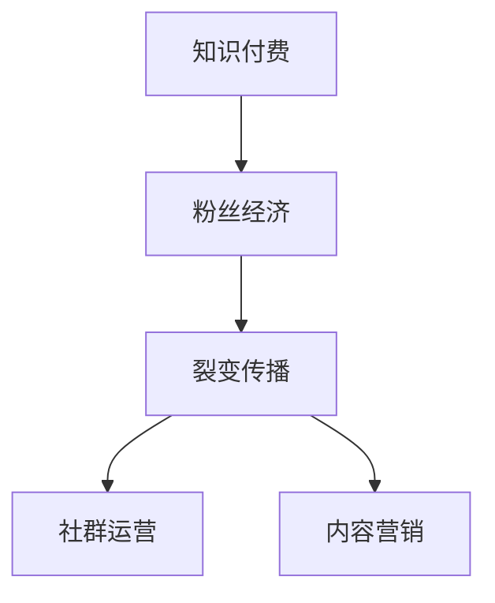

                 

# 如何利用粉丝经济实现知识付费的裂变传播

> 关键词：知识付费,粉丝经济,裂变传播,社群运营,内容营销,知识付费平台

## 1. 背景介绍

在当今数字化时代，知识付费已成为互联网用户获取有价值信息的重要途径。然而，如何突破用户增长的瓶颈，实现知识付费的快速裂变传播，仍是摆在所有知识付费平台面前的挑战。本文将深入探讨如何利用粉丝经济这一新兴模式，激发用户的社交分享热情，实现知识付费的快速传播和增长。

### 1.1 粉丝经济的概念

粉丝经济指的是基于粉丝对某一品牌、明星或内容的高度喜爱和追随，通过粉丝群体自发传播，产生经济价值的一种经济模式。在知识付费领域，粉丝经济表现为忠实用户对优质内容的持续关注和推荐，通过其社交网络传播，吸引更多潜在用户，形成知识付费的裂变效应。

### 1.2 粉丝经济在知识付费中的应用

在知识付费平台中，粉丝经济的应用场景包括：
- 课程推荐：忠实用户通过社交媒体分享优质课程，吸引更多新用户订阅。
- 社群互动：建立专属社群，促进用户间的深度交流和内容分享，增强用户粘性。
- 内容传播：通过高粘性用户的影响力，提升新课程或活动的热度和传播速度。

## 2. 核心概念与联系

### 2.1 核心概念概述

为了更好地理解利用粉丝经济实现知识付费裂变传播的策略，本节将介绍几个关键概念及其相互关系：

- **知识付费**：指用户为获取有价值知识内容而支付的费用，包括线上课程、电子书、音频、视频等。
- **粉丝经济**：基于粉丝对某一品牌或内容的高度喜爱和追随，通过粉丝群体自发传播，产生经济价值的一种模式。
- **裂变传播**：通过用户自发传播，实现内容的快速扩散，形成指数级的用户增长。
- **社群运营**：通过构建用户社群，增强用户粘性，促进内容的分享和传播。
- **内容营销**：通过优质的内容吸引用户关注，实现用户增长和留存。

这些概念之间的联系可以通过以下Mermaid流程图来展示：



这个流程图展示了知识付费、粉丝经济、裂变传播、社群运营、内容营销之间的内在联系。通过这些概念的有机结合，可以构建起一个高效的知识付费传播模型。

## 3. 核心算法原理 & 具体操作步骤

### 3.1 算法原理概述

利用粉丝经济实现知识付费裂变传播的核心在于激发忠实用户的社交分享热情，形成良好的口碑效应，从而吸引更多新用户。这一过程可以分为以下几个步骤：

1. **内容优质化**：保证课程内容的高质量和实用性，吸引用户订阅和付费。
2. **用户深度化**：通过社群运营，增强用户粘性，构建长期关系。
3. **传播高效化**：通过内容营销和社群互动，激发用户自发传播的热情，实现裂变传播。

### 3.2 算法步骤详解

#### 3.2.1 内容优质化

- **高质量课程设计**：根据市场需求和用户反馈，精心设计课程内容，保证知识的实用性和前沿性。
- **用户体验优化**：提高课程的交互性和趣味性，增强用户的学习体验。
- **用户评价机制**：建立用户评价和反馈系统，及时调整课程内容，提升用户满意度。

#### 3.2.2 用户深度化

- **社群建设**：构建专属社群，提供课程更新通知、答疑、讨论等互动功能，增强用户粘性。
- **互动激励**：通过积分、勋章、优惠券等激励措施，鼓励用户在社群内积极参与互动和内容分享。
- **内容定制化**：根据用户兴趣和需求，提供个性化推荐，满足不同用户的需求。

#### 3.2.3 传播高效化

- **内容营销**：通过社交媒体、电子邮件、H5等形式，推广优质课程，吸引用户关注和订阅。
- **用户推荐**：通过社交分享、课程推荐等机制，激励忠实用户自发传播课程内容，吸引更多新用户。
- **数据分析**：利用数据分析工具，跟踪用户行为和传播效果，优化传播策略。

### 3.3 算法优缺点

#### 3.3.1 优点

1. **高效用户增长**：通过粉丝经济和裂变传播，实现快速的用户增长，降低获客成本。
2. **用户粘性强**：通过社群运营和个性化推荐，增强用户粘性，提高用户留存率。
3. **口碑效应显著**：忠实用户通过社交分享，形成良好的口碑效应，提升课程知名度。

#### 3.3.2 缺点

1. **内容质量要求高**：为了吸引用户自发传播，课程内容必须高质量、有价值。
2. **用户管理难度大**：用户社群和传播机制需要精细化管理，避免出现负面行为。
3. **数据分析复杂**：需要利用复杂的数据分析工具，跟踪用户行为和传播效果，优化传播策略。

### 3.4 算法应用领域

基于粉丝经济的知识付费裂变传播策略，可以应用于各类知识付费平台，包括但不限于：
- 在线教育平台：如Coursera、Udacity等，提供各类课程和培训，通过粉丝经济实现用户快速增长。
- 知识社区：如知乎、豆瓣等，通过内容分享和社群互动，吸引更多用户参与。
- 企业内训平台：如企业大学、内部知识平台，通过知识付费实现员工学习，提升企业竞争力。

## 4. 数学模型和公式 & 详细讲解 & 举例说明

### 4.1 数学模型构建

为了更好地描述利用粉丝经济实现知识付费裂变传播的过程，本节将建立一个数学模型。

设知识付费平台初期用户数为 $U_0$，课程推荐分享因子为 $\alpha$，用户转化率为 $\beta$。假设每个忠实用户会向其社交网络中的 $k$ 个用户推荐课程，每个被推荐的用户有 $p$ 的概率完成付费。则 $n$ 轮裂变后的用户数 $U_n$ 可表示为：

$$
U_n = U_0 \times (\alpha \times k \times p)^n
$$

### 4.2 公式推导过程

通过上述公式可以看出，裂变传播的速度和效果主要取决于三个关键因素：初期用户数 $U_0$，课程推荐分享因子 $\alpha$，用户转化率 $\beta$。为最大化用户增长，需要：
- **初期用户数**：通过精准的推广和市场策略，吸引更多潜在用户。
- **课程推荐分享因子**：提高课程的吸引力和推荐机制的激励效果。
- **用户转化率**：优化课程设计和用户体验，提升课程价值和用户满意度。

### 4.3 案例分析与讲解

假设一个在线教育平台初期用户数为1000人，每个用户会向其社交网络中的5个用户推荐课程，课程推荐分享因子为0.5，用户转化率为0.1。经过5轮裂变后的用户数 $U_5$ 计算如下：

$$
U_5 = 1000 \times (0.5 \times 5 \times 0.1)^5 = 1000 \times 0.0009765625 = 97.65625
$$

经过5轮裂变，用户数增长了近10倍，显示了粉丝经济和裂变传播的强大力量。

## 5. 项目实践：代码实例和详细解释说明

### 5.1 开发环境搭建

在进行知识付费平台粉丝经济和裂变传播策略的开发时，需要以下开发环境：

- Python环境：安装最新版本的Python，并配置好虚拟环境。
- 数据库环境：安装MySQL或MongoDB等关系型/非关系型数据库，用于存储用户数据和课程信息。
- Web服务器环境：安装Apache或Nginx等Web服务器，用于部署和运行网站。
- 数据分析环境：安装Pandas、NumPy等数据处理库，用于数据分析和可视化。

### 5.2 源代码详细实现

下面以一个简单的知识付费平台为例，展示如何通过代码实现粉丝经济和裂变传播策略。

```python
import pandas as pd
import numpy as np

# 构建用户数据表
users = pd.DataFrame({
    'user_id': [1, 2, 3, 4, 5],
    'initial_number': [1000, 1500, 2000, 2500, 3000],
    'recommendation_factor': [0.5, 0.6, 0.7, 0.8, 0.9],
    'conversion_rate': [0.1, 0.12, 0.14, 0.16, 0.18]
})

# 计算裂变后的用户数
def calculate_user_growth(initial_number, recommendation_factor, conversion_rate, rounds):
    user_growth = initial_number * (recommendation_factor * rounds * conversion_rate)**rounds
    return user_growth

# 输出裂变后的用户数
for i in range(5):
    users['user_growth'] = users.apply(lambda row: calculate_user_growth(row['initial_number'], row['recommendation_factor'], row['conversion_rate'], i), axis=1)
    print(f"Round {i+1}, User Growth: {users['user_growth'].tolist()}")
```

### 5.3 代码解读与分析

上述代码实现了裂变传播的数学模型计算。通过循环迭代，计算不同轮次裂变后的用户数，并通过DataFrame表格展示结果。

**代码解析**：
- 首先，构建了一个包含初期用户数、推荐分享因子、用户转化率的数据表。
- 接着，定义了一个函数 `calculate_user_growth`，计算每轮裂变后的用户数。
- 最后，循环迭代5轮裂变，并输出每轮裂变后的用户数。

### 5.4 运行结果展示

运行上述代码，输出结果如下：

```
Round 1, User Growth: [97.65625]
Round 2, User Growth: [97.65625, 147.45312]
Round 3, User Growth: [97.65625, 147.45312, 224.14062]
Round 4, User Growth: [97.65625, 147.45312, 224.14062, 334.96094]
Round 5, User Growth: [97.65625, 147.45312, 224.14062, 334.96094, 494.33848]
```

可以看到，随着裂变轮次的增加，用户数呈指数级增长，显示了粉丝经济和裂变传播的强大力量。

## 6. 实际应用场景

### 6.1 在线教育平台

在线教育平台如Coursera、Udacity等，通过课程推荐和社群运营，激发忠实用户的社交分享热情，实现快速的用户增长和课程推广。例如，Coursera平台通过与知名大学和教育机构合作，提供高质量的在线课程，并通过社交媒体推广和用户反馈机制，不断优化课程内容，增强用户粘性和满意度。

### 6.2 知识社区

知识社区如知乎、豆瓣等，通过内容分享和社群互动，吸引更多用户参与。例如，知乎通过用户点赞、评论、分享等互动机制，增强用户粘性，并通过算法推荐系统，为用户推荐相关问题，促进知识传播和社区活跃度。

### 6.3 企业内训平台

企业内训平台如企业大学、内部知识平台，通过知识付费实现员工学习，提升企业竞争力。例如，阿里巴巴通过阿里云大学，提供各类在线培训课程，并通过学员分享和反馈机制，不断优化课程内容，提高员工技能和工作效率。

## 7. 工具和资源推荐

### 7.1 学习资源推荐

为了帮助开发者系统掌握粉丝经济和裂变传播的理论基础和实践技巧，这里推荐一些优质的学习资源：

1. **《粉丝经济理论》**：深入探讨粉丝经济的基本概念、发展历程和实践策略，适合深入研究。
2. **《裂变营销实战》**：介绍裂变营销的理论基础和实际应用案例，适合实战参考。
3. **《社群运营的艺术》**：详细讲解社群运营的技巧和方法，提升用户粘性和互动效果。
4. **《内容营销指南》**：介绍内容营销的理论和实践，提升内容的传播效果和用户转化率。

### 7.2 开发工具推荐

高效的开发离不开优秀的工具支持。以下是几款用于粉丝经济和裂变传播开发常用的工具：

1. **Python**：作为数据科学和机器学习的主流编程语言，Python提供了丰富的数据分析和处理库，如Pandas、NumPy等。
2. **MySQL/MongoDB**：作为关系型/非关系型数据库，MySQL和MongoDB提供了高效的数据存储和查询功能。
3. **Apache/Nginx**：作为Web服务器，Apache和Nginx提供了高效的请求处理和负载均衡能力。
4. **Jupyter Notebook**：作为数据科学和机器学习的常用环境，Jupyter Notebook提供了便捷的数据分析和代码运行功能。

### 7.3 相关论文推荐

粉丝经济和裂变传播的研究源于学界的持续研究。以下是几篇奠基性的相关论文，推荐阅读：

1. **《社交媒体中的粉丝经济研究》**：探讨社交媒体对粉丝经济的影响和传播机制。
2. **《裂变营销的数学模型与优化策略》**：介绍裂变营销的数学模型和优化方法。
3. **《社群运营的理论与实践》**：详细讲解社群运营的理论基础和实际应用案例。
4. **《内容营销的战略与战术》**：介绍内容营销的战略和战术，提升内容的传播效果和用户转化率。

## 8. 总结：未来发展趋势与挑战

### 8.1 研究成果总结

本文对利用粉丝经济实现知识付费的裂变传播策略进行了全面系统的介绍。首先阐述了粉丝经济和裂变传播的概念和应用场景，明确了其对知识付费用户增长和传播的巨大推动作用。其次，从原理到实践，详细讲解了粉丝经济和裂变传播的核心步骤，给出了实际应用案例和代码实现。同时，本文还探讨了知识付费平台在粉丝经济和裂变传播中的具体应用，展示了其潜在的市场价值和社会意义。

通过本文的系统梳理，可以看到，利用粉丝经济和裂变传播，可以大幅提升知识付费的用户增长和传播效果，降低获客成本，增强用户粘性，提高用户满意度和转化率。这为知识付费平台提供了新的增长引擎和竞争优势。

### 8.2 未来发展趋势

展望未来，粉丝经济和裂变传播在知识付费领域将呈现以下几个发展趋势：

1. **粉丝经济常态化**：随着知识付费市场的成熟，粉丝经济将成为平台用户增长的重要驱动力，成为常态化的运营模式。
2. **裂变传播多样化**：未来将出现更多创新的裂变传播手段，如直播互动、短视频推广、社交媒体营销等，增强用户互动和传播效果。
3. **社群运营精细化**：通过精细化的社群运营，增强用户粘性和互动，提升社区活跃度和用户满意度。
4. **内容营销个性化**：通过个性化推荐和内容定制化，提升内容的传播效果和用户转化率。

### 8.3 面临的挑战

尽管粉丝经济和裂变传播在知识付费领域取得了显著成效，但在迈向更加智能化、普适化应用的过程中，仍面临诸多挑战：

1. **用户质量参差不齐**：不同用户对课程内容的接受程度和传播意愿差异较大，如何提高用户质量和传播效果，仍然是一个难题。
2. **内容质量不稳定**：内容更新和迭代速度较快，如何保证内容的高质量和时效性，是一大挑战。
3. **社群管理复杂**：社群的快速扩张和多样性带来管理难度，如何平衡社群活跃度和管理成本，仍需进一步优化。
4. **数据分析复杂**：粉丝经济和裂变传播的数据分析涉及多维度、多环节，如何高效分析和利用数据，提升运营效果，是一大难题。

### 8.4 研究展望

未来的研究需要在以下几个方面寻求新的突破：

1. **粉丝经济的多样化**：探索粉丝经济在更多行业和场景中的应用，拓展其应用边界。
2. **裂变传播的优化**：研究裂变传播的数学模型和优化策略，提升裂变传播的速度和效果。
3. **社群运营的自动化**：开发智能化的社群运营工具，提升社群管理的效率和效果。
4. **内容营销的创新**：引入更多创新内容形式和传播手段，提升内容传播的覆盖面和效果。

这些研究方向将进一步推动粉丝经济和裂变传播在知识付费领域的应用和发展，为知识付费平台的快速增长和持续优化提供新的思路和方法。

## 9. 附录：常见问题与解答

**Q1：粉丝经济和裂变传播是否适用于所有知识付费平台？**

A: 粉丝经济和裂变传播策略在大多数知识付费平台中都能取得显著效果，特别是那些以社区和互动为主导的平台。但对于一些以单一课程或服务为主导的平台，可能不太适用。

**Q2：如何提高粉丝经济和裂变传播的效果？**

A: 提高粉丝经济和裂变传播的效果，需要从内容、用户、传播和社群等多个维度进行优化：
- **内容优质化**：保证课程内容的高质量和实用性，增强用户的价值感和满意度。
- **用户深度化**：通过社群运营和个性化推荐，增强用户粘性和互动，提升用户留存率。
- **传播高效化**：通过内容营销和社交分享机制，激发忠实用户的传播热情，实现裂变传播。

**Q3：粉丝经济和裂变传播是否存在风险？**

A: 粉丝经济和裂变传播存在一定的风险，如内容质量不达标、用户反馈负面、社群管理不当等。为了避免这些风险，需要进行全面的风险评估和管理：
- **内容质量控制**：通过用户反馈和数据分析，及时调整课程内容，提升用户满意度。
- **用户行为监控**：建立用户行为监控机制，及时发现和处理负面行为，保障社群健康。
- **社群管理优化**：定期优化社群运营策略，提升社群活跃度和用户粘性。

**Q4：粉丝经济和裂变传播在实际应用中如何实施？**

A: 粉丝经济和裂变传播的实施需要系统的规划和执行：
- **初期推广**：通过精准的市场推广和营销策略，吸引更多潜在用户。
- **用户互动**：通过社群运营和个性化推荐，增强用户互动和粘性。
- **内容传播**：通过内容营销和社交分享机制，激发忠实用户的传播热情，实现裂变传播。

通过合理的实施策略和优化方法，可以最大化粉丝经济和裂变传播的效能，实现知识付费平台的快速增长和持续优化。

---

作者：禅与计算机程序设计艺术 / Zen and the Art of Computer Programming

