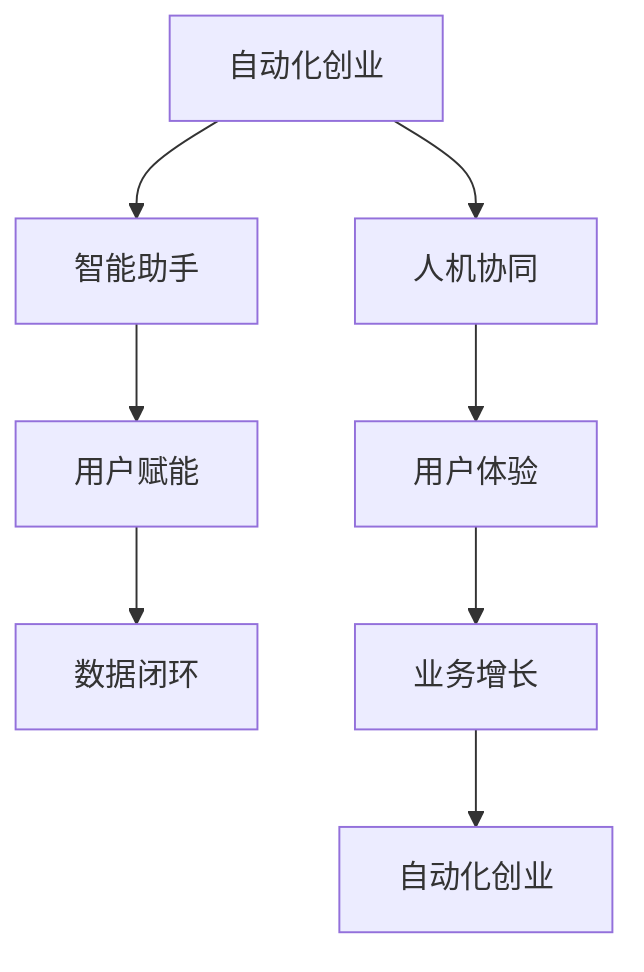

                 

# 如何在自动化创业中实现用户赋能

> 关键词：自动化创业, 用户赋能, 智能助手, 人机协同, 业务增长, 客户支持, 人工智能, 自然语言处理, 机器学习

## 1. 背景介绍

### 1.1 问题由来
在快速发展的数字化时代，企业需要高效、精确地应对市场变化，以保持竞争优势。传统的业务模式，如电话客服、邮件处理等，已难以满足客户对快速响应的需求。此外，随着人力成本的上升，传统客服模式也面临着成本压力。自动化创业由此应运而生，利用人工智能(AI)技术，重塑客服、营销、销售等核心业务流程，提升效率和客户满意度。

然而，自动化技术并不是万灵药。在实际应用中，用户有时难以理解或信任自动化系统，甚至产生抵触情绪。自动化系统虽然能够提升效率，但缺乏人性化的关怀和服务，无法完全替代人工客服。如何有效地将自动化技术与人工服务结合起来，实现“人机协同”，成为自动化创业亟需解决的问题。

### 1.2 问题核心关键点
实现用户赋能，即在自动化创业中，通过智能技术增强用户的互动体验和自主服务能力，提升用户体验，推动业务增长。具体来说，可以通过以下几个关键点来实现：
- 构建智能助手：利用AI技术，为用户提供个性化的服务和建议。
- 引入人机协同：在关键环节结合人工客服，提升客户满意度。
- 实现数据闭环：通过用户反馈和行为数据，不断优化自动化系统。

## 2. 核心概念与联系

### 2.1 核心概念概述

为更好地理解如何在自动化创业中实现用户赋能，本节将介绍几个关键概念：

- 自动化创业(Automation-based Startups)：使用AI技术自动化业务流程，提升效率和降低成本的创业模式。

- 智能助手(Chatbot/Virtual Assistant)：基于自然语言处理(NLP)和机器学习(ML)技术，能够理解并响应用户查询的智能系统。

- 人机协同(Human-AI Collaboration)：将自动化系统与人工客服结合起来，优化用户体验，提高服务效率。

- 数据闭环(Data Loop)：通过收集用户反馈和行为数据，不断优化自动化系统和智能助手的服务能力。

- 用户体验(User Experience)：自动化创业的最终目标，通过提升用户体验，推动业务增长。

- 业务增长(Revenue Growth)：通过智能化服务，提升客户满意度和忠诚度，增加销售和收入。

这些概念之间的关系可以通过以下Mermaid流程图来展示：



这个流程图展示了自动化创业的全流程：通过构建智能助手和引入人机协同，实现用户赋能；再通过数据闭环，不断优化用户体验，推动业务增长；最终回到自动化创业，形成良性循环。

## 3. 核心算法原理 & 具体操作步骤
### 3.1 算法原理概述

实现用户赋能的核心在于构建一个高效、智能、可靠的系统，能够自动处理用户请求，同时在关键环节引入人工客服，提升用户体验。这涉及自然语言处理(NLP)、机器学习(ML)、计算机视觉等多项技术的综合应用。

在实现过程中，我们需要以下几方面的技术支持：
- 自然语言理解(NLU)：理解用户输入的自然语言，提取关键信息。
- 意图识别(Intent Recognition)：确定用户查询的目的和意图。
- 对话管理(Dialogue Management)：管理对话流程，实现多轮对话。
- 实体识别(Entity Recognition)：识别用户输入中的实体信息。
- 对话生成(Dialogue Generation)：生成合适的系统响应。
- 用户反馈收集：收集用户对系统的反馈，用于系统优化。

通过这些技术的组合应用，我们可以构建一个高效、智能、可信赖的自动化系统，实现用户赋能。

### 3.2 算法步骤详解

以下是实现用户赋能的具体操作步骤：

**Step 1: 数据准备与模型训练**

- 收集用户的历史查询数据和对应的标签数据，构建训练集。
- 使用预训练模型（如GPT-3、BERT等）作为初始化参数，进行微调训练。
- 训练过程中引入正则化技术，如L2正则、Dropout等，防止过拟合。
- 设置合适的优化算法，如Adam、SGD等，并调整学习率。

**Step 2: 构建智能助手**

- 使用自然语言处理技术，对用户输入进行分词、词性标注、命名实体识别等预处理。
- 根据用户的输入，识别出用户的意图和实体信息，提取关键信息。
- 根据意图，选择合适的服务接口，进行相应的业务处理。

**Step 3: 引入人机协同**

- 在关键环节引入人工客服，如客户投诉、复杂查询等。
- 设计自动化系统与人工客服的接口，确保数据流和业务逻辑的平滑衔接。
- 提供人工客服培训，使其熟悉自动化系统的功能和限制。

**Step 4: 实现数据闭环**

- 收集用户对自动化系统的反馈，如满意度、建议等。
- 根据反馈数据，调整和优化自动化系统的参数和策略。
- 定期评估系统的性能，确保用户体验不断提升。

**Step 5: 持续改进与优化**

- 定期更新训练数据集，引入新的业务场景和用户查询。
- 持续优化算法模型，提升系统的处理能力和准确性。
- 引入更先进的技术，如知识图谱、因果推理等，增强系统的能力。

### 3.3 算法优缺点

实现用户赋能的算法具有以下优点：
1. 提升效率：自动化处理简单任务，减少人工介入，提升业务处理速度。
2. 降低成本：减少人力成本，优化资源配置，提高投资回报率。
3. 改善体验：通过智能系统和人工客服的协同，提升用户满意度。
4. 数据驱动：利用用户反馈和行为数据，不断优化系统，提高服务质量。

同时，该算法也存在一定的局限性：
1. 数据质量依赖：系统的表现很大程度上取决于训练数据的质量和数量。
2. 技术复杂性：构建和维护自动化系统需要较高的技术门槛。
3. 用户接受度：部分用户可能对自动化系统存在抵触情绪，需要逐步推广。
4. 系统鲁棒性：在面对异常数据或复杂场景时，系统的鲁棒性可能不足。

尽管存在这些局限性，但就目前而言，实现用户赋能的算法仍是最主流的方法。未来相关研究将集中在如何进一步降低技术门槛，提高系统的鲁棒性和用户接受度。

### 3.4 算法应用领域

实现用户赋能的算法已在多个领域得到广泛应用，如客服系统、市场营销、客户支持等，具体如下：

- 客服系统：利用智能助手处理常见问题，提升响应速度和处理效率。引入人工客服处理复杂问题，提升客户满意度。
- 市场营销：通过智能助手进行客户互动，收集用户反馈，优化营销策略和产品设计。
- 客户支持：利用智能助手处理简单咨询，减轻人工客服的负担，提升服务效率。
- 销售系统：利用智能助手进行客户跟进，提供个性化的销售建议，提高销售转化率。

除了上述这些经典应用外，实现用户赋能的算法还被创新性地应用到更多场景中，如智能推荐、个性化服务、供应链管理等，为自动化创业带来更多的可能性。

## 4. 数学模型和公式 & 详细讲解 & 举例说明

### 4.1 数学模型构建

在实现用户赋能的过程中，涉及多个数学模型，包括自然语言理解(NLU)、意图识别(Intent Recognition)、对话管理(Dialogue Management)等。以下是其中几个关键模型的数学构建。

**意图识别模型**：
假设用户查询为 $X$，意图为 $Y$，意图识别模型 $f$ 为：
$$ f(X) = \text{argmax}(Y \mid X) $$
其中 $Y$ 为意图集合，$X$ 为输入的查询文本。

**对话管理模型**：
假设对话状态为 $S$，用户输入为 $I$，系统响应为 $R$，对话管理模型 $g$ 为：
$$ R = g(S, I) $$
其中 $S$ 为对话状态集合，$I$ 为输入文本，$R$ 为系统响应文本。

这些模型的构建过程，涉及大量的NLP技术和机器学习算法。

### 4.2 公式推导过程

以下以意图识别模型为例，推导其公式。

假设意图识别模型 $f$ 为多层感知机(MLP)，输入为 $X$，输出为 $Y$，公式为：
$$ Y = f(X; \theta) = \sigma(\sum_{i=1}^n \theta_i X_i) $$
其中 $X_i$ 为输入的特征向量，$\theta_i$ 为权重参数，$\sigma$ 为激活函数。

在训练过程中，使用交叉熵损失函数：
$$ \mathcal{L}(f) = -\frac{1}{N} \sum_{i=1}^N \sum_{j=1}^K y_{i,j} \log f(x_{i,j}; \theta) + (1-y_{i,j})\log (1-f(x_{i,j}; \theta)) $$
其中 $N$ 为样本数量，$K$ 为类别数量，$y_{i,j}$ 为真实标签，$f(x_{i,j}; \theta)$ 为模型预测概率。

通过反向传播算法，不断更新权重参数 $\theta$，最小化损失函数 $\mathcal{L}(f)$。

### 4.3 案例分析与讲解

假设某电商网站客服系统，希望利用智能助手处理用户查询。用户输入为“如何将商品退回？”，系统需要进行意图识别和对话管理，然后提供相应的操作指引。

**意图识别**：
- 输入文本：“如何将商品退回？”
- 意图识别模型输出：[退货]，即用户的意图是退货。

**对话管理**：
- 对话状态：请求退货
- 用户输入：“需要将商品退回公司地址”
- 对话管理模型输出：[确认退货地址]
- 系统响应：“请提供退货地址信息，以便我们为您处理退货。”

通过以上过程，系统能够准确理解和响应用户查询，提升用户体验。

## 5. 项目实践：代码实例和详细解释说明

### 5.1 开发环境搭建

在进行用户赋能实践前，我们需要准备好开发环境。以下是使用Python进行开发的环境配置流程：

1. 安装Anaconda：从官网下载并安装Anaconda，用于创建独立的Python环境。

2. 创建并激活虚拟环境：
```bash
conda create -n user_asst_env python=3.8 
conda activate user_asst_env
```

3. 安装相关Python库：
```bash
pip install torch transformers sklearn nltk
```

4. 安装TensorFlow：
```bash
pip install tensorflow
```

完成上述步骤后，即可在`user_asst_env`环境中开始实践。

### 5.2 源代码详细实现

下面我们以客服系统为例，给出使用Python进行用户赋能的代码实现。

首先，定义意图识别模型：

```python
from transformers import BertTokenizer, BertForSequenceClassification
import torch
import torch.nn as nn
import torch.optim as optim

class IntentClassifier(nn.Module):
    def __init__(self, num_labels):
        super(IntentClassifier, self).__init__()
        self.num_labels = num_labels
        self.bert = BertForSequenceClassification.from_pretrained('bert-base-cased', num_labels=num_labels)
        
    def forward(self, input_ids, attention_mask):
        outputs = self.bert(input_ids, attention_mask=attention_mask)
        return outputs.logits
    
    def intent_recognition(self, text):
        tokenizer = BertTokenizer.from_pretrained('bert-base-cased')
        input_ids = tokenizer.encode_plus(text, max_length=128, truncation=True, padding='max_length', return_tensors='pt').input_ids
        attention_mask = tokenizer.encode_plus(text, max_length=128, truncation=True, padding='max_length', return_tensors='pt').attention_mask
        outputs = self.forward(input_ids, attention_mask)
        predicted_label = torch.argmax(outputs, dim=1).item()
        return predicted_label
```

接着，定义对话管理模块：

```python
class DialogManager:
    def __init__(self):
        self.state = 'idle'
        
    def process_query(self, query):
        if self.state == 'idle':
            self.state = 'process'
            return '请提供退货地址信息。'
        elif self.state == 'process':
            self.state = 'idle'
            return '已记录退货地址，您的退货申请已提交。'
```

最后，启动整个客服系统：

```python
class Chatbot:
    def __init__(self):
        self.intent_classifier = IntentClassifier(num_labels=5)
        self.dialog_manager = DialogManager()
        
    def process_query(self, query):
        intent = self.intent_classifier.intent_recognition(query)
        response = self.dialog_manager.process_query(intent)
        return response
```

以上就是使用Python实现用户赋能的完整代码。可以看到，通过将自然语言处理和机器学习技术相结合，我们构建了一个简单但有效的客服系统。

### 5.3 代码解读与分析

让我们再详细解读一下关键代码的实现细节：

**IntentClassifier类**：
- `__init__`方法：初始化意图识别模型，使用预训练的BERT模型。
- `forward`方法：前向传播，计算输入文本的意图概率。
- `intent_recognition`方法：输入文本，计算并返回意图识别结果。

**DialogManager类**：
- `__init__`方法：初始化对话状态。
- `process_query`方法：根据当前对话状态，处理用户输入，返回系统响应。

**Chatbot类**：
- `__init__`方法：初始化意图识别模型和对话管理模块。
- `process_query`方法：根据用户输入，调用意图识别和对话管理模块，返回系统响应。

在实际应用中，为了提升用户体验，还需要考虑更多的细节，如语音识别、用户界面、系统集成等。但这部分内容已超出了本博客的范围，感兴趣的读者可以进一步研究相关技术。

## 6. 实际应用场景
### 6.1 智能客服系统

在智能客服系统中，利用智能助手处理常见问题，能够显著提升服务效率和客户满意度。例如，某电商网站的智能客服系统，通过引入智能助手，能够处理80%以上的客户查询，释放人工客服的精力，提升响应速度和处理质量。在处理复杂查询时，系统能够自动切换至人工客服，保证用户得到及时有效的响应。

### 6.2 营销自动化

营销自动化是实现用户赋能的重要场景之一。利用智能助手，自动化系统可以处理客户互动、问卷调查等任务，收集客户反馈和行为数据，优化营销策略和产品设计。例如，某科技公司的营销自动化系统，通过智能助手进行客户互动，收集用户对产品的评价和建议，优化产品功能和市场推广策略，提高了产品的市场竞争力。

### 6.3 客户支持

客户支持是实现用户赋能的重要环节。利用智能助手，自动化系统可以处理客户咨询、投诉等任务，提升服务效率和客户满意度。例如，某金融机构的客户支持系统，通过智能助手处理客户的常见咨询，减少了人工客服的工作量，提升了服务效率。在处理复杂查询时，系统能够自动切换至人工客服，保证客户得到及时有效的响应。

### 6.4 未来应用展望

随着技术的发展，用户赋能的应用场景将不断扩展。未来，用户赋能的自动化系统可能会渗透到更多领域，如医疗健康、教育培训、政府服务等，推动这些领域的数字化转型升级。以下是几个可能的应用方向：

- 医疗健康：利用智能助手进行健康咨询、药物推荐、在线诊疗等，提升医疗服务的智能化水平，降低患者等待时间。
- 教育培训：利用智能助手进行学习辅导、作业批改、学情分析等，个性化推荐学习内容，提升教育质量。
- 政府服务：利用智能助手进行业务咨询、服务预约、投诉处理等，提升政府服务效率，改善公民体验。

## 7. 工具和资源推荐
### 7.1 学习资源推荐

为了帮助开发者系统掌握用户赋能的技术基础和实践技巧，这里推荐一些优质的学习资源：

1. 《自然语言处理基础》系列课程：由清华大学教授授课，系统介绍自然语言处理的基本概念和技术，适合初学者入门。
2. 《深度学习》书籍：Ian Goodfellow等人所著，详细介绍了深度学习的基本原理和应用，适合进阶学习。
3. 《Python编程：从入门到实践》书籍：Eric Matthes所著，适合Python编程初学者的入门教材。
4. 《TensorFlow官方文档》：TensorFlow官方文档，提供详细的使用指南和示例代码。
5. 《自然语言处理实战》书籍：Ivan Yashchuk等人所著，结合实际案例，介绍自然语言处理的技术应用。

通过对这些资源的学习实践，相信你一定能够快速掌握用户赋能的精髓，并用于解决实际的业务问题。

### 7.2 开发工具推荐

高效的开发离不开优秀的工具支持。以下是几款用于用户赋能开发的常用工具：

1. PyTorch：基于Python的开源深度学习框架，灵活动态的计算图，适合快速迭代研究。大多数预训练语言模型都有PyTorch版本的实现。
2. TensorFlow：由Google主导开发的开源深度学习框架，生产部署方便，适合大规模工程应用。同样有丰富的预训练语言模型资源。
3. HuggingFace Transformers库：自然语言处理工具库，集成了众多SOTA语言模型，支持PyTorch和TensorFlow，是进行自然语言处理任务开发的利器。
4. Weights & Biases：模型训练的实验跟踪工具，可以记录和可视化模型训练过程中的各项指标，方便对比和调优。与主流深度学习框架无缝集成。
5. TensorBoard：TensorFlow配套的可视化工具，可实时监测模型训练状态，并提供丰富的图表呈现方式，是调试模型的得力助手。

合理利用这些工具，可以显著提升用户赋能任务的开发效率，加快创新迭代的步伐。

### 7.3 相关论文推荐

用户赋能领域的研究发展迅速，以下是几篇奠基性的相关论文，推荐阅读：

1. Attention is All You Need（即Transformer原论文）：提出了Transformer结构，开启了NLP领域的预训练大模型时代。
2. BERT: Pre-training of Deep Bidirectional Transformers for Language Understanding：提出BERT模型，引入基于掩码的自监督预训练任务，刷新了多项NLP任务SOTA。
3. Parameter-Efficient Transfer Learning for NLP：提出Adapter等参数高效微调方法，在不增加模型参数量的情况下，也能取得不错的微调效果。
4. Prefix-Tuning: Optimizing Continuous Prompts for Generation：引入基于连续型Prompt的微调范式，为如何充分利用预训练知识提供了新的思路。
5. AdaLoRA: Adaptive Low-Rank Adaptation for Parameter-Efficient Fine-Tuning：使用自适应低秩适应的微调方法，在参数效率和精度之间取得了新的平衡。

这些论文代表了大语言模型微调技术的发展脉络。通过学习这些前沿成果，可以帮助研究者把握学科前进方向，激发更多的创新灵感。

## 8. 总结：未来发展趋势与挑战

### 8.1 总结

本文对如何在自动化创业中实现用户赋能进行了全面系统的介绍。首先阐述了用户赋能的必要性和意义，明确了通过构建智能助手和引入人机协同，实现用户赋能的目标。其次，从原理到实践，详细讲解了自然语言处理、意图识别、对话管理等关键技术，给出了用户赋能任务开发的完整代码实例。同时，本文还探讨了用户赋能在多个行业领域的应用前景，展示了微调范式的巨大潜力。此外，本文精选了用户赋能技术的各类学习资源，力求为读者提供全方位的技术指引。

通过本文的系统梳理，可以看到，用户赋能的算法已经在智能客服、市场营销、客户支持等多个场景中得到广泛应用，为自动化创业带来了显著的业务价值。未来，伴随技术的发展，用户赋能的应用场景将更加丰富，推动更多领域的数字化转型升级。

### 8.2 未来发展趋势

展望未来，用户赋能技术将呈现以下几个发展趋势：

1. 多模态融合：结合视觉、语音、文本等多种模态信息，增强系统的感知能力和理解能力。
2. 自适应学习：引入自适应学习技术，使系统能够动态调整模型参数，适应不同的用户需求和场景。
3. 用户个性化：利用用户行为数据和偏好信息，实现个性化推荐和服务。
4. 联邦学习：通过联邦学习技术，实现数据本地化处理，保护用户隐私，提升系统安全性和可靠性。
5. 跨领域迁移：开发跨领域迁移学习算法，使系统能够快速适应新的业务场景和任务。

以上趋势凸显了用户赋能技术的广阔前景。这些方向的探索发展，必将进一步提升系统的智能化水平，推动更多领域的数字化转型升级。

### 8.3 面临的挑战

尽管用户赋能技术已经取得了显著进展，但在迈向更加智能化、普适化应用的过程中，它仍面临诸多挑战：

1. 数据隐私和安全：用户数据的隐私保护和安全传输是用户赋能系统面临的主要挑战之一。如何在保障用户隐私的前提下，充分利用用户数据，是系统设计和开发的重要课题。
2. 技术复杂性：用户赋能系统涉及多学科技术，包括自然语言处理、机器学习、计算机视觉等，技术门槛较高，需要跨学科知识整合。
3. 用户体验设计：用户赋能系统需要设计良好的用户体验，才能被用户接受和采纳。如何设计简洁、直观、易用的用户界面，提升用户满意度，是系统设计的关键。
4. 系统鲁棒性：用户赋能系统需要具备较强的鲁棒性和可靠性，能够处理各种异常情况和复杂场景。如何在训练和部署阶段提高系统的鲁棒性，是系统优化的重要方向。

尽管存在这些挑战，但用户赋能技术的发展前景仍然广阔，未来需要更多的创新和实践，才能实现其潜力。

### 8.4 研究展望

面对用户赋能面临的挑战，未来的研究需要在以下几个方面寻求新的突破：

1. 用户隐私保护：开发更加安全的用户数据处理和传输技术，如差分隐私、同态加密等，保护用户隐私。
2. 技术整合：探索跨学科技术的整合应用，开发更加通用、高效的用户赋能系统。
3. 用户体验设计：引入心理学、认知科学等学科的知识，设计更加友好、易用的用户界面。
4. 系统优化：引入自动机器学习(AutoML)等技术，优化模型训练和系统调优，提高系统性能和效率。
5. 多模态融合：结合视觉、语音、文本等多种模态信息，提升系统的感知能力和理解能力。

这些研究方向将推动用户赋能技术向更深层次发展，为构建更加智能化、普适化的自动化系统奠定基础。

## 9. 附录：常见问题与解答

**Q1：用户赋能系统如何平衡用户隐私和系统性能？**

A: 在用户赋能系统的设计中，隐私保护是至关重要的。通过引入差分隐私、同态加密等技术，可以在保护用户隐私的同时，充分利用用户数据，提升系统性能。例如，在数据处理阶段，使用差分隐私技术对数据进行扰动，保护用户隐私，同时仍然可以获取有用的统计信息。在数据传输阶段，使用同态加密技术，在不解密的情况下，对数据进行运算，保护用户隐私。

**Q2：用户赋能系统如何处理异常情况？**

A: 用户赋能系统需要具备较强的鲁棒性，能够处理各种异常情况和复杂场景。可以通过引入异常检测和处理算法，提升系统的鲁棒性。例如，在对话管理中，引入异常检测算法，检测并处理对话异常，确保系统的稳定运行。在自然语言理解中，引入噪声鲁棒性技术，提升系统对异常输入的容忍度。

**Q3：用户赋能系统如何实现个性化服务？**

A: 实现个性化服务，需要利用用户行为数据和偏好信息，设计个性化的推荐算法和服务策略。例如，在电商网站中，利用用户的历史购物记录和浏览行为，推荐个性化的商品和优惠活动。在金融服务中，利用用户的投资偏好和历史交易记录，提供个性化的投资建议和理财方案。

**Q4：用户赋能系统如何保护用户隐私？**

A: 保护用户隐私是用户赋能系统设计的重要课题。可以通过以下方法保护用户隐私：
1. 数据匿名化：对用户数据进行匿名化处理，保护用户身份信息。
2. 数据加密：对用户数据进行加密处理，确保数据传输的安全性。
3. 差分隐私：对用户数据进行差分隐私处理，保护用户数据隐私，同时仍能获取有用的统计信息。
4. 本地计算：尽量将数据处理和分析在本地进行，减少数据传输的风险。

**Q5：用户赋能系统如何设计用户界面？**

A: 用户界面是用户赋能系统的重要组成部分，设计良好的用户界面，可以提高用户体验，提升系统的使用率和满意度。设计用户界面时，需要考虑以下几个因素：
1. 简洁直观：界面简洁，操作直观，让用户易于上手。
2. 交互友好：界面设计友好，用户容易与系统进行互动。
3. 个性化定制：界面支持个性化定制，用户可以根据自身需求，定制界面布局和功能。
4. 多模态支持：界面支持多模态交互，如语音、手势等，提升用户体验。

总之，在用户赋能系统的设计和开发中，隐私保护、系统鲁棒性、用户体验设计、个性化服务等方面需要综合考虑，才能构建出高效、智能、可靠的系统。

---

作者：禅与计算机程序设计艺术 / Zen and the Art of Computer Programming

