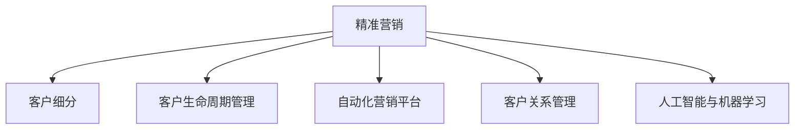

                 

# 如何在自动化创业中实现精准营销

> 关键词：精准营销, 自动化, 数据驱动, 客户细分, 营销自动化平台, 客户关系管理, 人工智能, 机器学习, 自动化工作流

## 1. 背景介绍

在自动化创业领域，精准营销（Precision Marketing）是一项关键活动，可以帮助企业有效地获取和转化潜在客户，提升品牌知名度和市场竞争力。传统的营销方式往往依赖于广泛的广告投放和随机客户筛选，成本高且效果有限。而精准营销则利用大数据分析、机器学习和自动化技术，通过精细化的市场细分和个性化的营销策略，显著提高营销活动的ROI。

本文将详细探讨如何通过精准营销在自动化创业中实现高效、智能的客户获取和转化过程。我们将从核心概念、算法原理、具体操作步骤等方面深入分析，并结合实际应用场景和案例进行讲解。

## 2. 核心概念与联系

### 2.1 核心概念概述

为更好地理解精准营销及其自动化实现，本节将介绍几个关键概念：

- 精准营销（Precision Marketing）：通过大数据分析和机器学习技术，对客户进行细分，并提供个性化的营销策略，以最大化营销效果。
- 客户细分（Customer Segmentation）：将客户群体划分为不同的细分市场，根据客户特征、行为和需求进行分类。
- 客户生命周期管理（Customer Lifecycle Management）：跟踪和分析客户在购买前、购买中和购买后的行为，制定相应的营销策略。
- 自动化营销平台（Automated Marketing Platform）：利用自动化技术实现营销活动的自动执行和管理，包括邮件营销、社交媒体管理、网站自动化等。
- 客户关系管理（Customer Relationship Management, CRM）：通过系统化管理客户信息，提升客户满意度和忠诚度，为精准营销提供支持。
- 人工智能与机器学习（AI & Machine Learning）：在精准营销中，利用AI和ML技术进行客户预测、行为分析等，以提升营销策略的精确性。

这些概念之间的逻辑关系可以通过以下Mermaid流程图来展示：



这个流程图展示了几大核心概念的相互关联：

1. 精准营销是整个流程的起点，通过客户细分和生命周期管理，利用自动化和AI技术，实现个性化的营销策略。
2. 客户细分和生命周期管理是精准营销的基础，通过细分市场和跟踪行为，为个性化营销提供依据。
3. 自动化营销平台和客户关系管理是精准营销的执行工具，通过系统化管理和自动化执行，确保营销策略的落地。
4. 人工智能与机器学习是精准营销的核心技术支持，通过数据分析和预测，提升营销的精确度和效果。

这些概念共同构成了精准营销的完整框架，使其能够在自动化创业中发挥最大的效能。

## 3. 核心算法原理 & 具体操作步骤
### 3.1 算法原理概述

精准营销的算法原理主要包括数据驱动的客户细分和个性化营销策略的生成。其核心思想是通过对大量客户数据的分析，识别出不同客户群体的特征和需求，并根据这些特征和需求设计个性化的营销活动，以实现最佳的营销效果。

具体而言，精准营销主要涉及以下几个步骤：

1. **客户数据收集**：从网站、社交媒体、客服系统等多个渠道收集客户的各种数据，包括基本信息、行为数据、交易数据等。
2. **数据预处理**：对收集到的数据进行清洗、去重、缺失值处理等预处理操作，确保数据的质量和一致性。
3. **客户细分**：利用聚类算法、分类算法等技术，将客户群体进行细分，形成具有代表性的客户画像。
4. **营销策略生成**：根据客户细分结果，设计个性化的营销策略，包括邮件内容、社交媒体广告、推送消息等。
5. **营销活动执行**：通过自动化营销平台和CRM系统，执行设计的营销活动，并跟踪效果。
6. **效果评估**：对营销活动的效果进行评估，包括转化率、投资回报率（ROI）、客户满意度等指标，根据评估结果优化策略。

### 3.2 算法步骤详解

以下是精准营销的详细操作步骤：

**Step 1: 客户数据收集**
- 从网站、社交媒体、客服系统等多个渠道收集客户的各种数据，包括基本信息（姓名、年龄、性别、职业等）、行为数据（浏览记录、点击次数、购买历史等）、交易数据（订单信息、支付金额等）。

**Step 2: 数据预处理**
- 对收集到的数据进行清洗，去除重复数据和噪声。
- 对缺失值进行处理，如填补、删除或插值。
- 对数据进行归一化或标准化，以确保数据的一致性和可比性。

**Step 3: 客户细分**
- 利用聚类算法（如K-means、层次聚类等）对客户数据进行聚类，形成多个客户群体。
- 对每个客户群体进行特征分析，识别出其核心特征和需求。
- 根据客户群体特征，设计客户画像，如年龄、性别、兴趣爱好等。

**Step 4: 营销策略生成**
- 根据客户细分结果，设计个性化的营销策略。
- 利用机器学习技术，预测客户的购买行为和需求，生成个性化的推荐内容和促销信息。
- 设计多渠道的营销活动，如邮件营销、社交媒体广告、推送消息等。

**Step 5: 营销活动执行**
- 通过自动化营销平台（如HubSpot、Marketo等）和CRM系统，执行设计的营销活动。
- 实时监控营销活动的效果，如点击率、转化率、投资回报率等。
- 根据实时数据，调整营销策略和执行计划。

**Step 6: 效果评估**
- 对营销活动的效果进行评估，包括转化率、投资回报率（ROI）、客户满意度等指标。
- 分析营销活动中的问题和不足，优化营销策略。
- 对客户行为进行持续跟踪和分析，及时调整营销策略。

### 3.3 算法优缺点

精准营销在自动化创业中具有以下优点：

1. **高效性**：通过自动化手段，大大提高了营销活动的执行效率，减少了人力成本。
2. **个性化**：利用大数据和机器学习技术，实现对客户的个性化营销，提升了客户满意度和转化率。
3. **可扩展性**：系统化管理和自动化执行，使得营销活动可以方便地扩展和调整。

同时，精准营销也存在一些缺点：

1. **数据隐私问题**：客户数据的收集和使用可能涉及隐私保护问题，需要严格遵守相关法律法规。
2. **技术门槛高**：精准营销需要高水平的数据分析和机器学习技术，对技术团队的要求较高。
3. **效果难以预测**：精准营销的效果受多种因素影响，如市场环境、客户行为等，难以完全预测。

### 3.4 算法应用领域

精准营销在自动化创业中广泛应用于以下几个领域：

1. **电子商务**：通过精准营销，提升产品销售和客户转化率，优化客户体验。
2. **金融服务**：通过精准营销，提升客户忠诚度和产品销售，降低客户流失率。
3. **医疗健康**：通过精准营销，提升品牌知名度和客户满意度，增加市场份额。
4. **旅游服务**：通过精准营销，提升客户预订率和满意度，增加品牌价值。
5. **教育培训**：通过精准营销，提升课程销售和客户转化率，增加市场影响力。

## 4. 数学模型和公式 & 详细讲解 & 举例说明

### 4.1 数学模型构建

本节将使用数学语言对精准营销的核心算法进行更加严格的刻画。

假设客户数据集为 $D=\{(x_i, y_i)\}_{i=1}^N$，其中 $x_i$ 为客户的特征向量， $y_i$ 为客户的营销响应（如购买行为、点击次数等）。

定义营销效果的预测模型为 $f(x)$，其中 $x$ 为输入的客户特征，$f(x)$ 为输出营销响应的概率。

精准营销的目标是通过优化模型 $f(x)$，最大化预测效果的准确性和鲁棒性。

### 4.2 公式推导过程

以下我们以二分类问题为例，推导逻辑回归（Logistic Regression）模型的公式及其梯度计算过程。

假设模型的预测概率为 $p(y=1|x) = f(x)$，其中 $f(x)$ 为线性函数 $f(x) = w^Tx + b$， $w$ 为模型权重， $b$ 为偏置项。

根据逻辑回归模型，客户的营销响应概率为：

$$
p(y=1|x) = \sigma(w^Tx + b)
$$

其中 $\sigma(x) = \frac{1}{1+e^{-x}}$ 为sigmoid函数，将线性输出映射到 $[0,1]$ 的区间内。

定义交叉熵损失函数为：

$$
\ell(f(x),y) = -[y\log f(x) + (1-y)\log (1-f(x))]
$$

在训练集 $D$ 上，经验风险为：

$$
\mathcal{L}(w,b) = \frac{1}{N}\sum_{i=1}^N \ell(f(x_i),y_i)
$$

通过梯度下降等优化算法，最小化损失函数 $\mathcal{L}$，更新模型参数 $w$ 和 $b$。

梯度计算公式为：

$$
\frac{\partial \mathcal{L}(w,b)}{\partial w_j} = \frac{1}{N}\sum_{i=1}^N \frac{y_i - \sigma(w^Tx_i + b)}{1-\sigma(w^Tx_i + b)} x_{ij}
$$

$$
\frac{\partial \mathcal{L}(w,b)}{\partial b} = \frac{1}{N}\sum_{i=1}^N (y_i - \sigma(w^Tx_i + b))
$$

在得到损失函数的梯度后，即可带入参数更新公式，完成模型的迭代优化。重复上述过程直至收敛，最终得到适应客户细分的营销预测模型。

### 4.3 案例分析与讲解

以一个电商平台的精准营销为例，展示如何使用逻辑回归模型进行客户细分和营销策略生成。

假设电商平台有多个客户特征，如年龄、性别、购买次数等，将这些特征构成特征向量 $x_i = [a_i, b_i, c_i]$，其中 $a_i$ 为年龄， $b_i$ 为性别， $c_i$ 为购买次数。

利用已知的客户数据集 $D$，训练逻辑回归模型 $f(x) = w^Tx + b$，得到预测营销响应的概率 $p(y=1|x)$。

根据预测结果，将客户分为高潜力客户和低潜力客户，并对高潜力客户设计个性化的营销策略，如优惠券、推荐商品等，以提升购买转化率。

## 5. 项目实践：代码实例和详细解释说明
### 5.1 开发环境搭建

在进行精准营销的实践前，我们需要准备好开发环境。以下是使用Python进行Scikit-learn开发的实验环境配置流程：

1. 安装Anaconda：从官网下载并安装Anaconda，用于创建独立的Python环境。

2. 创建并激活虚拟环境：
```bash
conda create -n ml-env python=3.8 
conda activate ml-env
```

3. 安装Scikit-learn、Pandas、NumPy等常用库：
```bash
pip install scikit-learn pandas numpy
```

4. 安装可视化工具：
```bash
pip install matplotlib seaborn
```

完成上述步骤后，即可在`ml-env`环境中开始实践。

### 5.2 源代码详细实现

下面以逻辑回归模型为例，展示如何使用Scikit-learn进行客户细分的代码实现。

首先，准备数据集：

```python
import pandas as pd
from sklearn.model_selection import train_test_split

# 加载数据集
data = pd.read_csv('customer_data.csv')

# 划分训练集和测试集
X = data.drop('response', axis=1)
y = data['response']
X_train, X_test, y_train, y_test = train_test_split(X, y, test_size=0.2, random_state=42)
```

然后，训练逻辑回归模型：

```python
from sklearn.linear_model import LogisticRegression

# 创建逻辑回归模型
model = LogisticRegression()

# 训练模型
model.fit(X_train, y_train)
```

接着，评估模型性能：

```python
from sklearn.metrics import accuracy_score, precision_score, recall_score, f1_score

# 预测测试集
y_pred = model.predict(X_test)

# 评估模型性能
print('Accuracy:', accuracy_score(y_test, y_pred))
print('Precision:', precision_score(y_test, y_pred))
print('Recall:', recall_score(y_test, y_pred))
print('F1 Score:', f1_score(y_test, y_pred))
```

最后，使用模型进行客户细分和营销策略生成：

```python
from sklearn.metrics import roc_auc_score

# 计算AUC
y_prob = model.predict_proba(X_test)[:, 1]
auc = roc_auc_score(y_test, y_prob)
print('AUC:', auc)

# 使用AUC阈值进行客户分类
threshold = 0.5
y_pred_threshold = y_prob > threshold
```

以上就是使用Scikit-learn进行客户细分的完整代码实现。可以看到，通过逻辑回归模型，可以快速实现客户细分和营销策略的生成。

### 5.3 代码解读与分析

让我们再详细解读一下关键代码的实现细节：

**数据准备**：
- 使用Pandas库加载数据集，并划分为训练集和测试集。

**模型训练**：
- 使用Scikit-learn的LogisticRegression类创建逻辑回归模型，并使用训练集数据拟合模型。

**模型评估**：
- 使用Scikit-learn的metrics库计算模型在测试集上的准确率、精确率、召回率和F1分数。
- 使用roc_auc_score函数计算AUC，用于衡量模型在二分类问题上的性能。

**客户细分和营销策略生成**：
- 使用AUC阈值进行客户分类，将预测概率大于阈值的客户视为高潜力客户，生成个性化的营销策略。

## 6. 实际应用场景
### 6.1 电商平台精准营销

在电商平台上，精准营销可以帮助商家提升销售转化率和客户满意度。通过分析客户购买行为、浏览记录等数据，对客户进行细分，并针对不同细分群体设计个性化的营销策略。例如，针对高潜力客户，可以发送个性化推荐、优惠券等，提高购买转化率。

### 6.2 金融服务精准营销

金融服务行业通过精准营销，可以提升客户忠诚度和产品销售。例如，通过分析客户的交易记录、信用评级等信息，对客户进行细分，对高潜力客户推送高价值产品，提高客户粘性和忠诚度。

### 6.3 旅游服务精准营销

旅游服务行业通过精准营销，可以提升客户预订率和满意度。例如，分析客户的旅行历史、偏好等数据，对客户进行细分，推送个性化的旅行建议和优惠信息，增加客户预订率。

## 7. 工具和资源推荐
### 7.1 学习资源推荐

为了帮助开发者系统掌握精准营销的理论基础和实践技巧，这里推荐一些优质的学习资源：

1. 《Python数据科学手册》系列博文：由数据科学家撰写，深入浅出地介绍了数据科学的基本概念和核心技术，包括数据处理、机器学习等。

2. Coursera《机器学习》课程：斯坦福大学开设的机器学习经典课程，包含视频讲解和配套作业，适合初学者和进阶者。

3. Kaggle竞赛平台：提供了大量的数据集和竞赛任务，通过参与竞赛，可以实践和提升精准营销的实际能力。

4. Google Cloud AI Hub：谷歌提供的AI工具和模型库，包含丰富的机器学习资源，适合学习和实践。

5. Scikit-learn官方文档：Scikit-learn库的官方文档，提供了丰富的算法实现和案例，是学习和实践精准营销的必备资料。

通过对这些资源的学习实践，相信你一定能够快速掌握精准营销的精髓，并用于解决实际的NLP问题。

### 7.2 开发工具推荐

高效的开发离不开优秀的工具支持。以下是几款用于精准营销开发的常用工具：

1. Jupyter Notebook：免费的Python交互式开发环境，支持多种语言和库，适合研究和实验。

2. R Studio：专业的R语言开发环境，适合统计分析和机器学习。

3. Matplotlib和Seaborn：Python的可视化工具，用于绘制图表，辅助数据分析和模型评估。

4. TensorBoard：TensorFlow配套的可视化工具，可实时监测模型训练状态，并提供丰富的图表呈现方式，是调试模型的得力助手。

5. Azure ML Studio：微软提供的机器学习平台，支持拖拽式和代码式操作，适合快速构建和部署机器学习模型。

合理利用这些工具，可以显著提升精准营销的开发效率，加快创新迭代的步伐。

### 7.3 相关论文推荐

精准营销在自动化创业中得到了广泛应用，以下是几篇奠基性的相关论文，推荐阅读：

1. 《精准营销：如何构建高效的用户细分和个性化推荐系统》：介绍精准营销的原理和实现方法。

2. 《客户细分与精准营销》：研究客户细分的理论基础和实际应用。

3. 《基于机器学习的个性化推荐系统》：探讨个性化推荐的核心算法和技术。

4. 《深度学习在精准营销中的应用》：讨论深度学习技术在精准营销中的应用和效果。

5. 《自动化精准营销系统》：介绍自动化营销平台的设计和实现方法。

这些论文代表了大数据和机器学习在精准营销中的应用发展，通过学习这些前沿成果，可以帮助研究者把握学科前进方向，激发更多的创新灵感。

## 8. 总结：未来发展趋势与挑战
### 8.1 总结

本文对精准营销及其自动化实现进行了全面系统的介绍。首先阐述了精准营销在自动化创业中的重要性，明确了数据驱动的客户细分和个性化营销策略的生成方式。其次，从核心概念到具体操作，详细讲解了精准营销的数学原理和实践步骤，并结合实际应用场景和案例进行讲解。

通过本文的系统梳理，可以看到，精准营销利用大数据和机器学习技术，对客户进行细分，并提供个性化的营销策略，显著提升营销活动的效率和效果。未来，随着技术的不断进步和应用的不断深化，精准营销必将在自动化创业中发挥更大的作用。

### 8.2 未来发展趋势

展望未来，精准营销将呈现以下几个发展趋势：

1. **AI技术的深度融合**：通过引入更先进的AI技术，如深度学习、强化学习等，提升营销策略的精确性和智能化水平。

2. **数据驱动的持续优化**：基于实时数据进行客户细分和策略优化，提升营销活动的效果。

3. **多渠道的整合应用**：将营销活动整合到多个渠道（如邮件、社交媒体、APP等），实现全渠道的客户管理和营销。

4. **个性化推荐的多样化**：利用更丰富的客户数据，设计更多样化的个性化推荐内容和促销活动。

5. **隐私保护和合规性**：在精准营销中，加强对客户隐私的保护，遵循相关法律法规，确保数据使用的合规性。

6. **全生命周期的客户管理**：从客户获取、互动、转化、留存到流失的全生命周期管理，提升客户价值。

### 8.3 面临的挑战

尽管精准营销在自动化创业中已经取得了显著效果，但在实现过程中仍面临一些挑战：

1. **数据质量和多样性**：客户数据的质量和多样性直接影响精准营销的效果。如何获取高质量、多样化的客户数据，是一个难题。

2. **技术复杂度**：精准营销需要高水平的数据分析和机器学习技术，对技术团队的要求较高。如何降低技术门槛，提升团队能力，是一个重要课题。

3. **隐私保护和合规性**：在精准营销中，客户数据的收集和使用可能涉及隐私保护问题，需要严格遵守相关法律法规。如何保护客户隐私，确保数据使用的合规性，是一个挑战。

4. **多渠道整合**：将营销活动整合到多个渠道，需要考虑各渠道的特性和用户行为，设计一致的客户体验。

5. **策略优化和评估**：精准营销的效果受多种因素影响，如何设计合理的策略优化和评估机制，是一个难题。

6. **跨部门协同**：精准营销涉及多个部门（如市场、销售、技术等），如何实现跨部门协同，是一个挑战。

### 8.4 研究展望

面对精准营销面临的种种挑战，未来的研究需要在以下几个方面寻求新的突破：

1. **无监督和半监督学习**：通过无监督和半监督学习范式，充分利用非结构化数据，实现更加灵活高效的客户细分。

2. **自动化工作流优化**：优化自动化营销平台的流程，提升营销活动的执行效率和效果。

3. **多模态数据的整合**：将多模态数据（如文本、图像、视频等）整合到精准营销中，提升对客户行为的理解和预测。

4. **实时数据分析**：利用实时数据进行客户细分和策略优化，提升营销活动的效果。

5. **跨领域知识的整合**：将跨领域知识（如知识图谱、规则库等）整合到精准营销中，提升模型的全面性和准确性。

6. **自动化工作流的监督**：通过引入监督机制，监控自动化工作流的执行情况，确保策略的落地和效果。

这些研究方向的探索，必将引领精准营销技术迈向更高的台阶，为自动化创业带来更高效、智能的客户获取和转化过程。

## 9. 附录：常见问题与解答

**Q1：精准营销是否适用于所有业务场景？**

A: 精准营销在大多数业务场景中都能取得不错的效果，特别是对于数据量较大的业务。但对于一些数据稀缺的业务，如小型零售、传统制造等，由于数据不足，可能难以实现精细化营销。

**Q2：如何选择合适的客户细分方法？**

A: 选择合适的客户细分方法，需要考虑业务特点和客户数据的特征。常用的方法包括聚类分析、分类算法、关联规则等。例如，对于电商业务，可以使用聚类算法对客户进行细分，对于金融业务，可以使用分类算法对客户进行分类。

**Q3：如何评估精准营销的效果？**

A: 精准营销的效果评估主要从两个方面进行：客户细分的效果和营销策略的效果。客户细分的评估可以通过AUC、准确率、召回率等指标进行；营销策略的效果可以通过转化率、投资回报率（ROI）、客户满意度等指标进行评估。

**Q4：如何在自动化营销平台中实现实时数据分析？**

A: 利用实时数据进行客户细分和策略优化，需要对数据进行实时采集、处理和分析。可以使用流式处理技术（如Apache Kafka、Apache Flink等）进行实时数据处理，结合机器学习技术进行客户细分和策略优化。

**Q5：如何在精准营销中保护客户隐私？**

A: 在精准营销中，保护客户隐私是关键。可以通过数据匿名化、差分隐私、数据加密等技术手段，保护客户数据的隐私和安全。同时，需要遵循相关法律法规，确保数据使用的合规性。

---

作者：禅与计算机程序设计艺术 / Zen and the Art of Computer Programming

