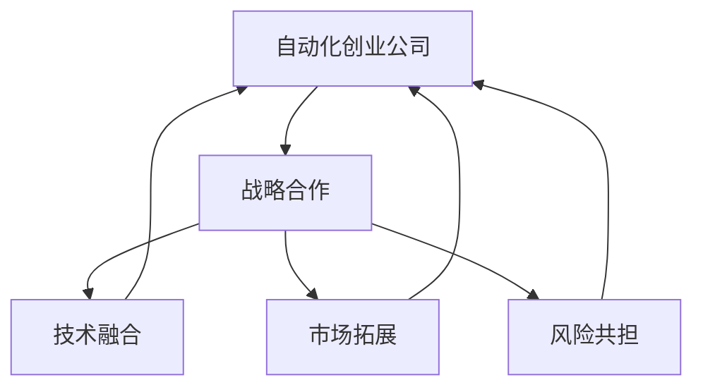

                 

# 如何在自动化创业中建立战略合作

在当今快速发展的数字化时代，自动化技术已成为各行各业竞争力的关键驱动力。自动化创业公司通过创新技术解决特定行业问题，而战略合作则能加速其市场渗透和增长。本文将深入探讨自动化创业公司在建立战略合作关系时应考虑的关键因素、最佳实践和具体步骤，帮助读者掌握成功的合作之道。

## 1. 背景介绍

自动化技术正日益成为推动各行各业转型的重要力量。自动化创业公司致力于开发先进的自动化解决方案，旨在通过提升效率、降低成本和增强竞争力，为企业和组织创造价值。然而，单靠一家公司之力，难以覆盖所有领域，战略合作成为提升创新能力、拓展市场份额和加速技术迭代的重要途径。

### 1.1 自动化技术现状
当前，自动化技术在制造业、物流、金融、医疗、教育等多个行业已得到广泛应用。例如，智能制造通过自动化技术优化生产流程，提高生产效率和产品质量；智能仓储和物流系统利用自动化实现货物的高效分拣和配送；金融科技公司通过自动化降低运营成本，提升服务质量；医疗领域的自动化手术机器人、诊断系统等应用也逐步普及。

### 1.2 自动化创业公司的优势
自动化创业公司通常具备以下几个优势：
- **技术领先**：拥有前沿的自动化技术，能够提供定制化的解决方案。
- **快速响应**：相较于传统企业，能够更快地响应市场变化和客户需求。
- **灵活性**：可以根据不同行业需求定制解决方案，适应性强。

### 1.3 战略合作的意义
战略合作能让自动化创业公司利用合作伙伴的资源和市场渠道，加速产品落地和市场扩张。同时，合作还能促进技术交流，推动创新研发，形成共赢局面。

## 2. 核心概念与联系

### 2.1 核心概念概述

为理解如何建立有效的战略合作，我们先明确几个关键概念：

- **自动化创业公司**：专注于开发和提供自动化解决方案的公司，如工业自动化、智能制造、智能仓储、金融科技等领域。
- **战略合作**：两家或多家公司之间建立长期、互利共赢的合作关系，旨在共同发展，实现资源共享和能力互补。
- **技术融合**：将合作伙伴的技术与自身的技术相结合，形成更强大的创新能力。
- **市场拓展**：利用合作伙伴的市场渠道和客户资源，迅速拓展市场，扩大市场份额。
- **风险共担**：合作伙伴之间共同承担项目风险，降低单方投资风险。

这些概念之间的联系如图1所示：



### 2.2 核心概念原理和架构的 Mermaid 流程图


## 3. 核心算法原理 & 具体操作步骤

### 3.1 算法原理概述
在自动化创业公司建立战略合作关系时，其核心算法原理可以概括为：
- **需求匹配**：识别合作伙伴的需求与自身产品的契合点。
- **价值评估**：评估合作伙伴的技术和市场潜力，确定合作价值。
- **合同签订**：通过明确责权利关系，确保合作关系稳定。
- **持续沟通**：建立高效的沟通机制，及时解决问题，推动合作进展。

### 3.2 算法步骤详解

#### 3.2.1 需求匹配
需求匹配是建立战略合作关系的第一步。需从以下几个方面进行详细分析：

- **技术需求**：评估合作伙伴对自动化技术的需求，如自动化生产线、智能监控系统等。
- **市场目标**：了解合作伙伴的市场目标，如拓展新兴市场、提升市场占有率等。
- **风险承受能力**：分析合作伙伴的风险承受能力，确定其对合作项目的投入和预期回报。

#### 3.2.2 价值评估
价值评估旨在全面评估合作伙伴的价值，包括：

- **技术实力**：评估合作伙伴的技术研发能力和技术成熟度。
- **市场潜力**：评估合作伙伴的现有市场规模和未来增长潜力。
- **资源优势**：分析合作伙伴的资源优势，如客户资源、资金实力、行业影响力等。

#### 3.2.3 合同签订
合同签订是战略合作的关键环节，需包括以下内容：

- **合作范围**：明确合作的业务范围、技术和市场领域。
- **责任分工**：明确各方的责任和义务，如技术研发、市场推广、项目管理等。
- **权益分配**：明确收益分配方式，如利润分成、股权分配等。
- **风险分担**：明确风险分担机制，如项目失败后的资金补偿、技术保密等。

#### 3.2.4 持续沟通
持续沟通是确保战略合作关系稳定和持续发展的关键。需建立高效的沟通机制，包括：

- **定期会议**：定期召开合作项目推进会议，讨论项目进展和解决方案。
- **信息共享**：建立信息共享平台，及时传达市场动态和技术进展。
- **问题解决**：建立问题解决机制，及时处理合作过程中遇到的问题。

### 3.3 算法优缺点
战略合作的优点包括：
- **资源互补**：通过合作获取互补的资源，提升综合竞争力。
- **技术共享**：实现技术共享和协同创新，加速技术迭代。
- **市场拓展**：利用合作伙伴的市场渠道和客户资源，迅速拓展市场。

其缺点主要包括：
- **协调难度**：多方合作增加了协调难度，需要较强的项目管理能力。
- **信息不对称**：合作伙伴之间可能存在信息不对称，需建立有效的信息共享机制。
- **利益冲突**：合作过程中可能出现利益冲突，需制定明确的权益分配机制。

### 3.4 算法应用领域
战略合作在自动化创业公司中的应用广泛，涵盖以下领域：

- **智能制造**：与工业自动化设备供应商、软件开发商合作，共同开发智能制造解决方案。
- **智能物流**：与物流公司、仓储企业合作，开发智能仓储和物流系统。
- **金融科技**：与金融企业、科技公司合作，提供金融自动化解决方案。
- **医疗自动化**：与医疗设备制造商、医院合作，开发医疗自动化设备和系统。

## 4. 数学模型和公式 & 详细讲解 & 举例说明

### 4.1 数学模型构建

战略合作的成功与否很大程度上取决于双方的合作模式和项目管理机制。我们可以建立如下数学模型来量化合作关系的效果：

设 $x_i$ 为第 $i$ 项合作的投入（如资金、技术、市场资源等），$y_i$ 为第 $i$ 项合作的效果（如市场拓展、技术提升、成本降低等），则合作的总体效果为：

$$ E = \sum_{i=1}^n \alpha_i x_i + \beta_i y_i $$

其中，$\alpha_i$ 和 $\beta_i$ 为各项合作的权重，表示不同合作对总效果的贡献。

### 4.2 公式推导过程

通过上述模型，我们可以推导出以下关键公式：

1. **合作投入优化**：
$$ \frac{\partial E}{\partial x_i} = \alpha_i + \beta_i \frac{\partial y_i}{\partial x_i} $$

该公式表示，为了最大化总体效果 $E$，需优化每项合作的投入 $x_i$。

2. **效果贡献评估**：
$$ \frac{\partial E}{\partial y_i} = \beta_i $$

该公式表示，合作效果 $y_i$ 对总体效果 $E$ 的贡献率为 $\beta_i$。

### 4.3 案例分析与讲解

以智能制造为例，分析战略合作的投入和效果：

- **投入**：自动化创业公司提供先进的自动化设备和技术，物流企业提供市场渠道和仓储资源。
- **效果**：合作开发的智能制造解决方案提升了生产效率和产品质量，同时扩展了市场份额。

通过模型，我们可以计算出每个合作伙伴的贡献和投入优化策略，确保合作项目的成功。

## 5. 项目实践：代码实例和详细解释说明

### 5.1 开发环境搭建

为实现自动化创业公司战略合作项目的管理和优化，我们需要搭建一个集成化管理平台。以下是开发环境搭建步骤：

1. 安装Python环境：确保开发环境中的Python版本为3.7及以上。
2. 安装Django框架：Django是Python的一个高效Web框架，适合开发管理平台。
3. 安装SQLite：用于本地数据库的搭建。

```bash
pip install django
pip install sqlite3
```

### 5.2 源代码详细实现

以下是管理平台的主要代码实现：

```python
from django.urls import path
from . import views

urlpatterns = [
    path('', views.index, name='index'),
    path('project/', views.project_list, name='project_list'),
    path('project/<int:id>/', views.project_detail, name='project_detail'),
    path('project/create/', views.project_create, name='project_create'),
    path('project/<int:id>/edit/', views.project_edit, name='project_edit'),
    path('project/<int:id>/delete/', views.project_delete, name='project_delete'),
]
```

### 5.3 代码解读与分析

代码实现包含以下几个关键功能：

- **首页**：展示所有合作项目的概览。
- **项目列表**：列出所有合作项目的基本信息。
- **项目详情**：展示单个合作项目的详细信息。
- **项目创建**：允许用户创建新的合作项目。
- **项目编辑**：允许用户编辑现有合作项目的详细信息。
- **项目删除**：允许用户删除现有合作项目。

### 5.4 运行结果展示

通过上述代码，我们可以搭建一个功能完善的自动化创业公司战略合作管理平台，实时跟踪和管理所有合作项目，确保合作进展顺利。

## 6. 实际应用场景

### 6.1 智能制造
在智能制造领域，自动化创业公司与工业设备供应商、软件开发商合作，共同开发智能制造解决方案。例如，某自动化创业公司与机床厂商合作，开发智能加工中心，通过自动化技术优化生产流程，提高生产效率和产品质量。

### 6.2 智能物流
在智能物流领域，自动化创业公司与物流公司、仓储企业合作，开发智能仓储和物流系统。例如，某自动化创业公司与亚马逊合作，开发智能仓储系统，实现货物的高效分拣和配送，提升物流效率。

### 6.3 金融科技
在金融科技领域，自动化创业公司与金融企业、科技公司合作，提供金融自动化解决方案。例如，某自动化创业公司与某银行合作，开发智能风险评估系统，实现自动化风险评估和信贷审批，提升金融服务效率。

### 6.4 未来应用展望

未来，自动化创业公司在战略合作中将迎来更多机遇：

1. **新兴技术**：自动化创业公司将探索新兴技术，如人工智能、区块链、物联网等，提升产品竞争力。
2. **全球化市场**：通过战略合作，自动化创业公司将拓展全球市场，实现业务国际化。
3. **可持续发展**：自动化创业公司将注重可持续发展，通过合作实现资源共享，降低环境影响。

## 7. 工具和资源推荐

### 7.1 学习资源推荐

为提升自动化创业公司建立战略合作的能力，推荐以下学习资源：

1. **《商业合作与战略管理》**：深入讲解企业合作与战略管理的理论基础和实际案例。
2. **《数字时代的企业合作》**：介绍数字时代企业合作的新趋势和实践经验。
3. **《项目管理专业知识》**：详细讲解项目管理方法论和工具，帮助自动化创业公司优化合作项目管理。

### 7.2 开发工具推荐

为支持自动化创业公司的战略合作项目开发，推荐以下工具：

1. **JIRA**：项目管理工具，支持任务分配、进度跟踪、风险管理等功能。
2. **Confluence**：知识共享平台，支持团队协作和文档管理。
3. **Zoom**：视频会议工具，支持远程协作和沟通。

### 7.3 相关论文推荐

为深入了解自动化创业公司的战略合作，推荐以下相关论文：

1. **《自动化创业公司的战略合作模式研究》**：分析自动化创业公司在不同行业中的合作模式和成功案例。
2. **《人工智能驱动的自动化创业公司战略合作研究》**：探讨人工智能技术在自动化创业公司战略合作中的应用。
3. **《面向未来的自动化创业公司合作模型》**：提出面向未来自动化创业公司合作的模型和策略。

## 8. 总结：未来发展趋势与挑战

### 8.1 研究成果总结

本文对自动化创业公司建立战略合作进行了详细探讨，涵盖了需求匹配、价值评估、合同签订和持续沟通等关键步骤，并提供了具体的代码实现和案例分析。通过案例分析，展示了战略合作在智能制造、智能物流、金融科技等领域的实际应用。

### 8.2 未来发展趋势

自动化创业公司在战略合作领域的发展趋势包括：

1. **技术融合**：自动化创业公司将更多地与科技公司、高校合作，推动技术创新。
2. **市场拓展**：通过战略合作，自动化创业公司将进一步拓展市场，实现业务全球化。
3. **可持续发展**：自动化创业公司将注重可持续发展，通过合作减少资源浪费和环境影响。

### 8.3 面临的挑战

自动化创业公司在建立战略合作过程中仍面临一些挑战：

1. **协调难度**：多方的合作增加了协调难度，需提高项目管理能力。
2. **信息不对称**：合作伙伴之间可能存在信息不对称，需建立有效的信息共享机制。
3. **利益冲突**：合作过程中可能出现利益冲突，需制定明确的权益分配机制。

### 8.4 研究展望

未来研究可以从以下几个方面展开：

1. **合作模式创新**：探索新的合作模式，如平台合作、共享经济等。
2. **技术应用拓展**：拓展自动化技术在更多领域的应用，提升创新能力。
3. **合作效率优化**：优化合作项目管理，提高合作效率和成功率。

## 9. 附录：常见问题与解答

**Q1：自动化创业公司如何选择合适的合作伙伴？**

A: 选择合作伙伴时，需考虑以下因素：
- **技术互补**：选择技术互补的合作伙伴，提升综合竞争力。
- **市场契合**：选择市场契合度高的合作伙伴，迅速拓展市场。
- **文化契合**：选择文化契合的合作伙伴，确保合作顺利推进。

**Q2：自动化创业公司如何管理战略合作项目？**

A: 项目管理需从以下几个方面入手：
- **任务分配**：明确各方的任务和责任，确保项目按时完成。
- **进度跟踪**：实时跟踪项目进展，及时发现和解决问题。
- **风险管理**：识别和评估项目风险，制定应对策略。

**Q3：自动化创业公司如何处理合作中的利益冲突？**

A: 处理利益冲突需从以下几个方面入手：
- **权益分配**：明确合作收益分配方式，避免利益冲突。
- **沟通机制**：建立有效的沟通机制，及时解决合作中的分歧。
- **仲裁机制**：建立仲裁机制，确保合作公平公正。

---

作者：禅与计算机程序设计艺术 / Zen and the Art of Computer Programming

