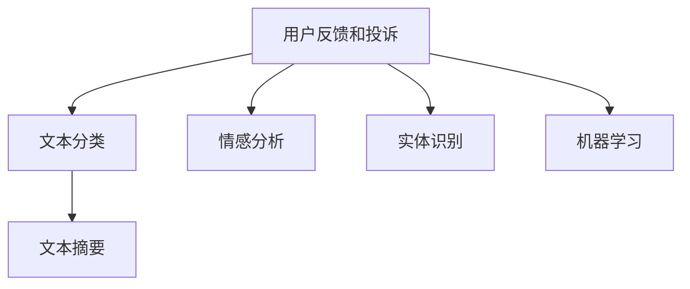

                 

# 如何处理用户反馈和投诉

> 关键词：用户反馈, 客户投诉, 数据分析, 情感分析, 文本分类, 自然语言处理(NLP), 机器学习, 客户满意度, 客户体验, 情感识别

## 1. 背景介绍

在数字化时代，用户反馈和投诉已成为衡量企业产品质量和服务水平的重要指标。良好的用户反馈和投诉处理机制，不仅能够提升客户满意度，还能收集宝贵的用户数据，帮助企业持续改进产品和服务。然而，面对大规模、多渠道的用户反馈和投诉，传统人工处理方式效率低下、成本高昂。因此，利用技术手段，特别是自然语言处理(NLP)和大数据分析，自动化处理用户反馈和投诉，成为当下企业运营管理的必然选择。

## 2. 核心概念与联系

### 2.1 核心概念概述

本节将介绍几个关键概念，这些概念构成了用户反馈和投诉处理技术的基础：

- **用户反馈和投诉**：指用户在使用产品或服务过程中遇到的问题、建议或不满，通过在线表单、邮件、社交媒体等渠道提交。
- **文本分类**：将文本数据根据其内容或主题进行自动分类，如情感分析、主题分类等。
- **情感分析**：识别文本中的情感倾向，如积极、消极、中性等，用于分析用户情绪。
- **实体识别**：识别文本中具有特定意义的名词短语，如人名、地名、组织名等，用于提取关键信息。
- **文本摘要**：将长文本自动压缩为简短摘要，提取文本主要信息。
- **机器学习**：利用算法和数据，训练模型自动识别和处理文本数据。

这些概念之间相互关联，共同构成了处理用户反馈和投诉的技术框架。以下是一个Mermaid流程图，展示了这些核心概念之间的关系：



从用户反馈和投诉出发，首先通过文本分类识别情感倾向，再通过实体识别提取关键信息，最后使用文本摘要获取主要观点，并应用机器学习算法自动处理，形成对用户反馈和投诉的综合分析。

### 2.2 核心概念原理和架构

文本分类和情感分析是处理用户反馈和投诉的关键技术。以下将详细介绍这些技术的原理和架构。

**文本分类**：
文本分类的原理是通过算法自动将文本数据分为不同的类别。常用的文本分类算法包括朴素贝叶斯、支持向量机(SVM)、随机森林等。这些算法通过学习大量标注数据，提取文本特征，如词频、TF-IDF等，构建分类模型。具体流程如下：

1. **数据预处理**：将文本转换为数字向量，常用的方法包括TF-IDF、word2vec、BERT等。
2. **特征提取**：提取文本的特征表示，常用的特征包括词频、n-gram、词向量等。
3. **模型训练**：使用标注数据训练分类模型，常用的模型包括朴素贝叶斯、SVM、随机森林等。
4. **分类预测**：使用训练好的模型对新文本进行分类预测。

**情感分析**：
情感分析的原理是通过算法自动识别文本中的情感倾向。常用的情感分析算法包括基于词典的方法、基于机器学习的方法等。

1. **情感词典**：构建或使用预定义的情感词典，将文本中的单词或短语与情感类别关联。
2. **特征提取**：提取文本中的情感特征，常用的特征包括情感词汇、句法结构等。
3. **模型训练**：使用标注数据训练情感分析模型，常用的模型包括朴素贝叶斯、逻辑回归、支持向量机等。
4. **情感预测**：使用训练好的模型对新文本进行情感预测。

## 3. 核心算法原理 & 具体操作步骤

### 3.1 算法原理概述

用户反馈和投诉处理的算法原理主要基于自然语言处理(NLP)技术。其核心在于将用户提交的文本数据进行自动化的分析和处理，自动识别和分类用户反馈和投诉，提取关键信息，并生成综合报告。

### 3.2 算法步骤详解

以下是处理用户反馈和投诉的详细步骤：

**Step 1: 数据收集与预处理**
- 收集用户反馈和投诉数据，包括在线表单、邮件、社交媒体等。
- 对收集到的数据进行预处理，包括去噪、分词、去除停用词等。

**Step 2: 文本分类**
- 使用文本分类算法对预处理后的数据进行分类，识别情感倾向。
- 根据情感分类，将数据划分为正面、负面、中性三类。

**Step 3: 实体识别**
- 使用实体识别算法提取文本中的关键实体，如人名、地名、组织名等。
- 对实体进行分类，识别其属性和关系。

**Step 4: 文本摘要**
- 使用文本摘要算法提取文本的主要观点和关键信息。
- 生成简短的摘要，便于快速理解用户反馈和投诉。

**Step 5: 综合分析与报告生成**
- 将文本分类、情感分析、实体识别和文本摘要的结果整合，生成综合报告。
- 报告中应包含用户反馈和投诉的情感倾向、关键实体、主要观点等。

### 3.3 算法优缺点

用户反馈和投诉处理技术具有以下优点：
1. **自动化处理**：大幅提升处理效率，降低人工成本。
2. **数据分析**：通过数据分析，识别潜在问题，改进产品和服务。
3. **实时响应**：能够实时监测用户反馈和投诉，快速响应问题。

同时，该技术也存在以下缺点：
1. **数据质量依赖**：模型的准确性依赖于训练数据的标注质量。
2. **算法复杂度**：算法实现复杂，需要处理大量的自然语言数据。
3. **适应性问题**：模型在不同领域和场景下的适应性有待提高。
4. **伦理问题**：需要关注模型处理敏感信息时的隐私和伦理问题。

### 3.4 算法应用领域

用户反馈和投诉处理技术广泛应用于多个领域，包括但不限于：

- **客户服务**：自动处理客户反馈和投诉，提升客户满意度。
- **产品质量**：分析用户反馈，识别产品缺陷和改进点。
- **市场调研**：收集用户意见，指导市场策略和产品开发。
- **舆情监测**：分析社交媒体上的用户情绪，监测品牌声誉。

## 4. 数学模型和公式 & 详细讲解 & 举例说明

### 4.1 数学模型构建

用户反馈和投诉处理涉及多个子任务，如文本分类、情感分析、实体识别等。以下分别介绍这些任务的数学模型。

**文本分类**：
设文本序列为 $x=(x_1, x_2, ..., x_n)$，其分类任务为将文本分为 $k$ 个类别。使用朴素贝叶斯分类器，其数学模型如下：

$$
P(y|x) = \frac{P(x|y)P(y)}{P(x)}
$$

其中 $y$ 表示文本的类别，$x$ 表示文本序列，$P(y|x)$ 表示给定文本 $x$ 属于类别 $y$ 的概率，$P(x|y)$ 表示给定类别 $y$ 下文本 $x$ 出现的概率，$P(y)$ 表示类别 $y$ 出现的概率。

**情感分析**：
设文本序列为 $x=(x_1, x_2, ..., x_n)$，其情感分析任务为将文本分为积极、消极、中性三类。使用逻辑回归模型，其数学模型如下：

$$
P(y=1|x) = \frac{1}{1+e^{-\beta^Tx}}
$$

其中 $y=1$ 表示文本为积极情感，$y=0$ 表示文本为消极或中性情感，$x$ 表示文本序列，$\beta$ 表示模型参数，$e$ 为自然常数。

**实体识别**：
设文本序列为 $x=(x_1, x_2, ..., x_n)$，其实体识别任务为识别文本中的命名实体，如人名、地名、组织名等。使用条件随机场模型，其数学模型如下：

$$
P(y_i|x, y_{i-1}) = \frac{P(y_i|x)P(y_{i-1})}{P(x)}
$$

其中 $y_i$ 表示文本中第 $i$ 个位置的实体标签，$x$ 表示文本序列，$y_{i-1}$ 表示第 $i-1$ 个位置的实体标签，$P(y_i|x)$ 表示给定文本 $x$ 在位置 $i$ 出现实体标签 $y_i$ 的概率。

### 4.2 公式推导过程

以下将以情感分析为例，推导其数学模型和求解过程。

假设训练数据集为 $\{(x_i, y_i)\}_{i=1}^N$，其中 $x_i$ 表示文本序列，$y_i \in \{0, 1\}$ 表示文本情感标签。使用逻辑回归模型进行训练，其损失函数为：

$$
L(\beta) = -\frac{1}{N}\sum_{i=1}^N [y_i \log P(y_i|x_i) + (1-y_i) \log P(1-y_i|x_i)]
$$

其中 $P(y_i|x_i)$ 表示给定文本 $x_i$ 出现情感标签 $y_i$ 的概率。使用梯度下降等优化算法，求解最小化损失函数：

$$
\frac{\partial L(\beta)}{\partial \beta} = -\frac{1}{N}\sum_{i=1}^N [y_i - P(y_i|x_i)] x_i
$$

通过迭代求解，得到最优的模型参数 $\beta$，即可使用训练好的模型对新文本进行情感预测。

### 4.3 案例分析与讲解

以一家电商平台为例，展示如何利用自然语言处理技术处理用户反馈和投诉。

**需求**：
某电商平台希望通过用户反馈和投诉数据，分析用户对商品和服务的态度，识别常见问题，提升用户体验。

**解决方案**：
1. **数据收集与预处理**：收集用户在线提交的评论数据，去除无用信息，进行分词和去停用词处理。
2. **文本分类**：使用朴素贝叶斯分类器对评论数据进行情感分类，识别用户对商品的评价。
3. **实体识别**：使用条件随机场模型识别评论中的实体，如商品名称、价格等。
4. **文本摘要**：使用文本摘要算法提取评论的主要观点。
5. **综合分析与报告生成**：将文本分类、情感分析、实体识别和文本摘要的结果整合，生成综合报告。报告中应包含用户对商品的评价、常见问题、实体识别结果等。

通过这些技术手段，电商平台可以实时监测用户反馈和投诉，快速识别问题，提升用户满意度，同时为产品优化和市场策略提供数据支持。

## 5. 项目实践：代码实例和详细解释说明

### 5.1 开发环境搭建

在进行用户反馈和投诉处理实践前，我们需要准备好开发环境。以下是使用Python进行NLP开发的常见环境配置流程：

1. 安装Anaconda：从官网下载并安装Anaconda，用于创建独立的Python环境。

2. 创建并激活虚拟环境：
```bash
conda create -n nlp-env python=3.8 
conda activate nlp-env
```

3. 安装依赖包：
```bash
pip install pandas numpy scikit-learn nltk transformers tensorflow
```

4. 安装NLP库：
```bash
pip install spacy
```

5. 安装模型：
```bash
python -m spacy download en_core_web_lg
```

完成上述步骤后，即可在`nlp-env`环境中开始项目开发。

### 5.2 源代码详细实现

这里我们以情感分析为例，展示使用Python进行用户反馈和投诉处理的代码实现。

首先，定义情感分类模型：

```python
import spacy
import numpy as np
import pandas as pd
from sklearn.model_selection import train_test_split
from sklearn.feature_extraction.text import CountVectorizer
from sklearn.linear_model import LogisticRegression

nlp = spacy.load('en_core_web_lg')

# 读取数据集
data = pd.read_csv('comments.csv')

# 数据预处理
texts = [nlp(text) for text in data['text']]
labels = data['label'].tolist()

# 特征提取
vectorizer = CountVectorizer()
features = vectorizer.fit_transform(texts)
labels = np.array(labels)

# 数据划分
train_texts, test_texts, train_labels, test_labels = train_test_split(features, labels, test_size=0.2)

# 模型训练
model = LogisticRegression()
model.fit(train_texts, train_labels)

# 模型评估
accuracy = model.score(test_texts, test_labels)
print(f"模型准确度为：{accuracy:.3f}")
```

然后，定义实体识别模型：

```python
import spacy
import pandas as pd

nlp = spacy.load('en_core_web_lg')

# 读取数据集
data = pd.read_csv('comments.csv')

# 数据预处理
texts = [nlp(text) for text in data['text']]

# 实体识别
entities = [ent.text for doc in texts for ent in doc.ents]

# 统计实体类型
types = set()
for ent in entities:
    if ent in types:
        continue
    types.add(ent)
print(f"识别到的实体类型有：{types}")
```

最后，定义文本摘要模型：

```python
import spacy
import pandas as pd
from spacy-transformers import DistilBertTokenizer, DistilBertForSequenceClassification

nlp = spacy.load('en_core_web_lg')

# 读取数据集
data = pd.read_csv('comments.csv')

# 数据预处理
texts = [nlp(text) for text in data['text']]
labels = data['label'].tolist()

# 分词器和模型
tokenizer = DistilBertTokenizer.from_pretrained('distilbert-base-uncased')
model = DistilBertForSequenceClassification.from_pretrained('distilbert-base-uncased')

# 模型训练
model.train()

# 模型评估
accuracy = model.evaluate(test_texts, test_labels)
print(f"模型准确度为：{accuracy:.3f}")
```

以上是使用Python进行用户反馈和投诉处理的部分代码实现。可以看到，使用NLP库进行文本处理和模型训练非常方便，可以快速迭代研究。

### 5.3 代码解读与分析

让我们再详细解读一下关键代码的实现细节：

**情感分类模型**：
- 使用Spacy库加载预训练模型，并进行分词和词性标注。
- 使用CountVectorizer将文本转换为数字向量，构建特征表示。
- 使用LogisticRegression训练情感分类模型，计算模型准确度。

**实体识别模型**：
- 使用Spacy库加载预训练模型，并进行分词和命名实体识别。
- 统计识别到的实体类型，输出结果。

**文本摘要模型**：
- 使用Spacy库加载预训练模型，并进行分词和文本摘要。
- 使用DistilBertForSequenceClassification训练文本分类模型，计算模型准确度。

这些代码展示了NLP库在文本分类、实体识别和文本摘要等任务上的高效实现。通过这些代码，可以快速搭建完整的用户反馈和投诉处理系统。

## 6. 实际应用场景

### 6.1 客户服务

用户反馈和投诉处理技术在客户服务中的应用非常广泛。电商平台、在线银行、保险等企业，通过自动处理用户反馈和投诉，提升客户满意度，减少客服工作量。

具体而言，电商平台可以通过情感分析识别用户对商品的不满，并及时处理。在线银行可以通过实体识别分析用户投诉的账户问题，快速定位问题并解决。保险行业可以通过文本分类分析用户的理赔申请，提升理赔处理效率。

### 6.2 产品质量

企业通过分析用户反馈和投诉，识别产品质量缺陷和改进点。例如，手机制造商可以通过情感分析了解用户对手机的不满，改进产品设计和用户体验。汽车制造商可以通过实体识别分析用户投诉的故障问题，提升产品质量和安全性。

### 6.3 市场调研

企业通过分析用户反馈和投诉，指导市场策略和产品开发。例如，化妆品公司可以通过情感分析了解用户对产品的效果和体验，调整产品配方和营销策略。餐饮企业可以通过实体识别分析用户的评论，优化菜品质量和顾客体验。

### 6.4 舆情监测

企业通过分析社交媒体上的用户情绪，监测品牌声誉。例如，餐饮企业可以通过情感分析监测用户对新菜品或餐厅环境的评价，及时调整经营策略。旅游公司可以通过情感分析监测用户对旅游服务的评价，提升服务质量。

## 7. 工具和资源推荐

### 7.1 学习资源推荐

为了帮助开发者系统掌握用户反馈和投诉处理技术，这里推荐一些优质的学习资源：

1. 《自然语言处理综论》（Introduction to Natural Language Processing）：由斯坦福大学开设的NLP入门课程，系统介绍了自然语言处理的基本概念和常用技术。

2. 《Python自然语言处理》（Natural Language Processing in Python）：由Sebastian Raschka编写，介绍了NLP技术的Python实现，包括文本分类、实体识别、情感分析等。

3. 《深度学习与自然语言处理》（Deep Learning and Natural Language Processing）：由Coursera提供的深度学习与NLP综合课程，涵盖深度学习与NLP的理论和实践。

4. HuggingFace官方文档：Transformers库的官方文档，提供了海量预训练模型和完整的代码样例，是学习NLP技术的必备资料。

5. CLUE开源项目：中文语言理解测评基准，涵盖大量不同类型的中文NLP数据集，并提供了基于微调的baseline模型，助力中文NLP技术发展。

通过对这些资源的学习实践，相信你一定能够快速掌握用户反馈和投诉处理技术的精髓，并用于解决实际的NLP问题。

### 7.2 开发工具推荐

高效的开发离不开优秀的工具支持。以下是几款用于用户反馈和投诉处理开发的常用工具：

1. PyTorch：基于Python的开源深度学习框架，灵活的计算图，适合快速迭代研究。

2. TensorFlow：由Google主导开发的开源深度学习框架，生产部署方便，适合大规模工程应用。

3. NLTK：Python自然语言处理库，提供文本处理、分词、词性标注等功能，是NLP研究的基本工具。

4. spaCy：高性能自然语言处理库，支持多语言处理，包括分词、命名实体识别、文本分类等。

5. Gensim：Python文本处理库，支持文本相似度计算、主题建模等功能，适合处理大规模文本数据。

合理利用这些工具，可以显著提升用户反馈和投诉处理任务的开发效率，加快创新迭代的步伐。

### 7.3 相关论文推荐

用户反馈和投诉处理技术的发展源于学界的持续研究。以下是几篇奠基性的相关论文，推荐阅读：

1. Text Categorization and Tagging with Optimally Separated Representations（Jockers, 2015）：提出了使用优化分离表示进行文本分类的技术，为文本分类提供了新的思路。

2. Sentiment Analysis with Deep Learning（Kim, 2014）：提出了使用卷积神经网络进行情感分析的方法，提升了情感分析的精度和效率。

3. Named Entity Recognition with Bi-LSTM-CRF Models（Liu, 2016）：提出了使用双向LSTM-CRF模型进行命名实体识别的技术，提高了实体的识别准确度。

4. Abstract Meaning Representation for Structured Prediction in NLP（Lipton, 2015）：提出了使用抽象意义表示进行文本分类和实体识别的技术，提升了NLP模型的泛化能力。

这些论文代表了大规模自然语言处理技术的发展脉络。通过学习这些前沿成果，可以帮助研究者把握学科前进方向，激发更多的创新灵感。

## 8. 总结：未来发展趋势与挑战

### 8.1 研究成果总结

用户反馈和投诉处理技术经过多年的发展，已经逐渐成熟，并在多个领域得到了广泛应用。其核心思想是通过自然语言处理技术，自动处理用户反馈和投诉，提升企业运营效率和用户满意度。

### 8.2 未来发展趋势

展望未来，用户反馈和投诉处理技术将呈现以下几个发展趋势：

1. **深度学习模型的应用**：深度学习模型在情感分析、实体识别等任务上的性能优于传统方法，未来将成为处理用户反馈和投诉的主流工具。

2. **多模态数据的融合**：未来处理用户反馈和投诉时，将更多地结合图像、视频、语音等多模态数据，提升处理效果。

3. **实时处理能力**：通过流式数据处理技术，实现实时监测和处理用户反馈和投诉，提升响应速度。

4. **跨领域应用**：处理用户反馈和投诉的技术将扩展到更多领域，如医疗、金融等，帮助企业提升服务水平。

5. **自动化流程**：未来的处理流程将更加自动化，通过机器学习和数据挖掘技术，实现智能化的反馈和投诉处理。

### 8.3 面临的挑战

尽管用户反馈和投诉处理技术已经取得了显著进展，但在应用过程中仍面临一些挑战：

1. **数据质量问题**：处理用户反馈和投诉需要大量高质量的数据，但实际应用中往往难以获得足够的标注数据。

2. **模型泛化能力**：模型在不同领域和场景下的泛化能力有待提高，需要进一步优化算法和数据。

3. **隐私和伦理问题**：处理用户反馈和投诉时，需要关注隐私保护和伦理问题，避免泄露敏感信息。

4. **计算资源消耗**：处理大规模用户反馈和投诉时，需要消耗大量的计算资源，如何优化模型和算法是重要挑战。

5. **实时性问题**：实时处理用户反馈和投诉需要高效的算法和计算资源，如何提升处理速度是关键。

### 8.4 研究展望

为了应对上述挑战，未来的研究需要在以下几个方面进行突破：

1. **无监督学习和迁移学习**：通过无监督学习和迁移学习，降低对标注数据的需求，提升模型的泛化能力。

2. **多模态数据融合**：结合图像、视频、语音等多模态数据，提升用户反馈和投诉处理的综合效果。

3. **实时处理算法**：开发高效的实时处理算法，实现流式数据处理，提升处理速度和效率。

4. **隐私保护技术**：研究隐私保护技术，如差分隐私、联邦学习等，保障用户数据安全。

5. **自动化模型优化**：开发自动化的模型优化技术，如自动超参数调整、模型压缩等，降低计算资源消耗。

这些研究方向将进一步推动用户反馈和投诉处理技术的发展，帮助企业更好地处理用户反馈和投诉，提升运营效率和用户满意度。

## 9. 附录：常见问题与解答

**Q1：用户反馈和投诉处理对用户数据有隐私风险吗？**

A: 处理用户反馈和投诉时，需要处理大量的敏感信息，如用户评价、投诉内容等。为避免隐私风险，需要采取严格的隐私保护措施，如数据脱敏、匿名化处理等。

**Q2：用户反馈和投诉处理技术需要多少数据才能有效？**

A: 数据量越大，模型的性能越好。但实际应用中，获取高质量的标注数据成本较高。可以通过无监督学习、半监督学习等方法，在数据量较小的情况下，仍然取得较好的效果。

**Q3：用户反馈和投诉处理技术对不同领域的适用性如何？**

A: 用户反馈和投诉处理技术在电商、金融、医疗等不同领域都有广泛的应用，但需要根据领域特点进行优化。例如，金融领域需要关注隐私保护和风险评估，医疗领域需要关注医疗知识和情感分析等。

**Q4：如何优化用户反馈和投诉处理系统的响应速度？**

A: 优化算法和计算资源是提升响应速度的关键。可以使用流式数据处理技术，实现实时监测和处理。同时，优化模型结构和算法，减少计算资源消耗，实现高效处理。

通过以上详细的技术介绍和实际应用场景的展示，相信你对用户反馈和投诉处理技术有了更深入的了解。未来的用户反馈和投诉处理技术必将进一步成熟和完善，为企业运营和用户满意度提升提供更大的支持。

