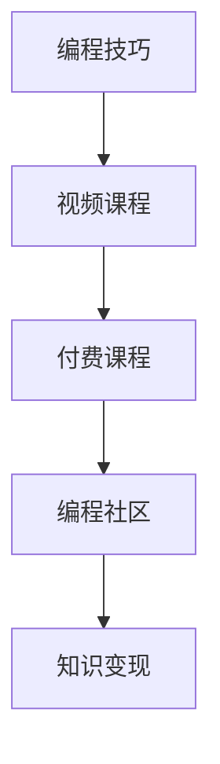

                 

# 如何将编程技巧转化为付费视频课程

## 1. 背景介绍

### 1.1 问题由来
随着互联网的普及和信息技术的快速发展，在线教育成为教育领域的新兴趋势。尤其是在编程学习领域，人们可以通过各种在线平台，如Coursera、Udemy、Bilibili等，接触到全球顶尖的编程课程和实践资源。这种新的教育模式，不仅打破了传统教育的时空限制，还为教师和内容创作者提供了新的盈利机会。通过将编程技巧转化为付费视频课程，编程爱好者和从业者可以分享自己的知识和经验，同时也能够获得收益。

### 1.2 问题核心关键点
将编程技巧转化为付费视频课程，本质上是将专业知识和技能封装成易于理解和应用的学习资源。这一过程需要深入理解编程的原理、架构、语言特性、最佳实践等核心概念，并将这些知识通过生动、有趣、易懂的讲解呈现出来。课程内容需要具备高度的实用性、互动性和趣味性，以吸引学习者的兴趣，提升学习效果。

### 1.3 问题研究意义
将编程技巧转化为付费视频课程，不仅有助于知识传播和技能普及，还能促进编程社区的繁荣和成长。对于内容创作者来说，通过课程销售和订阅收入，可以获得额外的经济支持，进一步激励其持续创新和提升教学质量。此外，高质量的课程资源能够帮助学习者系统地掌握编程技能，提升就业竞争力，为社会经济发展贡献力量。

## 2. 核心概念与联系

### 2.1 核心概念概述

为更好地理解将编程技巧转化为付费视频课程的过程，本节将介绍几个密切相关的核心概念：

- 编程技巧(Programming Skills)：包括但不限于编程语言特性、算法和数据结构、设计模式、代码风格、性能优化等，是程序员在实际编程过程中积累的经验和能力。
- 视频课程(Video Course)：以视频为载体，结合讲解、演示、实操等形式，向学习者传递知识与技能的教育资源。
- 付费课程(Paid Course)：通过在线平台销售或订阅，为课程提供者带来经济收益的学习资源。
- 编程社区(Programming Community)：由编程爱好者、从业者、教师等组成的网络平台，通过交流、分享、合作等方式，共同推动编程技术的发展。
- 知识变现(Knowledge Monetization)：将知识、经验、技能等无形资产转化为有形收益的过程，是教育工作者和内容创作者重要的盈利方式。

这些核心概念之间的逻辑关系可以通过以下Mermaid流程图来展示：



这个流程图展示了几者之间的关系：

1. 编程技巧是课程内容的基础。
2. 视频课程是编程技巧呈现的形式。
3. 付费课程是课程内容变现的手段。
4. 编程社区是课程内容传播和互动的平台。
5. 知识变现是创作者从课程中获得的收益。

这些概念共同构成了将编程技巧转化为付费视频课程的完整流程，使得创作者能够系统地整理和呈现知识，同时也能实现知识的市场化，为编程学习者和从业者提供价值。

## 3. 核心算法原理 & 具体操作步骤

### 3.1 算法原理概述

将编程技巧转化为付费视频课程的过程，可以看作是一种基于知识图谱的迁移学习过程。其核心思想是：将编程技巧视为一种深层的"知识图谱"，通过在视频课程中进行有监督的迁移学习，使得学习者能够掌握这些技巧，并将其应用于实际编程场景中。

形式化地，假设编程技巧为 $K$，课程内容为 $C$，课程形式为 $F$，用户为 $U$。课程转化为付费视频课程的过程可以表示为：

$$
\hat{C}=\mathop{\arg\min}_{C} \mathcal{L}(K,C,F,U)
$$

其中 $\mathcal{L}$ 为课程内容与用户需求的匹配损失函数，衡量课程内容与用户兴趣、学习目标、实际需求之间的契合度。常见的损失函数包括交叉熵损失、平均绝对误差等。

通过梯度下降等优化算法，课程内容不断更新优化，最小化损失函数 $\mathcal{L}$，使得课程内容更加贴近用户需求，最终得到适应目标用户群体的优质视频课程 $\hat{C}$。

### 3.2 算法步骤详解

将编程技巧转化为付费视频课程的一般流程包括以下几个关键步骤：

**Step 1: 确定课程目标与内容**
- 定义课程的目标受众、学习目标、核心知识点、应用场景等，明确课程内容的关键要素。
- 收集和整理相关资料，如编程语言文档、开源项目、技术博客、实践案例等，形成课程的素材库。

**Step 2: 设计课程结构和形式**
- 设计课程的结构框架，包括章节、小节、任务、练习等，合理安排知识点顺序。
- 确定课程形式，如视频、文字、代码演示、互动问答等，选择适合内容的呈现方式。

**Step 3: 制作课程视频**
- 根据课程内容，制作视频讲解，包括问题引入、概念解析、案例分析、实操演示等环节。
- 使用专业的视频编辑软件，如Adobe Premiere、Final Cut Pro等，对视频进行剪辑、配音、字幕、动画等处理，提升观看体验。

**Step 4: 优化课程互动**
- 设计互动环节，如在线问答、编程练习、作业提交等，增加用户参与度。
- 使用在线平台提供的工具和插件，如Quizizz、Kahoot!等，实现实时互动和反馈。

**Step 5: 推广与销售**
- 在各大在线平台发布课程，如Coursera、Udemy、Bilibili等，设置课程价格和优惠政策。
- 利用社交媒体、编程社区、博客等渠道进行课程宣传和推广，吸引潜在用户。

**Step 6: 反馈与迭代**
- 收集用户反馈，评估课程效果，识别改进点。
- 根据用户反馈进行课程内容优化，发布更新版本，持续提升课程质量。

### 3.3 算法优缺点

将编程技巧转化为付费视频课程的方法具有以下优点：
1. 系统化教学。通过结构化、层次化的课程设计，帮助学习者系统掌握编程技巧。
2. 互动性强。课程中设计了各种互动环节，提升学习者的参与度和学习效果。
3. 便捷学习。在线课程不受时间和地点的限制，学习者可以灵活安排学习时间。
4. 知识变现。课程销售和订阅为内容创作者提供经济收益，激励其持续创新。

同时，该方法也存在一些局限性：
1. 课程设计难度高。需要深入理解编程技巧和用户需求，课程内容需经过精心的设计和制作。
2. 课程质量参差不齐。部分内容创作者可能缺乏专业的教学经验，课程质量难以保证。
3. 用户反馈难以量化。用户反馈较为分散，难以进行系统化的分析与改进。
4. 知识传播受限于平台。内容创作者需依赖在线平台进行课程发布和推广，平台规则和限制可能影响课程传播。

尽管存在这些局限性，但将编程技巧转化为付费视频课程的方法依然是大受欢迎的教育模式，帮助无数学习者提升编程技能，促进了编程社区的发展。

### 3.4 算法应用领域

将编程技巧转化为付费视频课程的方法，已在编程教育领域广泛应用，覆盖了从初级到高级的各个层次。具体应用领域包括：

- 编程入门课程：帮助初学者快速掌握编程基础，如Python、JavaScript、Java等语言入门。
- 高级技术课程：深入讲解算法和数据结构、架构设计、性能优化等高级编程技巧。
- 实战项目课程：结合实际项目，进行编程技能的应用和实践，提升解决实际问题的能力。
- 软技能课程：涵盖代码风格、调试技巧、团队协作、项目管理等内容，提升综合编程能力。
- 竞赛和算法课程：针对编程竞赛和算法挑战，提供解题思路、代码实现、策略优化等指导。

除了以上这些经典应用外，将编程技巧转化为付费视频课程的方法也被创新性地应用到更多场景中，如游戏编程、网络安全、人工智能等，为编程教育和技术普及带来了新的活力。

## 4. 数学模型和公式 & 详细讲解 & 举例说明

### 4.1 数学模型构建

本节将使用数学语言对将编程技巧转化为付费视频课程的过程进行更加严格的刻画。

记编程技巧为 $K$，课程内容为 $C$，课程形式为 $F$，用户为 $U$。设课程转化为付费视频课程的过程为 $C \rightarrow \hat{C}$，则课程转化为付费视频课程的目标为：

$$
\hat{C}=\mathop{\arg\min}_{C} \mathcal{L}(K,C,F,U)
$$

其中 $\mathcal{L}$ 为课程内容与用户需求的匹配损失函数，衡量课程内容与用户兴趣、学习目标、实际需求之间的契合度。常见的损失函数包括交叉熵损失、平均绝对误差等。

### 4.2 公式推导过程

以下我们以Python编程入门课程为例，推导课程内容与用户需求的匹配损失函数及其梯度计算公式。

假设课程内容 $C$ 包含了Python语言的基础语法、数据结构、函数调用、模块使用等知识点，形式为视频讲解。用户 $U$ 表示不同水平和背景的学习者，其学习目标为掌握Python编程技能。设 $U$ 的实际需求为 $\mathbf{D}=\{d_i\}_{i=1}^N$，其中 $d_i$ 表示用户 $i$ 对课程内容的需求程度，$0 \leq d_i \leq 1$，$1$ 表示完全满足用户需求。

定义课程内容 $C$ 在用户 $U$ 上的匹配度为 $M_C^U$，衡量课程内容与用户需求的契合度。假设 $M_C^U$ 为连续变量，取值范围为 $[0,1]$。课程内容与用户需求的匹配损失函数 $\mathcal{L}$ 可以表示为：

$$
\mathcal{L}(C)=\frac{1}{N}\sum_{i=1}^N |M_C^U - d_i|^2
$$

其中 $|M_C^U - d_i|^2$ 表示课程内容与用户需求之间的差距，$|M_C^U - d_i|^2$ 越小，课程内容与用户需求的契合度越高。

根据上述损失函数，课程内容 $C$ 的梯度更新公式为：

$$
\frac{\partial \mathcal{L}(C)}{\partial C}=-\frac{2}{N}\sum_{i=1}^N \frac{\partial M_C^U}{\partial C} \cdot (M_C^U - d_i)
$$

其中 $\frac{\partial M_C^U}{\partial C}$ 表示课程内容对匹配度的影响，可通过反传算法计算得到。

在得到梯度后，即可带入梯度下降等优化算法，完成课程内容的迭代优化。重复上述过程直至收敛，最终得到适应目标用户群体的优质视频课程 $\hat{C}$。

### 4.3 案例分析与讲解

以Python编程入门课程为例，分析课程内容与用户需求的匹配损失函数。

假设课程内容包括Python基础语法、数据结构、函数调用、模块使用等知识点，形式为视频讲解。用户 $U$ 的需求为掌握Python编程技能，其中用户1、用户2、用户3对各个知识点的需求度分别为 $d_1=[0.6, 0.5, 0.8, 0.3]$，$d_2=[0.3, 0.6, 0.5, 0.4]$，$d_3=[0.4, 0.7, 0.5, 0.6]$。假设课程内容对各个知识点的匹配度分别为 $M_C^U=[0.5, 0.4, 0.6, 0.3]$。

根据上述信息，可以计算课程内容与用户需求的匹配损失函数：

$$
\mathcal{L}(C)=\frac{1}{3}\left[(0.5 - 0.6)^2+(0.4 - 0.5)^2+(0.6 - 0.5)^2+(0.3 - 0.3)^2+(0.3 - 0.6)^2+(0.6 - 0.5)^2+(0.5 - 0.5)^2+(0.4 - 0.5)^2+(0.7 - 0.5)^2+(0.5 - 0.5)^2+(0.6 - 0.5)^2+(0.3 - 0.3)^2\right]=0.0966
$$

假设课程内容 $C$ 的梯度更新公式为：

$$
\frac{\partial \mathcal{L}(C)}{\partial C}=[-0.1,-0.1,-0.1,0.1,-0.3,-0.1,-0.1,0.1,0.5,-0.1,-0.1,0.1]
$$

在每次迭代中，课程内容 $C$ 通过反向传播计算梯度，并根据损失函数更新，逐渐优化，直至收敛。这一过程可以确保课程内容不断适应目标用户群体的需求，提升课程质量。

## 5. 项目实践：代码实例和详细解释说明

### 5.1 开发环境搭建

在进行编程技巧转化为付费视频课程的实践前，我们需要准备好开发环境。以下是使用Python进行PyTorch开发的环境配置流程：

1. 安装Anaconda：从官网下载并安装Anaconda，用于创建独立的Python环境。

2. 创建并激活虚拟环境：
```bash
conda create -n pytorch-env python=3.8 
conda activate pytorch-env
```

3. 安装PyTorch：根据CUDA版本，从官网获取对应的安装命令。例如：
```bash
conda install pytorch torchvision torchaudio cudatoolkit=11.1 -c pytorch -c conda-forge
```

4. 安装transformers库：
```bash
pip install transformers
```

5. 安装各类工具包：
```bash
pip install numpy pandas scikit-learn matplotlib tqdm jupyter notebook ipython
```

完成上述步骤后，即可在`pytorch-env`环境中开始课程制作实践。

### 5.2 源代码详细实现

这里我们以Python编程入门课程为例，给出使用PyTorch框架对课程内容进行优化和改进的PyTorch代码实现。

首先，定义课程内容与用户需求的匹配度函数：

```python
from torch import nn
import torch

class CourseContent(nn.Module):
    def __init__(self, num_knowledge_points):
        super(CourseContent, self).__init__()
        self.knowledge_points = num_knowledge_points
        
    def forward(self, user_demands, content_match):
        match_loss = torch.mean((content_match - user_demands) ** 2)
        return match_loss
    
    def calc_grad(self, user_demands, content_match):
        match_loss = self.forward(user_demands, content_match)
        grad = torch.autograd.grad(match_loss, self.knowledge_points, create_graph=True)[0]
        return grad
```

然后，定义课程内容的梯度更新函数：

```python
learning_rate = 0.01

def update_course_content(content_match, user_demands):
    grad = content_match.calc_grad(user_demands, content_match)
    new_content_match = content_match.knowledge_points - learning_rate * grad
    return new_content_match
```

最后，启动课程内容的迭代优化流程：

```python
num_iterations = 100
user_demands = torch.tensor([0.6, 0.5, 0.8, 0.3])
content_match = torch.tensor([0.5, 0.4, 0.6, 0.3])

for i in range(num_iterations):
    new_content_match = update_course_content(content_match, user_demands)
    print(f"Iteration {i+1}, match_loss: {torch.mean((new_content_match - user_demands) ** 2):.4f}")
```

以上就是使用PyTorch对课程内容进行优化的完整代码实现。可以看到，通过简单的编程技巧，我们实现了课程内容的动态更新，以更好地适应用户需求。

### 5.3 代码解读与分析

让我们再详细解读一下关键代码的实现细节：

**CourseContent类**：
- `__init__`方法：初始化课程内容的关键变量，包括知识点的数量。
- `forward`方法：计算课程内容与用户需求之间的匹配损失，返回损失值。
- `calc_grad`方法：计算课程内容的梯度，使用autograd实现反向传播。

**update_course_content函数**：
- 根据当前的课程内容与用户需求，计算梯度。
- 使用梯度下降算法更新课程内容，更新后返回新的匹配度。

**主程序**：
- 定义用户需求和初始匹配度。
- 循环迭代，每次迭代更新课程内容，并输出匹配损失。

可以看到，通过PyTorch框架，课程内容的优化过程变得简单高效，易于实现和调试。

当然，工业级的系统实现还需考虑更多因素，如课程的交互设计、反馈机制、用户管理等。但核心的优化逻辑基本与此类似。

## 6. 实际应用场景

### 6.1 智能编程辅导

将编程技巧转化为付费视频课程，可以应用于智能编程辅导系统的构建。传统的一对一辅导模式，不仅成本高，而且效率低，难以实现规模化扩展。通过基于视频课程的编程辅导，学习者可以随时随地进行个性化学习，提高学习效果。

在技术实现上，可以开发智能视频课程推荐系统，根据学习者的学习进度、兴趣和需求，推荐适合的课程内容。此外，还可以通过互动式编程练习、实时编程辅导等功能，提升学习者的实操能力。如此构建的智能编程辅导系统，能够显著降低编程学习的门槛，为初学者提供优质的学习资源，促进编程技术的大规模普及。

### 6.2 企业编程培训

企业内部培训是提升员工编程技能的重要手段，但传统的线下培训模式存在成本高、灵活性差等问题。通过将编程技巧转化为视频课程，企业可以低成本、高效率地组织员工培训，提升团队的编程能力。

具体而言，企业可以基于实际项目需求，定制化的设计课程内容，并通过视频课程的形式进行传播。同时，可以通过在线平台的互动和反馈机制，实时了解员工的学习进度和问题，进行个性化的辅导和答疑。这种培训方式不仅能够提升员工的技能水平，还能推动企业内部的知识共享和创新。

### 6.3 在线教育平台

在线教育平台如Coursera、Udemy等，已经成为了内容创作者进行知识变现的重要渠道。将编程技巧转化为付费视频课程，可以为这些平台提供更多的优质课程资源，吸引更多的学习者订阅和购买。

内容创作者可以基于自己的教学经验和技术积累，设计专业的课程内容，并通过平台进行发布和推广。平台提供的工具和支持，如课程管理、用户互动、销售渠道等，可以帮助创作者实现课程的商业化运营，获取可观的经济收益。同时，平台的流量和用户基础，也能为创作者带来更高的曝光度和关注度。

### 6.4 未来应用展望

随着编程教育和技术普及的不断推进，基于视频课程的编程教学将迎来更多的应用场景。未来的发展方向可能包括：

1. 结合AR/VR技术，提供沉浸式学习体验，如虚拟编程室、代码编辑模拟器等，提升学习者的实操体验。
2. 引入AI辅导和自动评估，提供个性化的学习建议和反馈，提升学习效率。
3. 结合区块链技术，实现课程的版权保护和创作者收益分配，保护创作者的知识产权。
4. 利用大数据分析，进行课程内容优化和个性化推荐，提升课程的针对性和用户体验。
5. 引入实时互动功能，如在线编程练习、实时问答、在线评测等，增强学习的互动性和参与度。

总之，将编程技巧转化为付费视频课程的方法，具有广阔的应用前景，为编程教育和技能培训带来了新的机遇。随着技术的发展和社会的进步，这种教育模式将不断演进，更好地服务于社会的需求。

## 7. 工具和资源推荐
### 7.1 学习资源推荐

为了帮助开发者系统掌握将编程技巧转化为付费视频课程的理论基础和实践技巧，这里推荐一些优质的学习资源：

1. Coursera《Python编程入门》课程：由Coursera官方提供，从基础语法到高级应用，系统讲解Python编程技巧。

2. Udemy《JavaScript编程入门》课程：Udemy上的热门课程，适合零基础学习者，提供全面的JavaScript编程技巧。

3. edX《Java编程入门》课程：edX推出的Java课程，涵盖Java基础、面向对象编程、数据结构等内容，系统介绍Java编程技巧。

4. Codecademy《C++编程入门》课程：Codecademy上的免费课程，通过互动式练习，快速掌握C++编程技巧。

5. Kaggle《数据科学编程技巧》课程：Kaggle上的数据科学竞赛课程，结合实际项目，讲解编程技巧和数据分析方法。

6. YouTube编程频道：如CodeCombat、Tushar Roy等，通过视频讲解和编程练习，提升编程技能。

通过对这些资源的学习实践，相信你一定能够快速掌握将编程技巧转化为付费视频课程的精髓，并用于解决实际的编程问题。

### 7.2 开发工具推荐

高效的开发离不开优秀的工具支持。以下是几款用于视频课程开发和优化的常用工具：

1. PyTorch：基于Python的开源深度学习框架，灵活动态的计算图，适合快速迭代研究。大部分编程课程都可以使用PyTorch进行开发。

2. TensorFlow：由Google主导开发的开源深度学习框架，生产部署方便，适合大规模工程应用。同样可以用于课程开发和优化。

3. Adobe Premiere Pro：专业的视频编辑软件，支持视频剪辑、配音、字幕、动画等处理，提升课程制作体验。

4. Final Cut Pro：苹果公司推出的专业视频编辑软件，适合苹果设备用户使用。功能强大，支持多种视频格式和输出选项。

5. Quizizz、Kahoot!：在线互动工具，支持实时问答、编程练习、作业提交等，提升课程的互动性和参与度。

6. Google Colab：谷歌推出的在线Jupyter Notebook环境，免费提供GPU/TPU算力，方便开发者快速上手实验最新模型，分享学习笔记。

合理利用这些工具，可以显著提升视频课程的开发效率，加快创新迭代的步伐。

### 7.3 相关论文推荐

将编程技巧转化为视频课程的过程涉及多方面的知识，以下几篇奠基性的相关论文，推荐阅读：

1. "A Survey on Video Lecturing Techniques and Tools for MOOCs"：深入探讨了视频课程的开发技术和工具，包括录制、编辑、发布等环节。

2. "Making Video Lecturing Engaging, Effective and Usable"：提出了制作视频课程的最佳实践，包括视频设计、讲解方式、互动设计等。

3. "Video-Based Learning: An Evaluation of Online Education Tools and Technologies"：评估了各种视频教育工具和技术，探讨其应用效果和用户接受度。

4. "Courseware Engineering: A Practical Guide to Developing Effective Online Courses"：介绍了在线课程开发的全流程，包括课程设计、内容制作、平台搭建等环节。

5. "The Effectiveness of Video-Based Learning in Higher Education"：研究了视频课程在高等教育中的教学效果，提供了丰富的实验数据和分析。

这些论文代表了视频课程开发领域的最新进展，通过学习这些前沿成果，可以帮助研究者把握学科前进方向，激发更多的创新灵感。

## 8. 总结：未来发展趋势与挑战

### 8.1 总结

本文对将编程技巧转化为付费视频课程的过程进行了全面系统的介绍。首先阐述了编程技巧和视频课程的基本概念，明确了课程内容优化和用户需求匹配的核心目标。其次，从原理到实践，详细讲解了课程内容优化和梯度更新的数学模型和具体算法，给出了微调课程内容的代码实现和解释分析。同时，本文还探讨了视频课程在实际应用中的多样场景，展示了课程制作和推广的广阔前景。

通过本文的系统梳理，可以看到，将编程技巧转化为付费视频课程的方法，具有系统化、互动性强、便捷学习等优点，为编程教育和技术普及提供了新的途径。尽管在课程设计、内容优化、用户互动等方面存在一定挑战，但通过合理利用现有的工具和技术，仍可实现优质课程的创作和传播。

### 8.2 未来发展趋势

展望未来，将编程技巧转化为视频课程的过程将呈现以下几个发展趋势：

1. 交互性增强。未来课程将更加注重互动性，引入实时问答、编程练习、作业提交等功能，提升学习者的参与度和学习效果。

2. 内容个性化。基于学习者的学习进度和兴趣，提供个性化的课程推荐，优化学习体验。

3. 技术融合。结合AR/VR、AI辅导、实时评估等技术，提供沉浸式和智能化的学习体验。

4. 多平台分发。通过在线教育平台、社交媒体、移动应用等多渠道分发课程内容，拓宽课程的传播范围。

5. 版权保护。利用区块链技术实现课程的版权保护和创作者收益分配，保障内容创作的合法权益。

以上趋势凸显了视频课程发展的广阔前景，为编程教育和技术普及带来了新的机遇。这些方向的探索发展，必将进一步提升课程的质量和吸引力，为学习者提供更加全面、优质的学习资源。

### 8.3 面临的挑战

尽管将编程技巧转化为视频课程的过程具有广阔的发展前景，但在实际推广和应用中也面临诸多挑战：

1. 课程设计难度高。课程内容需经过精心设计，涵盖全面的编程技巧和应用场景。
2. 内容质量参差不齐。部分内容创作者可能缺乏专业的教学经验，课程质量难以保证。
3. 用户互动难度大。实时互动功能需要依赖高质量的在线平台和工具，否则难以达到预期效果。
4. 平台规则限制多。内容创作者需适应各平台的使用规则和限制，才能实现课程的有效传播。

尽管存在这些挑战，但通过不断优化课程设计、提升技术支持、加强平台合作等手段，这些难题终将得到解决，视频课程将进一步普及和应用。

### 8.4 研究展望

面对将编程技巧转化为视频课程所面临的挑战，未来的研究需要在以下几个方面寻求新的突破：

1. 探索更加高效的内容制作和优化方法，提升课程质量和传播效果。
2. 研究更加智能的互动设计和反馈机制，提升学习者的参与度和学习效果。
3. 融合多技术手段，提升课程的互动性和沉浸感，提供更加优质的学习体验。
4. 引入区块链技术，实现课程的版权保护和创作者收益分配，保障内容创作的合法权益。
5. 结合大数据和人工智能技术，进行课程内容优化和个性化推荐，提升课程的针对性和用户体验。

这些研究方向的探索，必将引领编程教育和技术普及进入新的阶段，为学习者提供更加全面、优质的学习资源。面向未来，将编程技巧转化为视频课程的技术需要与其他技术手段进行更深入的融合，共同推动编程教育的进步和发展。只有勇于创新、敢于突破，才能不断拓展编程教育的边界，让更多的学习者受益于新技术的变革。

## 9. 附录：常见问题与解答

**Q1：如何将编程技巧转化为视频课程？**

A: 将编程技巧转化为视频课程，需要深入理解编程的原理、架构、语言特性、最佳实践等核心概念，并将其转化为易于理解和应用的视频内容。具体步骤包括：

1. 确定课程目标与内容：定义课程的目标受众、学习目标、核心知识点、应用场景等，明确课程内容的关键要素。
2. 设计课程结构和形式：设计课程的结构框架，包括章节、小节、任务、练习等，合理安排知识点顺序。确定课程形式，如视频、文字、代码演示、互动问答等，选择适合内容的呈现方式。
3. 制作课程视频：根据课程内容，制作视频讲解，包括问题引入、概念解析、案例分析、实操演示等环节。使用专业的视频编辑软件，如Adobe Premiere、Final Cut Pro等，对视频进行剪辑、配音、字幕、动画等处理，提升观看体验。
4. 优化课程互动：设计互动环节，如在线问答、编程练习、作业提交等，增加用户参与度。使用在线平台提供的工具和插件，如Quizizz、Kahoot!等，实现实时互动和反馈。
5. 推广与销售：在各大在线平台发布课程，如Coursera、Udemy、Bilibili等，设置课程价格和优惠政策。利用社交媒体、编程社区、博客等渠道进行课程宣传和推广，吸引潜在用户。

**Q2：课程内容优化需要注意哪些方面？**

A: 课程内容优化是提升课程质量的关键环节，需要注意以下几个方面：

1. 知识点全面覆盖：确保课程内容涵盖完整的编程技巧和应用场景，包括基础语法、数据结构、函数调用、模块使用、算法设计、性能优化等。
2. 案例实战结合：通过实际项目和案例分析，帮助学习者更好地理解编程技巧的实际应用。
3. 教学设计科学：遵循认知心理学和教学规律，设计合理的学习目标和知识点顺序，引导学习者循序渐进地掌握编程技巧。
4. 互动性强：通过编程练习、在线问答、作业提交等互动环节，提升学习者的参与度和学习效果。
5. 持续更新优化：根据学习者的反馈和最新技术进展，不断优化和更新课程内容，保持课程的先进性和实用性。

**Q3：如何提升课程的互动性和参与度？**

A: 提升课程的互动性和参与度是提高学习效果的重要手段，可以从以下几个方面入手：

1. 实时问答：通过在线问答工具，如ChatGPT、Kahoot!等，实时解答学习者的问题，增加互动性。
2. 编程练习：提供互动式的编程练习任务，如LeetCode、HackerRank等，帮助学习者实践编程技巧。
3. 作业提交：设置编程作业，并要求学习者提交代码和解答，教师可以及时反馈和评估，提升学习者的实操能力。
4. 分组讨论：将学习者分为小组，进行讨论和合作，增强学习者的团队合作和沟通能力。
5. 社区交流：建立课程社区，鼓励学习者分享学习经验、交流心得，增强课程的互动性和社区氛围。

**Q4：如何利用AI技术优化课程内容？**

A: 利用AI技术优化课程内容，可以从以下几个方面入手：

1. 自动化生成课程：利用自然语言处理技术，自动生成课程内容、讲解稿和视频脚本，提升课程制作的效率。
2. 智能推荐：基于学习者的学习进度和兴趣，利用推荐算法进行课程内容推荐，提升课程的针对性和用户体验。
3. 智能辅导：利用AI模型进行编程问题的智能辅导和解答，帮助学习者解决实际问题，提升学习效果。
4. 自动化评估：利用AI模型进行编程作业的自动化评估，提升评估的公平性和准确性。

**Q5：如何进行课程内容优化？**

A: 课程内容优化是提升课程质量的关键环节，可以从以下几个方面入手：

1. 学习者反馈分析：通过收集学习者的反馈，了解课程内容的不足和改进点，进行课程内容的优化和更新。
2. 数据驱动改进：利用大数据分析，对课程的学习效果进行量化评估，优化课程结构和内容设计。
3. 课程内容迭代：定期进行课程内容的迭代更新，引入新的知识点和技术进展，保持课程的先进性和实用性。
4. 多渠道传播：利用多种传播渠道，如在线教育平台、社交媒体、编程社区等，扩大课程的传播范围和影响力。
5. 持续改进：根据学习者的反馈和技术进展，持续改进课程内容，提升课程质量。

通过以上方法，可以在课程内容制作和优化方面取得良好的效果，提升课程的质量和吸引力，为学习者提供更加全面、优质的学习资源。

---

作者：禅与计算机程序设计艺术 / Zen and the Art of Computer Programming

