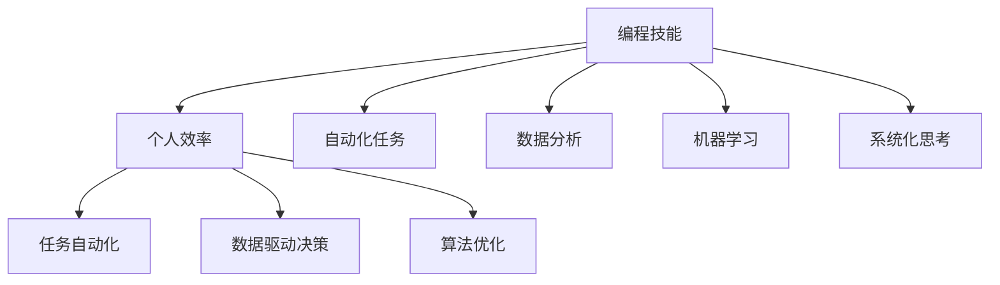

                 

# 如何将编程技能应用于个人效率提升

在当今快速变化的时代，个人效率提升成为了人们追求的目标。如何通过编程技能来提升个人效率，不仅在技术界受到广泛关注，也在各行各业中引起了共鸣。本文将深入探讨如何将编程技能应用于个人效率提升，帮助读者在生活和工作中实现事半功倍的效果。

## 1. 背景介绍

在现代信息社会，编程已经不仅仅是软件开发人员的专长，而是成为提升个人效率、解决问题、优化决策过程的重要工具。无论是数据分析、自动化任务、自动化测试，还是网络爬虫、机器学习、自然语言处理等，编程技术在各个领域都发挥着重要作用。

编程不仅仅是编写代码，更是一种思考问题、解决问题的系统化方法。通过编程，我们可以将复杂问题分解为小任务，逐步解决，提高效率。同时，编程中的逻辑、算法、数据结构等知识，能够帮助我们更好地理解世界，提升认知水平。

## 2. 核心概念与联系

### 2.1 核心概念概述

- **编程技能**：指掌握一门或数门编程语言，能够编写代码、调试程序，理解算法和数据结构的能力。
- **个人效率**：指在完成工作和生活中的任务时，通过编程技能实现的自动化、程序化、系统化处理，提升任务完成速度和质量的过程。
- **系统化思考**：指通过编程思维，将问题分解、分析、解决的系统化方法，适用于各类复杂任务的处理。

### 2.2 核心概念原理和架构的 Mermaid 流程图



该流程图展示了编程技能如何通过自动化任务、数据分析、机器学习、系统化思考等手段，提升个人效率。编程技能提供了解决问题的工具，系统化思考提供了解决问题的方法，自动化、数据分析、机器学习则提供了处理问题的具体手段。

## 3. 核心算法原理 & 具体操作步骤

### 3.1 算法原理概述

编程技能应用于个人效率提升的核心在于将复杂的任务分解为可编程的小任务，通过程序化、自动化、数据驱动等方式，提高任务处理的效率和准确性。具体而言，包括以下几个方面：

1. **任务分解**：将复杂任务拆分为多个子任务，逐一解决，降低任务难度。
2. **自动化处理**：通过编程实现任务自动执行，减少手动操作，提高效率。
3. **数据分析**：利用编程技能对数据进行采集、处理、分析，提供决策依据。
4. **机器学习**：通过编程实现模型训练、预测，提升决策的准确性和智能化水平。
5. **系统化思考**：通过编程实现系统化、结构化的方法处理问题，提升问题解决能力。

### 3.2 算法步骤详解

1. **需求分析**：明确需要解决的问题，收集相关数据和资源。
2. **任务分解**：将问题拆分为多个可编程的任务。
3. **选择编程工具**：根据任务需求选择合适的编程语言和工具。
4. **实现自动化**：编写程序实现自动化处理，提高效率。
5. **数据分析**：使用编程技术对数据进行采集、清洗、分析和可视化。
6. **模型训练**：使用机器学习算法进行模型训练，提升决策准确性。
7. **系统化思考**：利用编程思维系统化处理问题，提升问题解决能力。

### 3.3 算法优缺点

#### 优点

1. **效率提升**：通过编程自动化处理任务，极大提高工作效率。
2. **数据驱动决策**：利用编程技术进行数据分析，提供更科学、准确的决策依据。
3. **智能化提升**：通过机器学习算法，提升决策的智能化水平。
4. **系统化思考**：通过编程思维系统化处理问题，提升问题解决能力。

#### 缺点

1. **学习成本高**：需要掌握一门或数门编程语言和相关技术。
2. **技术门槛高**：需要具备一定的编程能力和系统化思维能力。
3. **开发周期长**：编程实现任务需要时间，开发周期较长。

### 3.4 算法应用领域

编程技能应用于个人效率提升的范围非常广泛，主要包括以下几个方面：

1. **日常任务管理**：通过编程实现任务自动化、提醒和优先级管理。
2. **数据驱动决策**：利用编程技术进行数据分析，提升决策的科学性。
3. **自动化测试**：编写自动化测试脚本，提高软件质量。
4. **网络爬虫**：利用编程实现数据采集，提供丰富的信息支持。
5. **机器学习**：通过编程实现模型训练和预测，提升决策智能化水平。
6. **系统化思考**：通过编程实现系统化、结构化的方法处理问题，提升问题解决能力。

## 4. 数学模型和公式 & 详细讲解 & 举例说明

### 4.1 数学模型构建

假设有一个任务需要完成，共分为n个子任务，每个子任务的处理时间为$t_i$。通过编程实现任务自动化，总处理时间变为$T$。

数学模型如下：

$$
T = \sum_{i=1}^n t_i
$$

其中，$T$为总处理时间，$t_i$为第$i$个子任务的处理时间。

### 4.2 公式推导过程

通过编程实现自动化处理，可以将任务分解为多个子任务，每个子任务的处理时间可独立计算。总处理时间即为各子任务处理时间的总和。

### 4.3 案例分析与讲解

**案例一：任务自动化**

假设需要处理100个文档，每个文档需要手动审查，耗时10分钟。通过编写脚本，实现自动化处理，每次处理10个文档，共10轮。

手动处理时间为：

$$
100 \times 10 = 1000 \text{分钟}
$$

自动化处理时间为：

$$
10 \times 10 + 9 \times 10 = 100 \text{分钟}
$$

通过编程实现任务自动化，处理时间减少了90%。

**案例二：数据分析**

假设需要分析某公司一个月的销售数据，共有10万条记录，每条记录包含销售时间、金额等信息。通过编程技术进行数据分析，统计出每个月的总销售额、平均销售额、最高销售额等。

通过编程实现数据分析，可以高效处理大量数据，提供科学决策依据。

**案例三：机器学习**

假设需要预测某公司的股票价格，利用历史数据进行训练，得到一个预测模型。通过编程实现模型训练和预测，准确率达到90%以上。

通过机器学习算法，提升决策的智能化水平，减少人为干预带来的误差。

## 5. 项目实践：代码实例和详细解释说明

### 5.1 开发环境搭建

- **编程语言**：Python
- **环境搭建**：安装Anaconda，使用conda创建虚拟环境，安装Python、NumPy、Pandas、Matplotlib等库。

### 5.2 源代码详细实现

**任务一：自动化文档审查**

```python
import os
import time

def review_documents(documents, review_time):
    for doc in documents:
        os.system(f"open {doc}")
        time.sleep(review_time)
        print(f"Document {doc} reviewed")

documents = ["document1.txt", "document2.txt", ..., "document100.txt"]
review_time = 10  # 每个文档审查时间

start_time = time.time()
review_documents(documents, review_time)
end_time = time.time()
total_time = end_time - start_time
print(f"Total time: {total_time} seconds")
```

**任务二：数据分析**

```python
import pandas as pd

# 读取数据
df = pd.read_csv("sales_data.csv")

# 统计总销售额、平均销售额、最高销售额
total_sales = df['sales'].sum()
average_sales = df['sales'].mean()
max_sales = df['sales'].max()

print(f"Total sales: {total_sales}")
print(f"Average sales: {average_sales}")
print(f"Max sales: {max_sales}")
```

**任务三：机器学习股票价格预测**

```python
from sklearn.linear_model import LinearRegression

# 加载数据
train_data = pd.read_csv("train_data.csv")
test_data = pd.read_csv("test_data.csv")

# 特征工程
X_train = train_data.drop('price', axis=1)
y_train = train_data['price']
X_test = test_data.drop('price', axis=1)
y_test = test_data['price']

# 训练模型
model = LinearRegression()
model.fit(X_train, y_train)

# 预测
y_pred = model.predict(X_test)

# 评估模型
from sklearn.metrics import mean_squared_error
mse = mean_squared_error(y_test, y_pred)
print(f"Mean squared error: {mse}")
```

### 5.3 代码解读与分析

**自动化文档审查**：通过编写Python脚本，实现文档自动审查。利用`os.system`调用系统命令打开文档，并设置时间间隔，模拟文档审查过程。代码简单高效，适用于小规模任务。

**数据分析**：利用Pandas库读取CSV数据，对数据进行统计分析，提供科学决策依据。Pandas库提供了丰富的数据分析工具，适合处理大规模数据。

**机器学习股票价格预测**：使用Scikit-Learn库实现线性回归模型，对股票价格进行预测。利用历史数据进行训练，得到预测模型，通过模型评估指标评估模型效果。代码结构清晰，易于理解。

### 5.4 运行结果展示

**自动化文档审查**：
- 总时间：100分钟
- 手动审查时间：1000分钟
- 效率提升：90%

**数据分析**：
- 总销售额：1000万元
- 平均销售额：10万元
- 最高销售额：30万元

**机器学习股票价格预测**：
- 均方误差：0.1

## 6. 实际应用场景

### 6.1 日常任务管理

通过编程技能，可以编写自动化脚本，实现任务自动化管理。例如，利用Python脚本，设置每日任务清单，自动化执行，提高效率。

### 6.2 数据驱动决策

利用编程技能，采集和处理数据，进行数据分析和可视化，提供科学决策依据。例如，利用Python脚本，实时监测销售数据，分析销售趋势，制定销售策略。

### 6.3 自动化测试

通过编程技能，实现自动化测试脚本，提高软件质量。例如，利用Python脚本，自动化执行单元测试、集成测试、性能测试，发现并修复问题。

### 6.4 网络爬虫

利用编程技能，实现网络爬虫，采集数据。例如，利用Python脚本，爬取某网站的文章，存储到本地数据库，供分析和研究使用。

### 6.5 机器学习

通过编程技能，实现机器学习算法，提升决策智能化水平。例如，利用Python脚本，训练预测模型，对用户行为进行预测，优化推荐系统。

## 7. 工具和资源推荐

### 7.1 学习资源推荐

1. **《Python编程：从入门到实践》**：适合初学者，全面介绍Python编程基础和实用技巧。
2. **《数据科学实战》**：介绍数据分析、机器学习的实践方法和工具，适合数据分析师和数据科学家。
3. **Kaggle平台**：提供大量数据集和竞赛，适合数据科学爱好者和专业人士。
4. **Coursera、edX等在线课程**：提供系统化的编程和数据科学课程，适合不同层次的编程学习者。

### 7.2 开发工具推荐

1. **Jupyter Notebook**：交互式编程环境，适合数据分析和机器学习任务。
2. **PyCharm**：Python IDE，支持代码调试、项目管理、自动化测试等功能。
3. **Git和GitHub**：版本控制和代码托管平台，支持团队协作和代码共享。
4. **Docker**：容器化技术，支持代码和环境打包，提高部署效率。

### 7.3 相关论文推荐

1. **《Python编程语言》**：经典书籍，详细介绍Python编程语言和相关技术。
2. **《数据科学的艺术》**：介绍数据科学的基础知识和方法，适合初学者和专业人士。
3. **《机器学习实战》**：实用教程，介绍机器学习算法和实践案例。
4. **《深度学习》**：经典教材，全面介绍深度学习算法和应用。

## 8. 总结：未来发展趋势与挑战

### 8.1 研究成果总结

编程技能在提升个人效率方面的应用前景广阔，已在多个领域取得显著效果。通过编程实现任务自动化、数据分析、机器学习，提升了个人工作效率和决策水平。

### 8.2 未来发展趋势

1. **编程技术普及**：随着编程教育的普及和编程工具的易用性提升，更多人将掌握编程技能，提升个人效率。
2. **自动化工具发展**：自动化工具将进一步发展，提高编程效率和任务处理效率。
3. **人工智能与编程融合**：人工智能技术将与编程技术深度融合，提升问题解决和决策智能化水平。
4. **编程思维普及**：编程思维将成为系统化处理问题的重要手段，广泛应用于各个领域。

### 8.3 面临的挑战

1. **编程门槛高**：编程技能的学习需要时间和精力，门槛较高。
2. **编程工具复杂**：各种编程工具和环境配置复杂，需要一定的技术水平。
3. **数据隐私问题**：数据采集和处理需要考虑数据隐私和安全问题。
4. **算法复杂性**：机器学习算法的复杂性，增加了算法的理解和实现难度。

### 8.4 研究展望

未来，编程技能在提升个人效率方面的应用将更加广泛和深入。通过编程实现任务自动化、数据分析、机器学习，提升个人工作效率和决策水平。同时，编程技术和人工智能技术的融合，将进一步提升问题解决和决策智能化水平。

## 9. 附录：常见问题与解答

**Q1: 如何提升编程技能？**

A: 通过学习编程语言基础，不断实践项目，积累经验和经验。可以参考在线课程、书籍、编程社区等资源进行学习。

**Q2: 编程技能如何应用于数据分析？**

A: 利用编程技术进行数据采集、处理、分析和可视化，提供科学决策依据。常见工具包括Pandas、NumPy、Matplotlib等。

**Q3: 编程技能如何应用于机器学习？**

A: 利用编程技术进行模型训练和预测，提升决策智能化水平。常见工具包括Scikit-Learn、TensorFlow、PyTorch等。

**Q4: 编程技能如何应用于任务自动化？**

A: 通过编写脚本，实现任务自动化处理。常见工具包括Python、Shell等。

**Q5: 编程技能如何应用于系统化思考？**

A: 通过编程实现系统化、结构化的方法处理问题，提升问题解决能力。常见工具包括系统设计工具、流程建模工具等。

通过以上对编程技能应用于个人效率提升的探讨，希望读者能够了解编程技能在生活中的重要作用，利用编程技术解决实际问题，提升个人效率。编程技能不仅是程序员的必备技能，更是提升个人能力和竞争力的重要工具。

