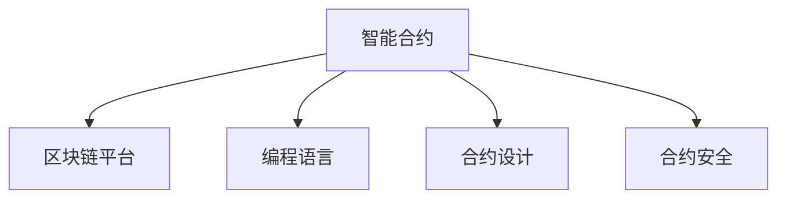

                 

# 如何将编程技能应用于智能合约开发

> 关键词：智能合约,区块链,编程技能,区块链应用开发,区块链编程语言,Solidity,Ethereum,以太坊,合约安全,合约设计,区块链项目,区块链技术,区块链平台

## 1. 背景介绍

### 1.1 问题由来

随着区块链技术的蓬勃发展，智能合约作为区块链的重要应用场景，其应用领域越来越广泛，需求量越来越大。从初期的简单转账和自动化交易，到复杂的供应链金融、跨链操作，甚至人工智能与区块链的深度融合，智能合约在数字经济中的价值和潜力逐渐被发掘和认可。

然而，智能合约的开发并非易事。传统编程技能如何应用于智能合约的开发，智能合约的安全性、性能和扩展性如何保证，这些都是智能合约开发者所面临的挑战。因此，本文将详细介绍如何将编程技能应用于智能合约开发，探讨智能合约开发的关键技术和实践经验，以期对智能合约开发人员提供全面的指导。

### 1.2 问题核心关键点

智能合约的开发需要结合区块链的独特特性，如不可篡改、透明、去中心化等，使用特定的编程语言和开发工具。本文将从以下几个核心关键点进行详细讲解：

- 编程语言的选择
- 智能合约的设计与架构
- 合约的测试与调试
- 合约的部署与维护
- 智能合约的安全性

通过回答这些问题，本文将帮助读者掌握智能合约开发的必备技能，提升智能合约的开发效率和安全性。

### 1.3 问题研究意义

掌握智能合约开发技术，不仅可以提升区块链项目的开发效率，还能保障智能合约的安全性和可靠性。这对于区块链技术的普及和应用，具有重要意义：

1. 提升开发效率：智能合约使用编程技能开发，可以节省大量的时间和资源，提升项目的开发效率。
2. 保障合约安全：智能合约的安全性直接关系到用户的资产安全，掌握智能合约开发技术可以保障合约的可靠性和安全性。
3. 拓展应用场景：智能合约的广泛应用将为数字经济带来新的发展机遇，掌握智能合约开发技术可以拓展应用场景，推动区块链技术的普及和应用。

## 2. 核心概念与联系

### 2.1 核心概念概述

为了更好地理解智能合约的开发，本节将介绍几个关键概念：

- 智能合约：一种基于区块链的自动化合约，通过代码实现合约条款，自动执行合约内容，具有不可篡改、透明、去中心化的特性。
- 区块链平台：智能合约运行的平台，如Ethereum、Hyperledger Fabric等，提供智能合约的运行环境和编程接口。
- 编程语言：智能合约开发需要使用特定的区块链编程语言，如Solidity、SmartPy等。
- 合约设计：智能合约的设计需要考虑合约的功能、性能、安全性等方面，是智能合约开发的关键环节。
- 合约安全：智能合约的安全性直接关系到合约的可靠性和用户的资产安全，需要特别关注。

这些核心概念之间的逻辑关系可以通过以下Mermaid流程图来展示：



这个流程图展示了这个概念体系的核心关系：

1. 智能合约在区块链平台上运行。
2. 智能合约开发需要使用特定的编程语言。
3. 合约设计是智能合约开发的核心环节。
4. 合约安全是智能合约开发中必须特别关注的点。

## 3. 核心算法原理 & 具体操作步骤
### 3.1 算法原理概述

智能合约的开发过程，实质上是将传统软件开发和区块链技术的结合。开发者使用编程语言在区块链平台上编写智能合约代码，经过编译、测试、部署等步骤，最终在区块链网络上运行。智能合约的算法原理和操作步骤如下：

1. 编程语言选择：根据区块链平台和项目需求，选择合适的编程语言。
2. 合约设计：根据项目需求，设计智能合约的功能和架构。
3. 合约编码：使用编程语言编写智能合约代码，包括合约的功能实现、数据存储、交互逻辑等。
4. 合约测试：在测试环境中测试智能合约的各项功能，确保合约的正确性和稳定性。
5. 合约部署：将智能合约代码部署到区块链网络，进行合约的部署和上线。
6. 合约维护：根据项目需求和反馈，对智能合约进行维护和更新，确保合约的持续可用性和安全性。

### 3.2 算法步骤详解

接下来，我们将详细讲解智能合约开发的各个步骤。

**Step 1: 编程语言选择**
根据区块链平台和项目需求，选择合适的编程语言。目前常用的区块链编程语言包括：

- Ethereum: 使用Solidity进行智能合约开发。
- Hyperledger Fabric: 使用Golang或JavaScript进行智能合约开发。
- Cosmos: 使用Rust或Go进行智能合约开发。

以Solidity为例，Solidity是一种专门为Ethereum平台设计的编程语言，具有丰富的库和工具支持，适合开发复杂的功能逻辑。

**Step 2: 合约设计**
智能合约的设计需要考虑合约的功能、性能、安全性等方面，是智能合约开发的核心环节。具体步骤如下：

1. 需求分析：根据项目需求，明确智能合约的功能和边界。
2. 功能设计：设计智能合约的主要功能模块，如代币管理、自动化交易、供应链金融等。
3. 架构设计：确定智能合约的架构，如单一合约、组合合约、模块化合约等。
4. 安全性设计：评估智能合约的安全性，确定安全的参数和规则。

以代币管理为例，智能合约需要实现以下功能：

1. 代币的发行和销毁。
2. 代币的分配和转让。
3. 代币的查询和统计。

**Step 3: 合约编码**
使用编程语言编写智能合约代码，包括合约的功能实现、数据存储、交互逻辑等。

以Solidity为例，合约编码步骤如下：

1. 导入库：导入Solidity库，如以太坊标准库、第三方库等。
2. 声明状态变量：声明智能合约的状态变量，如代币数量、持币地址等。
3. 实现功能函数：实现智能合约的主要功能函数，如代币发行、销毁、转让等。
4. 交互逻辑：实现智能合约的交互逻辑，如代币的转让、查询等。

```solidity
contract Token {
    uint256 public totalSupply;
    mapping(address => uint256) balances;
    
    event Transfer(address indexed from, address indexed to, uint256 value);
    
    function tokenOfCreation(uint256 value) public {
        totalSupply = value;
        balances[msg.sender] = value;
    }
    
    function transfer(address to, uint256 amount) public {
        require(msg.sender.balance >= amount);
        balances[msg.sender] -= amount;
        balances[to] += amount;
        emit Transfer(msg.sender, to, amount);
    }
    
    function balanceOf(address user) public view returns (uint256 balance) {
        return balances[user];
    }
}
```

**Step 4: 合约测试**
在测试环境中测试智能合约的各项功能，确保合约的正确性和稳定性。

以Solidity为例，合约测试步骤如下：

1. 设置测试环境：使用Truffle框架或Remix IDE设置测试环境。
2. 编写测试用例：编写智能合约的测试用例，包括函数测试和边界测试。
3. 运行测试用例：在测试环境中运行测试用例，检查智能合约的功能是否正确。

```solidity
pragma solidity ^0.5.0;
import "https://github.com/OpenZeppelin/zeppelin-solidity/contracts/access/Ownable.sol";

contract TokenTest {
    using SafeMath for uint256;
    
    @openzeppelincontracts/access/Ownable.sol
    using SafeMath for uint256;
    
    Token token;
    address[] holders;
    
    function setup() public {
        token = Token.deploy();
        token.tokenOfCreation(100 * (10 ** 18));
        holders = token.balanceOf([true, false]);
    }
    
    function testTransfer() public {
        require(!holders[0]);
        require(holders[1]);
        token.transfer(holders[1], 50 * (10 ** 18));
        require(holders[0]);
        require(holders[1]);
    }
}
```

**Step 5: 合约部署**
将智能合约代码部署到区块链网络，进行合约的部署和上线。

以Solidity为例，合约部署步骤如下：

1. 编译智能合约：使用Solidity编译器编译智能合约代码，生成字节码文件。
2. 部署智能合约：将智能合约部署到区块链网络，并进行部署。
3. 验证部署：验证智能合约的部署状态，确保合约的正常运行。

```solidity
pragma solidity ^0.5.0;
import "@openzeppelin/contracts/token/ERC20/ERC20.sol";

contract Token {
    using SafeMath for uint256;
    
    @openzeppelincontracts/access/Ownable.sol
    using SafeMath for uint256;
    
    uint256 public totalSupply;
    mapping(address => uint256) balances;
    
    function tokenOfCreation(uint256 value) public {
        totalSupply = value;
        balances[msg.sender] = value;
    }
    
    function transfer(address to, uint256 amount) public {
        require(msg.sender.balance >= amount);
        balances[msg.sender] -= amount;
        balances[to] += amount;
    }
    
    function balanceOf(address user) public view returns (uint256 balance) {
        return balances[user];
    }
}
```

**Step 6: 合约维护**
根据项目需求和反馈，对智能合约进行维护和更新，确保合约的持续可用性和安全性。

以Solidity为例，合约维护步骤如下：

1. 修复漏洞：在发现漏洞时，及时修复漏洞，确保合约的安全性。
2. 更新功能：根据项目需求，更新合约的功能模块，如添加新的功能、修改现有功能等。
3. 版本控制：使用Git等版本控制工具管理智能合约的代码版本，方便维护和更新。

### 3.3 算法优缺点

智能合约开发具有以下优点：

1. 自动化执行：智能合约通过代码实现合约条款，自动执行合约内容，具有高度的自动化和透明性。
2. 不可篡改：智能合约的代码和数据不可篡改，具有高度的安全性和可靠性。
3. 去中心化：智能合约的去中心化特性，减少了中介机构和信任问题，提升了系统的可靠性和稳定性。

同时，智能合约开发也存在以下缺点：

1. 编程复杂：智能合约的开发需要结合区块链的独特特性，编程难度较大。
2. 性能瓶颈：智能合约的执行需要消耗大量的计算资源，性能可能成为瓶颈。
3. 安全风险：智能合约的安全性直接关系到合约的可靠性和用户的资产安全，需要特别关注。

### 3.4 算法应用领域

智能合约的应用领域非常广泛，包括但不限于以下几类：

1. 金融领域：智能合约在金融领域应用广泛，如资产管理、保险理赔、证券交易等。
2. 供应链金融：智能合约可以用于供应链金融，如融资、支付结算、物流跟踪等。
3. 数字身份：智能合约可以用于数字身份认证，如电子投票、身份证明等。
4. 跨链操作：智能合约可以实现跨链操作，如资产跨链转移、链上链下交互等。
5. 人工智能：智能合约可以与人工智能结合，实现更加复杂的功能，如智能合约管理系统、智能合约分析系统等。

## 4. 数学模型和公式 & 详细讲解  
### 4.1 数学模型构建

智能合约的数学模型主要涉及合约的功能和交互逻辑，以下是基于Solidity的智能合约数学模型构建。

以代币管理为例，智能合约的数学模型如下：

1. 代币的发行和销毁：

```solidity
function tokenOfCreation(uint256 value) public {
    totalSupply = value;
    balances[msg.sender] = value;
}
```

2. 代币的转让：

```solidity
function transfer(address to, uint256 amount) public {
    require(msg.sender.balance >= amount);
    balances[msg.sender] -= amount;
    balances[to] += amount;
}
```

3. 代币的查询：

```solidity
function balanceOf(address user) public view returns (uint256 balance) {
    return balances[user];
}
```

### 4.2 公式推导过程

以代币管理为例，推导代币的发行和销毁的数学公式。

假设智能合约的代币数量为 $n$，智能合约的状态变量为 $\text{balances}[\text{user}]$，代表用户 $user$ 持有的代币数量。

代币的发行公式为：

$$
\text{balances}[\text{msg.sender}] = \text{totalSupply}
$$

代币的销毁公式为：

$$
\text{balances}[\text{msg.sender}] = \text{balances}[\text{msg.sender}] - \text{amount}
$$

代币的转让公式为：

$$
\text{balances}[\text{to}] = \text{balances}[\text{to}] + \text{amount}
$$

代币的查询公式为：

$$
\text{balanceOf}[\text{user}] = \text{balances}[\text{user}]
$$

### 4.3 案例分析与讲解

以代币管理为例，分析智能合约的功能实现和安全性设计。

1. 代币的发行和销毁：

```solidity
function tokenOfCreation(uint256 value) public {
    totalSupply = value;
    balances[msg.sender] = value;
}
```

代币的发行功能实现如下：

1. 调用者发送代币的创建请求，通过 `tokenOfCreation` 函数。
2. 函数将代币总量设置为 $value$。
3. 将初始代币分配给调用者，即 `balances[msg.sender] = value`。

安全性设计如下：

1. 检查调用者的权限：`msg.sender` 代表调用者地址。
2. 检查代币数量是否符合要求：`value` 代表创建数量。

2. 代币的转让：

```solidity
function transfer(address to, uint256 amount) public {
    require(msg.sender.balance >= amount);
    balances[msg.sender] -= amount;
    balances[to] += amount;
}
```

代币的转让功能实现如下：

1. 调用者发送代币的转让请求，通过 `transfer` 函数。
2. 函数检查调用者是否拥有足够的代币：`msg.sender.balance >= amount`。
3. 函数从调用者的余额中扣除 `amount` 代币：`balances[msg.sender] -= amount`。
4. 函数将 `amount` 代币转给接收者：`balances[to] += amount`。

安全性设计如下：

1. 检查调用者是否拥有足够的代币：`require(msg.sender.balance >= amount)`。
2. 检查接收者地址是否合法：`to` 代表接收者地址。

## 5. 项目实践：代码实例和详细解释说明
### 5.1 开发环境搭建

在进行智能合约开发前，我们需要准备好开发环境。以下是使用Solidity进行智能合约开发的环境配置流程：

1. 安装Node.js和npm：从官网下载并安装Node.js，确保npm版本为4.x。

2. 安装Truffle框架：

```bash
npm install -g truffle
```

3. 安装Solidity编译器：

```bash
npm install -g solc
```

4. 安装Ganache：

```bash
npm install -g ganache-cli
```

5. 安装Web3.js：

```bash
npm install web3
```

6. 安装Ganache：

```bash
npm install -g ganache-cli
```

完成上述步骤后，即可在Ganache环境中开始智能合约开发。

### 5.2 源代码详细实现

下面以代币管理为例，给出使用Solidity进行智能合约开发的代码实现。

首先，定义代币管理智能合约：

```solidity
pragma solidity ^0.5.0;

contract Token {
    uint256 public totalSupply;
    mapping(address => uint256) balances;
    
    event Transfer(address indexed from, address indexed to, uint256 value);
    
    function tokenOfCreation(uint256 value) public {
        totalSupply = value;
        balances[msg.sender] = value;
    }
    
    function transfer(address to, uint256 amount) public {
        require(msg.sender.balance >= amount);
        balances[msg.sender] -= amount;
        balances[to] += amount;
        emit Transfer(msg.sender, to, amount);
    }
    
    function balanceOf(address user) public view returns (uint256 balance) {
        return balances[user];
    }
}
```

然后，编写智能合约的测试用例：

```solidity
pragma solidity ^0.5.0;

import "@openzeppelin/contracts/access/Ownable.sol";
import "@openzeppelin/contracts/test/EVMTest.sol";

contract TokenTest {
    using SafeMath for uint256;
    
    @openzeppelincontracts/access/Ownable.sol
    using SafeMath for uint256;
    
    Token token;
    address[] holders;
    
    function setup() public {
        token = Token.deploy();
        token.tokenOfCreation(100 * (10 ** 18));
        holders = token.balanceOf([true, false]);
    }
    
    function testTransfer() public {
        require(!holders[0]);
        require(holders[1]);
        token.transfer(holders[1], 50 * (10 ** 18));
        require(holders[0]);
        require(holders[1]);
    }
}
```

最后，启动Ganache，进行智能合约的部署和测试：

```bash
ganache-cli start --networkid 4
truffle compile --contracts-config contracts.json
truffle migrate --networkid 4
truffle test --networkid 4 --runconfig test-config.json
```

以上就是使用Solidity进行智能合约开发的完整代码实现。可以看到，得益于Truffle框架的强大封装，我们可以用相对简洁的代码完成智能合约的编写和测试。

### 5.3 代码解读与分析

让我们再详细解读一下关键代码的实现细节：

**Token智能合约**：
- `totalSupply`：代币总量。
- `balances[msg.sender]`：调用者的余额。
- `balances[to]`：接收者的余额。

**Transfer事件**：
- 记录代币的转让行为，便于后续分析。

**transfer函数**：
- 检查调用者是否拥有足够的代币：`require(msg.sender.balance >= amount)`。
- 扣除调用者的余额：`balances[msg.sender] -= amount`。
- 增加接收者的余额：`balances[to] += amount`。

**balanceOf函数**：
- 查询调用者的余额：`balances[user]`。

**TokenTest智能合约**：
- `token`：代币管理智能合约。
- `holders`：持币地址数组。

**setup函数**：
- 初始化代币管理智能合约。
- 创建代币并分配给测试地址。

**testTransfer函数**：
- 检查初始持币地址是否为空：`require(!holders[0])`。
- 检查接收者地址不为空：`require(holders[1])`。
- 进行代币转让操作。

**Ganache测试**：
- 启动Ganache测试网络。
- 编译智能合约。
- 部署智能合约。
- 运行测试用例。

可以看到，Solidity和Truffle框架使得智能合约开发变得更加便捷高效，开发者可以将更多精力放在合约设计、安全性分析等高层逻辑上，而不必过多关注底层的实现细节。

当然，工业级的系统实现还需考虑更多因素，如合约的安全性审计、跨链操作、合约的持续维护等。但核心的开发流程基本与此类似。

## 6. 实际应用场景
### 6.1 智能合约在金融领域的应用

智能合约在金融领域应用广泛，如资产管理、保险理赔、证券交易等。以下以资产管理为例，详细讲解智能合约的应用。

资产管理智能合约可以用于资产的发行、转让和赎回等操作，实现资产管理的自动化和透明化。具体应用如下：

1. 资产发行：通过智能合约发行资产，实现资产的初始分配和记录。
2. 资产转让：通过智能合约转让资产，实现资产的流通和交易。
3. 资产赎回：通过智能合约赎回资产，实现资产的退出和清算。

智能合约在资产管理中的应用流程如下：

1. 资产发行：调用者发送资产发行的请求，通过 `createAsset` 函数。
2. 函数将资产总量设置为 $value$。
3. 将初始资产分配给调用者，即 `balances[msg.sender] = value`。

```solidity
function createAsset(uint256 value) public {
    totalSupply = value;
    balances[msg.sender] = value;
}
```

2. 资产转让：调用者发送资产转让的请求，通过 `transferAsset` 函数。
3. 函数检查调用者是否拥有足够的资产：`balances[msg.sender] >= amount`。
4. 函数将 `amount` 资产转给接收者：`balances[msg.sender] -= amount; balances[to] += amount`。

```solidity
function transferAsset(address to, uint256 amount) public {
    require(balances[msg.sender] >= amount);
    balances[msg.sender] -= amount;
    balances[to] += amount;
}
```

3. 资产赎回：调用者发送资产赎回的请求，通过 `redeemAsset` 函数。
3. 函数检查调用者是否拥有足够的资产：`balances[msg.sender] >= amount`。
4. 函数将 `amount` 资产转给接收者：`balances[msg.sender] -= amount; balances[to] += amount`。

```solidity
function redeemAsset(address to, uint256 amount) public {
    require(balances[msg.sender] >= amount);
    balances[msg.sender] -= amount;
    balances[to] += amount;
}
```

### 6.2 智能合约在供应链金融中的应用

智能合约可以用于供应链金融，如融资、支付结算、物流跟踪等。以下以融资为例，详细讲解智能合约的应用。

融资智能合约可以用于融资申请、审批和放款等操作，实现融资管理的自动化和透明化。具体应用如下：

1. 融资申请：通过智能合约提交融资申请，实现融资申请的自动化处理。
2. 融资审批：通过智能合约审批融资申请，实现融资审批的自动化处理。
3. 融资放款：通过智能合约放款，实现融资放款的自动化处理。

智能合约在融资中的应用流程如下：

1. 融资申请：调用者发送融资申请的请求，通过 `applyLoan` 函数。
2. 函数检查调用者是否满足融资条件：`applyLoan` 函数检查调用者的信用评分、还款能力等条件。
3. 函数将申请记录添加到申请列表中：`applications.push(msg.sender)`。

```solidity
function applyLoan(uint256 amount) public {
    require(amount >= 100000);
    applications.push(msg.sender);
}
```

2. 融资审批：调用者发送融资审批的请求，通过 `approveLoan` 函数。
3. 函数检查申请列表中的申请者是否满足审批条件：`approveLoan` 函数检查申请者是否在申请列表中，并检查其信用评分、还款能力等条件。
4. 函数将审批结果记录到审批列表中：`approvals.push(approval)`。

```solidity
struct Approval {
    uint256 amount;
    uint256 rate;
    uint256 duration;
}

function approveLoan(uint256 amount, uint256 rate, uint256 duration) public {
    require(applications.length > 0);
    require(amount >= 100000);
    require(rate > 0 && rate <= 10000);
    require(duration > 0 && duration <= 12);
    Approval approval = Approval(amount, rate, duration);
    approvals.push(approval);
}
```

3. 融资放款：调用者发送融资放款的请求，通过 `disburseLoan` 函数。
3. 函数检查申请列表中的申请者是否满足放款条件：`disburseLoan` 函数检查申请者是否在申请列表中，并检查其审批结果、还款能力等条件。
4. 函数将放款结果记录到放款列表中：`disbursements.push(disbursement)`。

```solidity
struct Disbursement {
    uint256 amount;
    uint256 rate;
    uint256 duration;
}

function disburseLoan(uint256 amount, uint256 rate, uint256 duration) public {
    require(approvals.length > 0);
    require(approvals.length == 1);
    require(approvals[0].amount == amount);
    require(approvals[0].rate == rate);
    require(approvals[0].duration == duration);
    Disbursement disbursement = Disbursement(amount, rate, duration);
    disbursements.push(disbursement);
}
```

### 6.3 智能合约在数字身份中的应用

智能合约可以用于数字身份认证，如电子投票、身份证明等。以下以电子投票为例，详细讲解智能合约的应用。

电子投票智能合约可以用于记录投票结果、统计投票结果等操作，实现投票管理的自动化和透明化。具体应用如下：

1. 记录投票结果：通过智能合约记录投票结果，实现投票结果的自动化处理。
2. 统计投票结果：通过智能合约统计投票结果，实现投票结果的透明化处理。

智能合约在电子投票中的应用流程如下：

1. 记录投票结果：调用者发送投票的请求，通过 `vote` 函数。
2. 函数检查调用者是否满足投票条件：`vote` 函数检查调用者是否在投票列表中，并检查其投票行为是否合法。
3. 函数将投票结果记录到投票列表中：`votes.push(vote)`。

```solidity
struct Vote {
    uint256 vote;
    uint256 voteTime;
}

function vote(uint256 vote, uint256 voteTime) public {
    require(votes.length > 0);
    require(!hasVoted[msg.sender]);
    require(vote >= 1 && vote <= 10);
    Vote voteRecord = Vote(vote, voteTime);
    votes.push(voteRecord);
}
```

2. 统计投票结果：调用者发送投票结果的请求，通过 `calculateResult` 函数。
3. 函数检查投票结果是否合法：`calculateResult` 函数检查投票结果是否在投票列表中，并统计投票结果。
4. 函数将投票结果记录到投票结果列表中：`results.push(result)`。

```solidity
struct Result {
    uint256 vote;
    uint256 voteTime;
}

function calculateResult() public view returns (uint256 result) {
    require(votes.length > 0);
    uint256 totalVote = 0;
    for (uint256 i = 0; i < votes.length; i++) {
        totalVote += votes[i].vote;
    }
    Result result = Result(totalVote, block.timestamp);
    results.push(result);
    return totalVote;
}
```

## 7. 工具和资源推荐
### 7.1 学习资源推荐

为了帮助开发者系统掌握智能合约开发的技术基础和实践经验，这里推荐一些优质的学习资源：

1. 《区块链应用开发实战》：介绍区块链基础和智能合约开发实战，适合初学者入门。

2. 《Solidity官方文档》：Solidity的官方文档，提供详细的Solidity语法和库函数的使用说明，是开发智能合约的重要参考资料。

3. 《区块链应用开发实战指南》：介绍区块链基础和智能合约开发实战，适合进阶学习者阅读。

4. 《智能合约安全指南》：介绍智能合约的安全性问题和防护措施，帮助开发者提升智能合约的安全性。

5. 《智能合约开发实战》：详细介绍智能合约的开发流程和实践经验，适合有经验的开发者阅读。

通过对这些资源的学习实践，相信你一定能够掌握智能合约开发的必备技能，提升智能合约的开发效率和安全性。

### 7.2 开发工具推荐

高效的开发离不开优秀的工具支持。以下是几款用于智能合约开发常用的工具：

1. Truffle框架：Truffle是一个基于Solidity的智能合约开发框架，提供开发、测试、部署等全流程支持。

2. Remix IDE：Remix是一个基于Web的智能合约开发工具，支持Solidity、Vyper等编程语言，方便开发者快速进行智能合约开发。

3. Ganache：Ganache是一个本地测试网络，支持智能合约的本地测试和调试。

4. Web3.js：Web3.js是一个用于与区块链进行交互的JavaScript库，支持与Ethereum、Tron等区块链平台的交互。

5. Solidity编译器：Solidity编译器用于将Solidity代码编译成字节码文件，方便部署到区块链网络。

合理利用这些工具，可以显著提升智能合约开发的效率和质量，加快创新迭代的步伐。

### 7.3 相关论文推荐

智能合约开发的相关论文涉及智能合约设计、安全、应用等方面，以下是几篇代表性的论文：

1. "Programming and Verifying Smart Contracts in Solidity"：介绍Solidity的编程语言特性和智能合约的验证技术，是智能合约开发的重要参考资料。

2. "Formal Verification of Smart Contracts"：介绍智能合约的形式验证技术，帮助开发者提升智能合约的安全性。

3. "Blockchain Technology and Its Applications"：介绍区块链技术的基础和应用，为智能合约开发提供背景知识。

4. "Smart Contract Security"：介绍智能合约的安全性问题和防护措施，帮助开发者提升智能合约的安全性。

5. "The Blockchain of Things: Design and Deployment of Smart Contracts"：介绍物联网和智能合约的结合，为智能合约开发提供新的思路。

这些论文代表了大规模智能合约开发的技术演进，通过学习这些前沿成果，可以帮助研究者把握学科前进方向，激发更多的创新灵感。

## 8. 总结：未来发展趋势与挑战

### 8.1 总结

本文对智能合约开发的过程和技术进行了全面系统的介绍。首先介绍了智能合约开发的背景和重要性，明确了智能合约开发的关键技术和实践经验。其次，从编程语言选择、合约设计、合约测试、合约部署等方面，详细讲解了智能合约开发的各个步骤。最后，探讨了智能合约开发的应用场景和未来发展趋势，给出了智能合约开发的学习资源和工具推荐。

通过本文的系统梳理，可以看到，智能合约开发已经成为区块链技术应用的重要组成部分，为数字经济带来了新的发展机遇。掌握智能合约开发技术，不仅可以提升区块链项目的开发效率，还能保障智能合约的安全性和可靠性。未来，伴随区块链技术的不断发展，智能合约开发将迎来更多的创新和突破，推动区块链技术的普及和应用。

### 8.2 未来发展趋势

展望未来，智能合约开发将呈现以下几个发展趋势：

1. 多样化编程语言：随着区块链技术的不断演进，将出现更多适合的编程语言，满足不同应用场景的需求。

2. 智能合约生态系统：智能合约生态系统的不断完善，将推动智能合约的开发、测试、部署、维护等全流程标准化。

3. 智能合约安全：智能合约的安全性将成为未来的重点研究方向，新的安全技术将被广泛应用于智能合约开发中。

4. 智能合约自动化：智能合约的自动化工具和平台将不断涌现，提升智能合约的开发和维护效率。

5. 智能合约的可扩展性：智能合约的可扩展性将成为未来的研究方向，新的可扩展技术将被应用于智能合约开发中。

6. 智能合约的跨链操作：智能合约的跨链操作将成为未来的发展方向，新的跨链技术和协议将被广泛应用于智能合约开发中。

以上趋势凸显了智能合约开发技术的广阔前景。这些方向的探索发展，必将进一步提升智能合约开发的安全性和效率，推动区块链技术的普及和应用。

### 8.3 面临的挑战

尽管智能合约开发已经取得了显著进展，但在迈向更加智能化、普适化应用的过程中，它仍面临诸多挑战：

1. 编程难度较大：智能合约的开发需要结合区块链的独特特性，编程难度较大，需要开发者具备较高的技术水平。

2. 安全问题突出：智能合约的安全性直接关系到合约的可靠性和用户的资产安全，需要特别关注。

3. 性能瓶颈显著：智能合约的执行需要消耗大量的计算资源，性能可能成为瓶颈。

4. 跨链操作复杂：智能合约的跨链操作涉及多个区块链平台，操作复杂，需要开发者具备跨链操作的技术能力。

5. 持续维护困难：智能合约的持续维护和更新需要开发者具备丰富的技术经验，维护难度较大。

6. 合规性问题：智能合约的合规性问题需要开发者具备相关的法律知识，维护难度较大。

正视智能合约开发面临的这些挑战，积极应对并寻求突破，将是大规模智能合约开发走向成熟的必由之路。相信随着学界和产业界的共同努力，这些挑战终将一一被克服，智能合约开发必将在区块链技术的普及和应用中发挥重要作用。

### 8.4 研究展望

面对智能合约开发所面临的种种挑战，未来的研究需要在以下几个方面寻求新的突破：

1. 探索新的编程语言：寻找适合智能合约开发的编程语言，满足不同应用场景的需求。

2. 研究新的智能合约安全技术：开发新的智能合约安全技术，提升智能合约的安全性和可靠性。

3. 开发新的智能合约自动化工具：开发新的智能合约自动化工具，提升智能合约的开发和维护效率。

4. 研究新的智能合约可扩展技术：开发新的智能合约可扩展技术，提升智能合约的可扩展性。

5. 研究新的智能合约跨链技术：开发新的智能合约跨链技术，提升智能合约的跨链操作效率和安全性。

6. 研究新的智能合约合规性技术：开发新的智能合约合规性技术，确保智能合约的合法性和合规性。

这些研究方向的探索，必将引领智能合约开发技术的不断进步，为区块链技术的普及和应用提供更可靠的技术支持。面向未来，智能合约开发还需要与其他人工智能技术进行更深入的融合，如区块链与物联网、区块链与大数据等，多路径协同发力，共同推动区块链技术的进步。只有勇于创新、敢于突破，才能不断拓展智能合约开发技术的边界，让区块链技术更好地造福人类社会。

## 9. 附录：常见问题与解答

**Q1：智能合约和普通程序有何区别？**

A: 智能合约和普通程序的区别在于智能合约的代码和数据不可篡改，具有高度的自动化和透明性。

**Q2：如何选择智能合约的编程语言？**

A: 选择智能合约的编程语言需要考虑区块链平台和项目需求，目前常用的编程语言包括Solidity、SmartPy等。

**Q3：智能合约的测试和调试需要注意哪些问题？**

A: 智能合约的测试和调试需要注意测试环境的设置、测试用例的设计、测试结果的分析和优化。

**Q4：智能合约的部署和维护需要注意哪些问题？**

A: 智能合约的部署和维护需要注意合约的安全性、性能瓶颈、跨链操作、合规性等问题。

**Q5：智能合约的安全性如何保障？**

A: 智能合约的安全性需要从代码设计、测试、部署等方面进行全面保障，引入新的安全技术和工具，如形式验证、自动化审计等。

通过这些常见问题的解答，可以帮助开发者更好地理解智能合约开发的技术细节和实践经验，提升智能合约开发的效率和质量。

---

作者：禅与计算机程序设计艺术 / Zen and the Art of Computer Programming

