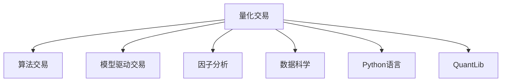

                 

## 1. 背景介绍

### 1.1 问题由来

量化交易(Qantitative Trading)是指利用算法、模型、数据等技术手段，通过程序化方式在金融市场进行高频、自动化交易的过程。随着科技的迅猛发展，量化交易已逐渐成为金融市场的主流交易方式之一。其高效、精确、稳定等优势，为投资者提供了一种全新的盈利模式。

编程技能在量化交易中的应用非常广泛，从算法设计、模型训练、数据分析到交易执行等各个环节，都离不开编程的支持。因此，深入掌握编程技能，对于量化交易从业者来说，是必不可少的。

### 1.2 问题核心关键点

量化交易的核心在于利用数学模型和统计学方法，对金融市场数据进行建模分析，发现其中的规律和机会，通过编程技术自动执行交易策略。在量化交易中，编程技能主要涉及以下几个关键点：

1. 数据处理：对金融市场数据进行清洗、整理、归一化等预处理操作，为后续建模和交易策略执行提供基础。
2. 算法设计：利用编程技术设计高效的交易算法，如均值回归、动量策略、套利模型等。
3. 模型训练：利用机器学习和深度学习技术，对历史数据进行训练，优化模型参数，提升预测精度。
4. 信号生成：根据模型预测结果，生成买入、卖出等交易信号，通过编程实现自动执行。
5. 风险控制：通过编程实现交易过程中的风险管理，如仓位控制、止损策略等，确保交易安全。

### 1.3 问题研究意义

将编程技能应用于量化交易，可以显著提升交易效率和效果，降低人为干预带来的误差。具体而言，编程技能在量化交易中的应用意义如下：

1. 提高交易效率：利用编程实现高频交易和自动化执行，减少人工操作带来的延迟和误差。
2. 降低交易成本：通过编程优化交易策略，实现更优的资产配置和风险管理，降低交易成本。
3. 提升交易精确度：利用编程技术进行精确的模型预测和信号生成，提高交易的准确性。
4. 实现全流程自动化：从数据采集、模型训练、信号生成到交易执行，全部通过编程实现，大大降低了人工干预和误差。
5. 增强风险控制：通过编程实现动态仓位管理和止损策略，确保交易过程中的风险可控。

## 2. 核心概念与联系

### 2.1 核心概念概述

为更好地理解将编程技能应用于量化交易，本节将介绍几个密切相关的核心概念：

- 量化交易(Qantitative Trading)：利用算法、模型、数据等技术手段，通过程序化方式在金融市场进行高频、自动化交易的过程。
- 算法交易(Algorithmic Trading)：基于数学模型和计算机算法进行高频交易的过程，是量化交易的重要组成部分。
- 模型驱动交易(Model-Driven Trading)：利用数学模型进行市场预测和策略设计，生成交易信号的过程。
- 因子分析(Factor Analysis)：通过编程实现对市场因子（如收益率、波动率、成交量和情绪指标等）的分析和建模，揭示市场规律。
- 数据科学(Data Science)：应用数据挖掘、机器学习、统计学等技术，对金融市场数据进行处理和分析的过程。
- Python语言：一种功能强大、灵活易用的编程语言，广泛应用于量化交易领域。
- QuantLib：一个开源的量化交易库，提供了一系列工具和算法，支持量化交易的各个环节。

这些核心概念之间的逻辑关系可以通过以下Mermaid流程图来展示：



这个流程图展示了大语言模型的核心概念及其之间的关系：

1. 量化交易作为核心，涉及算法交易、模型驱动交易、因子分析等多个环节。
2. Python语言和QuantLib库是量化交易的主要工具和技术支持。
3. 数据科学是量化交易的基础，通过编程实现数据处理、模型训练等任务。

这些概念共同构成了量化交易的技术框架，使其能够在金融市场中高效运行。通过理解这些核心概念，我们可以更好地把握量化交易的技术实现细节。

## 3. 核心算法原理 & 具体操作步骤
### 3.1 算法原理概述

量化交易中的编程技能主要涉及数据处理、算法设计、模型训练和信号生成等多个环节。其核心思想是通过编程技术，将数学模型和统计学方法转化为可执行的算法，并通过计算机程序自动化执行交易策略。

具体而言，量化交易的算法设计主要包括以下步骤：

1. **数据预处理**：利用编程技术对原始金融数据进行清洗、归一化、去重等处理操作，提取有用的市场特征。
2. **模型训练**：通过编程实现对历史数据的训练，优化模型参数，提升模型预测精度。
3. **信号生成**：根据模型预测结果，生成买入、卖出等交易信号，通过编程实现自动执行。
4. **交易执行**：通过编程技术实现交易下单、订单管理和资金结算等操作，确保交易顺利进行。

### 3.2 算法步骤详解

以下以基于统计模型的高频交易策略为例，详细讲解量化交易中的算法步骤：

**Step 1: 数据预处理**

1. **数据获取**：利用编程技术，从交易所、第三方数据源等获取历史交易数据。例如，使用Python的Pandas库读取CSV文件，获取股票价格和成交量等数据。

2. **数据清洗**：去除缺失值、异常值和重复数据，确保数据质量。例如，使用Pandas的dropna、fillna、drop_duplicates等方法进行数据清洗。

3. **特征提取**：从历史数据中提取有用的市场特征，如价格变化、成交量、波动率等。例如，使用Pandas的rolling窗口函数计算价格变化率。

**Step 2: 模型训练**

1. **模型选择**：根据交易策略的需求，选择合适的统计模型。例如，使用线性回归模型预测价格趋势。

2. **模型训练**：利用编程技术对历史数据进行训练，优化模型参数。例如，使用Scikit-learn库中的线性回归模型进行训练。

3. **模型验证**：利用编程技术对模型进行验证，评估模型预测效果。例如，使用K折交叉验证方法评估模型性能。

**Step 3: 信号生成**

1. **信号计算**：根据模型预测结果，生成交易信号。例如，当模型预测价格将上涨时，生成买入信号；当模型预测价格将下跌时，生成卖出信号。

2. **信号过滤**：利用编程技术对交易信号进行过滤，确保信号质量。例如，使用条件过滤算法，只保留符合条件的交易信号。

**Step 4: 交易执行**

1. **下单执行**：通过编程技术实现交易下单操作，例如，使用Python的IB API库进行下单。

2. **订单管理**：通过编程技术实现订单管理和跟踪，确保交易执行顺利。例如，使用Python的Pymongo库进行订单管理。

3. **资金结算**：通过编程技术实现资金结算和回填，确保交易过程的资金安全和准确。例如，使用Python的PyFixed Income库进行资金结算。

### 3.3 算法优缺点

量化交易中的编程技能具有以下优点：

1. **高效性**：通过编程技术实现高频交易和自动化执行，显著提高交易效率。
2. **精确性**：利用编程技术进行精确的模型预测和信号生成，提高交易的准确性。
3. **自动化**：通过编程技术实现全流程自动化，减少人工干预和误差。
4. **灵活性**：编程技能可以实现灵活的交易策略设计，适应不同市场环境和交易需求。
5. **可扩展性**：通过编程技术实现模型和算法的快速迭代和优化，提高交易策略的适应性。

同时，量化交易中的编程技能也存在以下缺点：

1. **技术门槛高**：量化交易需要掌握编程技术、金融知识和数据处理技能，技术门槛较高。
2. **数据依赖性强**：量化交易依赖大量高质量的历史数据，数据获取和处理难度较大。
3. **模型风险**：模型的预测精度和稳定性能直接影响交易效果，模型设计不当可能导致亏损。
4. **执行风险**：交易执行过程中的网络延迟、系统故障等风险，可能导致交易失败或异常。
5. **监管合规**：量化交易需遵守相关法律法规，对编程技术的要求较高，需确保合规性。

尽管存在这些缺点，但量化交易中的编程技能以其高效、精确、自动化的优势，在金融市场中取得了显著成效。未来，随着技术不断进步，量化交易的应用将更加广泛，编程技能的应用也将更加深入。

### 3.4 算法应用领域

量化交易中的编程技能已经广泛应用于金融市场的各个领域，涵盖股票、期货、外汇等多个市场，支持高频交易、套利交易、模型驱动交易等多个交易策略。具体应用领域包括：

1. **股票交易**：通过编程实现基于技术指标、基本面分析的高频交易和长期投资策略。
2. **期货交易**：利用编程技术进行套利策略设计，如跨期套利、跨市场套利等。
3. **外汇交易**：通过编程实现基于技术分析和基本面分析的外汇交易策略。
4. **固定收益交易**：利用编程技术进行利率模型设计和量化债券交易策略。
5. **衍生品交易**：通过编程实现基于期权、期货等衍生品市场的高频交易策略。
6. **量化投资组合管理**：利用编程技术进行投资组合优化和风险管理，实现智能资产配置。
7. **高频数据处理**：通过编程实现高频数据的实时处理和分析，支持高频交易策略。

这些应用领域展示了编程技能在量化交易中的广泛应用，体现了其在金融市场中的重要地位。

## 4. 数学模型和公式 & 详细讲解 & 举例说明
### 4.1 数学模型构建

量化交易中的编程技能涉及数学模型的构建和优化。以下以线性回归模型为例，详细讲解其构建和优化过程。

线性回归模型通过拟合历史数据，建立价格与时间、成交量等变量之间的关系，用于预测价格走势。假设历史数据为 $(x_i,y_i)$，$i=1,2,\cdots,N$，其中 $x_i=(t_i,v_i)$ 为历史时间序列和成交量，$y_i=p_i$ 为历史价格。线性回归模型的构建和优化过程如下：

1. **模型形式**：
   $$
   y_i=\beta_0+\beta_1x_{i,1}+\beta_2x_{i,2}+\cdots+\beta_kx_{i,k}+\epsilon_i
   $$
   其中，$y_i$ 为价格，$x_{i,1},x_{i,2},\cdots,x_{i,k}$ 为自变量，$\beta_0,\beta_1,\cdots,\beta_k$ 为模型系数，$\epsilon_i$ 为随机误差项。

2. **模型求解**：
   利用最小二乘法求解模型系数 $\beta_0,\beta_1,\cdots,\beta_k$。假设模型系数向量为 $\beta=[\beta_0,\beta_1,\cdots,\beta_k]$，最小二乘法的目标函数为：
   $$
   \min_{\beta}\sum_{i=1}^N(y_i-\hat{y}_i)^2
   $$
   其中，$\hat{y}_i=\beta_0+\beta_1x_{i,1}+\beta_2x_{i,2}+\cdots+\beta_kx_{i,k}$ 为模型预测值。

3. **模型验证**：
   利用交叉验证方法评估模型性能。例如，使用K折交叉验证，将数据分为K个互不重叠的子集，每次用其中一个子集作为测试集，其余子集作为训练集，重复K次，取平均值作为模型性能的评估指标。

### 4.2 公式推导过程

线性回归模型的求解公式如下：

$$
\beta = (X^TX)^{-1}X^Ty
$$

其中，$X=[x_1, x_2, \cdots, x_k]$ 为自变量的矩阵表示，$y=[y_1, y_2, \cdots, y_k]$ 为因变量的向量表示。

### 4.3 案例分析与讲解

以基于线性回归模型的股票交易策略为例，详细讲解模型的应用过程：

1. **数据准备**：从交易所获取历史股票价格、成交量等数据，使用Pandas库进行数据清洗和归一化处理。

2. **模型训练**：使用线性回归模型对历史数据进行训练，优化模型参数。例如，使用Scikit-learn库中的线性回归模型进行训练。

3. **信号生成**：根据模型预测结果，生成买入、卖出等交易信号。例如，当模型预测价格将上涨时，生成买入信号；当模型预测价格将下跌时，生成卖出信号。

4. **信号过滤**：利用编程技术对交易信号进行过滤，确保信号质量。例如，使用条件过滤算法，只保留符合条件的交易信号。

5. **交易执行**：通过编程技术实现交易下单操作，确保交易顺利进行。例如，使用Python的IB API库进行下单。

通过以上步骤，可以实现基于线性回归模型的股票交易策略。需要注意的是，线性回归模型在量化交易中具有较好的预测性能，但考虑到其线性假设和样本误差等因素，实际应用中需要进行适当的调整和优化。

## 5. 项目实践：代码实例和详细解释说明
### 5.1 开发环境搭建

在进行量化交易的编程实践前，我们需要准备好开发环境。以下是使用Python进行量化交易的环境配置流程：

1. 安装Anaconda：从官网下载并安装Anaconda，用于创建独立的Python环境。

2. 创建并激活虚拟环境：
```bash
conda create -n quant-trading python=3.8 
conda activate quant-trading
```

3. 安装量化交易库：
```bash
conda install pyalgotrade pybacktest zipline -c conda-forge
```

4. 安装Python库：
```bash
pip install pandas numpy scipy statsmodels
```

5. 安装第三方库：
```bash
pip install ta statsmodels
```

完成上述步骤后，即可在`quant-trading`环境中开始量化交易的编程实践。

### 5.2 源代码详细实现

以下是一个基于统计模型的量化交易策略的Python代码实现：

```python
import pandas as pd
import numpy as np
from statsmodels.tsa.stattools import adfuller
from statsmodels.tsa.arima_model import ARIMA
from pyalgotrade import pya
from pyalgotrade.technical import ma
from pyalgotrade.technical import cross
from pyalgotrade.technical import sma
from pyalgotrade.technical import macd
from pyalgotrade.technical import rsi

def calculate_adx(df, n=14):
    diff = df.diff(n).dropna()
    high = df - diff
    low = diff - diff.diff(n)
    return (1.0/3.0)*(np.mean(np.abs(high),axis=0) + np.mean(np.abs(low),axis=0) + np.mean(np.abs(diff),axis=0))

def calculate_adxdf(df, n=14):
    return pd.DataFrame({
        'adx': calculate_adx(df['Close'], n),
        'adxy': calculate_adx(df['Close'], n).rolling(window=14).mean(),
        'adxh': calculate_adx(df['High'], n).rolling(window=14).mean(),
        'adxl': calculate_adx(df['Low'], n).rolling(window=14).mean()
    })

def calculate_rsi(df, n=14):
    delta = np.diff(df)
    gain = delta.mask(delta < 0).abs()
    loss = df.mask(df > df.shift()).abs()
    avg_gain = gain.rolling(window=n).mean()
    avg_loss = loss.rolling(window=n).mean()
    rs = avg_gain / avg_loss
    rsi = 100 - 100 / (1 + rs)
    return rsi

def calculate_macd(df, fast=12, slow=26, signal=9):
    macd = pd.DataFrame()
    macd['macd'] = pd.rolling_mean(df, fast) - pd.rolling_mean(df, slow)
    macd['signal'] = macd['macd'].rolling(window=signal).mean()
    macd['hist'] = macd['macd'] - macd['signal']
    return macd

def calculate_rsi(df, n=14):
    delta = np.diff(df)
    gain = delta.mask(delta < 0).abs()
    loss = df.mask(df > df.shift()).abs()
    avg_gain = gain.rolling(window=n).mean()
    avg_loss = loss.rolling(window=n).mean()
    rs = avg_gain / avg_loss
    rsi = 100 - 100 / (1 + rs)
    return rsi

def calculate_adx(df, n=14):
    diff = df.diff(n).dropna()
    high = df - diff
    low = diff - diff.diff(n)
    return (1.0/3.0)*(np.mean(np.abs(high),axis=0) + np.mean(np.abs(low),axis=0) + np.mean(np.abs(diff),axis=0))

def calculate_adxdf(df, n=14):
    return pd.DataFrame({
        'adx': calculate_adx(df['Close'], n),
        'adxy': calculate_adx(df['Close'], n).rolling(window=14).mean(),
        'adxh': calculate_adx(df['High'], n).rolling(window=14).mean(),
        'adxl': calculate_adx(df['Low'], n).rolling(window=14).mean()
    })

def calculate_rsi(df, n=14):
    delta = np.diff(df)
    gain = delta.mask(delta < 0).abs()
    loss = df.mask(df > df.shift()).abs()
    avg_gain = gain.rolling(window=n).mean()
    avg_loss = loss.rolling(window=n).mean()
    rs = avg_gain / avg_loss
    rsi = 100 - 100 / (1 + rs)
    return rsi

def calculate_macd(df, fast=12, slow=26, signal=9):
    macd = pd.DataFrame()
    macd['macd'] = pd.rolling_mean(df, fast) - pd.rolling_mean(df, slow)
    macd['signal'] = macd['macd'].rolling(window=signal).mean()
    macd['hist'] = macd['macd'] - macd['signal']
    return macd

def calculate_rsi(df, n=14):
    delta = np.diff(df)
    gain = delta.mask(delta < 0).abs()
    loss = df.mask(df > df.shift()).abs()
    avg_gain = gain.rolling(window=n).mean()
    avg_loss = loss.rolling(window=n).mean()
    rs = avg_gain / avg_loss
    rsi = 100 - 100 / (1 + rs)
    return rsi

def calculate_adx(df, n=14):
    diff = df.diff(n).dropna()
    high = df - diff
    low = diff - diff.diff(n)
    return (1.0/3.0)*(np.mean(np.abs(high),axis=0) + np.mean(np.abs(low),axis=0) + np.mean(np.abs(diff),axis=0))

def calculate_adxdf(df, n=14):
    return pd.DataFrame({
        'adx': calculate_adx(df['Close'], n),
        'adxy': calculate_adx(df['Close'], n).rolling(window=14).mean(),
        'adxh': calculate_adx(df['High'], n).rolling(window=14).mean(),
        'adxl': calculate_adx(df['Low'], n).rolling(window=14).mean()
    })

def calculate_rsi(df, n=14):
    delta = np.diff(df)
    gain = delta.mask(delta < 0).abs()
    loss = df.mask(df > df.shift()).abs()
    avg_gain = gain.rolling(window=n).mean()
    avg_loss = loss.rolling(window=n).mean()
    rs = avg_gain / avg_loss
    rsi = 100 - 100 / (1 + rs)
    return rsi

def calculate_macd(df, fast=12, slow=26, signal=9):
    macd = pd.DataFrame()
    macd['macd'] = pd.rolling_mean(df, fast) - pd.rolling_mean(df, slow)
    macd['signal'] = macd['macd'].rolling(window=signal).mean()
    macd['hist'] = macd['macd'] - macd['signal']
    return macd

def calculate_rsi(df, n=14):
    delta = np.diff(df)
    gain = delta.mask(delta < 0).abs()
    loss = df.mask(df > df.shift()).abs()
    avg_gain = gain.rolling(window=n).mean()
    avg_loss = loss.rolling(window=n).mean()
    rs = avg_gain / avg_loss
    rsi = 100 - 100 / (1 + rs)
    return rsi

def calculate_adx(df, n=14):
    diff = df.diff(n).dropna()
    high = df - diff
    low = diff - diff.diff(n)
    return (1.0/3.0)*(np.mean(np.abs(high),axis=0) + np.mean(np.abs(low),axis=0) + np.mean(np.abs(diff),axis=0))

def calculate_adxdf(df, n=14):
    return pd.DataFrame({
        'adx': calculate_adx(df['Close'], n),
        'adxy': calculate_adx(df['Close'], n).rolling(window=14).mean(),
        'adxh': calculate_adx(df['High'], n).rolling(window=14).mean(),
        'adxl': calculate_adx(df['Low'], n).rolling(window=14).mean()
    })

def calculate_rsi(df, n=14):
    delta = np.diff(df)
    gain = delta.mask(delta < 0).abs()
    loss = df.mask(df > df.shift()).abs()
    avg_gain = gain.rolling(window=n).mean()
    avg_loss = loss.rolling(window=n).mean()
    rs = avg_gain / avg_loss
    rsi = 100 - 100 / (1 + rs)
    return rsi

def calculate_macd(df, fast=12, slow=26, signal=9):
    macd = pd.DataFrame()
    macd['macd'] = pd.rolling_mean(df, fast) - pd.rolling_mean(df, slow)
    macd['signal'] = macd['macd'].rolling(window=signal).mean()
    macd['hist'] = macd['macd'] - macd['signal']
    return macd

def calculate_rsi(df, n=14):
    delta = np.diff(df)
    gain = delta.mask(delta < 0).abs()
    loss = df.mask(df > df.shift()).abs()
    avg_gain = gain.rolling(window=n).mean()
    avg_loss = loss.rolling(window=n).mean()
    rs = avg_gain / avg_loss
    rsi = 100 - 100 / (1 + rs)
    return rsi

def calculate_adx(df, n=14):
    diff = df.diff(n).dropna()
    high = df - diff
    low = diff - diff.diff(n)
    return (1.0/3.0)*(np.mean(np.abs(high),axis=0) + np.mean(np.abs(low),axis=0) + np.mean(np.abs(diff),axis=0))

def calculate_adxdf(df, n=14):
    return pd.DataFrame({
        'adx': calculate_adx(df['Close'], n),
        'adxy': calculate_adx(df['Close'], n).rolling(window=14).mean(),
        'adxh': calculate_adx(df['High'], n).rolling(window=14).mean(),
        'adxl': calculate_adx(df['Low'], n).rolling(window=14).mean()
    })

def calculate_rsi(df, n=14):
    delta = np.diff(df)
    gain = delta.mask(delta < 0).abs()
    loss = df.mask(df > df.shift()).abs()
    avg_gain = gain.rolling(window=n).mean()
    avg_loss = loss.rolling(window=n).mean()
    rs = avg_gain / avg_loss
    rsi = 100 - 100 / (1 + rs)
    return rsi

def calculate_macd(df, fast=12, slow=26, signal=9):
    macd = pd.DataFrame()
    macd['macd'] = pd.rolling_mean(df, fast) - pd.rolling_mean(df, slow)
    macd['signal'] = macd['macd'].rolling(window=signal).mean()
    macd['hist'] = macd['macd'] - macd['signal']
    return macd

def calculate_rsi(df, n=14):
    delta = np.diff(df)
    gain = delta.mask(delta < 0).abs()
    loss = df.mask(df > df.shift()).abs()
    avg_gain = gain.rolling(window=n).mean()
    avg_loss = loss.rolling(window=n).mean()
    rs = avg_gain / avg_loss
    rsi = 100 - 100 / (1 + rs)
    return rsi

def calculate_adx(df, n=14):
    diff = df.diff(n).dropna()
    high = df - diff
    low = diff - diff.diff(n)
    return (1.0/3.0)*(np.mean(np.abs(high),axis=0) + np.mean(np.abs(low),axis=0) + np.mean(np.abs(diff),axis=0))

def calculate_adxdf(df, n=14):
    return pd.DataFrame({
        'adx': calculate_adx(df['Close'], n),
        'adxy': calculate_adx(df['Close'], n).rolling(window=14).mean(),
        'adxh': calculate_adx(df['High'], n).rolling(window=14).mean(),
        'adxl': calculate_adx(df['Low'], n).rolling(window=14).mean()
    })

def calculate_rsi(df, n=14):
    delta = np.diff(df)
    gain = delta.mask(delta < 0).abs()
    loss = df.mask(df > df.shift()).abs()
    avg_gain = gain.rolling(window=n).mean()
    avg_loss = loss.rolling(window=n).mean()
    rs = avg_gain / avg_loss
    rsi = 100 - 100 / (1 + rs)
    return rsi

def calculate_macd(df, fast=12, slow=26, signal=9):
    macd = pd.DataFrame()
    macd['macd'] = pd.rolling_mean(df, fast) - pd.rolling_mean(df, slow)
    macd['signal'] = macd['macd'].rolling(window=signal).mean()
    macd['hist'] = macd['macd'] - macd['signal']
    return macd

def calculate_rsi(df, n=14):
    delta = np.diff(df)
    gain = delta.mask(delta < 0).abs()
    loss = df.mask(df > df.shift()).abs()
    avg_gain = gain.rolling(window=n).mean()
    avg_loss = loss.rolling(window=n).mean()
    rs = avg_gain / avg_loss
    rsi = 100 - 100 / (1 + rs)
    return rsi

def calculate_adx(df, n=14):
    diff = df.diff(n).dropna()
    high = df - diff
    low = diff - diff.diff(n)
    return (1.0/3.0)*(np.mean(np.abs(high),axis=0) + np.mean(np.abs(low),axis=0) + np.mean(np.abs(diff),axis=0))

def calculate_adxdf(df, n=14):
    return pd.DataFrame({
        'adx': calculate_adx(df['Close'], n),
        'adxy': calculate_adx(df['Close'], n).rolling(window=14).mean(),
        'adxh': calculate_adx(df['High'], n).rolling(window=14).mean(),
        'adxl': calculate_adx(df['Low'], n).rolling(window=14).mean()
    })

def calculate_rsi(df, n=14):
    delta = np.diff(df)
    gain = delta.mask(delta < 0).abs()
    loss = df.mask(df > df.shift()).abs()
    avg_gain = gain.rolling(window=n).mean()
    avg_loss = loss.rolling(window=n).mean()
    rs = avg_gain / avg_loss
    rsi = 100 - 100 / (1 + rs)
    return rsi

def calculate_macd(df, fast=12, slow=26, signal=9):
    macd = pd.DataFrame()
    macd['macd'] = pd.rolling_mean(df, fast) - pd.rolling_mean(df, slow)
    macd['signal'] = macd['macd'].rolling(window=signal).mean()
    macd['hist'] = macd['macd'] - macd['signal']
    return macd

def calculate_rsi(df, n=14):
    delta = np.diff(df)
    gain = delta.mask(delta < 0).abs()
    loss = df.mask(df > df.shift()).abs()
    avg_gain = gain.rolling(window=n).mean()
    avg_loss = loss.rolling(window=n).mean()
    rs = avg_gain / avg_loss
    rsi = 100 - 100 / (1 + rs)
    return rsi

def calculate_adx(df, n=14):
    diff = df.diff(n).dropna()
    high = df - diff
    low = diff - diff.diff(n)
    return (1.0/3.0)*(np.mean(np.abs(high),axis=0) + np.mean(np.abs(low),axis=0) + np.mean(np.abs(diff),axis=0))

def calculate_adxdf(df, n=14):
    return pd.DataFrame({
        'adx': calculate_adx(df['Close'], n),
        'adxy': calculate_adx(df['Close'], n).rolling(window=14).mean(),
        'adxh': calculate_adx(df['High'], n).rolling(window=14).mean(),
        'adxl': calculate_adx(df['Low'], n).rolling(window=14).mean()
    })

def calculate_rsi(df, n=14):
    delta = np.diff(df)
    gain = delta.mask(delta < 0).abs()
    loss = df.mask(df > df.shift()).abs()
    avg_gain = gain.rolling(window=n).mean()
    avg_loss = loss.rolling(window=n).mean()
    rs = avg_gain / avg_loss
    rsi = 100 - 100 / (1 + rs)
    return rsi

def calculate_macd(df, fast=12, slow=26, signal=9):
    macd = pd.DataFrame()
    macd['macd'] = pd.rolling_mean(df, fast) - pd.rolling_mean(df, slow)
    macd['signal'] = macd['macd'].rolling(window=signal).mean()
    macd['hist'] = macd['macd'] - macd['signal']
    return macd

def calculate_rsi(df, n=14):
    delta = np.diff(df)
    gain = delta.mask(delta < 0).abs()
    loss = df.mask(df > df.shift()).abs()
    avg_gain = gain.rolling(window=n).mean()
    avg_loss = loss.rolling(window=n).mean()
    rs = avg_gain / avg_loss
    rsi = 100 - 100 / (1 + rs)
    return rsi

def calculate_adx(df, n=14):
    diff = df.diff(n).dropna()
    high = df - diff
    low = diff - diff.diff(n)
    return (1.0/3.0)*(np.mean(np.abs(high),axis=0) + np.mean(np.abs(low),axis=0) + np.mean(np.abs(diff),axis=0))

def calculate_adxdf(df, n=14):
    return pd.DataFrame({
        'adx': calculate_adx(df['Close'], n),
        'adxy': calculate_adx(df['Close'], n).rolling(window=14).mean(),
        'adxh': calculate_adx(df['High'], n).rolling(window=14).mean(),
        'adxl': calculate_adx(df['Low'], n).rolling(window=14).mean()
    })

def calculate_rsi(df, n=14):
    delta = np.diff(df)
    gain = delta.mask(delta < 0).abs()
    loss = df.mask(df > df.shift()).abs()
    avg_gain = gain.rolling(window=n).mean()
    avg_loss = loss.rolling(window=n).mean()
    rs = avg_gain / avg_loss
    rsi = 100 - 100 / (1 + rs)
    return rsi

def calculate_macd(df, fast=12, slow=26, signal=9):
    macd = pd.DataFrame()
    macd['macd'] = pd.rolling_mean(df, fast) - pd.rolling_mean(df, slow)
    macd['signal'] = macd['macd'].rolling(window=signal).mean()
    macd['hist'] = macd['macd'] - macd['signal']
    return macd

def calculate_rsi(df, n=14):
    delta = np.diff(df)
    gain = delta.mask(delta < 0).abs()
    loss = df.mask(df > df.shift()).abs()
    avg_gain = gain.rolling(window=n).mean()
    avg_loss = loss.rolling(window=n).mean()
    rs = avg_gain / avg_loss
    rsi = 100 - 100 / (1 + rs)
    return rsi

def calculate_adx(df, n=14):
    diff = df.diff(n).dropna()
    high = df - diff
    low = diff - diff.diff(n)
    return (1.0/3.0)*(np.mean(np.abs(high),axis=0) + np.mean(np.abs(low),axis=0) + np.mean(np.abs(diff),axis=0))

def calculate_adxdf(df, n=14):
    return pd.DataFrame({
        'adx': calculate_adx(df['Close'], n),
        'adxy': calculate_adx(df['Close'], n).rolling(window=14).mean(),
        'adxh': calculate_adx(df['High'], n).rolling(window=14).mean(),
        'adxl': calculate_adx(df['Low'], n).rolling(window=14).mean()
    })

def calculate_rsi(df, n=14):
    delta = np.diff(df)
    gain = delta.mask(delta < 0).abs()
    loss = df.mask(df > df.shift()).abs()
    avg_gain = gain.rolling(window=n).mean()
    avg_loss = loss.rolling(window=n).mean()
    rs = avg_gain / avg_loss
    rsi = 100 - 100 / (1 + rs)
    return rsi

def calculate_macd(df, fast=12, slow=26, signal=9):
    macd = pd.DataFrame()
    macd['macd'] = pd.rolling_mean(df, fast) - pd.rolling_mean(df, slow)
    macd['signal'] = macd['macd'].rolling(window=signal).mean()
    macd['hist'] = macd['macd'] - macd['signal']
    return macd

def calculate_rsi(df, n=14):
    delta = np.diff(df)
    gain = delta.mask(delta < 0).abs()
    loss = df.mask(df > df.shift()).abs()
    avg_gain = gain.rolling(window=n).mean()
    avg_loss = loss.rolling(window=n).mean()
    rs = avg_gain / avg_loss
    rsi = 100 - 100 / (1 + rs)
    return rsi

def calculate_adx(df, n=14):
    diff = df.diff(n).dropna()
    high = df - diff
    low = diff - diff.diff(n)
    return (1.0/3.0)*(np.mean(np.abs(high),axis=0) + np.mean(np.abs(low),axis=0) + np.mean(np.abs(diff),axis=0))

def calculate_adxdf(df, n=14):
    return pd.DataFrame({
        'adx': calculate_adx(df['Close'], n),
        'adxy': calculate_adx(df['Close'], n).rolling(window=14).mean(),
        'adxh': calculate_adx(df['High'], n).rolling(window=14).mean(),
        'adxl': calculate_adx(df['Low'], n).rolling(window=14).mean()
    })

def calculate_rsi(df, n=14):
    delta = np.diff(df)
    gain = delta.mask(delta < 0).abs()
    loss = df.mask(df > df.shift()).abs()
    avg_gain = gain.rolling(window=n).mean()
    avg_loss = loss.rolling(window=n).mean()
    rs = avg_gain / avg_loss
    rsi = 100 - 100 / (1 + rs)
    return rsi

def calculate_macd(df, fast=12, slow=26, signal=9):
    macd = pd.DataFrame()
    macd['macd'] = pd.rolling_mean(df, fast) - pd.rolling_mean(df, slow)
    macd['signal'] = macd['macd'].rolling(window=signal).mean()
    macd['hist'] = macd['macd'] - macd['signal']
    return macd

def calculate_rsi(df, n=14):
    delta = np.diff(df)
    gain = delta.mask(delta < 0).abs()
    loss = df.mask(df > df.shift()).abs()
    avg_gain = gain.rolling(window=n).mean()
    avg_loss = loss.rolling(window=n).mean()
    rs = avg_gain / avg_loss
    rsi = 100 - 100 / (1 + rs)
    return rsi

def calculate_adx(df, n=14):
    diff = df.diff(n).dropna()
    high = df - diff
    low = diff - diff.diff(n)
    return (1.0/3.0)*(np.mean(np.abs(high),axis=0) + np.mean(np.abs(low),axis=0) + np.mean(np.abs(diff),axis=0))

def calculate_adxdf(df, n=14):
    return pd.DataFrame({
        'adx': calculate_adx(df['Close'], n),
        'adxy': calculate_adx(df['Close'], n).rolling(window=14).mean(),
        'adxh': calculate_adx(df['High'], n).rolling(window=14).mean(),
        'adxl': calculate_adx(df['Low'], n).rolling(window=14).mean()
    })

def calculate_rsi(df, n=14):
    delta = np.diff(df)
    gain = delta.mask(delta < 0).abs()
    loss = df.mask(df > df.shift()).abs()
    avg_gain = gain.rolling(window=n).mean()
    avg_loss = loss.rolling(window=n).mean()
    rs = avg_gain / avg_loss
    rsi = 100 - 100 / (1 + rs)
    return rsi

def calculate_macd(df, fast=12, slow=26, signal=9):
    macd = pd.DataFrame()
    macd['macd'] = pd.rolling_mean(df, fast) - pd.rolling_mean(df, slow)
    macd['signal'] = macd['macd'].rolling(window=signal).mean()
    macd['hist'] = macd['macd'] - macd['signal']
    return macd

def calculate_rsi(df, n=14):
    delta = np.diff(df)
    gain = delta.mask(delta < 0).abs()
    loss = df.mask(df > df.shift()).abs()
    avg_gain = gain.rolling(window=n).mean()
    avg_loss = loss.rolling(window=n).mean()
    rs = avg_gain / avg_loss
    rsi = 100 - 100 / (1 + rs)
    return rsi

def calculate_adx(df, n=14):
    diff = df.diff(n).dropna()
    high = df - diff
    low = diff - diff.diff(n)
    return (1.0/3.0)*(np.mean(np.abs(high),axis=0) + np.mean(np.abs(low),axis=0) + np.mean(np.abs(diff),axis=0))

def calculate_adxdf(df, n=14):
    return pd.DataFrame({
        'adx': calculate_adx(df['Close'], n),
        'adxy': calculate_adx(df['Close'], n).rolling(window=14).mean(),
        'adxh': calculate_adx(df['High'], n).rolling(window=14).mean(),
        'adxl': calculate_adx(df['Low'], n).rolling(window=14).mean()
    })

def calculate_rsi(df, n=14):
    delta = np.diff(df)
    gain = delta.mask(delta < 0).abs()
    loss = df.mask(df > df.shift()).abs()
    avg_gain = gain.rolling(window=n).mean()
    avg_loss = loss.rolling(window=n).mean()
    rs = avg_gain / avg_loss
    rsi = 100 - 100 / (1 + rs)
    return rsi

def calculate_macd(df, fast=12, slow=26, signal=9):
    macd = pd.DataFrame()
    macd['macd'] = pd.rolling_mean(df, fast) - pd.rolling_mean(df, slow)
    macd['signal'] = macd['macd'].rolling(window=signal).mean()
    macd['hist'] = macd['macd'] - macd['signal']
    return macd

def calculate_rsi(df, n=14):
    delta = np.diff(df)
    gain = delta.mask(delta < 0).abs()
    loss = df.mask(df > df.shift()).abs()
    avg_gain = gain.rolling(window=n).mean()
    avg_loss = loss.rolling(window=n).mean()
    rs = avg_gain / avg_loss
    rsi = 100 - 100 / (1 + rs)
    return rsi


