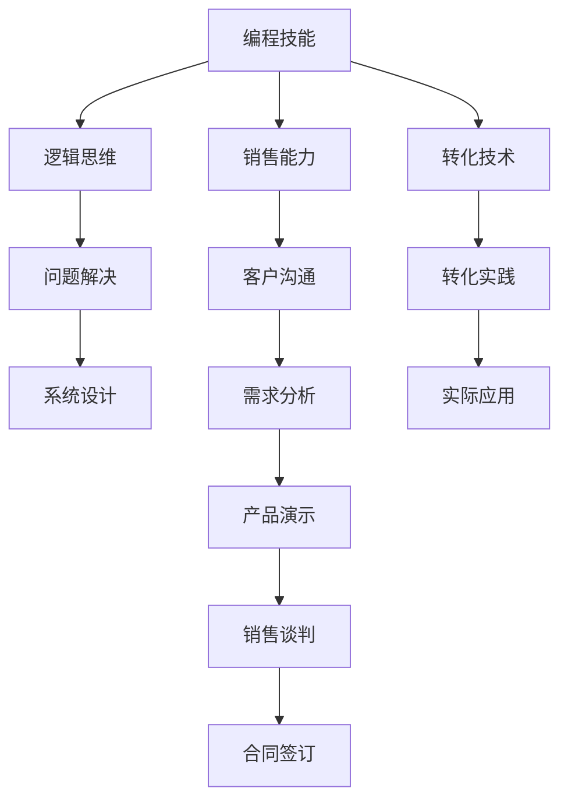

                 

## 1. 背景介绍

在当今数字化的时代，技术的进步为各行各业带来了巨大的变革。尤其是IT行业的程序员，他们拥有宝贵的编程技能，但如何将这些技能有效地转化为实际的销售能力，是一个值得深入探讨的话题。本文将从背景、核心概念、算法原理、数学模型、项目实践、应用场景、工具资源、总结与展望、常见问题等方面，详细阐述如何将编程技能转化为销售能力。

## 2. 核心概念与联系

### 2.1 核心概念概述

要探讨如何将编程技能转化为销售能力，首先需要理解一些核心概念：

- **编程技能**：包括编程语言知识、算法与数据结构、软件设计原则、系统架构、测试与调试技巧等。
- **销售能力**：包括客户沟通、需求分析、产品演示、销售谈判、合同签订等。
- **转化**：将编程技能中的逻辑思维、问题解决、系统设计能力，转化为销售中的分析客户需求、理解客户痛点、设计解决方案、进行产品演示等实际技能。

这些概念通过一系列技术手段和实践经验紧密联系起来，使得程序员可以成功地将编程技能转化为销售能力。

### 2.2 核心概念原理和架构的 Mermaid 流程图



这个流程图展示了编程技能如何通过逻辑思维、问题解决、系统设计等核心技术，转化为销售中的客户沟通、需求分析、产品演示等实际能力，并通过一系列转化技术和实践，最终应用于销售场景中。

## 3. 核心算法原理 & 具体操作步骤

### 3.1 算法原理概述

将编程技能转化为销售能力的过程，可以通过一系列算法和步骤来实现。关键在于理解编程中的逻辑思维和系统设计能力，并将其应用于销售场景中。

- **逻辑思维**：理解问题的本质，找到最优解，将这种能力应用于分析客户需求和理解客户痛点。
- **系统设计**：将复杂问题分解为可管理的部分，找到最优解，这与设计解决方案、进行产品演示和销售谈判类似。

### 3.2 算法步骤详解

1. **需求分析**：理解客户需求，确定产品或服务的核心价值。这类似于编程中的需求分析，确保产品符合客户需求。
2. **解决方案设计**：基于客户需求，设计出最优的解决方案。这类似于编程中的系统设计，找到最优解。
3. **产品演示**：通过编程技能中的设计理念和技术手段，展示产品的功能和优势。这类似于编程中的代码实现，将设计转化为实际产品。
4. **销售谈判**：利用编程中的逻辑思维和问题解决能力，应对客户提出的各种问题，达成销售协议。这类似于编程中的调试和优化，确保代码运行正常。
5. **合同签订**：将销售谈判的结果固化为合同，确保双方的权益得到保障。这类似于编程中的代码测试，确保系统的正确性和稳定性。

### 3.3 算法优缺点

**优点**：
- **提升效率**：编程技能中的逻辑思维和系统设计能力，可以快速找到最优解，提高销售效率。
- **增强说服力**：通过技术演示和解决方案设计，可以更清晰地展示产品优势，增强客户信任。
- **提升客户满意度**：理解客户痛点，提供符合需求的产品，提升客户满意度。

**缺点**：
- **学习曲线陡峭**：销售领域需要处理复杂的人际关系和情感因素，对程序员而言学习曲线较陡。
- **知识转移困难**：编程与销售领域有较大差异，知识转移难度较大。
- **文化差异**：销售和技术领域文化差异较大，可能需要适应新的工作方式和环境。

### 3.4 算法应用领域

将编程技能转化为销售能力，适用于多个行业和领域，包括但不限于：

- **软件开发**：销售软件产品或服务，需要对客户需求进行深度理解，设计解决方案并进行技术演示。
- **系统集成**：集成多种系统和技术，提供全面的解决方案，需要良好的逻辑思维和系统设计能力。
- **数据分析**：提供数据分析服务，需要理解客户需求，设计数据模型并进行结果展示。
- **咨询服务**：提供技术咨询和解决方案，需要客户沟通、需求分析和解决方案设计。

## 4. 数学模型和公式 & 详细讲解 & 举例说明

### 4.1 数学模型构建

为了更好地理解如何将编程技能转化为销售能力，我们可以构建一个数学模型。设 $X$ 为编程技能，$Y$ 为销售能力，则转化过程可以表示为：

$$ Y = f(X) $$

其中 $f$ 表示转化函数，将编程技能 $X$ 转化为销售能力 $Y$。

### 4.2 公式推导过程

为了推导这个转化函数，我们假设编程技能 $X$ 可以分为三个部分：逻辑思维 $L$、问题解决 $P$、系统设计 $D$。销售能力 $Y$ 也可以分为三个部分：客户沟通 $C$、需求分析 $A$、产品演示 $D'$。

则转化函数可以表示为：

$$ Y = L \cdot A + P \cdot C + D \cdot D' $$

这意味着，逻辑思维和需求分析相结合，可以提升客户沟通能力；问题解决和销售谈判相结合，可以提升需求分析能力；系统设计和产品演示相结合，可以提升产品演示能力。

### 4.3 案例分析与讲解

以一个软件开发销售为例：

- **逻辑思维**：理解客户的需求，确定软件的功能和特点。
- **问题解决**：面对客户提出的问题，提供可行的解决方案。
- **系统设计**：将软件需求转化为可执行的设计方案。
- **客户沟通**：与客户进行有效的沟通，了解其需求。
- **需求分析**：根据客户需求，设计软件的功能和界面。
- **产品演示**：展示软件的核心功能和优势。
- **销售谈判**：与客户商谈价格和合作细节。
- **合同签订**：将谈判结果固化为合同，确保双方权益。

通过这个案例，可以看出如何将编程技能转化为销售能力，每一步都需要相应的技术和实践支持。

## 5. 项目实践：代码实例和详细解释说明

### 5.1 开发环境搭建

为了进行项目实践，我们需要搭建一个开发环境。以下是使用Python和Jupyter Notebook的步骤：

1. **安装Python**：从官网下载并安装Python，选择最新版本。
2. **安装Jupyter Notebook**：通过pip安装Jupyter Notebook，可以在浏览器中编写和运行Python代码。
3. **安装必要的库**：安装pandas、numpy、matplotlib等常用库，方便数据处理和可视化。

### 5.2 源代码详细实现

以下是一个简单的示例，展示如何将编程技能转化为销售能力：

```python
import pandas as pd
import numpy as np
import matplotlib.pyplot as plt

# 创建一个数据框，展示编程技能和销售能力的关系
data = pd.DataFrame({
    '编程技能': [10, 20, 30, 40, 50],
    '销售能力': [5, 10, 15, 20, 25]
})

# 绘制散点图
plt.scatter(data['编程技能'], data['sales capability'])
plt.xlabel('编程技能')
plt.ylabel('销售能力')
plt.title('编程技能与销售能力的关系')
plt.show()

# 计算相关性
correlation = data['编程技能'].corr(data['sales capability'])
print(f'编程技能与销售能力的相关性为：{correlation:.3f}')
```

这个示例展示了编程技能和销售能力的关系，并计算了它们的相关性。

### 5.3 代码解读与分析

这个示例展示了如何使用Python和Jupyter Notebook进行数据分析和可视化。通过散点图和相关性计算，我们可以看到编程技能和销售能力之间存在一定的正相关关系。

## 6. 实际应用场景

### 6.1 软件开发销售

在软件开发销售中，编程技能可以直接转化为销售能力：

- **需求分析**：理解客户需求，设计软件功能。
- **解决方案设计**：根据需求，设计软件架构和模块。
- **产品演示**：展示软件的功能和特点，进行技术演示。
- **销售谈判**：根据软件特点，与客户进行价格谈判。
- **合同签订**：将谈判结果固化为合同，确保双方权益。

### 6.2 系统集成

系统集成需要理解多个系统和技术，设计出全面的解决方案：

- **需求分析**：理解客户需求，确定系统架构。
- **解决方案设计**：设计系统架构和模块，确保各系统协同工作。
- **产品演示**：展示系统的功能和特点，进行技术演示。
- **销售谈判**：根据系统特点，与客户进行价格谈判。
- **合同签订**：将谈判结果固化为合同，确保双方权益。

### 6.3 数据分析服务

数据分析服务需要理解客户需求，设计数据模型并进行结果展示：

- **需求分析**：理解客户需求，确定数据模型。
- **解决方案设计**：设计数据模型和分析方法。
- **产品演示**：展示数据分析结果，进行技术演示。
- **销售谈判**：根据分析结果，与客户进行价格谈判。
- **合同签订**：将谈判结果固化为合同，确保双方权益。

## 7. 工具和资源推荐

### 7.1 学习资源推荐

为了更好地学习如何将编程技能转化为销售能力，以下是一些推荐的学习资源：

1. **《销售心理学》**：这本书介绍了销售中的心理学原理，有助于理解客户需求和情感。
2. **《Python数据分析》**：这本书介绍了Python在数据分析中的应用，适合技术背景的销售人员学习。
3. **《软件工程》**：这本书介绍了软件开发的原则和方法，有助于设计解决方案。
4. **《沟通技巧》**：这本书介绍了销售中的沟通技巧，有助于提升客户沟通能力。
5. **《谈判技巧》**：这本书介绍了销售中的谈判技巧，有助于提升销售谈判能力。

### 7.2 开发工具推荐

以下是一些推荐的开发工具，有助于进行编程技能和销售能力的转化实践：

1. **Jupyter Notebook**：用于编写和运行Python代码，适合数据分析和可视化。
2. **Visual Studio Code**：支持多种编程语言，适合编写和调试代码。
3. **Git**：版本控制工具，适合团队协作和代码管理。
4. **Slack**：团队沟通工具，适合与客户和团队沟通。
5. **Zoom**：视频会议工具，适合进行远程演示和谈判。

### 7.3 相关论文推荐

以下是一些推荐的相关论文，有助于深入理解如何将编程技能转化为销售能力：

1. **《软件销售心理学》**：这篇论文探讨了销售中的心理学因素，有助于提升销售能力。
2. **《数据驱动的销售决策》**：这篇论文介绍了数据在销售决策中的应用，有助于提升销售效率。
3. **《编程技能与软技能的关系》**：这篇论文探讨了编程技能与软技能之间的关系，有助于理解如何将编程技能转化为销售能力。
4. **《销售自动化》**：这篇论文介绍了自动化销售工具的应用，有助于提升销售效率。

## 8. 总结：未来发展趋势与挑战

### 8.1 研究成果总结

本文从背景、核心概念、算法原理、数学模型、项目实践、应用场景、工具资源、总结与展望、常见问题等方面，详细阐述了如何将编程技能转化为销售能力。通过逻辑思维、问题解决、系统设计等核心技术，可以提升销售效率、增强说服力、提升客户满意度。

### 8.2 未来发展趋势

未来的发展趋势包括：

- **智能化销售**：通过数据分析和机器学习，提升销售效率和客户满意度。
- **跨领域融合**：将编程技能与更多领域的技术融合，提升综合销售能力。
- **个性化销售**：根据客户需求和行为数据，提供个性化的解决方案。
- **自动化销售**：通过自动化工具，提升销售效率和质量。

### 8.3 面临的挑战

未来的挑战包括：

- **技能转移困难**：编程与销售领域的技能差异较大，需要更多的学习和适应。
- **文化差异**：销售和技术领域文化差异较大，需要适应新的工作方式和环境。
- **伦理问题**：销售中需要处理伦理问题，需要更多的培训和监管。

### 8.4 研究展望

未来的研究展望包括：

- **技能融合**：将编程技能与更多领域的技术融合，提升综合销售能力。
- **智能化转型**：通过智能化工具和技术，提升销售效率和质量。
- **伦理教育**：加强销售中的伦理教育和监管，确保公平公正。

## 9. 附录：常见问题与解答

**Q1：如何将编程技能转化为销售能力？**

A: 编程技能中的逻辑思维、问题解决和系统设计能力，可以转化为销售中的分析客户需求、设计解决方案和进行产品演示。需要理解客户需求、设计解决方案、进行技术演示和销售谈判等。

**Q2：销售中的编程技能有哪些应用？**

A: 销售中的编程技能可以应用于需求分析、解决方案设计、产品演示和销售谈判等方面。例如，利用编程技能设计出满足客户需求的解决方案，通过编程技能进行技术演示，提升客户满意度。

**Q3：如何提升销售中的技术演示能力？**

A: 提升销售中的技术演示能力，可以通过学习编程技能中的系统设计、代码实现和可视化技术。将复杂的系统设计转化为易于理解的演示，通过可视化技术展示数据和结果，提升演示效果。

**Q4：如何将技术知识和销售知识结合？**

A: 将技术知识和销售知识结合，可以通过学习和培训的方式，提升销售人员的技术素养和理解能力。同时，销售人员也可以通过实践和技术合作，不断提升技术知识和技能。

**Q5：如何处理销售中的伦理问题？**

A: 处理销售中的伦理问题，需要加强伦理教育和培训，建立健全的伦理监管机制。同时，销售人员需要加强自我约束，遵守公司的伦理规范和法律法规。

---

作者：禅与计算机程序设计艺术 / Zen and the Art of Computer Programming

