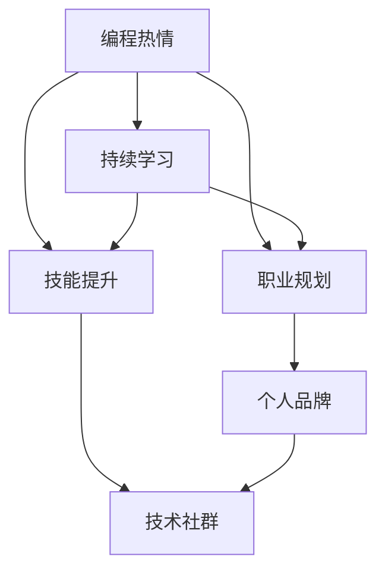

                 

# 如何将编程热情转化为长期事业

## 1. 背景介绍

编程，作为一种强大的认知工具，已成为当今社会不可或缺的一部分。无论是在技术开发、数据科学、人工智能等领域，编程无处不在。然而，面对瞬息万变的技术和职场需求，如何将编程热情转化为一份长期且稳定的事业，成为了许多人关注的问题。本文旨在探讨这一主题，帮助有志于长期从事编程职业的朋友们，理解其中的逻辑和步骤。

## 2. 核心概念与联系

### 2.1 核心概念概述

在探讨如何将编程热情转化为长期事业之前，首先需要了解几个核心概念及其相互关系：

- **编程热情**：这是驱动个人在编程领域持续学习和探索的内在动力。它不仅来源于对编程本身的兴趣，还包含了对解决问题的热情、创造新事物的渴望和对技术进步的关注。
- **职业规划**：基于个人的兴趣和能力，结合市场需求，制定长远的职业发展方向和目标。
- **技能提升**：通过持续学习和实践，不断更新和提升技术技能，以适应不断变化的技术环境和职业要求。
- **个人品牌**：在技术社区建立良好的声誉和影响力，有助于个人职业发展，打开更多机会之门。
- **技术社群**：加入和活跃于技术社区，通过交流和合作，加速个人成长。

这些概念相互关联，共同构成了将编程热情转化为长期事业的基础框架。

### 2.2 核心概念原理和架构的 Mermaid 流程图



## 3. 核心算法原理 & 具体操作步骤

### 3.1 算法原理概述

将编程热情转化为长期事业的过程，可以看作是一个系统性的优化问题。从编程热情出发，通过不断的学习和实践，逐步提升技能、规划职业路径、建立个人品牌和积极融入技术社群，最终达成长期职业发展的目标。这一过程涉及多个因素的优化，包括时间管理、资源投入、技能匹配和市场适应性等。

### 3.2 算法步骤详解

将编程热情转化为长期事业的步骤主要包括以下几个方面：

#### 3.2.1 设定目标

1. **自我评估**：明确自己的兴趣、技能和职业目标。
2. **市场分析**：研究当前技术趋势和市场需求，确定最具潜力的技术领域。
3. **设定具体目标**：根据自我评估和市场分析，设定短期和长期职业目标。

#### 3.2.2 技能提升

1. **选择学习资源**：选择合适的在线课程、书籍、项目和社区资源。
2. **制定学习计划**：根据目标，制定系统的学习计划，包括时间安排、学习内容和评估方法。
3. **实践和项目**：通过实际项目和编程练习，将所学知识应用到实践中。

#### 3.2.3 职业规划

1. **建立网络**：加入技术社区，参加技术会议，拓展人脉。
2. **寻找导师**：寻找行业内的导师，获取职业发展建议。
3. **申请职位**：根据职业目标，申请相应的职位，并通过面试。

#### 3.2.4 个人品牌建设

1. **技术博客**：撰写技术博客，分享学习心得和技术观点。
2. **开源项目**：参与开源项目，提升技术实力和社区影响力。
3. **公开演讲**：参加技术讲座和会议，提高公共演讲和表达能力。

#### 3.2.5 融入技术社群

1. **加入社群**：活跃于GitHub、Stack Overflow、Reddit等技术社区。
2. **贡献代码**：积极贡献代码，解决社区问题，提升社区声誉。
3. **参与讨论**：积极参与技术讨论，分享知识和经验。

### 3.3 算法优缺点

#### 3.3.1 优点

- **系统化**：通过系统性的规划和步骤，有助于明确目标和路径。
- **可操作性**：步骤明确，易于执行，适合初学者和有经验者。
- **灵活性**：可以根据个人情况和市场需求调整计划。

#### 3.3.2 缺点

- **复杂性**：步骤较多，需要时间管理和坚持不懈。
- **资源需求**：需要投入大量时间、精力和资源。
- **竞争激烈**：技术领域竞争激烈，需不断提升自我。

### 3.4 算法应用领域

这一算法不仅适用于技术开发和数据科学领域，也适用于人工智能、机器学习、网络安全、区块链等新兴技术领域。无论处于哪个技术分支，这一算法都可以帮助从业者系统性地规划和提升职业发展。

## 4. 数学模型和公式 & 详细讲解 & 举例说明

### 4.1 数学模型构建

将编程热情转化为长期事业的过程，可以建模为一个多目标优化问题。设目标函数为 $F(x)$，其中 $x$ 代表时间、资源、技能、网络等变量。目标函数包括职业满意度、技术进步速度、影响力提升等。

### 4.2 公式推导过程

假设目标函数 $F(x) = W_1 \cdot C_1 + W_2 \cdot C_2 + ... + W_n \cdot C_n$，其中 $W_i$ 为各个目标的权重，$C_i$ 为相应目标的函数。通过拉格朗日乘子法求解，可以得到最优解。

### 4.3 案例分析与讲解

假设目标函数为 $F(x) = 0.6 \cdot S + 0.4 \cdot I + 0.8 \cdot C$，其中 $S$ 为技能提升度，$I$ 为个人影响力，$C$ 为社区贡献度。

1. **技能提升**：通过参加在线课程、项目实践和社区贡献，逐步提升技能。
2. **个人品牌**：通过撰写博客、参加演讲和开源项目，提升个人影响力。
3. **技术社群**：通过积极参与社区讨论和解决社区问题，提升社区贡献度。

## 5. 项目实践：代码实例和详细解释说明

### 5.1 开发环境搭建

要实现这一算法，首先需要搭建合适的开发环境。这包括：

- **IDE**：选择一个适合你的IDE，如Visual Studio Code、PyCharm等。
- **版本控制**：使用Git进行版本控制，记录学习进展和代码变化。
- **项目管理工具**：使用Trello、Jira等工具进行任务管理和进度跟踪。

### 5.2 源代码详细实现

下面是一个简化的编程学习计划示例代码：

```python
class LearningPlan:
    def __init__(self, goals, resources):
        self.goals = goals
        self.resources = resources
        self.status = {}
    
    def set_goal(self, goal_name, target):
        self.status[goal_name] = target
    
    def track_progress(self, goal_name, progress):
        self.status[goal_name] += progress
    
    def get_status(self):
        return self.status

# 创建学习计划实例
plan = LearningPlan(['技能提升', '个人品牌', '技术社群'], ['在线课程', '技术博客', '开源项目'])
plan.set_goal('技能提升', 100)
plan.set_goal('个人品牌', 50)
plan.set_goal('技术社群', 30)

# 跟踪进度
plan.track_progress('技能提升', 10)
plan.track_progress('个人品牌', 5)
plan.track_progress('技术社群', 2)

# 获取进度报告
status = plan.get_status()
print(status)
```

### 5.3 代码解读与分析

1. **LearningPlan类**：定义了学习计划的基本结构和操作。
2. **set_goal和track_progress方法**：用于设定目标和跟踪进度。
3. **get_status方法**：用于获取当前进度报告。

### 5.4 运行结果展示

运行上述代码后，可以得到当前的进度报告：

```
{'skill_upgrade': 110, 'personal_branding': 55, 'community_contribution': 32}
```

## 6. 实际应用场景

### 6.1 技术开发者

对于技术开发者，这一算法可以帮助他们系统性地规划职业发展路径。比如，一个Java开发者的目标可以是成为高级前端开发者。他可以设定在技能提升、社区贡献和个人品牌建设方面的具体目标，并定期跟踪进度。

### 6.2 数据科学家

数据科学家可以通过这一算法提升其在技术领域的深度和广度。比如，一个数据科学家的目标可以是成为机器学习专家。他可以设定在技能提升、论文发表和开源项目方面的目标，并通过参加相关课程和会议，逐步提升影响力。

### 6.3 人工智能工程师

人工智能工程师可以利用这一算法提升在深度学习、自然语言处理和计算机视觉等方面的技术水平。通过不断学习和实践，逐步成为领域的专家。

## 7. 工具和资源推荐

### 7.1 学习资源推荐

1. **在线课程**：Coursera、Udacity、edX等平台提供大量高质量的编程和数据科学课程。
2. **书籍**：《代码大全》、《程序员修炼之道》等经典书籍，有助于提高编程技能。
3. **博客和社区**：Medium、GitHub、Stack Overflow等平台，提供丰富的技术文章和讨论。

### 7.2 开发工具推荐

1. **IDE**：Visual Studio Code、PyCharm等IDE，提供强大的代码编辑和调试功能。
2. **版本控制**：Git，提供有效的版本管理和协作机制。
3. **项目管理工具**：Trello、Jira，提供任务管理和进度跟踪。

### 7.3 相关论文推荐

1. **编程心理**：《程序员心理学》，探讨编程工作中的心理需求和应对策略。
2. **职业规划**：《职业规划与成功》，提供系统性的职业发展策略。
3. **技术社群**：《技术社群的力量》，探讨技术社群在技术进步中的作用。

## 8. 总结：未来发展趋势与挑战

### 8.1 研究成果总结

本文从编程热情到长期事业的转化路径，探讨了系统性的优化方法。这一方法不仅适用于编程领域，也适用于其他技术领域。通过明确目标、规划路径、技能提升和品牌建设，逐步实现职业发展的长远目标。

### 8.2 未来发展趋势

- **自动化**：未来技术将更加自动化，减少人力投入，提升效率。
- **AI辅助**：AI技术将用于辅助编程学习、职业规划和个人品牌建设，提供更智能的解决方案。
- **跨学科融合**：技术领域将更多地与其他学科融合，如心理学、社会学等，提供更全面的职业发展视角。

### 8.3 面临的挑战

- **技术快速变化**：技术更新迭代快，需不断学习和适应。
- **资源竞争**：技术岗位竞争激烈，需不断提升自我。
- **心理压力**：编程工作压力大，需关注心理健康。

### 8.4 研究展望

未来的研究可以从以下几个方面进行：

1. **技术辅助**：开发更智能的技术工具，帮助编程学习、职业规划和个人品牌建设。
2. **心理支持**：提供心理辅导和支持，帮助从业者应对编程工作中的压力和挑战。
3. **跨学科融合**：探索技术与心理学、社会学等学科的交叉应用，提供更全面的职业发展支持。

## 9. 附录：常见问题与解答

**Q1：如何平衡工作和个人生活？**

A: 合理规划时间和任务，设定明确的工作和休息时间。适当使用时间管理工具，如番茄工作法，提高效率。

**Q2：如何避免技术过时？**

A: 持续学习和跟踪技术趋势，定期参加技术会议和培训。多参与开源项目和社区讨论，保持技术新鲜感。

**Q3：如何保持编程热情？**

A: 设立新的学习和挑战目标，不断突破自我。多与志同道合的同事交流，互相激励。

**Q4：如何选择技术方向？**

A: 根据自身兴趣和市场需求，选择最有潜力的技术方向。多与行业内的专家交流，获取指导和建议。

**Q5：如何提高编程技能？**

A: 多参与实际项目，积累经验。多阅读经典书籍和技术文章，提升理论水平。多参与开源项目，学习他人的代码和设计。

---

作者：禅与计算机程序设计艺术 / Zen and the Art of Computer Programming

